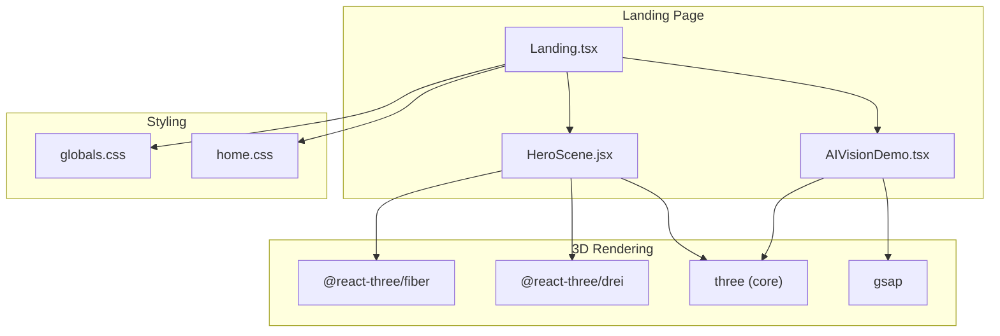
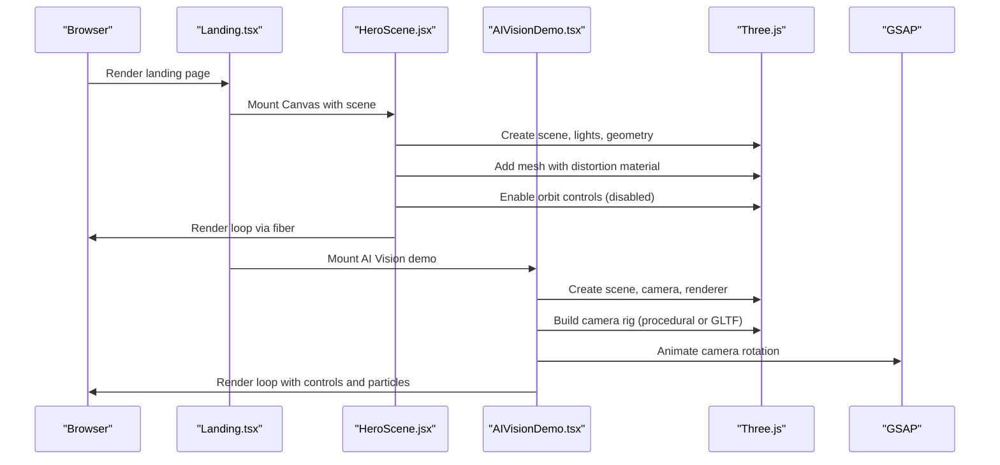
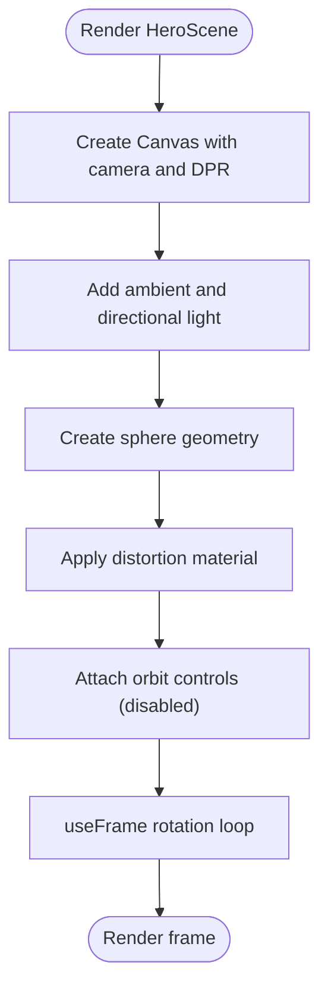
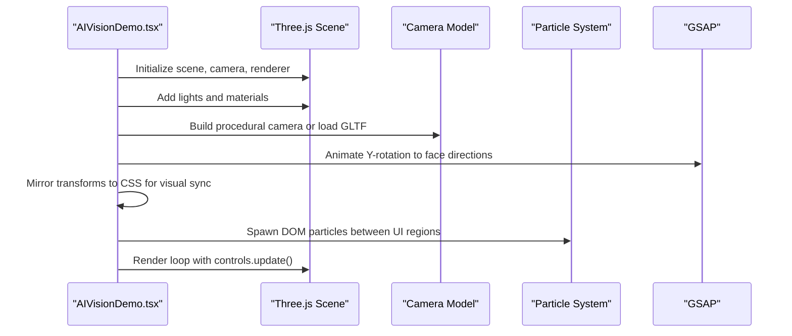
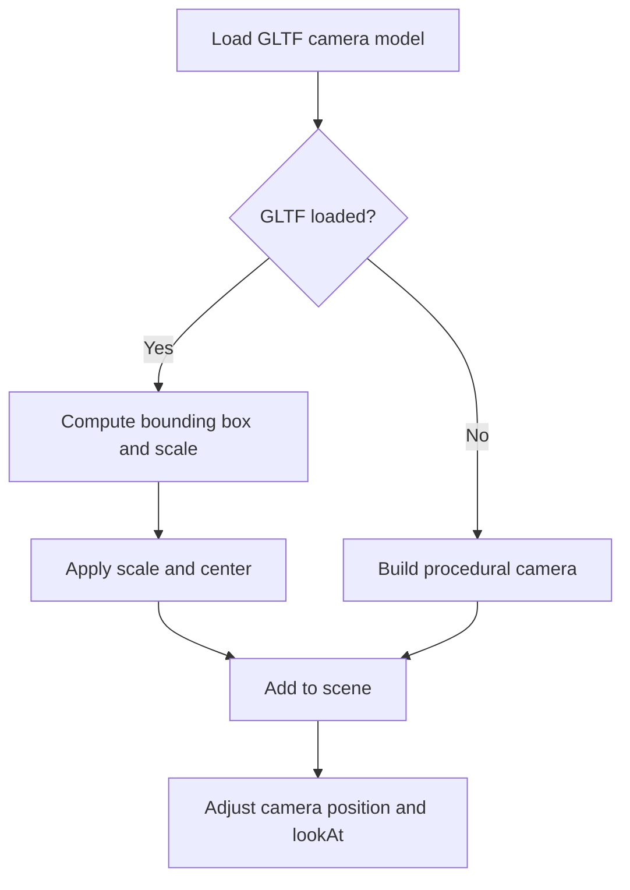
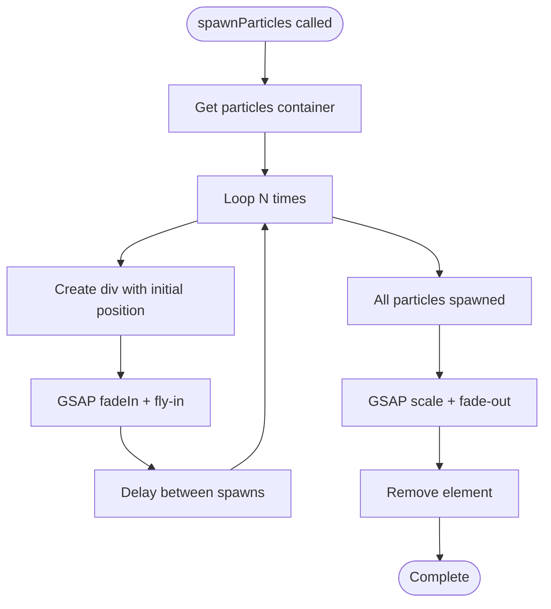
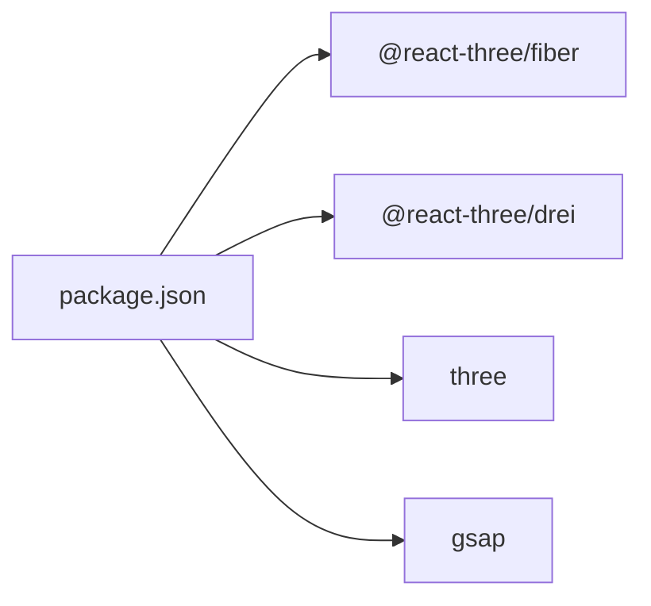

# 3D Visualization System

<cite>
**Referenced Files in This Document**
- [HeroScene.jsx](file://components/3d/HeroScene.jsx)
- [AIVisionDemo.tsx](file://app/home/AIVisionDemo.tsx)
- [Landing.tsx](file://app/home/Landing.tsx)
- [home.css](file://app/home/home.css)
- [globals.css](file://app/globals.css)
- [package.json](file://package.json)
</cite>

## Table of Contents
1. [Introduction](#introduction)
2. [Project Structure](#project-structure)
3. [Core Components](#core-components)
4. [Architecture Overview](#architecture-overview)
5. [Detailed Component Analysis](#detailed-component-analysis)
6. [Dependency Analysis](#dependency-analysis)
7. [Performance Considerations](#performance-considerations)
8. [Troubleshooting Guide](#troubleshooting-guide)
9. [Conclusion](#conclusion)

## Introduction
This document explains the 3D visualization system powering the Zeex AI website. It covers two primary experiences:
- Hero 3D Camera Scene: A lightweight, immersive rotating camera visualization using React Three Fiber and Three.js for the landing page.
- AI Vision Demonstration: An interactive, real-time video processing simulation featuring a 3D camera rig, particle data streams, and dashboard visuals.

The documentation details scene setup, lighting, materials, animation timing, camera behaviors, particle systems, and performance optimizations. It also provides guidance on customizing assets, extending functionality, and integrating with the overall page layout.

## Project Structure
The 3D system spans several files:
- Hero 3D Scene: Implemented with React Three Fiber for the hero area.
- AI Vision Demo: A self-contained component combining Three.js for 3D rendering, GSAP for animations, and CSS/HTML for UI panels.
- Global and component styles: Provide positioning, blending modes, and visual overlays for the 3D scenes.

**Diagram sources**
- [Landing.tsx:802-860](file://app/home/Landing.tsx#L802-L860)
- [HeroScene.jsx:1-37](file://components/3d/HeroScene.jsx#L1-L37)
- [AIVisionDemo.tsx:11-213](file://app/home/AIVisionDemo.tsx#L11-L213)
- [package.json:11-21](file://package.json#L11-L21)

**Section sources**
- [Landing.tsx:802-860](file://app/home/Landing.tsx#L802-L860)
- [HeroScene.jsx:1-37](file://components/3d/HeroScene.jsx#L1-L37)
- [AIVisionDemo.tsx:11-213](file://app/home/AIVisionDemo.tsx#L11-L213)
- [package.json:11-21](file://package.json#L11-L21)

## Core Components
- Hero 3D Camera Scene (React Three Fiber): A floating, rotating sphere with distortion material inside a Canvas. It uses ambient and directional lighting, orbit controls configured to disable movement, and a suspense boundary for asset loading.
- AI Vision Demo (Three.js + GSAP): A full-featured pipeline that renders a 3D camera model (procedural or GLTF), animates it, spawns particle data flows, and orchestrates dashboard interactions and auto-cycling.

Key runtime behaviors:
- Hero scene rotates continuously at a controlled frame rate.
- AI Vision camera rotates to face directions with GSAP easing and mirrors 3D transforms to CSS for visual consistency.
- Particle system spawns animated DOM elements to simulate data flow between UI regions.

**Section sources**
- [HeroScene.jsx:23-36](file://components/3d/HeroScene.jsx#L23-L36)
- [AIVisionDemo.tsx:180-202](file://app/home/AIVisionDemo.tsx#L180-L202)
- [AIVisionDemo.tsx:216-254](file://app/home/AIVisionDemo.tsx#L216-L254)

## Architecture Overview
The system blends React Three Fiber for lightweight hero visuals and a custom Three.js implementation for the AI Vision demo. Both rely on shared styling for overlay effects and responsive layouts.

**Diagram sources**
- [Landing.tsx:802-860](file://app/home/Landing.tsx#L802-L860)
- [HeroScene.jsx:23-36](file://components/3d/HeroScene.jsx#L23-L36)
- [AIVisionDemo.tsx:38-213](file://app/home/AIVisionDemo.tsx#L38-L213)

## Detailed Component Analysis

### Hero 3D Camera Scene (React Three Fiber)
This component creates a floating, rotating sphere with a distortion material inside a Canvas. Lighting is minimal to emphasize the material effect, and orbit controls are disabled to maintain a static, immersive background.

Implementation highlights:
- Scene setup: Canvas with device pixel ratio tuning and camera configuration.
- Geometry and material: Sphere with MeshDistortMaterial for a fluid, shimmering appearance.
- Animation: useFrame rotates the mesh at a constant speed.
- Controls: OrbitControls configured to disable zoom, pan, and rotate for a stable background.

**Diagram sources**
- [HeroScene.jsx:23-36](file://components/3d/HeroScene.jsx#L23-L36)
- [HeroScene.jsx:7-21](file://components/3d/HeroScene.jsx#L7-L21)

**Section sources**
- [HeroScene.jsx:23-36](file://components/3d/HeroScene.jsx#L23-L36)
- [HeroScene.jsx:7-21](file://components/3d/HeroScene.jsx#L7-L21)

### AI Vision Demonstration (Three.js + GSAP)
The AI Vision Demo composes a full-featured 3D visualization with:
- 3D Camera Rig: Built procedurally or loaded from a GLTF model with scaling and positioning adjustments.
- Lighting and Materials: Body, accent, and lens materials using MeshStandardMaterial and MeshPhysicalMaterial.
- Camera Controls: OrbitControls with damping and autoRotate disabled.
- Auto-Cycle Animation: GSAP-driven rotations and CSS transforms synchronized for visual consistency.
- Particle Data Streams: DOM-based particles spawned between UI regions to simulate data flow.
- Dashboard Interactions: Feed selection, image uploads, and video playback orchestration.

**Diagram sources**
- [AIVisionDemo.tsx:38-213](file://app/home/AIVisionDemo.tsx#L38-L213)
- [AIVisionDemo.tsx:180-202](file://app/home/AIVisionDemo.tsx#L180-L202)
- [AIVisionDemo.tsx:216-254](file://app/home/AIVisionDemo.tsx#L216-L254)

**Section sources**
- [AIVisionDemo.tsx:38-213](file://app/home/AIVisionDemo.tsx#L38-L213)
- [AIVisionDemo.tsx:180-202](file://app/home/AIVisionDemo.tsx#L180-L202)
- [AIVisionDemo.tsx:216-254](file://app/home/AIVisionDemo.tsx#L216-L254)

### Camera Model Integration and Texture Mapping
- Procedural Model: Constructed from basic primitives (boxes, cylinders, spheres) with distinct materials for body, stripe, arm, barrel, and lens.
- GLTF Loader: Attempts to load a camera model from assets; falls back to procedural construction if loading fails.
- Scaling and Positioning: Computes bounding box, scales to a desired size, and centers the model for consistent framing.

**Diagram sources**
- [AIVisionDemo.tsx:104-137](file://app/home/AIVisionDemo.tsx#L104-L137)

**Section sources**
- [AIVisionDemo.tsx:104-137](file://app/home/AIVisionDemo.tsx#L104-L137)

### Particle System for Data Flow Visualization
The particle system generates animated DOM elements to simulate data movement between UI regions:
- Spawning: Creates a configurable number of particles with randomized end positions.
- Easing: Uses GSAP for smooth entrance and exit transitions with delays between spawns.
- Cleanup: Removes particles after fade-out completes.

**Diagram sources**
- [AIVisionDemo.tsx:216-254](file://app/home/AIVisionDemo.tsx#L216-L254)

**Section sources**
- [AIVisionDemo.tsx:216-254](file://app/home/AIVisionDemo.tsx#L216-L254)

### Lighting Configuration and Animation Timing
- Hero Scene: Ambient and directional lights provide subtle illumination; rotation speed is tuned per-frame.
- AI Vision: Directional and ambient lights with procedural materials; camera rotation timing uses GSAP easing for smooth transitions.
- Render Loop: Both components use requestAnimationFrame or fiber’s internal loop for efficient rendering.

**Section sources**
- [HeroScene.jsx:27-28](file://components/3d/HeroScene.jsx#L27-L28)
- [AIVisionDemo.tsx:51-54](file://app/home/AIVisionDemo.tsx#L51-L54)
- [AIVisionDemo.tsx:168-177](file://app/home/AIVisionDemo.tsx#L168-L177)

### Integration with Page Layout and Animation Framework
- Hero 3D Scene: Positioned absolutely in the hero area with blend mode and z-index for layered composition.
- AI Vision Demo: Integrated into the landing page with responsive panels and dashboard visuals.
- Animations: Framer Motion and GSAP coordinate page-wide animations with 3D transitions.

**Section sources**
- [Landing.tsx:802-860](file://app/home/Landing.tsx#L802-L860)
- [globals.css:411-427](file://app/globals.css#L411-L427)
- [home.css:62-75](file://app/home/home.css#L62-L75)

## Dependency Analysis
External libraries and their roles:
- @react-three/fiber: React renderer for Three.js scenes.
- @react-three/drei: Helpers for controls, environment, and materials.
- three: Core 3D engine for geometries, materials, and rendering.
- gsap: Animation library for camera rotations and UI transitions.

**Diagram sources**
- [package.json:11-21](file://package.json#L11-L21)

**Section sources**
- [package.json:11-21](file://package.json#L11-L21)

## Performance Considerations
- Device Pixel Ratio: Canvas DPR is capped to balance quality and performance.
- Renderer Settings: Antialiasing enabled; alpha transparency used for composited overlays.
- Material Complexity: Distortion material and physical materials are visually rich but can impact FPS on lower-end devices.
- Animation Loops: useFrame and requestAnimationFrame are efficient; avoid unnecessary re-renders by keeping state minimal.
- Asset Loading: GLTF fallback ensures graceful degradation if assets are missing.
- CSS Blending: Mix-blend-mode and overlays add visual polish but can reduce performance on older GPUs.

Recommendations:
- Monitor FPS in production and adjust material complexity or DPR as needed.
- Prefer simpler materials for mobile or low-power devices.
- Defer heavy animations until the user focuses on the hero section.
- Use lazy loading for large assets and pre-warm loaders during idle periods.

[No sources needed since this section provides general guidance]

## Troubleshooting Guide
Common issues and resolutions:
- Missing GLTF Model: The AI Vision demo logs a warning and falls back to a procedural camera. Verify asset paths and network availability.
- Controls Not Responding: Ensure OrbitControls are enabled and not overridden by CSS pointer events.
- Particle Spawning Failures: Confirm container exists and GSAP is initialized before spawning.
- Resolution Jitter on Resize: The AI Vision demo recalculates renderer size and camera aspect on resize; ensure event listeners are attached.

**Section sources**
- [AIVisionDemo.tsx:131-137](file://app/home/AIVisionDemo.tsx#L131-L137)
- [AIVisionDemo.tsx:156-166](file://app/home/AIVisionDemo.tsx#L156-L166)

## Conclusion
The 3D visualization system combines React Three Fiber for a lightweight hero experience and a robust Three.js + GSAP implementation for an immersive AI Vision demo. Together, they deliver a cohesive, performance-conscious presentation of Zeex AI’s surveillance capabilities, with clear pathways for customization, extension, and optimization.