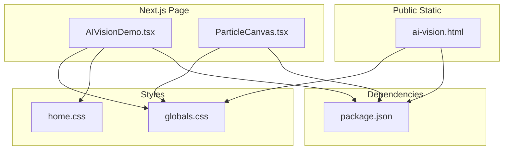
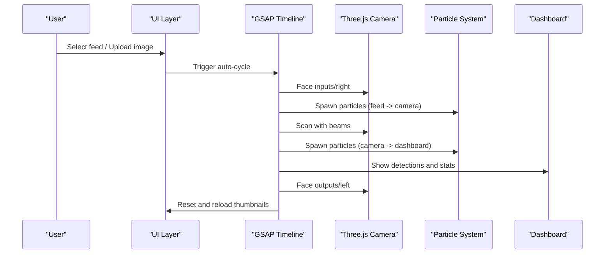
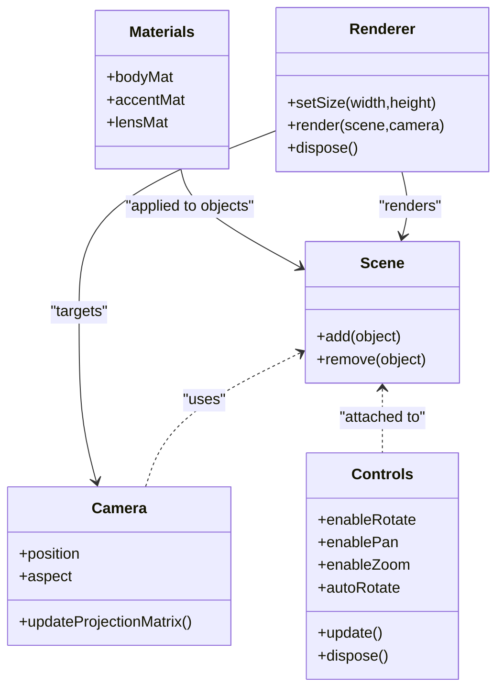
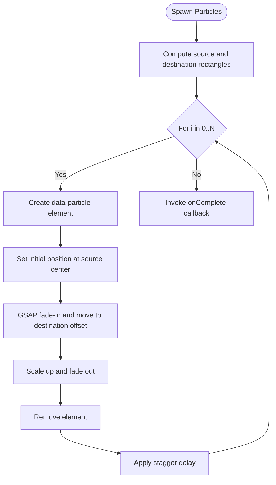
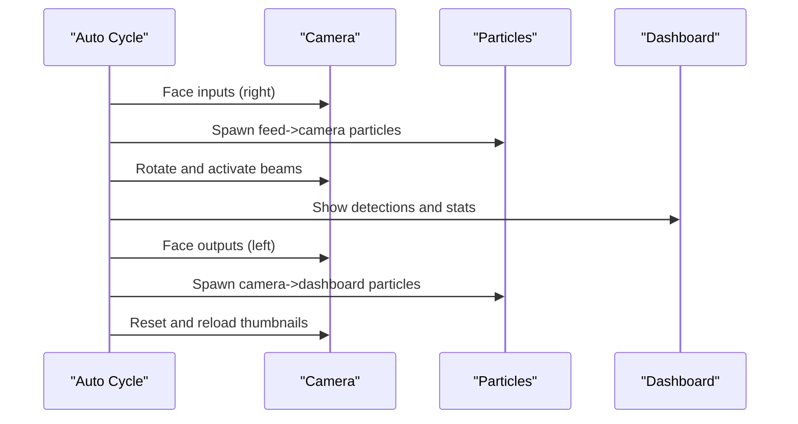
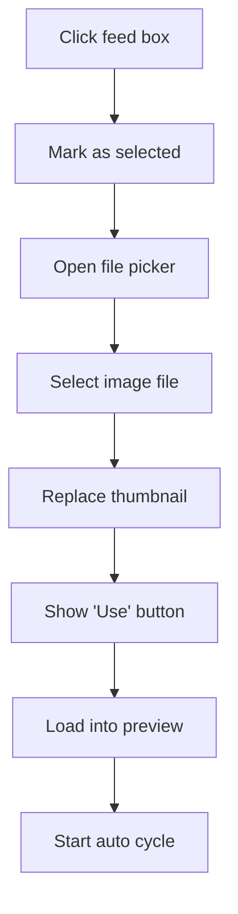
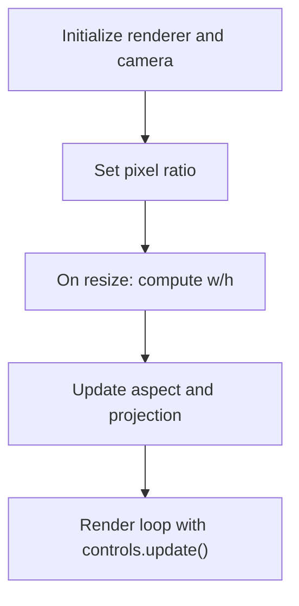
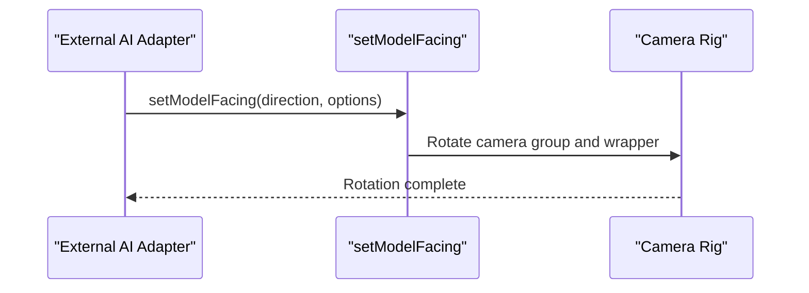
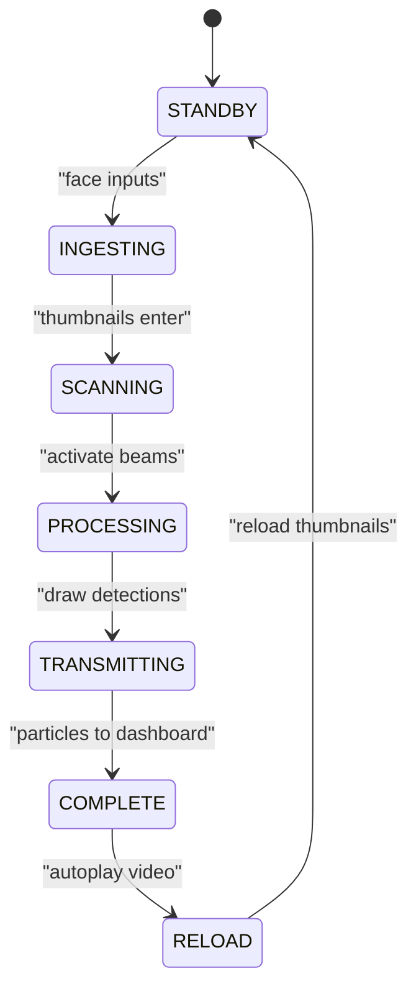
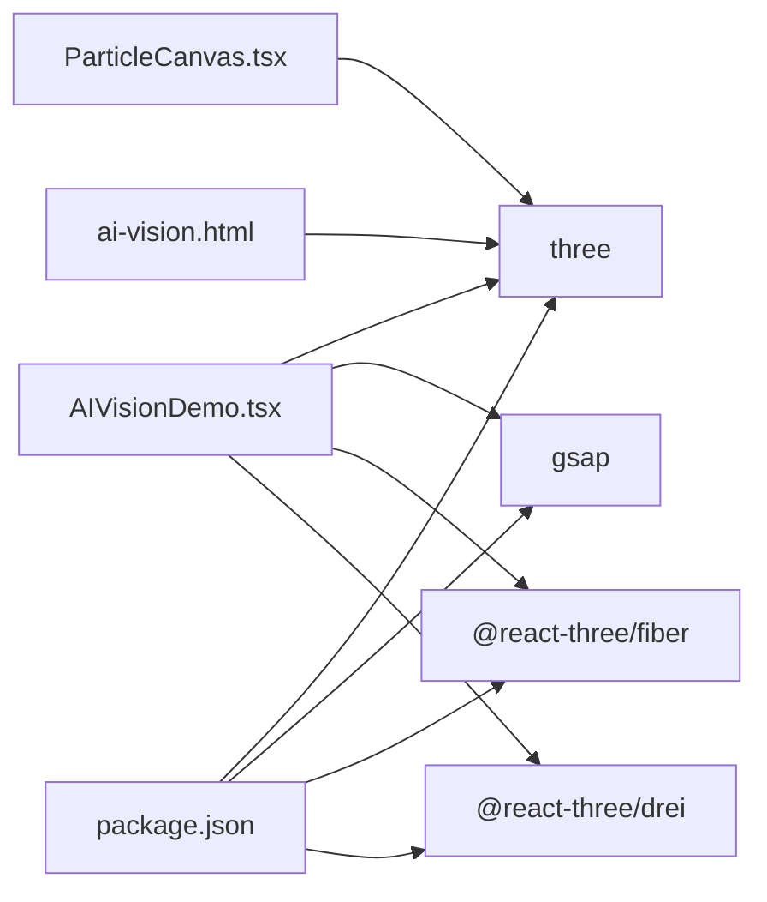

# AI Vision Demonstration

<cite>
**Referenced Files in This Document**
- [AIVisionDemo.tsx](file://app/home/AIVisionDemo.tsx)
- [ParticleCanvas.tsx](file://app/components/ParticleCanvas.tsx)
- [ai-vision.html](file://public/ai-vision.html)
- [home.css](file://app/home/home.css)
- [globals.css](file://app/globals.css)
- [package.json](file://package.json)
</cite>

## Table of Contents
1. [Introduction](#introduction)
2. [Project Structure](#project-structure)
3. [Core Components](#core-components)
4. [Architecture Overview](#architecture-overview)
5. [Detailed Component Analysis](#detailed-component-analysis)
6. [Dependency Analysis](#dependency-analysis)
7. [Performance Considerations](#performance-considerations)
8. [Troubleshooting Guide](#troubleshooting-guide)
9. [Conclusion](#conclusion)
10. [Appendices](#appendices)

## Introduction
This document describes the AI Vision demonstration system that showcases Zeex AI’s surveillance capabilities through a real-time video processing simulation. The system combines:
- A 3D camera rig rendered with Three.js
- A particle effect system that visualizes data streams and detection outputs
- A simulated AI processing pipeline with animated stages
- HTML Canvas integration and WebGL rendering optimizations
- Performance monitoring and smooth animation playback
- User interaction handling (hover, clicks, and modal-like behaviors)
- Adapter patterns for integrating external AI models
- Physics-based particle generation and visual feedback

The demonstration is implemented in both a Next.js page component and a static HTML page, enabling both server-rendered and standalone demonstrations.

## Project Structure
The AI Vision demo spans multiple files:
- A Next.js page component that integrates Three.js, GSAP, and custom particle rendering
- A dedicated HTML page that replicates the same experience with vanilla JavaScript
- A React component for a background particle canvas
- Global and local CSS for styling and responsive layouts

**Diagram sources**
- [AIVisionDemo.tsx:1-562](file://app/home/AIVisionDemo.tsx#L1-L562)
- [ParticleCanvas.tsx:1-71](file://app/components/ParticleCanvas.tsx#L1-L71)
- [ai-vision.html:1-616](file://public/ai-vision.html#L1-L616)
- [globals.css:1-800](file://app/globals.css#L1-L800)
- [home.css:1690-1748](file://app/home/home.css#L1690-L1748)
- [package.json:1-31](file://package.json#L1-L31)

**Section sources**
- [AIVisionDemo.tsx:1-562](file://app/home/AIVisionDemo.tsx#L1-L562)
- [ParticleCanvas.tsx:1-71](file://app/components/ParticleCanvas.tsx#L1-L71)
- [ai-vision.html:1-616](file://public/ai-vision.html#L1-L616)
- [globals.css:1-800](file://app/globals.css#L1-L800)
- [home.css:1690-1748](file://app/home/home.css#L1690-L1748)
- [package.json:1-31](file://package.json#L1-L31)

## Core Components
- Three.js camera rig with GLTF loader fallback and OrbitControls
- GSAP-driven animations for camera facing, scanning beams, and particle effects
- Particle system for data stream visualization
- Simulated AI processing pipeline with dashboard output
- User interaction handlers for feed selection, file uploads, and auto-cycle
- Background particle canvas for ambient visuals

Key responsibilities:
- Scene setup and lighting
- Model loading and scaling
- Real-time camera movement and controls
- Particle spawning and lifecycle
- Timeline orchestration of processing stages
- Dashboard updates and stats display

**Section sources**
- [AIVisionDemo.tsx:37-213](file://app/home/AIVisionDemo.tsx#L37-L213)
- [AIVisionDemo.tsx:215-254](file://app/home/AIVisionDemo.tsx#L215-L254)
- [AIVisionDemo.tsx:256-437](file://app/home/AIVisionDemo.tsx#L256-L437)
- [ParticleCanvas.tsx:5-70](file://app/components/ParticleCanvas.tsx#L5-L70)

## Architecture Overview
The system is composed of two primary demonstrations:
- Next.js component-based implementation with React hooks and Three.js
- Standalone HTML page with vanilla JS and Three.js

Both share the same visual pipeline:
- Input feeds (thumbnails)
- Camera rig with scanning beams
- Particle effects representing data flow
- Dashboard output and stats
- Auto-cycle orchestration

**Diagram sources**
- [AIVisionDemo.tsx:336-437](file://app/home/AIVisionDemo.tsx#L336-L437)
- [ai-vision.html:535-595](file://public/ai-vision.html#L535-L595)

## Detailed Component Analysis

### Three.js Camera Rig and Controls
- Scene initialization with directional and ambient lights
- Materials for camera body, accent, and lens
- Procedural camera model with primitives and optional GLTF model
- OrbitControls configured for rotate-only behavior
- Perspective camera with dynamic aspect ratio on resize
- Auto-rotation disabled; manual rotation via drag

**Diagram sources**
- [AIVisionDemo.tsx:42-147](file://app/home/AIVisionDemo.tsx#L42-L147)

**Section sources**
- [AIVisionDemo.tsx:37-147](file://app/home/AIVisionDemo.tsx#L37-L147)

### Particle Effect System
- Data particles: DOM-managed divs with GSAP tweens for opacity, position, and scale
- Generation algorithm:
  - Spawn N particles from a source rectangle to a destination rectangle
  - Randomized end offsets for scatter effect
  - Staggered delays to create a continuous stream
  - Fade-in/out with easing and removal on completion
- Background particle canvas:
  - 2D canvas with per-frame clearing and particle updates
  - Boundary collisions for particles
  - Transparent clears to avoid residual artifacts

**Diagram sources**
- [AIVisionDemo.tsx:215-254](file://app/home/AIVisionDemo.tsx#L215-L254)
- [ai-vision.html:418-426](file://public/ai-vision.html#L418-L426)
- [ParticleCanvas.tsx:25-66](file://app/components/ParticleCanvas.tsx#L25-L66)

**Section sources**
- [AIVisionDemo.tsx:215-254](file://app/home/AIVisionDemo.tsx#L215-L254)
- [ai-vision.html:418-426](file://public/ai-vision.html#L418-L426)
- [ParticleCanvas.tsx:25-66](file://app/components/ParticleCanvas.tsx#L25-L66)

### AI Processing Pipeline Simulation
- Stages:
  - Ingestion: thumbnails enter camera field
  - Scanning: camera rotates and scanning beams activate
  - Processing: “processing…” status and optional overlay drawing
  - Transmission: particles flow to dashboard
  - Output: detections list and stats revealed
- Auto-cycle orchestrates the above with timing and camera facing
- Manual mode available via scene thumbnails

**Diagram sources**
- [AIVisionDemo.tsx:336-437](file://app/home/AIVisionDemo.tsx#L336-L437)
- [ai-vision.html:428-485](file://public/ai-vision.html#L428-L485)

**Section sources**
- [AIVisionDemo.tsx:336-437](file://app/home/AIVisionDemo.tsx#L336-L437)
- [ai-vision.html:428-485](file://public/ai-vision.html#L428-L485)

### User Interaction Handling
- Feed selection:
  - Clicking a feed box selects it and opens the file picker
  - “Use” button loads the selected thumbnail into the preview
- File upload:
  - Reads image data and replaces the feed thumbnail
- Auto-cycle:
  - Waits for Three.js model-facing capability to be ready
  - Executes a loop of ingestion, processing, and output
- Manual scenes:
  - Thumbnail bar triggers predefined scenes with timelines

**Diagram sources**
- [AIVisionDemo.tsx:256-317](file://app/home/AIVisionDemo.tsx#L256-L317)
- [ai-vision.html:489-518](file://public/ai-vision.html#L489-L518)

**Section sources**
- [AIVisionDemo.tsx:256-317](file://app/home/AIVisionDemo.tsx#L256-L317)
- [ai-vision.html:489-518](file://public/ai-vision.html#L489-L518)

### HTML Canvas Integration and WebGL Rendering Optimizations
- Three.js renderer configured with transparency and antialiasing
- Pixel ratio clamped to prevent oversampling on high-DPI displays
- Resize handler computes new width/height and updates projection matrix
- OrbitControls damping for smooth camera movement
- Optional GLTF model with fallback to procedural geometry

**Diagram sources**
- [AIVisionDemo.tsx:42-166](file://app/home/AIVisionDemo.tsx#L42-L166)

**Section sources**
- [AIVisionDemo.tsx:42-166](file://app/home/AIVisionDemo.tsx#L42-L166)

### Adapter Pattern for External AI Models
- The system exposes a model-facing helper that can be invoked by external integrations
- In the Next.js version, a ref-based helper is exposed for programmatic camera rotation
- In the HTML version, a global helper is attached to the window for external scripts to call

**Diagram sources**
- [AIVisionDemo.tsx:180-202](file://app/home/AIVisionDemo.tsx#L180-L202)
- [ai-vision.html:320-335](file://public/ai-vision.html#L320-L335)

**Section sources**
- [AIVisionDemo.tsx:180-202](file://app/home/AIVisionDemo.tsx#L180-L202)
- [ai-vision.html:320-335](file://public/ai-vision.html#L320-L335)

### Visual Feedback Systems
- Status indicators:
  - LED light color changes to reflect stage (standby, scanning, processing, transmitting)
  - Status text updates during each stage
- Scanning beams:
  - Left and right beams activate during scanning/transmission
- Dashboard:
  - Detection cards appear with labels and confidence bars
  - Stats panel shows object count, processing time, and accuracy

**Diagram sources**
- [AIVisionDemo.tsx:362-380](file://app/home/AIVisionDemo.tsx#L362-L380)
- [ai-vision.html:443-467](file://public/ai-vision.html#L443-L467)

**Section sources**
- [AIVisionDemo.tsx:362-380](file://app/home/AIVisionDemo.tsx#L362-L380)
- [ai-vision.html:443-467](file://public/ai-vision.html#L443-L467)

## Dependency Analysis
- Runtime dependencies:
  - Three.js for 3D rendering and GLTF loading
  - GSAP for smooth animations and timelines
  - OrbitControls for camera manipulation
  - Next.js and React for the component-based implementation
- Development dependencies:
  - Puppeteer for recording demo frames
  - TypeScript for type safety

**Diagram sources**
- [AIVisionDemo.tsx:3-7](file://app/home/AIVisionDemo.tsx#L3-L7)
- [ParticleCanvas.tsx:1-3](file://app/components/ParticleCanvas.tsx#L1-L3)
- [ai-vision.html:197-337](file://public/ai-vision.html#L197-L337)
- [package.json:11-21](file://package.json#L11-L21)

**Section sources**
- [package.json:11-21](file://package.json#L11-L21)

## Performance Considerations
- Rendering optimizations:
  - Clamp device pixel ratio to prevent oversampling on high-DPI screens
  - Use antialiasing judiciously; disable where unnecessary
  - Dispose of resources (renderer, controls) on unmount
- Animation performance:
  - Prefer GSAP for smooth, requestAnimationFrame-backed tweens
  - Avoid frequent DOM reflows; batch updates when possible
- Particle system:
  - Limit particle count in the background canvas to maintain FPS
  - Clear canvas efficiently each frame
- Memory management:
  - Cancel animation frames and kill tweens on cleanup
  - Remove event listeners and DOM nodes when unmounting
- Browser compatibility:
  - Ensure ES modules for Three.js and OrbitControls
  - Test across browsers; polyfills may be needed for older environments

[No sources needed since this section provides general guidance]

## Troubleshooting Guide
- GLTF model not loading:
  - The system falls back to a procedural camera model if GLTF fails
  - Verify asset path and CORS policy
- Camera not facing correctly:
  - Ensure the model-facing helper is ready before invoking
  - Check that the camera group exists and is rotated
- Particles not appearing:
  - Confirm particle container exists and styles are applied
  - Verify GSAP is loaded and animations are not killed prematurely
- Video playback issues:
  - Autoplay requires muted playback; unmute after end
  - Handle errors gracefully if autoplay fails

**Section sources**
- [AIVisionDemo.tsx:104-137](file://app/home/AIVisionDemo.tsx#L104-L137)
- [AIVisionDemo.tsx:414-429](file://app/home/AIVisionDemo.tsx#L414-L429)
- [ai-vision.html:570-579](file://public/ai-vision.html#L570-L579)

## Conclusion
The AI Vision demonstration provides a compelling, real-time simulation of Zeex AI’s surveillance pipeline. Through Three.js, GSAP, and a custom particle system, it visualizes data ingestion, processing, and output in an engaging, interactive way. The dual implementation (Next.js and HTML) ensures flexibility across deployment scenarios, while the adapter pattern enables integration with external AI models. With careful attention to performance and user interaction, the system delivers a smooth, immersive experience suitable for showcasing Zeex AI’s capabilities.

[No sources needed since this section summarizes without analyzing specific files]

## Appendices

### Customization Guide
- Adjusting particle parameters:
  - Modify count, size, and colors in the particle arrays
  - Tune spawn rates and delays for different flow speeds
- Changing camera behavior:
  - Adjust auto-rotate, damping factor, and orbit limits
  - Update material properties for different visual themes
- Extending the AI pipeline:
  - Add new stages by extending the timeline
  - Integrate external model calls via the model-facing helper
- Adding new visualization effects:
  - Extend the particle system with new shapes or trails
  - Introduce post-processing effects using Three.js passes

[No sources needed since this section provides general guidance]