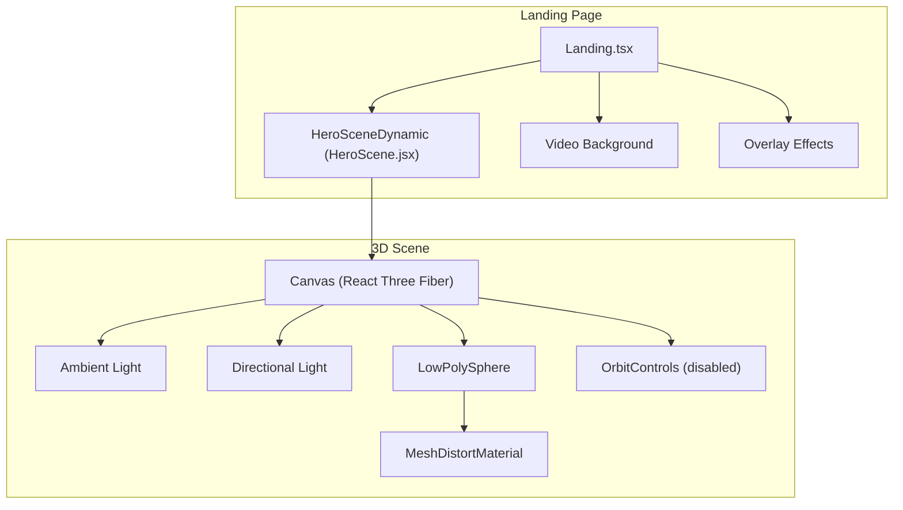
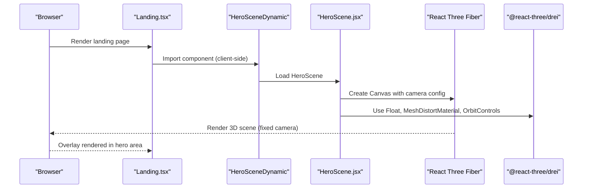
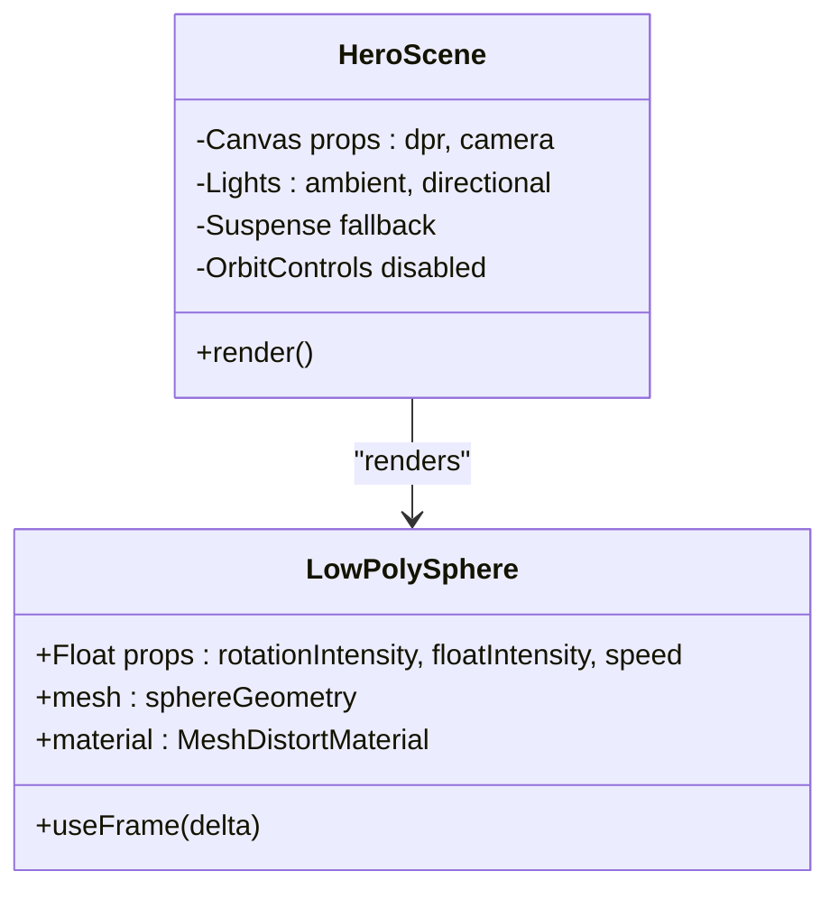
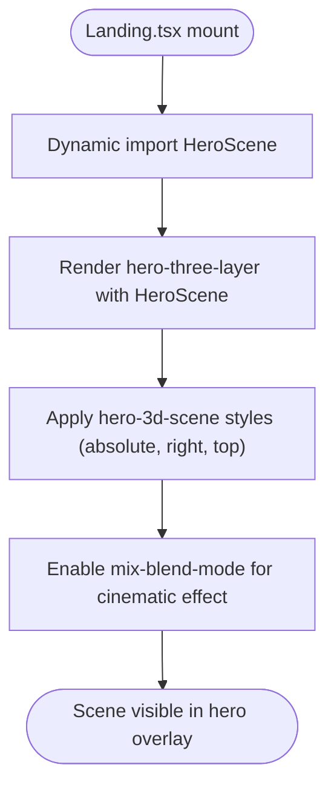
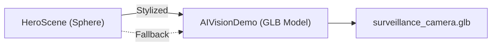
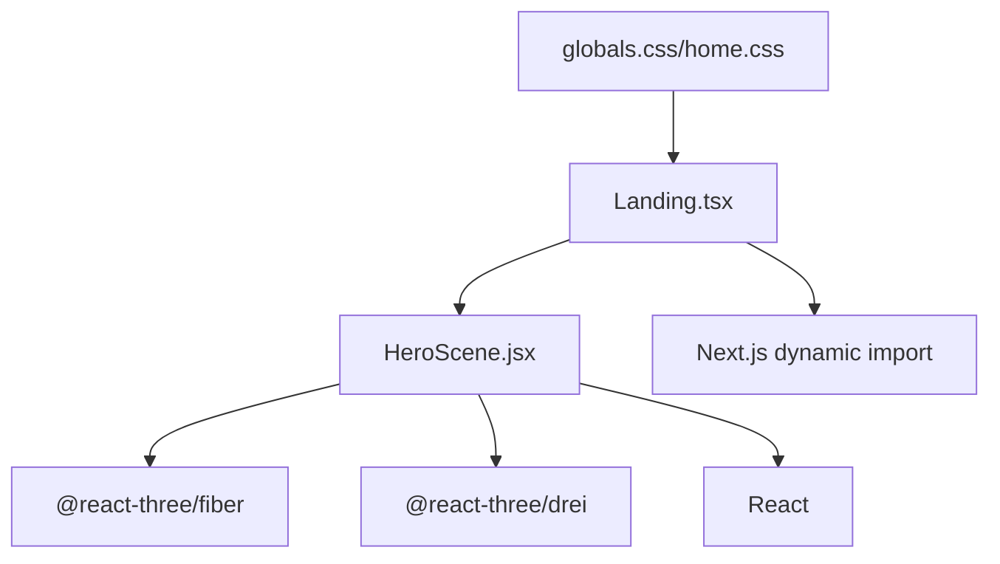

# Hero 3D Camera Scene

<cite>
**Referenced Files in This Document**
- [HeroScene.jsx](file://components/3d/HeroScene.jsx)
- [Landing.tsx](file://app/home/Landing.tsx)
- [AIVisionDemo.tsx](file://app/home/AIVisionDemo.tsx)
- [home.css](file://app/home/home.css)
- [globals.css](file://app/globals.css)
- [ai-vision.html](file://public/ai-vision.html)
- [surveillance_camera.glb](file://public/assets/surveillance-cctv-camera/source/surveillance_camera.glb)
</cite>

## Table of Contents
1. [Introduction](#introduction)
2. [Project Structure](#project-structure)
3. [Core Components](#core-components)
4. [Architecture Overview](#architecture-overview)
5. [Detailed Component Analysis](#detailed-component-analysis)
6. [Dependency Analysis](#dependency-analysis)
7. [Performance Considerations](#performance-considerations)
8. [Troubleshooting Guide](#troubleshooting-guide)
9. [Conclusion](#conclusion)

## Introduction
The Hero 3D Camera Scene is a React Three Fiber-based visualization component designed to render a stylized rotating surveillance camera model within the landing page hero section. It leverages @react-three/fiber and @react-three/drei to create an immersive, low-polygon sphere with a metallic, distorted appearance that subtly rotates to draw attention without interfering with the page's primary content. The scene is integrated into the main landing page as a non-intrusive overlay positioned in the upper-right corner, complementing the hero video background and cinematic effects.

## Project Structure
The Hero 3D Camera Scene is implemented as a standalone React component and integrated into the landing page via dynamic import for client-side rendering. The component uses a simple geometry and material combination to achieve a visually appealing, performance-friendly result.

**Diagram sources**
- [Landing.tsx:48-58](file://app/home/Landing.tsx#L48-L58)
- [HeroScene.jsx:23-36](file://components/3d/HeroScene.jsx#L23-L36)

**Section sources**
- [HeroScene.jsx:1-37](file://components/3d/HeroScene.jsx#L1-L37)
- [Landing.tsx:810-824](file://app/home/Landing.tsx#L810-L824)
- [globals.css:410-427](file://app/globals.css#L410-L427)

## Core Components
- HeroScene (React Component): Renders a rotating, floating sphere with a distorted metallic material inside a Canvas. It disables camera controls and uses a fixed camera position and field of view optimized for the hero area.
- LowPolySphere (Scene Object): A simple sphere geometry with a custom MeshDistortMaterial that applies distortion, roughness, and metalness for a glossy, reflective appearance.
- Landing Integration: The HeroScene is dynamically imported and rendered as part of the hero overlay, positioned absolutely in the upper-right corner of the hero section.

Key implementation highlights:
- Camera setup: Fixed position and FOV to frame the rotating object within the hero viewport.
- Lighting: Ambient and directional lights provide balanced illumination for the material properties.
- Controls: OrbitControls are disabled to maintain a static, centered focus on the rotating object.
- Responsive sizing: The scene container adapts to viewport constraints while maintaining aspect ratio.

**Section sources**
- [HeroScene.jsx:7-21](file://components/3d/HeroScene.jsx#L7-L21)
- [HeroScene.jsx:23-36](file://components/3d/HeroScene.jsx#L23-L36)
- [Landing.tsx:48-58](file://app/home/Landing.tsx#L48-L58)
- [globals.css:410-427](file://app/globals.css#L410-L427)

## Architecture Overview
The Hero 3D Camera Scene is a self-contained module that composes a minimal 3D scene using React Three Fiber primitives. It is intentionally lightweight to avoid impacting the landing page's performance and responsiveness.

**Diagram sources**
- [Landing.tsx:48-58](file://app/home/Landing.tsx#L48-L58)
- [HeroScene.jsx:23-36](file://components/3d/HeroScene.jsx#L23-L36)

## Detailed Component Analysis

### HeroScene Component
The HeroScene component defines the entire 3D scene, including geometry, materials, lighting, and animation behavior.

**Diagram sources**
- [HeroScene.jsx:7-21](file://components/3d/HeroScene.jsx#L7-L21)
- [HeroScene.jsx:23-36](file://components/3d/HeroScene.jsx#L23-L36)

Implementation details:
- Geometry: Sphere with specific segmentation parameters for a low-polygon aesthetic.
- Material: MeshDistortMaterial with color, distortion, speed, roughness, and metalness settings to achieve a glossy, reflective surface.
- Animation: useFrame updates the sphere's Y-axis rotation incrementally per frame using delta time for smoothness.
- Lighting: Ambient light provides base illumination; directional light adds depth and highlights.
- Controls: OrbitControls are disabled to keep the scene static and focused.

**Section sources**
- [HeroScene.jsx:7-21](file://components/3d/HeroScene.jsx#L7-L21)
- [HeroScene.jsx:23-36](file://components/3d/HeroScene.jsx#L23-L36)

### Integration with Landing Page
The HeroScene is integrated into the landing page as a non-intrusive overlay within the hero section. It is dynamically imported to ensure client-side rendering and is positioned absolutely in the upper-right corner.

**Diagram sources**
- [Landing.tsx:48-58](file://app/home/Landing.tsx#L48-L58)
- [Landing.tsx:810-824](file://app/home/Landing.tsx#L810-L824)
- [globals.css:410-427](file://app/globals.css#L410-L427)

Integration specifics:
- Dynamic import ensures the component loads only on the client, avoiding SSR overhead.
- The hero-three-layer wrapper places the scene as an overlay above the video background.
- Styles define responsive sizing and blend mode for visual cohesion with the hero theme.

**Section sources**
- [Landing.tsx:48-58](file://app/home/Landing.tsx#L48-L58)
- [Landing.tsx:810-824](file://app/home/Landing.tsx#L810-L824)
- [globals.css:410-427](file://app/globals.css#L410-L427)

### Relationship to Other Camera Visualizations
While the HeroScene uses a stylized sphere, the project also includes a more detailed camera visualization in AIVisionDemo that loads a GLB model. This demonstrates a scalable approach where the hero scene can be upgraded to a full 3D model when performance and asset availability permit.

**Diagram sources**
- [AIVisionDemo.tsx:104-137](file://app/home/AIVisionDemo.tsx#L104-L137)
- [surveillance_camera.glb](file://public/assets/surveillance-cctv-camera/source/surveillance_camera.glb)

Comparison highlights:
- HeroScene: Procedural geometry with a single material, optimized for performance.
- AIVisionDemo: Loads a GLB model with multiple materials and supports interactive orbit controls.

**Section sources**
- [AIVisionDemo.tsx:104-137](file://app/home/AIVisionDemo.tsx#L104-L137)
- [surveillance_camera.glb](file://public/assets/surveillance-cctv-camera/source/surveillance_camera.glb)

## Dependency Analysis
The HeroScene component relies on a minimal set of external libraries and follows a layered dependency structure.

**Diagram sources**
- [HeroScene.jsx:3-5](file://components/3d/HeroScene.jsx#L3-L5)
- [Landing.tsx:48-58](file://app/home/Landing.tsx#L48-L58)
- [globals.css:410-427](file://app/globals.css#L410-L427)
- [home.css:1-200](file://app/home/home.css#L1-L200)

Dependencies:
- @react-three/fiber: Provides the WebGL rendering context and hooks for animation frames.
- @react-three/drei: Supplies convenient helpers like Float, MeshDistortMaterial, and OrbitControls.
- Next.js dynamic import: Ensures client-side-only rendering for the hero scene.

**Section sources**
- [HeroScene.jsx:3-5](file://components/3d/HeroScene.jsx#L3-L5)
- [Landing.tsx:48-58](file://app/home/Landing.tsx#L48-L58)

## Performance Considerations
- Rendering pipeline: The scene uses a single, low-polygon geometry with a single material, minimizing draw calls and GPU load.
- Frame rate control: useFrame leverages delta time to ensure smooth animation across varying frame rates.
- Camera configuration: Fixed camera position and FOV reduce unnecessary calculations compared to dynamic camera movements.
- Overlay placement: The scene is placed as an overlay with mix-blend-mode, avoiding heavy repaints on underlying content.
- Responsive sizing: Container styles adapt to viewport constraints while keeping the canvas at 100% size for crisp rendering.

Optimization strategies:
- Keep geometry low-polygon for the hero scene to maintain performance on lower-end devices.
- Limit the number of animated objects; the current implementation satisfies the hero's visual needs with a single rotating object.
- Use device pixel ratio clamping to balance quality and performance (as seen in other 3D components in the project).

**Section sources**
- [HeroScene.jsx:7-21](file://components/3d/HeroScene.jsx#L7-L21)
- [HeroScene.jsx:23-36](file://components/3d/HeroScene.jsx#L23-L36)
- [globals.css:410-427](file://app/globals.css#L410-L427)

## Troubleshooting Guide
Common issues and resolutions:
- Scene not rendering:
  - Verify client-side rendering: The component is dynamically imported; ensure it loads after hydration.
  - Check for missing dependencies: Confirm @react-three/fiber and @react-three/drei are installed.
- Poor performance:
  - Reduce device pixel ratio or simplify geometry/materials further.
  - Disable blend modes temporarily to isolate rendering bottlenecks.
- Misalignment or scaling:
  - Inspect hero-3d-scene styles for conflicts with other overlays.
  - Ensure the container maintains aspect ratio and is sized appropriately for the hero area.

Integration checks:
- Dynamic import: Confirm the dynamic import resolves to the component and executes client-side.
- Overlay stacking: Verify z-index and mix-blend-mode are applied correctly to avoid visual clipping.

**Section sources**
- [Landing.tsx:48-58](file://app/home/Landing.tsx#L48-L58)
- [globals.css:410-427](file://app/globals.css#L410-L427)

## Conclusion
The Hero 3D Camera Scene provides an elegant, lightweight 3D enhancement to the landing page hero section. By combining a simple geometry with a carefully tuned material and subtle animation, it draws attention without overwhelming the user experience. Its modular design allows for easy upgrades to a full 3D model when assets and performance requirements justify it, while maintaining backward compatibility through the existing procedural approach.