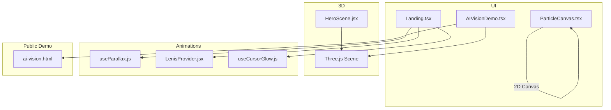
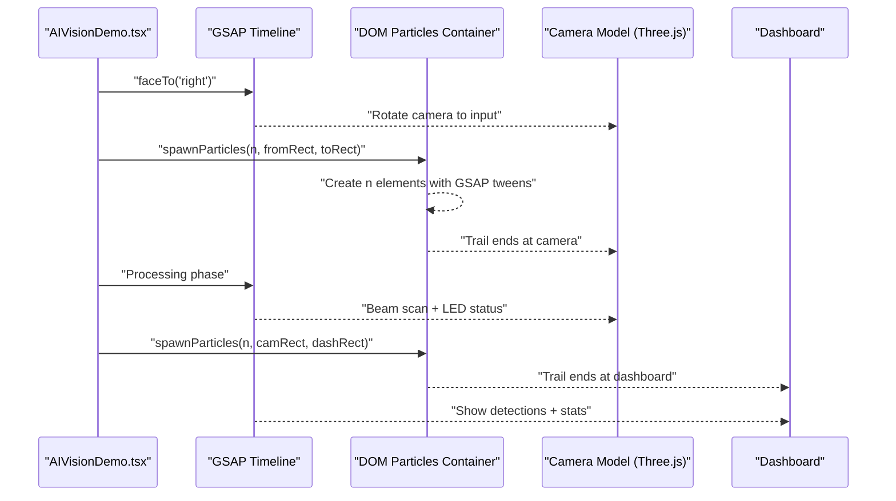
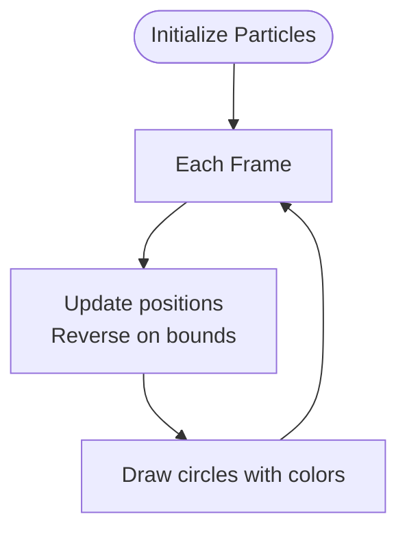
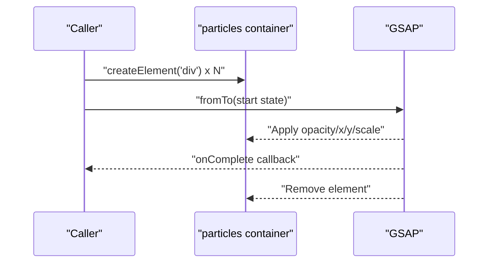
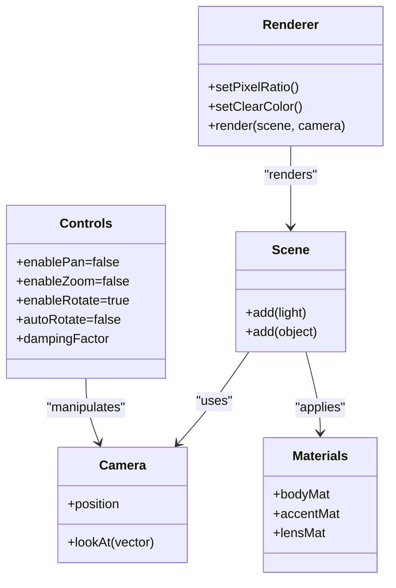
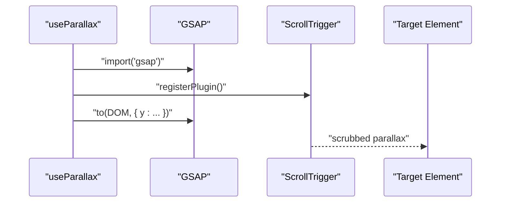
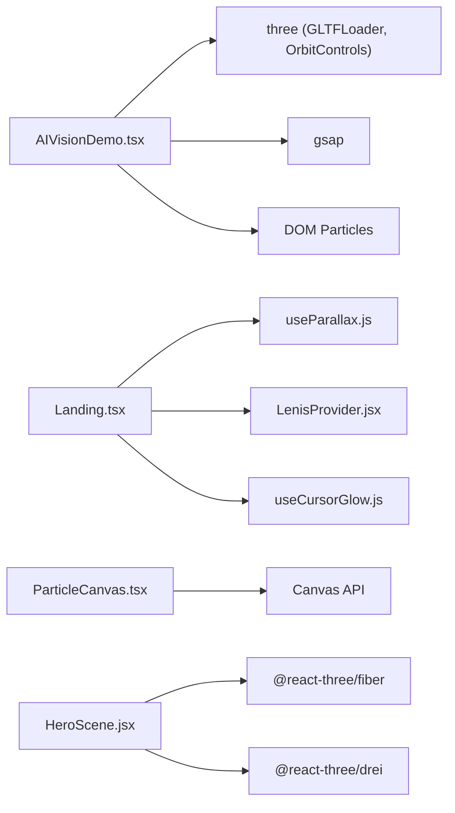

# Particle Systems & Data Visualization

<cite>
**Referenced Files in This Document**
- [ParticleCanvas.tsx](file://app/components/ParticleCanvas.tsx)
- [HeroScene.jsx](file://components/3d/HeroScene.jsx)
- [AIVisionDemo.tsx](file://app/home/AIVisionDemo.tsx)
- [Landing.tsx](file://app/home/Landing.tsx)
- [useParallax.js](file://components/animations/useParallax.js)
- [LenisProvider.jsx](file://components/animations/LenisProvider.jsx)
- [useCursorGlow.js](file://components/animations/useCursorGlow.js)
- [ai-vision.html](file://public/ai-vision.html)
- [home.css](file://app/home/home.css)
</cite>

## Table of Contents
1. [Introduction](#introduction)
2. [Project Structure](#project-structure)
3. [Core Components](#core-components)
4. [Architecture Overview](#architecture-overview)
5. [Detailed Component Analysis](#detailed-component-analysis)
6. [Dependency Analysis](#dependency-analysis)
7. [Performance Considerations](#performance-considerations)
8. [Troubleshooting Guide](#troubleshooting-guide)
9. [Conclusion](#conclusion)
10. [Appendices](#appendices)

## Introduction
This document explains the particle systems and data visualization components used to represent real-time surveillance data streams. It covers:
- Particle generation and movement algorithms
- Physics-like behaviors and rendering optimizations
- Data flow visualization using particle trails, network connections, and status indicators
- Integration with GSAP animations and scroll-driven interactions
- Performance strategies for managing large numbers of particles
- Color schemes, opacity transitions, and visual effects
- Technical specifications for particle properties, emission rates, and lifetimes
- Guidance for customization, creating new patterns, and integrating external data sources
- Memory management, garbage collection, and performance monitoring
- Relationship between particle systems and the broader animation framework

## Project Structure
The particle and visualization features span client-side React components, Three.js scenes, and GSAP-driven animations:
- Canvas-based 2D particle system for background ambiance
- DOM-based particle trails for data flow between UI regions
- Three.js camera model with lighting and materials
- GSAP-driven camera facing, scanning beams, and UI animations
- Scroll-triggered effects and parallax powered by GSAP and Lenis

**Diagram sources**
- [Landing.tsx:1-800](file://app/home/Landing.tsx#L1-L800)
- [AIVisionDemo.tsx:1-562](file://app/home/AIVisionDemo.tsx#L1-L562)
- [ParticleCanvas.tsx:1-71](file://app/components/ParticleCanvas.tsx#L1-L71)
- [HeroScene.jsx:1-37](file://components/3d/HeroScene.jsx#L1-L37)
- [useParallax.js:1-31](file://components/animations/useParallax.js#L1-L31)
- [LenisProvider.jsx:1-51](file://components/animations/LenisProvider.jsx#L1-L51)
- [useCursorGlow.js:1-26](file://components/animations/useCursorGlow.js#L1-L26)
- [ai-vision.html:1-616](file://public/ai-vision.html#L1-L616)

**Section sources**
- [ParticleCanvas.tsx:1-71](file://app/components/ParticleCanvas.tsx#L1-L71)
- [HeroScene.jsx:1-37](file://components/3d/HeroScene.jsx#L1-L37)
- [AIVisionDemo.tsx:1-562](file://app/home/AIVisionDemo.tsx#L1-L562)
- [Landing.tsx:1-800](file://app/home/Landing.tsx#L1-L800)
- [useParallax.js:1-31](file://components/animations/useParallax.js#L1-L31)
- [LenisProvider.jsx:1-51](file://components/animations/LenisProvider.jsx#L1-L51)
- [useCursorGlow.js:1-26](file://components/animations/useCursorGlow.js#L1-L26)
- [ai-vision.html:1-616](file://public/ai-vision.html#L1-L616)

## Core Components
- 2D Canvas Particle System: Generates and animates a flock of circles with boundary wrapping and randomized sizes/colors.
- DOM Particle Trails: Emits animated dots from UI regions to simulate data movement, using GSAP for timing and easing.
- Three.js Surveillance Camera: A physically-based camera model with materials and lighting, controlled by GSAP for facing motions.
- GSAP Scroll Interactions: Parallax, scroll-triggered reveals, and cursor effects integrated with Lenis smooth scrolling.
- Public Demo Page: Standalone HTML page implementing the same data pipeline with Three.js and GSAP.

Key behaviors:
- Particle trails emit from source rectangles to destination rectangles, with staggered delays and randomized offsets.
- Camera rotates to face input/output sides; scanning beams animate during processing.
- Status LED and labels reflect pipeline stages; dashboard displays detection cards and stats.

**Section sources**
- [ParticleCanvas.tsx:25-67](file://app/components/ParticleCanvas.tsx#L25-L67)
- [AIVisionDemo.tsx:215-254](file://app/home/AIVisionDemo.tsx#L215-L254)
- [AIVisionDemo.tsx:180-202](file://app/home/AIVisionDemo.tsx#L180-L202)
- [ai-vision.html:418-426](file://public/ai-vision.html#L418-L426)
- [ai-vision.html:538-567](file://public/ai-vision.html#L538-L567)

## Architecture Overview
The system combines DOM-based particle trails with a Three.js scene and GSAP-driven animations. The data pipeline emits particles from input thumbnails to the camera, simulates processing, then sends particles to the dashboard.

**Diagram sources**
- [AIVisionDemo.tsx:180-202](file://app/home/AIVisionDemo.tsx#L180-L202)
- [AIVisionDemo.tsx:215-254](file://app/home/AIVisionDemo.tsx#L215-L254)
- [ai-vision.html:538-567](file://public/ai-vision.html#L538-L567)
- [ai-vision.html:418-426](file://public/ai-vision.html#L418-L426)

## Detailed Component Analysis

### 2D Canvas Particle System
- Initialization: Creates a fixed number of particles with random positions, velocities, sizes, and colors.
- Physics: Updates positions each frame; reverses velocity on boundary collision.
- Rendering: Clears to transparent, draws circles with per-particle colors and sizes.
- Lifecycle: Sets up resize handler and cancels animation frame on unmount.

**Diagram sources**
- [ParticleCanvas.tsx:25-67](file://app/components/ParticleCanvas.tsx#L25-L67)

**Section sources**
- [ParticleCanvas.tsx:25-67](file://app/components/ParticleCanvas.tsx#L25-L67)

### DOM Particle Trails (Data Flow)
- Emission: Creates N DOM elements at source rectangle center.
- Movement: GSAP tweens move elements toward destination rectangle with staggered delays and randomized offsets.
- Lifetime: Fades out and scales after reaching destination; element is removed afterward.
- Completion: Optional callback fires after the last particle completes.

**Diagram sources**
- [AIVisionDemo.tsx:215-254](file://app/home/AIVisionDemo.tsx#L215-L254)
- [ai-vision.html:418-426](file://public/ai-vision.html#L418-L426)

**Section sources**
- [AIVisionDemo.tsx:215-254](file://app/home/AIVisionDemo.tsx#L215-L254)
- [ai-vision.html:418-426](file://public/ai-vision.html#L418-L426)

### Three.js Surveillance Camera
- Scene setup: Directional and ambient lights; materials include metallic/accent/emissive lens.
- Geometry: Procedural camera assembly (housing, stripe, arm, barrel, lens) with GLTF fallback.
- Controls: OrbitControls configured for rotation-only; auto-rotate enabled.
- Animation: Small idle bobbing motion; camera position computed from loaded model size.

**Diagram sources**
- [AIVisionDemo.tsx:42-147](file://app/home/AIVisionDemo.tsx#L42-L147)

**Section sources**
- [AIVisionDemo.tsx:42-147](file://app/home/AIVisionDemo.tsx#L42-L147)

### GSAP Scroll Interactions and Parallax
- useParallax: Dynamically imports GSAP and ScrollTrigger, applies a vertical parallax to a target element with scrubbed behavior.
- LenisProvider: Initializes Lenis for smooth scrolling and synchronizes ScrollTrigger updates.
- Landing.tsx enhancements: Cursor glow, velocity pulses, data stream progress, and scroll-driven reveals.

**Diagram sources**
- [useParallax.js:1-31](file://components/animations/useParallax.js#L1-L31)
- [LenisProvider.jsx:1-51](file://components/animations/LenisProvider.jsx#L1-L51)
- [Landing.tsx:470-488](file://app/home/Landing.tsx#L470-L488)

**Section sources**
- [useParallax.js:1-31](file://components/animations/useParallax.js#L1-L31)
- [LenisProvider.jsx:1-51](file://components/animations/LenisProvider.jsx#L1-L51)
- [Landing.tsx:470-488](file://app/home/Landing.tsx#L470-L488)

### Public Demo Page (ai-vision.html)
- Implements the same pipeline as the React demo: camera model, scanning beams, LED status, and particle trails.
- Provides a standalone HTML page for testing and showcasing the visualization without Next.js.

**Section sources**
- [ai-vision.html:188-337](file://public/ai-vision.html#L188-L337)
- [ai-vision.html:418-485](file://public/ai-vision.html#L418-L485)
- [ai-vision.html:538-595](file://public/ai-vision.html#L538-L595)

## Dependency Analysis
- AIVisionDemo.tsx depends on:
  - Three.js for 3D rendering and GLTF loading
  - GSAP for camera rotations and timelines
  - DOM particle spawning and removal
- Landing.tsx integrates:
  - useParallax for scroll-driven parallax
  - LenisProvider for smooth scrolling
  - useCursorGlow for cursor effects
- ParticleCanvas.tsx is self-contained, relying on Canvas API and requestAnimationFrame
- HeroScene.jsx demonstrates a lightweight 3D scene using @react-three/fiber and @react-three/drei

**Diagram sources**
- [AIVisionDemo.tsx:1-7](file://app/home/AIVisionDemo.tsx#L1-L7)
- [Landing.tsx:1-10](file://app/home/Landing.tsx#L1-L10)
- [ParticleCanvas.tsx:1-3](file://app/components/ParticleCanvas.tsx#L1-L3)
- [HeroScene.jsx:1-5](file://components/3d/HeroScene.jsx#L1-L5)

**Section sources**
- [AIVisionDemo.tsx:1-7](file://app/home/AIVisionDemo.tsx#L1-L7)
- [Landing.tsx:1-10](file://app/home/Landing.tsx#L1-L10)
- [ParticleCanvas.tsx:1-3](file://app/components/ParticleCanvas.tsx#L1-L3)
- [HeroScene.jsx:1-5](file://components/3d/HeroScene.jsx#L1-L5)

## Performance Considerations
- Canvas particle system
  - Complexity: O(N) per frame for position updates and drawing
  - Optimization: Keep particle count moderate; use boundary wrapping; clear to transparent to prevent residual artifacts
- DOM particle trails
  - Complexity: O(N) per batch; each element is removed after animation
  - Optimization: Use staggered delays to spread CPU/GPU load; reuse containers and remove nodes after completion
- Three.js camera
  - Optimization: Device pixel ratio capped; transparent background; minimal geometry; disable zoom/pan for stable orbit
- GSAP and scroll
  - Optimization: Register plugins once; kill tweens on unmount; integrate with Lenis to reduce jank
- Memory management
  - Cancel animation frames and request callbacks
  - Remove DOM nodes and event listeners
  - Dispose of Three.js resources (renderer, controls) when unmounting

[No sources needed since this section provides general guidance]

## Troubleshooting Guide
- Particles not visible
  - Verify canvas sizing and transparent background; ensure resize listener is attached
  - Confirm requestAnimationFrame loop is running and cleared on unmount
- DOM particles not animating
  - Ensure GSAP is imported and timelines are started; check container exists
  - Verify onComplete removes elements and callback fires
- Camera not rotating
  - Confirm model is loaded or procedural group exists; ensure setModelFacing is exposed
  - Check GSAP timeline completion and camera rotation target
- Scroll effects not smooth
  - Ensure Lenis is initialized and ScrollTrigger is registered
  - Verify cleanup functions are called on unmount

**Section sources**
- [ParticleCanvas.tsx:63-67](file://app/components/ParticleCanvas.tsx#L63-L67)
- [AIVisionDemo.tsx:204-213](file://app/home/AIVisionDemo.tsx#L204-L213)
- [useParallax.js:27-30](file://components/animations/useParallax.js#L27-L30)
- [LenisProvider.jsx:44-48](file://components/animations/LenisProvider.jsx#L44-L48)

## Conclusion
The particle systems and data visualization components combine a lightweight 2D canvas flock with DOM particle trails and a Three.js camera to create an immersive, real-time surveillance data pipeline. GSAP orchestrates camera movements, scanning effects, and UI animations, while scroll-driven enhancements provide a polished user experience. Performance is managed through careful lifecycle handling, DOM recycling, and conservative particle counts. These patterns offer a robust foundation for extending visualizations, integrating external data sources, and scaling to larger workloads.

[No sources needed since this section summarizes without analyzing specific files]

## Appendices

### Technical Specifications
- Canvas particles
  - Properties: position (x, y), velocity (vx, vy), size, color
  - Emission rate: fixed count at initialization
  - Lifetime: indefinite; recycled via boundary wrapping
- DOM particles
  - Properties: opacity, x/y offsets, scale
  - Emission rate: N per batch
  - Lifetime: duration + fade-out; removal after onComplete
- Camera
  - Rotation easing: power2.out
  - Duration: configurable per action
  - Lighting: directional + ambient; emissive accents
- Scrolling
  - Parallax speed: configurable
  - Smooth scrolling: Lenis with ScrollTrigger

**Section sources**
- [ParticleCanvas.tsx:25-67](file://app/components/ParticleCanvas.tsx#L25-L67)
- [AIVisionDemo.tsx:215-254](file://app/home/AIVisionDemo.tsx#L215-L254)
- [AIVisionDemo.tsx:180-202](file://app/home/AIVisionDemo.tsx#L180-L202)
- [useParallax.js:16-25](file://components/animations/useParallax.js#L16-L25)

### Customization Guide
- Modify particle appearance
  - Canvas: adjust colors array and size range
  - DOM: change CSS class for shape, shadow, and glow
- Change emission patterns
  - Adjust N count and stagger delay
  - Modify source/destination rectangles for different layouts
- Integrate external data
  - Replace static scenes with live feeds
  - Update status LED and labels based on real-time metrics
- Extend Three.js model
  - Swap GLTF asset or tweak materials for different aesthetics
- Optimize for performance
  - Reduce particle counts under constrained devices
  - Use level-of-detail scaling for distant cameras
  - Implement frustum culling for 3D elements

**Section sources**
- [ParticleCanvas.tsx:25-37](file://app/components/ParticleCanvas.tsx#L25-L37)
- [AIVisionDemo.tsx:215-254](file://app/home/AIVisionDemo.tsx#L215-L254)
- [ai-vision.html:103-113](file://public/ai-vision.html#L103-L113)

### Visual Effects Reference
- Color scheme
  - Cyan accents (#00e5ff) for particles and scanning beams
  - Status LED: green (#00ff88) for standby, amber for scanning, red for processing
- Opacity transitions
  - Particles fade in/out smoothly; scale up at end of life
- Status indicators
  - LED circle, scanning beams, and status text reflect pipeline stage

**Section sources**
- [ai-vision.html:103-113](file://public/ai-vision.html#L103-L113)
- [ai-vision.html:518-521](file://public/ai-vision.html#L518-L521)