# Animation & Interaction System

<cite>
**Referenced Files in This Document**
- [LenisProvider.jsx](file://components/animations/LenisProvider.jsx)
- [useParallax.js](file://components/animations/useParallax.js)
- [useCursorGlow.js](file://components/animations/useCursorGlow.js)
- [Landing.tsx](file://app/home/Landing.tsx)
- [AIVisionDemo.tsx](file://app/home/AIVisionDemo.tsx)
- [ParticleCanvas.tsx](file://app/components/ParticleCanvas.tsx)
- [layout.tsx](file://app/layout.tsx)
- [globals.css](file://app/globals.css)
- [home.css](file://app/home/home.css)
- [package.json](file://package.json)
</cite>

## Table of Contents
1. [Introduction](#introduction)
2. [Project Structure](#project-structure)
3. [Core Components](#core-components)
4. [Architecture Overview](#architecture-overview)
5. [Detailed Component Analysis](#detailed-component-analysis)
6. [Dependency Analysis](#dependency-analysis)
7. [Performance Considerations](#performance-considerations)
8. [Troubleshooting Guide](#troubleshooting-guide)
9. [Conclusion](#conclusion)
10. [Appendices](#appendices)

## Introduction
This document explains the animation and interaction system that powers the Zeex AI website. It covers:
- Smooth scrolling via Lenis and GSAP ScrollTrigger
- GSAP-based parallax scrolling for layered depth
- Advanced cursor effects including glow animations and hover interactions
- Scroll-triggered animation orchestration coordinated by viewport position
- Performance optimization strategies during page transitions
- Guidance for customizing timing, creating new scroll-triggered effects, and integrating 3D elements
- Cross-browser compatibility and reduced motion considerations

## Project Structure
The animation system spans client-side providers, hooks, and page-specific implementations:
- Providers and hooks: Lenis initialization, parallax helper, and cursor glow
- Page-level integrations: Smooth scrolling, scroll-triggered reveals, and 3D scenes
- Global styles: Cursor effects, overlays, and hero animations
- 3D and particle systems: Three.js scene and canvas-based particle engine

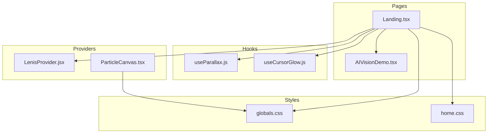

**Diagram sources**
- [LenisProvider.jsx:1-52](file://components/animations/LenisProvider.jsx#L1-L52)
- [useParallax.js:1-31](file://components/animations/useParallax.js#L1-L31)
- [useCursorGlow.js:1-26](file://components/animations/useCursorGlow.js#L1-L26)
- [Landing.tsx:1-1156](file://app/home/Landing.tsx#L1-L1156)
- [AIVisionDemo.tsx:1-562](file://app/home/AIVisionDemo.tsx#L1-L562)
- [ParticleCanvas.tsx:1-71](file://app/components/ParticleCanvas.tsx#L1-L71)
- [globals.css:1-800](file://app/globals.css#L1-L800)
- [home.css:1-800](file://app/home/home.css#L1-L800)

**Section sources**
- [layout.tsx:1-24](file://app/layout.tsx#L1-L24)
- [package.json:1-31](file://package.json#L1-L31)

## Core Components
- LenisProvider: Initializes Lenis smooth scrolling and synchronizes GSAP ScrollTrigger updates per frame
- useParallax: Lightweight GSAP-based parallax helper with ScrollTrigger scrubbing
- useCursorGlow: Optional lightweight cursor glow for desktop
- Landing page: Orchestrates smooth scrolling, scroll-triggered animations, cursor enhancements, and 3D scenes
- AIVisionDemo: Integrates Three.js, GSAP tweens, and particle effects for an immersive demo
- ParticleCanvas: Canvas-based particle system for background ambiance

**Section sources**
- [LenisProvider.jsx:1-52](file://components/animations/LenisProvider.jsx#L1-L52)
- [useParallax.js:1-31](file://components/animations/useParallax.js#L1-L31)
- [useCursorGlow.js:1-26](file://components/animations/useCursorGlow.js#L1-L26)
- [Landing.tsx:1-1156](file://app/home/Landing.tsx#L1-L1156)
- [AIVisionDemo.tsx:1-562](file://app/home/AIVisionDemo.tsx#L1-L562)
- [ParticleCanvas.tsx:1-71](file://app/components/ParticleCanvas.tsx#L1-L71)

## Architecture Overview
The animation pipeline combines Lenis for silky smooth scroll with GSAP for precise scroll-driven animations. Providers initialize libraries, hooks encapsulate reusable behaviors, and pages coordinate complex sequences.

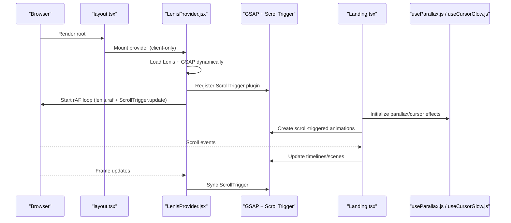

**Diagram sources**
- [layout.tsx:1-24](file://app/layout.tsx#L1-L24)
- [LenisProvider.jsx:1-52](file://components/animations/LenisProvider.jsx#L1-L52)
- [Landing.tsx:1-1156](file://app/home/Landing.tsx#L1-L1156)
- [useParallax.js:1-31](file://components/animations/useParallax.js#L1-L31)
- [useCursorGlow.js:1-26](file://components/animations/useCursorGlow.js#L1-L26)

## Detailed Component Analysis

### LenisProvider: Smooth Scrolling and ScrollTrigger Synchronization
- Dynamically imports Lenis and GSAP
- Registers GSAP ScrollTrigger plugin
- Creates Lenis instance with tuned duration and easing
- Runs a continuous rAF loop to advance Lenis and update ScrollTrigger
- Cleans up on unmount

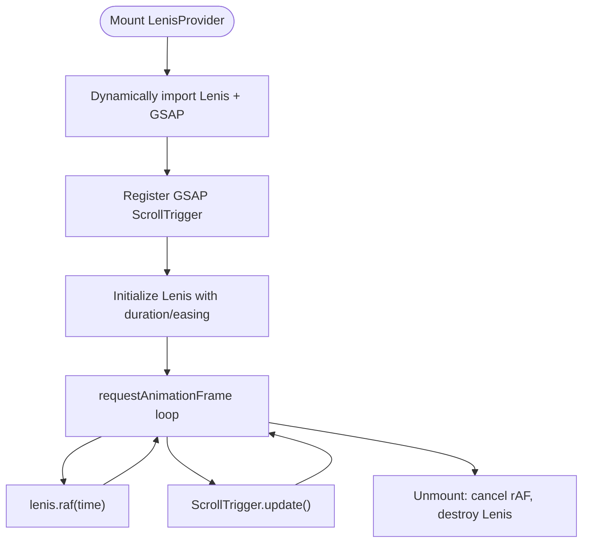

**Diagram sources**
- [LenisProvider.jsx:1-52](file://components/animations/LenisProvider.jsx#L1-L52)

**Section sources**
- [LenisProvider.jsx:1-52](file://components/animations/LenisProvider.jsx#L1-L52)
- [layout.tsx:1-24](file://app/layout.tsx#L1-L24)

### useParallax: Layered Background Depth
- Lazily imports GSAP and registers ScrollTrigger
- Accepts a target element or selector and applies a vertical offset tween
- Uses ScrollTrigger scrubbing for responsive, frame-coordinated movement
- Returns a cleanup function to kill the tween

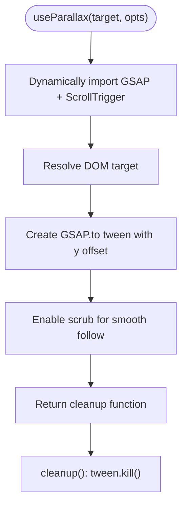

**Diagram sources**
- [useParallax.js:1-31](file://components/animations/useParallax.js#L1-L31)

**Section sources**
- [useParallax.js:1-31](file://components/animations/useParallax.js#L1-L31)
- [Landing.tsx:466-488](file://app/home/Landing.tsx#L466-L488)

### Cursor Effects: Glow, Trail, and Velocity Pulses
- Premium glow: Desktop-only, follows mouse with requestAnimationFrame batching
- Magnetic glow and spotlight: Enhanced desktop experience with proximity-based trail and velocity pulses
- Lite glow: Lightweight fallback for non-touch devices

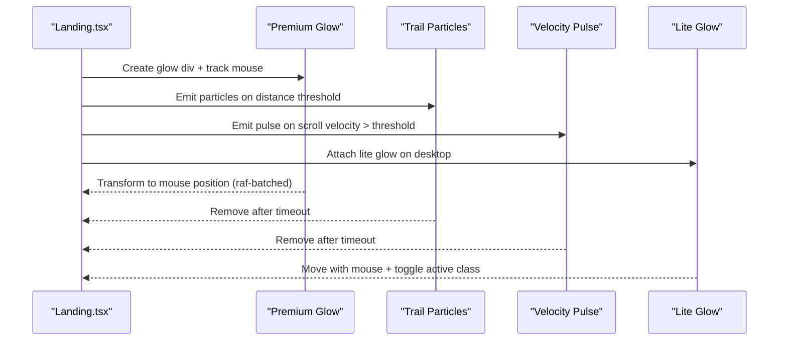

**Diagram sources**
- [Landing.tsx:73-192](file://app/home/Landing.tsx#L73-L192)
- [Landing.tsx:194-232](file://app/home/Landing.tsx#L194-L232)
- [useCursorGlow.js:1-26](file://components/animations/useCursorGlow.js#L1-L26)
- [globals.css:429-444](file://app/globals.css#L429-L444)

**Section sources**
- [Landing.tsx:73-192](file://app/home/Landing.tsx#L73-L192)
- [Landing.tsx:194-232](file://app/home/Landing.tsx#L194-L232)
- [useCursorGlow.js:1-26](file://components/animations/useCursorGlow.js#L1-L26)
- [globals.css:429-444](file://app/globals.css#L429-L444)

### Scroll-Triggered Animations: Orchestration by Viewport Position
- Intersection observers trigger staggered reveals and batched animations
- Framer Motion provides initial hero animations
- GSAP tweens coordinate with ScrollTrigger for precise control
- Examples include animated counters, skew transforms, and section depth tilt

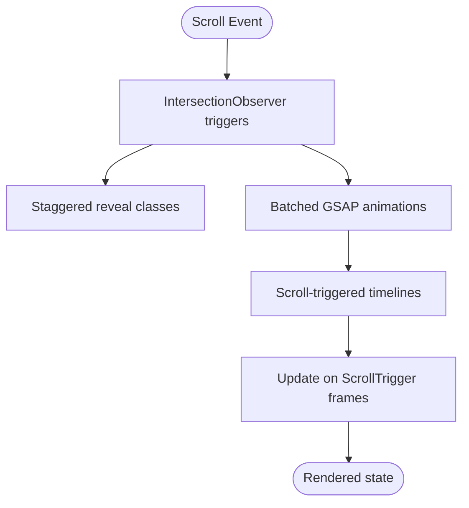

**Diagram sources**
- [Landing.tsx:492-549](file://app/home/Landing.tsx#L492-L549)
- [Landing.tsx:551-754](file://app/home/Landing.tsx#L551-L754)
- [Landing.tsx:756-800](file://app/home/Landing.tsx#L756-L800)

**Section sources**
- [Landing.tsx:492-549](file://app/home/Landing.tsx#L492-L549)
- [Landing.tsx:551-754](file://app/home/Landing.tsx#L551-L754)
- [Landing.tsx:756-800](file://app/home/Landing.tsx#L756-L800)

### GSAP-Based Parallax System
- Applies vertical displacement to background layers based on viewport position
- Scrubbed movement ensures smooth follow with minimal jank
- Speed and scrub options configurable per element

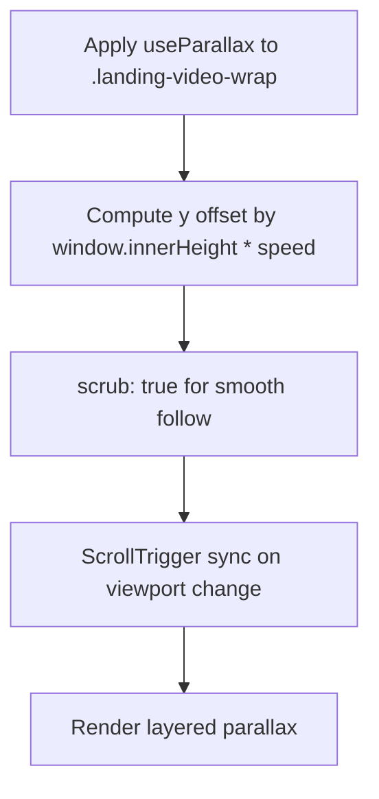

**Diagram sources**
- [useParallax.js:16-25](file://components/animations/useParallax.js#L16-L25)
- [Landing.tsx:466-488](file://app/home/Landing.tsx#L466-L488)
- [home.css:24-34](file://app/home/home.css#L24-L34)

**Section sources**
- [useParallax.js:1-31](file://components/animations/useParallax.js#L1-L31)
- [Landing.tsx:466-488](file://app/home/Landing.tsx#L466-L488)
- [home.css:24-34](file://app/home/home.css#L24-L34)

### Advanced Cursor Effects: Glow and Hover Interactions
- Magnetic glow and spotlight create immersive feedback
- Trail particles emit on rapid mouse movement
- Velocity pulses react to scroll velocity for kinetic energy
- Lite glow provides a lightweight fallback for mobile

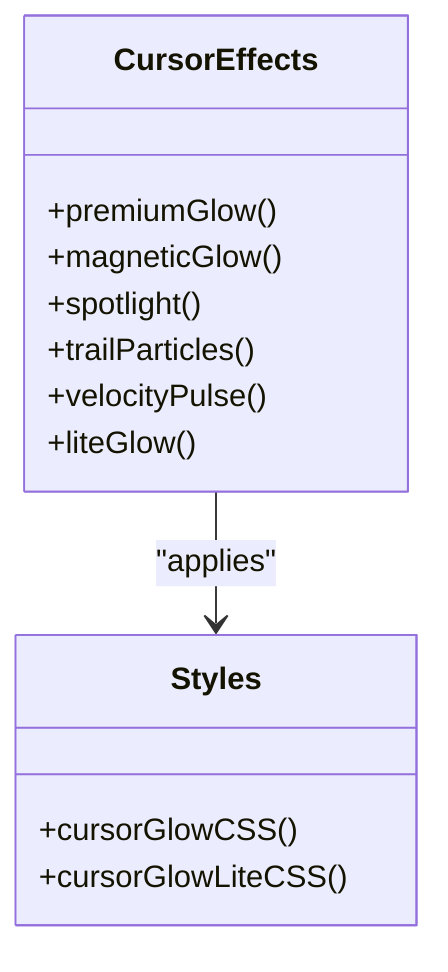

**Diagram sources**
- [Landing.tsx:73-192](file://app/home/Landing.tsx#L73-L192)
- [Landing.tsx:194-232](file://app/home/Landing.tsx#L194-L232)
- [useCursorGlow.js:1-26](file://components/animations/useCursorGlow.js#L1-L26)
- [globals.css:429-444](file://app/globals.css#L429-L444)

**Section sources**
- [Landing.tsx:73-192](file://app/home/Landing.tsx#L73-L192)
- [Landing.tsx:194-232](file://app/home/Landing.tsx#L194-L232)
- [useCursorGlow.js:1-26](file://components/animations/useCursorGlow.js#L1-L26)
- [globals.css:429-444](file://app/globals.css#L429-L444)

### Scroll-Triggered Animation System
- Coordinates multiple timelines based on viewport position
- Uses ScrollTrigger to bind animations to scroll progress
- Manages cleanup and lifecycle to prevent memory leaks

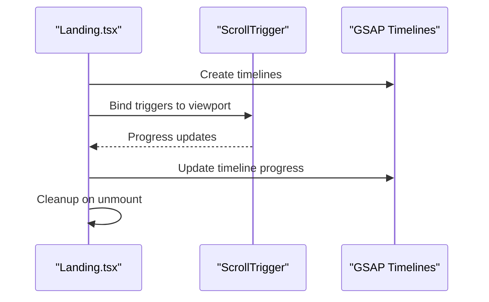

**Diagram sources**
- [Landing.tsx:492-549](file://app/home/Landing.tsx#L492-L549)
- [Landing.tsx:551-754](file://app/home/Landing.tsx#L551-L754)
- [LenisProvider.jsx:34-39](file://components/animations/LenisProvider.jsx#L34-L39)

**Section sources**
- [Landing.tsx:492-549](file://app/home/Landing.tsx#L492-L549)
- [Landing.tsx:551-754](file://app/home/Landing.tsx#L551-L754)
- [LenisProvider.jsx:34-39](file://components/animations/LenisProvider.jsx#L34-L39)

### 3D Elements Integration: AIVisionDemo
- Three.js scene with materials and lighting
- GSAP-driven model rotations and camera movements
- Particle effects synchronized with UI actions
- Responsive resize handling and resource cleanup

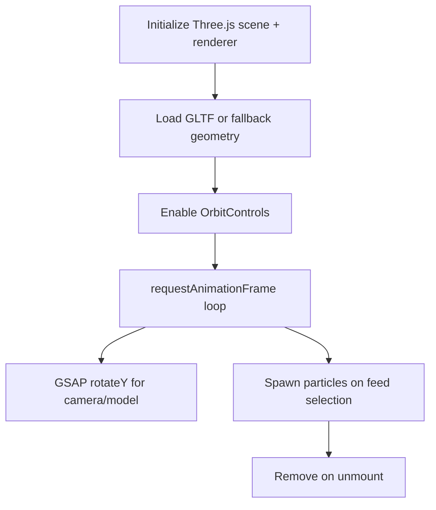

**Diagram sources**
- [AIVisionDemo.tsx:38-213](file://app/home/AIVisionDemo.tsx#L38-L213)
- [AIVisionDemo.tsx:216-254](file://app/home/AIVisionDemo.tsx#L216-L254)
- [AIVisionDemo.tsx:337-437](file://app/home/AIVisionDemo.tsx#L337-L437)

**Section sources**
- [AIVisionDemo.tsx:1-562](file://app/home/AIVisionDemo.tsx#L1-L562)

### Canvas Particle System
- Transparent canvas fills viewport and animates particles
- Clears with transparent fill to avoid residual artifacts
- Resizes with window and cleans up on unmount

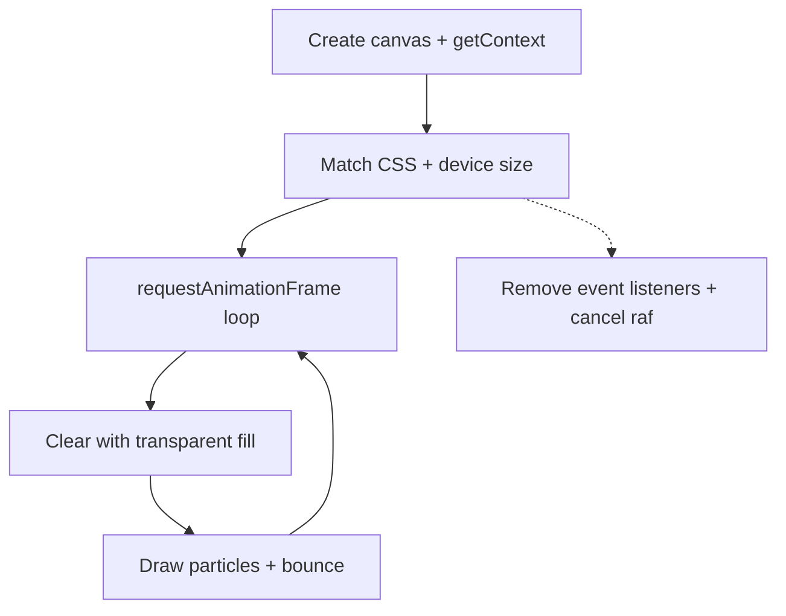

**Diagram sources**
- [ParticleCanvas.tsx:1-71](file://app/components/ParticleCanvas.tsx#L1-L71)
- [globals.css:43-48](file://app/globals.css#L43-L48)

**Section sources**
- [ParticleCanvas.tsx:1-71](file://app/components/ParticleCanvas.tsx#L1-L71)
- [globals.css:43-48](file://app/globals.css#L43-L48)

## Dependency Analysis
External libraries and their roles:
- lenis: Smooth scroll engine
- gsap: Animation and ScrollTrigger plugins
- three: 3D rendering
- @react-three/fiber and @react-three/drei: React renderer and helpers
- framer-motion: Motion primitives for initial hero animations

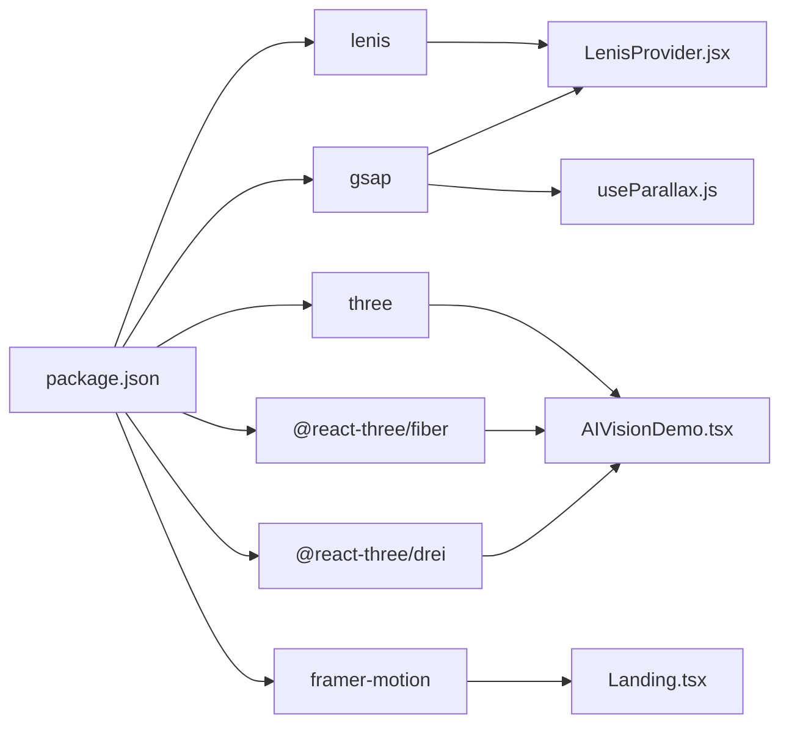

**Diagram sources**
- [package.json:11-21](file://package.json#L11-L21)
- [LenisProvider.jsx:13-16](file://components/animations/LenisProvider.jsx#L13-L16)
- [useParallax.js:4-11](file://components/animations/useParallax.js#L4-L11)
- [AIVisionDemo.tsx:1-10](file://app/home/AIVisionDemo.tsx#L1-L10)
- [Landing.tsx](file://app/home/Landing.tsx#L7)

**Section sources**
- [package.json:11-21](file://package.json#L11-L21)

## Performance Considerations
- Frame synchronization: Lenis rAF and ScrollTrigger update are coordinated in a single rAF loop to minimize layout thrashing
- Dynamic imports: Libraries are imported lazily to reduce initial bundle size and improve SSR compatibility
- Throttling and batching: Cursor glow uses requestAnimationFrame to batch updates; intersection observers debounce heavy work
- Cleanup: All effects register cleanup handlers to cancel rAF, unregister event listeners, and kill tweens
- Reduced motion: Cursor glow and advanced effects are disabled on coarse-pointer or mobile devices; fallbacks remain functional
- 3D and canvas: Device pixel ratio capped and resources disposed on unmount; canvas cleared with transparent fill to avoid artifacts

[No sources needed since this section provides general guidance]

## Troubleshooting Guide
- Smooth scrolling not working:
  - Verify LenisProvider is mounted client-side and libraries are imported
  - Ensure ScrollTrigger is registered and rAF loop runs
- Parallax not moving:
  - Confirm target exists and useParallax resolves to a DOM node
  - Check scrub option and trigger bounds
- Cursor glow missing:
  - On mobile or coarse pointer devices, effects are intentionally disabled
  - Ensure passive event listeners are respected and cleanup removes nodes
- 3D scene flickers or stutters:
  - Check device pixel ratio and resize handling
  - Verify requestAnimationFrame loop and cleanup dispose calls
- Scroll-triggered animations not firing:
  - Validate trigger/viewport thresholds and ScrollTrigger registration
  - Confirm cleanup does not kill timelines prematurely

**Section sources**
- [LenisProvider.jsx:44-48](file://components/animations/LenisProvider.jsx#L44-L48)
- [useParallax.js:13-14](file://components/animations/useParallax.js#L13-L14)
- [useCursorGlow.js:3-4](file://components/animations/useCursorGlow.js#L3-L4)
- [AIVisionDemo.tsx:204-212](file://app/home/AIVisionDemo.tsx#L204-L212)
- [Landing.tsx:492-549](file://app/home/Landing.tsx#L492-L549)

## Conclusion
The Zeex AI website achieves a rich, interactive experience through a cohesive blend of Lenis smooth scrolling, GSAP ScrollTrigger-driven animations, and layered visual effects. The system emphasizes performance via frame synchronization, lazy loading, and careful cleanup, while maintaining accessibility and graceful degradation across devices. The modular hooks and page-level orchestrations enable easy customization and extension of animations and 3D elements.

[No sources needed since this section summarizes without analyzing specific files]

## Appendices

### Customizing Animation Timing
- Adjust Lenis duration and easing in the provider to alter scroll feel
- Modify parallax speed and scrub behavior via useParallax options
- Tune GSAP durations, easings, and ScrollTrigger offsets for targeted effects
- Use requestAnimationFrame batching for cursor and particle updates

**Section sources**
- [LenisProvider.jsx:28-32](file://components/animations/LenisProvider.jsx#L28-L32)
- [useParallax.js:16-25](file://components/animations/useParallax.js#L16-L25)
- [Landing.tsx:551-754](file://app/home/Landing.tsx#L551-L754)

### Creating New Scroll-Triggered Effects
- Wrap animations in ScrollTrigger with appropriate start/end and scrub settings
- Use IntersectionObserver for initial reveals and batch animations
- Coordinate multiple timelines with shared progress or offsets

**Section sources**
- [Landing.tsx:492-549](file://app/home/Landing.tsx#L492-L549)
- [Landing.tsx:551-754](file://app/home/Landing.tsx#L551-L754)

### Integrating Animations with 3D Elements
- Use GSAP to animate Three.js object rotations and camera movements
- Synchronize particle effects with UI interactions
- Manage resize and cleanup to prevent memory leaks

**Section sources**
- [AIVisionDemo.tsx:180-201](file://app/home/AIVisionDemo.tsx#L180-L201)
- [AIVisionDemo.tsx:216-254](file://app/home/AIVisionDemo.tsx#L216-L254)

### Cross-Browser Compatibility and Reduced Motion
- Disable advanced cursor effects on coarse-pointer or mobile devices
- Use passive event listeners for scroll and mousemove
- Provide fallbacks for environments without WebAssembly or WebGL

**Section sources**
- [Landing.tsx:75-76](file://app/home/Landing.tsx#L75-L76)
- [Landing.tsx:196-198](file://app/home/Landing.tsx#L196-L198)
- [useCursorGlow.js:3-4](file://components/animations/useCursorGlow.js#L3-L4)