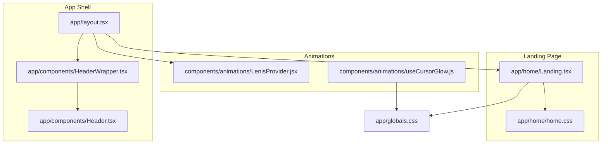
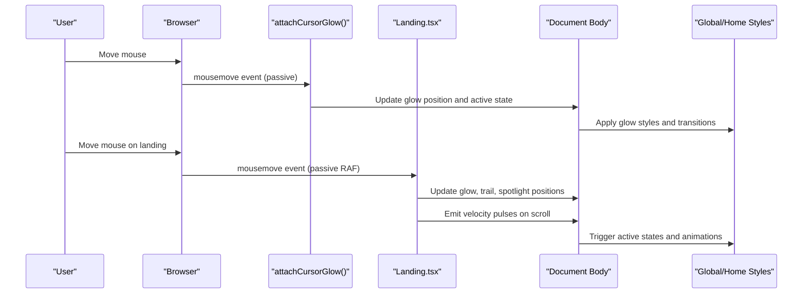
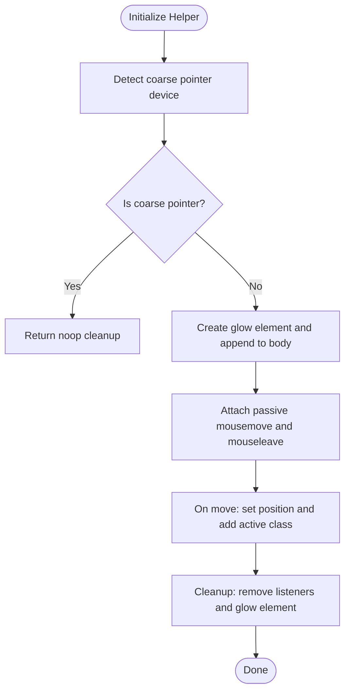
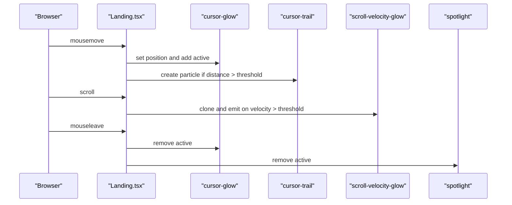
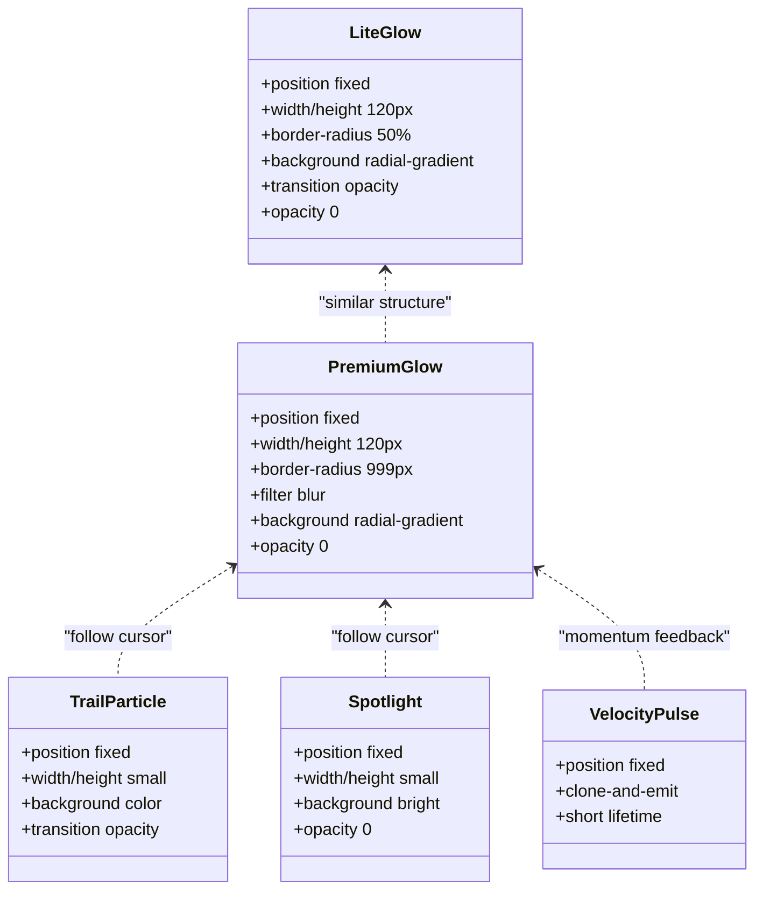
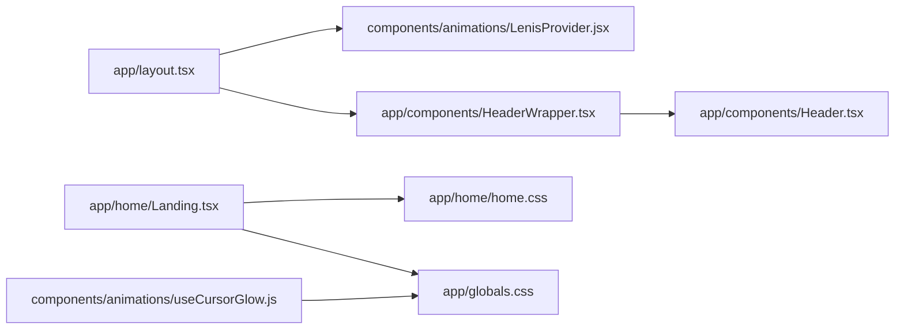

# Cursor Effects & Interactions

<cite>
**Referenced Files in This Document**
- [useCursorGlow.js](file://components/animations/useCursorGlow.js)
- [Landing.tsx](file://app/home/Landing.tsx)
- [Header.tsx](file://app/components/Header.tsx)
- [HeaderWrapper.tsx](file://app/components/HeaderWrapper.tsx)
- [LenisProvider.jsx](file://components/animations/LenisProvider.jsx)
- [layout.tsx](file://app/layout.tsx)
- [globals.css](file://app/globals.css)
- [home.css](file://app/home/home.css)
</cite>

## Table of Contents
1. [Introduction](#introduction)
2. [Project Structure](#project-structure)
3. [Core Components](#core-components)
4. [Architecture Overview](#architecture-overview)
5. [Detailed Component Analysis](#detailed-component-analysis)
6. [Dependency Analysis](#dependency-analysis)
7. [Performance Considerations](#performance-considerations)
8. [Troubleshooting Guide](#troubleshooting-guide)
9. [Conclusion](#conclusion)
10. [Appendices](#appendices)

## Introduction
This document explains the advanced cursor effects system that elevates user engagement through dynamic visual feedback. It focuses on two complementary implementations:
- A lightweight cursor glow helper for general pages
- An advanced cursor system in the landing page featuring glow, magnetic trails, spotlight, and scroll velocity pulses

The system integrates seamlessly with page elements to provide immediate, contextual feedback on interactive components while maintaining performance across devices and respecting accessibility preferences.

## Project Structure
The cursor effects are implemented across a small set of focused modules:
- A reusable helper for attaching a simple glow element
- A sophisticated landing page effect with multiple interactive layers
- Global and page-specific styles that define the visual appearance and transitions
- Layout wiring to ensure provider-based enhancements are initialized safely

**Diagram sources**
- [layout.tsx:13-21](file://app/layout.tsx#L13-L21)
- [HeaderWrapper.tsx:7-24](file://app/components/HeaderWrapper.tsx#L7-L24)
- [Header.tsx:10-82](file://app/components/Header.tsx#L10-L82)
- [LenisProvider.jsx:5-51](file://components/animations/LenisProvider.jsx#L5-L51)
- [useCursorGlow.js:1-26](file://components/animations/useCursorGlow.js#L1-L26)
- [Landing.tsx:60-192](file://app/home/Landing.tsx#L60-L192)
- [home.css:84-102](file://app/home/home.css#L84-L102)
- [globals.css:429-443](file://app/globals.css#L429-L443)

**Section sources**
- [layout.tsx:13-21](file://app/layout.tsx#L13-L21)
- [HeaderWrapper.tsx:7-24](file://app/components/HeaderWrapper.tsx#L7-L24)
- [Header.tsx:10-82](file://app/components/Header.tsx#L10-L82)
- [LenisProvider.jsx:5-51](file://components/animations/LenisProvider.jsx#L5-L51)
- [useCursorGlow.js:1-26](file://components/animations/useCursorGlow.js#L1-L26)
- [Landing.tsx:60-192](file://app/home/Landing.tsx#L60-L192)
- [home.css:84-102](file://app/home/home.css#L84-L102)
- [globals.css:429-443](file://app/globals.css#L429-L443)

## Core Components
- Lightweight cursor glow helper
  - Creates a single glow element and tracks mouse movement with passive listeners
  - Adds/removes an active state class to trigger CSS transitions
  - Automatically disables on coarse-pointer devices (mobile/touch)
  - Returns a cleanup function to detach event listeners and remove the element

- Advanced landing page cursor system
  - Adds a primary glow, a trail container, a scroll-velocity pulse element, and a spotlight
  - Uses requestAnimationFrame to interpolate positions smoothly
  - Implements a magnetic threshold to create trailing particles at higher speeds
  - Emits scroll velocity pulses to reinforce motion feedback
  - Removes all elements and listeners on unmount

- Styles
  - Lite glow: simple radial gradient with opacity transition
  - Premium glow: larger blurred radial gradient with active opacity toggle
  - Trail particles: lightweight DOM elements with short lifecycles
  - Spotlight: follows cursor with active state
  - Scroll velocity pulses: clone-and-emit pattern for momentum feedback

**Section sources**
- [useCursorGlow.js:1-26](file://components/animations/useCursorGlow.js#L1-L26)
- [Landing.tsx:60-192](file://app/home/Landing.tsx#L60-L192)
- [Landing.tsx:194-232](file://app/home/Landing.tsx#L194-L232)
- [home.css:84-102](file://app/home/home.css#L84-L102)
- [globals.css:429-443](file://app/globals.css#L429-L443)

## Architecture Overview
The cursor effects system is layered:
- Provider layer initializes environment-aware enhancements
- Page-specific hooks attach interactive elements to the DOM
- CSS defines the visual states and transitions
- Cleanup ensures memory safety and prevents leaks

**Diagram sources**
- [useCursorGlow.js:10-18](file://components/animations/useCursorGlow.js#L10-L18)
- [Landing.tsx:106-142](file://app/home/Landing.tsx#L106-L142)
- [Landing.tsx:151-166](file://app/home/Landing.tsx#L151-L166)
- [globals.css:429-443](file://app/globals.css#L429-L443)
- [home.css:84-102](file://app/home/home.css#L84-L102)

## Detailed Component Analysis

### Lightweight Cursor Glow Helper
This helper encapsulates a minimal glow effect suitable for most pages:
- Device detection: disables automatically on coarse-pointer devices
- DOM lifecycle: creates, updates, and removes a single glow element
- Event handling: passive mousemove and leave listeners for smooth performance
- Active state: toggles a class to drive CSS transitions

**Diagram sources**
- [useCursorGlow.js:2-24](file://components/animations/useCursorGlow.js#L2-L24)

**Section sources**
- [useCursorGlow.js:1-26](file://components/animations/useCursorGlow.js#L1-L26)

### Advanced Landing Page Cursor System
The landing page implements a richer set of effects:
- Glow: follows cursor with requestAnimationFrame and active state
- Trail: emits particles when movement exceeds a magnetic threshold
- Spotlight: mirrors cursor position with active state
- Scroll velocity pulses: clones a pulse element and animates it on significant scroll deltas
- Cleanup: removes all DOM nodes and cancels animation frames on unmount

**Diagram sources**
- [Landing.tsx:77-191](file://app/home/Landing.tsx#L77-L191)

**Section sources**
- [Landing.tsx:60-192](file://app/home/Landing.tsx#L60-L192)
- [Landing.tsx:194-232](file://app/home/Landing.tsx#L194-L232)

### Style Definitions and Transitions
Visual presentation is driven by CSS:
- Lite glow: positioned absolutely, centered transform, opacity transition
- Premium glow: larger size, blur, gradient, active opacity toggle
- Trail particles: short-lived DOM elements with fade-out
- Spotlight: follows cursor with active state
- Scroll velocity pulses: cloned elements with transient active state

**Diagram sources**
- [globals.css:429-443](file://app/globals.css#L429-L443)
- [home.css:84-102](file://app/home/home.css#L84-L102)

**Section sources**
- [globals.css:429-443](file://app/globals.css#L429-L443)
- [home.css:84-102](file://app/home/home.css#L84-L102)

## Dependency Analysis
- Layout wiring
  - The root layout mounts the Lenis provider and header wrapper, ensuring environment enhancements are initialized early
- Provider dependencies
  - The Lenis provider dynamically imports libraries and sets up requestAnimationFrame loops for smooth scrolling
- Page integration
  - The landing page attaches cursor effects conditionally based on device capability
- Helper integration
  - The lightweight helper can be used independently to add a simple glow to any page

**Diagram sources**
- [layout.tsx:13-21](file://app/layout.tsx#L13-L21)
- [LenisProvider.jsx:5-51](file://components/animations/LenisProvider.jsx#L5-L51)
- [HeaderWrapper.tsx:7-24](file://app/components/HeaderWrapper.tsx#L7-L24)
- [Header.tsx:10-82](file://app/components/Header.tsx#L10-L82)
- [Landing.tsx:60-192](file://app/home/Landing.tsx#L60-L192)
- [useCursorGlow.js:1-26](file://components/animations/useCursorGlow.js#L1-L26)

**Section sources**
- [layout.tsx:13-21](file://app/layout.tsx#L13-L21)
- [LenisProvider.jsx:5-51](file://components/animations/LenisProvider.jsx#L5-L51)
- [HeaderWrapper.tsx:7-24](file://app/components/HeaderWrapper.tsx#L7-L24)
- [Header.tsx:10-82](file://app/components/Header.tsx#L10-L82)
- [Landing.tsx:60-192](file://app/home/Landing.tsx#L60-L192)
- [useCursorGlow.js:1-26](file://components/animations/useCursorGlow.js#L1-L26)

## Performance Considerations
- Passive event listeners
  - Both helpers use passive listeners for mousemove to avoid layout thrashing
- requestAnimationFrame scheduling
  - The landing page uses RAF to batch updates and reduce jank
- Conditional activation
  - Effects are disabled on coarse-pointer devices to prevent unnecessary work
- Short-lived DOM nodes
  - Trail particles and velocity pulses are removed after their animations complete
- CSS-driven transitions
  - Smooth opacity and transform changes are handled by the GPU-friendly CSS properties

[No sources needed since this section provides general guidance]

## Troubleshooting Guide
- Glow does not appear
  - Verify device detection: the lightweight helper exits silently on coarse-pointer devices
  - Confirm CSS class toggling: ensure the active class is being added/removed on mousemove and mouseleave
- Excessive CPU usage
  - Ensure passive listeners are used and RAF batching is intact
  - Check that cleanup functions are called on unmount to remove event listeners and DOM nodes
- Elements overlap or misalign
  - Confirm z-index stacking contexts and fixed positioning
  - Validate that the glow element is appended to the body and positioned absolutely

**Section sources**
- [useCursorGlow.js:3-4](file://components/animations/useCursorGlow.js#L3-L4)
- [useCursorGlow.js:17-24](file://components/animations/useCursorGlow.js#L17-L24)
- [Landing.tsx:172-191](file://app/home/Landing.tsx#L172-L191)

## Conclusion
The cursor effects system blends simplicity and sophistication:
- The lightweight helper delivers a consistent, low-overhead glow suitable for general pages
- The landing page implementation elevates immersion with magnetic trails, spotlight, and scroll velocity pulses
- Together, they provide immediate, responsive feedback that enhances interactivity without compromising performance or accessibility

[No sources needed since this section summarizes without analyzing specific files]

## Appendices

### Customization Options
- Glow appearance
  - Adjust size, blur radius, and gradient stops in the glow styles
  - Modify transition timing for smoother or snappier responses
- Animation timing
  - Tune RAF scheduling and thresholds for magnetic trails and velocity pulses
- Interaction sensitivity
  - Change the magnetic distance threshold and velocity delta to balance responsiveness and subtlety
- Accessibility
  - Respect reduced motion preferences by disabling or simplifying animations
  - Ensure focus indicators remain visible and functional alongside cursor effects

[No sources needed since this section provides general guidance]

### Examples of Cursor Effects
- Trail animations
  - Emit lightweight DOM nodes at intervals exceeding a movement threshold
  - Use short lifetimes and fade-out transitions for visual decay
- Highlight overlays
  - Toggle active states on interactive elements to emphasize hover states
  - Combine with subtle scale or shadow changes for depth
- Shape-changing elements
  - Use CSS transforms and mask images to morph cursor visuals
  - Keep shapes minimal to maintain clarity and performance

[No sources needed since this section provides general guidance]

### Coordinating with Page Animations
- Align RAF cycles with page-wide animations to avoid contention
- Use CSS variables or custom properties to synchronize timing and easing
- Ensure cleanup routines remove DOM nodes and cancel animation frames to prevent conflicts

[No sources needed since this section provides general guidance]