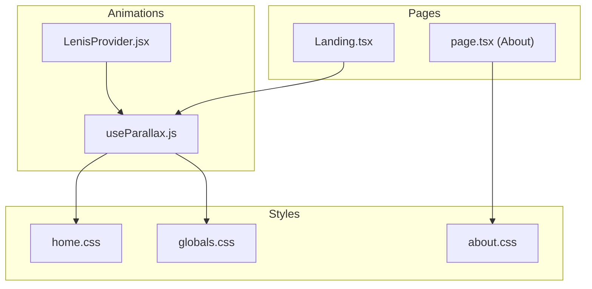
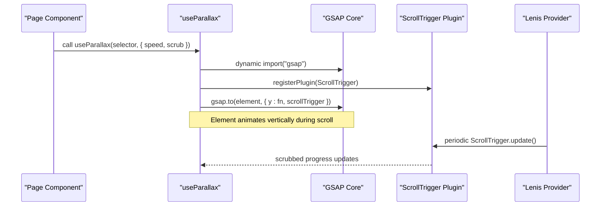
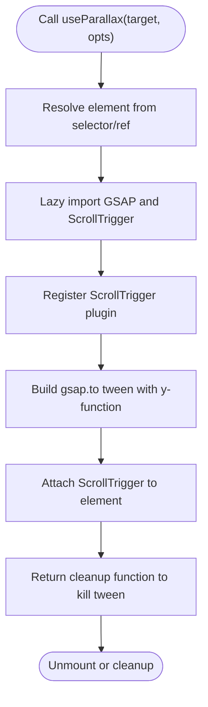
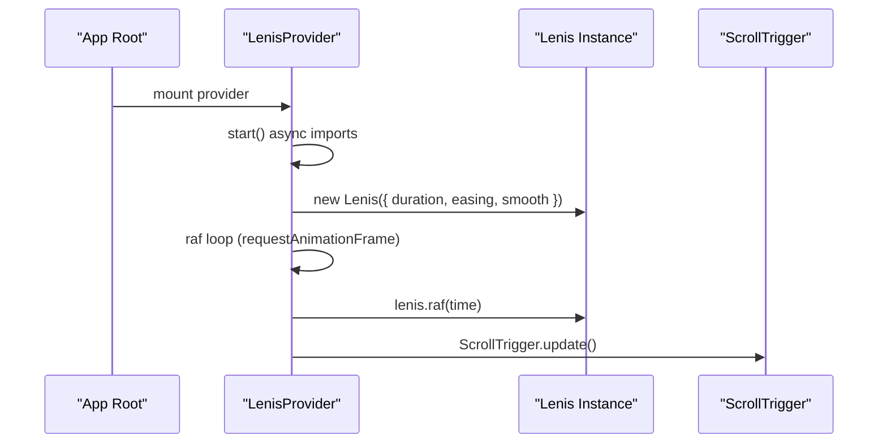
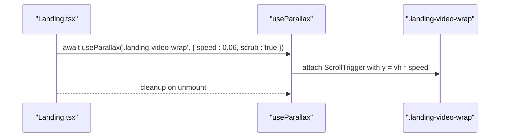
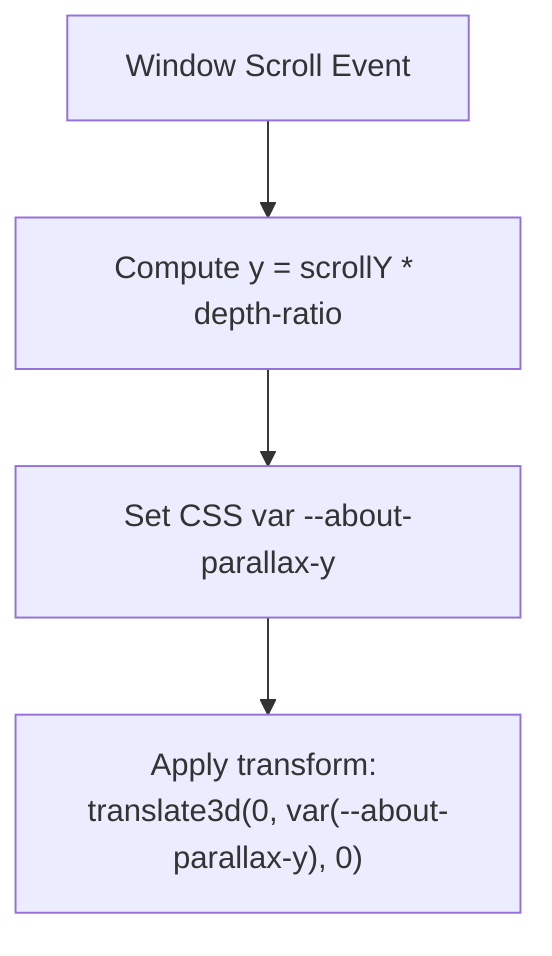
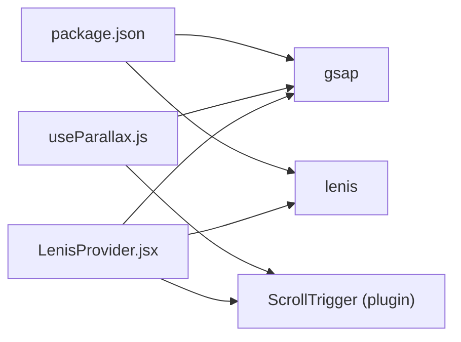

# Parallax Scrolling System

<cite>
**Referenced Files in This Document**
- [useParallax.js](file://components/animations/useParallax.js)
- [LenisProvider.jsx](file://components/animations/LenisProvider.jsx)
- [Landing.tsx](file://app/home/Landing.tsx)
- [about.css](file://app/about/about.css)
- [page.tsx](file://app/about/page.tsx)
- [home.css](file://app/home/home.css)
- [globals.css](file://app/globals.css)
- [package.json](file://package.json)
</cite>

## Table of Contents
1. [Introduction](#introduction)
2. [Project Structure](#project-structure)
3. [Core Components](#core-components)
4. [Architecture Overview](#architecture-overview)
5. [Detailed Component Analysis](#detailed-component-analysis)
6. [Dependency Analysis](#dependency-analysis)
7. [Performance Considerations](#performance-considerations)
8. [Troubleshooting Guide](#troubleshooting-guide)
9. [Conclusion](#conclusion)

## Introduction
This document explains the GSAP-based parallax scrolling system used to create depth perception and visual interest through layered background movements. It covers the lightweight useParallax hook, how it computes scroll-driven transforms, and how it integrates with a smooth-scrolling provider. It also documents configuration options (speed ratios, scrubbing behavior), responsive behavior, performance characteristics, and practical examples for building different parallax effects such as background movement, foreground acceleration, and depth-based scaling. Guidance is included for coordinating multiple layers, maintaining performance during scroll interactions, and integrating with other animation systems.

## Project Structure
The parallax system spans three primary areas:
- A lightweight GSAP-based hook that attaches scroll-triggered animations to DOM elements
- A smooth-scroll provider that synchronizes GSAP ScrollTrigger updates with Lenis
- Page-specific implementations that apply parallax to targeted elements and layers

**Diagram sources**
- [useParallax.js:1-31](file://components/animations/useParallax.js#L1-L31)
- [LenisProvider.jsx:1-52](file://components/animations/LenisProvider.jsx#L1-L52)
- [Landing.tsx:470-488](file://app/home/Landing.tsx#L470-L488)
- [page.tsx:157-177](file://app/about/page.tsx#L157-L177)
- [home.css:24-34](file://app/home/home.css#L24-L34)
- [about.css:5-45](file://app/about/about.css#L5-L45)
- [globals.css:2045-2047](file://app/globals.css#L2045-L2047)

**Section sources**
- [useParallax.js:1-31](file://components/animations/useParallax.js#L1-L31)
- [LenisProvider.jsx:1-52](file://components/animations/LenisProvider.jsx#L1-L52)
- [Landing.tsx:470-488](file://app/home/Landing.tsx#L470-L488)
- [page.tsx:157-177](file://app/about/page.tsx#L157-L177)
- [home.css:24-34](file://app/home/home.css#L24-L34)
- [about.css:5-45](file://app/about/about.css#L5-L45)
- [globals.css:2045-2047](file://app/globals.css#L2045-L2047)

## Core Components
- useParallax(target, opts): A lazy-loaded GSAP helper that registers ScrollTrigger and animates an element’s vertical translation based on scroll position. It supports configurable speed and scrubbing behavior.
- LenisProvider: A client-side provider that initializes Lenis smooth scrolling and synchronizes ScrollTrigger updates via requestAnimationFrame.
- Page integrations: Landing.tsx demonstrates applying parallax to a video wrapper; About page shows a complementary CSS-based parallax technique using CSS variables and transform.

Key capabilities:
- Lazy import of GSAP and ScrollTrigger to avoid SSR/build overhead
- Scroll-triggered y-axis translation with configurable speed ratio
- Scrubbing behavior synchronized with smooth scrolling
- Complementary CSS-based parallax for layered backgrounds

**Section sources**
- [useParallax.js:1-31](file://components/animations/useParallax.js#L1-L31)
- [LenisProvider.jsx:12-40](file://components/animations/LenisProvider.jsx#L12-L40)
- [Landing.tsx:470-488](file://app/home/Landing.tsx#L470-L488)
- [page.tsx:75-81](file://app/about/page.tsx#L75-L81)

## Architecture Overview
The parallax system combines a lightweight hook with a smooth-scroll provider to deliver seamless scroll-driven motion.

**Diagram sources**
- [useParallax.js:2-25](file://components/animations/useParallax.js#L2-L25)
- [LenisProvider.jsx:13-39](file://components/animations/LenisProvider.jsx#L13-L39)

## Detailed Component Analysis

### useParallax Hook
The hook encapsulates:
- Lazy loading of GSAP and ScrollTrigger
- Element resolution from selector or ref
- Scroll-triggered y-axis animation with a speed ratio derived from viewport height
- Optional scrubbing behavior aligned with smooth scrolling

Implementation highlights:
- Speed calculation: y offset equals window.innerHeight multiplied by a speed ratio (default 0.08)
- Trigger bounds: top of element enters viewport until bottom exits
- Scrubbing enabled by default to match smooth-scroll expectations

**Diagram sources**
- [useParallax.js:2-30](file://components/animations/useParallax.js#L2-L30)

**Section sources**
- [useParallax.js:1-31](file://components/animations/useParallax.js#L1-L31)

### LenisProvider Integration
LenisProvider ensures smooth scrolling and keeps ScrollTrigger in sync:
- Dynamically imports Lenis and GSAP
- Registers ScrollTrigger if available
- Initializes Lenis with tuned easing and duration
- Runs a requestAnimationFrame loop to advance Lenis and update ScrollTrigger

**Diagram sources**
- [LenisProvider.jsx:12-40](file://components/animations/LenisProvider.jsx#L12-L40)

**Section sources**
- [LenisProvider.jsx:1-52](file://components/animations/LenisProvider.jsx#L1-L52)

### Page-Level Parallax Integrations

#### Landing Video Background Parallax
- Applies parallax to a dedicated video wrapper element
- Uses a small speed ratio and scrubbing for subtle depth

**Diagram sources**
- [Landing.tsx:470-488](file://app/home/Landing.tsx#L470-L488)
- [useParallax.js:16-25](file://components/animations/useParallax.js#L16-L25)

**Section sources**
- [Landing.tsx:470-488](file://app/home/Landing.tsx#L470-L488)
- [home.css:24-34](file://app/home/home.css#L24-L34)

#### About Page Layered Parallax
- Uses CSS variables and transform to achieve layered parallax
- Adds multiple parallax layers with distinct depth attributes
- Updates a CSS variable on scroll to move background elements

**Diagram sources**
- [page.tsx:75-81](file://app/about/page.tsx#L75-L81)
- [about.css:31-45](file://app/about/about.css#L31-L45)

**Section sources**
- [page.tsx:157-177](file://app/about/page.tsx#L157-L177)
- [page.tsx:75-81](file://app/about/page.tsx#L75-L81)
- [about.css:5-45](file://app/about/about.css#L5-L45)
- [globals.css:2045-2047](file://app/globals.css#L2045-L2047)

## Dependency Analysis
External libraries and their roles:
- GSAP: core animation engine
- ScrollTrigger: scroll-linked animation lifecycle
- Lenis: smooth-scrolling foundation

**Diagram sources**
- [package.json:11-21](file://package.json#L11-L21)
- [useParallax.js:4-11](file://components/animations/useParallax.js#L4-L11)
- [LenisProvider.jsx:13-26](file://components/animations/LenisProvider.jsx#L13-L26)

**Section sources**
- [package.json:11-21](file://package.json#L11-L21)
- [useParallax.js:4-11](file://components/animations/useParallax.js#L4-L11)
- [LenisProvider.jsx:13-26](file://components/animations/LenisProvider.jsx#L13-L26)

## Performance Considerations
- Lazy imports: GSAP and ScrollTrigger are dynamically imported only when needed, reducing initial bundle size and avoiding SSR issues.
- Scrubbing vs instant updates: Scrubbing aligns with smooth scrolling and reduces jank compared to instant transform updates.
- Transform optimization: Using transform properties (translate) avoids layout thrashing; the will-change hint is applied on the parallax container.
- Frame synchronization: LenisProvider’s RAF loop ensures ScrollTrigger updates occur at the optimal cadence.
- Mobile behavior: On smaller screens, adjust speed ratios to prevent excessive motion; consider disabling parallax on low-end devices via feature detection or user preferences.
- Intersection-based counters: Separate from parallax but coexist efficiently using IntersectionObserver.

[No sources needed since this section provides general guidance]

## Troubleshooting Guide
Common issues and resolutions:
- No parallax effect
  - Verify the element exists and is visible in the viewport
  - Confirm the hook was called after mounting and cleanup is not invoked prematurely
  - Ensure the page includes the smooth-scroll provider for proper scrubbing
- Conflicts with other scroll-based animations
  - Avoid overlapping ScrollTrigger triggers on the same element
  - Prefer either GSAP ScrollTrigger scrubbing or custom RAF-based transforms, not both simultaneously on the same target
  - If mixing CSS and JS parallax, coordinate depth ratios to avoid clashing motion
- Performance drops on mobile
  - Reduce speed ratios and disable scrubbing if necessary
  - Limit the number of animated layers
  - Use transform3d and will-change judiciously; test on representative devices
- Elements not moving as expected
  - Confirm the speed option is set appropriately (default 0.08)
  - Check that the trigger bounds ('top bottom' to 'bottom top') match intended scroll range

**Section sources**
- [useParallax.js:16-25](file://components/animations/useParallax.js#L16-L25)
- [LenisProvider.jsx:34-39](file://components/animations/LenisProvider.jsx#L34-L39)
- [Landing.tsx:470-488](file://app/home/Landing.tsx#L470-L488)

## Conclusion
The parallax system leverages a lightweight GSAP hook and a smooth-scroll provider to deliver efficient, scroll-driven depth effects. By configuring speed ratios and scrubbing behavior, developers can craft compelling background movement, foreground acceleration, and layered depth scaling. The system’s lazy-loading design and frame-synchronized updates help maintain performance across devices, while complementary CSS-based techniques offer additional flexibility for layered backgrounds. Following the integration patterns and troubleshooting guidance ensures reliable, conflict-free parallax experiences.