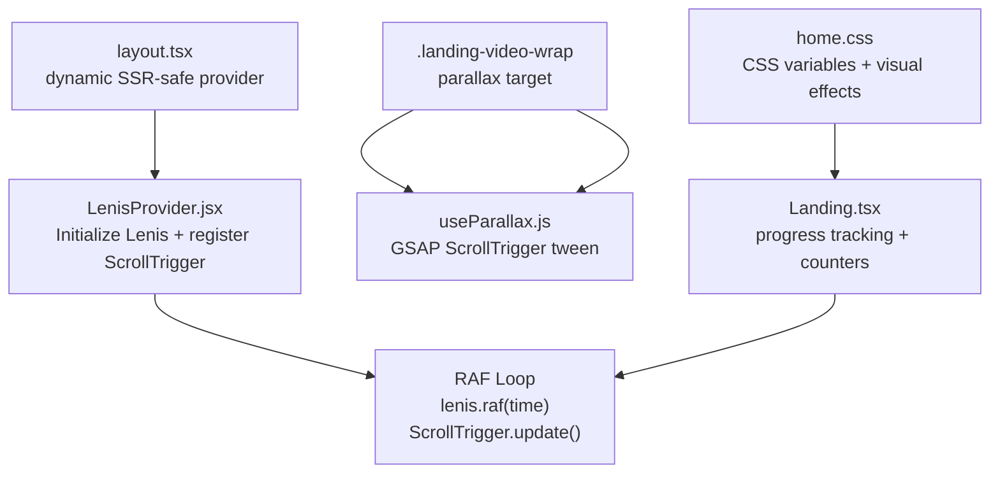
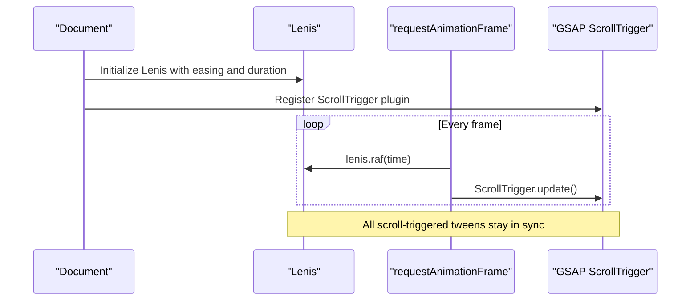
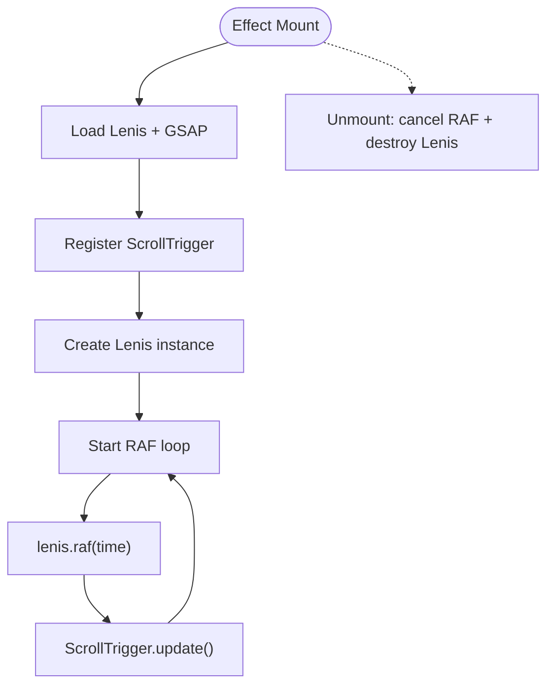
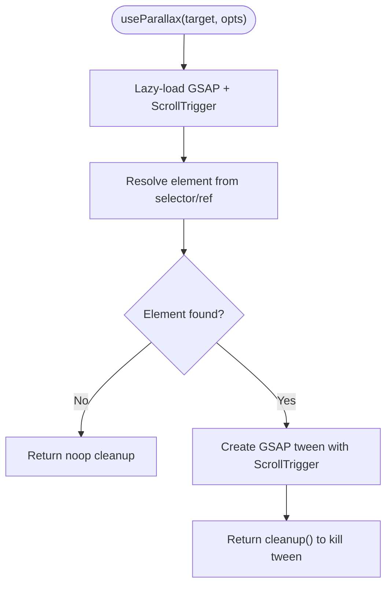
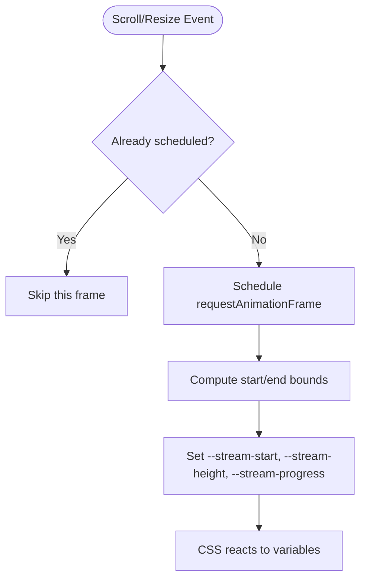
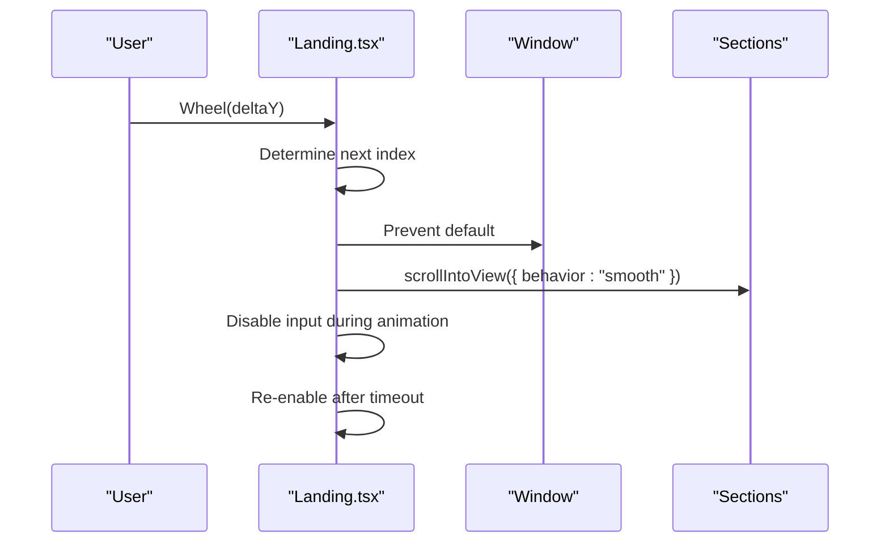
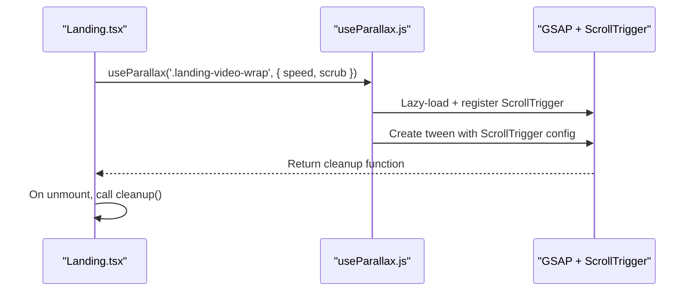
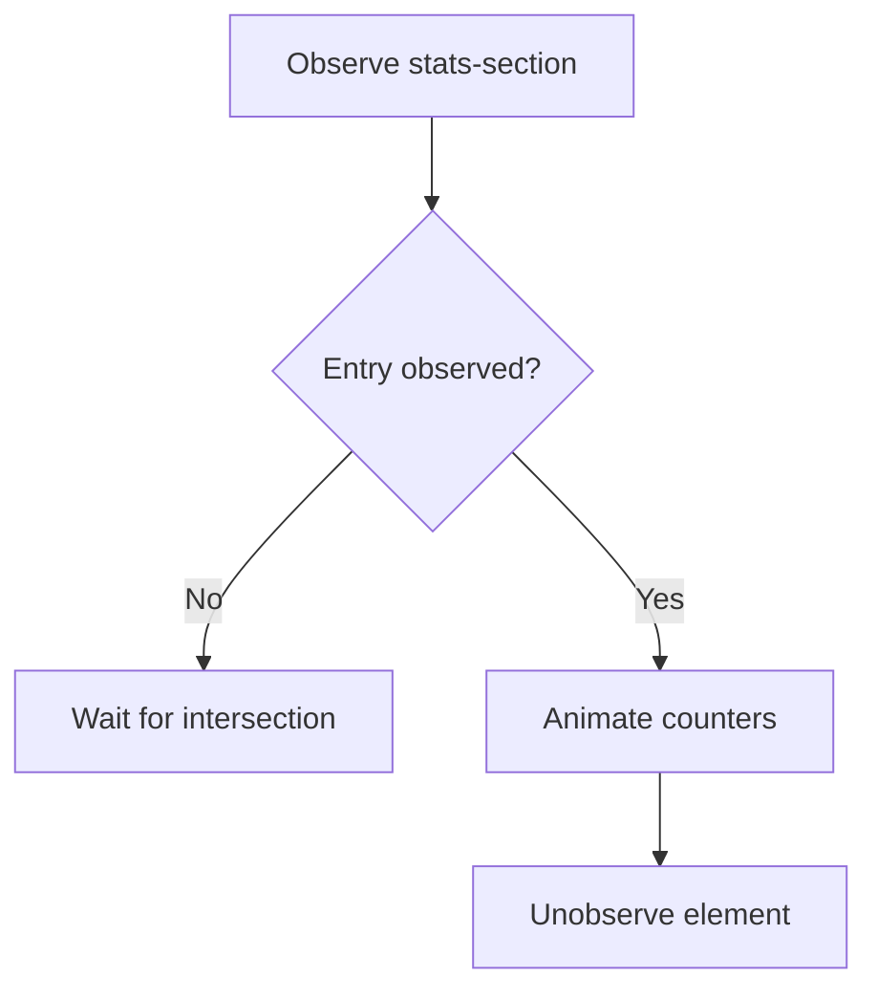
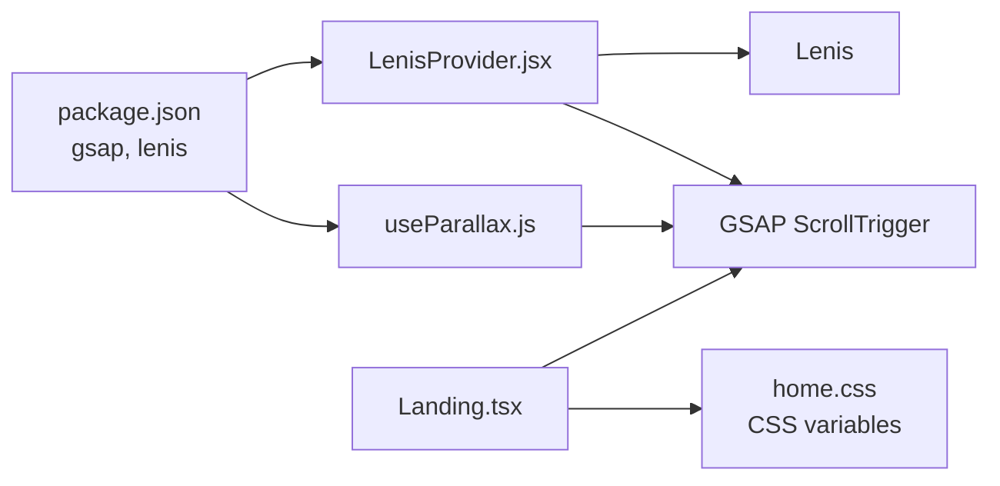

# Scroll-triggered Animations

<cite>
**Referenced Files in This Document**
- [LenisProvider.jsx](file://components/animations/LenisProvider.jsx)
- [useParallax.js](file://components/animations/useParallax.js)
- [Landing.tsx](file://app/home/Landing.tsx)
- [layout.tsx](file://app/layout.tsx)
- [home.css](file://app/home/home.css)
- [package.json](file://package.json)
</cite>

## Table of Contents
1. [Introduction](#introduction)
2. [Project Structure](#project-structure)
3. [Core Components](#core-components)
4. [Architecture Overview](#architecture-overview)
5. [Detailed Component Analysis](#detailed-component-analysis)
6. [Dependency Analysis](#dependency-analysis)
7. [Performance Considerations](#performance-considerations)
8. [Troubleshooting Guide](#troubleshooting-guide)
9. [Conclusion](#conclusion)

## Introduction
This document explains the scroll-triggered animation system that coordinates complex animation sequences based on viewport position and scroll progress. It details how the system integrates with GSAP ScrollTrigger to achieve precise timing control for page elements, synchronizes multiple animations, and maintains quality during smooth scrolling via Lenis. It also covers viewport-based activation (enter/exit triggers), progress tracking, state management, performance optimization, responsive behavior, and advanced patterns such as continuous animations, conditional triggers, and multi-element choreography.

## Project Structure
The scroll-driven animation system spans a few focused modules:
- A provider component initializes Lenis and integrates GSAP ScrollTrigger updates in a single RAF loop.
- A lightweight helper applies GSAP parallax with ScrollTrigger to elements.
- A page-level component demonstrates viewport progress tracking, smooth section navigation, and intersection-based counters.
- Global styles define visual effects and CSS custom properties used to drive animations.

**Diagram sources**
- [LenisProvider.jsx:1-52](file://components/animations/LenisProvider.jsx#L1-L52)
- [useParallax.js:1-31](file://components/animations/useParallax.js#L1-L31)
- [layout.tsx:1-24](file://app/layout.tsx#L1-L24)
- [Landing.tsx:237-269](file://app/home/Landing.tsx#L237-L269)
- [home.css:1-800](file://app/home/home.css#L1-L800)

**Section sources**
- [LenisProvider.jsx:1-52](file://components/animations/LenisProvider.jsx#L1-L52)
- [useParallax.js:1-31](file://components/animations/useParallax.js#L1-L31)
- [layout.tsx:1-24](file://app/layout.tsx#L1-L24)
- [Landing.tsx:237-269](file://app/home/Landing.tsx#L237-L269)
- [home.css:1-800](file://app/home/home.css#L1-L800)

## Core Components
- LenisProvider: Dynamically loads Lenis and GSAP, registers ScrollTrigger, and runs a shared RAF loop to synchronize Lenis with ScrollTrigger updates.
- useParallax: A lazy helper that attaches a GSAP ScrollTrigger tween to a target element for parallax behavior.
- Landing.tsx enhancements: Implements viewport progress tracking via CSS custom properties, smooth section navigation, and intersection-based counters.
- Layout integration: SSR-safe dynamic import ensures provider is only rendered on the client.

Key integration points:
- GSAP ScrollTrigger is registered once and reused across helpers and page-level animations.
- Lenis drives scroll; ScrollTrigger reacts to Lenis’ internal time to keep timelines in sync.
- CSS custom properties expose scroll progress and bounds to the page for visual effects.

**Section sources**
- [LenisProvider.jsx:12-40](file://components/animations/LenisProvider.jsx#L12-L40)
- [useParallax.js:2-25](file://components/animations/useParallax.js#L2-L25)
- [Landing.tsx:237-269](file://app/home/Landing.tsx#L237-L269)
- [layout.tsx:6-6](file://app/layout.tsx#L6-L6)

## Architecture Overview
The system architecture centers on a single RAF loop that advances Lenis and updates ScrollTrigger, ensuring all scroll-linked animations remain synchronized regardless of whether they are driven by native scroll events or GSAP’s ScrollTrigger.

**Diagram sources**
- [LenisProvider.jsx:28-39](file://components/animations/LenisProvider.jsx#L28-L39)

**Section sources**
- [LenisProvider.jsx:12-40](file://components/animations/LenisProvider.jsx#L12-L40)

## Detailed Component Analysis

### LenisProvider Integration
- Dynamic import pattern prevents SSR issues and defers heavy imports until client-side.
- Registers ScrollTrigger with GSAP if available.
- Creates a Lenis instance with a smooth easing curve and a fixed duration.
- Runs a single RAF loop that calls lenis.raf(time) and ScrollTrigger.update() each frame.

**Diagram sources**
- [LenisProvider.jsx:12-48](file://components/animations/LenisProvider.jsx#L12-L48)

**Section sources**
- [LenisProvider.jsx:12-48](file://components/animations/LenisProvider.jsx#L12-L48)
- [layout.tsx:6-6](file://app/layout.tsx#L6-L6)

### useParallax Helper
- Lazy-loads GSAP and optionally ScrollTrigger.
- Selects the target element from a selector or ref.
- Creates a GSAP tween with a ScrollTrigger configuration:
  - Trigger element is the target itself.
  - Start/end positions define the viewport range for scrubbing.
  - Scrubbing is enabled by default to smoothly follow scroll.
- Returns a cleanup function to kill the tween on unmount.

**Diagram sources**
- [useParallax.js:2-30](file://components/animations/useParallax.js#L2-L30)

**Section sources**
- [useParallax.js:2-30](file://components/animations/useParallax.js#L2-L30)

### Viewport Progress Tracking and Scroll-Linked Effects
- The page computes a normalized scroll progress between a start and end boundary and exposes it via CSS custom properties on the document element.
- A requestAnimationFrame throttled handler updates these properties on scroll and resize.
- CSS uses these variables to drive visual effects and animations.

**Diagram sources**
- [Landing.tsx:237-269](file://app/home/Landing.tsx#L237-L269)
- [home.css:248-252](file://app/home/home.css#L248-L252)

**Section sources**
- [Landing.tsx:237-269](file://app/home/Landing.tsx#L237-L269)
- [home.css:248-252](file://app/home/home.css#L248-L252)

### Smooth Section Navigation and Scroll Coordination
- The page listens to wheel events to snap between sections with smooth scrollIntoView.
- While animating, input is temporarily blocked to prevent queueing multiple transitions.
- This ensures scroll-linked animations do not fight against programmatic scrolling.

**Diagram sources**
- [Landing.tsx:446-464](file://app/home/Landing.tsx#L446-L464)

**Section sources**
- [Landing.tsx:446-464](file://app/home/Landing.tsx#L446-L464)

### Parallax Integration Example
- The landing page applies a parallax effect to a video wrapper using the helper.
- The helper configures ScrollTrigger with a trigger equal to the element, start/end spanning the viewport, and scrubbing enabled.
- Cleanup is handled automatically on unmount.

**Diagram sources**
- [Landing.tsx:470-488](file://app/home/Landing.tsx#L470-L488)
- [useParallax.js:16-25](file://components/animations/useParallax.js#L16-L25)

**Section sources**
- [Landing.tsx:470-488](file://app/home/Landing.tsx#L470-L488)
- [useParallax.js:16-25](file://components/animations/useParallax.js#L16-L25)

### Intersection-Based Counters
- Counters animate when a stats section enters the viewport using Intersection Observer.
- Threshold and rootMargin tune sensitivity and timing.
- Once animated, the observer stops observing the element to avoid re-triggering.

**Diagram sources**
- [Landing.tsx:493-509](file://app/home/Landing.tsx#L493-L509)

**Section sources**
- [Landing.tsx:493-509](file://app/home/Landing.tsx#L493-L509)

## Dependency Analysis
- Runtime dependencies include GSAP and Lenis, with ScrollTrigger integrated via GSAP.
- The provider dynamically imports both libraries and registers ScrollTrigger.
- The parallax helper lazily imports GSAP and ScrollTrigger, avoiding SSR overhead.
- The page uses CSS custom properties to bridge JS scroll progress to styles.

**Diagram sources**
- [package.json:11-21](file://package.json#L11-L21)
- [LenisProvider.jsx:13-26](file://components/animations/LenisProvider.jsx#L13-L26)
- [useParallax.js:4-11](file://components/animations/useParallax.js#L4-L11)
- [Landing.tsx:237-269](file://app/home/Landing.tsx#L237-L269)
- [home.css:248-252](file://app/home/home.css#L248-L252)

**Section sources**
- [package.json:11-21](file://package.json#L11-L21)
- [LenisProvider.jsx:13-26](file://components/animations/LenisProvider.jsx#L13-L26)
- [useParallax.js:4-11](file://components/animations/useParallax.js#L4-L11)
- [Landing.tsx:237-269](file://app/home/Landing.tsx#L237-L269)
- [home.css:248-252](file://app/home/home.css#L248-L252)

## Performance Considerations
- Single RAF loop: The provider’s RAF loop advances Lenis and updates ScrollTrigger, preventing redundant scroll event handlers and keeping all scroll-linked animations in sync.
- requestAnimationFrame throttling: The progress tracker schedules updates only once per frame to avoid excessive recalculations.
- Lazy imports: Both Lenis and GSAP are imported lazily to reduce initial bundle size and avoid SSR issues.
- Cleanup: Helpers return cleanup functions to kill tweens and cancel RAF loops on unmount, preventing memory leaks.
- CSS custom properties: Using CSS variables for progress avoids frequent DOM queries and leverages GPU-friendly transforms and opacity.
- Intersection Observer: Efficiently animates counters only when needed, reducing unnecessary work.

[No sources needed since this section provides general guidance]

## Troubleshooting Guide
Common issues and resolutions:
- Animations not triggering:
  - Verify ScrollTrigger is registered by the provider and that targets exist in the DOM.
  - Ensure the trigger element is visible and within the viewport bounds configured by start/end.
- Jitter or desync during smooth scrolling:
  - Confirm the RAF loop is running and ScrollTrigger.update() is called each frame.
  - Check that the page does not override ScrollTrigger’s internal state (e.g., manual scroll jumps).
- Parallax not working:
  - Ensure the helper resolves the correct element and that the target exists at runtime.
  - Confirm scrub is enabled and the speed value is appropriate for the effect.
- Progress-based visuals not updating:
  - Verify CSS custom properties are being set and that styles react to the variables.
  - Check for conflicting scroll listeners that might interfere with the progress tracker.

**Section sources**
- [LenisProvider.jsx:34-38](file://components/animations/LenisProvider.jsx#L34-L38)
- [useParallax.js:13-14](file://components/animations/useParallax.js#L13-L14)
- [Landing.tsx:237-269](file://app/home/Landing.tsx#L237-L269)

## Conclusion
The scroll-triggered animation system combines Lenis for smooth scrolling with GSAP ScrollTrigger for precise, synchronized animations. A single RAF loop keeps everything in sync, while lazy imports and cleanup ensure performance and correctness. The landing page demonstrates viewport progress tracking, intersection-based triggers, and parallax effects, providing a robust foundation for building advanced scroll-driven experiences. By following the patterns and performance practices outlined here, teams can implement responsive, high-quality scroll-triggered animations across diverse screen sizes and input methods.