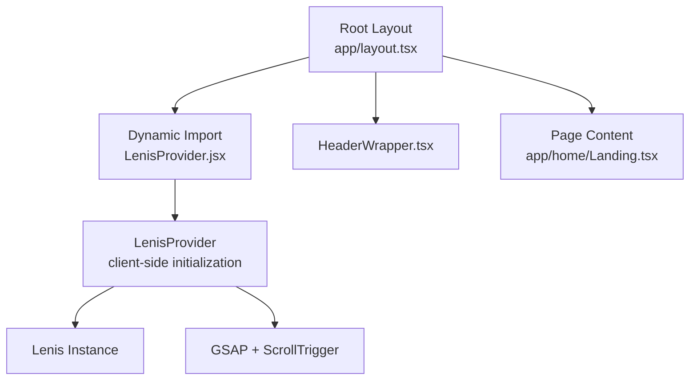
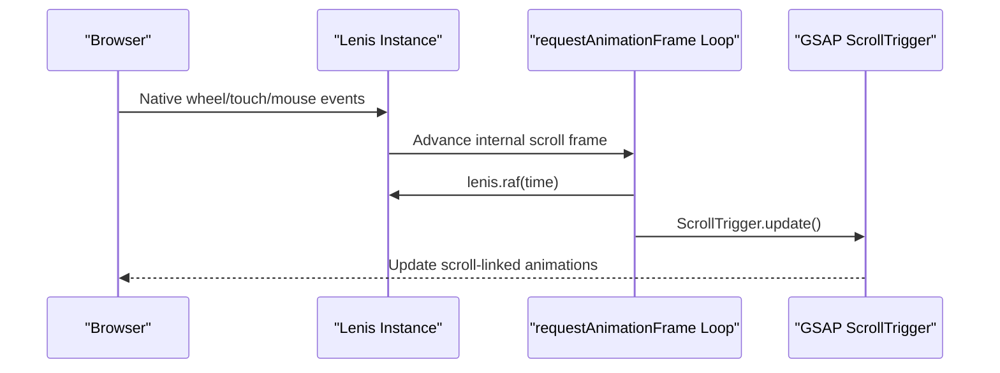
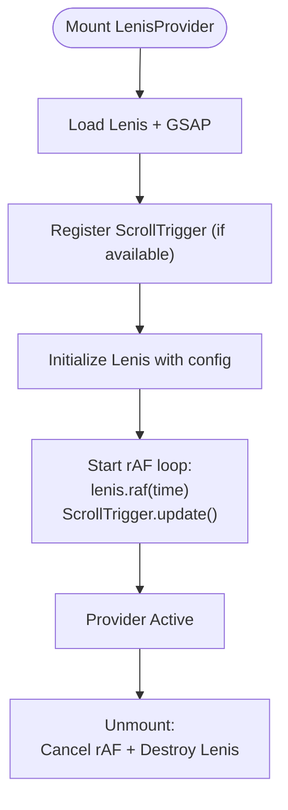
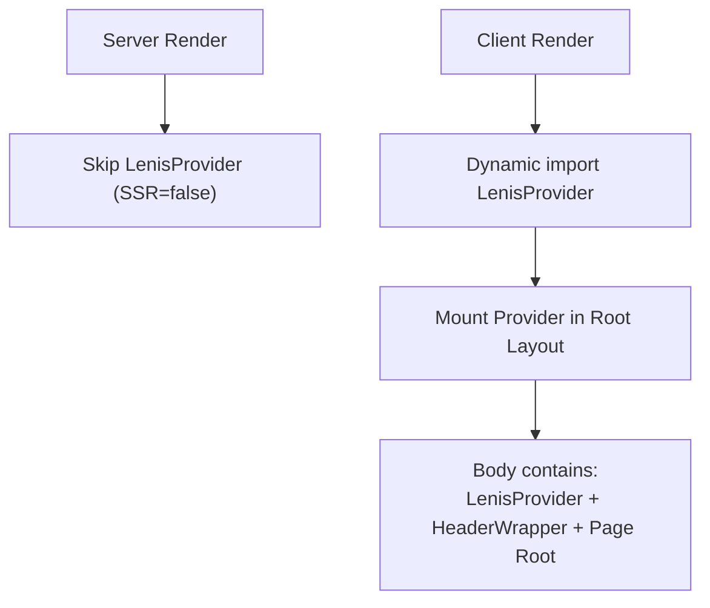
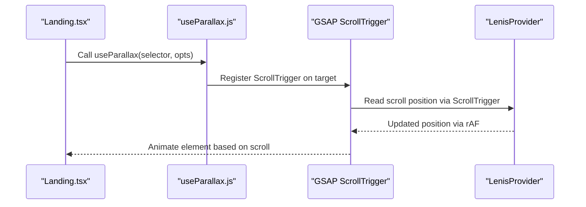
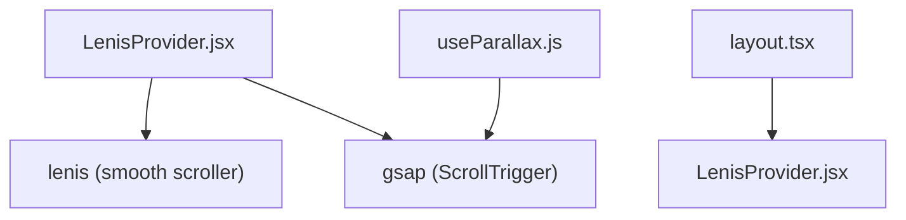

# Smooth Scrolling with Lenis

<cite>
**Referenced Files in This Document**
- [LenisProvider.jsx](file://components/animations/LenisProvider.jsx)
- [layout.tsx](file://app/layout.tsx)
- [package.json](file://package.json)
- [Landing.tsx](file://app/home/Landing.tsx)
- [useParallax.js](file://components/animations/useParallax.js)
- [HeaderWrapper.tsx](file://app/components/HeaderWrapper.tsx)
- [globals.css](file://app/globals.css)
</cite>

## Table of Contents
1. [Introduction](#introduction)
2. [Project Structure](#project-structure)
3. [Core Components](#core-components)
4. [Architecture Overview](#architecture-overview)
5. [Detailed Component Analysis](#detailed-component-analysis)
6. [Dependency Analysis](#dependency-analysis)
7. [Performance Considerations](#performance-considerations)
8. [Troubleshooting Guide](#troubleshooting-guide)
9. [Conclusion](#conclusion)
10. [Appendices](#appendices)

## Introduction
This document explains how the Zeex AI website achieves native-like smooth scrolling using Lenis, integrated with GSAP ScrollTrigger and Next.js routing. It covers the LenisProvider setup, configuration options, and how smooth scrolling coordinates with other animations. It also documents performance optimizations, browser compatibility considerations, and practical guidance for customization and troubleshooting.

## Project Structure
Lenis is initialized once at the root of the application and remains active across all pages. The provider is rendered inside the Next.js root layout and is disabled server-side to ensure compatibility with SSR.

**Diagram sources**
- [layout.tsx:13-22](file://app/layout.tsx#L13-L22)
- [LenisProvider.jsx:5-51](file://components/animations/LenisProvider.jsx#L5-L51)

**Section sources**
- [layout.tsx:1-24](file://app/layout.tsx#L1-L24)
- [LenisProvider.jsx:1-52](file://components/animations/LenisProvider.jsx#L1-L52)

## Core Components
- LenisProvider: Lazily loads Lenis and GSAP, initializes Lenis with smooth scrolling, and synchronizes GSAP ScrollTrigger updates via requestAnimationFrame.
- Root Layout: Dynamically imports LenisProvider to avoid SSR hydration mismatches.
- GSAP ScrollTrigger: Registered and used by both LenisProvider and useParallax for scroll-driven animations.
- useParallax: A lightweight helper that applies GSAP ScrollTrigger-based parallax to DOM elements.

Key configuration highlights:
- Duration and easing are tuned for a natural feel.
- Smooth scrolling is enabled.
- GSAP ScrollTrigger is registered globally for coordinated updates.

**Section sources**
- [LenisProvider.jsx:28-32](file://components/animations/LenisProvider.jsx#L28-L32)
- [LenisProvider.jsx:24-26](file://components/animations/LenisProvider.jsx#L24-L26)
- [useParallax.js:16-25](file://components/animations/useParallax.js#L16-L25)

## Architecture Overview
The smooth scrolling pipeline integrates Lenis with GSAP ScrollTrigger and Next.js routing. Lenis intercepts native scroll events and advances a virtual scroll state synchronized with requestAnimationFrame. GSAP ScrollTrigger reads this state to drive scroll-linked animations.

**Diagram sources**
- [LenisProvider.jsx:34-39](file://components/animations/LenisProvider.jsx#L34-L39)

**Section sources**
- [LenisProvider.jsx:12-40](file://components/animations/LenisProvider.jsx#L12-L40)

## Detailed Component Analysis

### LenisProvider Component
Responsibilities:
- Dynamically import Lenis and GSAP at runtime.
- Register GSAP ScrollTrigger plugin.
- Initialize Lenis with duration, easing, and smooth options.
- Drive Lenis via requestAnimationFrame and synchronize ScrollTrigger updates.
- Cleanup on unmount.

Implementation notes:
- Uses Promise.all to concurrently load Lenis and GSAP.
- Attempts to import ScrollTrigger from the ES module path, with a fallback to the default export.
- Registers ScrollTrigger with GSAP if available.
- Starts a persistent rAF loop that calls lenis.raf and ScrollTrigger.update.
- Destroys the Lenis instance and cancels the animation frame on unmount.

**Diagram sources**
- [LenisProvider.jsx:12-48](file://components/animations/LenisProvider.jsx#L12-L48)

**Section sources**
- [LenisProvider.jsx:3-51](file://components/animations/LenisProvider.jsx#L3-L51)

### Root Layout Integration
- Uses Next.js dynamic import with SSR disabled to ensure client-only rendering of LenisProvider.
- Ensures LenisProvider is rendered before page content so all routes benefit from smooth scrolling.

**Diagram sources**
- [layout.tsx:6](file://app/layout.tsx#L6)
- [layout.tsx:17](file://app/layout.tsx#L17)

**Section sources**
- [layout.tsx:6](file://app/layout.tsx#L6)
- [layout.tsx:13-22](file://app/layout.tsx#L13-L22)

### Scroll-Linked Animations Coordination
- GSAP ScrollTrigger is registered in LenisProvider and used by useParallax to create scroll-driven effects.
- useParallax sets up a ScrollTrigger-based tween that moves an element along the Y axis as the user scrolls.
- The rAF loop ensures ScrollTrigger reads the latest Lenis-managed scroll position.

**Diagram sources**
- [useParallax.js:16-25](file://components/animations/useParallax.js#L16-L25)
- [LenisProvider.jsx:34-39](file://components/animations/LenisProvider.jsx#L34-L39)

**Section sources**
- [useParallax.js:1-30](file://components/animations/useParallax.js#L1-L30)
- [Landing.tsx:470-488](file://app/home/Landing.tsx#L470-L488)

### Header Visibility and Layout Impact
- HeaderWrapper toggles a body class based on the current route to adjust page content spacing when the header is visible.
- This ensures smooth scrolling does not conflict with layout shifts caused by header visibility changes.

**Section sources**
- [HeaderWrapper.tsx:7-24](file://app/components/HeaderWrapper.tsx#L7-L24)

## Dependency Analysis
External libraries:
- lenis: Provides native-like smooth scrolling by normalizing scroll events and advancing a virtual scroll state.
- gsap: Provides ScrollTrigger for scroll-linked animations and timeline control.
- next: Enables dynamic imports and SSR control for client-only components.

**Diagram sources**
- [package.json:11-21](file://package.json#L11-L21)
- [LenisProvider.jsx:13-22](file://components/animations/LenisProvider.jsx#L13-L22)

**Section sources**
- [package.json:11-21](file://package.json#L11-L21)

## Performance Considerations
- requestAnimationFrame synchronization: The rAF loop advances Lenis and updates ScrollTrigger in sync, minimizing jank and ensuring smooth animation playback.
- Lazy loading: Both Lenis and GSAP are imported dynamically to reduce initial bundle size and improve time-to-first-paint.
- Passive event listeners: Wherever possible, event listeners are configured as passive to avoid layout thrashing.
- Scroll normalization: Lenis normalizes scroll deltas and timing, reducing stutter on various input devices and browsers.
- Cleanup: On unmount, the animation frame is canceled and the Lenis instance is destroyed to prevent memory leaks.

[No sources needed since this section provides general guidance]

## Troubleshooting Guide
Common issues and resolutions:
- Scroll jank or stutter:
  - Verify the rAF loop is running and ScrollTrigger.update is being called alongside lenis.raf.
  - Confirm passive event listeners are used for non-blocking scroll handling.
- Animations not syncing with scroll:
  - Ensure GSAP ScrollTrigger is registered before creating scroll-driven tweens.
  - Confirm useParallax is invoked after the DOM element exists and GSAP is available.
- SSR hydration mismatch:
  - Confirm LenisProvider is dynamically imported with SSR disabled in the root layout.
- Unexpected scroll snapping or section jumps:
  - Review custom wheel handlers that programmatically scroll to sections; ensure they account for ongoing smooth scrolling and debouncing.
- Mobile performance:
  - Consider disabling heavy scroll-triggered effects on low-powered devices or using reduced motion preferences.

**Section sources**
- [LenisProvider.jsx:34-39](file://components/animations/LenisProvider.jsx#L34-L39)
- [useParallax.js:16-25](file://components/animations/useParallax.js#L16-L25)
- [layout.tsx:6](file://app/layout.tsx#L6)
- [Landing.tsx:441-464](file://app/home/Landing.tsx#L441-L464)

## Conclusion
Lenis delivers native-like smooth scrolling by normalizing input events and advancing a virtual scroll state synchronized with requestAnimationFrame. Combined with GSAP ScrollTrigger, it enables precise, performant scroll-linked animations across the Zeex AI website. The root-level provider setup ensures seamless integration with Next.js routing and responsive behavior across devices.

[No sources needed since this section summarizes without analyzing specific files]

## Appendices

### Configuration Options Reference
- Duration: Controls the perceived length of the smooth scroll response.
- Easing: Curves the acceleration/deceleration profile for natural motion.
- Smooth: Enables Lenis’ smoothing behavior for scroll deltas.

These are set during Lenis initialization and govern the baseline smoothness of scroll interactions.

**Section sources**
- [LenisProvider.jsx:28-32](file://components/animations/LenisProvider.jsx#L28-L32)

### Customization Guidance
- Adjust scroll speed:
  - Modify the duration and easing parameters in the Lenis constructor to tailor responsiveness.
- Add scroll indicators:
  - Use the document’s scroll progress to drive UI indicators; coordinate with the rAF loop to avoid extra reflows.
- Integrate with scroll-triggered animations:
  - Use GSAP ScrollTrigger (registered in LenisProvider) to create timelines and tweens that react to scroll position.
- Viewport-based triggers:
  - Configure ScrollTrigger with start/end positions relative to the viewport to create entrance and exit animations.

**Section sources**
- [LenisProvider.jsx:24-26](file://components/animations/LenisProvider.jsx#L24-L26)
- [useParallax.js:16-25](file://components/animations/useParallax.js#L16-L25)

### Browser Compatibility and Fallbacks
- Dynamic imports ensure Lenis and GSAP are only loaded on the client, avoiding SSR issues.
- Passive event listeners minimize layout blocking on modern browsers.
- For older environments, consider providing a degraded experience (e.g., disabling parallax) while retaining core smooth scrolling.

**Section sources**
- [layout.tsx:6](file://app/layout.tsx#L6)
- [Landing.tsx:470-488](file://app/home/Landing.tsx#L470-L488)