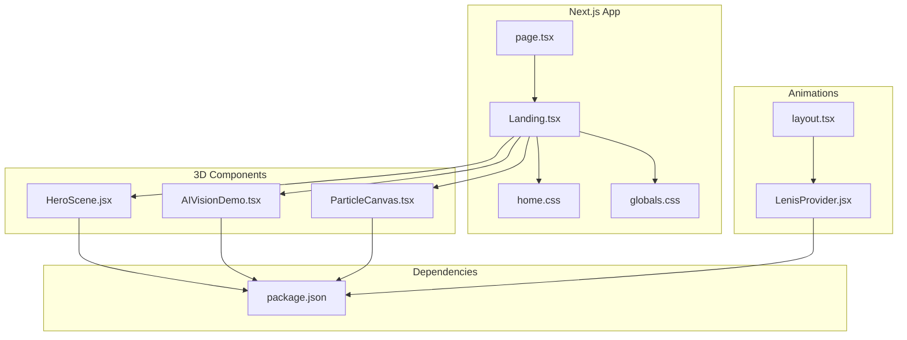
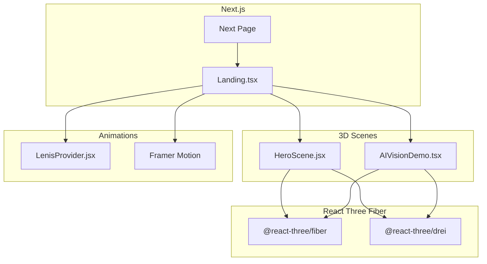
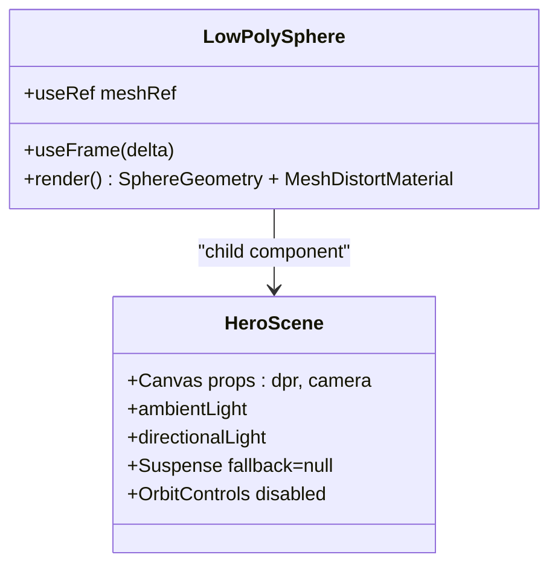
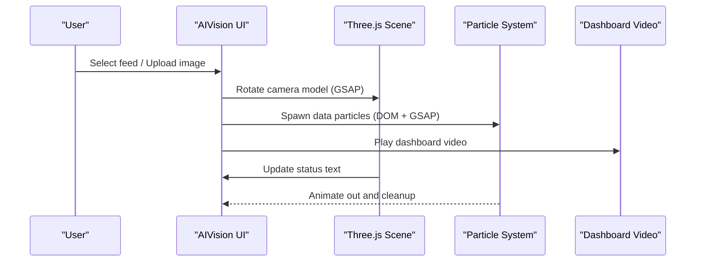
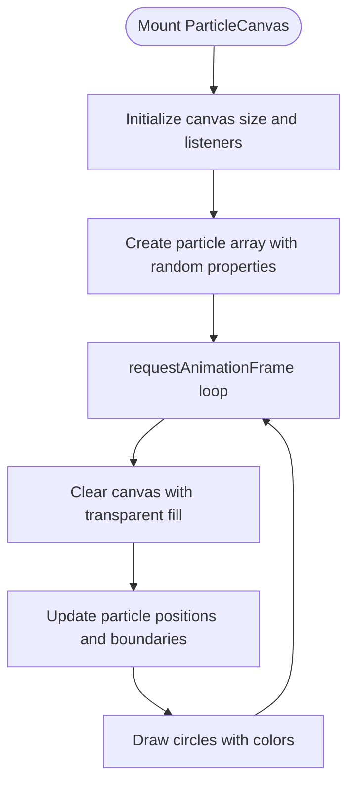
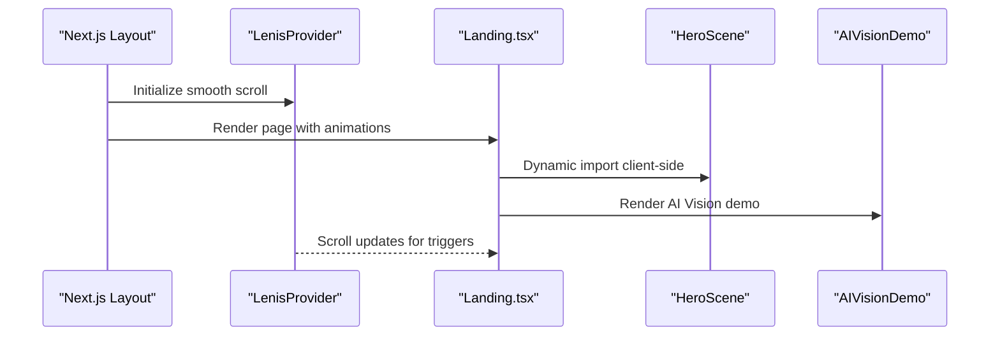
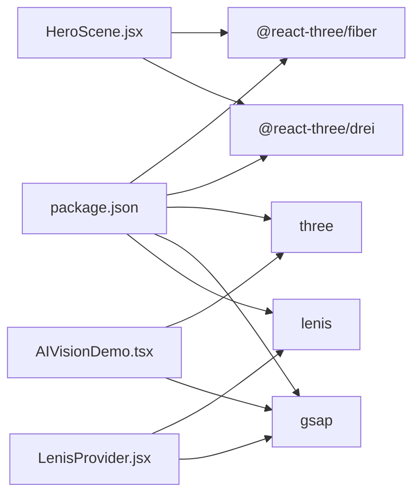

# 3D Visualization System

<cite>
**Referenced Files in This Document**
- [HeroScene.jsx](file://components/3d/HeroScene.jsx)
- [AIVisionDemo.tsx](file://app/home/AIVisionDemo.tsx)
- [ParticleCanvas.tsx](file://app/components/ParticleCanvas.tsx)
- [Landing.tsx](file://app/home/Landing.tsx)
- [layout.tsx](file://app/layout.tsx)
- [LenisProvider.jsx](file://components/animations/LenisProvider.jsx)
- [home.css](file://app/home/home.css)
- [globals.css](file://app/globals.css)
- [package.json](file://package.json)
</cite>

## Table of Contents
1. [Introduction](#introduction)
2. [Project Structure](#project-structure)
3. [Core Components](#core-components)
4. [Architecture Overview](#architecture-overview)
5. [Detailed Component Analysis](#detailed-component-analysis)
6. [Dependency Analysis](#dependency-analysis)
7. [Performance Considerations](#performance-considerations)
8. [Troubleshooting Guide](#troubleshooting-guide)
9. [Conclusion](#conclusion)

## Introduction
This document describes the 3D visualization system that powers the Zeex AI website, focusing on the React Three Fiber architecture integrated with Next.js for server-side rendering and client-side interactivity. It covers the HeroScene component for immersive rotating camera visualization, the AI Vision demonstration showcasing real-time video processing with particle effects, performance optimization techniques, and integration with the broader animation ecosystem. Browser compatibility and fallback strategies are addressed for environments without WebGL support.

## Project Structure
The 3D system is organized across several key areas:
- React Three Fiber components for declarative 3D scenes
- Next.js pages and layouts for SSR/SSG and client hydration
- Animation providers for scroll-driven motion
- CSS modules for styling and responsive behavior
- TypeScript components for advanced 3D demos with Three.js

**Diagram sources**
- [Landing.tsx:48-58](file://app/home/Landing.tsx#L48-L58)
- [HeroScene.jsx:23-36](file://components/3d/HeroScene.jsx#L23-L36)
- [AIVisionDemo.tsx:11-562](file://app/home/AIVisionDemo.tsx#L11-L562)
- [ParticleCanvas.tsx:5-71](file://app/components/ParticleCanvas.tsx#L5-L71)
- [LenisProvider.jsx:5-52](file://components/animations/LenisProvider.jsx#L5-L52)
- [layout.tsx:13-23](file://app/layout.tsx#L13-L23)
- [package.json:11-21](file://package.json#L11-L21)

**Section sources**
- [Landing.tsx:48-58](file://app/home/Landing.tsx#L48-L58)
- [HeroScene.jsx:23-36](file://components/3d/HeroScene.jsx#L23-L36)
- [AIVisionDemo.tsx:11-562](file://app/home/AIVisionDemo.tsx#L11-L562)
- [ParticleCanvas.tsx:5-71](file://app/components/ParticleCanvas.tsx#L5-L71)
- [LenisProvider.jsx:5-52](file://components/animations/LenisProvider.jsx#L5-L52)
- [layout.tsx:13-23](file://app/layout.tsx#L13-L23)
- [package.json:11-21](file://package.json#L11-L21)

## Core Components
- HeroScene: A lightweight, declarative 3D scene using React Three Fiber and Drei for a rotating low-poly sphere with distortion material and ambient/directional lighting.
- AIVisionDemo: A complex interactive demo combining Three.js for camera modeling, particle effects, video playback, and animated UI transitions.
- ParticleCanvas: A lightweight 2D particle canvas for background ambiance and performance-friendly particle systems.
- LenisProvider: A scroll provider enabling smooth scroll with GSAP integration for scroll-driven animations.

Key implementation references:
- HeroScene component definition and Canvas setup
- AIVisionDemo Three.js scene construction, materials, and animation loop
- ParticleCanvas particle generation and animation loop
- LenisProvider lazy initialization and RAF integration

**Section sources**
- [HeroScene.jsx:7-21](file://components/3d/HeroScene.jsx#L7-L21)
- [HeroScene.jsx:23-36](file://components/3d/HeroScene.jsx#L23-L36)
- [AIVisionDemo.tsx:38-177](file://app/home/AIVisionDemo.tsx#L38-L177)
- [AIVisionDemo.tsx:216-254](file://app/home/AIVisionDemo.tsx#L216-L254)
- [ParticleCanvas.tsx:25-67](file://app/components/ParticleCanvas.tsx#L25-L67)
- [LenisProvider.jsx:12-48](file://components/animations/LenisProvider.jsx#L12-L48)

## Architecture Overview
The 3D system leverages React Three Fiber for declarative 3D composition within Next.js pages. HeroScene uses a Canvas with lighting and controls, while AIVisionDemo constructs a full Three.js scene programmatically. Both integrate with the broader animation stack via Lenis and Framer Motion for scroll-driven effects.

**Diagram sources**
- [HeroScene.jsx:3-5](file://components/3d/HeroScene.jsx#L3-L5)
- [AIVisionDemo.tsx:3-7](file://app/home/AIVisionDemo.tsx#L3-L7)
- [Landing.tsx:7-9](file://app/home/Landing.tsx#L7-L9)
- [LenisProvider.jsx:13-26](file://components/animations/LenisProvider.jsx#L13-L26)

## Detailed Component Analysis

### HeroScene Component
HeroScene creates a self-contained, declarative 3D visualization using React Three Fiber and Drei primitives. It defines a rotating low-poly sphere with a distortion material, ambient and directional lighting, and orbit controls configured to disable zoom, pan, and rotation for a fixed camera view.

**Diagram sources**
- [HeroScene.jsx:7-21](file://components/3d/HeroScene.jsx#L7-L21)
- [HeroScene.jsx:23-36](file://components/3d/HeroScene.jsx#L23-L36)

Processing logic highlights:
- Frame rotation updates the sphere's Y-axis rotation using delta time
- Canvas DPR and camera configuration optimize rendering quality
- Lighting setup uses ambient and directional lights for a modern 3D look
- Orbit controls are disabled to maintain a fixed camera perspective

**Section sources**
- [HeroScene.jsx:7-21](file://components/3d/HeroScene.jsx#L7-L21)
- [HeroScene.jsx:23-36](file://components/3d/HeroScene.jsx#L23-L36)

### AI Vision Demonstration
The AI Vision demo composes a complex interactive pipeline:
- Three.js scene with procedural camera model and materials
- Real-time particle effects synchronized with UI interactions
- Video playback and status indicators
- Animated UI transitions using GSAP and scroll-driven effects

**Diagram sources**
- [AIVisionDemo.tsx:180-202](file://app/home/AIVisionDemo.tsx#L180-L202)
- [AIVisionDemo.tsx:216-254](file://app/home/AIVisionDemo.tsx#L216-L254)
- [AIVisionDemo.tsx:337-437](file://app/home/AIVisionDemo.tsx#L337-L437)

Key implementation details:
- Three.js scene setup with materials (MeshStandardMaterial, MeshPhysicalMaterial)
- GLTF loader fallback to procedural geometry
- OrbitControls configured for auto-rotation and damping
- Particle spawning via DOM elements with GSAP tweens
- Auto-cycle orchestration with status updates and video playback

**Section sources**
- [AIVisionDemo.tsx:38-177](file://app/home/AIVisionDemo.tsx#L38-L177)
- [AIVisionDemo.tsx:216-254](file://app/home/AIVisionDemo.tsx#L216-L254)
- [AIVisionDemo.tsx:337-437](file://app/home/AIVisionDemo.tsx#L337-L437)

### ParticleCanvas Component
ParticleCanvas renders a 2D particle system using HTML5 Canvas for lightweight, GPU-accelerated particle rendering. It manages resize events, initializes particles with random positions and velocities, and animates them using requestAnimationFrame.

**Diagram sources**
- [ParticleCanvas.tsx:12-67](file://app/components/ParticleCanvas.tsx#L12-L67)

Performance characteristics:
- Transparent background ensures seamless blending with page content
- Efficient clearing and drawing minimize overdraw
- Cleanup on unmount prevents memory leaks

**Section sources**
- [ParticleCanvas.tsx:25-67](file://app/components/ParticleCanvas.tsx#L25-L67)

### Integration with Animation System
The 3D components integrate with Next.js and broader animation providers:
- Dynamic imports ensure 3D components are client-only, preventing SSR issues
- LenisProvider enables smooth scroll with GSAP ScrollTrigger integration
- Framer Motion enhances page transitions and reveals

**Diagram sources**
- [layout.tsx:13-23](file://app/layout.tsx#L13-L23)
- [LenisProvider.jsx:12-48](file://components/animations/LenisProvider.jsx#L12-L48)
- [Landing.tsx:48-58](file://app/home/Landing.tsx#L48-L58)

**Section sources**
- [layout.tsx:13-23](file://app/layout.tsx#L13-L23)
- [LenisProvider.jsx:12-48](file://components/animations/LenisProvider.jsx#L12-L48)
- [Landing.tsx:48-58](file://app/home/Landing.tsx#L48-L58)

## Dependency Analysis
External libraries and their roles:
- @react-three/fiber: Declarative React renderer for Three.js
- @react-three/drei: Helpful helpers and controls for React Three Fiber
- three: Core 3D engine for geometry, materials, and rendering
- gsap: Animation library for smooth transitions and camera movements
- lenis: Smooth scroll implementation with GSAP integration

**Diagram sources**
- [package.json:11-21](file://package.json#L11-L21)
- [HeroScene.jsx:3-5](file://components/3d/HeroScene.jsx#L3-L5)
- [AIVisionDemo.tsx:3-7](file://app/home/AIVisionDemo.tsx#L3-L7)
- [LenisProvider.jsx:13-26](file://components/animations/LenisProvider.jsx#L13-L26)

**Section sources**
- [package.json:11-21](file://package.json#L11-L21)

## Performance Considerations
- Canvas DPR configuration: HeroScene sets device pixel ratio range to balance quality and performance.
- Pixel ratio limiting: AIVisionDemo caps device pixel ratio to prevent excessive rendering on high-DPI displays.
- Frame rate optimization: Both components rely on requestAnimationFrame loops and delta-based updates for smooth animation.
- Memory management: Proper cleanup of event listeners, animation frames, and Three.js resources prevents memory leaks.
- Lazy loading: Dynamic imports ensure 3D components are only loaded on the client, reducing initial bundle size.
- Responsive sizing: Automatic resize handlers ensure optimal rendering across devices.

Practical recommendations:
- Prefer declarative components (React Three Fiber) for simpler lifecycle management
- Use controlled animations (delta time) for consistent frame rates
- Limit expensive operations in render loops (e.g., frequent geometry recalculations)
- Dispose of resources when components unmount

**Section sources**
- [HeroScene.jsx:26](file://components/3d/HeroScene.jsx#L26)
- [AIVisionDemo.tsx:44](file://app/home/AIVisionDemo.tsx#L44)
- [AIVisionDemo.tsx:165-177](file://app/home/AIVisionDemo.tsx#L165-L177)

## Troubleshooting Guide
Common issues and resolutions:
- WebGL not supported: HeroScene uses a fallback Sparkles component when dynamic imports fail. Verify client-side rendering and ensure modern browsers.
- Performance drops: Reduce geometry complexity, limit particle counts, and cap DPR values.
- Animation jank: Use delta-based updates and avoid synchronous layout thrashing.
- Memory leaks: Ensure requestAnimationFrame cancellation and resource disposal in cleanup functions.
- Scroll conflicts: Confirm Lenis initialization order and proper RAF integration.

Validation references:
- Dynamic import fallbacks for 3D components
- Cleanup functions for animation frames and event listeners
- Material and geometry disposal in Three.js components

**Section sources**
- [Landing.tsx:48-58](file://app/home/Landing.tsx#L48-L58)
- [AIVisionDemo.tsx:204-213](file://app/home/AIVisionDemo.tsx#L204-L213)
- [ParticleCanvas.tsx:63-67](file://app/components/ParticleCanvas.tsx#L63-L67)

## Conclusion
The 3D visualization system combines React Three Fiber with Next.js to deliver immersive, performant experiences. HeroScene demonstrates a compact, declarative approach suitable for subtle 3D accents, while AIVisionDemo showcases a comprehensive pipeline integrating 3D rendering, particle effects, and interactive UI. With careful performance tuning, lazy loading, and robust cleanup, the system scales across devices and browsers. Extending the system involves adding new React Three Fiber components or Three.js scenes, integrating with the animation providers, and ensuring responsive behavior and accessibility.