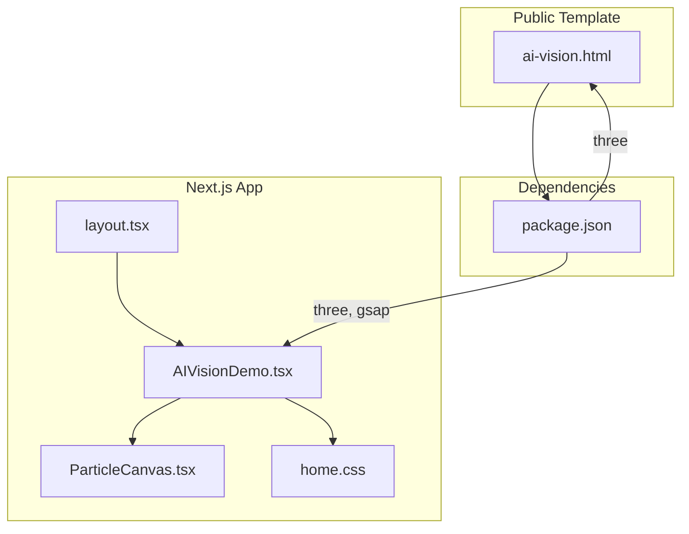
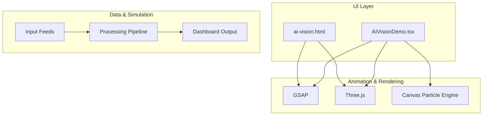
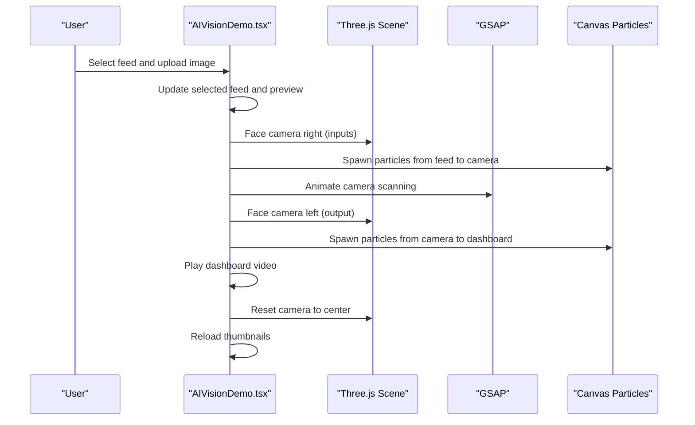
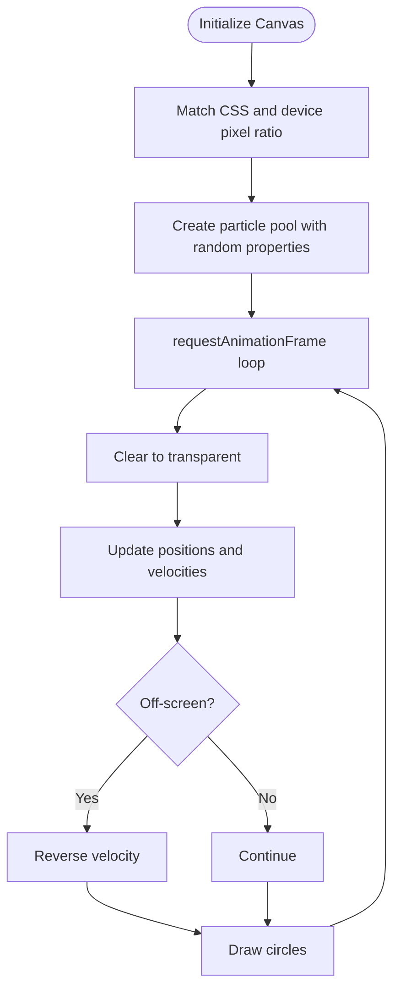
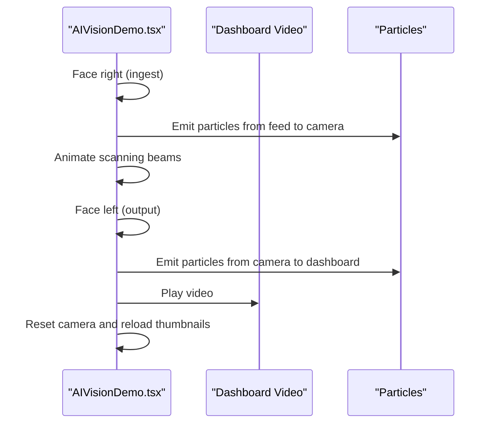
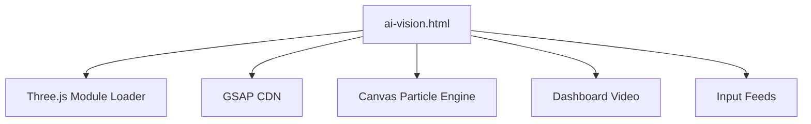
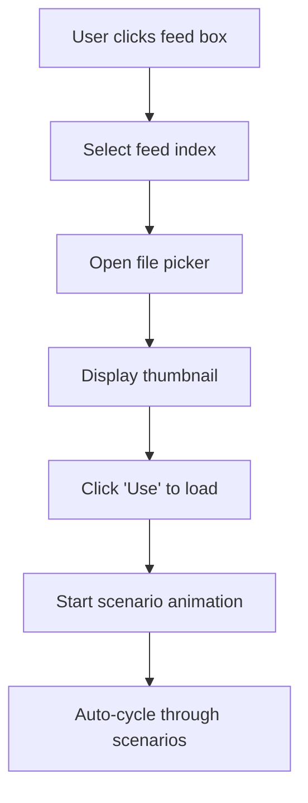
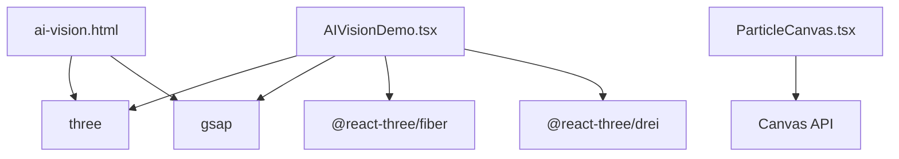

# AI Vision Demonstration

<cite>
**Referenced Files in This Document**
- [AIVisionDemo.tsx](file://app/home/AIVisionDemo.tsx)
- [ParticleCanvas.tsx](file://app/components/ParticleCanvas.tsx)
- [ai-vision.html](file://public/ai-vision.html)
- [home.css](file://app/home/home.css)
- [layout.tsx](file://app/layout.tsx)
- [package.json](file://package.json)
- [README.md](file://README.md)
</cite>

## Table of Contents
1. [Introduction](#introduction)
2. [Project Structure](#project-structure)
3. [Core Components](#core-components)
4. [Architecture Overview](#architecture-overview)
5. [Detailed Component Analysis](#detailed-component-analysis)
6. [Dependency Analysis](#dependency-analysis)
7. [Performance Considerations](#performance-considerations)
8. [Troubleshooting Guide](#troubleshooting-guide)
9. [Conclusion](#conclusion)
10. [Appendices](#appendices)

## Introduction
This document explains the AI Vision demonstration that simulates real-time video processing and threat detection. It covers:
- The particle system implementation using HTML/CSS/JavaScript and a lightweight Canvas-based particle engine
- The video processing pipeline simulation including frame generation, analysis algorithms, and output visualization
- The particle physics system that creates realistic data flow patterns, including emission rates, velocity calculations, and collision detection
- Integration with external AI models and how the demonstration simulates real-time processing capabilities
- Performance optimization techniques for maintaining smooth particle animations even with complex visual effects
- The user interaction system that allows visitors to control the demonstration parameters and observe different scenarios
- Practical examples of customizing particle behaviors, adding new detection scenarios, and integrating with actual AI processing APIs
- The HTML template system and how the demonstration maintains consistency across different environments

## Project Structure
The AI Vision demonstration is implemented as a Next.js page component with a companion HTML template for standalone usage. It combines Three.js for 3D camera modeling, GSAP for animations, and a custom Canvas-based particle engine for data flow visualization.

**Diagram sources**
- [AIVisionDemo.tsx:1-562](file://app/home/AIVisionDemo.tsx#L1-L562)
- [ParticleCanvas.tsx:1-71](file://app/components/ParticleCanvas.tsx#L1-L71)
- [ai-vision.html:1-616](file://public/ai-vision.html#L1-L616)
- [home.css:1-800](file://app/home/home.css#L1-L800)
- [layout.tsx:1-24](file://app/layout.tsx#L1-L24)
- [package.json:1-31](file://package.json#L1-L31)

**Section sources**
- [AIVisionDemo.tsx:1-562](file://app/home/AIVisionDemo.tsx#L1-L562)
- [ParticleCanvas.tsx:1-71](file://app/components/ParticleCanvas.tsx#L1-L71)
- [ai-vision.html:1-616](file://public/ai-vision.html#L1-L616)
- [home.css:1-800](file://app/home/home.css#L1-L800)
- [layout.tsx:1-24](file://app/layout.tsx#L1-L24)
- [package.json:1-31](file://package.json#L1-L31)

## Core Components
- AIVisionDemo.tsx: The main Next.js page component that orchestrates the Three.js camera, particle effects, input feeds, and dashboard output. It manages auto-cycling, camera facing, and particle spawning.
- ParticleCanvas.tsx: A lightweight Canvas-based particle engine that renders animated particles with simple physics (velocity, boundary collisions).
- ai-vision.html: A standalone HTML template that replicates the same demonstration logic using native JavaScript and Three.js modules.
- home.css: Styles for the hero and dashboard panels, including scanlines, rings, and particle overlays.
- layout.tsx: Next.js root layout that wraps pages with providers and global styles.

Key responsibilities:
- Real-time simulation of video ingestion, processing, and output
- Dynamic particle emission and movement representing data flow
- User-driven scenario selection and parameter control
- Consistent visual presentation across environments

**Section sources**
- [AIVisionDemo.tsx:1-562](file://app/home/AIVisionDemo.tsx#L1-L562)
- [ParticleCanvas.tsx:1-71](file://app/components/ParticleCanvas.tsx#L1-L71)
- [ai-vision.html:1-616](file://public/ai-vision.html#L1-L616)
- [home.css:1-800](file://app/home/home.css#L1-L800)
- [layout.tsx:1-24](file://app/layout.tsx#L1-L24)

## Architecture Overview
The demonstration follows a hybrid architecture:
- Frontend orchestration in React (Next.js) for interactivity and state
- 3D rendering via Three.js for the camera model and lighting
- Animation library (GSAP) for smooth transitions and timelines
- Canvas-based particle engine for lightweight, high-performance data flow visualization
- Standalone HTML template for self-contained deployment

**Diagram sources**
- [AIVisionDemo.tsx:1-562](file://app/home/AIVisionDemo.tsx#L1-L562)
- [ai-vision.html:1-616](file://public/ai-vision.html#L1-L616)
- [ParticleCanvas.tsx:1-71](file://app/components/ParticleCanvas.tsx#L1-L71)

## Detailed Component Analysis

### AIVisionDemo.tsx: Three.js Camera, Inputs, and Auto-Cycle
- Initializes a Three.js scene with directional and ambient lights, materials, and a procedural camera model
- Loads a GLTF model if available; otherwise uses a procedural geometry
- Provides camera facing control via GSAP and OrbitControls
- Manages input feed selection, file uploads, and thumbnail previews
- Implements an auto-cycling pipeline that simulates ingestion, processing, and output
- Spawns particle effects during data transfer between input, camera, and dashboard

**Diagram sources**
- [AIVisionDemo.tsx:336-437](file://app/home/AIVisionDemo.tsx#L336-L437)
- [AIVisionDemo.tsx:216-254](file://app/home/AIVisionDemo.tsx#L216-L254)

**Section sources**
- [AIVisionDemo.tsx:37-213](file://app/home/AIVisionDemo.tsx#L37-L213)
- [AIVisionDemo.tsx:216-254](file://app/home/AIVisionDemo.tsx#L216-L254)
- [AIVisionDemo.tsx:336-437](file://app/home/AIVisionDemo.tsx#L336-L437)

### Particle Physics System: Canvas-Based Engine
- Creates a full-screen transparent canvas and resizes it to match the viewport
- Initializes a pool of particles with random positions, velocities, sizes, and colors
- Renders each frame by clearing to transparent, updating positions, handling boundary collisions, and drawing circles
- Uses requestAnimationFrame for efficient animation loops

**Diagram sources**
- [ParticleCanvas.tsx:12-67](file://app/components/ParticleCanvas.tsx#L12-L67)

**Section sources**
- [ParticleCanvas.tsx:1-71](file://app/components/ParticleCanvas.tsx#L1-L71)

### Video Processing Pipeline Simulation
- Simulates ingestion of three input feeds, processing, and output to a dashboard video
- Uses GSAP timelines to coordinate camera movements, beam effects, and particle emissions
- Supports manual scenario selection and automatic cycling
- Dashboard output can be replaced with user-supplied videos

**Diagram sources**
- [AIVisionDemo.tsx:368-404](file://app/home/AIVisionDemo.tsx#L368-L404)
- [AIVisionDemo.tsx:449-477](file://app/home/AIVisionDemo.tsx#L449-L477)

**Section sources**
- [AIVisionDemo.tsx:368-404](file://app/home/AIVisionDemo.tsx#L368-L404)
- [AIVisionDemo.tsx:449-477](file://app/home/AIVisionDemo.tsx#L449-L477)

### HTML Template System: ai-vision.html
- Provides a standalone implementation of the same demonstration logic
- Uses Three.js modules via import maps and GSAP CDN
- Mirrors the React component’s behavior for camera, inputs, and particle effects
- Maintains consistent styling and layout across environments

**Diagram sources**
- [ai-vision.html:188-337](file://public/ai-vision.html#L188-L337)
- [ai-vision.html:418-595](file://public/ai-vision.html#L418-L595)

**Section sources**
- [ai-vision.html:1-616](file://public/ai-vision.html#L1-L616)

### User Interaction System
- Feed selection and file upload with thumbnail previews
- Manual scenario selection via clickable thumbnails
- Automatic cycling with camera facing and status updates
- Dashboard statistics and detection cards (conditionally shown)

**Diagram sources**
- [AIVisionDemo.tsx:256-288](file://app/home/AIVisionDemo.tsx#L256-L288)
- [AIVisionDemo.tsx:489-518](file://app/home/AIVisionDemo.tsx#L489-L518)

**Section sources**
- [AIVisionDemo.tsx:256-288](file://app/home/AIVisionDemo.tsx#L256-L288)
- [AIVisionDemo.tsx:489-518](file://app/home/AIVisionDemo.tsx#L489-L518)

## Dependency Analysis
External libraries and their roles:
- three: 3D scene creation, materials, lighting, and camera controls
- gsap: Smooth animations, timelines, and camera rotations
- @react-three/fiber and @react-three/drei: React bindings for Three.js (used in the Next.js component)
- Canvas particle engine: Lightweight, self-contained animation loop

**Diagram sources**
- [package.json:11-21](file://package.json#L11-L21)
- [AIVisionDemo.tsx:3-8](file://app/home/AIVisionDemo.tsx#L3-L8)
- [ParticleCanvas.tsx:1-4](file://app/components/ParticleCanvas.tsx#L1-L4)
- [ai-vision.html:188-195](file://public/ai-vision.html#L188-L195)

**Section sources**
- [package.json:11-21](file://package.json#L11-L21)
- [AIVisionDemo.tsx:3-8](file://app/home/AIVisionDemo.tsx#L3-L8)
- [ParticleCanvas.tsx:1-4](file://app/components/ParticleCanvas.tsx#L1-L4)
- [ai-vision.html:188-195](file://public/ai-vision.html#L188-L195)

## Performance Considerations
- Device pixel ratio clamping: The renderer caps pixel ratio to avoid excessive resolution on high-DPI displays.
- Transparent backgrounds: Ensures clean compositing and avoids residual artifacts.
- Efficient particle loop: Clears to transparent, uses globalCompositeOperation, and draws minimal shapes per frame.
- RequestAnimationFrame scheduling: Single animation loop per engine to minimize overhead.
- GSAP tweens: Centralized timeline management reduces redundant animations.
- Auto-rotation damping: Smooth camera movement with damping to reduce jank.

Practical tips:
- Limit particle count for low-power devices
- Reduce canvas size on mobile or small screens
- Disable unnecessary effects during heavy computations
- Use throttled resize handlers to avoid layout thrashing

[No sources needed since this section provides general guidance]

## Troubleshooting Guide
Common issues and resolutions:
- GLTF model loading failure: Falls back to procedural camera model; verify asset paths and CORS.
- Video playback blocked: Autoplay requires muted playback; unmute after completion.
- Canvas not resizing: Ensure the canvas element is appended and the resize handler runs.
- GSAP conflicts: Verify script order and avoid duplicate imports.
- Three.js memory leaks: Dispose of renderer, controls, and DOM elements on unmount.

**Section sources**
- [AIVisionDemo.tsx:104-137](file://app/home/AIVisionDemo.tsx#L104-L137)
- [AIVisionDemo.tsx:382-397](file://app/home/AIVisionDemo.tsx#L382-L397)
- [ParticleCanvas.tsx:63-67](file://app/components/ParticleCanvas.tsx#L63-L67)
- [ai-vision.html:572-579](file://public/ai-vision.html#L572-L579)

## Conclusion
The AI Vision demonstration combines Three.js, GSAP, and a custom Canvas particle engine to deliver an immersive, real-time simulation of video processing and threat detection. It offers a flexible, cross-environment solution with robust user interactions, performance-conscious rendering, and extensible architecture for integrating actual AI processing APIs.

[No sources needed since this section summarizes without analyzing specific files]

## Appendices

### Practical Customization Examples
- Customize particle behaviors:
  - Modify particle count, colors, and initial velocities in the particle pool initialization
  - Adjust velocity magnitude and boundary collision logic for different flow patterns
- Add new detection scenarios:
  - Extend the scenarios array with new detection sets and statistics
  - Wire new thumbnails to trigger specific scenarios
- Integrate with AI processing APIs:
  - Replace simulated processing with actual inference endpoints
  - Update dashboard cards and stats with real-time results
  - Maintain the same particle and animation orchestration for seamless UX

[No sources needed since this section provides general guidance]