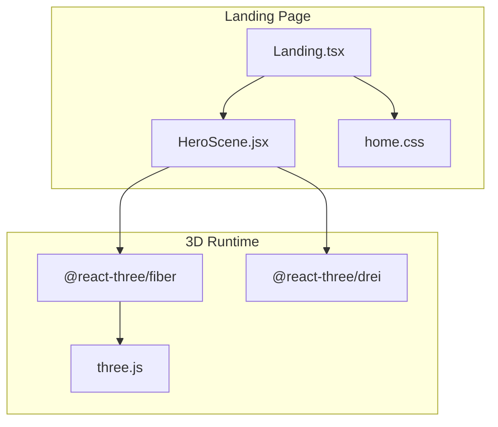
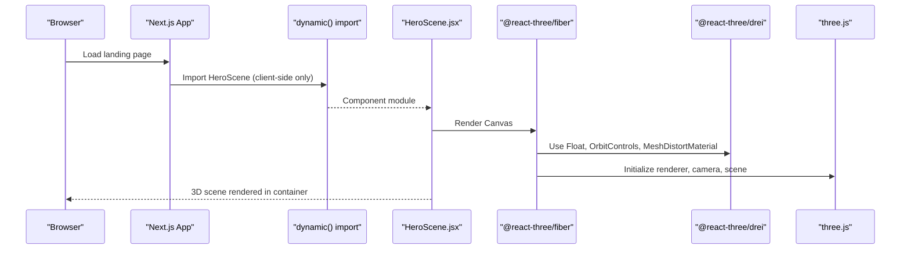
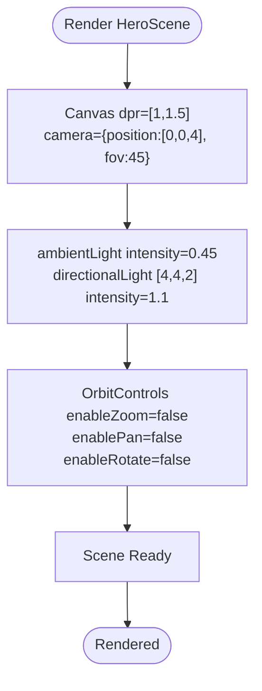
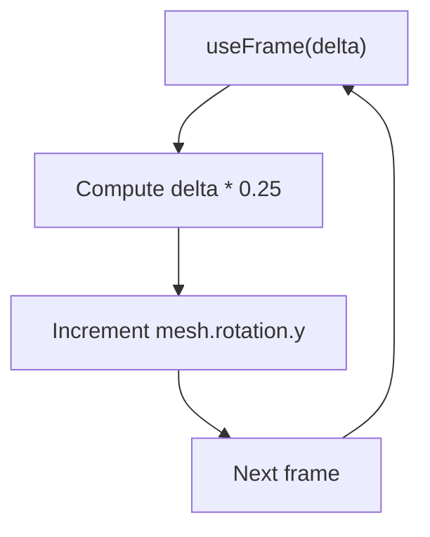
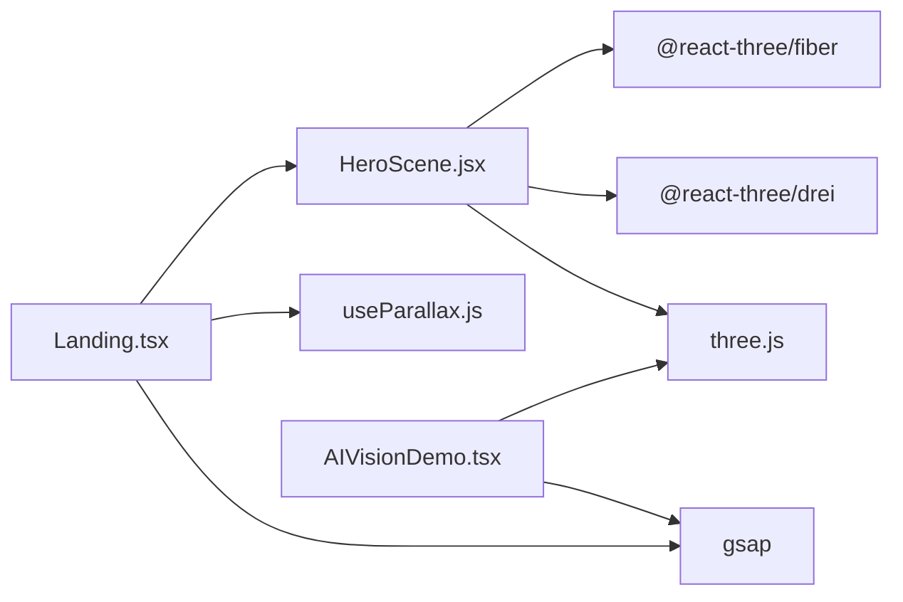

# Hero 3D Scene

<cite>
**Referenced Files in This Document**
- [HeroScene.jsx](file://components/3d/HeroScene.jsx)
- [Landing.tsx](file://app/home/Landing.tsx)
- [home.css](file://app/home/home.css)
- [AIVisionDemo.tsx](file://app/home/AIVisionDemo.tsx)
- [useParallax.js](file://components/animations/useParallax.js)
- [package.json](file://package.json)
- [ai-vision.html](file://public/ai-vision.html)
</cite>

## Table of Contents
1. [Introduction](#introduction)
2. [Project Structure](#project-structure)
3. [Core Components](#core-components)
4. [Architecture Overview](#architecture-overview)
5. [Detailed Component Analysis](#detailed-component-analysis)
6. [Dependency Analysis](#dependency-analysis)
7. [Performance Considerations](#performance-considerations)
8. [Troubleshooting Guide](#troubleshooting-guide)
9. [Conclusion](#conclusion)
10. [Appendices](#appendices)

## Introduction
This document explains the Hero 3D Scene component that powers the centerpiece of the Zeex AI landing page. It covers the React Three Fiber implementation, scene setup, camera configuration, renderer settings, geometry and materials, lighting, animation system, performance optimizations, responsive design, customization examples, integration with the broader landing page animation system, and fallback strategies for environments without WebGL support.

## Project Structure
The Hero 3D Scene is implemented as a standalone React component using @react-three/fiber and @react-three/drei. It is dynamically loaded on the landing page to minimize initial bundle size and improve SSR compatibility. The scene is positioned absolutely in the upper-right corner of the hero area and layered beneath the hero content.

**Diagram sources**
- [Landing.tsx:48-58](file://app/home/Landing.tsx#L48-L58)
- [HeroScene.jsx:3-5](file://components/3d/HeroScene.jsx#L3-L5)
- [home.css:410-427](file://app/home/home.css#L410-L427)

**Section sources**
- [HeroScene.jsx:23-36](file://components/3d/HeroScene.jsx#L23-L36)
- [Landing.tsx:48-58](file://app/home/Landing.tsx#L48-L58)
- [home.css:410-427](file://app/home/home.css#L410-L427)

## Core Components
- HeroScene.jsx: Defines the 3D scene with a rotating low-poly sphere, ambient and directional lighting, and orbit controls disabled for a static camera view.
- Landing.tsx: Dynamically imports HeroScene on the client and provides a lightweight fallback for environments that cannot lazy-load.
- home.css: Positions and styles the 3D scene container and ensures the canvas fills its container.
- AIVisionDemo.tsx: Demonstrates a separate Three.js implementation with procedural camera geometry and GSAP-driven animations for comparison and inspiration.
- useParallax.js: Utility to apply GSAP ScrollTrigger-based parallax effects lazily.

**Section sources**
- [HeroScene.jsx:7-21](file://components/3d/HeroScene.jsx#L7-L21)
- [HeroScene.jsx:23-36](file://components/3d/HeroScene.jsx#L23-L36)
- [Landing.tsx:48-58](file://app/home/Landing.tsx#L48-L58)
- [home.css:410-427](file://app/home/home.css#L410-L427)
- [AIVisionDemo.tsx:37-102](file://app/home/AIVisionDemo.tsx#L37-L102)
- [useParallax.js:1-31](file://components/animations/useParallax.js#L1-L31)

## Architecture Overview
The Hero 3D Scene is a lightweight, self-contained React component that renders a single animated mesh inside a Three.js scene. It uses React Three Fiber’s Canvas to manage the renderer and scene lifecycle, Drei helpers for floating motion and material effects, and OrbitControls to disable user interaction.

**Diagram sources**
- [Landing.tsx:48-58](file://app/home/Landing.tsx#L48-L58)
- [HeroScene.jsx:23-36](file://components/3d/HeroScene.jsx#L23-L36)
- [HeroScene.jsx:3-5](file://components/3d/HeroScene.jsx#L3-L5)

## Detailed Component Analysis

### HeroScene.jsx: Scene Setup, Camera, and Renderer
- Canvas configuration:
  - Device pixel ratio: [1, 1.5] to balance quality and performance.
  - Camera: position [0, 0, 4], field-of-view 45.
- Lighting:
  - Ambient light intensity 0.45.
  - Directional light at [4, 4, 2] with intensity 1.1.
- Controls:
  - OrbitControls disabled for zoom, pan, and rotation to keep the scene static.
- Suspense:
  - Suspense boundary with a null fallback to avoid blocking the initial render.

**Diagram sources**
- [HeroScene.jsx:26-32](file://components/3d/HeroScene.jsx#L26-L32)

**Section sources**
- [HeroScene.jsx:23-36](file://components/3d/HeroScene.jsx#L23-L36)

### Geometry, Materials, and Animation
- Geometry: SphereGeometry with arguments [radius, widthSegments, heightSegments].
- Material: MeshDistortMaterial with color, distort, speed, roughness, metalness.
- Animation: useFrame updates the sphere’s Y rotation by delta time scaled by a constant factor, creating a smooth, continuous rotation.

**Diagram sources**
- [HeroScene.jsx:7-21](file://components/3d/HeroScene.jsx#L7-L21)

**Section sources**
- [HeroScene.jsx:7-21](file://components/3d/HeroScene.jsx#L7-L21)

### Lighting and Materials
- Ambient light: Provides base illumination.
- Directional light: Creates depth and highlights on the sphere.
- MeshDistortMaterial: Adds a subtle distortion and metallic sheen to the sphere surface.

**Section sources**
- [HeroScene.jsx:27-28](file://components/3d/HeroScene.jsx#L27-L28)
- [HeroScene.jsx:16-17](file://components/3d/HeroScene.jsx#L16-L17)

### Responsive Design and Positioning
- Container positioning:
  - Absolute right-side placement with width/height constrained to viewport percentages.
  - Mix-blend-mode and transform optimization for compositing.
- CSS canvas sizing:
  - Ensures the canvas fills its container regardless of device pixel ratio.
- Media queries:
  - Adjusts hero-cam-wrap and related elements for mobile/tablet breakpoints.

**Section sources**
- [home.css:410-427](file://app/home/home.css#L410-L427)
- [home.css:71-75](file://app/home/home.css#L71-L75)
- [home.css:1092-1274](file://app/home/home.css#L1092-L1274)

### Integration with Landing Page Animation System
- Dynamic import:
  - HeroScene is imported client-side only to avoid SSR issues.
- Fallback:
  - A lightweight Sparkles fallback is provided for environments that cannot lazy-load.
- Interaction alignment:
  - The landing page applies GSAP-based parallax and other animations; the 3D scene remains static and visually complementary.

**Section sources**
- [Landing.tsx:48-58](file://app/home/Landing.tsx#L48-L58)
- [Landing.tsx:49-58](file://app/home/Landing.tsx#L49-L58)

### Comparison with Procedural CCTV Model (AIVisionDemo)
- AIVisionDemo demonstrates a more complex Three.js setup with:
  - Procedural geometry for a CCTV camera (housing, stripe, arm, barrel, lens).
  - GLTF loader fallback for a 3D model asset.
  - GSAP-driven rotations and transforms synchronized with UI elements.
- This illustrates advanced patterns for geometry creation, asset loading, and timeline-driven animations.

**Section sources**
- [AIVisionDemo.tsx:37-102](file://app/home/AIVisionDemo.tsx#L37-L102)
- [AIVisionDemo.tsx:180-202](file://app/home/AIVisionDemo.tsx#L180-L202)

## Dependency Analysis
- Core libraries:
  - @react-three/fiber: React renderer for Three.js.
  - @react-three/drei: Helpers for controls, materials, and loaders.
  - three: Core 3D engine.
- Animation and UX:
  - GSAP: Used in other landing page features (parallax, timeline-driven effects).
- Asset pipeline:
  - Public assets include a GLB model for a CCTV camera; fallback to procedural geometry is demonstrated.

**Diagram sources**
- [HeroScene.jsx:3-5](file://components/3d/HeroScene.jsx#L3-L5)
- [Landing.tsx:48-58](file://app/home/Landing.tsx#L48-L58)
- [useParallax.js:1-31](file://components/animations/useParallax.js#L1-L31)
- [AIVisionDemo.tsx:37-102](file://app/home/AIVisionDemo.tsx#L37-L102)
- [package.json:11-20](file://package.json#L11-L20)

**Section sources**
- [package.json:11-20](file://package.json#L11-L20)
- [HeroScene.jsx:3-5](file://components/3d/HeroScene.jsx#L3-L5)
- [Landing.tsx:48-58](file://app/home/Landing.tsx#L48-L58)
- [useParallax.js:1-31](file://components/animations/useParallax.js#L1-L31)
- [AIVisionDemo.tsx:37-102](file://app/home/AIVisionDemo.tsx#L37-L102)

## Performance Considerations
- Lazy loading:
  - HeroScene is dynamically imported client-side to reduce initial payload and avoid SSR rendering issues.
- Device pixel ratio:
  - Canvas dpr set to [1, 1.5] to balance visual fidelity and GPU cost.
- Minimal geometry and materials:
  - Single low-poly sphere with a lightweight material reduces draw calls and shader overhead.
- Static camera and controls:
  - Disabled user interaction avoids unnecessary computations.
- Memory cleanup:
  - OrbitControls are disabled; no persistent subscriptions require cleanup in this component.
- Frame rate management:
  - useFrame uses delta time scaling to maintain consistent rotation speed across varying frame rates.
- CSS canvas sizing:
  - Ensures the canvas matches container size without extra layout thrashing.

**Section sources**
- [HeroScene.jsx:26](file://components/3d/HeroScene.jsx#L26)
- [HeroScene.jsx:10](file://components/3d/HeroScene.jsx#L10)
- [home.css:71-75](file://app/home/home.css#L71-L75)

## Troubleshooting Guide
- WebGL not supported:
  - The landing page provides a fallback Sparkles component when HeroScene cannot be loaded.
- No 3D assets:
  - The HeroScene component does not rely on external assets; it uses procedural geometry.
- Performance issues:
  - Verify device pixel ratio settings and consider lowering resolution on lower-end devices.
  - Ensure the scene container is not overly large; media queries already constrain size.
- Rotation feels too fast/slow:
  - Adjust the multiplier in useFrame for the sphere’s Y rotation.

**Section sources**
- [Landing.tsx:48-58](file://app/home/Landing.tsx#L48-L58)
- [HeroScene.jsx:10](file://components/3d/HeroScene.jsx#L10)

## Conclusion
The Hero 3D Scene is a focused, performant component that enhances the landing page with a subtle, self-rotating 3D element. It leverages React Three Fiber for efficient rendering, Drei for helpful utilities, and integrates cleanly with the broader landing page animations. Its design emphasizes responsiveness, lazy loading, and graceful fallbacks for robust user experiences across devices.

## Appendices

### Practical Customization Examples
- Customize the sphere geometry:
  - Modify SphereGeometry arguments to change shape and segmentation.
  - Reference: [HeroScene.jsx:16](file://components/3d/HeroScene.jsx#L16)
- Adjust material properties:
  - Change MeshDistortMaterial color, roughness, metalness, distort, and speed.
  - Reference: [HeroScene.jsx:16-17](file://components/3d/HeroScene.jsx#L16-L17)
- Tune rotation speed:
  - Modify the delta multiplier in useFrame to increase or decrease rotation speed.
  - Reference: [HeroScene.jsx:10](file://components/3d/HeroScene.jsx#L10)
- Add interactive elements:
  - Enable OrbitControls to allow user rotation; adjust damping and autoRotate as needed.
  - Reference: [HeroScene.jsx:32](file://components/3d/HeroScene.jsx#L32)
- Integrate with GSAP timelines:
  - Use GSAP to animate camera position or material properties alongside the scene.
  - Reference: [AIVisionDemo.tsx:180-202](file://app/home/AIVisionDemo.tsx#L180-L202)

### Browser Compatibility and Fallbacks
- Dynamic import ensures the component loads only on the client, avoiding SSR issues.
- Fallback Sparkles component provides a lightweight alternative when 3D cannot be rendered.
- CSS canvas sizing ensures the 3D layer scales appropriately across devices.

**Section sources**
- [Landing.tsx:48-58](file://app/home/Landing.tsx#L48-L58)
- [home.css:410-427](file://app/home/home.css#L410-L427)