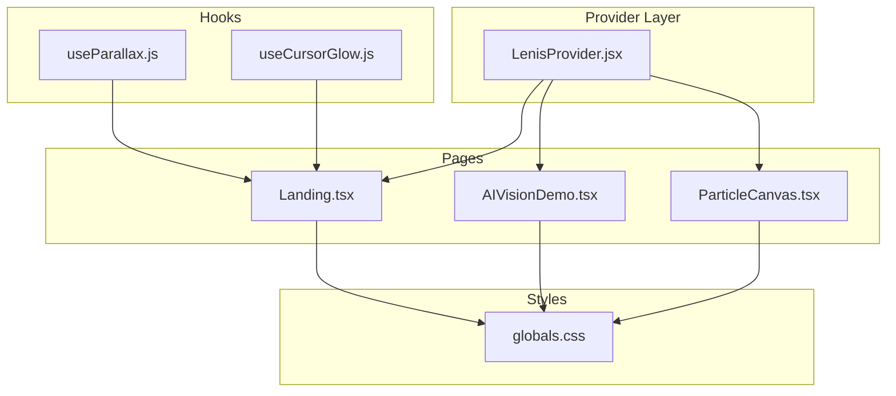
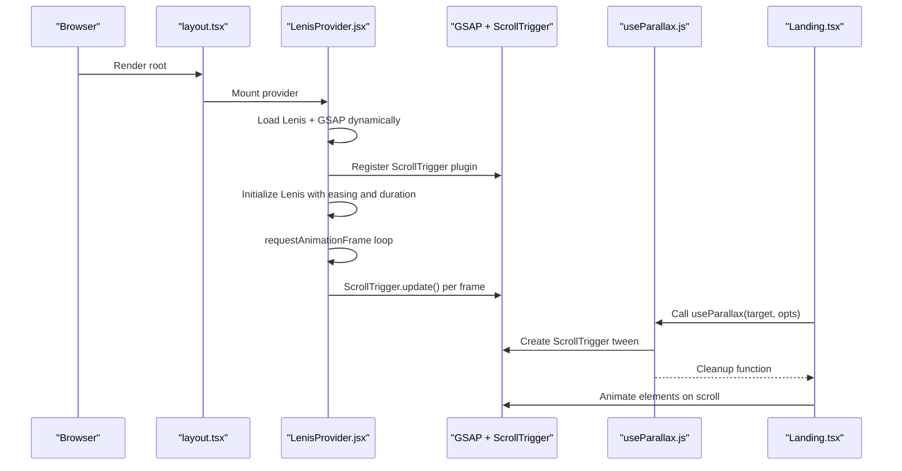
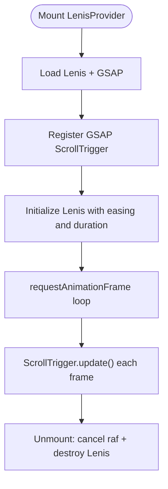
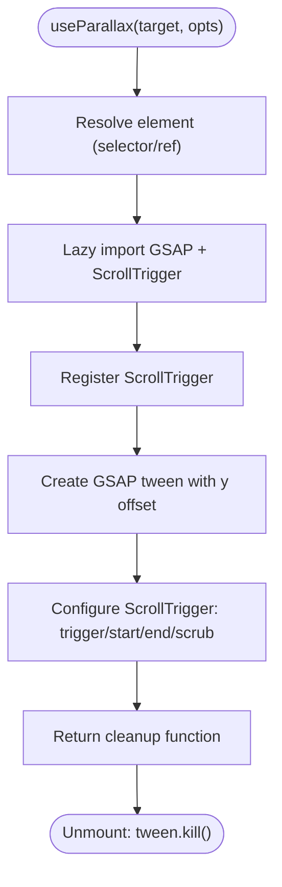
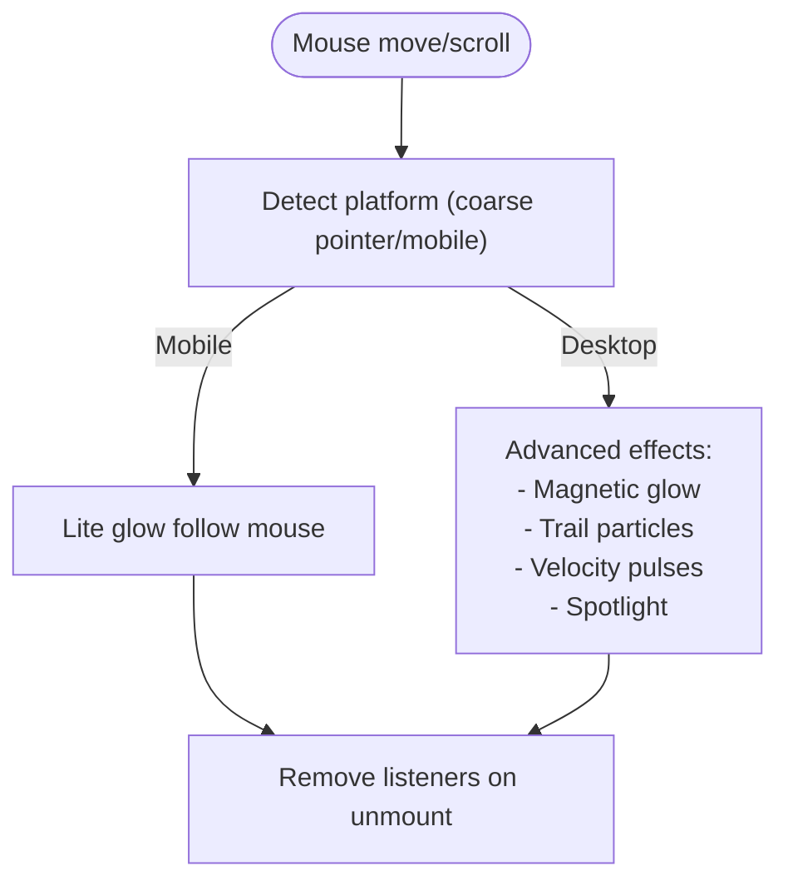
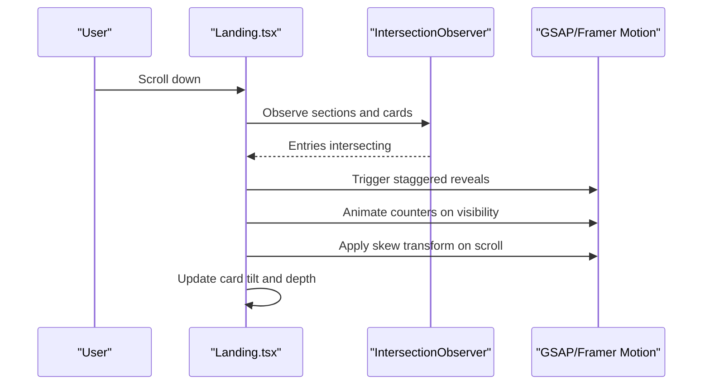
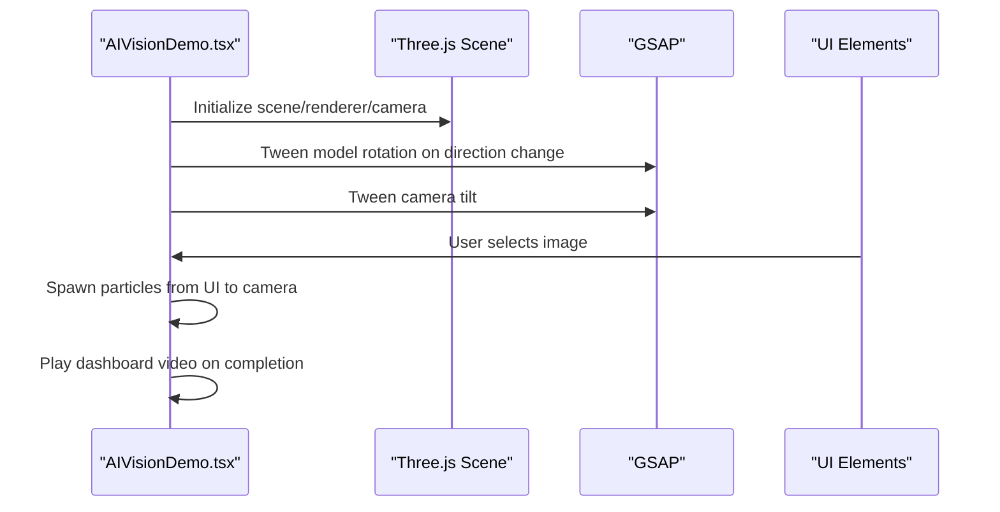
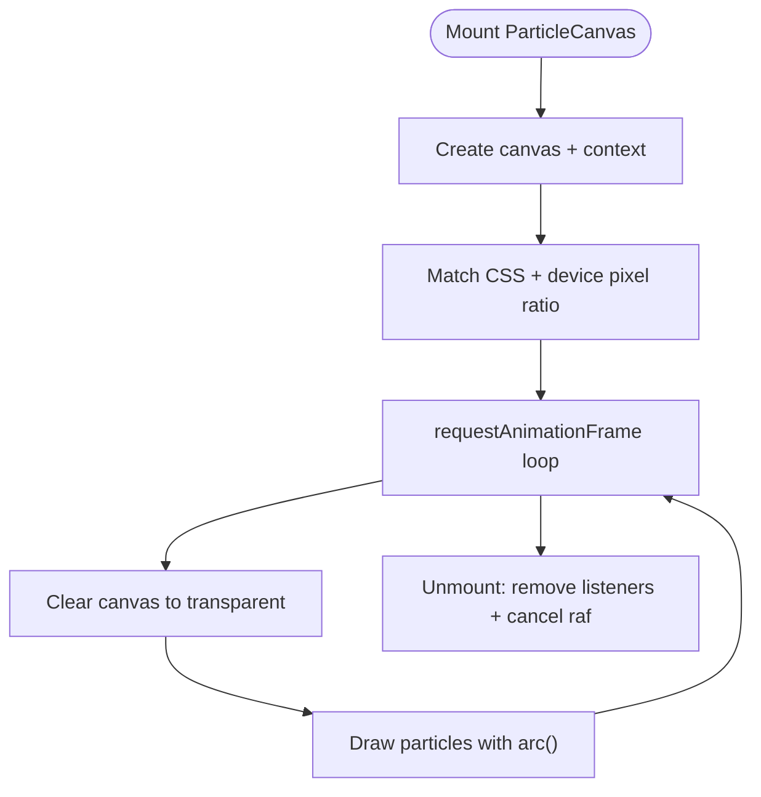
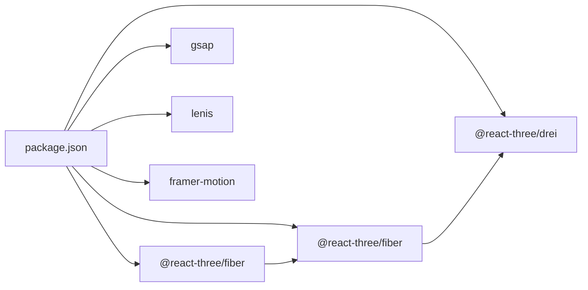

# Animation & Interaction System

<cite>
**Referenced Files in This Document**
- [LenisProvider.jsx](file://components/animations/LenisProvider.jsx)
- [useParallax.js](file://components/animations/useParallax.js)
- [useCursorGlow.js](file://components/animations/useCursorGlow.js)
- [Landing.tsx](file://app/home/Landing.tsx)
- [AIVisionDemo.tsx](file://app/home/AIVisionDemo.tsx)
- [ParticleCanvas.tsx](file://app/components/ParticleCanvas.tsx)
- [layout.tsx](file://app/layout.tsx)
- [globals.css](file://app/globals.css)
- [package.json](file://package.json)
</cite>

## Table of Contents
1. [Introduction](#introduction)
2. [Project Structure](#project-structure)
3. [Core Components](#core-components)
4. [Architecture Overview](#architecture-overview)
5. [Detailed Component Analysis](#detailed-component-analysis)
6. [Dependency Analysis](#dependency-analysis)
7. [Performance Considerations](#performance-considerations)
8. [Troubleshooting Guide](#troubleshooting-guide)
9. [Conclusion](#conclusion)

## Introduction
This document explains the animation and interaction system powering the Zeex AI website. It focuses on:
- Lenis smooth scrolling integrated with GSAP ScrollTrigger for seamless page transitions
- GSAP-based parallax backgrounds activated by scroll position
- Cursor glow effects responding to mouse movement and scroll velocity
- Scroll-triggered animations that reveal content as users navigate the page
- Performance strategies for consistent frame rates across devices
- Practical guidance for extending the system with custom scroll-driven animations
- Accessibility considerations for motion-sensitive users

## Project Structure
The animation pipeline spans client-side providers, reusable hooks, page-specific implementations, and global styles:
- Provider layer initializes Lenis and registers GSAP ScrollTrigger
- Hooks encapsulate reusable animation logic (parallax, cursor glow)
- Page components orchestrate complex interactions (3D scenes, particle systems, scroll-reveal)
- Global CSS defines cursor effects, transitions, and reveal states

**Diagram sources**
- [LenisProvider.jsx:1-52](file://components/animations/LenisProvider.jsx#L1-L52)
- [useParallax.js:1-31](file://components/animations/useParallax.js#L1-L31)
- [useCursorGlow.js:1-26](file://components/animations/useCursorGlow.js#L1-L26)
- [Landing.tsx:1-800](file://app/home/Landing.tsx#L1-L800)
- [AIVisionDemo.tsx:1-562](file://app/home/AIVisionDemo.tsx#L1-L562)
- [ParticleCanvas.tsx:1-71](file://app/components/ParticleCanvas.tsx#L1-L71)
- [globals.css:429-444](file://app/globals.css#L429-L444)

**Section sources**
- [layout.tsx:1-24](file://app/layout.tsx#L1-L24)
- [package.json:11-21](file://package.json#L11-L21)

## Core Components
- LenisProvider: Initializes Lenis smooth scrolling and synchronizes GSAP ScrollTrigger updates per frame
- useParallax: Lightweight helper to apply GSAP parallax to DOM elements using ScrollTrigger
- useCursorGlow: Optional helper to attach a simple cursor glow element
- Landing page enhancements: Advanced cursor effects, scroll-reveal animations, skew transforms, and staggered reveals
- AIVisionDemo: GSAP-driven 3D camera animations and particle effects
- ParticleCanvas: Canvas-based particle system for background ambiance

**Section sources**
- [LenisProvider.jsx:1-52](file://components/animations/LenisProvider.jsx#L1-L52)
- [useParallax.js:1-31](file://components/animations/useParallax.js#L1-L31)
- [useCursorGlow.js:1-26](file://components/animations/useCursorGlow.js#L1-L26)
- [Landing.tsx:60-800](file://app/home/Landing.tsx#L60-L800)
- [AIVisionDemo.tsx:1-562](file://app/home/AIVisionDemo.tsx#L1-L562)
- [ParticleCanvas.tsx:1-71](file://app/components/ParticleCanvas.tsx#L1-L71)

## Architecture Overview
The animation system is built on a provider-hook-page pattern:
- Provider: Establishes smooth scrolling and scroll-triggered timelines
- Hooks: Encapsulate reusable animation primitives
- Pages: Compose hooks and styles to deliver rich interactions
- Styles: Define cursor effects, transitions, and reveal states

**Diagram sources**
- [layout.tsx:6-17](file://app/layout.tsx#L6-L17)
- [LenisProvider.jsx:12-40](file://components/animations/LenisProvider.jsx#L12-L40)
- [useParallax.js:2-11](file://components/animations/useParallax.js#L2-L11)

## Detailed Component Analysis

### Lenis Smooth Scrolling Provider
LenisProvider sets up Lenis with a tuned easing curve and duration, then synchronizes GSAP ScrollTrigger updates each frame. It dynamically imports Lenis and GSAP to avoid SSR overhead and ensures proper cleanup on unmount.

Key behaviors:
- Dynamic imports for Lenis and GSAP
- ScrollTrigger registration
- Per-frame raf synchronization
- Lenis destruction on unmount

**Diagram sources**
- [LenisProvider.jsx:12-40](file://components/animations/LenisProvider.jsx#L12-L40)

**Section sources**
- [LenisProvider.jsx:1-52](file://components/animations/LenisProvider.jsx#L1-L52)
- [layout.tsx:6-17](file://app/layout.tsx#L6-L17)

### GSAP Parallax Hook
The useParallax helper lazily loads GSAP and ScrollTrigger, then applies a vertical parallax effect to a given target. It supports configurable speed and scrubbing behavior, returning a cleanup function to kill the tween.

Implementation highlights:
- Lazy import of GSAP and ScrollTrigger
- Element resolution via selector or ref
- ScrollTrigger configuration with start/end and scrub
- Cleanup via tween.kill()

**Diagram sources**
- [useParallax.js:2-25](file://components/animations/useParallax.js#L2-L25)

**Section sources**
- [useParallax.js:1-31](file://components/animations/useParallax.js#L1-L31)
- [Landing.tsx:470-488](file://app/home/Landing.tsx#L470-L488)

### Cursor Glow Effects
Two cursor glow mechanisms are implemented:
- Lite cursor glow: A simple radial glow attached to mousemove events
- Advanced cursor effects: Magnetic glow, trail particles, scroll velocity pulses, and spotlight on desktop

Behavioral details:
- Lite glow: Creates a single element and follows mouse with passive listeners
- Advanced effects: Desktop-only; magnetic glow, trail particles, velocity pulses, spotlight
- Cleanup removes event listeners and DOM nodes on unmount

**Diagram sources**
- [useCursorGlow.js:3-24](file://components/animations/useCursorGlow.js#L3-L24)
- [Landing.tsx:75-191](file://app/home/Landing.tsx#L75-L191)
- [Landing.tsx:195-232](file://app/home/Landing.tsx#L195-L232)

**Section sources**
- [useCursorGlow.js:1-26](file://components/animations/useCursorGlow.js#L1-L26)
- [Landing.tsx:60-232](file://app/home/Landing.tsx#L60-L232)
- [globals.css:429-444](file://app/globals.css#L429-L444)

### Scroll-Revealed Animations
The landing page orchestrates several scroll-triggered effects:
- Stream-side content reveal using IntersectionObserver
- Animated counters triggered on visibility
- Staggered card reveals with Framer Motion
- Text skew on scroll
- 3D card hover tilt and depth adjustments

**Diagram sources**
- [Landing.tsx:372-409](file://app/home/Landing.tsx#L372-L409)
- [Landing.tsx:492-549](file://app/home/Landing.tsx#L492-L549)
- [Landing.tsx:756-800](file://app/home/Landing.tsx#L756-L800)
- [Landing.tsx:721-754](file://app/home/Landing.tsx#L721-L754)
- [Landing.tsx:554-670](file://app/home/Landing.tsx#L554-L670)

**Section sources**
- [Landing.tsx:372-409](file://app/home/Landing.tsx#L372-L409)
- [Landing.tsx:492-549](file://app/home/Landing.tsx#L492-L549)
- [Landing.tsx:756-800](file://app/home/Landing.tsx#L756-L800)
- [Landing.tsx:721-754](file://app/home/Landing.tsx#L721-L754)
- [Landing.tsx:554-670](file://app/home/Landing.tsx#L554-L670)

### 3D Camera and Particle Effects
AIVisionDemo demonstrates GSAP-driven 3D animations:
- Three.js scene with materials and lighting
- GSAP tweens for model rotation and camera tilt
- Particle bursts spawned from UI elements to 3D camera
- Auto-cycle animation sequence with video playback

**Diagram sources**
- [AIVisionDemo.tsx:37-213](file://app/home/AIVisionDemo.tsx#L37-L213)
- [AIVisionDemo.tsx:180-201](file://app/home/AIVisionDemo.tsx#L180-L201)
- [AIVisionDemo.tsx:216-254](file://app/home/AIVisionDemo.tsx#L216-L254)
- [AIVisionDemo.tsx:336-437](file://app/home/AIVisionDemo.tsx#L336-L437)

**Section sources**
- [AIVisionDemo.tsx:1-562](file://app/home/AIVisionDemo.tsx#L1-L562)

### Background Particle System
ParticleCanvas renders a transparent canvas with animated particles that bounce within the viewport. It resizes with the window and clears the canvas each frame to prevent residual artifacts.

**Diagram sources**
- [ParticleCanvas.tsx:6-67](file://app/components/ParticleCanvas.tsx#L6-L67)

**Section sources**
- [ParticleCanvas.tsx:1-71](file://app/components/ParticleCanvas.tsx#L1-L71)
- [globals.css:43-48](file://app/globals.css#L43-L48)

## Dependency Analysis
External libraries and their roles:
- lenis: Provides smooth, momentum-driven scrolling
- gsap: Core animation library with ScrollTrigger for scroll-driven timelines
- @react-three/fiber and @react-three/drei: 3D rendering and helpers
- framer-motion: Batched staggered reveals and micro-interactions

**Diagram sources**
- [package.json:11-21](file://package.json#L11-L21)

**Section sources**
- [package.json:11-21](file://package.json#L11-L21)

## Performance Considerations
- Lazy loading: Providers and hooks dynamically import heavy libraries to reduce initial bundle size
- requestAnimationFrame loops: Centralized raf scheduling avoids redundant timers
- Passive event listeners: Reduce jank on scroll/mousemove
- Device pixel ratio handling: Three.js renderer caps pixel ratio to balance quality and performance
- Cleanup on unmount: Ensures resources are freed and observers removed
- ScrollTrigger scrubbing: Smoothly interpolates values during scroll for fluid motion
- Canvas compositing: Transparent canvas clears each frame to minimize residual artifacts

[No sources needed since this section provides general guidance]

## Troubleshooting Guide
Common issues and remedies:
- GSAP plugins not found: Ensure ScrollTrigger is registered after GSAP loads; the provider handles registration automatically
- Parallax not triggering: Verify target selector exists and ScrollTrigger is registered; confirm cleanup is not called prematurely
- Cursor glow not appearing: Confirm platform detection excludes mobile; verify passive listeners are attached
- 3D animations stuttering: Reduce pixel ratio or geometry complexity; ensure requestAnimationFrame is not blocked by heavy synchronous work
- Scroll-triggered animations not firing: Check IntersectionObserver thresholds and root margins; ensure elements are rendered before observing

**Section sources**
- [LenisProvider.jsx:18-26](file://components/animations/LenisProvider.jsx#L18-L26)
- [useParallax.js:6-11](file://components/animations/useParallax.js#L6-L11)
- [Landing.tsx:75-191](file://app/home/Landing.tsx#L75-L191)
- [AIVisionDemo.tsx:43-46](file://app/home/AIVisionDemo.tsx#L43-L46)

## Conclusion
The Zeex AI website’s animation system combines Lenis smooth scrolling with GSAP ScrollTrigger to create immersive, responsive experiences. Reusable hooks encapsulate parallax and cursor effects, while page-level implementations leverage 3D rendering and particle systems for depth. Performance is prioritized through lazy loading, passive listeners, and careful resource cleanup. The system is extensible: new scroll-triggered animations can be added by composing GSAP timelines with ScrollTrigger and integrating them into existing providers and hooks.