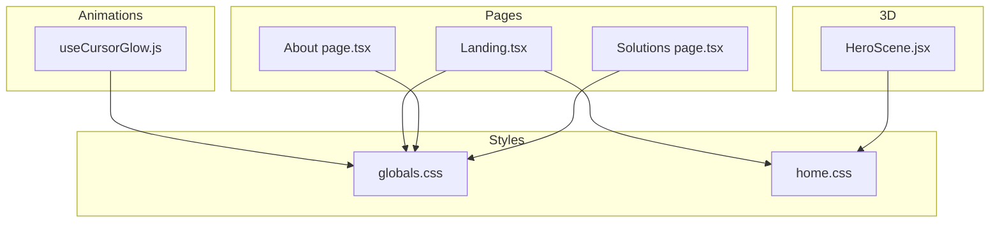
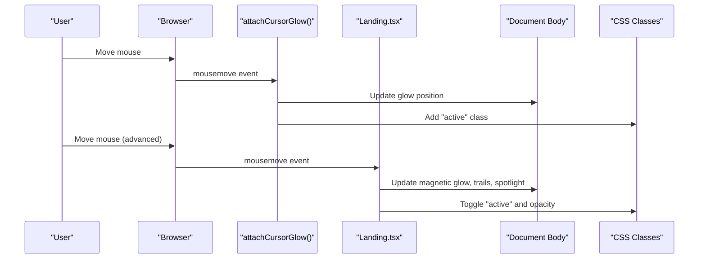
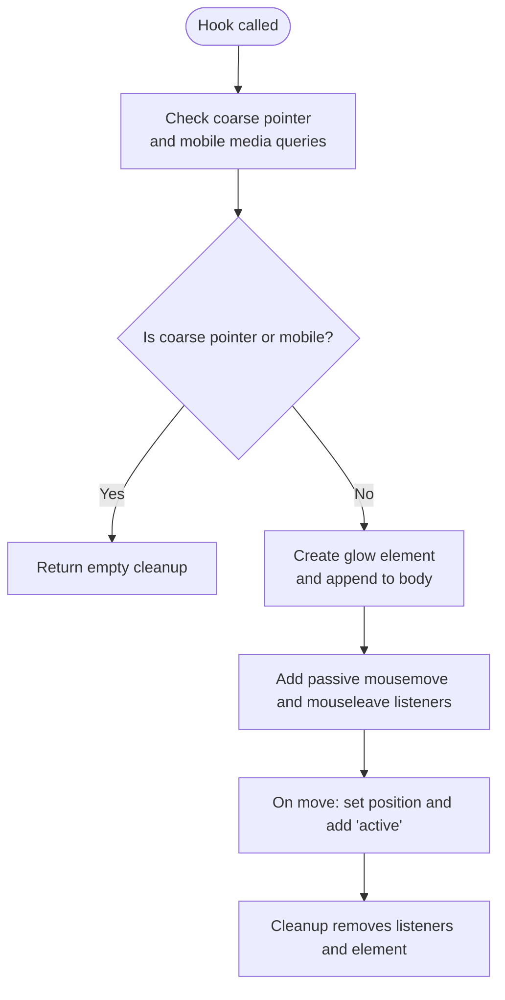
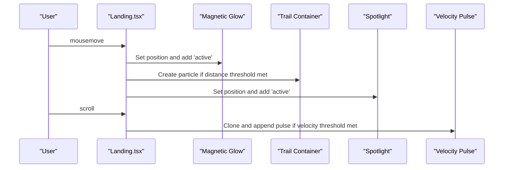
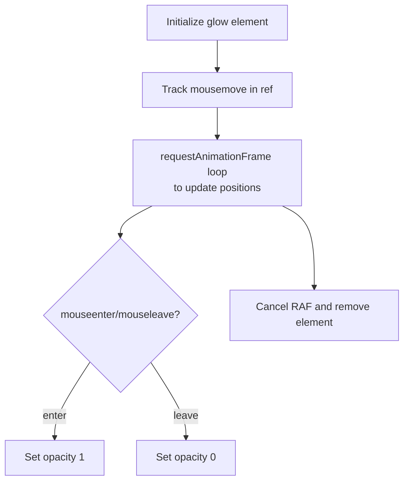
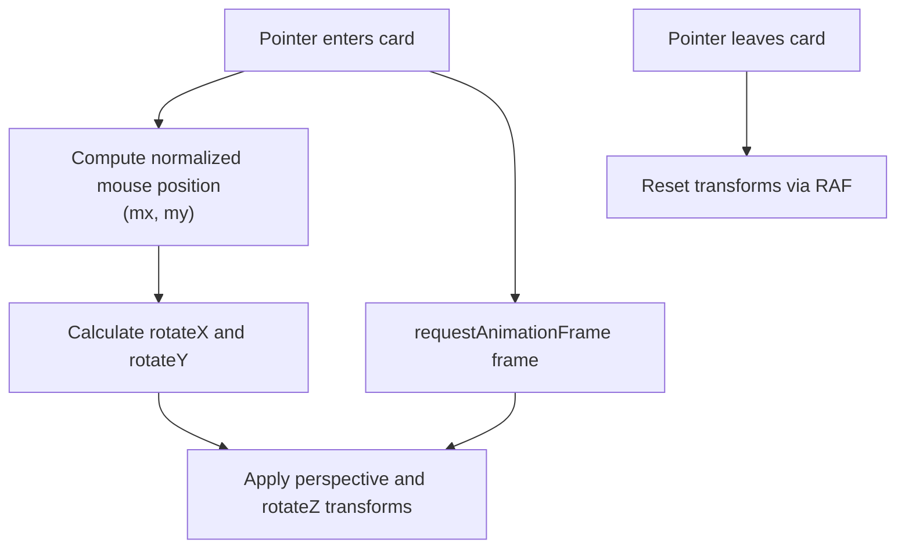
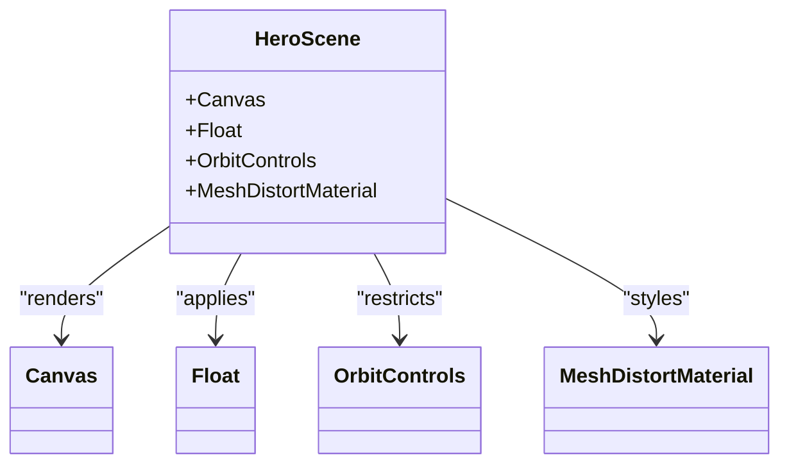
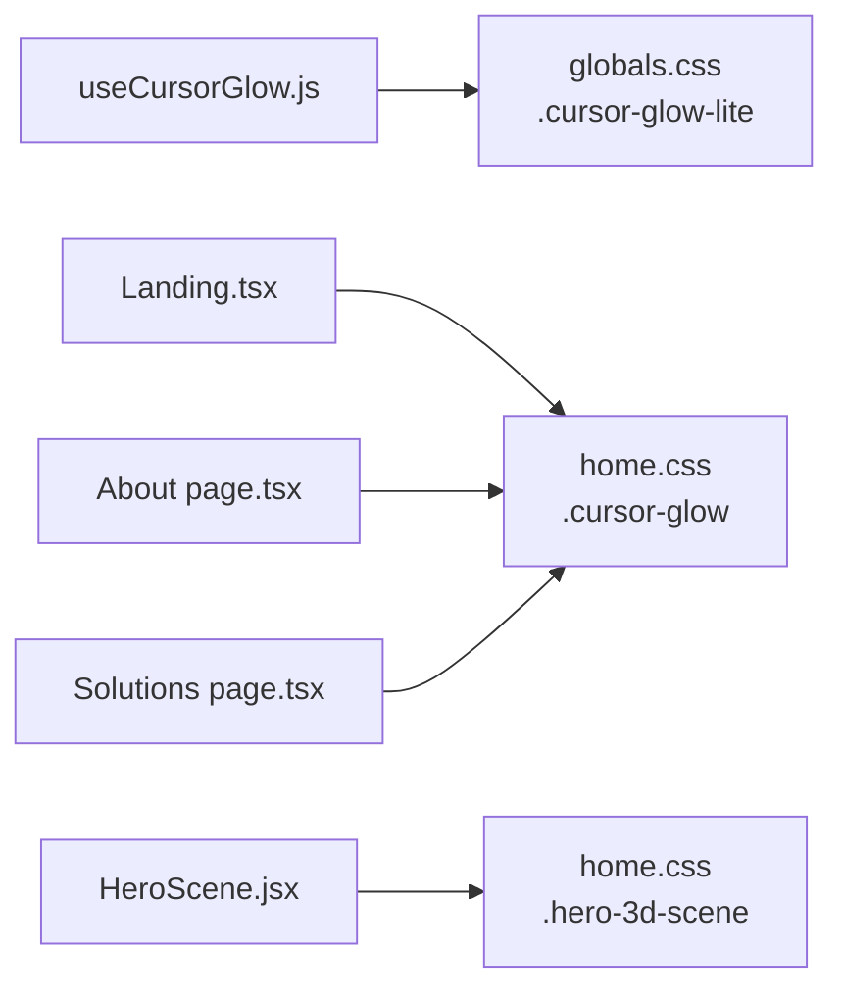

# Cursor Effects and Interactions

<cite>
**Referenced Files in This Document**
- [useCursorGlow.js](file://components/animations/useCursorGlow.js)
- [Landing.tsx](file://app/home/Landing.tsx)
- [page.tsx (About)](file://app/about/page.tsx)
- [page.tsx (Solutions)](file://app/solutions/page.tsx)
- [HeroScene.jsx](file://components/3d/HeroScene.jsx)
- [globals.css](file://app/globals.css)
- [home.css](file://app/home/home.css)
</cite>

## Table of Contents
1. [Introduction](#introduction)
2. [Project Structure](#project-structure)
3. [Core Components](#core-components)
4. [Architecture Overview](#architecture-overview)
5. [Detailed Component Analysis](#detailed-component-analysis)
6. [Dependency Analysis](#dependency-analysis)
7. [Performance Considerations](#performance-considerations)
8. [Troubleshooting Guide](#troubleshooting-guide)
9. [Conclusion](#conclusion)
10. [Appendices](#appendices)

## Introduction
This document explains the cursor interaction system that delivers dynamic visual feedback to enhance user engagement. It covers:
- The cursor glow effect implementation and its behavior across devices
- How the system responds to user interactions with 3D elements and UI components
- The custom cursor hook that manages state changes based on mouse movement, hover, and leave events
- The visual transformation system for interactive elements such as cards and buttons
- Practical examples for implementing custom cursor states (navigation, selection, special actions)
- Performance considerations and accessibility guidelines for smooth, inclusive cursor interactions

## Project Structure
The cursor effects are implemented across a few focused areas:
- A lightweight reusable hook for attaching a simple glow element
- Page-specific implementations that add advanced glow, trails, spotlight, and scroll velocity effects
- CSS layers defining cursor glow styles and transitions
- 3D scene components that complement cursor interactions with immersive visuals

**Diagram sources**
- [useCursorGlow.js:1-25](file://components/animations/useCursorGlow.js#L1-L25)
- [Landing.tsx:68-232](file://app/home/Landing.tsx#L68-L232)
- [page.tsx (About):96-155](file://app/about/page.tsx#L96-L155)
- [page.tsx (Solutions):35-73](file://app/solutions/page.tsx#L35-L73)
- [HeroScene.jsx:1-37](file://components/3d/HeroScene.jsx#L1-L37)
- [globals.css:429-443](file://app/globals.css#L429-L443)
- [home.css:84-102](file://app/home/home.css#L84-L102)

**Section sources**
- [useCursorGlow.js:1-25](file://components/animations/useCursorGlow.js#L1-L25)
- [Landing.tsx:68-232](file://app/home/Landing.tsx#L68-L232)
- [page.tsx (About):96-155](file://app/about/page.tsx#L96-L155)
- [page.tsx (Solutions):35-73](file://app/solutions/page.tsx#L35-L73)
- [HeroScene.jsx:1-37](file://components/3d/HeroScene.jsx#L1-L37)
- [globals.css:429-443](file://app/globals.css#L429-L443)
- [home.css:84-102](file://app/home/home.css#L84-L102)

## Core Components
- Lightweight cursor glow hook: Creates a single DOM element and tracks mouse movement with minimal overhead.
- Advanced cursor effects in Landing: Adds magnetic glow, trail particles, spotlight, and scroll velocity pulses.
- Page-level glow with RAF rendering: Maintains smooth cursor glow via requestAnimationFrame.
- CSS glow styles: Provides base styles and active-state transitions for cursor glow elements.

Key capabilities:
- Device-aware disabling on coarse-pointer/touch devices
- Smooth updates using requestAnimationFrame
- Visual enhancements layered on top of basic glow (magnetic, trails, spotlight, velocity)

**Section sources**
- [useCursorGlow.js:1-25](file://components/animations/useCursorGlow.js#L1-L25)
- [Landing.tsx:68-232](file://app/home/Landing.tsx#L68-L232)
- [page.tsx (About):96-155](file://app/about/page.tsx#L96-L155)
- [page.tsx (Solutions):35-73](file://app/solutions/page.tsx#L35-L73)
- [globals.css:429-443](file://app/globals.css#L429-L443)
- [home.css:84-102](file://app/home/home.css#L84-L102)

## Architecture Overview
The cursor system composes three layers:
- Hook layer: Provides a minimal glow element and event listeners
- Page layer: Extends with advanced effects and per-page rendering
- Styles layer: Defines visual states and transitions

**Diagram sources**
- [useCursorGlow.js:1-25](file://components/animations/useCursorGlow.js#L1-L25)
- [Landing.tsx:68-191](file://app/home/Landing.tsx#L68-L191)
- [globals.css:429-443](file://app/globals.css#L429-L443)
- [home.css:84-102](file://app/home/home.css#L84-L102)

## Detailed Component Analysis

### Lightweight Cursor Glow Hook
- Purpose: Attach a simple glow element and track mouse movement with passive listeners
- Behavior:
  - Detects coarse-pointer/touch devices and disables automatically
  - Creates a single glow element appended to the body
  - Updates position on mousemove and toggles active state
  - Returns a cleanup function to remove listeners and element

**Diagram sources**
- [useCursorGlow.js:1-25](file://components/animations/useCursorGlow.js#L1-L25)

**Section sources**
- [useCursorGlow.js:1-25](file://components/animations/useCursorGlow.js#L1-L25)

### Advanced Cursor Effects in Landing
- Adds magnetic glow, trail particles, spotlight, and scroll velocity pulses
- Uses requestAnimationFrame to batch updates and reduce jank
- Disables on mobile and coarse-pointer devices
- Cleans up all listeners and DOM nodes on unmount

**Diagram sources**
- [Landing.tsx:68-191](file://app/home/Landing.tsx#L68-L191)

**Section sources**
- [Landing.tsx:68-191](file://app/home/Landing.tsx#L68-L191)

### Page-Level Glow with RAF Rendering
- Maintains a persistent glow element
- Tracks mouse position in a ref and renders via requestAnimationFrame
- Toggles opacity on enter/leave events
- Uses passive listeners and cleans up on unmount

**Diagram sources**
- [page.tsx (About):96-155](file://app/about/page.tsx#L96-L155)
- [page.tsx (Solutions):35-73](file://app/solutions/page.tsx#L35-L73)

**Section sources**
- [page.tsx (About):96-155](file://app/about/page.tsx#L96-L155)
- [page.tsx (Solutions):35-73](file://app/solutions/page.tsx#L35-L73)

### Visual Transformation System for Interactive Elements
- Cards and buttons receive hover-driven transforms and perspective rotations
- Uses requestAnimationFrame to throttle updates and cancel previous frames
- Applies CSS custom properties for smooth interpolation of tilt and depth
- Resets transforms on pointer leave

**Diagram sources**
- [Landing.tsx:593-632](file://app/home/Landing.tsx#L593-L632)

**Section sources**
- [Landing.tsx:593-632](file://app/home/Landing.tsx#L593-L632)

### 3D Scene Complement
- A floating 3D sphere with subtle distortion and rotation
- Works alongside cursor effects to immerse users in a dynamic environment
- Canvas configured with conservative DPR and orbit controls disabled for stability

**Diagram sources**
- [HeroScene.jsx:1-37](file://components/3d/HeroScene.jsx#L1-L37)

**Section sources**
- [HeroScene.jsx:1-37](file://components/3d/HeroScene.jsx#L1-L37)

## Dependency Analysis
- Hook depends on browser APIs (matchMedia, addEventListener) and DOM manipulation
- Landing extends the hook with additional DOM nodes and event handlers
- Page-level implementations reuse the same CSS glow classes
- 3D scene is independent but visually complements cursor effects

**Diagram sources**
- [useCursorGlow.js:1-25](file://components/animations/useCursorGlow.js#L1-L25)
- [Landing.tsx:68-232](file://app/home/Landing.tsx#L68-L232)
- [page.tsx (About):96-155](file://app/about/page.tsx#L96-L155)
- [page.tsx (Solutions):35-73](file://app/solutions/page.tsx#L35-L73)
- [HeroScene.jsx:1-37](file://components/3d/HeroScene.jsx#L1-L37)
- [globals.css:429-443](file://app/globals.css#L429-L443)
- [home.css:84-102](file://app/home/home.css#L84-L102)

**Section sources**
- [useCursorGlow.js:1-25](file://components/animations/useCursorGlow.js#L1-L25)
- [Landing.tsx:68-232](file://app/home/Landing.tsx#L68-L232)
- [page.tsx (About):96-155](file://app/about/page.tsx#L96-L155)
- [page.tsx (Solutions):35-73](file://app/solutions/page.tsx#L35-L73)
- [HeroScene.jsx:1-37](file://components/3d/HeroScene.jsx#L1-L37)
- [globals.css:429-443](file://app/globals.css#L429-L443)
- [home.css:84-102](file://app/home/home.css#L84-L102)

## Performance Considerations
- Passive event listeners: Used for mousemove and scroll to avoid layout thrashing
- requestAnimationFrame batching: Reduces repaint cost by consolidating DOM updates
- Device checks: Disables advanced effects on coarse-pointer/touch devices to preserve battery life and responsiveness
- CSS filters and transforms: Prefer transform and filter for GPU acceleration; avoid layout-affecting properties
- Cleanup: Always remove listeners and DOM nodes on unmount to prevent memory leaks

[No sources needed since this section provides general guidance]

## Troubleshooting Guide
Common issues and resolutions:
- Glow not visible on mobile: Confirm device detection logic and that advanced effects are disabled
- Jittery movement: Ensure passive listeners and requestAnimationFrame usage
- Stuck active state: Verify mouseleave handler removal during cleanup
- Excessive DOM nodes: Limit trail particle lifetime and ensure removal after timeout

**Section sources**
- [useCursorGlow.js:1-25](file://components/animations/useCursorGlow.js#L1-L25)
- [Landing.tsx:172-191](file://app/home/Landing.tsx#L172-L191)
- [page.tsx (About):146-155](file://app/about/page.tsx#L146-L155)
- [page.tsx (Solutions):68-73](file://app/solutions/page.tsx#L68-L73)

## Conclusion
The cursor interaction system blends a lightweight hook with page-specific enhancements to deliver smooth, engaging visual feedback. By leveraging passive listeners, requestAnimationFrame, and device-aware logic, it maintains performance while enriching the user experience. The visual transformation system for interactive elements further elevates immersion, and the 3D scene complements cursor dynamics for a cohesive, modern interface.

[No sources needed since this section summarizes without analyzing specific files]

## Appendices

### Practical Examples: Custom Cursor States
- Navigation: Use magnetic glow and subtle trail particles to signal intent and direction
- Selection: Increase glow intensity and apply spotlight to draw attention to hovered items
- Special actions: Trigger velocity pulses on scroll or rapid pointer movement to highlight dynamic interactions

[No sources needed since this section provides general guidance]

### Accessibility Guidelines
- Respect reduced motion preferences by offering alternatives to animated cursor effects
- Ensure sufficient contrast between cursor glow and backgrounds
- Avoid causing disorientation through excessive motion; provide user controls to reduce motion

[No sources needed since this section provides general guidance]