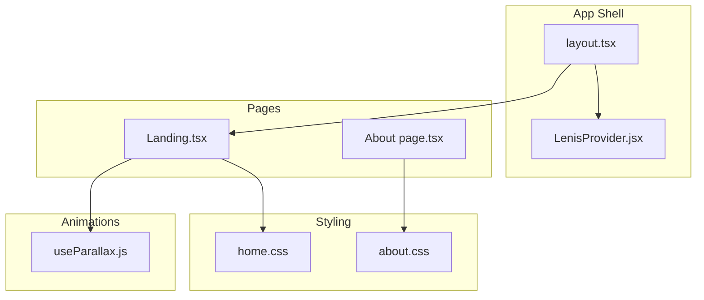
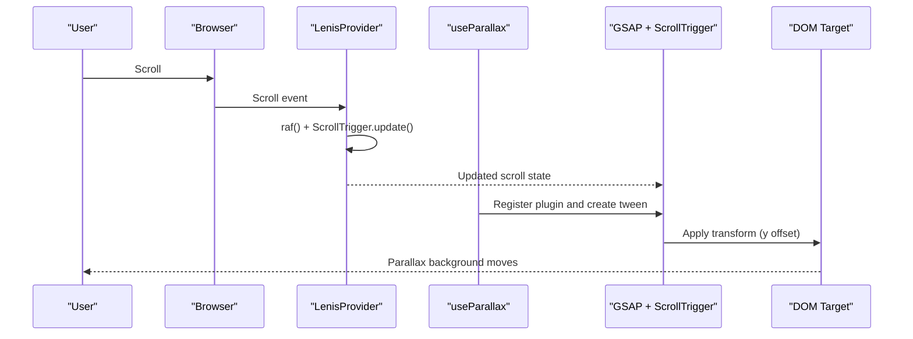
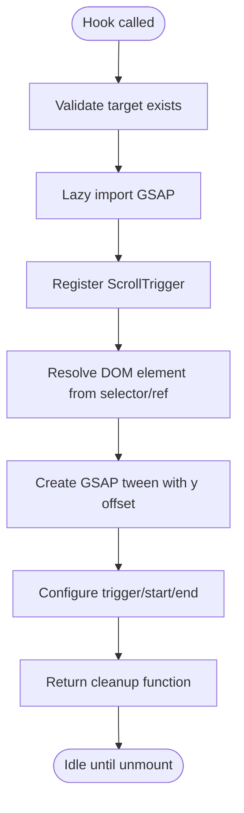
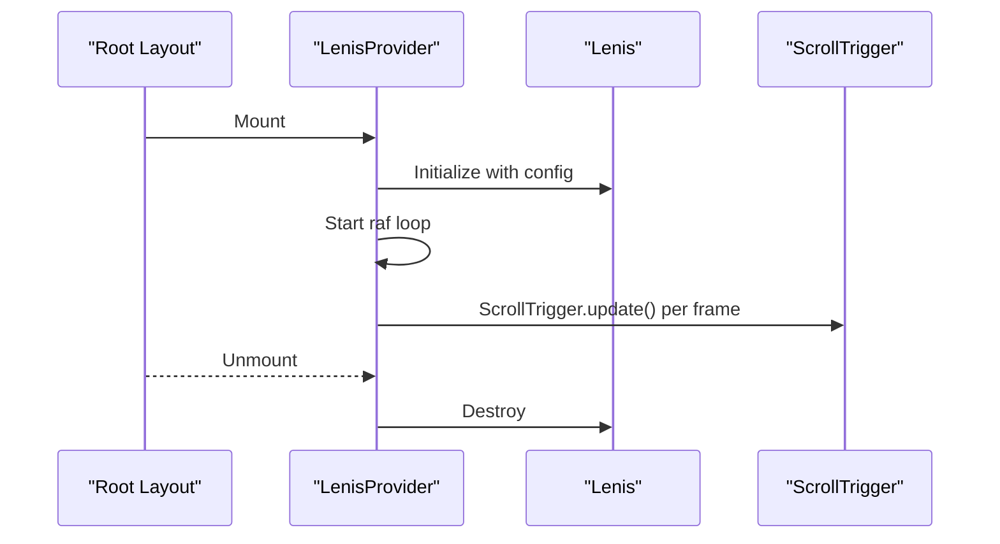
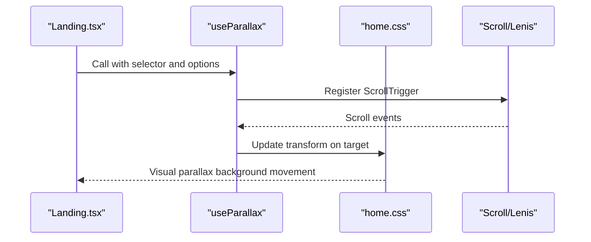
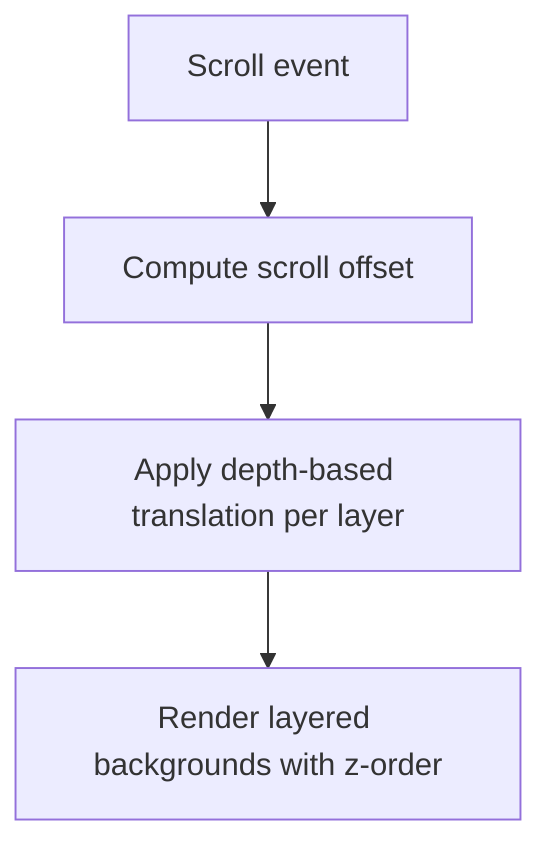
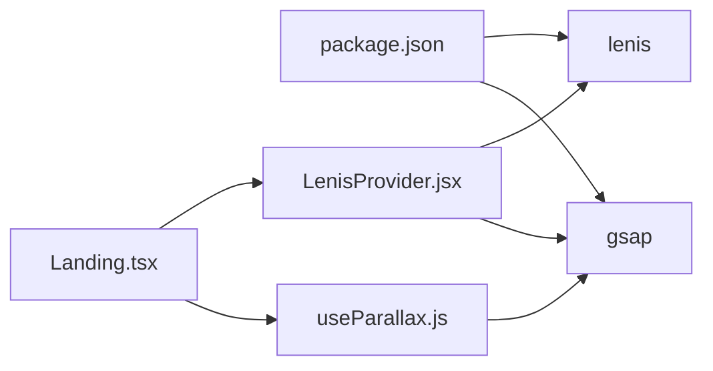

# Parallax Background Effects

<cite>
**Referenced Files in This Document**
- [useParallax.js](file://components/animations/useParallax.js)
- [LenisProvider.jsx](file://components/animations/LenisProvider.jsx)
- [Landing.tsx](file://app/home/Landing.tsx)
- [home.css](file://app/home/home.css)
- [layout.tsx](file://app/layout.tsx)
- [page.tsx (About)](file://app/about/page.tsx)
- [about.css (About)](file://app/about/about.css)
- [package.json](file://package.json)
</cite>

## Table of Contents
1. [Introduction](#introduction)
2. [Project Structure](#project-structure)
3. [Core Components](#core-components)
4. [Architecture Overview](#architecture-overview)
5. [Detailed Component Analysis](#detailed-component-analysis)
6. [Dependency Analysis](#dependency-analysis)
7. [Performance Considerations](#performance-considerations)
8. [Troubleshooting Guide](#troubleshooting-guide)
9. [Conclusion](#conclusion)
10. [Appendices](#appendices)

## Introduction
This document explains the parallax background effect system that creates depth and visual interest through layered background movement. It covers the lightweight GSAP-based parallax hook, how it computes movement from scroll position and element hierarchy, configuration options for intensity, direction, and timing, and how these effects integrate with the broader animation pipeline. Practical examples demonstrate subtle and dramatic depth styles, and guidance is provided for performance optimization and accessibility.

## Project Structure
The parallax system spans a small set of focused modules:
- A reusable hook that applies GSAP ScrollTrigger-based parallax to any DOM target
- A provider that integrates Lenis smooth scrolling with ScrollTrigger updates
- Page-level usage in the landing page to drive a hero background
- CSS styling that establishes the layered hero background and performance hints
- Additional multi-layer parallax patterns in other pages for comparison

**Diagram sources**
- [layout.tsx:13-22](file://app/layout.tsx#L13-L22)
- [LenisProvider.jsx:5-51](file://components/animations/LenisProvider.jsx#L5-L51)
- [useParallax.js:1-31](file://components/animations/useParallax.js#L1-L31)
- [Landing.tsx:466-488](file://app/home/Landing.tsx#L466-L488)
- [home.css:24-50](file://app/home/home.css#L24-L50)
- [page.tsx (About):157-177](file://app/about/page.tsx#L157-L177)
- [about.css:31-56](file://app/about/about.css#L31-L56)

**Section sources**
- [layout.tsx:13-22](file://app/layout.tsx#L13-L22)
- [LenisProvider.jsx:5-51](file://components/animations/LenisProvider.jsx#L5-L51)
- [useParallax.js:1-31](file://components/animations/useParallax.js#L1-L31)
- [Landing.tsx:466-488](file://app/home/Landing.tsx#L466-L488)
- [home.css:24-50](file://app/home/home.css#L24-L50)
- [page.tsx (About):157-177](file://app/about/page.tsx#L157-L177)
- [about.css:31-56](file://app/about/about.css#L31-L56)

## Core Components
- useParallax hook
  - Lazily imports GSAP and registers ScrollTrigger
  - Accepts a target (selector or ref) and options
  - Creates a vertical y tween driven by scroll position
  - Returns a cleanup function to kill the tween
- LenisProvider
  - Initializes Lenis smooth scrolling and integrates with ScrollTrigger
  - Ensures ScrollTrigger updates during Lenis frames
- Landing.tsx integration
  - Applies parallax to the hero background wrapper
  - Demonstrates speed and scrubbing configuration
- CSS styling
  - Establishes layered backgrounds and performance hints (will-change, transform)
  - Provides additive overlays and blend modes for depth

Key configuration options exposed by the hook:
- speed: Controls parallax intensity as a fraction of viewport height
- scrub: Enables smooth scrubbing vs instant snapping
- trigger/start/end: Define scroll region for activation

**Section sources**
- [useParallax.js:1-31](file://components/animations/useParallax.js#L1-L31)
- [LenisProvider.jsx:12-40](file://components/animations/LenisProvider.jsx#L12-L40)
- [Landing.tsx:470-488](file://app/home/Landing.tsx#L470-L488)
- [home.css:24-50](file://app/home/home.css#L24-L50)

## Architecture Overview
The parallax pipeline combines scroll input, animation timing, and rendering:
- Scroll events are normalized by Lenis for smoothness
- ScrollTrigger drives tweens based on trigger regions
- GSAP updates transforms on each frame
- CSS provides layered backgrounds and performance hints

**Diagram sources**
- [LenisProvider.jsx:34-39](file://components/animations/LenisProvider.jsx#L34-L39)
- [useParallax.js:4-11](file://components/animations/useParallax.js#L4-L11)
- [useParallax.js:16-25](file://components/animations/useParallax.js#L16-L25)

**Section sources**
- [LenisProvider.jsx:12-40](file://components/animations/LenisProvider.jsx#L12-L40)
- [useParallax.js:1-31](file://components/animations/useParallax.js#L1-L31)

## Detailed Component Analysis

### useParallax Hook
The hook encapsulates a lightweight, lazy-initialized GSAP ScrollTrigger-based parallax:
- Lazy import ensures SSR compatibility
- Registers ScrollTrigger and handles missing plugin gracefully
- Computes movement as a function of viewport height and configured speed
- Uses a scrubbed tween to match Lenis’ smooth scrolling

**Diagram sources**
- [useParallax.js:2-30](file://components/animations/useParallax.js#L2-L30)

**Section sources**
- [useParallax.js:1-31](file://components/animations/useParallax.js#L1-L31)

### LenisProvider Integration
LenisProvider initializes Lenis and synchronizes ScrollTrigger updates:
- Starts Lenis with easing and duration parameters
- Hooks into requestAnimationFrame to advance Lenis and update ScrollTrigger
- Cleans up on unmount

**Diagram sources**
- [LenisProvider.jsx:12-48](file://components/animations/LenisProvider.jsx#L12-L48)

**Section sources**
- [LenisProvider.jsx:12-48](file://components/animations/LenisProvider.jsx#L12-L48)

### Landing Hero Parallax
The landing page applies parallax to the hero background wrapper:
- Uses the hook with a modest speed and scrub enabled
- The CSS defines layered backgrounds and blend modes for depth
- The effect complements other scroll-driven animations on the page

**Diagram sources**
- [Landing.tsx:470-488](file://app/home/Landing.tsx#L470-L488)
- [useParallax.js:16-25](file://components/animations/useParallax.js#L16-L25)
- [home.css:24-50](file://app/home/home.css#L24-L50)

**Section sources**
- [Landing.tsx:470-488](file://app/home/Landing.tsx#L470-L488)
- [home.css:24-50](file://app/home/home.css#L24-L50)

### Multi-Layer Parallax Patterns (Comparison)
Other pages demonstrate alternative approaches:
- About page: Uses data-depth attributes to compute layered translations on scroll
- About page: Uses CSS custom properties to drive transform on the hero background
These patterns illustrate complementary techniques for creating depth with minimal JS

**Diagram sources**
- [page.tsx (About):14-26](file://app/about/page.tsx#L14-L26)
- [about.css:42-44](file://app/about/about.css#L42-L44)

**Section sources**
- [page.tsx (About):14-26](file://app/about/page.tsx#L14-L26)
- [about.css:31-56](file://app/about/about.css#L31-L56)

## Dependency Analysis
External libraries involved:
- gsap: Animation engine and ScrollTrigger plugin
- lenis: Smooth scrolling provider
- next: Dynamic imports for SSR-safe initialization

**Diagram sources**
- [package.json:11-21](file://package.json#L11-L21)
- [Landing.tsx:466-488](file://app/home/Landing.tsx#L466-L488)
- [useParallax.js:4-11](file://components/animations/useParallax.js#L4-L11)
- [LenisProvider.jsx:13-22](file://components/animations/LenisProvider.jsx#L13-L22)

**Section sources**
- [package.json:11-21](file://package.json#L11-L21)
- [Landing.tsx:466-488](file://app/home/Landing.tsx#L466-L488)
- [useParallax.js:4-11](file://components/animations/useParallax.js#L4-L11)
- [LenisProvider.jsx:13-22](file://components/animations/LenisProvider.jsx#L13-L22)

## Performance Considerations
- Use transform and will-change to offload compositing to the GPU
- Keep parallax intensity moderate to avoid jank on lower-end devices
- Prefer scrubbed tweens for smoothness when paired with Lenis
- Limit the number of animated layers and avoid expensive repaints
- Use lazy initialization to avoid SSR costs and reduce bundle impact
- Consider disabling heavy effects on mobile or low-power devices via media queries or feature detection

[No sources needed since this section provides general guidance]

## Troubleshooting Guide
Common issues and resolutions:
- Parallax does not activate
  - Ensure the target element exists and is visible
  - Verify the hook is called after mount and cleanup is returned properly
- No scroll effect despite scrolling
  - Confirm Lenis is initialized and ScrollTrigger.update runs each frame
- Jitter or stutter
  - Reduce speed or disable scrub temporarily to isolate the cause
  - Check for layout thrashing elsewhere on the page
- SSR hydration mismatch
  - Confirm dynamic imports and client-only providers are used appropriately

**Section sources**
- [useParallax.js:13-14](file://components/animations/useParallax.js#L13-L14)
- [LenisProvider.jsx:34-39](file://components/animations/LenisProvider.jsx#L34-L39)
- [Landing.tsx:470-488](file://app/home/Landing.tsx#L470-L488)

## Conclusion
The parallax system leverages a lightweight hook and GSAP ScrollTrigger to deliver smooth, layered depth effects. Combined with Lenis for silky scroll behavior and strategic CSS for layered visuals, it integrates cleanly into the animation pipeline. By tuning speed and scrubbing, and following performance and accessibility best practices, teams can craft compelling yet inclusive experiences.

[No sources needed since this section summarizes without analyzing specific files]

## Appendices

### Configuration Options Reference
- speed: Fraction of viewport height to move vertically per pixel of scroll
- scrub: Boolean to enable smooth scrubbing or instant snapping
- trigger/start/end: ScrollTrigger region definition for activation

**Section sources**
- [useParallax.js:16-25](file://components/animations/useParallax.js#L16-L25)

### Practical Examples
- Subtle background movement
  - Use a small speed value and enable scrubbing
  - Combine with CSS blend modes for soft depth
- Dramatic depth effect
  - Increase speed moderately; pair with layered backgrounds
  - Ensure content remains readable and not obscured
- Synchronized multi-layer parallax
  - Use data-depth attributes or separate hooks for multiple targets
  - Coordinate speeds so layers feel cohesive

**Section sources**
- [Landing.tsx:470-488](file://app/home/Landing.tsx#L470-L488)
- [home.css:24-50](file://app/home/home.css#L24-L50)
- [page.tsx (About):157-177](file://app/about/page.tsx#L157-L177)
- [about.css:31-56](file://app/about/about.css#L31-L56)