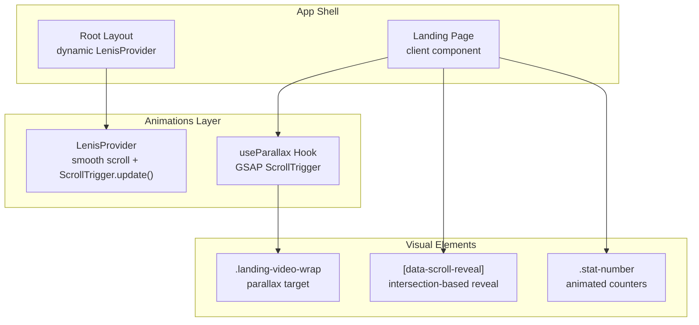
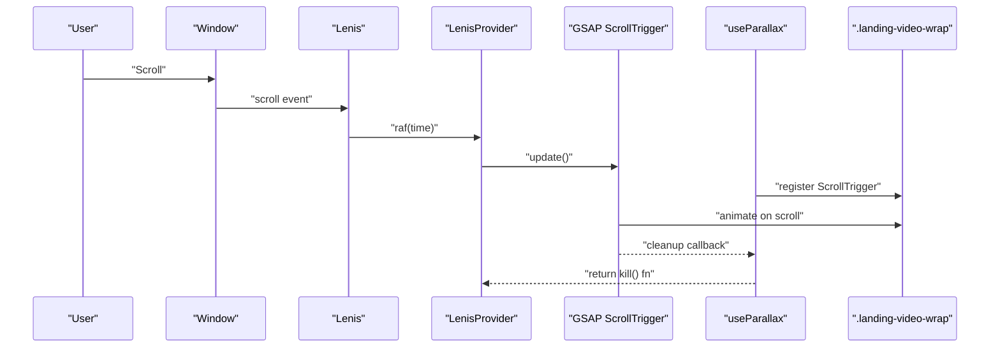
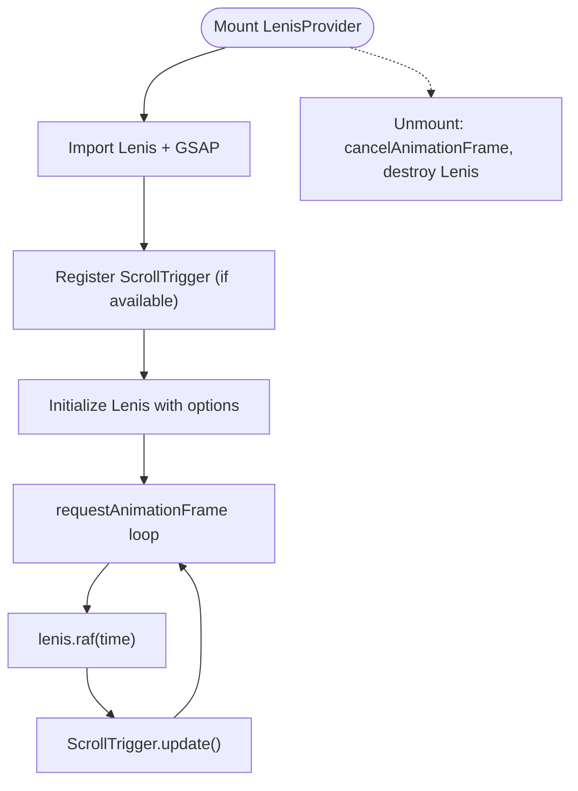
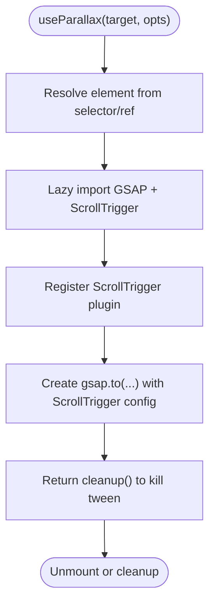
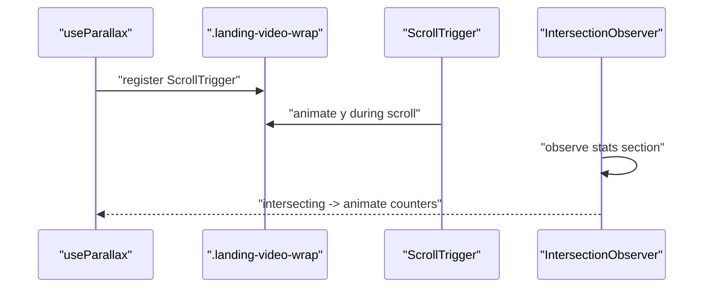
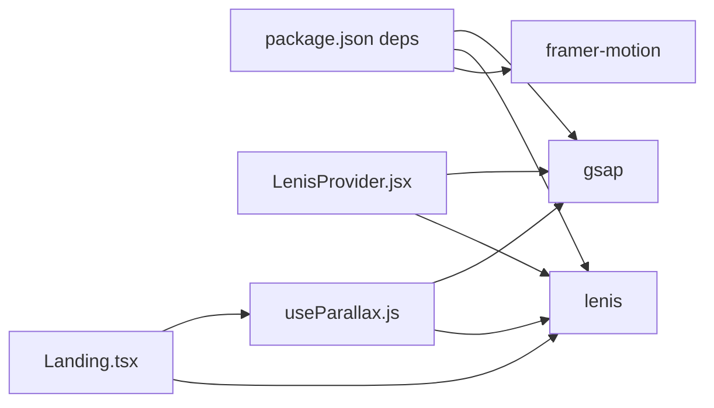

# Scroll-triggered Animations with GSAP

<cite>
**Referenced Files in This Document**
- [LenisProvider.jsx](file://components/animations/LenisProvider.jsx)
- [useParallax.js](file://components/animations/useParallax.js)
- [Landing.tsx](file://app/home/Landing.tsx)
- [layout.tsx](file://app/layout.tsx)
- [home.css](file://app/home/home.css)
- [AIVisionDemo.tsx](file://app/home/AIVisionDemo.tsx)
- [package.json](file://package.json)
</cite>

## Table of Contents
1. [Introduction](#introduction)
2. [Project Structure](#project-structure)
3. [Core Components](#core-components)
4. [Architecture Overview](#architecture-overview)
5. [Detailed Component Analysis](#detailed-component-analysis)
6. [Dependency Analysis](#dependency-analysis)
7. [Performance Considerations](#performance-considerations)
8. [Troubleshooting Guide](#troubleshooting-guide)
9. [Conclusion](#conclusion)
10. [Appendices](#appendices)

## Introduction
This document explains the scroll-triggered animation system built with GSAP and ScrollTrigger, integrated with Lenis smooth scrolling. It covers how animations are orchestrated using GSAP timelines and activated when users scroll to specific sections. It documents ScrollTrigger configuration options such as start/end positions, scrubbing behaviors, and pinning effects. It also details the custom hook that manages animation state and cleanup, and provides practical examples for fade-ins, staggered animations, and complex multi-element sequences. Finally, it outlines performance optimization techniques and addresses common challenges around timing, cross-browser compatibility, and accessibility.

## Project Structure
The scroll-driven experience is implemented across a few key areas:
- A provider initializes Lenis and integrates it with GSAP ScrollTrigger updates.
- A lightweight custom hook wires GSAP ScrollTrigger to DOM elements.
- The landing page composes multiple animation enhancements, including parallax, counters, and reveal effects.
- Styles leverage GPU-friendly properties and layered composition for smooth performance.

**Diagram sources**
- [layout.tsx:13-21](file://app/layout.tsx#L13-L21)
- [LenisProvider.jsx:12-40](file://components/animations/LenisProvider.jsx#L12-L40)
- [useParallax.js:16-25](file://components/animations/useParallax.js#L16-L25)
- [Landing.tsx:470-488](file://app/home/Landing.tsx#L470-L488)

**Section sources**
- [layout.tsx:13-21](file://app/layout.tsx#L13-L21)
- [LenisProvider.jsx:12-40](file://components/animations/LenisProvider.jsx#L12-L40)
- [useParallax.js:16-25](file://components/animations/useParallax.js#L16-L25)
- [Landing.tsx:470-488](file://app/home/Landing.tsx#L470-L488)

## Core Components
- LenisProvider: Initializes Lenis and synchronizes ScrollTrigger updates via requestAnimationFrame.
- useParallax: A lazy-loaded helper that registers ScrollTrigger and attaches a scroll-triggered tween to a target element.
- Landing page: Demonstrates parallax, intersection-based reveals, animated counters, and scroll-driven state.

Key capabilities:
- Lazy loading of GSAP and ScrollTrigger to avoid SSR overhead.
- Scrubbed parallax with configurable speed and toggled scrub behavior.
- Intersection Observer for initial reveals with staggered delays.
- Smooth scroll integration via Lenis to align ScrollTrigger triggers.

**Section sources**
- [LenisProvider.jsx:12-26](file://components/animations/LenisProvider.jsx#L12-L26)
- [useParallax.js:2-30](file://components/animations/useParallax.js#L2-L30)
- [Landing.tsx:470-488](file://app/home/Landing.tsx#L470-L488)

## Architecture Overview
The system combines three layers:
- Smooth scrolling: Lenis provides frame-perfect scrolling.
- Trigger synchronization: LenisProvider calls ScrollTrigger.update() each frame.
- Animation orchestration: GSAP ScrollTrigger binds tweens to scroll positions and triggers.

**Diagram sources**
- [LenisProvider.jsx:34-39](file://components/animations/LenisProvider.jsx#L34-L39)
- [useParallax.js:16-25](file://components/animations/useParallax.js#L16-L25)
- [Landing.tsx:474-482](file://app/home/Landing.tsx#L474-L482)

## Detailed Component Analysis

### LenisProvider
Responsibilities:
- Dynamically imports Lenis and GSAP.
- Registers ScrollTrigger if available.
- Creates a persistent raf loop to call lenis.raf(time) and ScrollTrigger.update().
- Cleans up on unmount.

Integration points:
- Wrapped in the root layout with dynamic import to avoid SSR.
- Ensures ScrollTrigger reacts to Lenis-managed scroll positions.

**Diagram sources**
- [LenisProvider.jsx:12-48](file://components/animations/LenisProvider.jsx#L12-L48)

**Section sources**
- [LenisProvider.jsx:12-48](file://components/animations/LenisProvider.jsx#L12-L48)
- [layout.tsx:6](file://app/layout.tsx#L6)

### useParallax Hook
Responsibilities:
- Lazily imports GSAP and ScrollTrigger.
- Resolves the target element from selector or ref.
- Creates a GSAP tween with ScrollTrigger configuration.
- Returns a cleanup function to kill the tween.

Configuration highlights:
- Trigger element is the target itself.
- Start/end positions define the scroll range for activation.
- Scrubbing makes the animation follow scroll speed.

**Diagram sources**
- [useParallax.js:2-30](file://components/animations/useParallax.js#L2-L30)

**Section sources**
- [useParallax.js:2-30](file://components/animations/useParallax.js#L2-L30)

### Landing Page Enhancements
Highlights:
- Parallax on the hero video wrapper using the useParallax hook.
- Intersection Observer-based reveal with staggered delays.
- Animated counters triggered when a statistics section enters the viewport.
- Scroll-driven skew on headings and depth tilt on sections.

**Diagram sources**
- [Landing.tsx:474-488](file://app/home/Landing.tsx#L474-L488)
- [Landing.tsx:493-549](file://app/home/Landing.tsx#L493-L549)
- [Landing.tsx:672-754](file://app/home/Landing.tsx#L672-L754)

**Section sources**
- [Landing.tsx:474-488](file://app/home/Landing.tsx#L474-L488)
- [Landing.tsx:493-549](file://app/home/Landing.tsx#L493-L549)
- [Landing.tsx:672-754](file://app/home/Landing.tsx#L672-L754)

### Practical Examples

#### Fade-in Effect on Scroll
- Use an Intersection Observer to detect when elements enter the viewport.
- Apply a CSS class or animate opacity/scale with GSAP on intersect.
- Example pattern: [Landing.tsx reveal observer:672-754](file://app/home/Landing.tsx#L672-L754).

#### Staggered Animations
- Assign stagger classes to elements and compute per-element delays.
- Example pattern: [Landing.tsx staggered reveal:672-754](file://app/home/Landing.tsx#L672-L754).

#### Complex Multi-element Sequences
- Compose multiple tweens and timelines with ScrollTrigger to orchestrate scene transitions.
- Example pattern: [AIVisionDemo particle animations:230-251](file://app/home/AIVisionDemo.tsx#L230-L251).

**Section sources**
- [Landing.tsx:672-754](file://app/home/Landing.tsx#L672-L754)
- [AIVisionDemo.tsx:230-251](file://app/home/AIVisionDemo.tsx#L230-L251)

## Dependency Analysis
External libraries:
- GSAP: Core animation engine and ScrollTrigger plugin.
- Lenis: Smooth scroll engine integrated with ScrollTrigger updates.
- Framer Motion: Used elsewhere in the app for additional animations.

**Diagram sources**
- [package.json:11-20](file://package.json#L11-L20)
- [LenisProvider.jsx:13-16](file://components/animations/LenisProvider.jsx#L13-L16)
- [useParallax.js:4](file://components/animations/useParallax.js#L4)

**Section sources**
- [package.json:11-20](file://package.json#L11-L20)
- [LenisProvider.jsx:13-16](file://components/animations/LenisProvider.jsx#L13-L16)
- [useParallax.js:4](file://components/animations/useParallax.js#L4)

## Performance Considerations
- Lazy loading: Both GSAP and ScrollTrigger are imported lazily to reduce SSR and initial bundle cost. See [LenisProvider.jsx:13-16](file://components/animations/LenisProvider.jsx#L13-L16) and [useParallax.js](file://components/animations/useParallax.js#L4).
- Frame synchronization: ScrollTrigger.update() is called each frame alongside Lenis to minimize jank. See [LenisProvider.jsx:34-39](file://components/animations/LenisProvider.jsx#L34-L39).
- GPU-friendly styles: The hero background uses will-change and transforms to leverage compositing. See [home.css:33-34](file://app/home/home.css#L33-L34).
- Throttling and batching: Use requestAnimationFrame to batch DOM reads/writes and avoid layout thrashing. See [Landing.tsx depth tilt:640-658](file://app/home/Landing.tsx#L640-L658).
- Cleanup: Always return and call cleanup functions to kill tweens and disconnect observers. See [useParallax.js:27-29](file://components/animations/useParallax.js#L27-L29) and [Landing.tsx:660-670](file://app/home/Landing.tsx#L660-L670).

[No sources needed since this section provides general guidance]

## Troubleshooting Guide
Common issues and remedies:
- Animations not triggering:
  - Ensure the target element exists and is visible. The hook returns early if the element is missing. See [useParallax.js:13-14](file://components/animations/useParallax.js#L13-L14).
  - Verify ScrollTrigger is registered after importing. See [LenisProvider.jsx:24-26](file://components/animations/LenisProvider.jsx#L24-L26).
- ScrollTrigger not aligned with Lenis:
  - Confirm ScrollTrigger.update() runs each frame. See [LenisProvider.jsx:34-39](file://components/animations/LenisProvider.jsx#L34-L39).
- Cleanup not applied:
  - Always call the returned cleanup function on unmount. See [useParallax.js:27-29](file://components/animations/useParallax.js#L27-L29) and [Landing.tsx:484-487](file://app/home/Landing.tsx#L484-L487).
- Cross-browser compatibility:
  - Test IntersectionObserver and GSAP ScrollTrigger support. Consider polyfills if targeting older browsers.
- Accessibility:
  - Respect reduced motion preferences by conditionally disabling ScrollTrigger or using reduced motion variants. Ensure focus order remains intact when animating layout shifts.

**Section sources**
- [useParallax.js:13-14](file://components/animations/useParallax.js#L13-L14)
- [LenisProvider.jsx:24-26](file://components/animations/LenisProvider.jsx#L24-L26)
- [LenisProvider.jsx:34-39](file://components/animations/LenisProvider.jsx#L34-L39)
- [useParallax.js:27-29](file://components/animations/useParallax.js#L27-L29)
- [Landing.tsx:484-487](file://app/home/Landing.tsx#L484-L487)

## Conclusion
The scroll-triggered animation system combines Lenis smooth scrolling with GSAP and ScrollTrigger to deliver responsive, performant experiences. The LenisProvider ensures ScrollTrigger stays synchronized with Lenis frames, while the useParallax hook offers a reusable, lazy-initialized way to attach scroll-driven animations. The landing page demonstrates practical patterns for parallax, staggered reveals, and animated counters, all optimized for performance and maintainability.

[No sources needed since this section summarizes without analyzing specific files]

## Appendices

### ScrollTrigger Configuration Options
- Trigger area: Element that activates the animation when entering/exiting the viewport.
- Start/End positions: Define the scroll range for activation. Example: top bottom to bottom top.
- Scrubbing: Toggles whether the animation follows scroll speed (true) or snaps to scroll progress (false).
- Pinning: Can be enabled via ScrollTrigger’s pin option for sticky sections.

Reference:
- [useParallax.js ScrollTrigger config:19-24](file://components/animations/useParallax.js#L19-L24)

**Section sources**
- [useParallax.js:19-24](file://components/animations/useParallax.js#L19-L24)

### Integration with Lenis
- Initialize Lenis and register ScrollTrigger.
- Run lenis.raf(time) and ScrollTrigger.update() in a single raf loop.
- Wrap with dynamic import to avoid SSR.

Reference:
- [LenisProvider.jsx initialization and loop:12-40](file://components/animations/LenisProvider.jsx#L12-L40)

**Section sources**
- [LenisProvider.jsx:12-40](file://components/animations/LenisProvider.jsx#L12-L40)

### Example: Parallax on Hero Background
- Use the useParallax hook on the hero video wrapper.
- Configure speed and scrub behavior.

Reference:
- [Landing.tsx parallax setup:474-482](file://app/home/Landing.tsx#L474-L482)
- [useParallax.js tween creation:16-25](file://components/animations/useParallax.js#L16-L25)

**Section sources**
- [Landing.tsx:474-482](file://app/home/Landing.tsx#L474-L482)
- [useParallax.js:16-25](file://components/animations/useParallax.js#L16-L25)