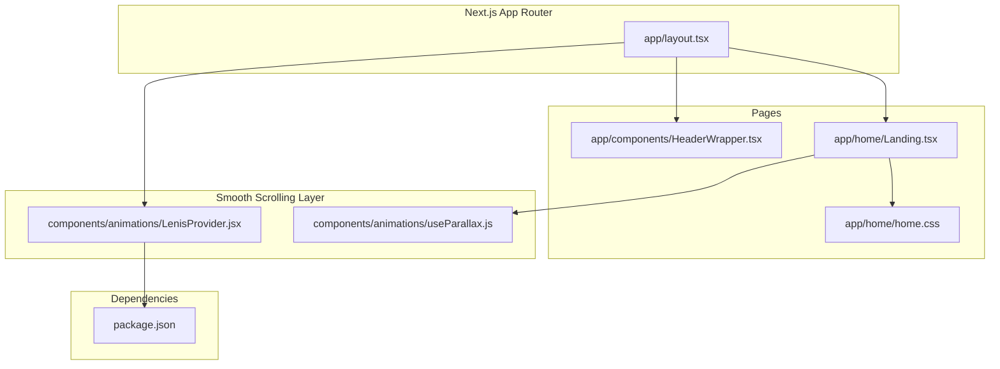
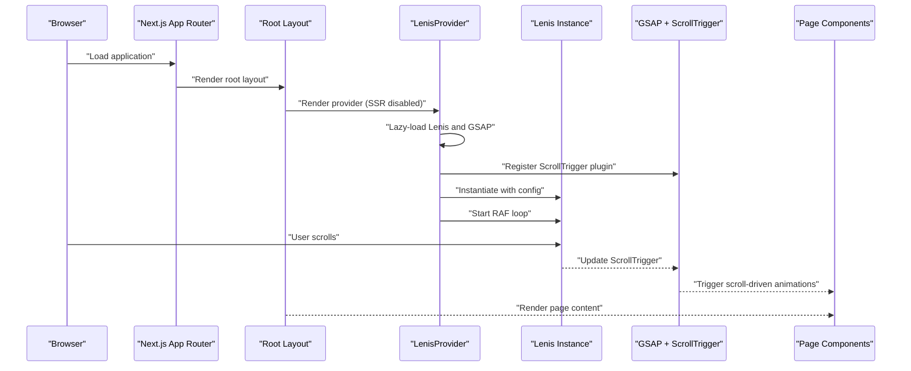
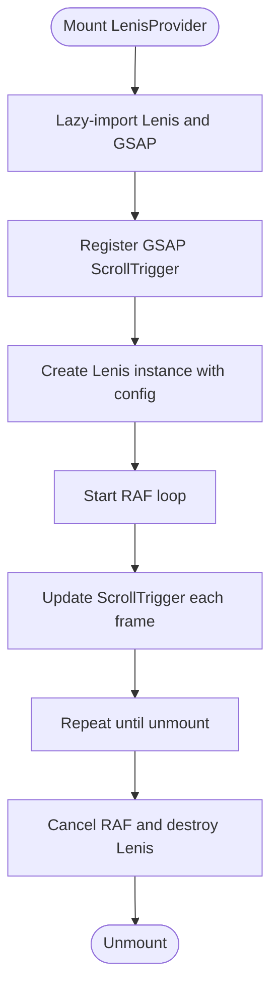
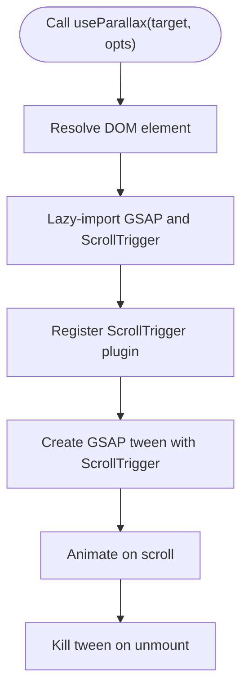
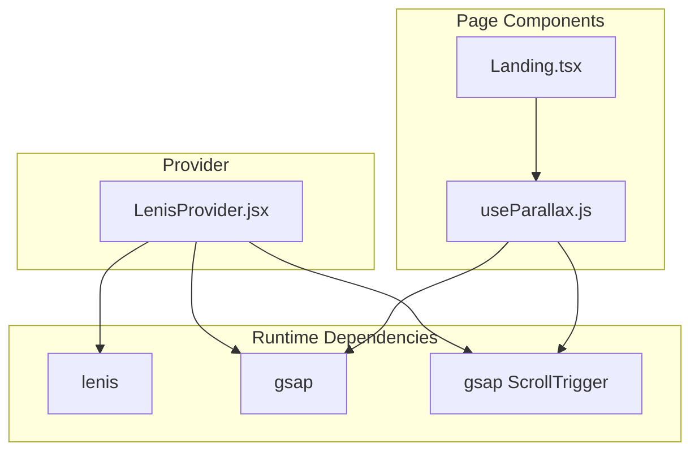

# Smooth Scrolling with Lenis

<cite>
**Referenced Files in This Document**
- [LenisProvider.jsx](file://components/animations/LenisProvider.jsx)
- [layout.tsx](file://app/layout.tsx)
- [useParallax.js](file://components/animations/useParallax.js)
- [Landing.tsx](file://app/home/Landing.tsx)
- [home.css](file://app/home/home.css)
- [HeaderWrapper.tsx](file://app/components/HeaderWrapper.tsx)
- [package.json](file://package.json)
</cite>

## Table of Contents
1. [Introduction](#introduction)
2. [Project Structure](#project-structure)
3. [Core Components](#core-components)
4. [Architecture Overview](#architecture-overview)
5. [Detailed Component Analysis](#detailed-component-analysis)
6. [Dependency Analysis](#dependency-analysis)
7. [Performance Considerations](#performance-considerations)
8. [Troubleshooting Guide](#troubleshooting-guide)
9. [Conclusion](#conclusion)

## Introduction
This document explains how the Zeex AI website implements smooth, buttery-scrolling navigation using Lenis integrated with Next.js app router. It covers how the Lenis provider enables global smooth scrolling, how configuration options shape scroll behavior, and how GSAP ScrollTrigger enhances scroll-driven animations. Practical guidance is included for implementing custom scroll triggers and scroll-to-section interactions, along with performance insights and troubleshooting tips tailored to Next.js environments.

## Project Structure
The smooth scrolling implementation centers around a provider component that initializes Lenis and registers GSAP ScrollTrigger, then wraps the application via Next.js layout. Additional helpers enable scroll-driven animations, and CSS ensures optimal rendering performance.

**Diagram sources**
- [layout.tsx:1-24](file://app/layout.tsx#L1-L24)
- [LenisProvider.jsx:1-52](file://components/animations/LenisProvider.jsx#L1-L52)
- [useParallax.js:1-31](file://components/animations/useParallax.js#L1-L31)
- [Landing.tsx:1-200](file://app/home/Landing.tsx#L1-L200)
- [home.css:1-800](file://app/home/home.css#L1-L800)
- [HeaderWrapper.tsx:1-25](file://app/components/HeaderWrapper.tsx#L1-L25)
- [package.json:1-31](file://package.json#L1-L31)

**Section sources**
- [layout.tsx:1-24](file://app/layout.tsx#L1-L24)
- [LenisProvider.jsx:1-52](file://components/animations/LenisProvider.jsx#L1-L52)
- [useParallax.js:1-31](file://components/animations/useParallax.js#L1-L31)
- [Landing.tsx:1-200](file://app/home/Landing.tsx#L1-L200)
- [home.css:1-800](file://app/home/home.css#L1-L800)
- [HeaderWrapper.tsx:1-25](file://app/components/HeaderWrapper.tsx#L1-L25)
- [package.json:1-31](file://package.json#L1-L31)

## Core Components
- LenisProvider: Initializes Lenis and GSAP ScrollTrigger, runs the animation frame loop, and cleans up on unmount.
- useParallax: Lightweight helper to apply GSAP ScrollTrigger-driven parallax to DOM elements.
- Layout integration: Wraps the app with the provider and conditionally renders the header.
- Page-level enhancements: Demonstrates scroll-driven animations and section navigation patterns.

Key responsibilities:
- Global smooth scrolling via Lenis initialization and RAF loop.
- Scroll-triggered animations via GSAP ScrollTrigger registration.
- Conditional provider loading to avoid SSR issues.
- CSS optimizations for GPU-accelerated transforms and reduced repaints.

**Section sources**
- [LenisProvider.jsx:1-52](file://components/animations/LenisProvider.jsx#L1-L52)
- [useParallax.js:1-31](file://components/animations/useParallax.js#L1-L31)
- [layout.tsx:1-24](file://app/layout.tsx#L1-L24)
- [HeaderWrapper.tsx:1-25](file://app/components/HeaderWrapper.tsx#L1-L25)

## Architecture Overview
The smooth scrolling pipeline integrates Lenis with Next.js app routing and GSAP ScrollTrigger for scroll-driven animations.

**Diagram sources**
- [layout.tsx:1-24](file://app/layout.tsx#L1-L24)
- [LenisProvider.jsx:1-52](file://components/animations/LenisProvider.jsx#L1-L52)
- [useParallax.js:1-31](file://components/animations/useParallax.js#L1-L31)

## Detailed Component Analysis

### LenisProvider Component
The provider initializes Lenis and GSAP ScrollTrigger, sets up the RAF loop, and ensures cleanup on unmount. It lazily loads dependencies to avoid SSR issues and registers GSAP plugins before creating the Lenis instance.

Implementation highlights:
- Dynamic import of Lenis and GSAP to prevent SSR errors.
- Robust plugin detection and registration for ScrollTrigger.
- Configurable Lenis options: duration, easing, and smooth behavior.
- Continuous RAF loop to synchronize Lenis with ScrollTrigger updates.
- Cleanup of RAF and Lenis instance on component unmount.

**Diagram sources**
- [LenisProvider.jsx:1-52](file://components/animations/LenisProvider.jsx#L1-L52)

**Section sources**
- [LenisProvider.jsx:1-52](file://components/animations/LenisProvider.jsx#L1-L52)

### Layout Integration
The root layout dynamically imports the provider to avoid SSR hydration mismatches. It also conditionally renders the header based on the current route, ensuring a clean splash experience on the root path.

Responsibilities:
- Defer provider rendering to client-only to prevent SSR issues.
- Manage header visibility depending on the current path.
- Wrap page content with the provider and header.

**Section sources**
- [layout.tsx:1-24](file://app/layout.tsx#L1-L24)
- [HeaderWrapper.tsx:1-25](file://app/components/HeaderWrapper.tsx#L1-L25)

### Scroll-Driven Animations with useParallax
The helper applies GSAP ScrollTrigger-driven parallax to elements. It lazily imports GSAP and ScrollTrigger, registers the plugin, and creates a scroll-triggered tween for vertical movement.

Key behaviors:
- Target element resolution via selector or ref.
- Scroll-triggered tween with configurable speed and scrubbing.
- Cleanup function to kill the tween on unmount.

**Diagram sources**
- [useParallax.js:1-31](file://components/animations/useParallax.js#L1-L31)

**Section sources**
- [useParallax.js:1-31](file://components/animations/useParallax.js#L1-L31)

### Page-Level Enhancements and Scroll Triggers
The landing page demonstrates scroll-driven effects and section navigation patterns. It includes:
- Cursor glow and velocity effects synchronized with scroll events.
- Scroll-triggered parallax via the useParallax helper.
- Optional wheel-based section navigation on desktop.

These patterns illustrate how to combine Lenis with scroll-driven animations and targeted navigation.

**Section sources**
- [Landing.tsx:1-200](file://app/home/Landing.tsx#L1-L200)
- [Landing.tsx:412-464](file://app/home/Landing.tsx#L412-L464)
- [Landing.tsx:470-488](file://app/home/Landing.tsx#L470-L488)
- [home.css:1-800](file://app/home/home.css#L1-L800)

## Dependency Analysis
The smooth scrolling stack relies on Lenis and GSAP with ScrollTrigger. The provider dynamically imports these libraries to avoid SSR issues and ensure optimal performance.

**Diagram sources**
- [LenisProvider.jsx:1-52](file://components/animations/LenisProvider.jsx#L1-L52)
- [useParallax.js:1-31](file://components/animations/useParallax.js#L1-L31)
- [Landing.tsx:1-200](file://app/home/Landing.tsx#L1-L200)
- [package.json:1-31](file://package.json#L1-L31)

**Section sources**
- [LenisProvider.jsx:1-52](file://components/animations/LenisProvider.jsx#L1-L52)
- [useParallax.js:1-31](file://components/animations/useParallax.js#L1-L31)
- [Landing.tsx:1-200](file://app/home/Landing.tsx#L1-L200)
- [package.json:1-31](file://package.json#L1-L31)

## Performance Considerations
- RAF synchronization: The provider’s continuous RAF loop keeps Lenis and ScrollTrigger in sync, preventing jank during scroll-driven animations.
- GPU acceleration: CSS properties like transform and will-change are used to minimize layout thrashing and improve scroll performance.
- Lazy loading: Dependencies are imported only when needed, reducing initial bundle size and avoiding SSR overhead.
- Mobile-first: Scroll-triggered effects adapt to device capabilities, disabling heavy effects on mobile to preserve battery life and responsiveness.

Practical tips:
- Prefer transform-based animations over layout-affecting properties.
- Use will-change sparingly and only on elements that truly benefit.
- Keep ScrollTrigger scrubbing minimal for complex scenes to reduce CPU usage.
- Test on real devices to validate smoothness and adjust easing or duration as needed.

[No sources needed since this section provides general guidance]

## Troubleshooting Guide
Common issues and resolutions:
- Provider not active on SSR: Ensure the provider is client-only by using dynamic imports with SSR disabled. Verify the layout wraps the provider and header correctly.
- ScrollTrigger not updating: Confirm that the RAF loop updates ScrollTrigger each frame and that plugins are registered before creating the Lenis instance.
- Conflicts with other scroll libraries: Avoid initializing multiple scroll libraries simultaneously. If integrating with other scroll systems, coordinate their lifecycle with the Lenis provider.
- Mobile performance: Disable heavy scroll-driven effects on mobile devices. Use media queries or feature detection to tailor behavior.
- Cleanup on route changes: Ensure the provider is unmounted when navigating between pages to prevent lingering RAF loops and memory leaks.

**Section sources**
- [layout.tsx:1-24](file://app/layout.tsx#L1-L24)
- [LenisProvider.jsx:1-52](file://components/animations/LenisProvider.jsx#L1-L52)

## Conclusion
The Zeex AI website achieves smooth, scroll-driven experiences by combining Lenis with GSAP ScrollTrigger inside a Next.js app router layout. The LenisProvider initializes and synchronizes the scroll engine, while helpers like useParallax enable scroll-triggered animations. By leveraging lazy loading, RAF synchronization, and CSS optimizations, the implementation delivers a responsive, high-performance scroll experience across devices. For advanced use cases, integrate custom scroll triggers and scroll-to-section patterns while monitoring performance and resolving conflicts with other libraries.