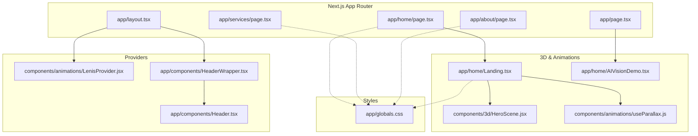
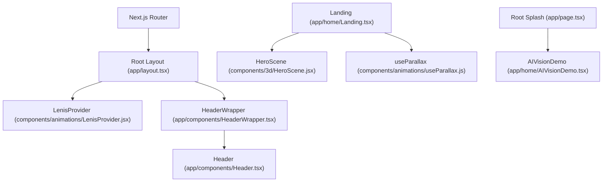
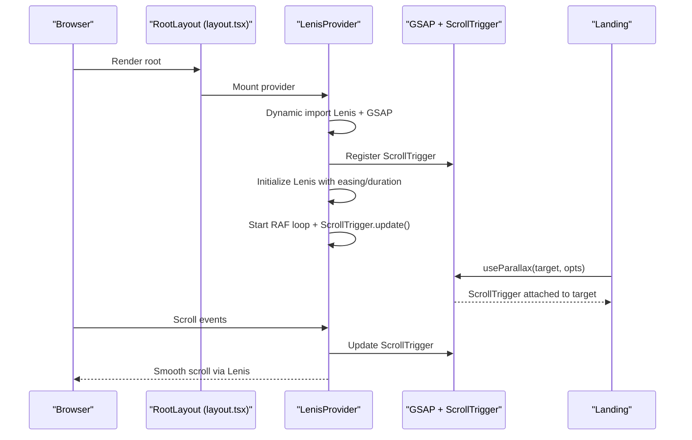
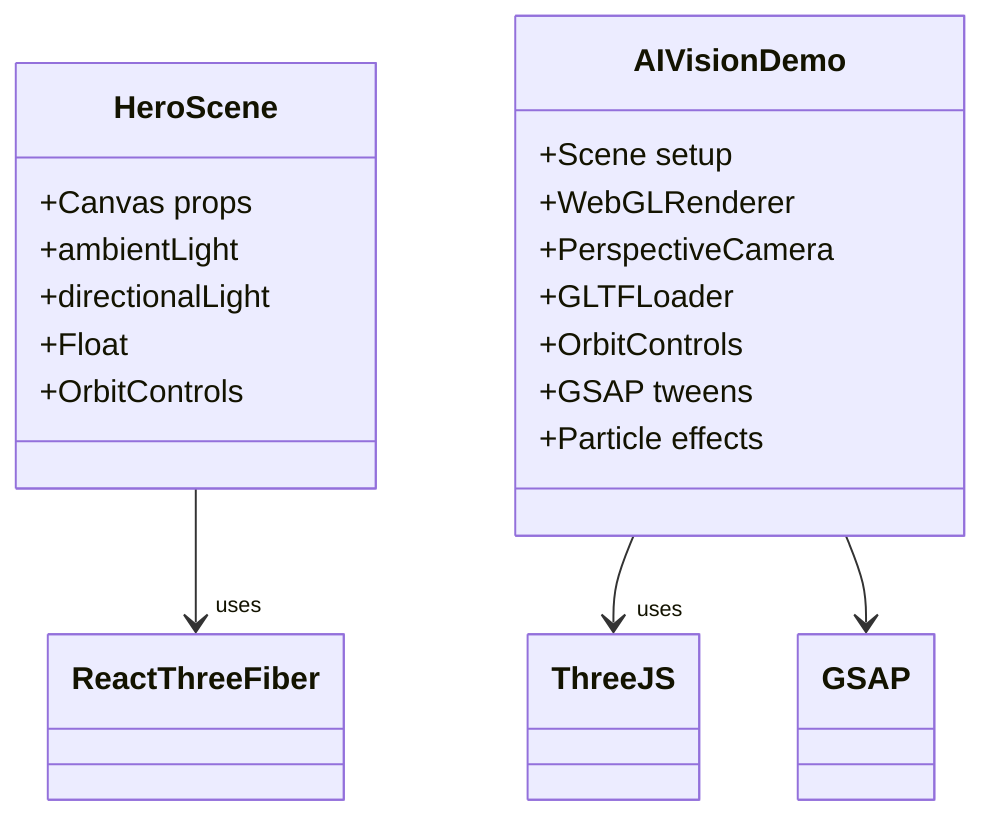
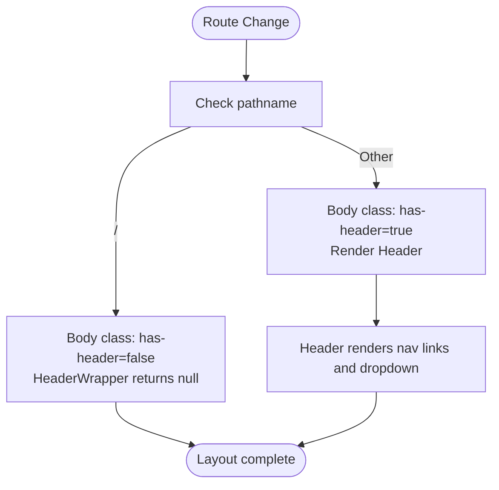
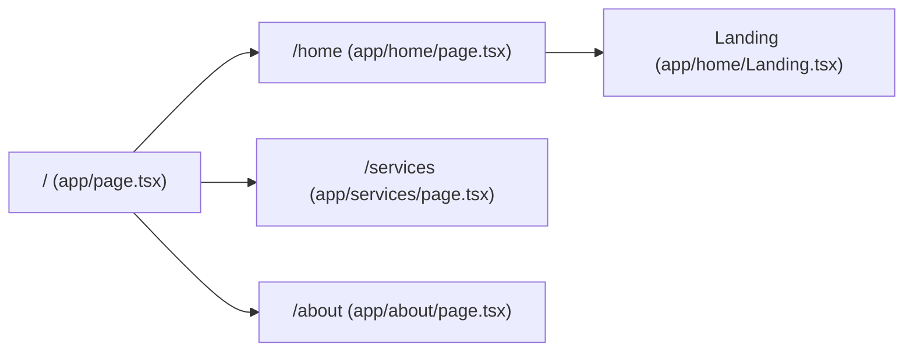
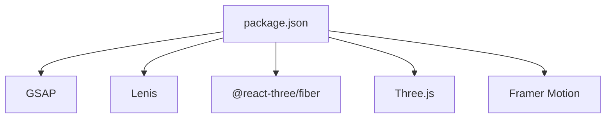

# Architecture Overview

<cite>
**Referenced Files in This Document**
- [package.json](file://package.json)
- [app/layout.tsx](file://app/layout.tsx)
- [app/page.tsx](file://app/page.tsx)
- [app/home/page.tsx](file://app/home/page.tsx)
- [app/components/Header.tsx](file://app/components/Header.tsx)
- [app/components/HeaderWrapper.tsx](file://app/components/HeaderWrapper.tsx)
- [components/3d/HeroScene.jsx](file://components/3d/HeroScene.jsx)
- [components/animations/LenisProvider.jsx](file://components/animations/LenisProvider.jsx)
- [components/animations/useParallax.js](file://components/animations/useParallax.js)
- [components/animations/useCursorGlow.js](file://components/animations/useCursorGlow.js)
- [app/home/Landing.tsx](file://app/home/Landing.tsx)
- [app/home/AIVisionDemo.tsx](file://app/home/AIVisionDemo.tsx)
- [app/services/page.tsx](file://app/services/page.tsx)
- [app/about/page.tsx](file://app/about/page.tsx)
- [app/globals.css](file://app/globals.css)
</cite>

## Table of Contents
1. [Introduction](#introduction)
2. [Project Structure](#project-structure)
3. [Core Components](#core-components)
4. [Architecture Overview](#architecture-overview)
5. [Detailed Component Analysis](#detailed-component-analysis)
6. [Dependency Analysis](#dependency-analysis)
7. [Performance Considerations](#performance-considerations)
8. [Troubleshooting Guide](#troubleshooting-guide)
9. [Conclusion](#conclusion)

## Introduction
This document describes the architecture of the Zeex AI Main Website, a Next.js 14 application focused on immersive 3D experiences and smooth user interactions. The site integrates React Three Fiber for 3D visualization, GSAP and Lenis for advanced scroll-driven animations, and a component-based design that separates 3D rendering, animation orchestration, and traditional web UI. The routing follows Next.js App Router conventions, and the header management system ensures consistent navigation state across pages.

## Project Structure
The application is organized using Next.js App Router conventions:
- app/: Route segments mapped to pages and layouts
- components/: Shared UI and animation utilities
- public/: Static assets and media
- app/globals.css: Global styles and animations

Key architectural elements:
- Root layout initializes global providers for scroll/animation (Lenis) and header management
- Route pages render page-specific components
- Shared components encapsulate reusable UI and animation helpers

**Diagram sources**
- [app/layout.tsx:13-23](file://app/layout.tsx#L13-L23)
- [app/components/HeaderWrapper.tsx:7-24](file://app/components/HeaderWrapper.tsx#L7-L24)
- [app/components/Header.tsx:10-82](file://app/components/Header.tsx#L10-L82)
- [components/animations/LenisProvider.jsx:5-51](file://components/animations/LenisProvider.jsx#L5-L51)
- [components/3d/HeroScene.jsx:23-36](file://components/3d/HeroScene.jsx#L23-L36)
- [app/home/Landing.tsx:48-58](file://app/home/Landing.tsx#L48-L58)
- [components/animations/useParallax.js:1-31](file://components/animations/useParallax.js#L1-L31)
- [app/page.tsx:9-54](file://app/page.tsx#L9-L54)
- [app/home/AIVisionDemo.tsx:11-562](file://app/home/AIVisionDemo.tsx#L11-L562)
- [app/globals.css:1-800](file://app/globals.css#L1-L800)

**Section sources**
- [package.json:1-31](file://package.json#L1-L31)
- [app/layout.tsx:1-24](file://app/layout.tsx#L1-L24)
- [app/page.tsx:1-55](file://app/page.tsx#L1-L55)
- [app/home/page.tsx:1-15](file://app/home/page.tsx#L1-L15)
- [app/services/page.tsx:1-379](file://app/services/page.tsx#L1-L379)
- [app/about/page.tsx:1-298](file://app/about/page.tsx#L1-L298)

## Core Components
- Root Layout and Providers
  - Initializes LenisProvider for scroll-driven animations and GSAP integration
  - Wraps children with a page-root container and manages header visibility
- Header Management
  - HeaderWrapper hides the header on the splash route and toggles body classes based on path
  - Header renders navigation links and dropdown menus
- 3D Visualization
  - HeroScene provides a lightweight React Three Fiber scene with floating geometry and orbit controls
  - AIVisionDemo integrates a custom Three.js setup with GLTF loading, materials, and GSAP-driven transforms
- Animation Systems
  - LenisProvider sets up Lenis smooth scrolling, integrates GSAP ScrollTrigger, and manages RAF lifecycle
  - useParallax attaches GSAP ScrollTrigger-based parallax effects to DOM elements
  - useCursorGlow provides optional cursor glow behavior
- Page Components
  - Home route composes Landing, which orchestrates multiple animation enhancements (parallax, counters, scroll-reveal, hover effects)
  - Services and About pages demonstrate page-specific interactions and state management

**Section sources**
- [app/layout.tsx:13-23](file://app/layout.tsx#L13-L23)
- [app/components/HeaderWrapper.tsx:7-24](file://app/components/HeaderWrapper.tsx#L7-L24)
- [app/components/Header.tsx:10-82](file://app/components/Header.tsx#L10-L82)
- [components/3d/HeroScene.jsx:23-36](file://components/3d/HeroScene.jsx#L23-L36)
- [app/home/AIVisionDemo.tsx:11-562](file://app/home/AIVisionDemo.tsx#L11-L562)
- [components/animations/LenisProvider.jsx:5-51](file://components/animations/LenisProvider.jsx#L5-L51)
- [components/animations/useParallax.js:1-31](file://components/animations/useParallax.js#L1-L31)
- [components/animations/useCursorGlow.js:1-26](file://components/animations/useCursorGlow.js#L1-L26)
- [app/home/Landing.tsx:48-58](file://app/home/Landing.tsx#L48-L58)

## Architecture Overview
The system architecture centers on a layered approach:
- Routing Layer: Next.js App Router maps URLs to route handlers and page components
- Provider Layer: Root layout injects global providers for animations and navigation
- Presentation Layer: Page components render UI and delegate to shared components
- Animation Layer: Lenis and GSAP coordinate scroll-driven motion; React Three Fiber powers 3D scenes
- Infrastructure Layer: Build and runtime managed by Next.js with Node.js

**Diagram sources**
- [app/layout.tsx:13-23](file://app/layout.tsx#L13-L23)
- [components/animations/LenisProvider.jsx:5-51](file://components/animations/LenisProvider.jsx#L5-L51)
- [app/components/HeaderWrapper.tsx:7-24](file://app/components/HeaderWrapper.tsx#L7-L24)
- [app/components/Header.tsx:10-82](file://app/components/Header.tsx#L10-L82)
- [components/3d/HeroScene.jsx:23-36](file://components/3d/HeroScene.jsx#L23-L36)
- [app/home/Landing.tsx:48-58](file://app/home/Landing.tsx#L48-L58)
- [components/animations/useParallax.js:1-31](file://components/animations/useParallax.js#L1-L31)
- [app/page.tsx:9-54](file://app/page.tsx#L9-L54)
- [app/home/AIVisionDemo.tsx:11-562](file://app/home/AIVisionDemo.tsx#L11-L562)

## Detailed Component Analysis

### Animation Architecture: GSAP, Lenis, and Scroll-Driven Motion
The animation system integrates Lenis for smooth scrolling with GSAP for precise control and ScrollTrigger for scroll-linked effects. The provider initializes Lenis and registers ScrollTrigger dynamically to avoid SSR issues. Scroll-linked effects are applied via useParallax and Landing’s enhancements.

**Diagram sources**
- [app/layout.tsx:13-23](file://app/layout.tsx#L13-L23)
- [components/animations/LenisProvider.jsx:12-48](file://components/animations/LenisProvider.jsx#L12-L48)
- [components/animations/useParallax.js:16-25](file://components/animations/useParallax.js#L16-L25)
- [app/home/Landing.tsx:470-488](file://app/home/Landing.tsx#L470-L488)

**Section sources**
- [components/animations/LenisProvider.jsx:5-51](file://components/animations/LenisProvider.jsx#L5-L51)
- [components/animations/useParallax.js:1-31](file://components/animations/useParallax.js#L1-L31)
- [app/home/Landing.tsx:467-488](file://app/home/Landing.tsx#L467-L488)

### 3D Visualization: React Three Fiber and Custom Three.js
The 3D visualization layer uses two complementary approaches:
- React Three Fiber scene (HeroScene) for lightweight, declarative 3D rendering with floating geometry and orbit controls
- Custom Three.js setup (AIVisionDemo) for advanced camera control, GLTF loading, material composition, and GSAP-driven transforms

**Diagram sources**
- [components/3d/HeroScene.jsx:23-36](file://components/3d/HeroScene.jsx#L23-L36)
- [app/home/AIVisionDemo.tsx:38-213](file://app/home/AIVisionDemo.tsx#L38-L213)

**Section sources**
- [components/3d/HeroScene.jsx:1-37](file://components/3d/HeroScene.jsx#L1-L37)
- [app/home/AIVisionDemo.tsx:11-562](file://app/home/AIVisionDemo.tsx#L11-L562)

### Header Management and Navigation State
HeaderWrapper conditionally renders the Header based on the current path and toggles body classes to adjust layout. The Header provides navigation links and a dropdown menu for services. This ensures consistent navigation state across pages while hiding the header on the splash route.

**Diagram sources**
- [app/components/HeaderWrapper.tsx:7-24](file://app/components/HeaderWrapper.tsx#L7-L24)
- [app/components/Header.tsx:10-82](file://app/components/Header.tsx#L10-L82)

**Section sources**
- [app/components/HeaderWrapper.tsx:1-25](file://app/components/HeaderWrapper.tsx#L1-L25)
- [app/components/Header.tsx:1-83](file://app/components/Header.tsx#L1-L83)

### Routing and Page Organization
Pages are organized under the app directory with route groups:
- Root splash page (app/page.tsx) manages initial loading and transitions
- Home page (app/home/page.tsx) renders Landing, which orchestrates animations and 3D scenes
- Services and About pages demonstrate page-specific UI and interactions

**Diagram sources**
- [app/page.tsx:9-54](file://app/page.tsx#L9-L54)
- [app/home/page.tsx:7-13](file://app/home/page.tsx#L7-L13)
- [app/services/page.tsx:7-13](file://app/services/page.tsx#L7-L13)
- [app/about/page.tsx:10-69](file://app/about/page.tsx#L10-L69)

**Section sources**
- [app/page.tsx:1-55](file://app/page.tsx#L1-L55)
- [app/home/page.tsx:1-15](file://app/home/page.tsx#L1-L15)
- [app/services/page.tsx:1-379](file://app/services/page.tsx#L1-L379)
- [app/about/page.tsx:1-298](file://app/about/page.tsx#L1-L298)

## Dependency Analysis
External dependencies integrate core animation and 3D libraries:
- GSAP: Scroll-driven animations and tweens
- Lenis: Smooth scroll behavior
- React Three Fiber and Three.js: 3D rendering and controls
- Framer Motion: UI animations and staggered reveals

**Diagram sources**
- [package.json:11-21](file://package.json#L11-L21)

**Section sources**
- [package.json:1-31](file://package.json#L1-L31)

## Performance Considerations
- Client-side only rendering: Dynamic imports ensure LenisProvider and HeroScene are only loaded on the client, reducing SSR overhead
- Efficient 3D rendering: React Three Fiber’s Canvas and useFrame minimize unnecessary re-renders; pixel ratio capped for performance
- Scroll performance: Lenis provides hardware-accelerated scrolling; ScrollTrigger scrubbing decouples animation from frame rate
- Asset optimization: GLTF loader gracefully falls back to procedural geometry if GLB fails
- CSS-driven effects: Extensive use of CSS animations reduces JS workload during idle periods

[No sources needed since this section provides general guidance]

## Troubleshooting Guide
Common issues and resolutions:
- Lenis initialization errors: Ensure dynamic imports succeed and ScrollTrigger registration is handled gracefully
- GSAP ScrollTrigger conflicts: Verify plugins are registered before attaching triggers; clean up on unmount
- 3D scene flickering: Confirm Canvas dpr and resize handlers; avoid forcing synchronous layout reads
- Header visibility mismatch: Check body class toggling logic in HeaderWrapper and ensure cleanup on unmount
- Cursor effects on mobile: Feature detection disables heavy effects on coarse pointers and small screens

**Section sources**
- [components/animations/LenisProvider.jsx:12-48](file://components/animations/LenisProvider.jsx#L12-L48)
- [components/animations/useParallax.js:16-25](file://components/animations/useParallax.js#L16-L25)
- [app/home/AIVisionDemo.tsx:139-213](file://app/home/AIVisionDemo.tsx#L139-L213)
- [app/components/HeaderWrapper.tsx:11-19](file://app/components/HeaderWrapper.tsx#L11-L19)
- [app/home/Landing.tsx:196-232](file://app/home/Landing.tsx#L196-L232)

## Conclusion
The Zeex AI Main Website employs a layered architecture leveraging Next.js App Router, React Three Fiber, GSAP, and Lenis to deliver immersive 3D experiences with smooth interactions. The separation of concerns between 3D visualization, animation orchestration, and traditional web components enables maintainability and scalability. The header management system and routing ensure consistent navigation and seamless transitions across pages.