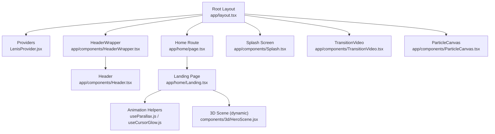
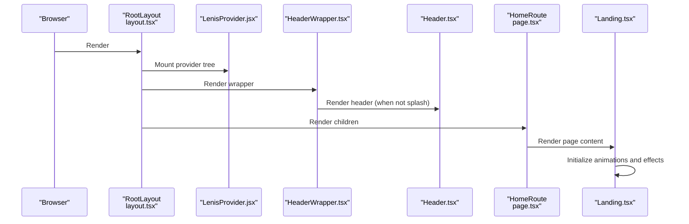
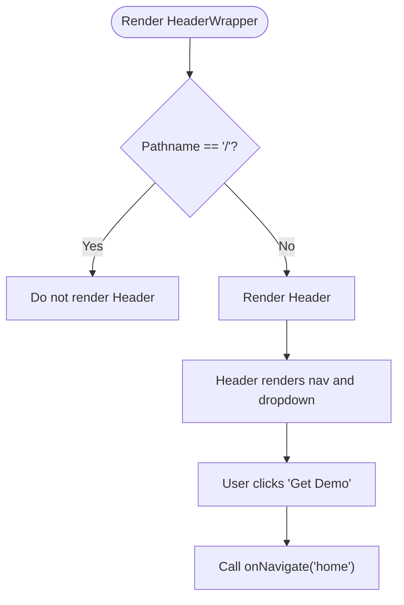
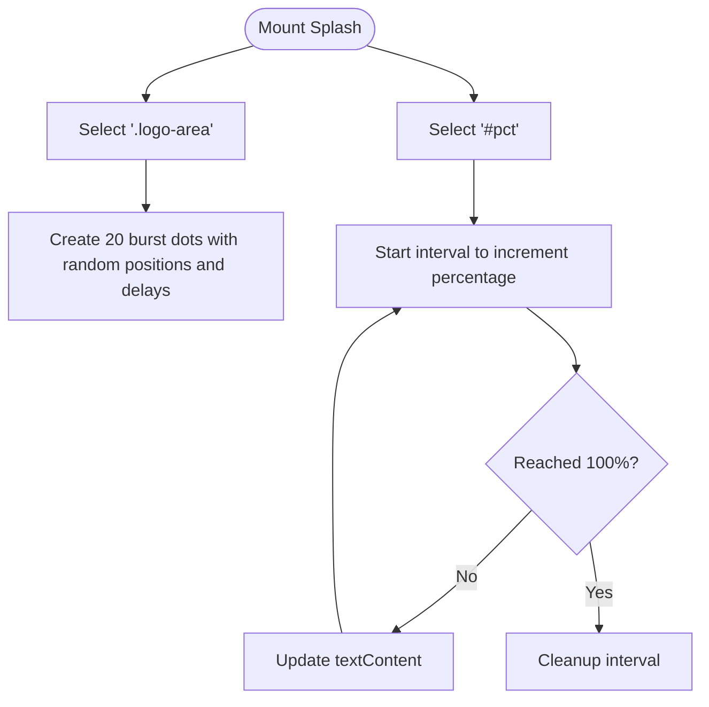
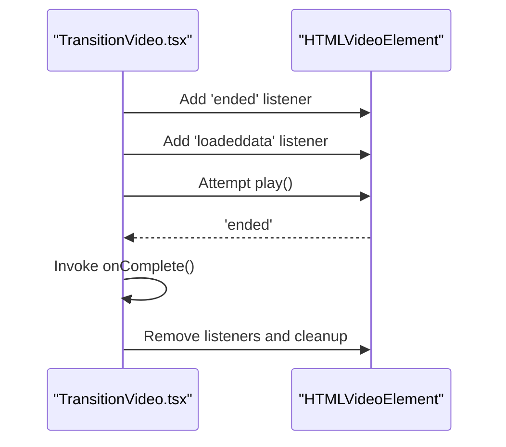
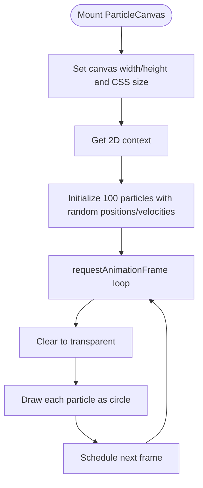
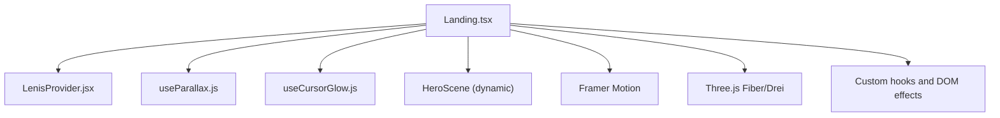
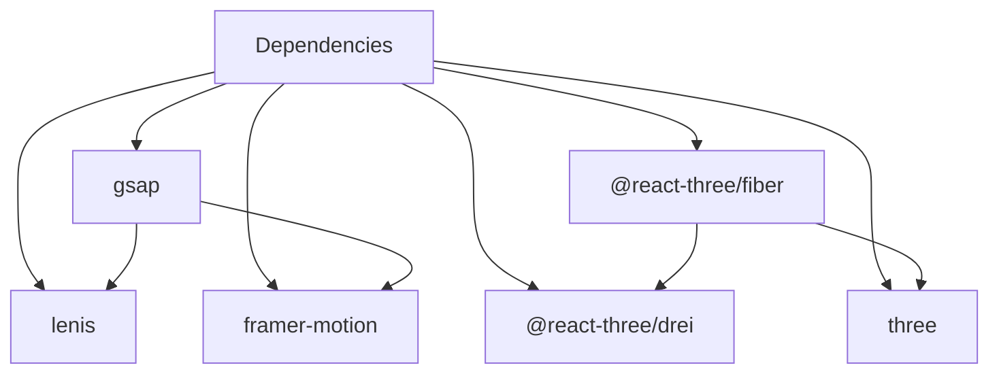

# Component Architecture

<cite>
**Referenced Files in This Document**
- [layout.tsx](file://app/layout.tsx)
- [HeaderWrapper.tsx](file://app/components/HeaderWrapper.tsx)
- [Header.tsx](file://app/components/Header.tsx)
- [ParticleCanvas.tsx](file://app/components/ParticleCanvas.tsx)
- [Splash.tsx](file://app/components/Splash.tsx)
- [TransitionVideo.tsx](file://app/components/TransitionVideo.tsx)
- [LenisProvider.jsx](file://components/animations/LenisProvider.jsx)
- [useParallax.js](file://components/animations/useParallax.js)
- [useCursorGlow.js](file://components/animations/useCursorGlow.js)
- [Landing.tsx](file://app/home/Landing.tsx)
- [page.tsx](file://app/home/page.tsx)
- [globals.css](file://app/globals.css)
- [package.json](file://package.json)
</cite>

## Table of Contents
1. [Introduction](#introduction)
2. [Project Structure](#project-structure)
3. [Core Components](#core-components)
4. [Architecture Overview](#architecture-overview)
5. [Detailed Component Analysis](#detailed-component-analysis)
6. [Dependency Analysis](#dependency-analysis)
7. [Performance Considerations](#performance-considerations)
8. [Testing Approach](#testing-approach)
9. [Troubleshooting Guide](#troubleshooting-guide)
10. [Conclusion](#conclusion)
11. [Appendices](#appendices)

## Introduction
This document explains the component architecture used to build the Zeex AI website. It focuses on the root layout, shared components (Header, ParticleCanvas, Splash, TransitionVideo), and how higher-order pages compose these components into complex UI experiences. It also documents prop interfaces, state management, styling approaches, animation integrations (GSAP timelines and Three.js contexts), performance optimization strategies, and testing practices.

## Project Structure
The site is a Next.js application with a clear separation between:
- Root layout and providers
- Shared UI components under app/components
- Page-level routes and their compositions
- Global styles and animation helpers

**Diagram sources**
- [layout.tsx:13-23](file://app/layout.tsx#L13-L23)
- [HeaderWrapper.tsx:7-24](file://app/components/HeaderWrapper.tsx#L7-L24)
- [Header.tsx:10-82](file://app/components/Header.tsx#L10-L82)
- [Splash.tsx:5-34](file://app/components/Splash.tsx#L5-L34)
- [TransitionVideo.tsx:10-37](file://app/components/TransitionVideo.tsx#L10-L37)
- [ParticleCanvas.tsx:5-69](file://app/components/ParticleCanvas.tsx#L5-L69)
- [LenisProvider.jsx:5-51](file://components/animations/LenisProvider.jsx#L5-L51)
- [Landing.tsx:60-1158](file://app/home/Landing.tsx#L60-L1158)
- [useParallax.js:2-30](file://components/animations/useParallax.js#L2-L30)
- [useCursorGlow.js:2-25](file://components/animations/useCursorGlow.js#L2-L25)

**Section sources**
- [layout.tsx:13-23](file://app/layout.tsx#L13-L23)
- [HeaderWrapper.tsx:7-24](file://app/components/HeaderWrapper.tsx#L7-L24)
- [Header.tsx:10-82](file://app/components/Header.tsx#L10-L82)
- [Splash.tsx:5-34](file://app/components/Splash.tsx#L5-L34)
- [TransitionVideo.tsx:10-37](file://app/components/TransitionVideo.tsx#L10-L37)
- [ParticleCanvas.tsx:5-69](file://app/components/ParticleCanvas.tsx#L5-L69)
- [LenisProvider.jsx:5-51](file://components/animations/LenisProvider.jsx#L5-L51)
- [Landing.tsx:60-1158](file://app/home/Landing.tsx#L60-L1158)
- [useParallax.js:2-30](file://components/animations/useParallax.js#L2-L30)
- [useCursorGlow.js:2-25](file://components/animations/useCursorGlow.js#L2-L25)

## Core Components
This section documents the shared components and their roles, props, and state.

- Header
  - Purpose: Navigation bar with dropdown menu and call-to-action.
  - Props: onNavigate?: (route: string) => void
  - Behavior: Renders links and triggers parent navigation callback.
  - Communication: Calls onNavigate when the demo button is clicked.

- HeaderWrapper
  - Purpose: Conditionally renders Header based on route and toggles body class for layout spacing.
  - Props: None
  - Behavior: Hides header on the root splash route and adds/removes a class to body for layout adjustments.

- ParticleCanvas
  - Purpose: Canvas-based animated particle background.
  - Props: None
  - Behavior: Initializes canvas, resizes with window, animates 100 small circles with boundary bounces, and cleans up on unmount.

- Splash
  - Purpose: Fullscreen loading/initialization screen with animated elements.
  - Props: None
  - Behavior: Creates burst dots, counts up a percentage indicator, and renders branding and status indicators.

- TransitionVideo
  - Purpose: Fullscreen intro video player with completion callback.
  - Props: src?: string; onComplete: () => void
  - Behavior: Attempts to play video automatically, handles ended event to signal completion, and ensures cleanup.

- LenisProvider
  - Purpose: Initializes smooth scrolling with Lenis and integrates GSAP ScrollTrigger.
  - Props: None
  - Behavior: Dynamically imports Lenis and GSAP, registers ScrollTrigger, runs RAF loop, and cleans up on unmount.

- useParallax
  - Purpose: Applies GSAP ScrollTrigger-based parallax to a given element.
  - Props: target (selector or ref), options { speed?: number; scrub?: boolean }
  - Behavior: Returns a cleanup function to kill the tween.

- useCursorGlow
  - Purpose: Attaches a lightweight cursor glow element.
  - Props: None
  - Behavior: Creates and manages a DOM overlay for cursor glow, returns cleanup.

**Section sources**
- [Header.tsx:6-82](file://app/components/Header.tsx#L6-L82)
- [HeaderWrapper.tsx:7-24](file://app/components/HeaderWrapper.tsx#L7-L24)
- [ParticleCanvas.tsx:5-69](file://app/components/ParticleCanvas.tsx#L5-L69)
- [Splash.tsx:5-34](file://app/components/Splash.tsx#L5-L34)
- [TransitionVideo.tsx:5-37](file://app/components/TransitionVideo.tsx#L5-L37)
- [LenisProvider.jsx:5-51](file://components/animations/LenisProvider.jsx#L5-L51)
- [useParallax.js:2-30](file://components/animations/useParallax.js#L2-L30)
- [useCursorGlow.js:2-25](file://components/animations/useCursorGlow.js#L2-L25)

## Architecture Overview
The architecture centers on a root layout that mounts global providers and shared UI scaffolding, while page-level components orchestrate complex interactions.

**Diagram sources**
- [layout.tsx:13-23](file://app/layout.tsx#L13-L23)
- [LenisProvider.jsx:5-51](file://components/animations/LenisProvider.jsx#L5-L51)
- [HeaderWrapper.tsx:7-24](file://app/components/HeaderWrapper.tsx#L7-L24)
- [Header.tsx:10-82](file://app/components/Header.tsx#L10-L82)
- [page.tsx:7-13](file://app/home/page.tsx#L7-L13)
- [Landing.tsx:60-1158](file://app/home/Landing.tsx#L60-L1158)

## Detailed Component Analysis

### Root Layout and Providers
- Mounts LenisProvider to enable smooth scrolling and GSAP ScrollTrigger integration.
- Wraps page content with a container and conditionally renders Header via HeaderWrapper.
- Ensures global styles are loaded.

**Section sources**
- [layout.tsx:13-23](file://app/layout.tsx#L13-L23)
- [LenisProvider.jsx:5-51](file://components/animations/LenisProvider.jsx#L5-L51)
- [globals.css:1-800](file://app/globals.css#L1-L800)

### Header and HeaderWrapper
- HeaderWrapper hides the header on the splash route and toggles a body class to adjust layout spacing.
- Header provides navigation links and a “Get Demo” action that invokes a parent callback.

**Diagram sources**
- [HeaderWrapper.tsx:7-24](file://app/components/HeaderWrapper.tsx#L7-L24)
- [Header.tsx:10-82](file://app/components/Header.tsx#L10-L82)

**Section sources**
- [HeaderWrapper.tsx:7-24](file://app/components/HeaderWrapper.tsx#L7-L24)
- [Header.tsx:10-82](file://app/components/Header.tsx#L10-L82)

### Splash Screen
- Dynamically creates burst dots inside a logo area.
- Counts up a percentage indicator with intervals.
- Provides branding and status visuals.

**Diagram sources**
- [Splash.tsx:5-34](file://app/components/Splash.tsx#L5-L34)

**Section sources**
- [Splash.tsx:5-34](file://app/components/Splash.tsx#L5-L34)

### TransitionVideo
- Plays a fullscreen intro video and signals completion via a callback.
- Handles autoplay restrictions and attempts playback after user interaction.

**Diagram sources**
- [TransitionVideo.tsx:10-37](file://app/components/TransitionVideo.tsx#L10-L37)

**Section sources**
- [TransitionVideo.tsx:5-37](file://app/components/TransitionVideo.tsx#L5-L37)

### ParticleCanvas
- Manages a canvas with responsive sizing and clears to transparent each frame.
- Animates 100 particles bouncing within bounds and draws filled circles.

**Diagram sources**
- [ParticleCanvas.tsx:5-69](file://app/components/ParticleCanvas.tsx#L5-L69)

**Section sources**
- [ParticleCanvas.tsx:5-69](file://app/components/ParticleCanvas.tsx#L5-L69)

### Landing Page Composition
- Orchestrates multiple animation and interaction systems:
  - Smooth scrolling via LenisProvider
  - GSAP ScrollTrigger-based parallax via useParallax
  - Framer Motion for staggered reveals
  - Three.js scene via dynamic import
  - Cursor effects and scroll velocity pulses
  - Stream-based section alignment and scroll-reveal logic
  - Modal for card details

**Diagram sources**
- [Landing.tsx:60-1158](file://app/home/Landing.tsx#L60-L1158)
- [LenisProvider.jsx:5-51](file://components/animations/LenisProvider.jsx#L5-L51)
- [useParallax.js:2-30](file://components/animations/useParallax.js#L2-L30)
- [useCursorGlow.js:2-25](file://components/animations/useCursorGlow.js#L2-L25)

**Section sources**
- [Landing.tsx:60-1158](file://app/home/Landing.tsx#L60-L1158)

## Dependency Analysis
External libraries and their roles:
- GSAP: Scroll-driven animations and ScrollTrigger integration
- Lenis: Smooth scrolling engine
- @react-three/fiber and @react-three/drei: 3D rendering and helpers
- framer-motion: Staggered animations and declarative motion

**Diagram sources**
- [package.json:11-21](file://package.json#L11-L21)

**Section sources**
- [package.json:11-21](file://package.json#L11-L21)

## Performance Considerations
- Avoid unnecessary re-renders:
  - Keep heavy DOM manipulation scoped to lifecycle hooks (e.g., cursor effects and scroll observers in Landing).
  - Use cleanup functions returned by helpers (e.g., useParallax) to prevent lingering tweens.
- Memoization strategies:
  - Wrap expensive computations in useMemo/useCallback when derived from props or state.
  - Defer heavy initialization to client-only components (e.g., dynamic imports for 3D scenes).
- Animation performance:
  - Prefer requestAnimationFrame loops only when necessary; leverage GSAP/Framer Motion for optimized timing.
  - Limit DOM queries inside tight loops; cache selectors and reuse refs.
- Rendering:
  - Use dynamic imports for heavy client-only features to reduce server bundle size.
  - Minimize global style changes; prefer CSS variables and component-scoped classes.

[No sources needed since this section provides general guidance]

## Testing Approach
- Unit tests for helpers:
  - useParallax: Verify cleanup removes tween and returns early when target is missing.
  - useCursorGlow: Verify DOM element creation and removal on cleanup.
- Integration tests for components:
  - HeaderWrapper: Assert header visibility based on pathname and body class changes.
  - TransitionVideo: Assert completion callback invoked on video ended and listeners cleaned up.
  - ParticleCanvas: Assert canvas context exists and animation loop runs without errors.
- E2E tests:
  - End-to-end flows for splash to home transitions and header visibility across routes.
- Isolation during development:
  - Run tests per module to avoid cross-interference.
  - Mock external libraries (GSAP, Lenis) in unit tests to focus on logic.

[No sources needed since this section provides general guidance]

## Troubleshooting Guide
- Smooth scrolling not working:
  - Ensure LenisProvider is mounted and GSAP/ScrollTrigger are registered.
  - Confirm no conflicting scroll libraries are initialized.
- Parallax not triggering:
  - Verify useParallax receives a valid target and options; confirm cleanup is not called prematurely.
- Cursor glow not appearing:
  - Check pointer type detection and DOM attachment; ensure cleanup removes the element.
- Video does not autoplay:
  - Confirm browser autoplay policies and user interaction requirements; ensure fallback play attempts occur.
- Canvas not rendering:
  - Verify canvas element exists, context is available, and resize handler runs on window events.

**Section sources**
- [LenisProvider.jsx:5-51](file://components/animations/LenisProvider.jsx#L5-L51)
- [useParallax.js:2-30](file://components/animations/useParallax.js#L2-L30)
- [useCursorGlow.js:2-25](file://components/animations/useCursorGlow.js#L2-L25)
- [TransitionVideo.tsx:10-37](file://app/components/TransitionVideo.tsx#L10-L37)
- [ParticleCanvas.tsx:5-69](file://app/components/ParticleCanvas.tsx#L5-L69)

## Conclusion
The Zeex AI website composes a robust, animation-rich experience by layering a root layout with providers, shared components, and page-level compositions. The architecture emphasizes modular helpers (GSAP, Lenis, Three.js), controlled lifecycle effects, and performance-conscious patterns. Following the documented patterns enables consistent, scalable component development.

[No sources needed since this section summarizes without analyzing specific files]

## Appendices

### Prop Interfaces Reference
- Header: onNavigate?: (route: string) => void
- TransitionVideo: src?: string; onComplete: () => void
- useParallax: target (selector or ref), options { speed?: number; scrub?: boolean }

**Section sources**
- [Header.tsx:6-8](file://app/components/Header.tsx#L6-L8)
- [TransitionVideo.tsx:5-8](file://app/components/TransitionVideo.tsx#L5-L8)
- [useParallax.js:2-30](file://components/animations/useParallax.js#L2-L30)

### Styling Approach
- Global styles are centralized in app/globals.css with CSS variables and animations for splash, overlays, and effects.
- Component-specific visuals are applied via class names and scoped to component containers.
- Maintain isolation by avoiding global resets that affect unrelated components and by scoping animations to component zones.

**Section sources**
- [globals.css:1-800](file://app/globals.css#L1-L800)

### Animation Integration Patterns
- GSAP timelines and ScrollTrigger are integrated via LenisProvider and useParallax helper.
- Three.js contexts are provided through @react-three/fiber and @react-three/drei, imported dynamically in Landing.
- Cursor and scroll effects are implemented with lightweight DOM manipulation and requestAnimationFrame.

**Section sources**
- [LenisProvider.jsx:5-51](file://components/animations/LenisProvider.jsx#L5-L51)
- [useParallax.js:2-30](file://components/animations/useParallax.js#L2-L30)
- [Landing.tsx:60-1158](file://app/home/Landing.tsx#L60-L1158)

### Practical Examples: Creating New Components
- Follow the established patterns:
  - Use "use client" for client-only components.
  - Accept minimal props; expose callbacks for parent communication.
  - Manage lifecycle effects inside useEffect and return cleanup functions.
  - Scope styles to component containers and rely on globals for shared animations.
  - Integrate animations via GSAP helpers or Three.js contexts when needed.
  - Use dynamic imports for heavy client-only features.

[No sources needed since this section provides general guidance]