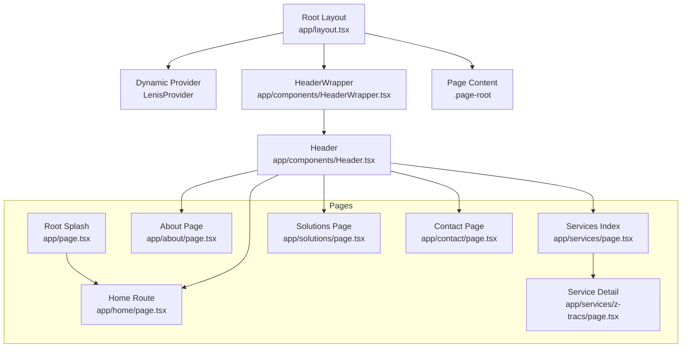
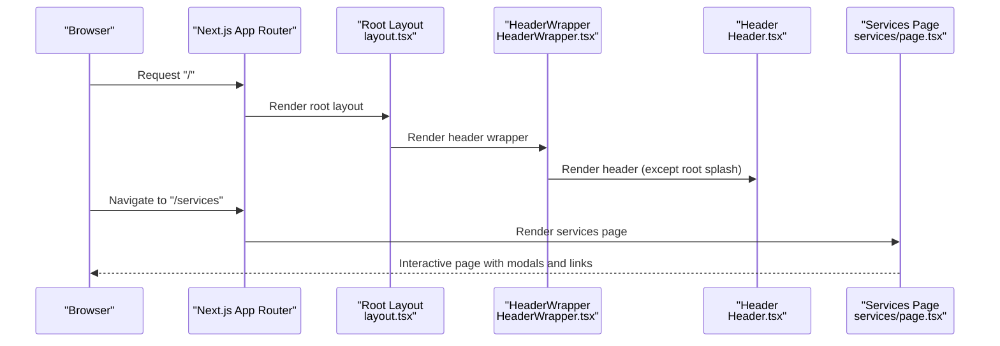
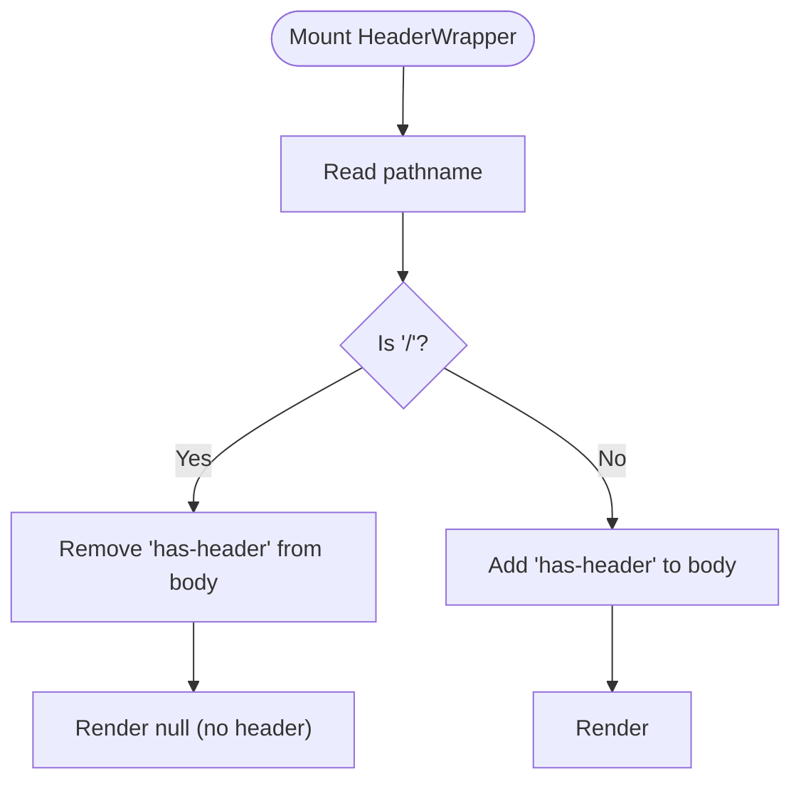
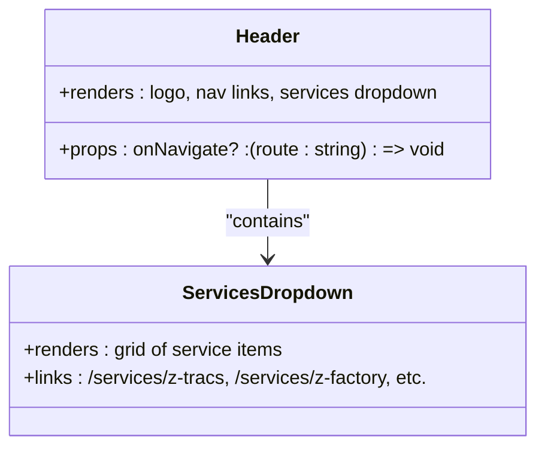
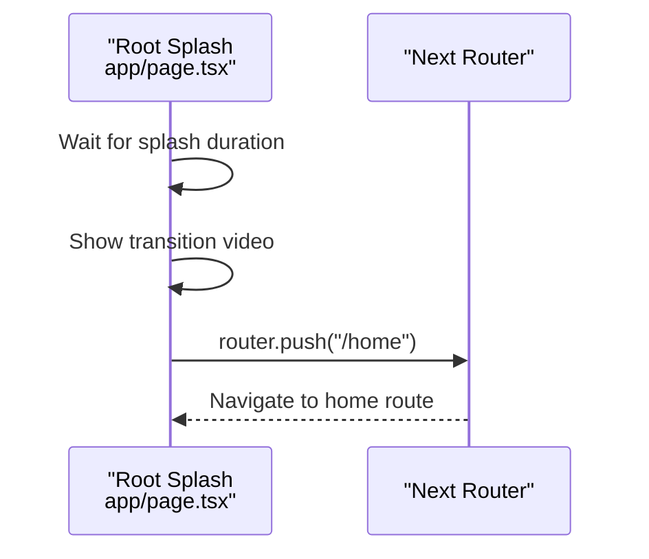
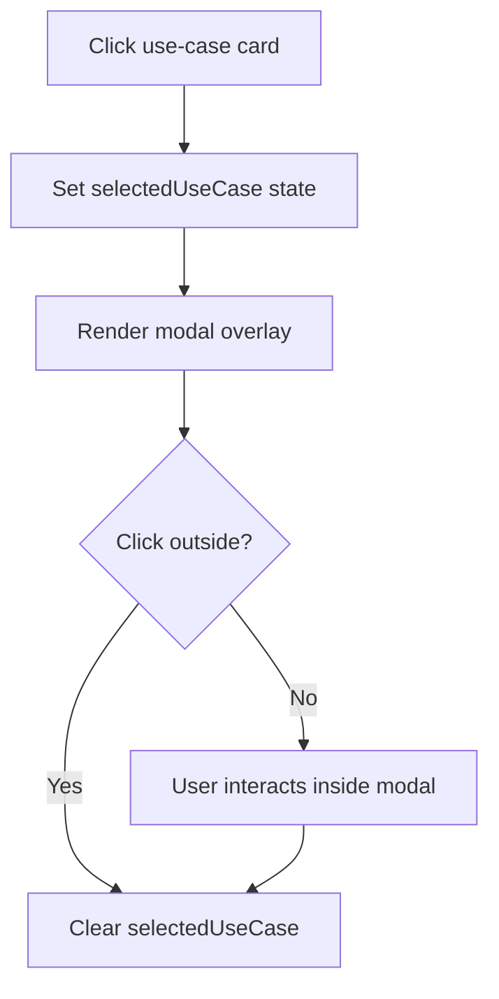
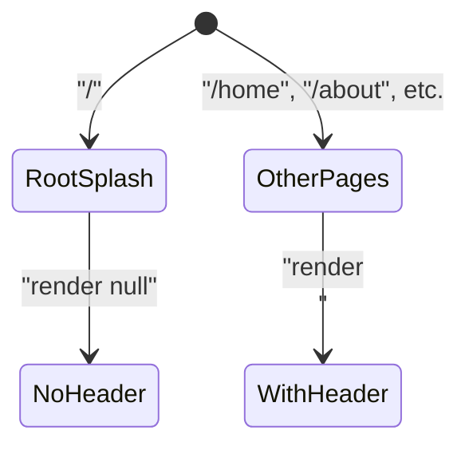
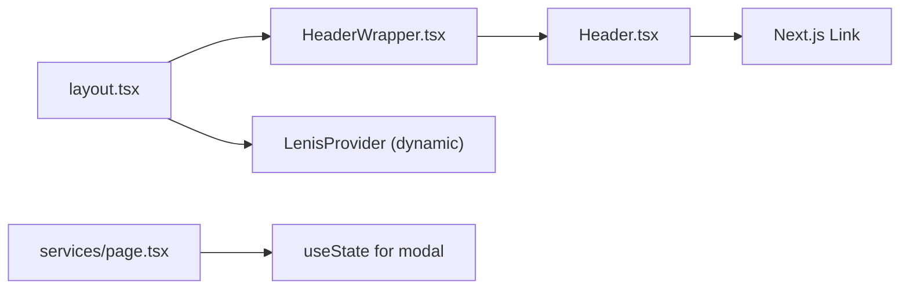

# Navigation & Routing System

<cite>
**Referenced Files in This Document**
- [layout.tsx](file://app/layout.tsx)
- [HeaderWrapper.tsx](file://app/components/HeaderWrapper.tsx)
- [Header.tsx](file://app/components/Header.tsx)
- [page.tsx](file://app/page.tsx)
- [home/page.tsx](file://app/home/page.tsx)
- [services/page.tsx](file://app/services/page.tsx)
- [services/z-tracs/page.tsx](file://app/services/z-tracs/page.tsx)
- [about/page.tsx](file://app/about/page.tsx)
- [contact/page.tsx](file://app/contact/page.tsx)
- [solutions/page.tsx](file://app/solutions/page.tsx)
- [globals.css](file://app/globals.css)
- [services/services.css](file://app/services/services.css)
- [about/about.css](file://app/about/about.css)
- [solutions/solutions.css](file://app/solutions/solutions.css)
</cite>

## Table of Contents
1. [Introduction](#introduction)
2. [Project Structure](#project-structure)
3. [Core Components](#core-components)
4. [Architecture Overview](#architecture-overview)
5. [Detailed Component Analysis](#detailed-component-analysis)
6. [Dependency Analysis](#dependency-analysis)
7. [Performance Considerations](#performance-considerations)
8. [Troubleshooting Guide](#troubleshooting-guide)
9. [Conclusion](#conclusion)
10. [Appendices](#appendices)

## Introduction
This document explains the navigation and routing system of the Zeex AI website built with Next.js App Router. It covers how server-side rendering is achieved while preserving client-side interactivity, how the HeaderWrapper component manages navigation state consistently across pages, and how the site’s pages are organized under dedicated routes. It also documents dynamic header behavior, service-specific routing patterns, modal integration with routing, and SEO considerations for metadata management.

## Project Structure
The site follows Next.js file-convention routing under the app directory. Key routes include:
- Root splash page at the root path
- Dedicated pages for home, about, services, solutions, and contact
- Nested service subpages under services (e.g., z-tracs)

The root layout composes shared UI elements: a dynamic provider for scroll enhancements and the HeaderWrapper, which conditionally renders the main navigation.

**Diagram sources**
- [layout.tsx:13-23](file://app/layout.tsx#L13-L23)
- [HeaderWrapper.tsx:7-24](file://app/components/HeaderWrapper.tsx#L7-L24)
- [Header.tsx:10-82](file://app/components/Header.tsx#L10-L82)
- [page.tsx:9-54](file://app/page.tsx#L9-L54)
- [home/page.tsx:7-13](file://app/home/page.tsx#L7-L13)
- [services/page.tsx:7-377](file://app/services/page.tsx#L7-L377)
- [services/z-tracs/page.tsx:6-23](file://app/services/z-tracs/page.tsx#L6-L23)
- [about/page.tsx:10-297](file://app/about/page.tsx#L10-L297)
- [contact/page.tsx:7-216](file://app/contact/page.tsx#L7-L216)
- [solutions/page.tsx:7-493](file://app/solutions/page.tsx#L7-L493)

**Section sources**
- [layout.tsx:1-24](file://app/layout.tsx#L1-L24)
- [HeaderWrapper.tsx:1-25](file://app/components/HeaderWrapper.tsx#L1-L25)
- [Header.tsx:1-83](file://app/components/Header.tsx#L1-L83)
- [page.tsx:1-55](file://app/page.tsx#L1-L55)
- [home/page.tsx:1-15](file://app/home/page.tsx#L1-L15)
- [services/page.tsx:1-379](file://app/services/page.tsx#L1-L379)
- [services/z-tracs/page.tsx:1-24](file://app/services/z-tracs/page.tsx#L1-L24)
- [about/page.tsx:1-298](file://app/about/page.tsx#L1-L298)
- [contact/page.tsx:1-217](file://app/contact/page.tsx#L1-L217)
- [solutions/page.tsx:1-494](file://app/solutions/page.tsx#L1-L494)

## Core Components
- Root layout defines global metadata and composes shared providers and the header wrapper.
- HeaderWrapper reads the current path and conditionally hides or shows the navigation bar, toggling a body class to adjust page layout.
- Header provides the primary navigation links and a services dropdown with nested service routes.
- Root splash page orchestrates initial animations and transitions to the home route.
- Page components implement route-specific content and interactions.

Key responsibilities:
- Server-side rendering: Root layout and metadata are defined server-side.
- Client-side interactivity: Dynamic provider and client components enable scroll enhancements and interactive UI.
- Navigation consistency: HeaderWrapper ensures the header appears on all pages except the root splash.

**Section sources**
- [layout.tsx:8-23](file://app/layout.tsx#L8-L23)
- [HeaderWrapper.tsx:7-24](file://app/components/HeaderWrapper.tsx#L7-L24)
- [Header.tsx:10-82](file://app/components/Header.tsx#L10-L82)
- [page.tsx:9-54](file://app/page.tsx#L9-L54)

## Architecture Overview
The routing architecture leverages Next.js App Router conventions:
- app/page.tsx is the root splash page.
- app/home/page.tsx is the main landing page.
- app/about, app/services, app/solutions, and app/contact define dedicated routes.
- app/services/z-tracs demonstrates nested service-specific routing.

**Diagram sources**
- [layout.tsx:13-23](file://app/layout.tsx#L13-L23)
- [HeaderWrapper.tsx:7-24](file://app/components/HeaderWrapper.tsx#L7-L24)
- [Header.tsx:10-82](file://app/components/Header.tsx#L10-L82)
- [services/page.tsx:7-377](file://app/services/page.tsx#L7-L377)

## Detailed Component Analysis

### HeaderWrapper Component
Purpose:
- Reads the current path and conditionally renders the Header.
- Adds/removes a body class to control layout when the splash page is active.

Behavior:
- On root path "/", the header is hidden and the body class is removed.
- On other paths, the header is shown and the body class is added to adjust spacing.

**Diagram sources**
- [HeaderWrapper.tsx:7-24](file://app/components/HeaderWrapper.tsx#L7-L24)
- [globals.css:33-36](file://app/globals.css#L33-L36)

**Section sources**
- [HeaderWrapper.tsx:1-25](file://app/components/HeaderWrapper.tsx#L1-L25)
- [globals.css:33-36](file://app/globals.css#L33-L36)

### Header Component
Purpose:
- Provides the main navigation bar with links to home, about, solutions, achievements, blogs, contact, and careers.
- Includes a services dropdown with links to service-specific pages.

Routing integration:
- Uses Next.js Link components for client-side navigation.
- The dropdown exposes nested routes under services (e.g., z-tracs).

**Diagram sources**
- [Header.tsx:10-82](file://app/components/Header.tsx#L10-L82)

**Section sources**
- [Header.tsx:1-83](file://app/components/Header.tsx#L1-L83)

### Root Splash and Transition Flow
Purpose:
- Displays an animated splash and transition before navigating to the home route.

Flow:
- After a delay, triggers a transition video and navigates to "/home".

**Diagram sources**
- [page.tsx:9-54](file://app/page.tsx#L9-L54)
- [home/page.tsx:7-13](file://app/home/page.tsx#L7-L13)

**Section sources**
- [page.tsx:1-55](file://app/page.tsx#L1-L55)
- [home/page.tsx:1-15](file://app/home/page.tsx#L1-L15)

### Services Page Organization and Modal System
Purpose:
- Presents an overview of AI security services and deep-dives per service category.
- Implements a modal triggered by clicking use-case cards to show detailed content.

Routing patterns:
- The services index page is at /services.
- Individual service pages live under /services/<slug> (e.g., z-tracs).

Modal integration:
- State is managed locally within the services page.
- Clicking a use-case card sets selectedUseCase, rendering a modal overlay.
- Clicking outside the modal or the close button dismisses it.

**Diagram sources**
- [services/page.tsx:7-377](file://app/services/page.tsx#L7-L377)

**Section sources**
- [services/page.tsx:1-379](file://app/services/page.tsx#L1-L379)
- [services/z-tracs/page.tsx:1-24](file://app/services/z-tracs/page.tsx#L1-L24)

### Page Organization Strategy
- Home: app/home/page.tsx
- About: app/about/page.tsx
- Services: app/services/page.tsx (with nested service pages)
- Solutions: app/solutions/page.tsx
- Contact: app/contact/page.tsx
- Additional sections: achievements, blogs, careers

Consistency:
- Shared header via HeaderWrapper ensures uniform navigation across pages.
- Footer content is repeated in several pages to maintain branding and quick links.

**Section sources**
- [home/page.tsx:1-15](file://app/home/page.tsx#L1-L15)
- [about/page.tsx:1-298](file://app/about/page.tsx#L1-L298)
- [services/page.tsx:1-379](file://app/services/page.tsx#L1-L379)
- [solutions/page.tsx:1-494](file://app/solutions/page.tsx#L1-L494)
- [contact/page.tsx:1-217](file://app/contact/page.tsx#L1-L217)

### Dynamic Header Management
- HeaderWrapper dynamically decides whether to render the header based on the current path.
- Body class adjustments ensure page content respects the presence or absence of the header.

**Diagram sources**
- [HeaderWrapper.tsx:7-24](file://app/components/HeaderWrapper.tsx#L7-L24)
- [globals.css:33-36](file://app/globals.css#L33-L36)

**Section sources**
- [HeaderWrapper.tsx:1-25](file://app/components/HeaderWrapper.tsx#L1-L25)
- [globals.css:33-36](file://app/globals.css#L33-L36)

### Adding New Pages and Maintaining Navigation Consistency
Steps:
1. Create a new page under app/<section>/page.tsx.
2. Add a link in Header.tsx to the new route.
3. Verify HeaderWrapper behavior (no header on splash; header on all other pages).
4. Ensure consistent footer and branding across pages.

Example reference:
- New section “careers” exists under app/careers; add a link in Header.tsx to complete navigation coverage.

**Section sources**
- [Header.tsx:18-78](file://app/components/Header.tsx#L18-L78)

### SEO Considerations and Metadata Management
- Global metadata is defined in the root layout using Next.js Metadata.
- Each page can define its own metadata (e.g., title, description) for SEO differentiation.
- For nested service pages, consider setting page-specific metadata to reflect canonical URLs and unique descriptions.

Recommendations:
- Use page-level metadata exports to override defaults for services and other dedicated pages.
- Implement structured data for key pages (e.g., services, solutions) to improve search visibility.

**Section sources**
- [layout.tsx:8-11](file://app/layout.tsx#L8-L11)

## Dependency Analysis
High-level dependencies:
- Root layout depends on HeaderWrapper and a dynamic provider.
- HeaderWrapper depends on usePathname from Next.js navigation.
- Header depends on Link from Next.js for client navigation.
- Services page depends on local state for modal management.

**Diagram sources**
- [layout.tsx:13-23](file://app/layout.tsx#L13-L23)
- [HeaderWrapper.tsx:7-24](file://app/components/HeaderWrapper.tsx#L7-L24)
- [Header.tsx:10-82](file://app/components/Header.tsx#L10-L82)
- [services/page.tsx:7-377](file://app/services/page.tsx#L7-L377)

**Section sources**
- [layout.tsx:1-24](file://app/layout.tsx#L1-L24)
- [HeaderWrapper.tsx:1-25](file://app/components/HeaderWrapper.tsx#L1-L25)
- [Header.tsx:1-83](file://app/components/Header.tsx#L1-L83)
- [services/page.tsx:1-379](file://app/services/page.tsx#L1-L379)

## Performance Considerations
- Client-side hydration: HeaderWrapper and dynamic provider are client components, minimizing server payload.
- Conditional header rendering avoids unnecessary DOM on the splash page.
- Modal state is scoped to the services page, reducing cross-page overhead.
- CSS animations and parallax effects are applied selectively to avoid heavy computations on low-end devices.

## Troubleshooting Guide
Common issues and resolutions:
- Header not appearing on specific pages:
  - Verify HeaderWrapper is rendered and pathname is not "/".
  - Confirm body class "has-header" is applied when expected.
- Navigation links not working:
  - Ensure Next.js Link components are used for internal navigation.
  - Confirm route paths match the app directory structure.
- Modal not closing:
  - Check click handlers for outside clicks and close button.
  - Ensure state cleanup removes the modal state.

**Section sources**
- [HeaderWrapper.tsx:7-24](file://app/components/HeaderWrapper.tsx#L7-L24)
- [Header.tsx:10-82](file://app/components/Header.tsx#L10-L82)
- [services/page.tsx:266-323](file://app/services/page.tsx#L266-L323)

## Conclusion
The navigation and routing system leverages Next.js App Router to deliver a responsive, SEO-aware website with a consistent header across pages. The HeaderWrapper component centralizes navigation state, while the services page demonstrates robust client-side interactivity with a modal system. By following the documented patterns, new pages can be added efficiently while maintaining navigation consistency and user experience.

## Appendices

### Routing Patterns Summary
- Root splash: app/page.tsx
- Home: app/home/page.tsx
- About: app/about/page.tsx
- Services: app/services/page.tsx
  - Nested service pages: app/services/z-tracs/page.tsx, etc.
- Solutions: app/solutions/page.tsx
- Contact: app/contact/page.tsx

**Section sources**
- [page.tsx:1-55](file://app/page.tsx#L1-L55)
- [home/page.tsx:1-15](file://app/home/page.tsx#L1-L15)
- [about/page.tsx:1-298](file://app/about/page.tsx#L1-L298)
- [services/page.tsx:1-379](file://app/services/page.tsx#L1-L379)
- [services/z-tracs/page.tsx:1-24](file://app/services/z-tracs/page.tsx#L1-L24)
- [solutions/page.tsx:1-494](file://app/solutions/page.tsx#L1-L494)
- [contact/page.tsx:1-217](file://app/contact/page.tsx#L1-L217)