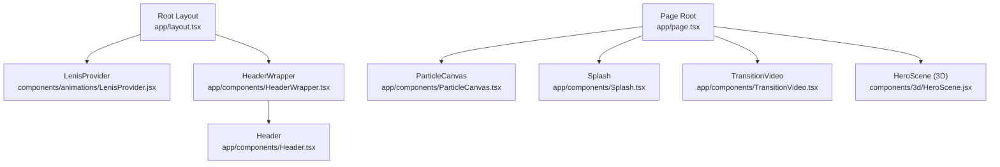
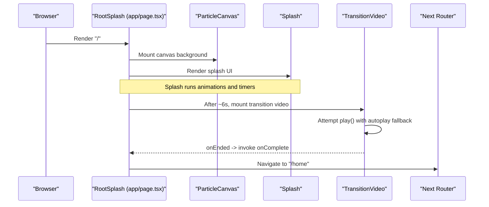
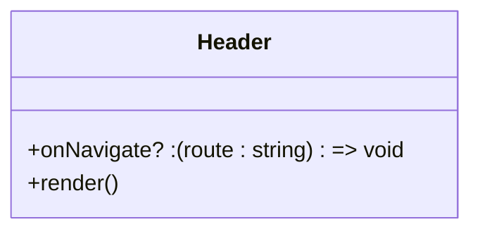
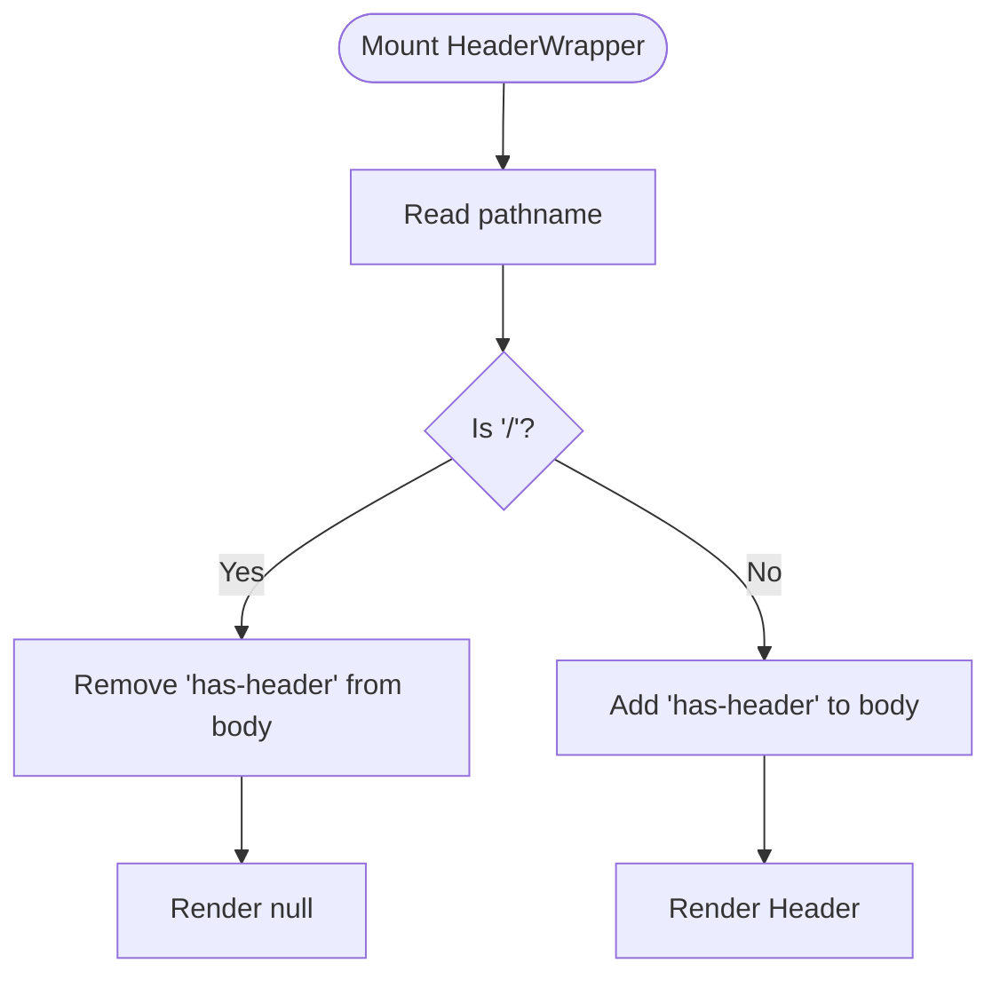
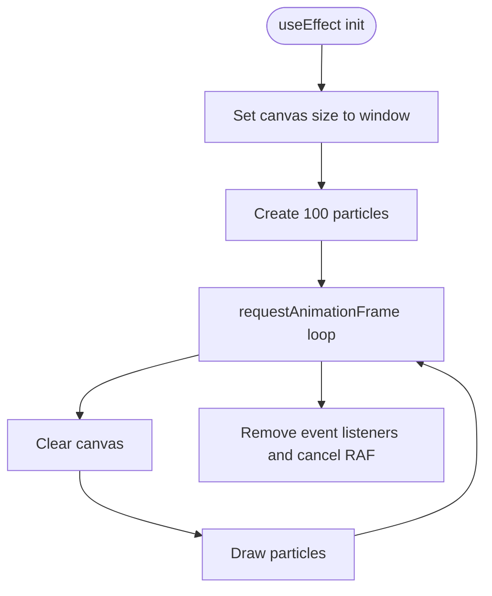
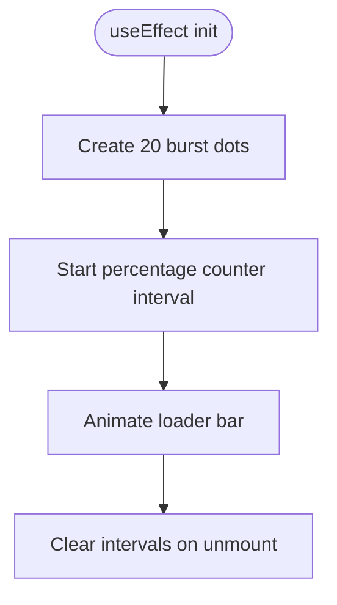
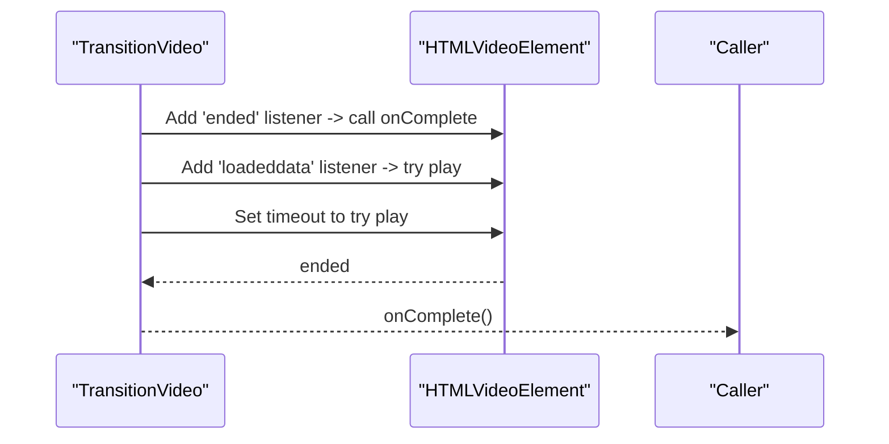
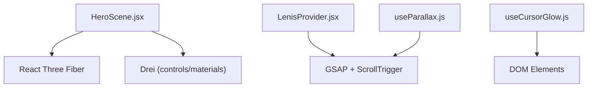
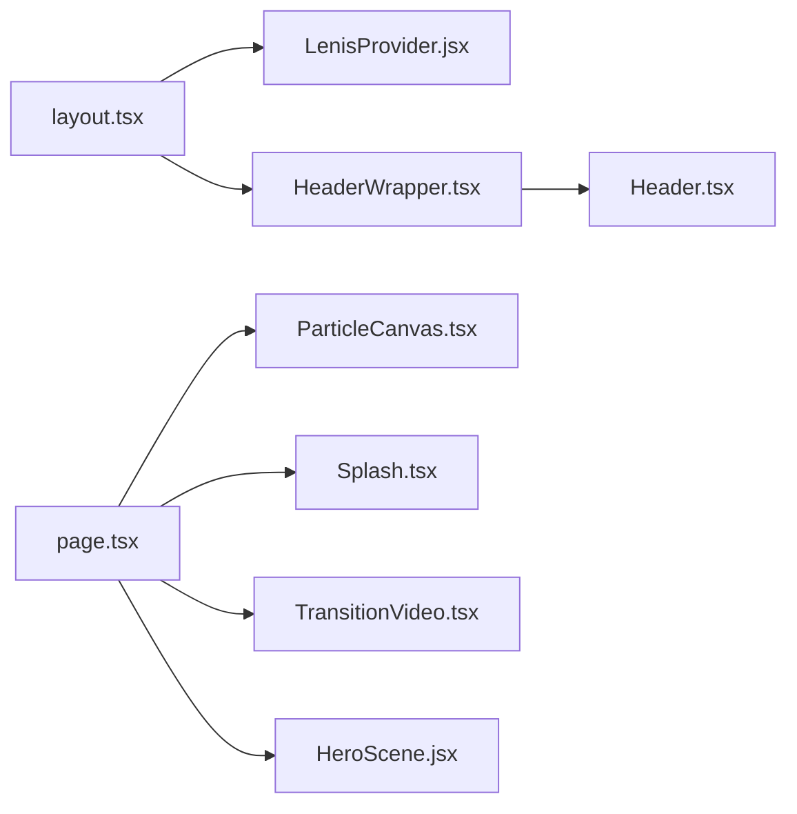

# Component Architecture

<cite>
**Referenced Files in This Document**
- [Header.tsx](file://app/components/Header.tsx)
- [HeaderWrapper.tsx](file://app/components/HeaderWrapper.tsx)
- [ParticleCanvas.tsx](file://app/components/ParticleCanvas.tsx)
- [Splash.tsx](file://app/components/Splash.tsx)
- [TransitionVideo.tsx](file://app/components/TransitionVideo.tsx)
- [layout.tsx](file://app/layout.tsx)
- [page.tsx](file://app/page.tsx)
- [HeroScene.jsx](file://components/3d/HeroScene.jsx)
- [LenisProvider.jsx](file://components/animations/LenisProvider.jsx)
- [useCursorGlow.js](file://components/animations/useCursorGlow.js)
- [useParallax.js](file://components/animations/useParallax.js)
- [home.css](file://app/home/home.css)
- [globals.css](file://app/globals.css)
- [page.tsx (About)](file://app/about/page.tsx)
</cite>

## Table of Contents
1. [Introduction](#introduction)
2. [Project Structure](#project-structure)
3. [Core Components](#core-components)
4. [Architecture Overview](#architecture-overview)
5. [Detailed Component Analysis](#detailed-component-analysis)
6. [Dependency Analysis](#dependency-analysis)
7. [Performance Considerations](#performance-considerations)
8. [Troubleshooting Guide](#troubleshooting-guide)
9. [Conclusion](#conclusion)
10. [Appendices](#appendices)

## Introduction
This document describes the component architecture of the Zeex AI website, focusing on shared components that define the immersive, tech-forward user experience. It covers the Header component for navigation, the ParticleCanvas background effect, the Splash entrance animation, and the TransitionVideo page transition. It explains component composition patterns, prop interfaces, event handling, state management, styling approaches, lifecycle and performance characteristics, accessibility and responsiveness, and integration between React components and 3D/animation systems. Guidance is included for creating and extending components while maintaining reusability and scalability.

## Project Structure
The site is a Next.js application with a layered structure:
- Shared UI components live under app/components and are composed in pages.
- Global styles and hero visuals are defined in app/globals.css and app/home/home.css.
- Animation and 3D helpers live under components/animations and components/3d.
- Layout composes global providers and the Header wrapper.

**Diagram sources**
- [layout.tsx:13-22](file://app/layout.tsx#L13-L22)
- [HeaderWrapper.tsx:7-24](file://app/components/HeaderWrapper.tsx#L7-L24)
- [Header.tsx:10-82](file://app/components/Header.tsx#L10-L82)
- [page.tsx:9-54](file://app/page.tsx#L9-L54)
- [HeroScene.jsx:23-36](file://components/3d/HeroScene.jsx#L23-L36)

**Section sources**
- [layout.tsx:13-22](file://app/layout.tsx#L13-L22)
- [HeaderWrapper.tsx:7-24](file://app/components/HeaderWrapper.tsx#L7-L24)
- [Header.tsx:10-82](file://app/components/Header.tsx#L10-L82)
- [page.tsx:9-54](file://app/page.tsx#L9-L54)
- [HeroScene.jsx:23-36](file://components/3d/HeroScene.jsx#L23-L36)

## Core Components
This section documents the shared components that form the backbone of the experience.

- Header
  - Purpose: Navigation bar with brand identity and dropdown services menu.
  - Props: onNavigate callback invoked on “Get Demo” click.
  - Behavior: Renders links and a dropdown menu; integrates with routing via Next.js Link.
  - Accessibility: Uses semantic anchor elements; consider adding role and aria attributes for dropdowns.
  - Styling: Uses scoped class names and relies on global CSS for layout and typography.

- HeaderWrapper
  - Purpose: Conditionally renders Header based on current route; toggles body class to adjust page layout.
  - Behavior: Hides Header on the root splash route and adds/removes a class to the body for spacing.

- ParticleCanvas
  - Purpose: Animated particle background using HTML Canvas.
  - Lifecycle: Initializes canvas, resizes with window, creates 100 particles, and animates with requestAnimationFrame.
  - Cleanup: Removes resize listener and cancels animation frame on unmount.

- Splash
  - Purpose: Entrance animation with rotating rings, radar sweep, burst dots, and a loader.
  - Lifecycle: Dynamically creates DOM nodes for burst dots and runs a percentage counter.
  - Cleanup: Clears intervals on unmount.

- TransitionVideo
  - Purpose: Fullscreen intro video player with autoplay and completion callback.
  - Props: src (optional), onComplete handler.
  - Lifecycle: Attaches event listeners for ended and loadeddata, attempts play with fallback after interaction, cleans up on unmount.

**Section sources**
- [Header.tsx:6-82](file://app/components/Header.tsx#L6-L82)
- [HeaderWrapper.tsx:7-24](file://app/components/HeaderWrapper.tsx#L7-L24)
- [ParticleCanvas.tsx:5-71](file://app/components/ParticleCanvas.tsx#L5-L71)
- [Splash.tsx:5-74](file://app/components/Splash.tsx#L5-L74)
- [TransitionVideo.tsx:5-53](file://app/components/TransitionVideo.tsx#L5-L53)

## Architecture Overview
The architecture blends React components with CSS animations, a canvas background, and optional 3D scenes. Providers like Lenis integrate scroll-driven motion. The splash sequence orchestrates background effects, entrance animation, and a transition video before routing to the home page.

**Diagram sources**
- [page.tsx:9-54](file://app/page.tsx#L9-L54)
- [TransitionVideo.tsx:10-37](file://app/components/TransitionVideo.tsx#L10-L37)
- [ParticleCanvas.tsx:5-71](file://app/components/ParticleCanvas.tsx#L5-L71)
- [Splash.tsx:5-74](file://app/components/Splash.tsx#L5-L74)

## Detailed Component Analysis

### Header Component
- Composition: Stateless functional component rendering a logo area, navigation links, and a services dropdown with multiple items.
- Props: onNavigate?: (route: string) => void.
- Events: Click on “Get Demo” triggers onNavigate with a route string.
- Styling: Uses class names aligned with global CSS for layout and typography.
- Accessibility: Consider adding aria-haspopup, aria-expanded, and keyboard navigation for the dropdown.

**Diagram sources**
- [Header.tsx:6-82](file://app/components/Header.tsx#L6-L82)

**Section sources**
- [Header.tsx:6-82](file://app/components/Header.tsx#L6-L82)

### HeaderWrapper Component
- Composition: Thin wrapper that decides whether to render Header based on pathname.
- State: None; uses side effects to toggle a body class for layout adjustments.
- Integration: Consumes Next.js usePathname and updates document.body accordingly.

**Diagram sources**
- [HeaderWrapper.tsx:7-24](file://app/components/HeaderWrapper.tsx#L7-L24)

**Section sources**
- [HeaderWrapper.tsx:7-24](file://app/components/HeaderWrapper.tsx#L7-L24)

### ParticleCanvas Component
- Composition: Canvas-based particle system with resize handling and RAF loop.
- Props: None.
- State: Internal array of particle objects; managed via useEffect.
- Lifecycle: Initializes canvas, sets transparent background, creates 100 particles, animates, and cleans up on unmount.
- Performance: Uses requestAnimationFrame; clears canvas each frame; ensures transparent background to avoid artifacts.

**Diagram sources**
- [ParticleCanvas.tsx:5-71](file://app/components/ParticleCanvas.tsx#L5-L71)

**Section sources**
- [ParticleCanvas.tsx:5-71](file://app/components/ParticleCanvas.tsx#L5-L71)

### Splash Component
- Composition: Entrypoint animation with rotating rings, radar sweep, corner brackets, animated logo, status tags, and a loader bar with percentage counter.
- Props: None.
- Lifecycle: Creates DOM nodes for burst dots and starts a timer to increment a percentage indicator.
- Cleanup: Clears intervals on unmount.

**Diagram sources**
- [Splash.tsx:5-74](file://app/components/Splash.tsx#L5-L74)

**Section sources**
- [Splash.tsx:5-74](file://app/components/Splash.tsx#L5-L74)

### TransitionVideo Component
- Composition: Fullscreen video player with playsInline, muted, and autoPlay.
- Props: src?: string; onComplete: () => void.
- Lifecycle: Adds event listeners for ended and loadeddata, attempts play with timeout, and cleans up on unmount.
- Autoplay: Includes a fallback to resume play after user interaction if autoplay is blocked.

**Diagram sources**
- [TransitionVideo.tsx:10-37](file://app/components/TransitionVideo.tsx#L10-L37)

**Section sources**
- [TransitionVideo.tsx:5-53](file://app/components/TransitionVideo.tsx#L5-L53)

### Integration with 3D and Animations
- HeroScene (3D): A lightweight floating sphere scene using @react-three/fiber and @react-three/drei, rendered inside a container with a blend mode for a cohesive hero look.
- LenisProvider: Dynamically loads Lenis and GSAP, registers ScrollTrigger, and synchronizes rAF with scroll updates.
- Cursor Glow Hook: Optional lightweight cursor glow element attached to mousemove events on desktop; cleaned up on unmount.
- Parallax Helper: Utility to apply GSAP-based parallax to elements using ScrollTrigger.

**Diagram sources**
- [HeroScene.jsx:23-36](file://components/3d/HeroScene.jsx#L23-L36)
- [LenisProvider.jsx:5-52](file://components/animations/LenisProvider.jsx#L5-L52)
- [useCursorGlow.js:1-26](file://components/animations/useCursorGlow.js#L1-L26)
- [useParallax.js:1-31](file://components/animations/useParallax.js#L1-L31)

**Section sources**
- [HeroScene.jsx:23-36](file://components/3d/HeroScene.jsx#L23-L36)
- [LenisProvider.jsx:5-52](file://components/animations/LenisProvider.jsx#L5-L52)
- [useCursorGlow.js:1-26](file://components/animations/useCursorGlow.js#L1-L26)
- [useParallax.js:1-31](file://components/animations/useParallax.js#L1-L31)

## Dependency Analysis
- Layout composes providers and wrappers:
  - RootLayout imports LenisProvider dynamically and renders HeaderWrapper.
  - HeaderWrapper conditionally renders Header based on pathname.
- Page orchestration:
  - RootSplash mounts ParticleCanvas, grid and scan overlays, HUD corners, floating labels, Splash, and TransitionVideo.
  - TransitionVideo invokes onComplete to navigate to /home.

**Diagram sources**
- [layout.tsx:13-22](file://app/layout.tsx#L13-L22)
- [HeaderWrapper.tsx:7-24](file://app/components/HeaderWrapper.tsx#L7-L24)
- [Header.tsx:10-82](file://app/components/Header.tsx#L10-L82)
- [page.tsx:9-54](file://app/page.tsx#L9-L54)
- [HeroScene.jsx:23-36](file://components/3d/HeroScene.jsx#L23-L36)

**Section sources**
- [layout.tsx:13-22](file://app/layout.tsx#L13-L22)
- [HeaderWrapper.tsx:7-24](file://app/components/HeaderWrapper.tsx#L7-L24)
- [Header.tsx:10-82](file://app/components/Header.tsx#L10-L82)
- [page.tsx:9-54](file://app/page.tsx#L9-L54)
- [HeroScene.jsx:23-36](file://components/3d/HeroScene.jsx#L23-L36)

## Performance Considerations
- Canvas animation
  - Use requestAnimationFrame for smooth 60fps updates.
  - Clear the canvas each frame and draw only necessary elements.
  - Ensure transparent background to prevent residual artifacts.
  - Clean up RAF and event listeners on unmount.
- Video playback
  - Use muted and playsInline for mobile autoplay.
  - Attempt play on load and after user interaction to handle autoplay policies.
  - Clean up event listeners and timeouts.
- Scroll-driven motion
  - LenisProvider integrates GSAP ScrollTrigger; register plugins once and cancel rAF on unmount.
  - Prefer passive event listeners for scroll and pointer events.
- DOM manipulation
  - Avoid frequent DOM queries; cache selectors when possible.
  - Use requestAnimationFrame for smooth transforms and cursor effects.
- Memory management
  - Always detach event listeners and cancel animation frames.
  - Remove dynamically created elements (e.g., cursor glow) on cleanup.

[No sources needed since this section provides general guidance]

## Troubleshooting Guide
- Header not rendering on splash
  - Verify HeaderWrapper pathname logic and body class toggling.
  - Confirm that the root route is "/" and that the wrapper does not render Header on splash.
- ParticleCanvas not animating
  - Ensure canvas exists and getContext('2d') returns a context.
  - Check that resize fires on window resize and that RAF loop is active.
- Splash loader not completing
  - Confirm intervals are cleared on unmount.
  - Verify that percentage increments reach 100 and stop.
- TransitionVideo not playing
  - Check autoplay policy; ensure user interaction resumes playback.
  - Verify event listeners are attached and cleaned up properly.
- 3D scene not visible
  - Confirm Canvas and Suspense boundaries are present.
  - Ensure container has explicit dimensions and blend modes are applied.

**Section sources**
- [HeaderWrapper.tsx:7-24](file://app/components/HeaderWrapper.tsx#L7-L24)
- [ParticleCanvas.tsx:5-71](file://app/components/ParticleCanvas.tsx#L5-L71)
- [Splash.tsx:5-74](file://app/components/Splash.tsx#L5-L74)
- [TransitionVideo.tsx:10-37](file://app/components/TransitionVideo.tsx#L10-L37)
- [HeroScene.jsx:23-36](file://components/3d/HeroScene.jsx#L23-L36)

## Conclusion
The Zeex AI website’s component architecture combines React UI components with CSS-driven animations, a canvas background, and optional 3D scenes. The splash sequence coordinates background effects, entrance animations, and a transition video to deliver a cohesive first impression. Providers like Lenis integrate scroll-driven motion, while helpers offer optional cursor glow and parallax effects. By adhering to lifecycle cleanup, passive event handling, and careful resource management, the system remains performant and maintainable.

[No sources needed since this section summarizes without analyzing specific files]

## Appendices

### Styling Approach and Visual Consistency
- CSS Modules and global styles
  - Global variables and base styles are defined in app/globals.css.
  - Hero and splash-specific styles live in app/home/home.css and app/globals.css.
  - Components rely on class names to maintain visual consistency across pages.
- Blend modes and overlays
  - Hero scenes use mix-blend-mode for a cohesive look with backgrounds.
  - Scan lines, grid overlays, and HUD elements are implemented with pure CSS animations.
- Responsive patterns
  - CSS clamp and viewport units are used for scalable typography and sizes.
  - Media queries and container queries (where applicable) ensure readability and legibility across devices.

**Section sources**
- [globals.css:1-800](file://app/globals.css#L1-L800)
- [home.css:1-800](file://app/home/home.css#L1-L800)

### Accessibility and Cross-Browser Compatibility
- Accessibility
  - Use semantic HTML and ARIA roles where appropriate (e.g., dropdown menus).
  - Ensure focus management and keyboard navigation for interactive elements.
  - Provide sufficient color contrast and alternative text for images.
- Cross-browser compatibility
  - Use vendor-prefixed properties sparingly; rely on CSS animations and transforms widely supported.
  - Test video autoplay policies across browsers and devices; implement fallbacks.
  - Validate canvas APIs and WebGL support where applicable.

[No sources needed since this section provides general guidance]

### Creating and Extending Components
- Best practices
  - Keep components stateless when possible; encapsulate side effects in hooks.
  - Use TypeScript props interfaces to enforce contracts.
  - Export reusable hooks for animations and interactions.
  - Maintain a single responsibility per component and compose via smaller pieces.
- Reusability
  - Pass configuration via props (e.g., TransitionVideo src and onComplete).
  - Encapsulate lifecycle cleanup in useEffect return functions.
  - Prefer declarative styles and CSS variables for theme consistency.

[No sources needed since this section provides general guidance]