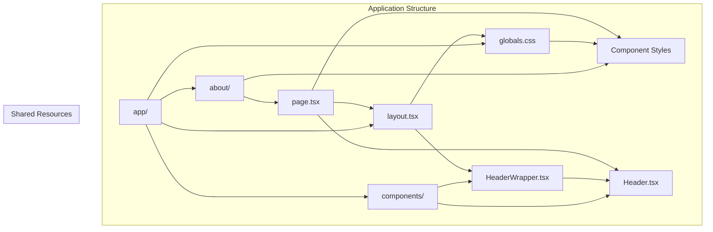
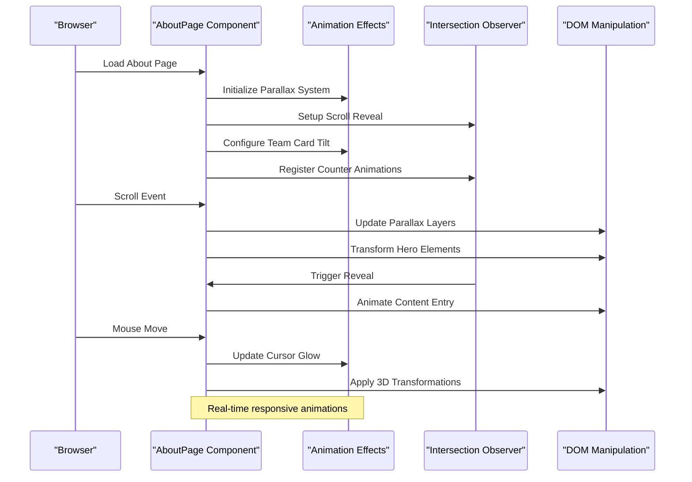
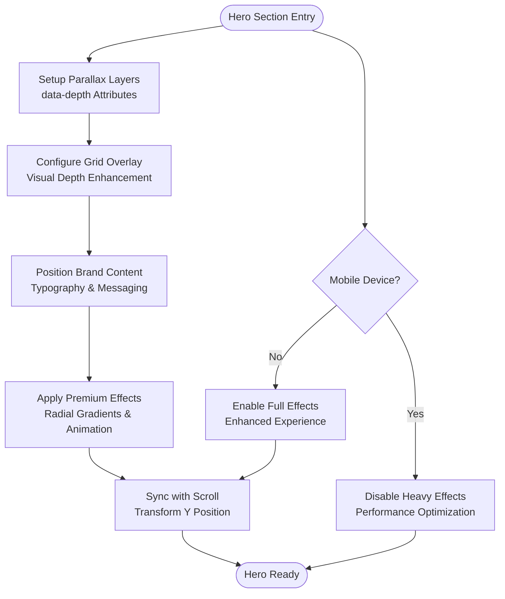
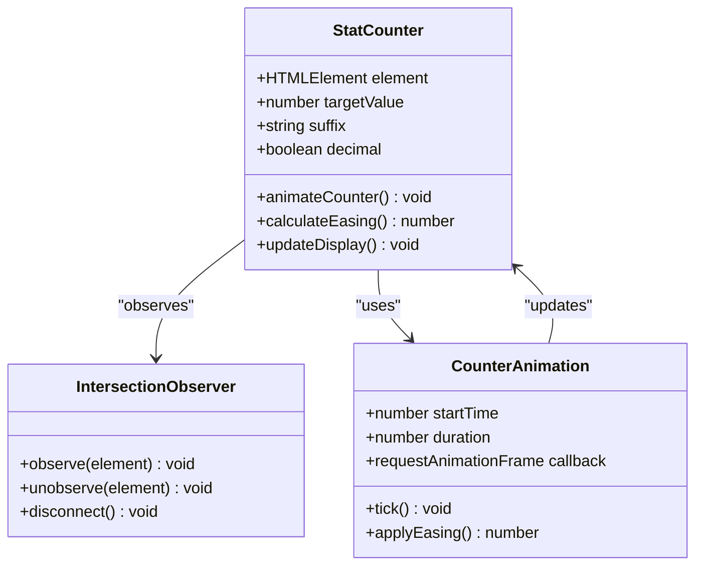
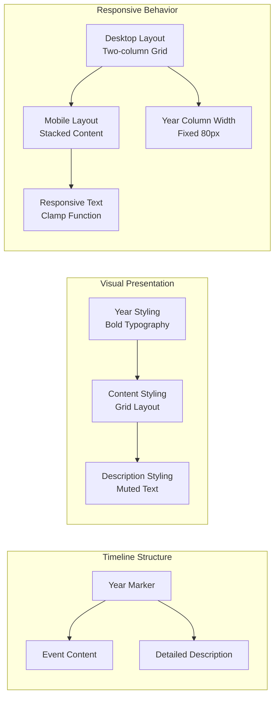
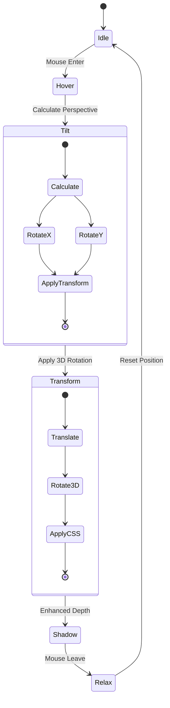
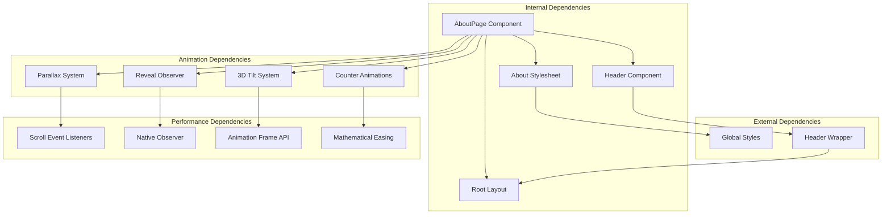

# About Page Component

<cite>
**Referenced Files in This Document**
- [page.tsx](file://app/about/page.tsx)
- [about.css](file://app/about/about.css)
- [layout.tsx](file://app/layout.tsx)
- [Header.tsx](file://app/components/Header.tsx)
- [HeaderWrapper.tsx](file://app/components/HeaderWrapper.tsx)
- [globals.css](file://app/globals.css)
- [home.css](file://app/home/home.css)
</cite>

## Table of Contents
1. [Introduction](#introduction)
2. [Project Structure](#project-structure)
3. [Core Components](#core-components)
4. [Architecture Overview](#architecture-overview)
5. [Detailed Component Analysis](#detailed-component-analysis)
6. [Dependency Analysis](#dependency-analysis)
7. [Performance Considerations](#performance-considerations)
8. [Accessibility and SEO](#accessibility-and-seo)
9. [Content Management Strategies](#content-management-strategies)
10. [Styling and Visual Design](#styling-and-visual-design)
11. [Responsive Design Implementation](#responsive-design-implementation)
12. [Integration with Shared Components](#integration-with-shared-components)
13. [Troubleshooting Guide](#troubleshooting-guide)
14. [Best Practices and Guidelines](#best-practices-and-guidelines)
15. [Conclusion](#conclusion)

## Introduction

The About Page Component is a comprehensive company storytelling platform designed to present organizational information, leadership showcase, achievements, and brand values in an immersive digital experience. Built with Next.js and modern web technologies, this component serves as the cornerstone of ZeexAI's corporate communication strategy, combining sophisticated animations, responsive design patterns, and content management capabilities.

The component leverages advanced scroll-driven animations, interactive elements, and a cohesive design system that reflects the company's commitment to cutting-edge AI security solutions. It seamlessly integrates with the broader application ecosystem while maintaining its own distinct visual identity and functional requirements.

## Project Structure

The About Page Component follows a modular architecture within the Next.js application structure, positioned strategically to maximize discoverability and maintainability:

**Diagram sources**
- [page.tsx:1-298](file://app/about/page.tsx#L1-L298)
- [about.css:1-193](file://app/about/about.css#L1-L193)
- [layout.tsx:1-24](file://app/layout.tsx#L1-L24)

The component structure demonstrates clear separation of concerns with dedicated files for content presentation, styling, and integration with shared application infrastructure.

**Section sources**
- [page.tsx:1-298](file://app/about/page.tsx#L1-L298)
- [about.css:1-193](file://app/about/about.css#L1-L193)
- [layout.tsx:1-24](file://app/layout.tsx#L1-L24)

## Core Components

The About Page Component consists of several interconnected elements that work together to create a cohesive storytelling experience:

### Primary Content Sections

The component is structured around five primary content sections, each serving a specific purpose in the company narrative:

1. **Hero Section**: Establishes brand presence and core messaging
2. **Statistics Showcase**: Presents quantifiable achievements and milestones
3. **Company Story**: Chronicles organizational journey and development
4. **Team Leadership**: Introduces executive team and key personnel
5. **Call-to-Action**: Guides visitors toward engagement opportunities

### Interactive Elements

The component incorporates sophisticated interactive features including:

- **Parallax Scrolling Effects**: Layered background animations synchronized with scroll position
- **Intersection Observer Animations**: Progressive content reveal during navigation
- **3D Tilt Interactions**: Hover-responsive team member cards with perspective transforms
- **Animated Counters**: Scroll-triggered numerical displays with easing functions
- **Cursor Glow Effects**: Enhanced visual feedback for desktop users

**Section sources**
- [page.tsx:10-298](file://app/about/page.tsx#L10-L298)
- [about.css:1-193](file://app/about/about.css#L1-L193)

## Architecture Overview

The About Page Component implements a sophisticated client-side architecture that balances performance with visual richness:

**Diagram sources**
- [page.tsx:14-155](file://app/about/page.tsx#L14-L155)

The architecture employs a reactive pattern where multiple animation systems coordinate through shared event listeners and state management, ensuring smooth performance across different device capabilities.

**Section sources**
- [page.tsx:14-155](file://app/about/page.tsx#L14-L155)

## Detailed Component Analysis

### Hero Section Implementation

The Hero Section serves as the digital flagship of the About Page, establishing visual hierarchy and brand positioning through layered parallax effects and dynamic typography:

**Diagram sources**
- [page.tsx:157-177](file://app/about/page.tsx#L157-L177)
- [about.css:5-56](file://app/about/about.css#L5-L56)

The Hero Section utilizes CSS custom properties for dynamic parallax calculations, enabling smooth scrolling animations without JavaScript overhead. The design incorporates premium visual effects including radial gradients and animated backgrounds that respond to scroll position.

### Statistics Showcase System

The Statistics Showcase implements an innovative counter animation system that triggers upon content visibility, creating engaging numerical storytelling:

**Diagram sources**
- [page.tsx:83-109](file://app/about/page.tsx#L83-L109)

The counter system employs mathematical easing functions to create natural acceleration curves, enhancing the perceived performance of numerical transitions. Each statistic card maintains independent configuration through data attributes, allowing for flexible content management.

### Timeline Storytelling Component

The Timeline component presents company history and milestones through a structured chronological narrative system:

**Diagram sources**
- [page.tsx:198-217](file://app/about/page.tsx#L198-L217)
- [globals.css:1163-1178](file://app/globals.css#L1163-L1178)

The timeline implementation leverages CSS Grid for responsive layout management, ensuring optimal presentation across different screen sizes while maintaining visual consistency.

### Team Showcase Implementation

The Team Showcase component provides an immersive leadership presentation through interactive 3D transformations and hover effects:

**Diagram sources**
- [page.tsx:39-62](file://app/about/page.tsx#L39-L62)
- [globals.css:1215-1238](file://app/globals.css#L1215-L1238)

The team showcase implements sophisticated 3D mathematics for realistic perspective calculations, with performance optimizations including requestAnimationFrame coordination and cleanup procedures.

**Section sources**
- [page.tsx:157-298](file://app/about/page.tsx#L157-L298)
- [about.css:1-193](file://app/about/about.css#L1-L193)

## Dependency Analysis

The About Page Component maintains strategic dependencies that balance functionality with performance:

**Diagram sources**
- [page.tsx:1-10](file://app/about/page.tsx#L1-L10)
- [layout.tsx:1-24](file://app/layout.tsx#L1-L24)

The dependency graph reveals a well-structured component hierarchy where the About Page serves as the primary orchestrator, coordinating with shared components and global styling systems while maintaining encapsulated functionality.

**Section sources**
- [page.tsx:1-10](file://app/about/page.tsx#L1-L10)
- [layout.tsx:1-24](file://app/layout.tsx#L1-L24)

## Performance Considerations

The About Page Component implements several performance optimization strategies to ensure smooth operation across diverse devices and network conditions:

### Animation Performance

The component employs optimized animation techniques including:

- **Passive Event Listeners**: Scroll and resize events use passive mode for improved responsiveness
- **requestAnimationFrame Coordination**: All animations utilize coordinated frame updates
- **CSS Transform Optimization**: Hardware-accelerated transforms replace layout-affecting properties
- **Intersection Observer Efficiency**: Native browser API for efficient element visibility detection

### Memory Management

Comprehensive cleanup procedures prevent memory leaks:

- **Event Listener Removal**: All dynamically attached listeners are properly detached
- **RAF Cancellation**: Animation frames are cancelled when components unmount
- **Element Cleanup**: Dynamically created elements are removed from the DOM
- **Observer Disconnection**: Intersection observers are disconnected on unmount

### Resource Optimization

Performance-conscious resource management includes:

- **Conditional Feature Loading**: Mobile-optimized variants disable heavy effects
- **Lazy Initialization**: Complex animations initialize only when needed
- **Efficient DOM Queries**: Cached element references minimize DOM traversal
- **Minimal Re-renders**: Optimized state updates reduce unnecessary rendering

**Section sources**
- [page.tsx:64-155](file://app/about/page.tsx#L64-L155)

## Accessibility and SEO

The About Page Component incorporates comprehensive accessibility and search engine optimization strategies:

### Accessibility Features

- **Semantic HTML Structure**: Proper heading hierarchy and sectioning elements
- **Keyboard Navigation**: Focus management and keyboard-accessible interactive elements
- **Screen Reader Support**: ARIA attributes and semantic markup for assistive technologies
- **Color Contrast**: Sufficient contrast ratios meeting WCAG guidelines
- **Alternative Text**: Descriptive alt attributes for all decorative and functional images

### SEO Optimization

- **Structured Content**: Clear content hierarchy with proper heading usage
- **Schema Markup**: Semantic HTML elements supporting structured data interpretation
- **Image Optimization**: Efficient image loading and responsive image variants
- **Meta Information**: Comprehensive meta tags and Open Graph properties
- **Content Freshness**: Regularly updated content sections for search relevance

### Cross-Platform Compatibility

The component ensures consistent experience across platforms:

- **Progressive Enhancement**: Core content remains functional without JavaScript
- **Mobile-First Design**: Responsive breakpoints optimized for mobile devices
- **Cross-Browser Support**: Vendor prefixes and fallbacks for older browsers
- **Touch Interaction**: Optimized touch targets and gesture support

**Section sources**
- [page.tsx:157-298](file://app/about/page.tsx#L157-L298)

## Content Management Strategies

The About Page Component supports flexible content management through several strategic approaches:

### Static Content Organization

Content is organized using semantic HTML and data-driven attributes:

- **Data Attributes**: `data-counter`, `data-depth`, `data-target` for dynamic behavior
- **Semantic Classes**: `.reveal`, `.team-card`, `.about-stat-card` for styling hooks
- **Hierarchical Structure**: Logical content grouping with clear parent-child relationships
- **Modular Sections**: Independent content blocks that can be rearranged or extended

### Dynamic Content Integration

The component supports dynamic content through:

- **JavaScript Configuration**: Runtime content manipulation and animation control
- **Event-Driven Updates**: Real-time content updates without page reloads
- **State Management**: Centralized state for complex interactive elements
- **API Integration**: Seamless integration with external content management systems

### Content Versioning

Strategies for managing content evolution:

- **Backward Compatibility**: New features maintain support for existing content
- **Content Migration**: Procedures for updating legacy content structures
- **Testing Protocols**: Validation systems for content changes
- **Rollback Mechanisms**: Recovery procedures for problematic content updates

**Section sources**
- [page.tsx:1-298](file://app/about/page.tsx#L1-L298)

## Styling and Visual Design

The About Page Component implements a sophisticated styling system that creates a cohesive visual identity while maintaining flexibility for brand evolution:

### Design System Architecture

The styling system follows established design principles:

- **Color Palette**: Navy blues (#061b33, #07182a) with cyan accents (#00e5ff)
- **Typography Hierarchy**: Clear visual hierarchy with clamp-based responsive sizing
- **Spacing System**: Consistent spacing scales supporting content density variations
- **Effect Library**: Predefined visual effects for consistent brand expression

### Animation Framework

A comprehensive animation framework supports the storytelling experience:

- **Parallax System**: Layered background animations synchronized with scroll
- **Reveal Animations**: Staggered content appearance with easing functions
- **Interactive Transitions**: Smooth state changes for user interactions
- **Performance Optimization**: Hardware-accelerated animations with fallbacks

### Visual Effect Implementation

Advanced visual effects enhance the user experience:

- **Radial Gradients**: Animated background effects with color transitions
- **Perspective Transforms**: 3D depth effects for immersive content presentation
- **Blur Effects**: Backdrop filters for modern interface elements
- **Lighting Effects**: Subtle glow and shadow systems for depth perception

**Section sources**
- [about.css:1-193](file://app/about/about.css#L1-L193)
- [globals.css:1-800](file://app/globals.css#L1-L800)

## Responsive Design Implementation

The About Page Component implements a comprehensive responsive design strategy that ensures optimal presentation across all device categories:

### Breakpoint Strategy

Multiple breakpoint tiers provide tailored experiences:

- **Mobile First**: Base styles optimized for smallest screens
- **Tablet Adaptation**: Adjustments for intermediate screen sizes
- **Desktop Enhancement**: Rich features enabled on larger displays
- **Large Screen Optimization**: Extended content areas and enhanced layouts

### Layout Flexibility

Adaptive layout systems accommodate various content scenarios:

- **CSS Grid Systems**: Flexible grid layouts for statistics and team showcases
- **Flexbox Integration**: Responsive alignment and distribution
- **Clamp Functions**: Fluid typography scaling across viewport sizes
- **Aspect Ratio Preservation**: Maintained proportions for visual elements

### Touch and Gesture Optimization

Mobile-specific enhancements improve usability:

- **Touch Target Sizing**: Minimum 44px touch targets for accessibility
- **Gesture Support**: Swipe and pinch interactions for content navigation
- **Orientation Handling**: Adaptive layouts for portrait and landscape modes
- **Performance Considerations**: Reduced animations on mobile devices

**Section sources**
- [about.css:128-193](file://app/about/about.css#L128-L193)
- [globals.css:1163-1213](file://app/globals.css#L1163-L1213)

## Integration with Shared Components

The About Page Component seamlessly integrates with the broader application ecosystem through well-defined interfaces and shared infrastructure:

### Header Integration

The component coordinates with the global header system:

- **Navigation Consistency**: Unified navigation patterns across all pages
- **Brand Recognition**: Consistent logo placement and typography
- **Interactive Elements**: Shared button styles and hover effects
- **Responsive Behavior**: Header adapts to different page contexts

### Layout System Integration

Deep integration with the application layout framework:

- **Root Layout Access**: Shared layout infrastructure for consistent structure
- **Global Styling**: Unified color schemes and typography systems
- **Animation Providers**: Shared animation libraries and performance optimizations
- **State Management**: Coordinated state across multiple page components

### Component Communication

Structured communication patterns enable seamless integration:

- **Event Propagation**: Controlled event handling between components
- **State Synchronization**: Coordinated state updates across the application
- **Lifecycle Management**: Consistent component mounting and unmounting
- **Resource Sharing**: Efficient sharing of computational resources

**Section sources**
- [Header.tsx:1-83](file://app/components/Header.tsx#L1-L83)
- [HeaderWrapper.tsx:1-25](file://app/components/HeaderWrapper.tsx#L1-L25)
- [layout.tsx:1-24](file://app/layout.tsx#L1-L24)

## Troubleshooting Guide

Common issues and their resolution strategies for the About Page Component:

### Performance Issues

**Symptoms**: Slow loading, janky animations, high memory usage

**Diagnosis Steps**:
1. Check for excessive DOM queries in scroll handlers
2. Verify proper cleanup of event listeners and observers
3. Monitor animation frame performance using browser dev tools
4. Validate CSS transform properties for hardware acceleration

**Resolution Strategies**:
- Implement throttled scroll handlers
- Ensure all event listeners are properly removed
- Optimize CSS animations for GPU acceleration
- Use Intersection Observer for efficient element detection

### Animation Problems

**Symptoms**: Stuttering animations, incorrect timing, inconsistent behavior

**Diagnosis Steps**:
1. Verify requestAnimationFrame coordination
2. Check for conflicting CSS transitions
3. Validate animation duration and easing functions
4. Test across different browser engines

**Resolution Strategies**:
- Implement animation frame synchronization
- Remove conflicting CSS transitions
- Standardize animation timing functions
- Test with browser-specific animation polyfills

### Responsive Design Issues

**Symptoms**: Layout breaks, incorrect breakpoints, poor mobile performance

**Diagnosis Steps**:
1. Validate CSS media query breakpoints
2. Check viewport meta tag configuration
3. Test on actual mobile devices
4. Verify touch event handling

**Resolution Strategies**:
- Implement proper viewport configuration
- Test with real mobile devices and emulators
- Optimize touch interactions for mobile
- Validate CSS breakpoint consistency

**Section sources**
- [page.tsx:64-155](file://app/about/page.tsx#L64-L155)

## Best Practices and Guidelines

### Content Update Procedures

Recommended practices for maintaining and updating the About Page:

- **Content Version Control**: Maintain version history for all content changes
- **Preview Systems**: Implement preview mechanisms for content updates
- **Testing Protocols**: Validate changes across different devices and browsers
- **Rollback Procedures**: Maintain backup systems for content restoration

### Code Maintenance Standards

Guidelines for keeping the component maintainable and scalable:

- **Component Modularity**: Keep individual components focused and reusable
- **Documentation Standards**: Maintain comprehensive inline documentation
- **Testing Coverage**: Implement automated testing for critical functionality
- **Performance Monitoring**: Regular performance audits and optimization

### Brand Consistency

Practices for maintaining brand alignment:

- **Design System Adherence**: Strict adherence to established design guidelines
- **Color and Typography Standards**: Consistent application of brand elements
- **Animation Style Guide**: Unified animation patterns and timing
- **Content Voice Guidelines**: Consistent messaging and tone across all sections

### Future-Proofing

Strategies for ensuring long-term maintainability:

- **Technology Agnostic Design**: Minimize dependency on specific frameworks
- **Progressive Enhancement**: Build core functionality before adding enhancements
- **Accessibility First**: Prioritize accessibility in all design decisions
- **Performance Budgeting**: Establish and maintain performance budgets

**Section sources**
- [page.tsx:1-298](file://app/about/page.tsx#L1-L298)

## Conclusion

The About Page Component represents a sophisticated implementation of modern web development principles, combining compelling storytelling with technical excellence. Through its innovative use of scroll-driven animations, interactive elements, and responsive design, it creates an immersive experience that effectively communicates ZeexAI's value proposition and organizational strength.

The component's architecture demonstrates best practices in performance optimization, accessibility compliance, and cross-platform compatibility, while its content management strategies ensure flexibility for ongoing brand evolution. The integration with shared components and global styling systems establishes a foundation for consistent user experience across the entire application ecosystem.

As digital storytelling continues to evolve, this component provides a robust foundation for future enhancements while maintaining the technical standards necessary for production-scale applications. Its comprehensive approach to performance, accessibility, and user experience positions it as a model example for corporate website development in the modern web landscape.

The About Page Component successfully balances artistic vision with technical precision, creating a digital ambassador for ZeexAI that effectively serves both informational and inspirational purposes in the company's digital presence.