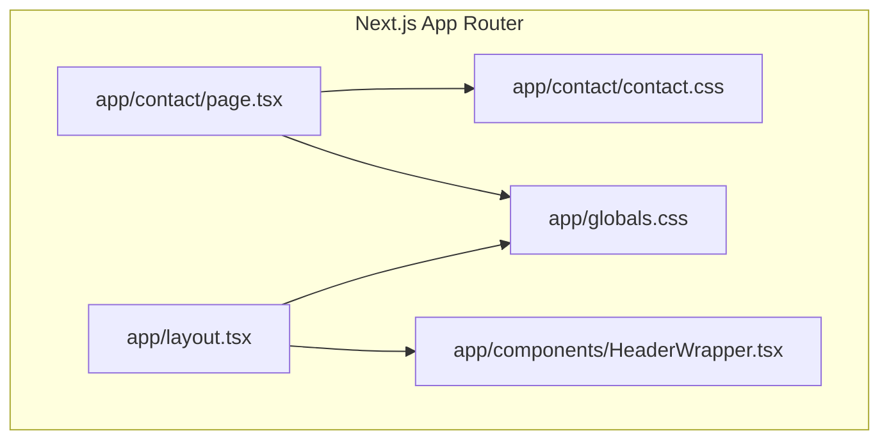
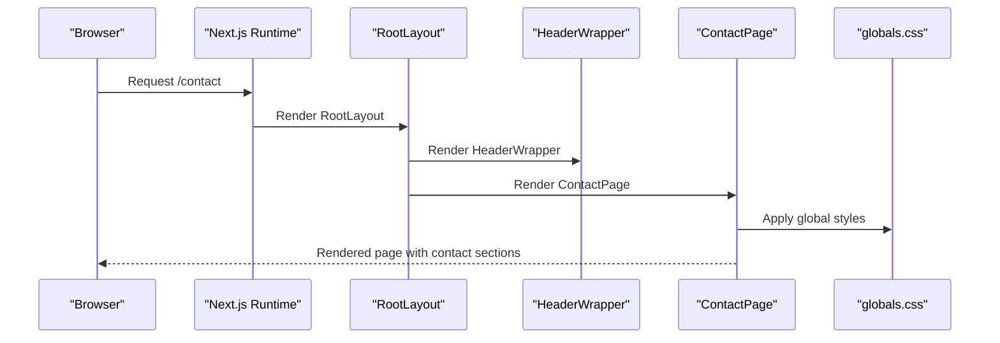
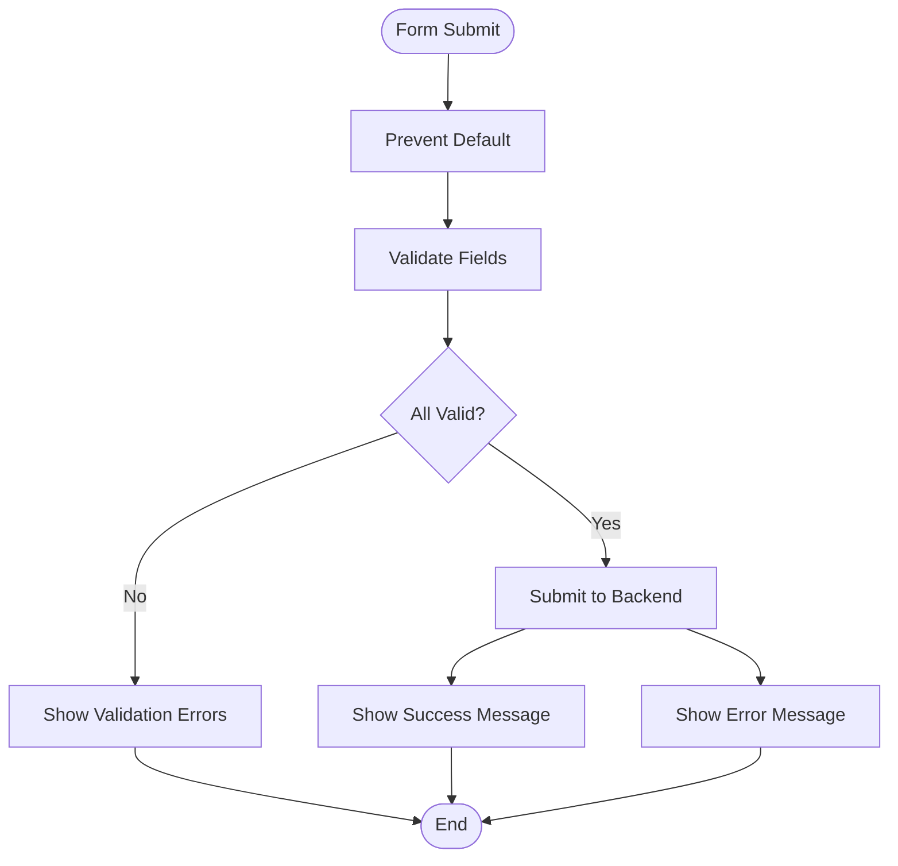
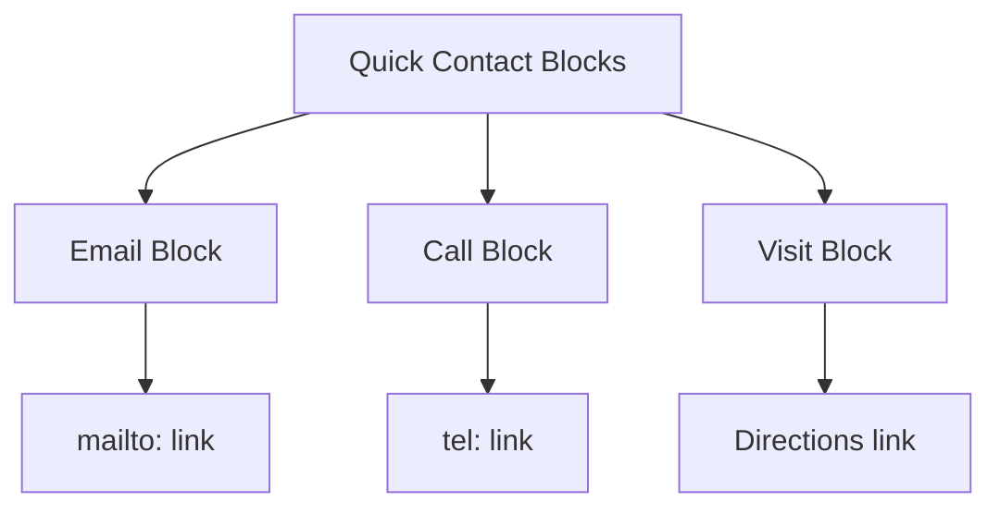
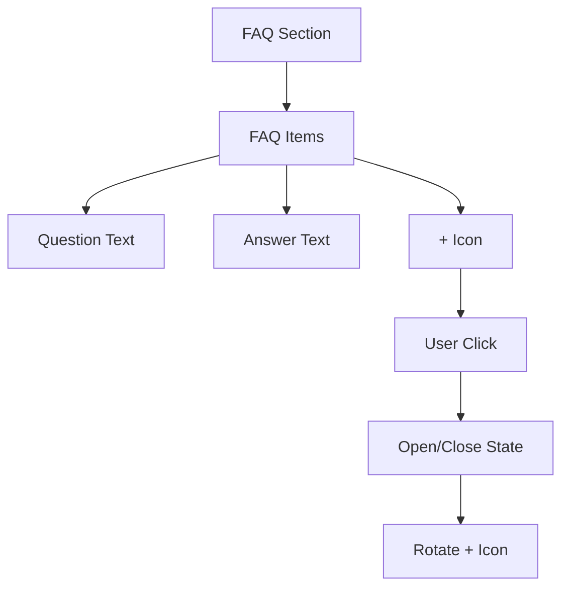
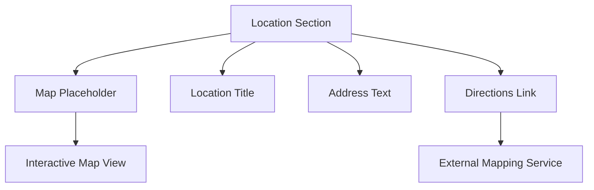
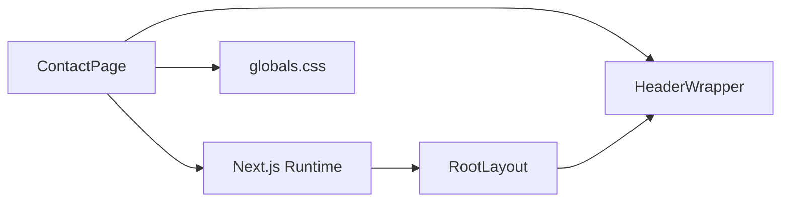

# Contact Page Component

<cite>
**Referenced Files in This Document**
- [page.tsx](file://app/contact/page.tsx)
- [contact.css](file://app/contact/contact.css)
- [globals.css](file://app/globals.css)
- [layout.tsx](file://app/layout.tsx)
- [HeaderWrapper.tsx](file://app/components/HeaderWrapper.tsx)
- [package.json](file://package.json)
</cite>

## Table of Contents
1. [Introduction](#introduction)
2. [Project Structure](#project-structure)
3. [Core Components](#core-components)
4. [Architecture Overview](#architecture-overview)
5. [Detailed Component Analysis](#detailed-component-analysis)
6. [Dependency Analysis](#dependency-analysis)
7. [Performance Considerations](#performance-considerations)
8. [Troubleshooting Guide](#troubleshooting-guide)
9. [Conclusion](#conclusion)
10. [Appendices](#appendices)

## Introduction
This document describes the Contact Page component that enables customer communication and location information display. It covers the component structure for contact forms, quick contact blocks, FAQs, and a location/map area. It explains how the form is integrated into the Next.js application, how styling is applied, and how to customize and extend the component for new contact methods, updated location information, and integration with external CRM or communication platforms.

## Project Structure
The Contact Page is implemented as a Next.js page component located under the app routing system. It uses shared global styles and a layout wrapper that injects animations and the site header.

**Diagram sources**
- [page.tsx:1-217](file://app/contact/page.tsx#L1-L217)
- [contact.css:1-5](file://app/contact/contact.css#L1-L5)
- [layout.tsx:1-24](file://app/layout.tsx#L1-L24)
- [globals.css:1-2341](file://app/globals.css#L1-L2341)
- [HeaderWrapper.tsx:1-25](file://app/components/HeaderWrapper.tsx#L1-L25)

**Section sources**
- [page.tsx:1-217](file://app/contact/page.tsx#L1-L217)
- [contact.css:1-5](file://app/contact/contact.css#L1-L5)
- [layout.tsx:1-24](file://app/layout.tsx#L1-L24)
- [globals.css:1-2341](file://app/globals.css#L1-L2341)
- [HeaderWrapper.tsx:1-25](file://app/components/HeaderWrapper.tsx#L1-L25)

## Core Components
The Contact Page consists of several distinct sections:
- Hero section with headline and introductory copy
- Contact form with three fields: Full Name, Email Address, and Message
- Quick contact blocks for Email, Call, and Visit
- Frequently Asked Questions (FAQ) accordion
- Location and map placeholder with directions

Key styling patterns:
- Uses a dark theme with blue accents
- Responsive grid layout for the contact form and quick contact blocks
- Feature cards with hover effects and subtle borders
- Typography hierarchy emphasizing readability and contrast

Accessibility considerations:
- The current implementation does not include explicit ARIA attributes or semantic roles for form controls and the FAQ accordion. Enhancements are recommended.

Integration points:
- The form currently prevents default submission and does not handle validation or submission processing. This is a placeholder for future integration with a backend or CRM.
- The map area is a placeholder; actual map integration would require a mapping library and API keys.

**Section sources**
- [page.tsx:22-160](file://app/contact/page.tsx#L22-L160)
- [globals.css:1-2341](file://app/globals.css#L1-L2341)

## Architecture Overview
The Contact Page is a client-side React component rendered by Next.js. It relies on global styles for theming and layout, and integrates with a header wrapper that manages navigation and animations.

**Diagram sources**
- [layout.tsx:13-22](file://app/layout.tsx#L13-L22)
- [HeaderWrapper.tsx:7-24](file://app/components/HeaderWrapper.tsx#L7-L24)
- [page.tsx:7-215](file://app/contact/page.tsx#L7-L215)
- [globals.css:1-2341](file://app/globals.css#L1-L2341)

## Detailed Component Analysis

### Contact Form
The form includes:
- Label and input for Full Name
- Label and input for Email Address
- Label and textarea for Message
- Submit button styled as a primary button

Processing logic:
- The form currently prevents default submission via event handler. There is no state management, validation, or submission handling implemented.

Validation patterns:
- No client-side validation is implemented. Recommended additions include:
  - Required field validation for all fields
  - Email format validation for the email field
  - Minimum length validation for the message field
  - Optional: rate limiting or CAPTCHA integration

Submission processing:
- No submission handler is attached. Recommended additions include:
  - State management for form fields
  - Submission handler that posts to a backend endpoint
  - Success and error feedback messaging
  - Optional: integration with external CRM APIs

**Diagram sources**
- [page.tsx:64-81](file://app/contact/page.tsx#L64-L81)

**Section sources**
- [page.tsx:64-81](file://app/contact/page.tsx#L64-L81)

### Quick Contact Blocks
Three quick contact blocks provide immediate access to communication channels:
- Email: displays a mailto link
- Call: displays a tel link
- Visit: displays address text with a directions link

Customization:
- To add new contact methods, introduce a new block with an icon, title, description, and link.
- To change existing methods, update the icon, text, and link accordingly.

**Diagram sources**
- [page.tsx:88-110](file://app/contact/page.tsx#L88-L110)

**Section sources**
- [page.tsx:88-110](file://app/contact/page.tsx#L88-L110)

### FAQ Accordion
The FAQ section uses a simple state-based toggle to expand/collapse answers. Each FAQ item has:
- Question text
- Expandable answer text
- Visual indicator (+) that rotates when expanded

Customization:
- To add new FAQs, append entries to the faqs array.
- To modify behavior, adjust the toggle function and state management.

**Diagram sources**
- [page.tsx:14-20](file://app/contact/page.tsx#L14-L20)
- [page.tsx:120-135](file://app/contact/page.tsx#L120-L135)

**Section sources**
- [page.tsx:14-20](file://app/contact/page.tsx#L14-L20)
- [page.tsx:120-135](file://app/contact/page.tsx#L120-L135)

### Location and Map Area
The location section presents:
- A map placeholder with a descriptive message
- A title and address for the location
- A directions link to an external mapping service

Customization:
- To update location information, modify the address text and directions link.
- To integrate a real map, replace the placeholder with a mapping library component and configure API keys.

**Diagram sources**
- [page.tsx:138-160](file://app/contact/page.tsx#L138-L160)

**Section sources**
- [page.tsx:138-160](file://app/contact/page.tsx#L138-L160)

### Styling Approach and Design System
The Contact Page leverages the global design system:
- Theme variables define colors and typography
- Feature cards provide a consistent card style with hover effects
- Grid layouts ensure responsive spacing and alignment
- Typography hierarchy emphasizes readability

Responsive design:
- The layout uses CSS Grid and Flexbox to adapt to different screen sizes
- Media queries in other pages demonstrate responsive breakpoints; similar patterns can be applied here

Visual elements:
- Icons and emojis are used for quick recognition
- Buttons and links use consistent styling from the global CSS

**Section sources**
- [globals.css:1-2341](file://app/globals.css#L1-L2341)
- [page.tsx:38-84](file://app/contact/page.tsx#L38-L84)
- [page.tsx:88-110](file://app/contact/page.tsx#L88-L110)
- [page.tsx:138-160](file://app/contact/page.tsx#L138-L160)

## Dependency Analysis
The Contact Page depends on:
- Next.js runtime for rendering and routing
- Global CSS for theming and layout
- Header wrapper for navigation and animations

External integrations:
- No external libraries are imported in the Contact Page itself
- The project includes animation and 3D libraries that could be used for enhancements

**Diagram sources**
- [page.tsx:1-217](file://app/contact/page.tsx#L1-L217)
- [layout.tsx:13-22](file://app/layout.tsx#L13-L22)
- [HeaderWrapper.tsx:7-24](file://app/components/HeaderWrapper.tsx#L7-L24)
- [globals.css:1-2341](file://app/globals.css#L1-L2341)

**Section sources**
- [page.tsx:1-217](file://app/contact/page.tsx#L1-L217)
- [layout.tsx:13-22](file://app/layout.tsx#L13-L22)
- [HeaderWrapper.tsx:7-24](file://app/components/HeaderWrapper.tsx#L7-L24)
- [globals.css:1-2341](file://app/globals.css#L1-L2341)
- [package.json:11-21](file://package.json#L11-L21)

## Performance Considerations
- The Contact Page is client-rendered; ensure minimal JavaScript to reduce initial load time.
- Use lazy loading for any heavy assets or third-party scripts.
- Keep form interactions lightweight; avoid unnecessary re-renders by managing state efficiently.
- Consider deferring non-critical resources until after initial paint.

## Troubleshooting Guide
Common issues and resolutions:
- Form not submitting: The current implementation prevents default submission. Implement a submit handler to process form data.
- Validation errors not shown: Add client-side validation and display error messages near the respective fields.
- Styling inconsistencies: Verify that global styles are applied and that feature cards are used consistently.
- Accessibility concerns: Add ARIA attributes and keyboard navigation support for form controls and the FAQ accordion.

**Section sources**
- [page.tsx:64-81](file://app/contact/page.tsx#L64-L81)
- [page.tsx:120-135](file://app/contact/page.tsx#L120-L135)
- [globals.css:1625-1810](file://app/globals.css#L1625-L1810)

## Conclusion
The Contact Page component provides a solid foundation for customer communication and location display. It currently serves as a placeholder for form handling and external integrations. By implementing state management, validation, and submission processing, and by enhancing accessibility and responsiveness, the component can become a robust interface for customer engagement.

## Appendices

### Customization Guidelines
- Adding new contact methods:
  - Duplicate the structure of existing quick contact blocks and update the icon, title, description, and link.
- Updating location information:
  - Modify the address text and directions link within the location section.
- Integrating with external CRM or communication platforms:
  - Replace the form’s preventDefault behavior with a submission handler that posts to your backend or directly to the CRM API.
  - Add validation rules and success/error handling as needed.

### Accessibility Recommendations
- Add ARIA attributes to form controls and the FAQ accordion.
- Ensure keyboard navigation support for interactive elements.
- Provide focus indicators and clear error messages.
- Use semantic HTML for improved screen reader support.

### Styling Reference
- Feature cards: Use the established card styles for consistent visuals.
- Typography: Follow the existing hierarchy and color scheme.
- Spacing: Maintain consistent padding and margins across sections.