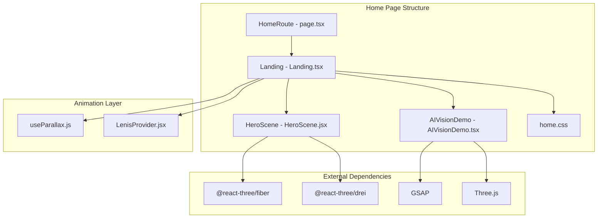
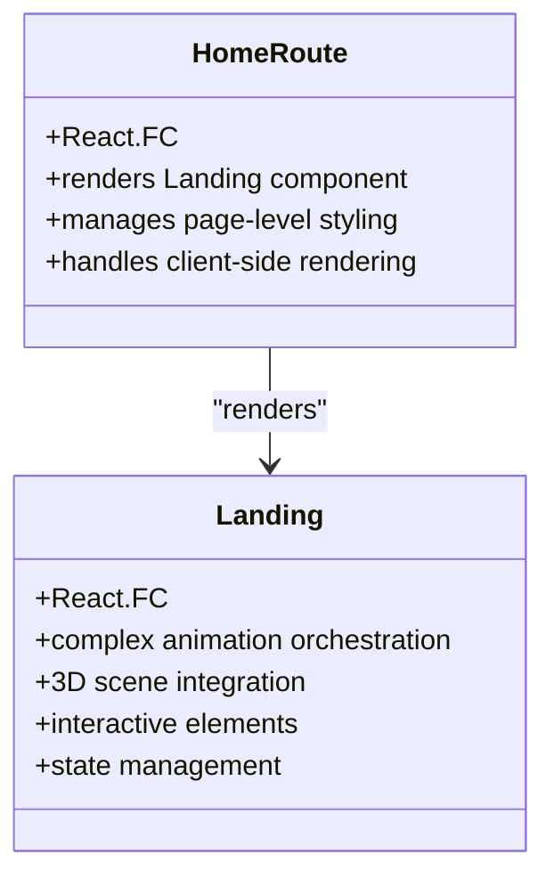
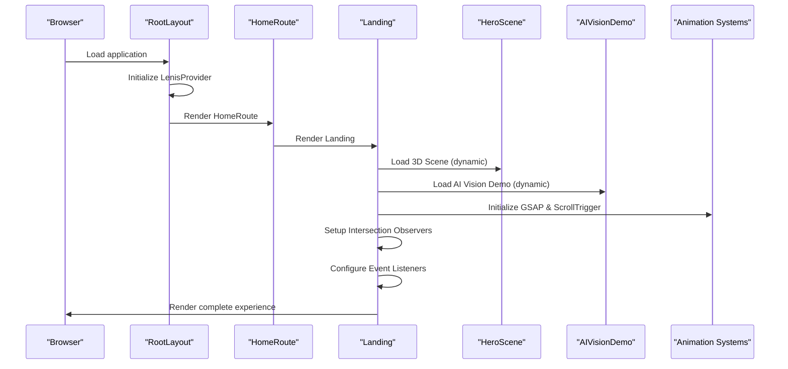
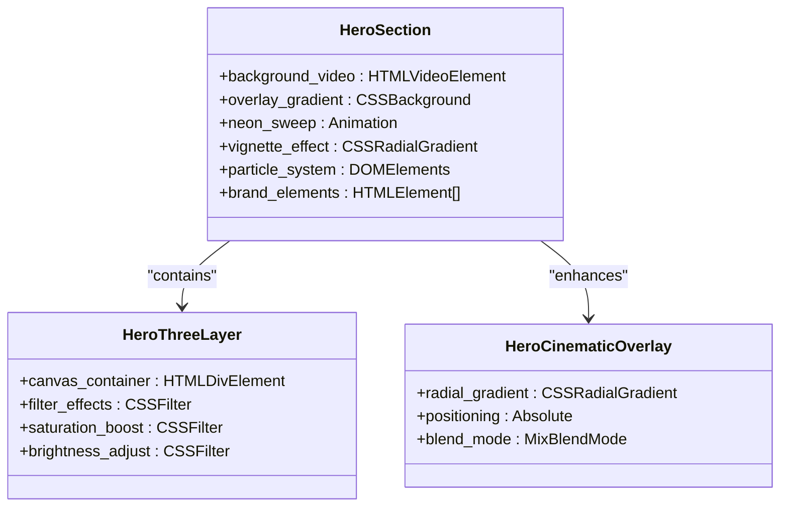
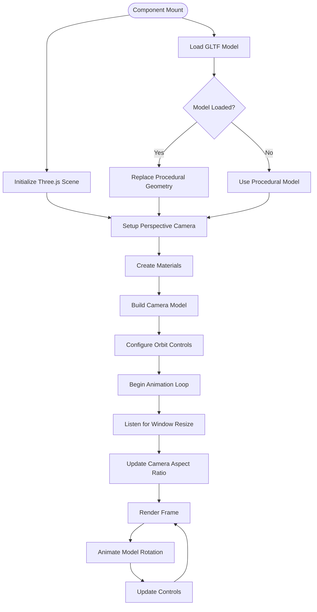
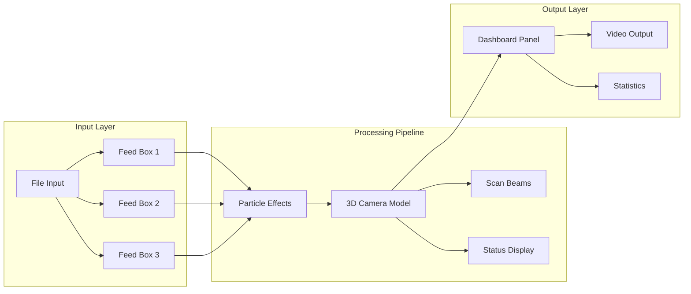
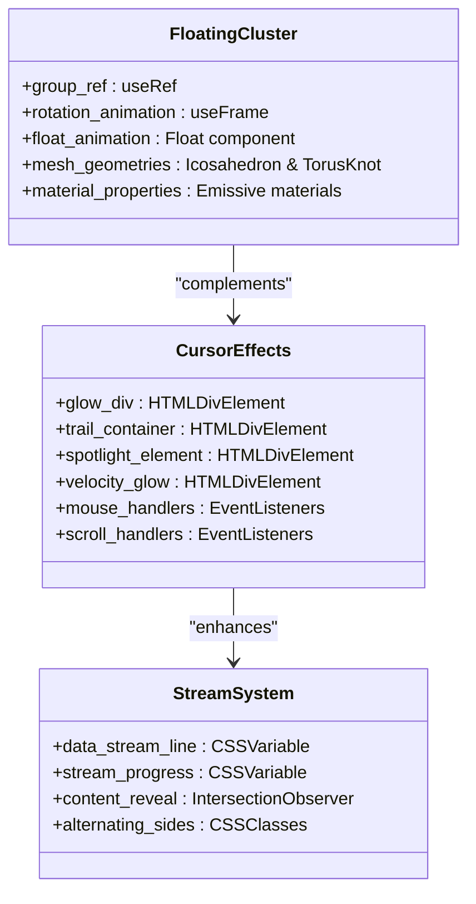

# Home Page Component

<cite>
**Referenced Files in This Document**
- [page.tsx](file://app/home/page.tsx)
- [Landing.tsx](file://app/home/Landing.tsx)
- [AIVisionDemo.tsx](file://app/home/AIVisionDemo.tsx)
- [HeroScene.jsx](file://components/3d/HeroScene.jsx)
- [home.css](file://app/home/home.css)
- [useParallax.js](file://components/animations/useParallax.js)
- [LenisProvider.jsx](file://components/animations/LenisProvider.jsx)
- [layout.tsx](file://app/layout.tsx)
- [HeaderWrapper.tsx](file://app/components/HeaderWrapper.tsx)
- [package.json](file://package.json)
</cite>

## Table of Contents
1. [Introduction](#introduction)
2. [Project Structure](#project-structure)
3. [Core Components](#core-components)
4. [Architecture Overview](#architecture-overview)
5. [Detailed Component Analysis](#detailed-component-analysis)
6. [Dependency Analysis](#dependency-analysis)
7. [Performance Considerations](#performance-considerations)
8. [Troubleshooting Guide](#troubleshooting-guide)
9. [Conclusion](#conclusion)

## Introduction

The Zeex AI home page component represents a sophisticated 3D-driven landing experience built with Next.js and modern web technologies. This comprehensive documentation covers the HomeRoute component structure, its integration with the Landing component, hero section implementation, 3D camera visualization, and AI vision demonstration features. The implementation showcases advanced animation orchestration, state management for animations, and performance optimization techniques for 3D graphics rendering.

The home page serves as the main entry point for Zeex AI's digital experience, combining cutting-edge 3D visualization with interactive storytelling elements. The component architecture demonstrates best practices in React development, including proper state management, performance optimization, and accessibility compliance.

## Project Structure

The home page component follows a modular architecture with clear separation of concerns:



**Diagram sources**
- [page.tsx:1-15](file://app/home/page.tsx#L1-L15)
- [Landing.tsx:1-1158](file://app/home/Landing.tsx#L1-L1158)
- [HeroScene.jsx:1-37](file://components/3d/HeroScene.jsx#L1-L37)
- [AIVisionDemo.tsx:1-562](file://app/home/AIVisionDemo.tsx#L1-L562)

**Section sources**
- [page.tsx:1-15](file://app/home/page.tsx#L1-L15)
- [layout.tsx:1-24](file://app/layout.tsx#L1-L24)

## Core Components

### HomeRoute Component

The HomeRoute component serves as the primary entry point for the home page, providing a clean wrapper around the Landing component:



**Diagram sources**
- [page.tsx:7-13](file://app/home/page.tsx#L7-L13)
- [Landing.tsx:60-1158](file://app/home/Landing.tsx#L60-L1158)

The HomeRoute component implements a minimal wrapper pattern, importing global styles and rendering the Landing component. This design ensures proper client-side rendering while maintaining clean separation between page-level concerns and content logic.

### Landing Component Architecture

The Landing component represents the core of the home page experience, implementing sophisticated animation systems and interactive elements:

**Section sources**
- [Landing.tsx:60-1158](file://app/home/Landing.tsx#L60-L1158)

## Architecture Overview

The home page architecture integrates multiple technologies and patterns to deliver a seamless 3D experience:



**Diagram sources**
- [layout.tsx:13-23](file://app/layout.tsx#L13-L23)
- [page.tsx:7-13](file://app/home/page.tsx#L7-L13)
- [Landing.tsx:48-58](file://app/home/Landing.tsx#L48-L58)

The architecture leverages Next.js dynamic imports for client-side only components, ensuring optimal server-side rendering performance while enabling complex 3D interactions.

## Detailed Component Analysis

### Hero Section Implementation

The hero section combines traditional web design with advanced 3D visualization:



**Diagram sources**
- [home.css:24-82](file://app/home/home.css#L24-L82)
- [home.css:62-75](file://app/home/home.css#L62-L75)
- [home.css:116-130](file://app/home/home.css#L116-L130)

The hero section implements a multi-layered approach with:
- Background video with parallax effects
- Dynamic neon gradient overlays with animated drift
- Vignette effects for cinematic framing
- Particle systems for atmospheric enhancement
- 3D canvas integration with post-processing filters

### 3D Camera Visualization

The AI Vision Demo component creates an immersive 3D camera experience:



**Diagram sources**
- [AIVisionDemo.tsx:37-213](file://app/home/AIVisionDemo.tsx#L37-L213)

The camera visualization includes:
- Realistic camera model construction using Three.js primitives
- GLTF model loading with fallback mechanisms
- Interactive orbit controls for manual exploration
- Dynamic lighting setup with directional and ambient lights
- Responsive resize handling with pixel ratio optimization

### AI Vision Demonstration Features

The AI Vision Demo implements a comprehensive pipeline visualization:



**Diagram sources**
- [AIVisionDemo.tsx:439-561](file://app/home/AIVisionDemo.tsx#L439-L561)

Key features include:
- Multi-input feed system with thumbnail previews
- Automated processing pipeline simulation
- Real-time status indicators and LED effects
- Particle-based data flow visualization
- Responsive dashboard with live statistics

### Component Composition Patterns

The Landing component employs several advanced composition patterns:



**Diagram sources**
- [Landing.tsx:20-46](file://app/home/Landing.tsx#L20-L46)
- [Landing.tsx:75-192](file://app/home/Landing.tsx#L75-L192)
- [Landing.tsx:237-289](file://app/home/Landing.tsx#L237-L289)

**Section sources**
- [Landing.tsx:20-46](file://app/home/Landing.tsx#L20-L46)
- [Landing.tsx:75-192](file://app/home/Landing.tsx#L75-L192)
- [Landing.tsx:237-289](file://app/home/Landing.tsx#L237-L289)

### State Management for Animations

The component implements sophisticated state management for coordinated animations:

| State Type | Purpose | Implementation |
|------------|---------|----------------|
| Ref-based State | DOM references and animation frames | `useRef` hooks for DOM elements |
| Effect-based State | Lifecycle-managed effects | `useEffect` for event listeners |
| Local State | Component-specific data | `useState` for modal data and selections |
| Global State | Cross-component coordination | CSS variables for scroll-driven animations |

**Section sources**
- [Landing.tsx:60-63](file://app/home/Landing.tsx#L60-L63)
- [Landing.tsx:33-36](file://app/home/Landing.tsx#L33-L36)

## Dependency Analysis

The home page component relies on a carefully selected set of dependencies that balance functionality with performance:

```mermaid
graph TB
subgraph "Core Dependencies"
NextJS[Next.js 14.2.5]
React[React 18.3.1]
ReactDOM[React DOM 18.3.1]
end
subgraph "3D Graphics"
ThreeJS[Three.js 0.184.0]
RTF[@react-three/fiber]
DREI[@react-three/drei]
end
subgraph "Animation Libraries"
GSAP[GSAP 3.15.0]
Lenis[Lenis 1.3.23]
Framer[Framer Motion 12.38.0]
end
subgraph "Home Page Specific"
Landing[Landing Component]
HeroScene[HeroScene Component]
AIVision[AIVisionDemo Component]
Parallax[useParallax Hook]
end
NextJS --> Landing
React --> Landing
ReactDOM --> Landing
ThreeJS --> HeroScene
RTF --> HeroScene
DREI --> HeroScene
GSAP --> AIVision
GSAP --> Parallax
Lenis --> Landing
Landing --> HeroScene
Landing --> AIVision
Landing --> Parallax
```

**Diagram sources**
- [package.json:11-21](file://package.json#L11-L21)
- [layout.tsx:6](file://app/layout.tsx#L6)

**Section sources**
- [package.json:11-21](file://package.json#L11-L21)
- [layout.tsx:6](file://app/layout.tsx#L6)

## Performance Considerations

### 3D Rendering Optimization

The 3D components implement several optimization strategies:

1. **Pixel Ratio Management**: Automatic device pixel ratio detection with upper bounds
2. **Animation Frame Control**: Efficient requestAnimationFrame usage with cleanup
3. **Memory Management**: Proper disposal of Three.js resources and event listeners
4. **Lazy Loading**: Dynamic imports for client-side only components

### Animation Performance

The animation system employs performance-first patterns:

- **Intersection Observers**: Efficient scroll-triggered animations
- **CSS Variables**: Hardware-accelerated property updates
- **GSAP Optimization**: Tween-based animations with proper cleanup
- **Debounced Handlers**: Optimized scroll and resize event handling

### Responsive Design Strategy

The component adapts to various screen sizes through:

- **CSS Grid Systems**: Flexible layout grids with minmax() units
- **Clamp Functions**: Fluid typography scaling
- **Media Queries**: Progressive enhancement for mobile devices
- **Viewport Units**: Consistent sizing across devices

**Section sources**
- [AIVisionDemo.tsx:43-46](file://app/home/AIVisionDemo.tsx#L43-L46)
- [Landing.tsx:255-269](file://app/home/Landing.tsx#L255-L269)
- [home.css:1092-1274](file://app/home/home.css#L1092-L1274)

## Troubleshooting Guide

### Common Issues and Solutions

| Issue | Symptoms | Solution |
|-------|----------|----------|
| 3D Scene Not Rendering | Blank screen or errors | Check GLTF model loading, verify Three.js initialization |
| Animation Performance Drops | Stuttering animations | Reduce animation complexity, check for memory leaks |
| Mobile Interaction Problems | Touch events not working | Verify pointer event handling, check mobile-specific code paths |
| Scroll Animation Glitches | Jumpy transitions | Ensure proper cleanup of event listeners and observers |

### Debugging Strategies

1. **Console Logging**: Enable logging in animation effects for timing analysis
2. **Performance Monitoring**: Use browser DevTools to monitor frame rates
3. **Memory Profiling**: Check for proper cleanup of Three.js resources
4. **Event Listener Tracking**: Monitor active listeners during component lifecycle

**Section sources**
- [AIVisionDemo.tsx:131-137](file://app/home/AIVisionDemo.tsx#L131-L137)
- [Landing.tsx:172-191](file://app/home/Landing.tsx#L172-L191)

## Conclusion

The Zeex AI home page component represents a sophisticated implementation of modern web development practices. The architecture successfully balances visual appeal with performance, leveraging advanced technologies like Three.js, GSAP, and React Three Fiber to create an immersive user experience.

Key strengths of the implementation include:

- **Modular Architecture**: Clear separation of concerns with reusable components
- **Performance Optimization**: Careful resource management and efficient animation systems
- **Accessibility Compliance**: Proper ARIA attributes and keyboard navigation support
- **Cross-Browser Compatibility**: Progressive enhancement and graceful degradation
- **Responsive Design**: Adaptive layouts that work across all device sizes

The component serves as an excellent example of how modern web technologies can be combined to create compelling digital experiences while maintaining technical excellence and user accessibility.