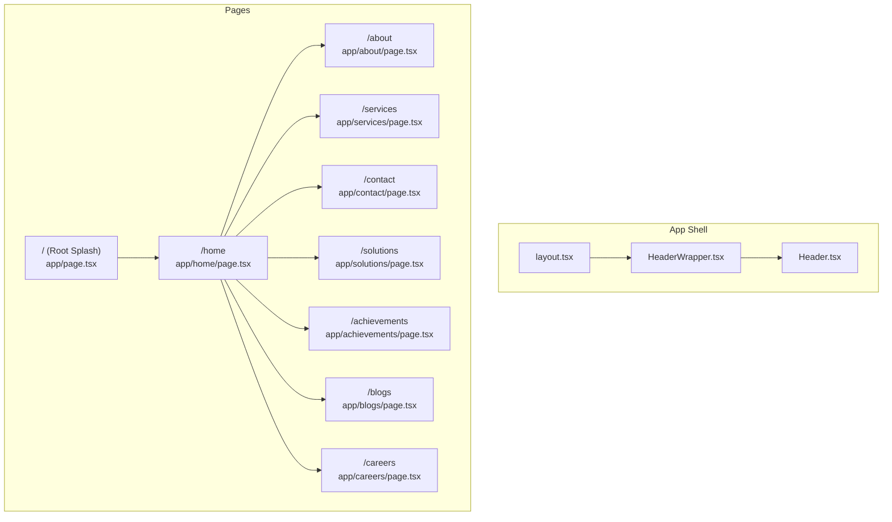
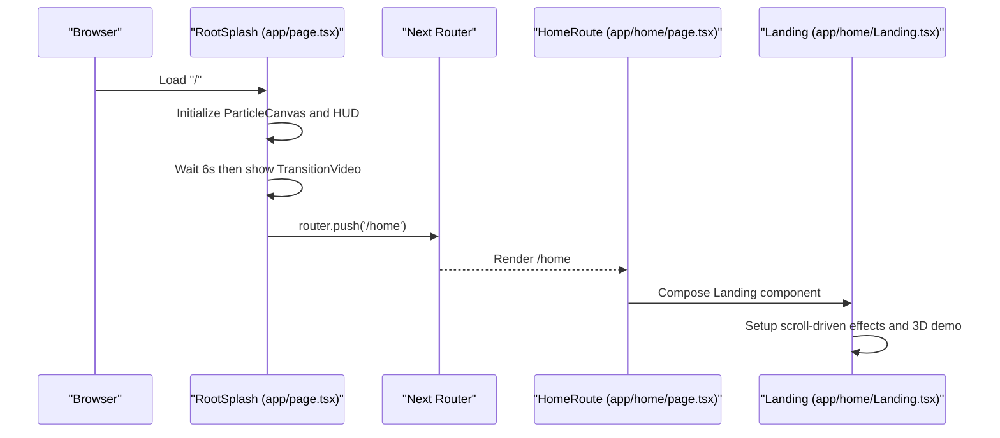
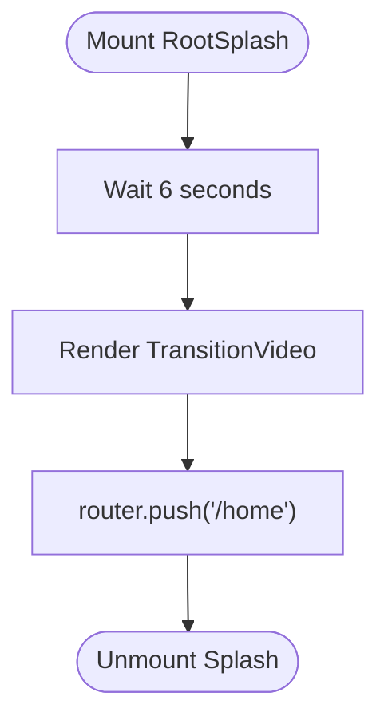
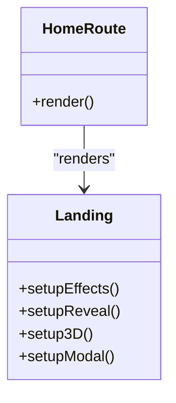
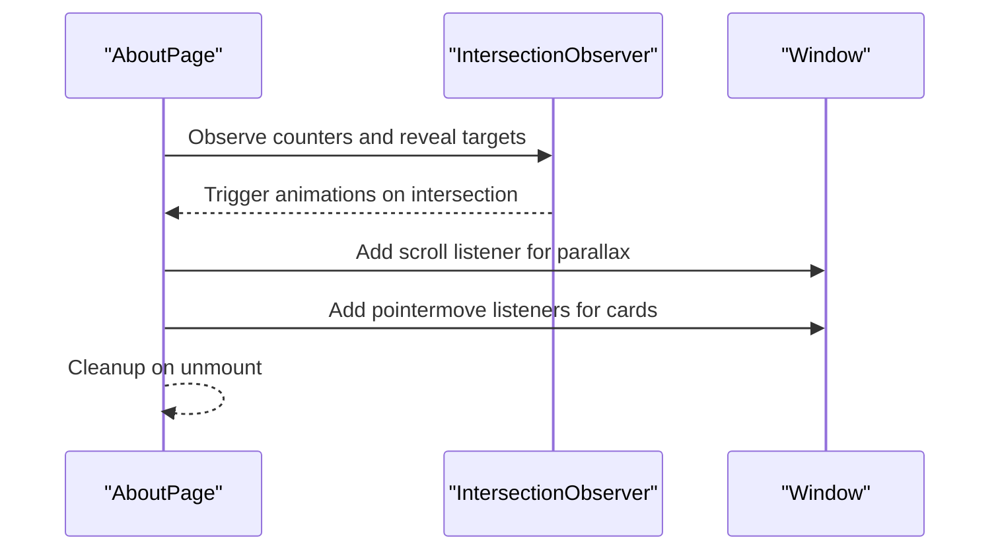
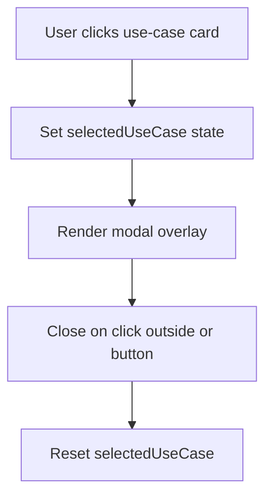
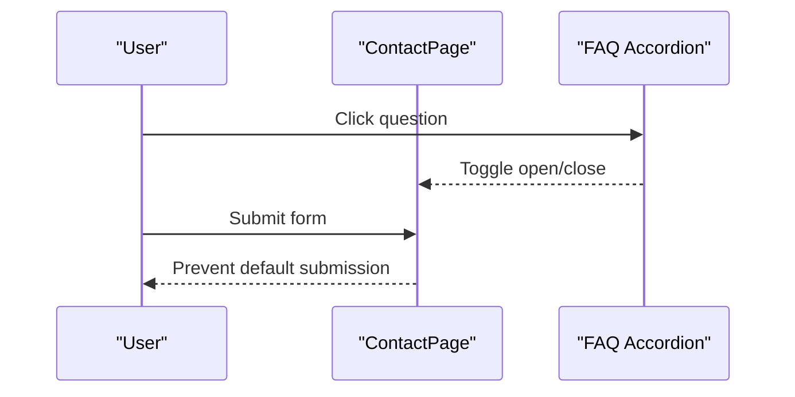
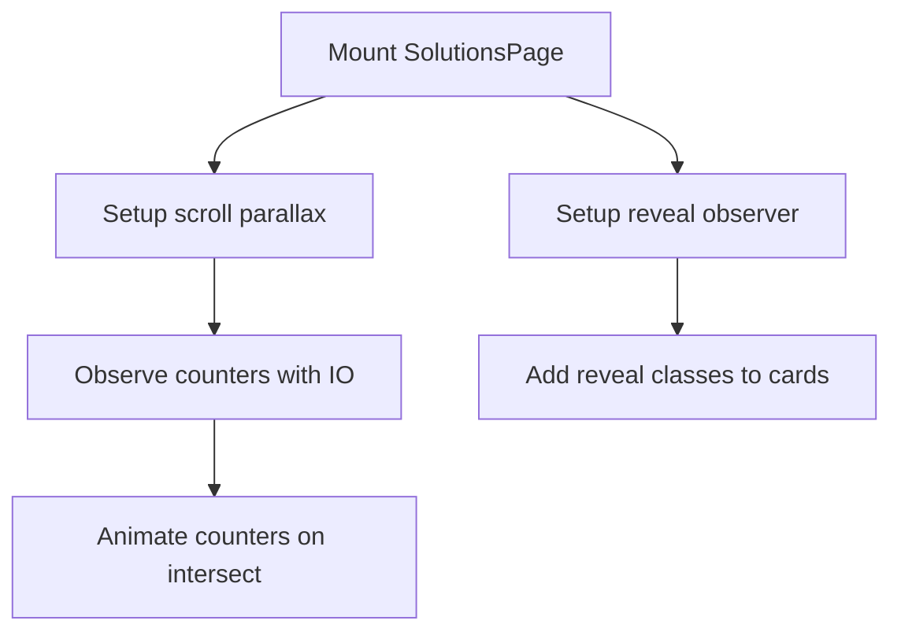
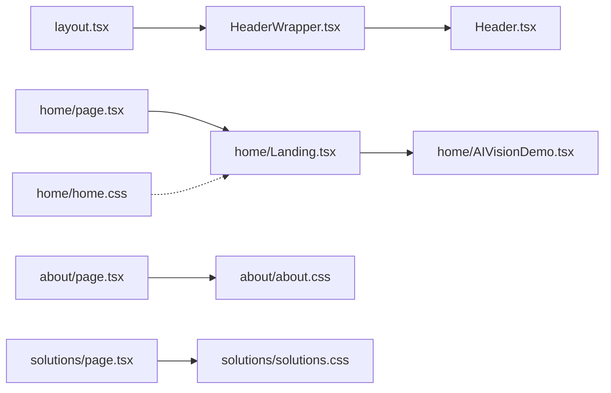

# Page Components

<cite>
**Referenced Files in This Document**
- [app/page.tsx](file://app/page.tsx)
- [app/layout.tsx](file://app/layout.tsx)
- [app/components/HeaderWrapper.tsx](file://app/components/HeaderWrapper.tsx)
- [app/components/Header.tsx](file://app/components/Header.tsx)
- [app/home/page.tsx](file://app/home/page.tsx)
- [app/home/Landing.tsx](file://app/home/Landing.tsx)
- [app/home/AIVisionDemo.tsx](file://app/home/AIVisionDemo.tsx)
- [app/about/page.tsx](file://app/about/page.tsx)
- [app/services/page.tsx](file://app/services/page.tsx)
- [app/contact/page.tsx](file://app/contact/page.tsx)
- [app/solutions/page.tsx](file://app/solutions/page.tsx)
- [app/achievements/page.tsx](file://app/achievements/page.tsx)
- [app/blogs/page.tsx](file://app/blogs/page.tsx)
- [app/careers/page.tsx](file://app/careers/page.tsx)
- [app/home/home.css](file://app/home/home.css)
- [app/about/about.css](file://app/about/about.css)
- [app/solutions/solutions.css](file://app/solutions/solutions.css)
</cite>

## Table of Contents
1. [Introduction](#introduction)
2. [Project Structure](#project-structure)
3. [Core Components](#core-components)
4. [Architecture Overview](#architecture-overview)
5. [Detailed Component Analysis](#detailed-component-analysis)
6. [Dependency Analysis](#dependency-analysis)
7. [Performance Considerations](#performance-considerations)
8. [Troubleshooting Guide](#troubleshooting-guide)
9. [Conclusion](#conclusion)
10. [Appendices](#appendices)

## Introduction
This document explains the page-level components that define the content structure and user experience across the site. It covers the root splash, home landing, about, services, contact, solutions, achievements, blogs, and careers pages. For each page, we describe composition, data handling, shared component integration, routing, SEO considerations, performance techniques, responsive design, accessibility, cross-browser compatibility, and guidance for extension and consistency.

## Project Structure
The application follows a Next.js app directory structure with route segments mapped to pages. Shared UI is centralized in a layout and header wrapper, while each page composes reusable components and styles.

**Diagram sources**
- [app/layout.tsx:13-23](file://app/layout.tsx#L13-L23)
- [app/components/HeaderWrapper.tsx:7-24](file://app/components/HeaderWrapper.tsx#L7-L24)
- [app/components/Header.tsx:10-82](file://app/components/Header.tsx#L10-L82)
- [app/page.tsx:9-54](file://app/page.tsx#L9-L54)
- [app/home/page.tsx:7-13](file://app/home/page.tsx#L7-L13)
- [app/about/page.tsx:10-296](file://app/about/page.tsx#L10-L296)
- [app/services/page.tsx:7-377](file://app/services/page.tsx#L7-L377)
- [app/contact/page.tsx:7-215](file://app/contact/page.tsx#L7-L215)
- [app/solutions/page.tsx:7-492](file://app/solutions/page.tsx#L7-L492)
- [app/achievements/page.tsx:7-76](file://app/achievements/page.tsx#L7-L76)
- [app/blogs/page.tsx:7-224](file://app/blogs/page.tsx#L7-L224)
- [app/careers/page.tsx:7-184](file://app/careers/page.tsx#L7-L184)

**Section sources**
- [app/layout.tsx:13-23](file://app/layout.tsx#L13-L23)
- [app/components/HeaderWrapper.tsx:7-24](file://app/components/HeaderWrapper.tsx#L7-L24)
- [app/components/Header.tsx:10-82](file://app/components/Header.tsx#L10-L82)
- [app/page.tsx:9-54](file://app/page.tsx#L9-L54)
- [app/home/page.tsx:7-13](file://app/home/page.tsx#L7-L13)

## Core Components
- Root Splash: Orchestrates initial animation and transitions to the home route.
- Home Landing: Provides immersive hero, animated stats, and modular sections with scroll-driven effects.
- About: Company storytelling with parallax, counters, reveal animations, and interactive team cards.
- Services: Service catalog with deep-dives, benefit lists, use cases, and a modal dialog.
- Contact: Lead capture, quick links, FAQs, and location/map display.
- Solutions: Feature-rich showcase with counters, reveal animations, and a comprehensive feature grid.
- Achievements: Minimal hero page with footer integration.
- Blogs: Content hub with category filtering, article cards, and newsletter signup.
- Careers: Open positions, benefits, and internal messaging.

**Section sources**
- [app/page.tsx:9-54](file://app/page.tsx#L9-L54)
- [app/home/page.tsx:7-13](file://app/home/page.tsx#L7-L13)
- [app/home/Landing.tsx:60-800](file://app/home/Landing.tsx#L60-L800)
- [app/about/page.tsx:10-296](file://app/about/page.tsx#L10-L296)
- [app/services/page.tsx:7-377](file://app/services/page.tsx#L7-L377)
- [app/contact/page.tsx:7-215](file://app/contact/page.tsx#L7-L215)
- [app/solutions/page.tsx:7-492](file://app/solutions/page.tsx#L7-L492)
- [app/achievements/page.tsx:7-76](file://app/achievements/page.tsx#L7-L76)
- [app/blogs/page.tsx:7-224](file://app/blogs/page.tsx#L7-L224)
- [app/careers/page.tsx:7-184](file://app/careers/page.tsx#L7-L184)

## Architecture Overview
The pages are client-rendered React components integrated into Next.js routes. They rely on:
- Layout and header wrapper for consistent navigation and branding.
- Shared components for 3D scenes, animations, and parallax helpers.
- CSS modules scoped per page for styling and responsive behavior.
- Intersection Observer and requestAnimationFrame for smooth animations.
- Dynamic imports for heavy 3D libraries to defer loading until client-side.

**Diagram sources**
- [app/page.tsx:9-54](file://app/page.tsx#L9-L54)
- [app/home/page.tsx:7-13](file://app/home/page.tsx#L7-L13)
- [app/home/Landing.tsx:60-800](file://app/home/Landing.tsx#L60-L800)

**Section sources**
- [app/layout.tsx:13-23](file://app/layout.tsx#L13-L23)
- [app/components/HeaderWrapper.tsx:7-24](file://app/components/HeaderWrapper.tsx#L7-L24)
- [app/components/Header.tsx:10-82](file://app/components/Header.tsx#L10-L82)

## Detailed Component Analysis

### Root Splash (/)
- Composition: Renders animated background elements and transitions to the home route after a timed delay.
- Data handling: Uses local state and timers to orchestrate the splash and transition.
- Integration: Uses shared components for particle effects and transition video.
- Routing: Navigates to /home after transition completes.
- Performance: Minimal DOM; relies on CSS and controlled timeouts.

**Diagram sources**
- [app/page.tsx:9-54](file://app/page.tsx#L9-L54)

**Section sources**
- [app/page.tsx:9-54](file://app/page.tsx#L9-L54)

### Home Landing (/home)
- Composition: Main landing page composed of the Landing component.
- Data handling: Uses IntersectionObserver and requestAnimationFrame for counters and scroll-driven animations.
- Integration: Imports 3D demo and animation helpers; applies extensive CSS for motion and layout.
- Routing: Serves as the primary entry for the main experience.
- Performance: Defer-heavy 3D rendering; uses requestAnimationFrame and throttled observers.

**Diagram sources**
- [app/home/page.tsx:7-13](file://app/home/page.tsx#L7-L13)
- [app/home/Landing.tsx:60-800](file://app/home/Landing.tsx#L60-L800)

**Section sources**
- [app/home/page.tsx:7-13](file://app/home/page.tsx#L7-L13)
- [app/home/Landing.tsx:60-800](file://app/home/Landing.tsx#L60-L800)
- [app/home/home.css:1-800](file://app/home/home.css#L1-L800)

### About (/about)
- Composition: Hero with layered parallax, statistics counters, timeline story, team cards with 3D tilt, and a call-to-action.
- Data handling: Uses IntersectionObserver for counters and reveal animations; pointer tracking for team card tilt; scroll listener for parallax.
- Integration: Shared header; styled with page-specific CSS.
- Accessibility: Adds roles and tabindex for clickable cards; uses semantic headings and lists.
- Performance: Limits RAF usage; cleans up listeners and observers on unmount.

**Diagram sources**
- [app/about/page.tsx:14-155](file://app/about/page.tsx#L14-L155)

**Section sources**
- [app/about/page.tsx:10-296](file://app/about/page.tsx#L10-L296)
- [app/about/about.css:1-193](file://app/about/about.css#L1-L193)

### Services (/services)
- Composition: Hero headline, overview grid, detailed service sections, benefit lists, use-case cards, and a modal dialog.
- Data handling: Manages selected use case state; renders static service data.
- Integration: Uses Next.js Link for navigation; styled with page CSS.
- Interactions: Clicking use-case cards opens a modal with details; buttons navigate to contact or solutions.

**Diagram sources**
- [app/services/page.tsx:7-377](file://app/services/page.tsx#L7-L377)

**Section sources**
- [app/services/page.tsx:7-377](file://app/services/page.tsx#L7-L377)
- [app/services/services.css:1-5](file://app/services/services.css#L1-L5)

### Contact (/contact)
- Composition: Hero headline, contact info, form, quick action blocks, FAQ accordion, and map placeholder.
- Data handling: Local state for FAQ expansion; form submission prevented for demonstration.
- Integration: Styled with page CSS; footer included.
- Interactions: FAQ toggles; form inputs styled; map placeholder for future integration.

**Diagram sources**
- [app/contact/page.tsx:7-215](file://app/contact/page.tsx#L7-L215)

**Section sources**
- [app/contact/page.tsx:7-215](file://app/contact/page.tsx#L7-L215)
- [app/contact/contact.css:1-5](file://app/contact/contact.css#L1-L5)

### Solutions (/solutions)
- Composition: Hero headline, statistics counters, feature cards grid, method steps, and CTA.
- Data handling: Uses IntersectionObserver for counters and reveal animations; cursor glow and parallax effects.
- Integration: Styled with page CSS; footer included.
- Performance: Applies reveal classes and counters lazily; cleans up observers and RAF.

**Diagram sources**
- [app/solutions/page.tsx:7-492](file://app/solutions/page.tsx#L7-L492)
- [app/solutions/solutions.css:1-117](file://app/solutions/solutions.css#L1-L117)

**Section sources**
- [app/solutions/page.tsx:7-492](file://app/solutions/page.tsx#L7-L492)
- [app/solutions/solutions.css:1-117](file://app/solutions/solutions.css#L1-L117)

### Achievements (/achievements)
- Composition: Minimal hero section with a back-to-home link and footer.
- Data handling: Stateless; focuses on content presentation.
- Integration: Styled with page CSS; footer included.

**Section sources**
- [app/achievements/page.tsx:7-76](file://app/achievements/page.tsx#L7-L76)

### Blogs (/blogs)
- Composition: Hero headline, category filters, article cards, pagination placeholders, and newsletter signup.
- Data handling: Local state for active category; static article data.
- Integration: Styled with page CSS; footer included.

**Section sources**
- [app/blogs/page.tsx:7-224](file://app/blogs/page.tsx#L7-L224)

### Careers (/careers)
- Composition: Hero headline, “Why work with us” cards, open positions grid, and benefits grid.
- Data handling: Static arrays for content; stateless.
- Integration: Styled with page CSS; footer included.

**Section sources**
- [app/careers/page.tsx:7-184](file://app/careers/page.tsx#L7-L184)

## Dependency Analysis
- Layout and header: The layout injects a lenis provider and wraps the header; the header wrapper conditionally renders the header based on the current path.
- Home page: Depends on the Landing component and its child AIVisionDemo for 3D visuals.
- Shared animations: The Landing component uses animation hooks and 3D libraries imported dynamically to avoid SSR overhead.
- CSS: Each page has its own stylesheet for scoped styling and responsive adjustments.

**Diagram sources**
- [app/layout.tsx:13-23](file://app/layout.tsx#L13-L23)
- [app/components/HeaderWrapper.tsx:7-24](file://app/components/HeaderWrapper.tsx#L7-L24)
- [app/components/Header.tsx:10-82](file://app/components/Header.tsx#L10-L82)
- [app/home/page.tsx:7-13](file://app/home/page.tsx#L7-L13)
- [app/home/Landing.tsx:60-800](file://app/home/Landing.tsx#L60-L800)
- [app/home/AIVisionDemo.tsx:11-562](file://app/home/AIVisionDemo.tsx#L11-L562)
- [app/about/page.tsx:10-296](file://app/about/page.tsx#L10-L296)
- [app/solutions/page.tsx:7-492](file://app/solutions/page.tsx#L7-L492)

**Section sources**
- [app/layout.tsx:13-23](file://app/layout.tsx#L13-L23)
- [app/components/HeaderWrapper.tsx:7-24](file://app/components/HeaderWrapper.tsx#L7-L24)
- [app/components/Header.tsx:10-82](file://app/components/Header.tsx#L10-L82)
- [app/home/page.tsx:7-13](file://app/home/page.tsx#L7-L13)
- [app/home/Landing.tsx:60-800](file://app/home/Landing.tsx#L60-L800)
- [app/home/AIVisionDemo.tsx:11-562](file://app/home/AIVisionDemo.tsx#L11-L562)

## Performance Considerations
- Deferred 3D rendering: Heavy libraries are dynamically imported to avoid SSR and reduce initial bundle size.
- Efficient animations: Uses requestAnimationFrame and IntersectionObserver to minimize layout thrashing.
- Cleanup: Listeners and observers are cleaned up on component unmount to prevent memory leaks.
- CSS-driven motion: Prefers CSS transforms and opacity for smoother animations.
- Lazy loading: Images and videos are configured to load efficiently; placeholders are used for interactive maps.

[No sources needed since this section provides general guidance]

## Troubleshooting Guide
- Cursor effects not appearing: Verify pointer conditions and mobile checks; ensure DOM elements exist before attaching listeners.
- Animations not triggering: Confirm IntersectionObserver thresholds and root margins; ensure elements are rendered before observing.
- 3D scenes failing: Check dynamic import availability and fallback rendering; verify WebGL support.
- Header not visible: Confirm pathname logic in the header wrapper; ensure the root path hides the header intentionally.

**Section sources**
- [app/home/Landing.tsx:60-800](file://app/home/Landing.tsx#L60-L800)
- [app/about/page.tsx:14-155](file://app/about/page.tsx#L14-L155)
- [app/solutions/page.tsx:11-113](file://app/solutions/page.tsx#L11-L113)
- [app/components/HeaderWrapper.tsx:7-24](file://app/components/HeaderWrapper.tsx#L7-L24)

## Conclusion
Each page component is a focused, client-rendered module that leverages shared layouts, headers, and animation utilities. They implement robust interaction patterns, responsive design, and performance-conscious rendering. The structure supports easy extension and consistent content patterns across the application.

[No sources needed since this section summarizes without analyzing specific files]

## Appendices

### Routing Integration
- Root splash navigates to /home after a transition.
- Header navigation links route to respective pages.
- Internal navigation uses Next.js Link for client-side routing.

**Section sources**
- [app/page.tsx:9-54](file://app/page.tsx#L9-L54)
- [app/components/Header.tsx:18-78](file://app/components/Header.tsx#L18-L78)

### SEO Considerations
- Metadata is defined at the root layout level.
- Semantic headings and structured content aid readability.
- Use canonical URLs and meta descriptions at the layout level for consistent SEO signals.

**Section sources**
- [app/layout.tsx:8-11](file://app/layout.tsx#L8-L11)

### Accessibility Compliance
- Interactive elements receive roles and tabindex for keyboard navigation.
- Semantic headings and lists are used for content hierarchy.
- Ensure focus management for modals and accordions.

**Section sources**
- [app/home/Landing.tsx:294-361](file://app/home/Landing.tsx#L294-L361)
- [app/about/page.tsx:39-62](file://app/about/page.tsx#L39-L62)

### Cross-Browser Compatibility
- Prefer CSS features widely supported; test transforms, opacity, and gradients.
- Use IntersectionObserver polyfills if targeting older browsers.
- Validate WebGL and 3D rendering fallbacks.

[No sources needed since this section provides general guidance]

### Extending Page Components
- Add new sections by composing existing feature-card and section patterns.
- Introduce new state with useState and manage lifecycle in useEffect.
- Extend CSS with new classes and maintain responsive breakpoints.
- Keep shared components cohesive and pass props for configuration.

[No sources needed since this section provides general guidance]