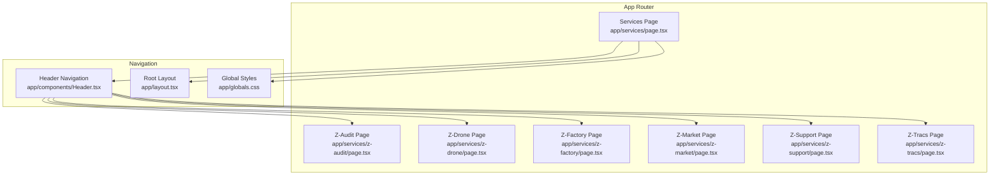
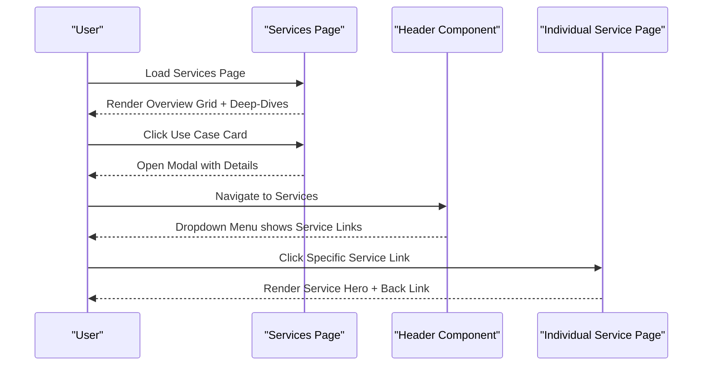
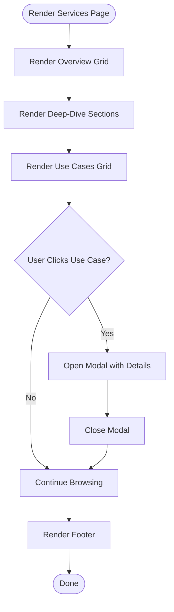
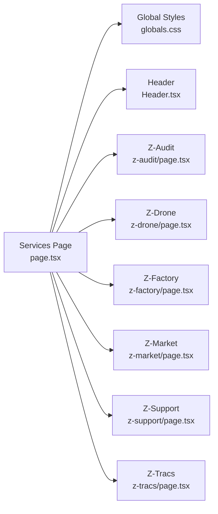

# Services Page Component

<cite>
**Referenced Files in This Document**
- [page.tsx](file://app/services/page.tsx)
- [services.css](file://app/services/services.css)
- [z-audit/page.tsx](file://app/services/z-audit/page.tsx)
- [z-drone/page.tsx](file://app/services/z-drone/page.tsx)
- [z-factory/page.tsx](file://app/services/z-factory/page.tsx)
- [z-market/page.tsx](file://app/services/z-market/page.tsx)
- [z-support/page.tsx](file://app/services/z-support/page.tsx)
- [z-tracs/page.tsx](file://app/services/z-tracs/page.tsx)
- [Header.tsx](file://app/components/Header.tsx)
- [layout.tsx](file://app/layout.tsx)
- [globals.css](file://app/globals.css)
</cite>

## Table of Contents
1. [Introduction](#introduction)
2. [Project Structure](#project-structure)
3. [Core Components](#core-components)
4. [Architecture Overview](#architecture-overview)
5. [Detailed Component Analysis](#detailed-component-analysis)
6. [Dependency Analysis](#dependency-analysis)
7. [Performance Considerations](#performance-considerations)
8. [Troubleshooting Guide](#troubleshooting-guide)
9. [Conclusion](#conclusion)

## Introduction
This document provides comprehensive documentation for the Services Page Component that showcases Zeex AI's service offerings. It explains the component architecture for service cards, navigation patterns, and content organization strategies. It also details the integration with individual service page components (z-audit, z-drone, z-factory, z-market, z-support, z-tracs) and how they are dynamically rendered. The document covers responsive grid layouts, hover effects, interactive elements, service categorization, filtering mechanisms, content expansion patterns, styling approaches, iconography usage, accessibility features, SEO optimization, performance considerations, and guidance for adding/updating services.

## Project Structure
The Services feature is organized under the Next.js app router with a dedicated route for the main services page and individual routes for each service component. The layout and global styles define the shared presentation and navigation patterns.

**Diagram sources**
- [page.tsx:1-379](file://app/services/page.tsx#L1-L379)
- [Header.tsx:1-83](file://app/components/Header.tsx#L1-L83)
- [layout.tsx:1-24](file://app/layout.tsx#L1-L24)
- [globals.css:1-2341](file://app/globals.css#L1-L2341)

**Section sources**
- [page.tsx:1-379](file://app/services/page.tsx#L1-L379)
- [Header.tsx:1-83](file://app/components/Header.tsx#L1-L83)
- [layout.tsx:1-24](file://app/layout.tsx#L1-L24)
- [globals.css:1-2341](file://app/globals.css#L1-L2341)

## Core Components
- Services Page Component: Renders the main services overview, dynamic deep-dives per service category, use cases with modal expansion, and a call-to-action section.
- Individual Service Pages: Lightweight pages for each service that render a hero section with a back-to-home action.
- Navigation Header: Provides dropdown navigation to individual service pages and links to other site sections.
- Global Styles: Define shared typography, spacing, cards, buttons, and responsive breakpoints.

Key responsibilities:
- Services Page: Manages service data, renders overview grid, deep-dive sections, use case cards with modal, and footer.
- Individual Service Pages: Provide concise presentation for each service with a back navigation.
- Header: Integrates services into the primary navigation and dropdown menu.
- Globals: Establishes consistent visual language and responsive behavior.

**Section sources**
- [page.tsx:1-379](file://app/services/page.tsx#L1-L379)
- [z-audit/page.tsx:1-24](file://app/services/z-audit/page.tsx#L1-L24)
- [z-drone/page.tsx:1-24](file://app/services/z-drone/page.tsx#L1-L24)
- [z-factory/page.tsx:1-24](file://app/services/z-factory/page.tsx#L1-L24)
- [z-market/page.tsx:1-24](file://app/services/z-market/page.tsx#L1-L24)
- [z-support/page.tsx:1-24](file://app/services/z-support/page.tsx#L1-L24)
- [z-tracs/page.tsx:1-24](file://app/services/z-tracs/page.tsx#L1-L24)
- [Header.tsx:1-83](file://app/components/Header.tsx#L1-L83)
- [globals.css:1567-1749](file://app/globals.css#L1567-L1749)

## Architecture Overview
The Services Page Component is a single-page application rendering multiple sections:
- Hero section with a CTA anchor to the overview.
- Overview grid of service cards linking to deep-dive sections via anchor IDs.
- Deep-dive sections for each service category with:
  - Core description and benefits list.
  - Use cases presented as interactive cards with modal expansion.
- Footer with site links and service links.

Individual service pages are separate routes that render a focused hero section and a back-to-home link. The Header component provides navigation to these pages and acts as a gateway for users to explore services.

**Diagram sources**
- [page.tsx:1-379](file://app/services/page.tsx#L1-L379)
- [Header.tsx:1-83](file://app/components/Header.tsx#L1-L83)
- [z-audit/page.tsx:1-24](file://app/services/z-audit/page.tsx#L1-L24)
- [z-drone/page.tsx:1-24](file://app/services/z-drone/page.tsx#L1-L24)
- [z-factory/page.tsx:1-24](file://app/services/z-factory/page.tsx#L1-L24)
- [z-market/page.tsx:1-24](file://app/services/z-market/page.tsx#L1-L24)
- [z-support/page.tsx:1-24](file://app/services/z-support/page.tsx#L1-L24)
- [z-tracs/page.tsx:1-24](file://app/services/z-tracs/page.tsx#L1-L24)

## Detailed Component Analysis

### Services Page Component
Responsibilities:
- Maintain a centralized service catalog with categories, descriptions, benefits, and use cases.
- Render an overview grid of service cards with anchor links to deep-dive sections.
- Render deep-dive sections for each service with a benefits list and use cases grid.
- Implement a modal for expanded use case details.
- Provide a call-to-action section and footer.

Interactive Elements:
- Anchor navigation from overview cards to deep-dive sections.
- Clickable use case cards that open a modal with detailed information.
- Buttons for learning more and scheduling consultations.

Responsive Behavior:
- Uses CSS Grid with automatic column sizing and gaps for responsive layouts.
- Applies media queries in global styles for mobile-friendly navigation and spacing.

Styling Approach:
- Leverages shared card styles, typography utilities, and button variants from global styles.
- Uses alternating backgrounds for deep-dive sections to improve readability.

Accessibility:
- Semantic sectioning and headings.
- Focusable interactive elements with visible focus states via global button styles.
- Descriptive alt text for logos and images.

SEO Considerations:
- Semantic HTML structure with headings hierarchy.
- Descriptive meta tags in the root layout.
- Internal linking via anchor IDs and navigation.

Performance:
- Client-side state for modal management.
- Minimal re-renders by mapping over a static dataset.

**Diagram sources**
- [page.tsx:1-379](file://app/services/page.tsx#L1-L379)

**Section sources**
- [page.tsx:1-379](file://app/services/page.tsx#L1-L379)
- [globals.css:1567-1749](file://app/globals.css#L1567-L1749)

### Individual Service Pages (Z-Components)
Responsibilities:
- Provide a concise hero section for each service.
- Offer a back-to-home navigation link.

Structure:
- Single hero section with eyebrow, title, description, and a back link.
- Consistent styling through global CSS utilities.

Integration:
- Linked from the Header dropdown menu and the Services overview anchors.

**Section sources**
- [z-audit/page.tsx:1-24](file://app/services/z-audit/page.tsx#L1-L24)
- [z-drone/page.tsx:1-24](file://app/services/z-drone/page.tsx#L1-L24)
- [z-factory/page.tsx:1-24](file://app/services/z-factory/page.tsx#L1-L24)
- [z-market/page.tsx:1-24](file://app/services/z-market/page.tsx#L1-L24)
- [z-support/page.tsx:1-24](file://app/services/z-support/page.tsx#L1-L24)
- [z-tracs/page.tsx:1-24](file://app/services/z-tracs/page.tsx#L1-L24)

### Navigation Patterns and Integration
The Header component provides:
- Primary navigation links to major sections.
- A dropdown menu under "Services" that links to each individual service page.
- Responsive behavior for smaller screens.

Integration with Services Page:
- The Services overview anchors target deep-dive sections on the Services Page.
- The Header dropdown ensures discoverability of individual service pages.

**Section sources**
- [Header.tsx:1-83](file://app/components/Header.tsx#L1-L83)
- [layout.tsx:1-24](file://app/layout.tsx#L1-L24)

### Content Organization Strategies
- Centralized service catalog in the Services Page component.
- Use case cards grouped per service category.
- Benefits lists for quick scanning of value propositions.
- Modal-based expansion for detailed use case information.

Categorization:
- Services are categorized by domain (Residential, Commercial, Public Safety, Retail, Industrial, Traffic).
- Each category includes a description, benefits, and representative use cases.

Filtering Mechanisms:
- Current implementation uses anchor navigation to jump to specific sections.
- Future enhancements could include client-side filtering by category or keyword.

Content Expansion Patterns:
- Use case cards expand into modals with additional details.
- Benefits lists provide structured value communication.

**Section sources**
- [page.tsx:10-125](file://app/services/page.tsx#L10-L125)

### Responsive Grid Layout and Interactive Elements
Grid Layout:
- Overview grid uses CSS Grid with automatic column sizing and gaps.
- Deep-dive sections use grid layouts for content and benefits.
- Use cases grid adapts to screen size with wrapping and centered alignment.

Hover Effects and Transitions:
- Feature cards include transitions for hover and focus states.
- Buttons and interactive elements follow global hover transforms.

Interactive Elements:
- Use case cards are clickable and trigger modal expansion.
- Anchor links navigate within the page for smooth scrolling.

**Section sources**
- [page.tsx:154-244](file://app/services/page.tsx#L154-L244)
- [globals.css:1567-1749](file://app/globals.css#L1567-L1749)

### Styling Approach, Iconography, and Visual Consistency
Styling Approach:
- Shared feature cards, section utilities, and button variants ensure visual consistency.
- Background alternation in deep-dive sections improves readability.
- Typography utilities (eyebrow, title, copy) maintain consistent hierarchy.

Iconography:
- The Header dropdown uses emoji icons for visual cues alongside text.
- Use case cards include numbered badges for clarity.

Visual Consistency:
- Consistent spacing, borders, and backdrop filters across cards.
- Unified color palette and accent variables from global CSS.

**Section sources**
- [Header.tsx:28-69](file://app/components/Header.tsx#L28-L69)
- [page.tsx:208-242](file://app/services/page.tsx#L208-L242)
- [globals.css:1567-1749](file://app/globals.css#L1567-L1749)

### Accessibility Features
- Semantic headings and sections for screen reader navigation.
- Focusable interactive elements with visible focus states.
- Descriptive alt text for logos and images.
- Sufficient color contrast maintained by global styles.

Recommendations:
- Add ARIA attributes for modals and dropdown menus.
- Ensure keyboard navigation support for dropdown and modal interactions.

**Section sources**
- [page.tsx:266-323](file://app/services/page.tsx#L266-L323)
- [Header.tsx:1-83](file://app/components/Header.tsx#L1-L83)
- [globals.css:1-2341](file://app/globals.css#L1-L2341)

### SEO Optimization
- Semantic HTML structure with proper heading hierarchy.
- Meta tags defined in the root layout.
- Internal linking via anchor IDs and navigation improves crawlability.
- Descriptive page titles and content for each service.

Recommendations:
- Add structured data for services.
- Implement canonical URLs and meta descriptions per service.
- Optimize images and videos for fast loading.

**Section sources**
- [layout.tsx:8-11](file://app/layout.tsx#L8-L11)
- [page.tsx:1-379](file://app/services/page.tsx#L1-L379)

### Performance Considerations
- Client-side state management for modal visibility minimizes server requests.
- Static service data mapping reduces computation overhead.
- CSS Grid and Flexbox layouts are performant and responsive.
- Global styles avoid duplication and reduce bundle size.

Recommendations:
- Lazy-load images and videos in modals.
- Implement virtualized lists if the number of use cases grows significantly.
- Use IntersectionObserver for scroll-based reveals.

**Section sources**
- [page.tsx:1-379](file://app/services/page.tsx#L1-L379)
- [globals.css:1-2341](file://app/globals.css#L1-L2341)

### Guidance for Adding New Services and Maintaining Content
Adding a New Service:
- Extend the service catalog array in the Services Page component with a new category object containing id, title, description, benefits, and use cases.
- Ensure the id matches the anchor ID used in the overview grid and deep-dive sections.
- Verify the Header dropdown includes a link to the new service page.

Updating Service Descriptions:
- Modify the relevant fields in the service catalog object.
- Keep descriptions concise and benefit-focused.
- Align use cases with real-world scenarios.

Maintaining Content Organization:
- Group use cases by practical applications.
- Keep benefits lists scannable and actionable.
- Regularly review and refine categories based on user feedback.

**Section sources**
- [page.tsx:10-125](file://app/services/page.tsx#L10-L125)
- [Header.tsx:28-69](file://app/components/Header.tsx#L28-L69)

## Dependency Analysis
The Services Page Component depends on:
- Global styles for shared utilities and responsive behavior.
- Header component for navigation and discoverability.
- Individual service pages for detailed presentation.

**Diagram sources**
- [page.tsx:1-379](file://app/services/page.tsx#L1-L379)
- [globals.css:1-2341](file://app/globals.css#L1-L2341)
- [Header.tsx:1-83](file://app/components/Header.tsx#L1-L83)
- [z-audit/page.tsx:1-24](file://app/services/z-audit/page.tsx#L1-L24)
- [z-drone/page.tsx:1-24](file://app/services/z-drone/page.tsx#L1-L24)
- [z-factory/page.tsx:1-24](file://app/services/z-factory/page.tsx#L1-L24)
- [z-market/page.tsx:1-24](file://app/services/z-market/page.tsx#L1-L24)
- [z-support/page.tsx:1-24](file://app/services/z-support/page.tsx#L1-L24)
- [z-tracs/page.tsx:1-24](file://app/services/z-tracs/page.tsx#L1-L24)

**Section sources**
- [page.tsx:1-379](file://app/services/page.tsx#L1-L379)
- [Header.tsx:1-83](file://app/components/Header.tsx#L1-L83)
- [globals.css:1-2341](file://app/globals.css#L1-L2341)

## Performance Considerations
- Minimize re-renders by keeping the service catalog static and mapped efficiently.
- Use CSS Grid and Flexbox for responsive layouts without heavy JavaScript.
- Defer non-critical interactions (like modal opening) until user action.
- Optimize images and videos; lazy-load where appropriate.

[No sources needed since this section provides general guidance]

## Troubleshooting Guide
Common Issues:
- Modals not closing: Ensure click-outside handlers and escape key events are properly bound.
- Anchor navigation not working: Verify IDs match between overview cards and deep-dive sections.
- Dropdown menu not appearing: Check CSS for dropdown visibility and hover/focus states.
- Responsive layout breaks: Confirm media queries and grid configurations in global styles.

Debugging Tips:
- Inspect element to verify DOM structure and classes.
- Use browser dev tools to test hover and focus states.
- Validate semantic markup for accessibility compliance.

**Section sources**
- [page.tsx:266-323](file://app/services/page.tsx#L266-L323)
- [Header.tsx:24-72](file://app/components/Header.tsx#L24-L72)
- [globals.css:1077-1132](file://app/globals.css#L1077-L1132)

## Conclusion
The Services Page Component effectively organizes Zeex AI’s service offerings through a responsive, accessible, and visually consistent interface. It leverages a centralized service catalog, anchor-based navigation, interactive use case modals, and integrated navigation to deliver a seamless user experience. With clear extension points and established patterns, teams can confidently add new services, refine descriptions, and evolve the content organization as the service catalog grows.