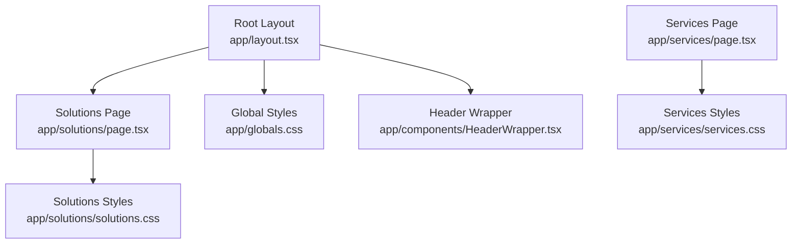
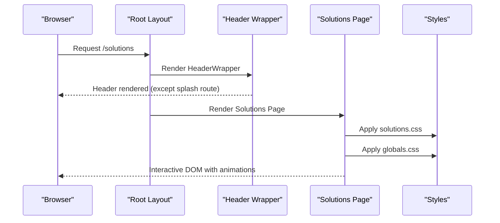
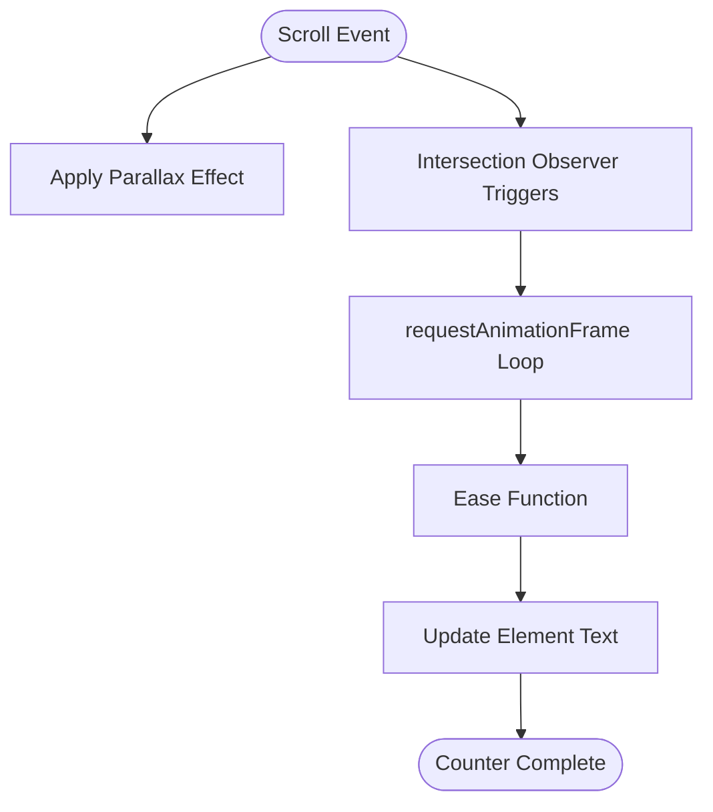
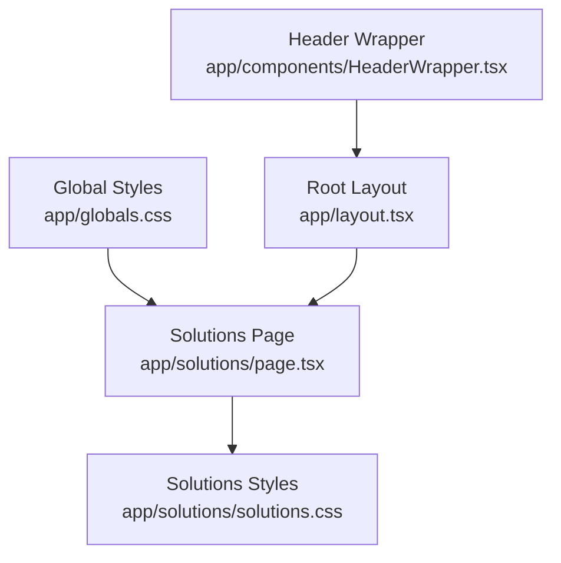

# Solutions Page Component

<cite>
**Referenced Files in This Document**
- [page.tsx](file://app/solutions/page.tsx)
- [solutions.css](file://app/solutions/solutions.css)
- [layout.tsx](file://app/layout.tsx)
- [globals.css](file://app/globals.css)
- [HeaderWrapper.tsx](file://app/components/HeaderWrapper.tsx)
- [services.css](file://app/services/services.css)
- [page.tsx](file://app/services/page.tsx)
</cite>

## Table of Contents
1. [Introduction](#introduction)
2. [Project Structure](#project-structure)
3. [Core Components](#core-components)
4. [Architecture Overview](#architecture-overview)
5. [Detailed Component Analysis](#detailed-component-analysis)
6. [Dependency Analysis](#dependency-analysis)
7. [Performance Considerations](#performance-considerations)
8. [Troubleshooting Guide](#troubleshooting-guide)
9. [Conclusion](#conclusion)
10. [Appendices](#appendices)

## Introduction
This document provides comprehensive documentation for the Solutions Page Component, focusing on how it presents AI security solutions, organizes solution categories, compares features, and integrates interactive elements. It explains the component structure, responsive design implementation, accessibility considerations, SEO optimization, and performance characteristics. It also outlines patterns for adding new solution categories, updating descriptions, integrating diagrams, and maintaining technical accuracy as solutions evolve.

## Project Structure
The Solutions Page is implemented as a Next.js client component with associated styles and global theme definitions. It follows a modular structure with:
- A solutions page component that renders hero, statistics, solution cards, methodology highlights, and a call-to-action section
- A dedicated stylesheet for solutions-specific visuals and animations
- Global styles that define the theme, typography, and base layout
- A layout wrapper that injects shared providers and headers

**Diagram sources**
- [layout.tsx:13-23](file://app/layout.tsx#L13-L23)
- [page.tsx:115-491](file://app/solutions/page.tsx#L115-L491)
- [solutions.css:1-117](file://app/solutions/solutions.css#L1-L117)
- [globals.css:1-800](file://app/globals.css#L1-L800)
- [HeaderWrapper.tsx:7-24](file://app/components/HeaderWrapper.tsx#L7-L24)
- [page.tsx:1-379](file://app/services/page.tsx#L1-L379)
- [services.css:1-5](file://app/services/services.css#L1-L5)

**Section sources**
- [layout.tsx:13-23](file://app/layout.tsx#L13-L23)
- [page.tsx:115-491](file://app/solutions/page.tsx#L115-L491)
- [solutions.css:1-117](file://app/solutions/solutions.css#L1-L117)
- [globals.css:1-800](file://app/globals.css#L1-L800)
- [HeaderWrapper.tsx:7-24](file://app/components/HeaderWrapper.tsx#L7-L24)
- [page.tsx:1-379](file://app/services/page.tsx#L1-L379)
- [services.css:1-5](file://app/services/services.css#L1-L5)

## Core Components
The Solutions Page is composed of several reusable sections and cards:
- Hero section with headline and primary action
- Statistics section with animated counters
- Solution cards grid showcasing feature sets
- Methodology cards highlighting integrated benefits
- Call-to-action panel
- Footer with navigation and branding

Key implementation patterns:
- Client-side interactivity with React hooks for scroll effects, counters, and reveal animations
- CSS custom properties for parallax backgrounds
- Intersection Observers for scroll-triggered animations
- Conditional cursor glow for desktop experiences

**Section sources**
- [page.tsx:115-491](file://app/solutions/page.tsx#L115-L491)
- [solutions.css:1-117](file://app/solutions/solutions.css#L1-L117)

## Architecture Overview
The Solutions Page integrates with the global layout and theme system, applying a cohesive design language across sections. The layout injects providers and manages the header visibility, while the solutions page defines its own visual hierarchy and animations.

**Diagram sources**
- [layout.tsx:13-23](file://app/layout.tsx#L13-L23)
- [HeaderWrapper.tsx:7-24](file://app/components/HeaderWrapper.tsx#L7-L24)
- [page.tsx:115-491](file://app/solutions/page.tsx#L115-L491)
- [solutions.css:1-117](file://app/solutions/solutions.css#L1-L117)
- [globals.css:1-800](file://app/globals.css#L1-L800)

## Detailed Component Analysis

### Hero Section
The hero section establishes the page’s purpose with a centered headline, descriptive copy, and a primary call-to-action button. It uses responsive typography and spacing to ensure readability across devices.

Implementation highlights:
- Centered layout with constrained max-width
- Responsive font sizing using clamp
- Primary button styled consistently with global theme

**Section sources**
- [page.tsx:118-128](file://app/solutions/page.tsx#L118-L128)

### Statistics Section
The statistics section displays key metrics with animated counters that trigger when elements enter the viewport. It uses Intersection Observer to detect visibility and requestAnimationFrame for smooth animations.

**Diagram sources**
- [page.tsx:11-113](file://app/solutions/page.tsx#L11-L113)

**Section sources**
- [page.tsx:130-145](file://app/solutions/page.tsx#L130-L145)
- [solutions.css:51-88](file://app/solutions/solutions.css#L51-L88)

### Solution Cards Grid
The solution cards grid showcases individual AI security features with:
- Consistent card layout using flexbox and grid
- Feature lists with bullet points
- Prominent call-to-action buttons
- Responsive grid that adapts to screen size

Each card encapsulates a solution feature with a title, description, and feature list, promoting clarity and scannability.

**Section sources**
- [page.tsx:147-387](file://app/solutions/page.tsx#L147-L387)

### Methodology Cards
Methodology cards highlight integrated benefits and operational advantages, structured with numbered phases and concise descriptions. These cards reinforce the narrative that solutions work together for comprehensive protection.

**Section sources**
- [page.tsx:389-422](file://app/solutions/page.tsx#L389-L422)

### Call-to-Action Panel
The CTA panel provides a focused conversion opportunity with a headline, supporting copy, and a prominent button. It uses a card-like layout to draw attention while maintaining visual balance.

**Section sources**
- [page.tsx:424-437](file://app/solutions/page.tsx#L424-L437)

### Footer
The footer consolidates navigation, service links, and contact information, with a white background and navy text for contrast against the solutions page’s dark theme.

**Section sources**
- [page.tsx:440-490](file://app/solutions/page.tsx#L440-L490)
- [solutions.css:103-117](file://app/solutions/solutions.css#L103-L117)

### Cursor Effects and Animations
The component implements advanced cursor effects and scroll-driven animations:
- Desktop cursor glow with magnetic feel and trailing particles
- Parallax background movement synchronized with scroll
- Scroll-triggered reveal animations for sections and cards
- Animated counters with easing and decimal support

These enhancements elevate the user experience while preserving performance through efficient animation loops and cleanup.

**Section sources**
- [page.tsx:11-113](file://app/solutions/page.tsx#L11-L113)
- [solutions.css:8-32](file://app/solutions/solutions.css#L8-L32)
- [solutions.css:90-101](file://app/solutions/solutions.css#L90-L101)

## Dependency Analysis
The Solutions Page relies on:
- Global theme variables and typography from global styles
- Layout providers injected by the root layout
- Client-side interactivity via React hooks and browser APIs
- CSS custom properties for dynamic animations

**Diagram sources**
- [globals.css:1-800](file://app/globals.css#L1-L800)
- [page.tsx:115-491](file://app/solutions/page.tsx#L115-L491)
- [solutions.css:1-117](file://app/solutions/solutions.css#L1-L117)
- [layout.tsx:13-23](file://app/layout.tsx#L13-L23)
- [HeaderWrapper.tsx:7-24](file://app/components/HeaderWrapper.tsx#L7-L24)

**Section sources**
- [globals.css:1-800](file://app/globals.css#L1-L800)
- [page.tsx:115-491](file://app/solutions/page.tsx#L115-L491)
- [solutions.css:1-117](file://app/solutions/solutions.css#L1-L117)
- [layout.tsx:13-23](file://app/layout.tsx#L13-L23)
- [HeaderWrapper.tsx:7-24](file://app/components/HeaderWrapper.tsx#L7-L24)

## Performance Considerations
- Efficient scroll handling: Uses passive listeners and requestAnimationFrame for smooth parallax and cursor effects
- Intersection Observers: Minimizes layout thrashing by triggering animations only when elements are in view
- Cleanup: Removes event listeners and cancels animation frames on unmount to prevent memory leaks
- CSS animations: Leverages GPU-accelerated transforms and opacity for fluid transitions
- Conditional desktop effects: Disables heavy effects on mobile to preserve performance

[No sources needed since this section provides general guidance]

## Troubleshooting Guide
Common issues and resolutions:
- Animations not triggering: Verify Intersection Observer thresholds and element visibility
- Parallax not moving: Ensure custom property updates and scroll event listeners are attached
- Counters not animating: Confirm data attributes and observer configuration
- Cursor effects missing: Check for mobile detection and ensure DOM elements exist before attaching listeners

**Section sources**
- [page.tsx:11-113](file://app/solutions/page.tsx#L11-L113)
- [solutions.css:8-32](file://app/solutions/solutions.css#L8-L32)

## Conclusion
The Solutions Page Component delivers a visually engaging, responsive, and performant presentation of AI security solutions. Its modular structure, robust animations, and consistent theming create a compelling user experience. The component’s patterns enable easy extension for new solution categories, feature updates, and interactive enhancements while maintaining accessibility and SEO best practices.

[No sources needed since this section summarizes without analyzing specific files]

## Appendices

### Adding New Solution Categories
To add a new solution category:
- Extend the solution cards grid with a new feature card containing title, description, and feature list
- Ensure consistent styling and responsive behavior
- Add any new CSS variables or animations if required

**Section sources**
- [page.tsx:147-387](file://app/solutions/page.tsx#L147-L387)

### Updating Solution Descriptions
To update solution descriptions:
- Modify the relevant card content within the solutions grid
- Maintain consistent tone and technical accuracy
- Review feature lists for completeness and clarity

**Section sources**
- [page.tsx:147-387](file://app/solutions/page.tsx#L147-L387)

### Integrating Architectural Diagrams
To integrate diagrams:
- Place diagram placeholders within solution sections using grid layouts
- Ensure diagrams are responsive and accessible with appropriate alt text
- Style diagrams to match the page’s visual hierarchy

[No sources needed since this section provides general guidance]

### Maintaining Technical Accuracy
Guidelines for evolving solutions:
- Regularly review feature lists and descriptions for accuracy
- Update statistics and metrics with verified data
- Validate performance and accessibility after major changes

[No sources needed since this section provides general guidance]

### Accessibility Considerations
- Ensure sufficient color contrast for text and interactive elements
- Provide focus states for keyboard navigation
- Use semantic headings and landmarks for screen readers
- Offer alternatives for motion-sensitive effects

[No sources needed since this section provides general guidance]

### SEO Optimization
- Use descriptive headings and meta tags
- Include structured data where applicable
- Optimize images and media for fast loading
- Maintain clean URLs and internal linking

[No sources needed since this section provides general guidance]