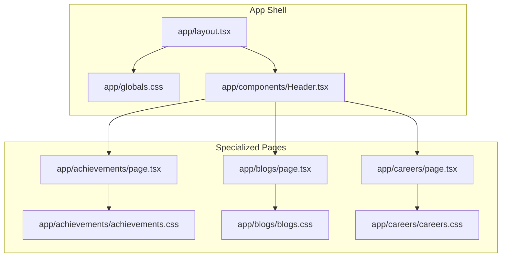
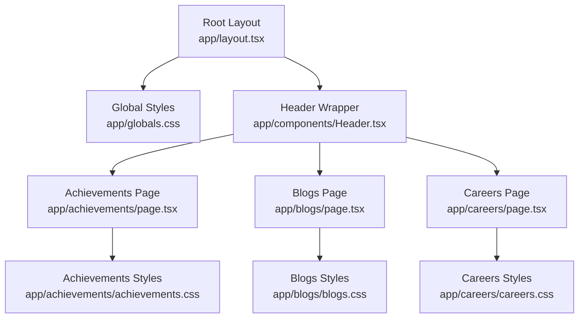
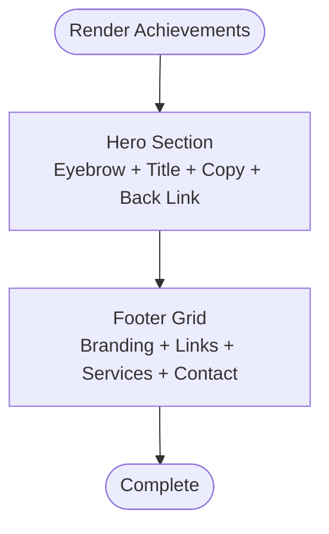
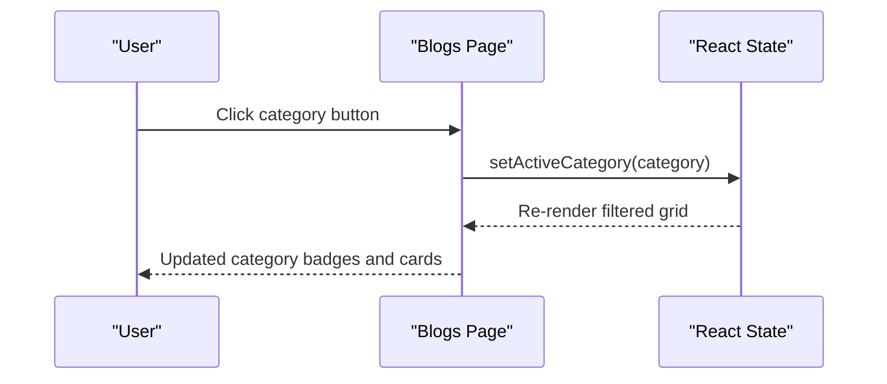
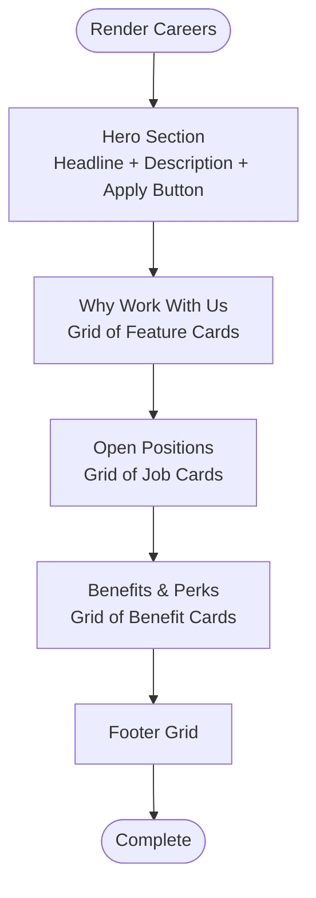
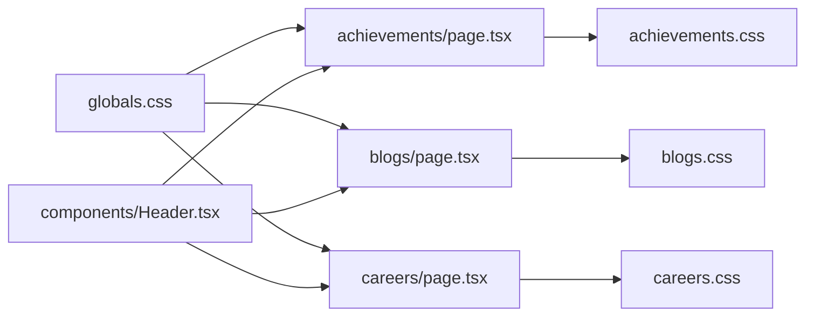

# Specialized Content Pages

<cite>
**Referenced Files in This Document**
- [README.md](file://README.md)
- [app/layout.tsx](file://app/layout.tsx)
- [app/globals.css](file://app/globals.css)
- [app/components/Header.tsx](file://app/components/Header.tsx)
- [app/achievements/page.tsx](file://app/achievements/page.tsx)
- [app/achievements/achievements.css](file://app/achievements/achievements.css)
- [app/blogs/page.tsx](file://app/blogs/page.tsx)
- [app/blogs/blogs.css](file://app/blogs/blogs.css)
- [app/careers/page.tsx](file://app/careers/page.tsx)
- [app/careers/careers.css](file://app/careers/careers.css)
</cite>

## Table of Contents
1. [Introduction](#introduction)
2. [Project Structure](#project-structure)
3. [Core Components](#core-components)
4. [Architecture Overview](#architecture-overview)
5. [Detailed Component Analysis](#detailed-component-analysis)
6. [Dependency Analysis](#dependency-analysis)
7. [Performance Considerations](#performance-considerations)
8. [Troubleshooting Guide](#troubleshooting-guide)
9. [Conclusion](#conclusion)
10. [Appendices](#appendices)

## Introduction
This document focuses on the specialized content pages for achievements, blogs, and careers. It explains the component architecture, content management patterns, pagination strategies, filtering mechanisms, responsive design, styling approach, accessibility, SEO, and performance considerations. It also provides guidance for authoring workflows, adding new content types, managing hierarchies, and keeping content fresh.

## Project Structure
The specialized content pages are implemented as Next.js app router pages under the app directory. Each page is accompanied by its own stylesheet and integrates with the global design system and layout.

**Diagram sources**
- [app/layout.tsx:13-23](file://app/layout.tsx#L13-L23)
- [app/globals.css:1-25](file://app/globals.css#L1-L25)
- [app/components/Header.tsx:10-82](file://app/components/Header.tsx#L10-L82)
- [app/achievements/page.tsx:7-76](file://app/achievements/page.tsx#L7-L76)
- [app/achievements/achievements.css:1-35](file://app/achievements/achievements.css#L1-L35)
- [app/blogs/page.tsx:7-223](file://app/blogs/page.tsx#L7-L223)
- [app/blogs/blogs.css:1-280](file://app/blogs/blogs.css#L1-L280)
- [app/careers/page.tsx:7-183](file://app/careers/page.tsx#L7-L183)
- [app/careers/careers.css:1-372](file://app/careers/careers.css#L1-L372)

**Section sources**
- [app/layout.tsx:13-23](file://app/layout.tsx#L13-L23)
- [app/globals.css:1-25](file://app/globals.css#L1-L25)
- [app/components/Header.tsx:10-82](file://app/components/Header.tsx#L10-L82)

## Core Components
- Achievements page: A minimal hero-based showcase with a footer. It demonstrates a simple content presentation pattern with a clear call-to-action and consistent footer layout.
- Blogs page: A rich listing page featuring category filtering, article cards, pagination placeholders, and a newsletter subscription form. It showcases interactive filtering and grid-based layouts.
- Careers page: A multi-section page with “Why work with us,” “Open positions,” and “Benefits & perks.” It uses responsive grids and card-based layouts for job listings and benefits.

Key patterns:
- Shared design tokens and typography from global CSS.
- Responsive grid layouts using CSS Grid and clamp-based typography.
- Interactive UI elements (buttons, category toggles, pagination).
- Footer integration across pages for consistent branding and navigation.

**Section sources**
- [app/achievements/page.tsx:7-76](file://app/achievements/page.tsx#L7-L76)
- [app/blogs/page.tsx:7-223](file://app/blogs/page.tsx#L7-L223)
- [app/careers/page.tsx:7-183](file://app/careers/page.tsx#L7-L183)
- [app/globals.css:1-800](file://app/globals.css#L1-L800)

## Architecture Overview
The specialized content pages follow a consistent architecture:
- Layout and global styles define the theme and typography.
- Header provides navigation and links to specialized pages.
- Each page implements its own content sections and styles.

**Diagram sources**
- [app/layout.tsx:13-23](file://app/layout.tsx#L13-L23)
- [app/globals.css:1-800](file://app/globals.css#L1-L800)
- [app/components/Header.tsx:10-82](file://app/components/Header.tsx#L10-L82)
- [app/achievements/page.tsx:7-76](file://app/achievements/page.tsx#L7-L76)
- [app/achievements/achievements.css:1-35](file://app/achievements/achievements.css#L1-L35)
- [app/blogs/page.tsx:7-223](file://app/blogs/page.tsx#L7-L223)
- [app/blogs/blogs.css:1-280](file://app/blogs/blogs.css#L1-L280)
- [app/careers/page.tsx:7-183](file://app/careers/page.tsx#L7-L183)
- [app/careers/careers.css:1-372](file://app/careers/careers.css#L1-L372)

## Detailed Component Analysis

### Achievements Page
- Purpose: Present milestones and achievements in a hero-centric layout.
- Structure:
  - Hero section with eyebrow, title, description, and a back-to-home button.
  - Footer with site branding, quick links, services, and contact information.
- Styling:
  - Uses clamp-based typography for responsive headings.
  - Centered hero with constrained max-width content.
  - Footer grid with consistent spacing and typography.

**Diagram sources**
- [app/achievements/page.tsx:7-76](file://app/achievements/page.tsx#L7-L76)
- [app/achievements/achievements.css:1-35](file://app/achievements/achievements.css#L1-L35)

**Section sources**
- [app/achievements/page.tsx:7-76](file://app/achievements/page.tsx#L7-L76)
- [app/achievements/achievements.css:1-35](file://app/achievements/achievements.css#L1-L35)

### Blogs Page
- Purpose: Showcase blog posts with category filtering, pagination, and newsletter signup.
- Structure:
  - Hero section with headline and description.
  - Category filter bar with active state styling.
  - Article grid with cards containing date, category badge, title, excerpt, and link.
  - Pagination controls (placeholders).
  - Newsletter subscription card.
  - Footer with branding and navigation.
- Filtering and Pagination:
  - Client-side category toggle using React state.
  - Pagination UI implemented as static placeholders.
- Responsive Design:
  - Grid uses repeat(auto-fill, minmax(...)) for flexible columns.
  - Clamp-based typography for headings.
  - Flexbox for alignment and wrapping.

**Diagram sources**
- [app/blogs/page.tsx:7-223](file://app/blogs/page.tsx#L7-L223)

**Section sources**
- [app/blogs/page.tsx:7-223](file://app/blogs/page.tsx#L7-L223)
- [app/blogs/blogs.css:1-280](file://app/blogs/blogs.css#L1-L280)

### Careers Page
- Purpose: Present company culture, open positions, and benefits.
- Structure:
  - Hero section with headline, description, and apply button.
  - “Why work with us” grid of feature cards.
  - “Open positions” grid of job cards with tags (department, location, type, level).
  - “Benefits & perks” grid of benefit cards with icons.
  - Footer with branding and navigation.
- Responsive Design:
  - Multiple grids using repeat(auto-fit/auto-fill) with minmax constraints.
  - Consistent card styling and typography scales.

**Diagram sources**
- [app/careers/page.tsx:7-183](file://app/careers/page.tsx#L7-L183)
- [app/careers/careers.css:1-372](file://app/careers/careers.css#L1-L372)

**Section sources**
- [app/careers/page.tsx:7-183](file://app/careers/page.tsx#L7-L183)
- [app/careers/careers.css:1-372](file://app/careers/careers.css#L1-L372)

## Dependency Analysis
- Global design system:
  - Theme tokens and typography are defined in global CSS.
  - Shared components like Header integrate with the layout.
- Page-level styles:
  - Each page defines its own CSS for layout and presentation.
- Interactions:
  - Blogs page uses React state for category filtering.
  - Careers page uses static arrays for content rendering.

**Diagram sources**
- [app/globals.css:1-800](file://app/globals.css#L1-L800)
- [app/components/Header.tsx:10-82](file://app/components/Header.tsx#L10-L82)
- [app/achievements/page.tsx:7-76](file://app/achievements/page.tsx#L7-L76)
- [app/blogs/page.tsx:7-223](file://app/blogs/page.tsx#L7-L223)
- [app/careers/page.tsx:7-183](file://app/careers/page.tsx#L7-L183)
- [app/achievements/achievements.css:1-35](file://app/achievements/achievements.css#L1-L35)
- [app/blogs/blogs.css:1-280](file://app/blogs/blogs.css#L1-L280)
- [app/careers/careers.css:1-372](file://app/careers/careers.css#L1-L372)

**Section sources**
- [app/globals.css:1-800](file://app/globals.css#L1-L800)
- [app/components/Header.tsx:10-82](file://app/components/Header.tsx#L10-L82)

## Performance Considerations
- Client-side filtering:
  - Blogs page filters client-side; for large datasets, consider server-side filtering or virtualization.
- Grid responsiveness:
  - CSS Grid with repeat(auto-fill/auto-fit) is efficient; ensure minimal reflows by avoiding frequent DOM mutations.
- Static content:
  - Achievements and Careers pages render static arrays; keep payload small and lazy-load heavy assets if needed.
- Pagination:
  - Current pagination is UI-only; implement server-side pagination for large archives to reduce initial load.

[No sources needed since this section provides general guidance]

## Troubleshooting Guide
- Category filter not updating:
  - Verify React state is set and re-render occurs after clicking category buttons.
- Grid layout issues:
  - Confirm CSS Grid properties and minmax constraints are correct; test breakpoints.
- Footer links:
  - Ensure internal links use Next.js Link and external links use anchor tags appropriately.
- Typography scaling:
  - Clamp-based sizing requires browser support; verify fallbacks for older browsers.

**Section sources**
- [app/blogs/page.tsx:7-223](file://app/blogs/page.tsx#L7-L223)
- [app/blogs/blogs.css:1-280](file://app/blogs/blogs.css#L1-L280)
- [app/careers/page.tsx:7-183](file://app/careers/page.tsx#L7-L183)
- [app/careers/careers.css:1-372](file://app/careers/careers.css#L1-L372)

## Conclusion
The specialized content pages demonstrate a consistent, modular approach:
- Achievements: Minimal hero presentation with a footer.
- Blogs: Interactive category filtering, responsive grid, and newsletter integration.
- Careers: Multi-section layout with responsive grids for jobs and benefits.

Future enhancements could include server-side filtering/pagination, search integration, and richer SEO metadata for archives.

[No sources needed since this section summarizes without analyzing specific files]

## Appendices

### Accessibility Considerations
- Focus management for category buttons and pagination.
- Semantic headings and landmarks for screen readers.
- Sufficient color contrast for cards and badges.
- Keyboard navigation for interactive elements.

[No sources needed since this section provides general guidance]

### SEO Optimization for Archives
- Add metadata and structured data for blog posts.
- Implement canonical URLs and pagination rel links.
- Optimize images and lazy-load where appropriate.

[No sources needed since this section provides general guidance]

### Authoring Workflows and Content Freshness
- Use static arrays for small, curated lists (as implemented).
- For larger archives, adopt server-side pagination and search.
- Maintain content hierarchies with clear categories and tags.
- Automate freshness by periodically regenerating pages or integrating CMS APIs.

[No sources needed since this section provides general guidance]