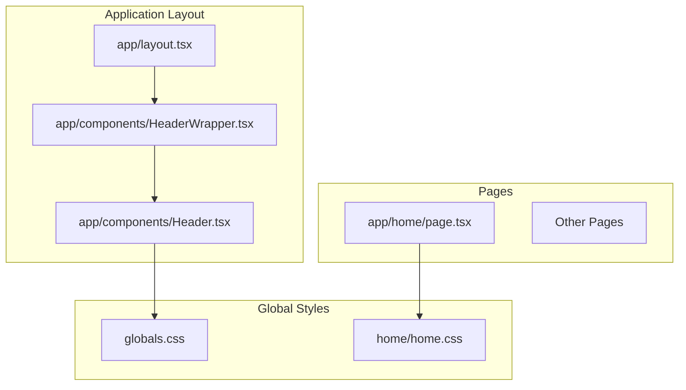
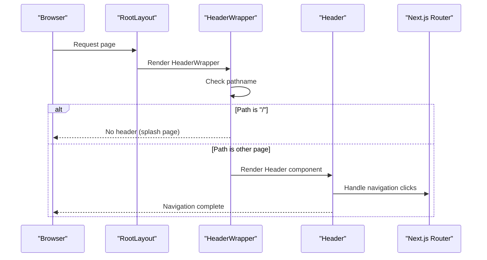
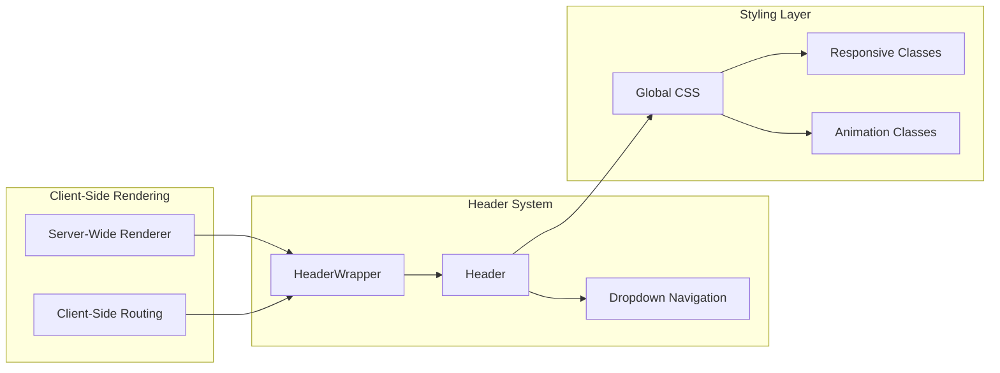
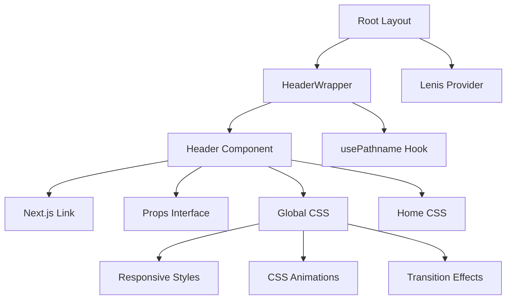

# Header Component

<cite>
**Referenced Files in This Document**
- [Header.tsx](file://app/components/Header.tsx)
- [HeaderWrapper.tsx](file://app/components/HeaderWrapper.tsx)
- [layout.tsx](file://app/layout.tsx)
- [globals.css](file://app/globals.css)
- [home.css](file://app/home/home.css)
- [page.tsx](file://app/home/page.tsx)
</cite>

## Table of Contents
1. [Introduction](#introduction)
2. [Project Structure](#project-structure)
3. [Core Components](#core-components)
4. [Architecture Overview](#architecture-overview)
5. [Detailed Component Analysis](#detailed-component-analysis)
6. [Dependency Analysis](#dependency-analysis)
7. [Performance Considerations](#performance-considerations)
8. [Troubleshooting Guide](#troubleshooting-guide)
9. [Conclusion](#conclusion)

## Introduction
The Header component is the primary navigation element for the Zeex AI website, providing consistent access to site sections and services across all pages. Built with Next.js and TypeScript, it implements a modern, responsive navigation system with dropdown menus, smooth transitions, and accessibility features. The component follows the design system established in the global CSS, ensuring visual consistency with the overall brand identity.

## Project Structure
The Header component is part of a modular component architecture within the Next.js application:



**Diagram sources**
- [layout.tsx:13-23](file://app/layout.tsx#L13-L23)
- [HeaderWrapper.tsx:7-23](file://app/components/HeaderWrapper.tsx#L7-L23)
- [Header.tsx:10-81](file://app/components/Header.tsx#L10-L81)

**Section sources**
- [layout.tsx:1-24](file://app/layout.tsx#L1-L24)
- [HeaderWrapper.tsx:1-25](file://app/components/HeaderWrapper.tsx#L1-L25)
- [Header.tsx:1-83](file://app/components/Header.tsx#L1-L83)

## Core Components
The Header system consists of three primary components working together to provide seamless navigation:

### Header Component
The main Header component renders the navigation bar with logo, primary navigation links, and a call-to-action button. It accepts an `onNavigate` callback prop for handling navigation events.

### HeaderWrapper Component
A wrapper component that conditionally renders the Header based on the current route, hiding it on the splash/home page (`/`) while displaying it on all other pages.

### Global Styling System
The header styling leverages CSS custom properties and responsive design patterns, with specific styles for dropdown menus, hover states, and mobile responsiveness.

**Section sources**
- [Header.tsx:6-8](file://app/components/Header.tsx#L6-L8)
- [HeaderWrapper.tsx:7-23](file://app/components/HeaderWrapper.tsx#L7-L23)
- [globals.css:809-898](file://app/globals.css#L809-L898)

## Architecture Overview
The Header component follows a client-side rendering approach with server-side layout integration:



**Diagram sources**
- [layout.tsx:13-23](file://app/layout.tsx#L13-L23)
- [HeaderWrapper.tsx:7-23](file://app/components/HeaderWrapper.tsx#L7-L23)
- [Header.tsx:10-81](file://app/components/Header.tsx#L10-L81)

## Detailed Component Analysis

### Header Component Implementation
The Header component implements a comprehensive navigation system with the following key features:

#### Props Interface
```typescript
type Props = {
  onNavigate?: (route: string) => void;
};
```

#### Navigation Structure
The component provides access to all major site sections:
- **Primary Navigation**: Home, About, Solutions, Achievements, Blogs, Contact, Careers
- **Services Dropdown**: Comprehensive dropdown menu with six specialized services
- **Call-to-Action**: Prominent "Get Demo" button linking to the home page

#### Responsive Design Features
The header adapts to different screen sizes through CSS media queries:
- Desktop: Full horizontal navigation with dropdown menus
- Tablet/Mobile: Vertical stacking with appropriate spacing adjustments
- Touch-friendly navigation elements with hover states

#### Dropdown Menu System
The Services dropdown implements a sophisticated menu system:
- **Trigger Element**: Services link with animated arrow indicator
- **Menu Container**: Positioned absolutely with smooth fade-in animation
- **Grid Layout**: Three-column layout for service categories
- **Interactive Elements**: Hover effects with background color changes

**Section sources**
- [Header.tsx:10-81](file://app/components/Header.tsx#L10-L81)
- [globals.css:2234-2341](file://app/globals.css#L2234-L2341)

### HeaderWrapper Component
The HeaderWrapper serves as a conditional renderer that controls header visibility based on the current route:

```mermaid
flowchart TD
Start([Component Mount]) --> GetPath[Get Current Pathname]
GetPath --> CheckPath{Is Path "/"?}
CheckPath --> |Yes| RemoveClass[Remove "has-header" class]
CheckPath --> |No| AddClass[Add "has-header" class]
RemoveClass --> HideHeader[Render null]
AddClass --> ShowHeader[Render Header component]
HideHeader --> End([Component Unmount])
ShowHeader --> End
```

**Diagram sources**
- [HeaderWrapper.tsx:7-23](file://app/components/HeaderWrapper.tsx#L7-L23)

**Section sources**
- [HeaderWrapper.tsx:7-23](file://app/components/HeaderWrapper.tsx#L7-L23)

### Styling Approach and Design System
The header implementation follows a cohesive design system:

#### Color Palette Integration
- **Background**: White with navy text for contrast
- **Accent Colors**: Blue (#4a90e8) and cyan (#00e5ff) for highlights
- **Custom Properties**: CSS variables for consistent theming

#### Typography System
- **Font Family**: Inter for clean, modern typography
- **Weight Variations**: 600-700 for navigation items
- **Letter Spacing**: 0.04em for professional appearance

#### Responsive Breakpoints
- **Desktop**: 960px+ viewport width
- **Tablet**: 700px-959px viewport width  
- **Mobile**: Below 700px viewport width

**Section sources**
- [globals.css:1-9](file://app/globals.css#L1-L9)
- [globals.css:809-1132](file://app/globals.css#L809-L1132)

## Architecture Overview

### Component Integration Flow


**Diagram sources**
- [layout.tsx:13-23](file://app/layout.tsx#L13-L23)
- [HeaderWrapper.tsx:7-23](file://app/components/HeaderWrapper.tsx#L7-L23)
- [Header.tsx:10-81](file://app/components/Header.tsx#L10-L81)

## Detailed Component Analysis

### Navigation State Management
The Header component currently implements a static navigation system without internal state management. However, it supports external navigation handling through the `onNavigate` callback prop.

#### Event Handler Implementation
The component includes a single event handler for the demo button:
```typescript
<Link className="btn-nav" href="/home#get-demo" onClick={() => onNavigate?.('home')}>
```

#### Integration Patterns
External components can integrate with the Header through:
- **Callback Prop**: Receiving navigation events via `onNavigate`
- **Route Synchronization**: Working with Next.js router for programmatic navigation
- **State Coordination**: Sharing navigation state with parent components

### Responsive Behavior Implementation
The header achieves responsive behavior through multiple CSS techniques:

#### Flexbox Layout System
The header uses flexbox for adaptive positioning:
- **Fixed Positioning**: Stays at top of viewport during scroll
- **Center Alignment**: Maintains visual balance across screen sizes
- **Gap Management**: Dynamic spacing between elements

#### Media Query Breakpoints
```css
@media (max-width: 960px) {
  .landing-header {
    flex-direction: column;
    align-items: flex-start;
  }
}

@media (max-width: 700px) {
  .hero-actions .btn,
  .btn-nav {
    width: 100%;
  }
}
```

#### Mobile Navigation Considerations
- **Touch Targets**: Minimum 44px touch targets for interactive elements
- **Visual Feedback**: Hover and focus states for accessibility
- **Content Priority**: Essential navigation items remain visible

### Accessibility Features
The header implementation includes several accessibility considerations:

#### Keyboard Navigation Support
- **Focus Management**: Logical tab order through navigation links
- **Keyboard Events**: Support for Enter and Space key activations
- **Screen Reader Compatibility**: Proper semantic HTML structure

#### Screen Reader Enhancements
- **Alt Text**: Descriptive alt attributes for logo imagery
- **Semantic Markup**: Proper heading hierarchy and landmark roles
- **ARIA Attributes**: Optional ARIA roles for enhanced screen reader support

### Integration with Next.js Routing
The Header integrates seamlessly with Next.js routing through:

#### Client-Side Navigation
- **Next/link Integration**: Uses Next.js Link component for client-side navigation
- **Route Preloading**: Leverages Next.js automatic route preloading
- **Navigation State**: Works with Next.js router for programmatic navigation

#### Page Transition Coordination
- **Layout Integration**: Renders within the application layout
- **Transition Timing**: Coordinates with page load animations
- **State Persistence**: Maintains navigation state across page transitions

**Section sources**
- [Header.tsx:10-81](file://app/components/Header.tsx#L10-L81)
- [HeaderWrapper.tsx:7-23](file://app/components/HeaderWrapper.tsx#L7-L23)
- [layout.tsx:13-23](file://app/layout.tsx#L13-L23)

## Dependency Analysis

### Component Dependencies


**Diagram sources**
- [Header.tsx:3-4](file://app/components/Header.tsx#L3-L4)
- [HeaderWrapper.tsx:4](file://app/components/HeaderWrapper.tsx#L4)
- [layout.tsx:3](file://app/layout.tsx#L3)

### External Dependencies
The Header component relies on minimal external dependencies:
- **React**: Core component framework
- **Next.js**: Routing and navigation system
- **TypeScript**: Type safety and development experience

**Section sources**
- [Header.tsx:1-83](file://app/components/Header.tsx#L1-L83)
- [HeaderWrapper.tsx:1-25](file://app/components/HeaderWrapper.tsx#L1-L25)
- [layout.tsx:1-24](file://app/layout.tsx#L1-L24)

## Performance Considerations
The Header component is optimized for performance through several mechanisms:

### Client-Side Rendering Benefits
- **Reduced Server Load**: Client-side rendering minimizes server requests
- **Fast Navigation**: Instant navigation between pages without full reloads
- **State Persistence**: Maintains navigation state across page transitions

### CSS Optimization Strategies
- **Critical CSS**: Essential styles loaded inline for fast initial render
- **Media Query Efficiency**: Optimized breakpoint calculations
- **Animation Performance**: Hardware-accelerated CSS transitions

### Bundle Size Impact
- **Minimal Dependencies**: Single component with no external library dependencies
- **Tree Shaking**: Unused code eliminated through build optimization
- **Code Splitting**: Route-based code splitting for optimal loading

## Troubleshooting Guide

### Common Issues and Solutions

#### Header Not Displaying
**Problem**: Header appears on splash page (`/`)
**Solution**: Verify HeaderWrapper logic checks for pathname equality

#### Navigation Links Not Working
**Problem**: Clicking navigation links doesn't change pages
**Solution**: Ensure Next.js Link components are properly configured

#### Dropdown Menu Not Appearing
**Problem**: Services dropdown menu fails to show
**Solution**: Check CSS hover states and z-index positioning

#### Responsive Issues
**Problem**: Header layout breaks on mobile devices
**Solution**: Verify media query breakpoints and flexbox properties

### Debugging Tips
- **Console Logging**: Add temporary console.log statements in HeaderWrapper
- **CSS Inspection**: Use browser dev tools to inspect element styles
- **Network Monitoring**: Check for failed asset loads or CSS errors
- **Performance Profiling**: Monitor component rendering performance

**Section sources**
- [HeaderWrapper.tsx:11-19](file://app/components/HeaderWrapper.tsx#L11-L19)
- [globals.css:2234-2341](file://app/globals.css#L2234-L2341)

## Conclusion
The Header component successfully implements a modern, responsive navigation system for the Zeex AI website. Through careful integration with Next.js routing, thoughtful CSS design, and accessibility considerations, it provides a seamless user experience across all device types. The component's modular architecture allows for easy customization and extension while maintaining consistency with the overall design system.

The implementation demonstrates best practices in client-side component development, efficient CSS architecture, and responsive design patterns. Future enhancements could include advanced state management, enhanced accessibility features, and expanded customization options while maintaining the component's performance characteristics.