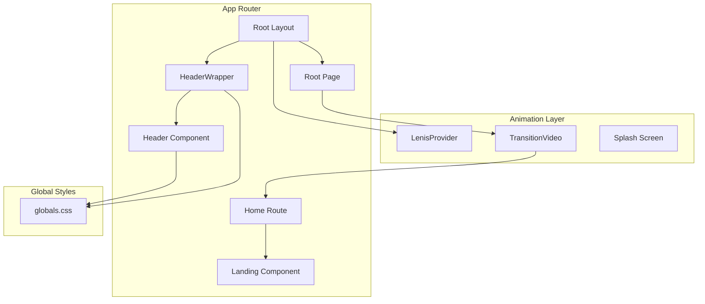
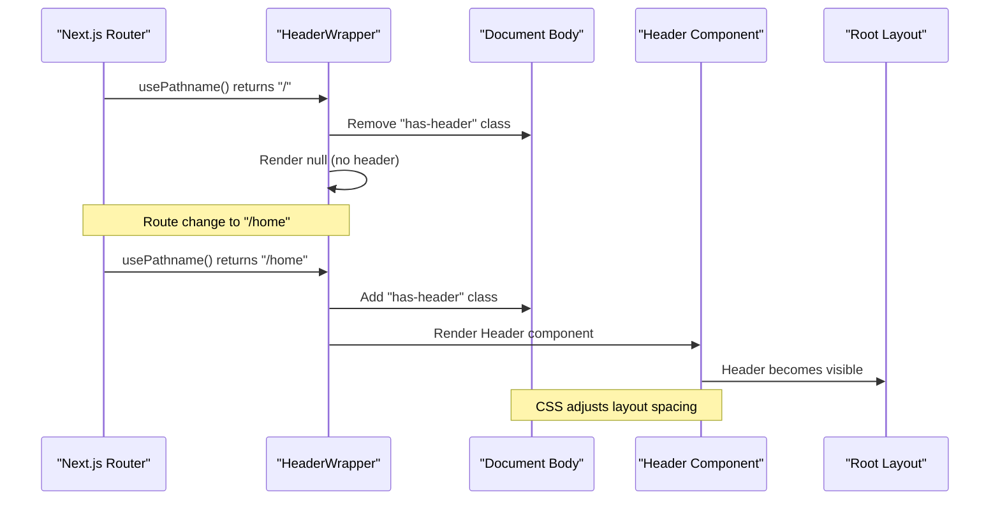
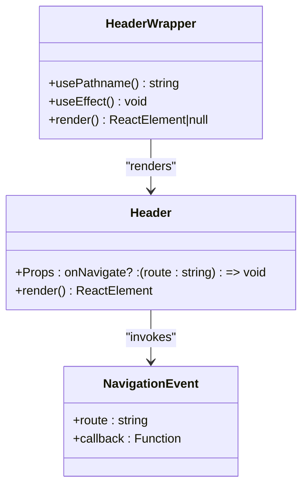
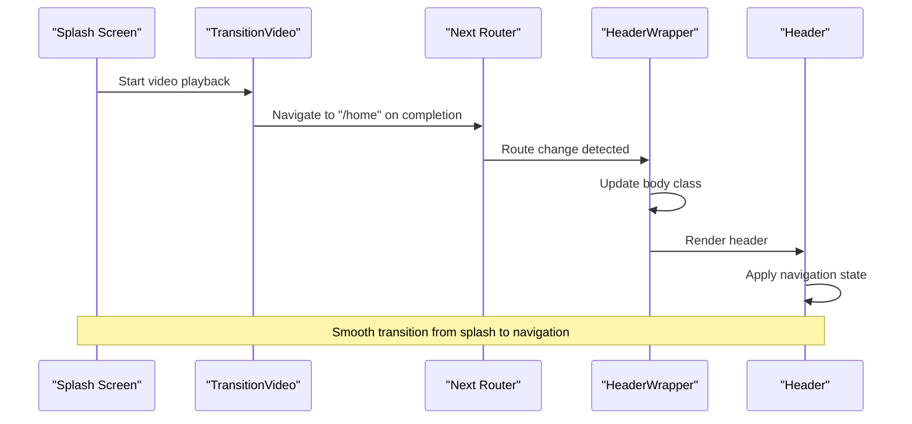
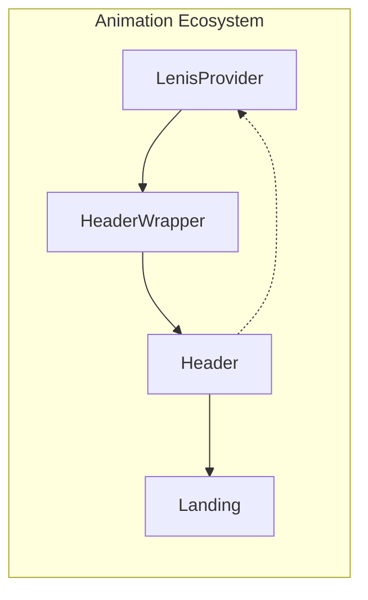
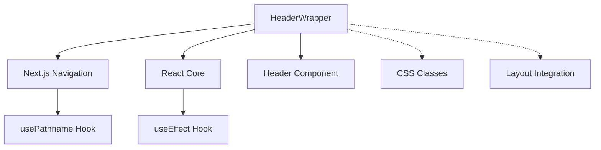

# HeaderWrapper Component

<cite>
**Referenced Files in This Document**
- [HeaderWrapper.tsx](file://app/components/HeaderWrapper.tsx)
- [Header.tsx](file://app/components/Header.tsx)
- [layout.tsx](file://app/layout.tsx)
- [page.tsx](file://app/page.tsx)
- [globals.css](file://app/globals.css)
- [TransitionVideo.tsx](file://app/components/TransitionVideo.tsx)
- [Landing.tsx](file://app/home/Landing.tsx)
- [LenisProvider.jsx](file://components/animations/LenisProvider.jsx)
</cite>

## Table of Contents
1. [Introduction](#introduction)
2. [Project Structure](#project-structure)
3. [Core Components](#core-components)
4. [Architecture Overview](#architecture-overview)
5. [Detailed Component Analysis](#detailed-component-analysis)
6. [Dependency Analysis](#dependency-analysis)
7. [Performance Considerations](#performance-considerations)
8. [Troubleshooting Guide](#troubleshooting-guide)
9. [Conclusion](#conclusion)

## Introduction
HeaderWrapper serves as the navigation state manager and page transition coordinator for the Zeex AI website. It orchestrates header visibility across routes, coordinates the splash-to-home transition flow, and maintains consistent header behavior throughout the application. The component integrates tightly with Next.js app router to detect route changes and manage the header lifecycle, while also coordinating with animation providers and transition sequences.

## Project Structure
The HeaderWrapper component sits at the intersection of routing, layout management, and animation orchestration in the Next.js app router architecture. It works alongside the root layout, splash transition system, and global CSS to provide a seamless navigation experience.



**Diagram sources**
- [layout.tsx:13-22](file://app/layout.tsx#L13-L22)
- [HeaderWrapper.tsx:7-24](file://app/components/HeaderWrapper.tsx#L7-L24)
- [page.tsx:9-54](file://app/page.tsx#L9-L54)

**Section sources**
- [layout.tsx:1-24](file://app/layout.tsx#L1-L24)
- [HeaderWrapper.tsx:1-25](file://app/components/HeaderWrapper.tsx#L1-L25)

## Core Components
HeaderWrapper is a lightweight client component that manages header visibility and integrates with the Next.js app router. Its primary responsibilities include:

- **Route-aware header rendering**: Conditionally renders the header based on the current pathname
- **Body class management**: Controls the presence of the `has-header` CSS class for layout adjustments
- **Transition coordination**: Works with the splash-to-home transition sequence
- **Integration with animation providers**: Coordinates with Lenis scroll provider

The component uses Next.js's `usePathname` hook to detect route changes and React's `useEffect` for side effects, ensuring minimal re-renders and optimal performance.

**Section sources**
- [HeaderWrapper.tsx:7-24](file://app/components/HeaderWrapper.tsx#L7-L24)

## Architecture Overview
HeaderWrapper operates as a bridge between the Next.js app router and the application's visual presentation layer. It manages the relationship between routing state and header visibility while coordinating with the broader animation ecosystem.



**Diagram sources**
- [HeaderWrapper.tsx:10-19](file://app/components/HeaderWrapper.tsx#L10-L19)
- [globals.css:33-36](file://app/globals.css#L33-L36)

**Section sources**
- [HeaderWrapper.tsx:1-25](file://app/components/HeaderWrapper.tsx#L1-L25)
- [layout.tsx:13-22](file://app/layout.tsx#L13-L22)

## Detailed Component Analysis

### HeaderWrapper Implementation
HeaderWrapper implements a simple yet effective pattern for route-aware header management:

```mermaid
flowchart TD
Start([Component Mount]) --> GetPath[Get Current Pathname]
GetPath --> CheckRoot{Is Path "/"?}
CheckRoot --> |Yes| RemoveClass[Remove "has-header" from body]
CheckRoot --> |No| AddClass[Add "has-header" to body]
RemoveClass --> ReturnNull[Return null]
AddClass --> RenderHeader[Render Header component]
RenderHeader --> Cleanup[Cleanup on unmount]
Cleanup --> End([Component Unmount])
ReturnNull --> End
```

**Diagram sources**
- [HeaderWrapper.tsx:7-24](file://app/components/HeaderWrapper.tsx#L7-L24)

The component leverages several key patterns:
- **Conditional rendering**: Returns null for the root splash route to avoid header overlap
- **Side effect management**: Uses cleanup functions to prevent memory leaks
- **CSS integration**: Manages body classes for layout coordination

### Header Component Integration
The Header component receives navigation callbacks through its props interface, enabling bidirectional communication with the navigation system.



**Diagram sources**
- [HeaderWrapper.tsx:7-24](file://app/components/HeaderWrapper.tsx#L7-L24)
- [Header.tsx:6-8](file://app/components/Header.tsx#L6-L8)

**Section sources**
- [HeaderWrapper.tsx:1-25](file://app/components/HeaderWrapper.tsx#L1-L25)
- [Header.tsx:10-82](file://app/components/Header.tsx#L10-L82)

### Transition Coordination System
HeaderWrapper participates in the larger transition coordination system that manages the splash-to-home flow:



**Diagram sources**
- [page.tsx:43-51](file://app/page.tsx#L43-L51)
- [TransitionVideo.tsx:13-37](file://app/components/TransitionVideo.tsx#L13-L37)

**Section sources**
- [page.tsx:1-55](file://app/page.tsx#L1-L55)
- [TransitionVideo.tsx:1-53](file://app/components/TransitionVideo.tsx#L1-L53)

### Animation Provider Integration
HeaderWrapper works in conjunction with the Lenis scroll provider to maintain consistent animation behavior across route transitions:



**Diagram sources**
- [LenisProvider.jsx:1-52](file://components/animations/LenisProvider.jsx#L1-L52)
- [HeaderWrapper.tsx:1-25](file://app/components/HeaderWrapper.tsx#L1-L25)

**Section sources**
- [LenisProvider.jsx:1-52](file://components/animations/LenisProvider.jsx#L1-L52)
- [HeaderWrapper.tsx:1-25](file://app/components/HeaderWrapper.tsx#L1-L25)

## Dependency Analysis
HeaderWrapper has minimal dependencies and maintains low coupling with other system components:



**Diagram sources**
- [HeaderWrapper.tsx:3-5](file://app/components/HeaderWrapper.tsx#L3-L5)

The component's dependencies are intentionally minimal:
- **Next.js navigation**: Uses `usePathname` for route detection
- **React**: Leverages standard hooks for side effects
- **Header component**: Renders the actual navigation UI

**Section sources**
- [HeaderWrapper.tsx:1-25](file://app/components/HeaderWrapper.tsx#L1-L25)

## Performance Considerations
HeaderWrapper is designed for optimal performance through several key strategies:

### Memory Management
- **Cleanup functions**: Properly removes event listeners and CSS classes on unmount
- **Conditional rendering**: Avoids unnecessary DOM nodes for the splash route
- **Minimal state**: Uses only pathname as reactive state

### Rendering Optimization
- **Pure component pattern**: Stateless component with minimal re-renders
- **Efficient DOM manipulation**: Single classList operation per route change
- **Lazy loading**: Header component benefits from Next.js automatic code splitting

### Animation Coordination
- **Non-blocking operations**: CSS class changes don't trigger layout thrashing
- **Integration with Lenis**: Leverages existing scroll animation infrastructure
- **Transition sequencing**: Coordinates with video playback timing

**Section sources**
- [HeaderWrapper.tsx:10-19](file://app/components/HeaderWrapper.tsx#L10-L19)

## Troubleshooting Guide
Common issues and their resolutions when working with HeaderWrapper:

### Header Not Appearing
**Symptoms**: Header remains hidden across routes
**Causes**: 
- JavaScript disabled or not hydrating
- CSS class conflicts
- Route detection failures

**Solutions**:
- Verify `usePathname` is available in client components
- Check for conflicting CSS rules in `globals.css`
- Ensure HeaderWrapper is rendered within the Next.js app router

### Layout Shift Issues
**Symptoms**: Content jumps when header appears/disappears
**Causes**:
- Missing `has-header` class management
- CSS specificity conflicts

**Solutions**:
- Confirm CSS class is properly toggled on route changes
- Verify `globals.css` has correct `.has-header` styles
- Check for other elements adding padding/margins

### Transition Timing Problems
**Symptoms**: Header appears before or after splash transition completes
**Causes**:
- Incorrect route detection timing
- Animation provider conflicts

**Solutions**:
- Ensure HeaderWrapper mounts after splash transition completes
- Verify LenisProvider initialization order
- Check for race conditions in route change detection

**Section sources**
- [HeaderWrapper.tsx:10-19](file://app/components/HeaderWrapper.tsx#L10-L19)
- [globals.css:33-36](file://app/globals.css#L33-L36)

## Conclusion
HeaderWrapper exemplifies clean separation of concerns in Next.js applications. By focusing solely on navigation state management and header coordination, it maintains high performance while providing essential functionality for the Zeex AI website's user experience. The component's minimal dependencies, efficient rendering patterns, and seamless integration with the broader animation ecosystem demonstrate best practices for client-side navigation management in modern React applications.

The component successfully bridges the gap between Next.js routing, visual presentation, and animation systems, providing a foundation that can be extended for more complex navigation scenarios while maintaining optimal performance characteristics.