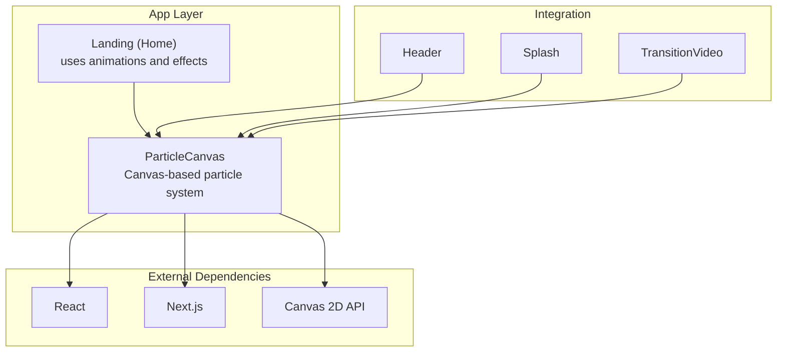
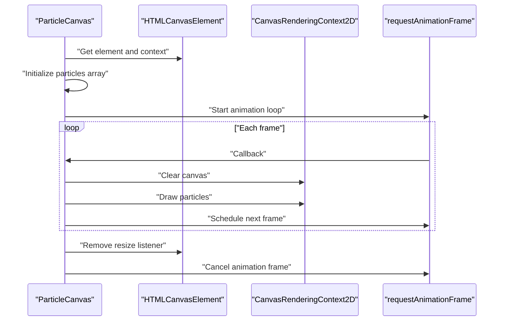
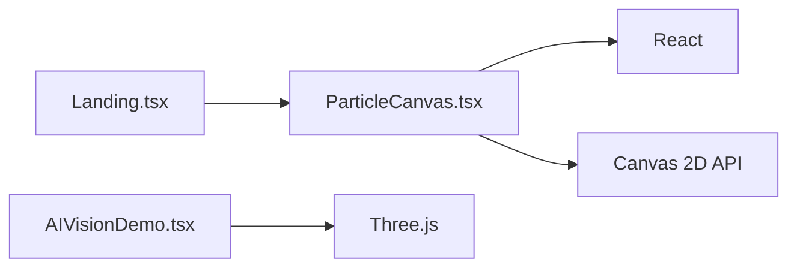

# ParticleCanvas Component

<cite>
**Referenced Files in This Document**
- [ParticleCanvas.tsx](file://app/components/ParticleCanvas.tsx)
- [Landing.tsx](file://app/home/Landing.tsx)
- [AIVisionDemo.tsx](file://app/home/AIVisionDemo.tsx)
- [package.json](file://package.json)
- [component-graph.mmd](file://artifacts/component-graph.mmd)
</cite>

## Table of Contents
1. [Introduction](#introduction)
2. [Project Structure](#project-structure)
3. [Core Components](#core-components)
4. [Architecture Overview](#architecture-overview)
5. [Detailed Component Analysis](#detailed-component-analysis)
6. [Dependency Analysis](#dependency-analysis)
7. [Performance Considerations](#performance-considerations)
8. [Troubleshooting Guide](#troubleshooting-guide)
9. [Conclusion](#conclusion)
10. [Appendices](#appendices)

## Introduction
This document provides a comprehensive guide to the ParticleCanvas component that powers dynamic background particle effects for the Zeex AI website. It explains the canvas-based particle system implementation, performance optimization techniques, and visual effect configurations. It documents the component’s props interface for controlling particle density, movement patterns, colors, and interaction behaviors, and details the animation loop management, memory optimization strategies, and particle physics simulation. It also covers browser compatibility considerations, fallback strategies, and guidance for extending the particle system and integrating it with the overall animation architecture.

## Project Structure
The ParticleCanvas component is a React client-side component that renders a full-screen canvas and animates a collection of 2D particles using the Canvas 2D API. It integrates with the Next.js application via the app directory and is used in conjunction with other animation components in the landing page.

**Diagram sources**
- [Landing.tsx:1-120](file://app/home/Landing.tsx#L1-L120)
- [ParticleCanvas.tsx:1-71](file://app/components/ParticleCanvas.tsx#L1-L71)

**Section sources**
- [Landing.tsx:1-120](file://app/home/Landing.tsx#L1-L120)
- [ParticleCanvas.tsx:1-71](file://app/components/ParticleCanvas.tsx#L1-L71)
- [component-graph.mmd:1-24](file://artifacts/component-graph.mmd#L1-L24)

## Core Components
- ParticleCanvas: A React component that initializes a full-screen canvas, creates a fixed number of particles with randomized positions, velocities, sizes, and colors, and animates them using requestAnimationFrame. It handles resizing and cleanup on unmount.

Key responsibilities:
- Initialize and manage a canvas element.
- Create and update a static array of particle objects.
- Render each frame using Canvas 2D drawing APIs.
- Manage animation lifecycle and event listeners.

Implementation highlights:
- Uses a fixed particle count for simplicity and predictability.
- Implements basic boundary reflection for particles.
- Clears the canvas each frame to prevent motion trails.

**Section sources**
- [ParticleCanvas.tsx:5-70](file://app/components/ParticleCanvas.tsx#L5-L70)

## Architecture Overview
The ParticleCanvas component follows a straightforward architecture:
- Initialization: On mount, it retrieves the canvas element and its 2D rendering context, sets up resize handling, and seeds the particle array.
- Animation Loop: A requestAnimationFrame-driven loop updates particle positions and redraws them.
- Rendering: Each frame clears the canvas and draws circles for each particle.
- Cleanup: Removes event listeners and cancels the animation frame on unmount.

**Diagram sources**
- [ParticleCanvas.tsx:6-67](file://app/components/ParticleCanvas.tsx#L6-L67)

## Detailed Component Analysis

### Props Interface and Configuration
The current implementation does not accept external props. All configuration is internal:
- Particle count: Fixed at initialization.
- Colors: Predefined palette.
- Physics: Constant velocity with boundary reflection.
- Rendering: Circle primitives with per-particle fill color.

Extensibility roadmap (design intent):
- Add props for:
  - density: integer particle count.
  - colors: array of color strings.
  - speedScale: multiplier for particle velocity.
  - sizeRange: min/max size tuple.
  - interactionRadius: proximity-based behaviors.
  - interactionStrength: force magnitude for interactions.
  - enableTrail: boolean to toggle motion trails.
  - backgroundColor: rgba string for background.

These would allow runtime customization without changing the core loop.

**Section sources**
- [ParticleCanvas.tsx:25-37](file://app/components/ParticleCanvas.tsx#L25-L37)
- [ParticleCanvas.tsx:48-57](file://app/components/ParticleCanvas.tsx#L48-L57)

### WebGL Rendering Pipeline
The current implementation uses Canvas 2D for rendering. There is no WebGL pipeline in this component. However, the project includes Three.js dependencies and a separate Three.js-based demo component that demonstrates WebGL rendering patterns and performance considerations.

- Three.js demo uses:
  - WebGLRenderer with transparency and antialiasing.
  - Camera and lighting setup.
  - Device pixel ratio scaling for quality/performance balance.
  - requestAnimationFrame loop for continuous rendering.

This indicates the project is capable of WebGL rendering and can serve as a reference for migrating or augmenting the particle system.

**Section sources**
- [AIVisionDemo.tsx:37-55](file://app/home/AIVisionDemo.tsx#L37-L55)
- [AIVisionDemo.tsx:168-177](file://app/home/AIVisionDemo.tsx#L168-L177)
- [package.json:11-21](file://package.json#L11-L21)

### Animation Loop Management
- Uses requestAnimationFrame for smooth, browser-integrated animation.
- Stores the latest animation frame ID to cancel it during cleanup.
- Clears the canvas each frame to avoid residual artifacts.

Optimization opportunities:
- Batch draw calls by grouping shapes.
- Use OffscreenCanvas for worker-based updates if CPU-bound.
- Implement frame skipping for lower refresh rates on low-power devices.

**Section sources**
- [ParticleCanvas.tsx:39-67](file://app/components/ParticleCanvas.tsx#L39-L67)

### Memory Optimization Strategies
Current practices:
- Static particle array allocated once; reused across frames.
- Minimal per-frame allocations; avoids closures inside the animation loop.

Potential improvements:
- Pool particles to reuse objects and reduce GC pressure.
- Limit particle count dynamically based on device capabilities.
- Use typed arrays for numeric properties to reduce overhead.

**Section sources**
- [ParticleCanvas.tsx:25-37](file://app/components/ParticleCanvas.tsx#L25-L37)
- [ParticleCanvas.tsx:48-57](file://app/components/ParticleCanvas.tsx#L48-L57)

### Particle Physics Simulation and Boundary Handling
Physics model:
- Each particle maintains x, y, vx, vy.
- Position updates by velocity each frame.
- Boundary collisions reverse velocity upon hitting edges.

Collision detection:
- Simple axis-aligned bounding checks against canvas edges.
- Reflective bounce with sign inversion of velocity.

Extension ideas:
- Add gravity, friction, or noise-based movement.
- Implement pairwise collision detection for elastic responses.
- Introduce attractors or repellers for interactive behaviors.

**Section sources**
- [ParticleCanvas.tsx:48-57](file://app/components/ParticleCanvas.tsx#L48-L57)

### Browser Compatibility and Fallbacks
- Canvas 2D is broadly supported across browsers.
- The component checks for canvas and 2D context availability before proceeding.
- On unsupported environments, the component gracefully no-ops.

Fallback strategy:
- If canvas or context is missing, return early without errors.
- Consider a static image fallback for extremely old browsers.

**Section sources**
- [ParticleCanvas.tsx:7-10](file://app/components/ParticleCanvas.tsx#L7-L10)

### Integration with Overall Animation Architecture
- The ParticleCanvas component is used within the landing page and other pages to provide ambient background motion.
- It complements other animation systems (e.g., Three.js demos, GSAP timelines) without interfering with their rendering loops.

Integration tips:
- Place the canvas behind other content using z-index.
- Ensure the canvas fills the viewport and scales with resize events.
- Coordinate with page transitions to pause/resume animation as needed.

**Section sources**
- [Landing.tsx:1-120](file://app/home/Landing.tsx#L1-L120)
- [component-graph.mmd:1-24](file://artifacts/component-graph.mmd#L1-L24)

## Dependency Analysis
- Internal dependencies:
  - React hooks for lifecycle management.
  - Canvas 2D API for rendering.
- External dependencies (project-wide):
  - React and Next.js for framework support.
  - No explicit particle library is used; the component is self-contained.

**Diagram sources**
- [ParticleCanvas.tsx:1-3](file://app/components/ParticleCanvas.tsx#L1-L3)
- [Landing.tsx:1-120](file://app/home/Landing.tsx#L1-L120)
- [AIVisionDemo.tsx:1-10](file://app/home/AIVisionDemo.tsx#L1-L10)
- [package.json:11-21](file://package.json#L11-L21)

**Section sources**
- [package.json:11-21](file://package.json#L11-L21)
- [ParticleCanvas.tsx:1-3](file://app/components/ParticleCanvas.tsx#L1-L3)

## Performance Considerations
- Frame budget: Aim for 60fps; monitor with requestAnimationFrame timestamps if needed.
- Particle count: Reduce count on lower-end devices; consider adaptive density.
- Rendering cost: Minimize per-particle draw calls; batch where possible.
- Memory: Reuse particle objects; avoid frequent allocations.
- Resize handling: Debounce resize events to prevent excessive reinitialization.
- Motion trails: Disable or fade trails for smoother performance.

[No sources needed since this section provides general guidance]

## Troubleshooting Guide
Common issues and resolutions:
- Canvas not rendering:
  - Verify the canvas element exists and has non-zero dimensions.
  - Ensure the component is client-only and runs after hydration.
- Poor performance:
  - Lower particle count or simplify physics.
  - Avoid heavy per-frame computations inside the animation loop.
- Motion trails or ghosting:
  - Confirm the canvas is cleared each frame.
  - Check global composite operation settings.
- Resize glitches:
  - Ensure resize handler updates both width/height and CSS size.
  - Remove event listeners on unmount.

**Section sources**
- [ParticleCanvas.tsx:12-23](file://app/components/ParticleCanvas.tsx#L12-L23)
- [ParticleCanvas.tsx:40-47](file://app/components/ParticleCanvas.tsx#L40-L47)
- [ParticleCanvas.tsx:63-67](file://app/components/ParticleCanvas.tsx#L63-L67)

## Conclusion
The ParticleCanvas component delivers a lightweight, efficient, and visually engaging background animation using Canvas 2D. Its simple physics model and straightforward rendering pipeline make it easy to integrate and optimize. While it currently lacks external props and WebGL rendering, the project’s broader animation ecosystem (including Three.js) provides a clear path for future enhancements such as dynamic configuration, WebGL migration, and advanced particle interactions.

[No sources needed since this section summarizes without analyzing specific files]

## Appendices

### Implementation Examples and Customization Guidance
- Customize particle appearance:
  - Adjust colors array to change palette.
  - Modify size range and velocity range during initialization.
- Adjust animation speed:
  - Scale velocity values to increase or decrease movement.
- Optimize for different screen sizes:
  - Dynamically compute particle count based on viewport area.
  - Use device pixel ratio awareness for crisp rendering.
- Extend the system:
  - Add props for density, colors, speedScale, sizeRange, interactionRadius, interactionStrength, enableTrail, backgroundColor.
  - Implement pairwise collision detection and elastic responses.
  - Integrate with WebGL for GPU-accelerated rendering and larger particle counts.

[No sources needed since this section provides general guidance]