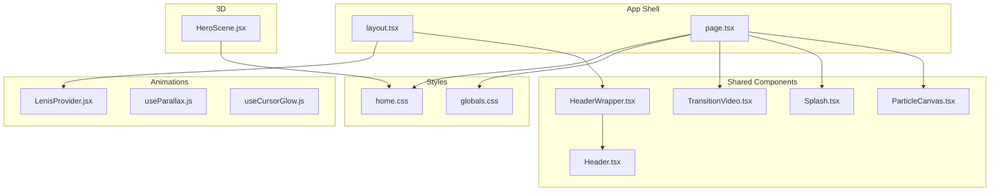
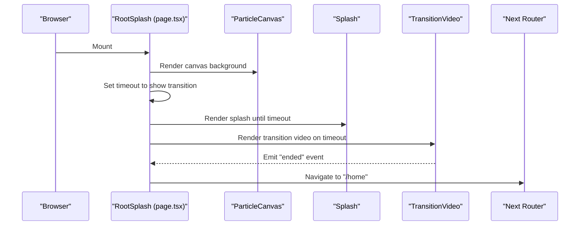
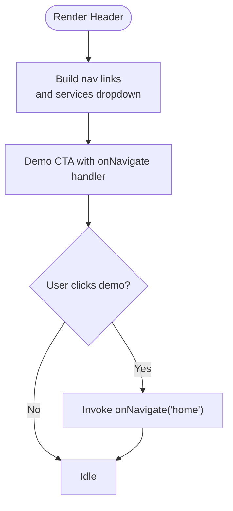
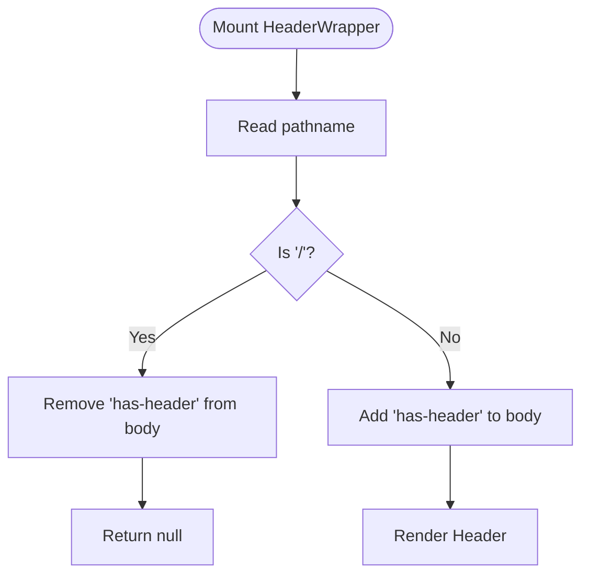
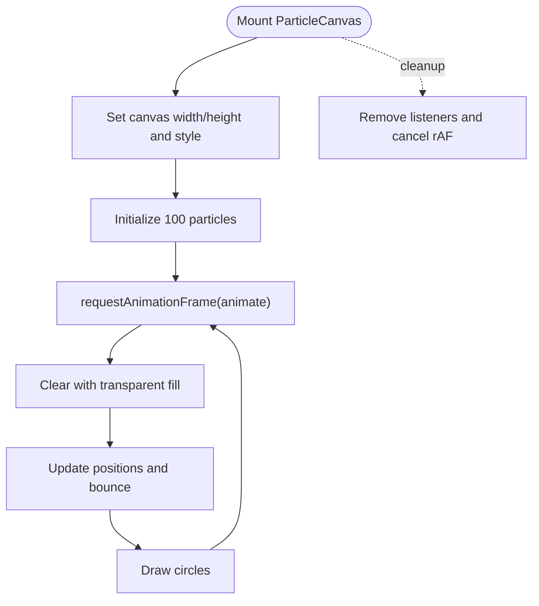
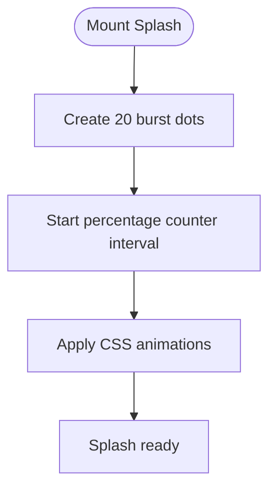
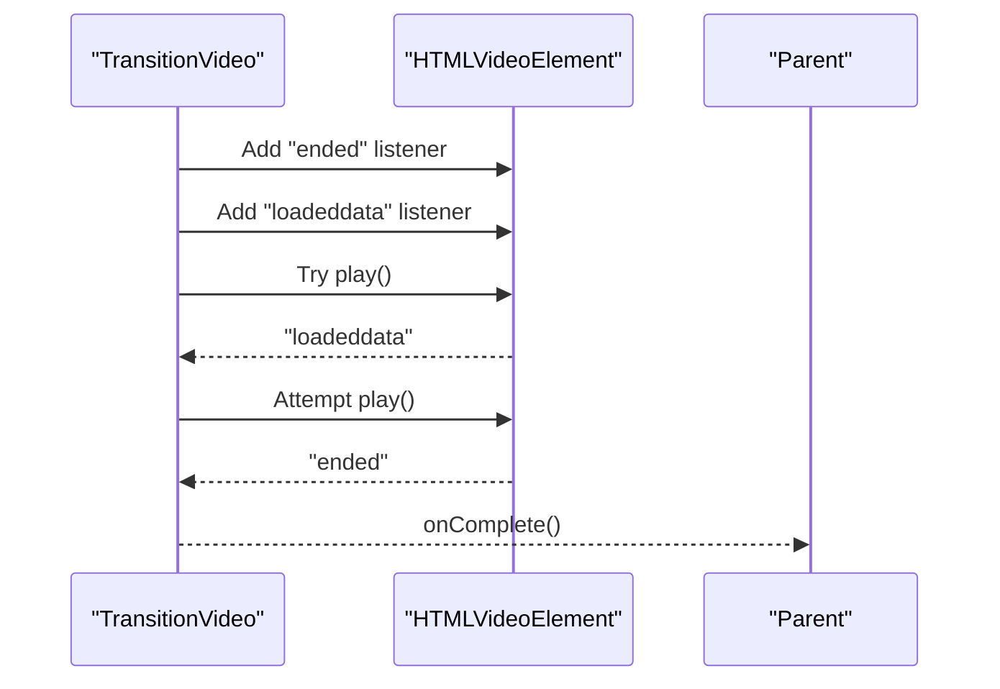
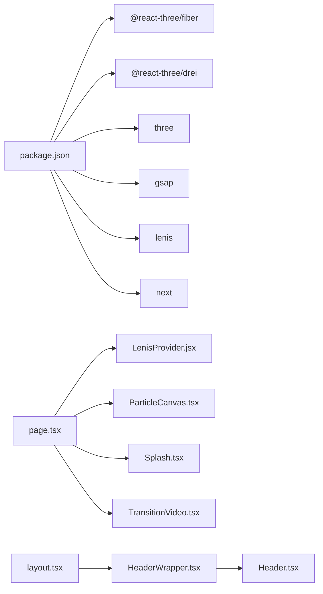

# Shared Components

<cite>
**Referenced Files in This Document**
- [Header.tsx](file://app/components/Header.tsx)
- [HeaderWrapper.tsx](file://app/components/HeaderWrapper.tsx)
- [ParticleCanvas.tsx](file://app/components/ParticleCanvas.tsx)
- [Splash.tsx](file://app/components/Splash.tsx)
- [TransitionVideo.tsx](file://app/components/TransitionVideo.tsx)
- [layout.tsx](file://app/layout.tsx)
- [page.tsx](file://app/page.tsx)
- [globals.css](file://app/globals.css)
- [home.css](file://app/home/home.css)
- [HeroScene.jsx](file://components/3d/HeroScene.jsx)
- [LenisProvider.jsx](file://components/animations/LenisProvider.jsx)
- [useParallax.js](file://components/animations/useParallax.js)
- [useCursorGlow.js](file://components/animations/useCursorGlow.js)
- [package.json](file://package.json)
</cite>

## Table of Contents
1. [Introduction](#introduction)
2. [Project Structure](#project-structure)
3. [Core Components](#core-components)
4. [Architecture Overview](#architecture-overview)
5. [Detailed Component Analysis](#detailed-component-analysis)
6. [Dependency Analysis](#dependency-analysis)
7. [Performance Considerations](#performance-considerations)
8. [Troubleshooting Guide](#troubleshooting-guide)
9. [Conclusion](#conclusion)
10. [Appendices](#appendices)

## Introduction
This document describes the shared UI components that form the foundation of the Zeex AI website’s immersive experience. It focuses on:
- Header and navigation state management
- Background particle effects and performance
- Entrance splash and initial page load effects
- Smooth page transition video playback
- Styling with CSS modules and visual consistency
- Animation system integration (scroll, cursor glow, parallax)
- Accessibility, responsiveness, and cross-browser compatibility
- Extensibility and reuse patterns

## Project Structure
The shared components live under app/components and are integrated via the root layout and the splash/home pages. Supporting animation utilities and 3D rendering are located under components/animations and components/3d respectively.

**Diagram sources**
- [layout.tsx:13-23](file://app/layout.tsx#L13-L23)
- [page.tsx:9-54](file://app/page.tsx#L9-L54)
- [HeaderWrapper.tsx:7-24](file://app/components/HeaderWrapper.tsx#L7-L24)
- [Header.tsx:10-82](file://app/components/Header.tsx#L10-L82)
- [ParticleCanvas.tsx:5-70](file://app/components/ParticleCanvas.tsx#L5-L70)
- [Splash.tsx:5-73](file://app/components/Splash.tsx#L5-L73)
- [TransitionVideo.tsx:10-52](file://app/components/TransitionVideo.tsx#L10-L52)
- [LenisProvider.jsx:5-51](file://components/animations/LenisProvider.jsx#L5-L51)
- [useParallax.js:1-31](file://components/animations/useParallax.js#L1-L31)
- [useCursorGlow.js:1-26](file://components/animations/useCursorGlow.js#L1-L26)
- [HeroScene.jsx:23-36](file://components/3d/HeroScene.jsx#L23-L36)
- [globals.css:40-48](file://app/globals.css#L40-L48)
- [home.css:132-141](file://app/home/home.css#L132-L141)

**Section sources**
- [layout.tsx:13-23](file://app/layout.tsx#L13-L23)
- [page.tsx:9-54](file://app/page.tsx#L9-L54)
- [globals.css:40-48](file://app/globals.css#L40-L48)
- [home.css:132-141](file://app/home/home.css#L132-L141)

## Core Components
- Header: Navigation bar with dropdown services and a demo CTA. Exposes an onNavigate callback for external state updates.
- HeaderWrapper: Conditionally renders the Header based on current route and toggles body classes for layout adjustments.
- ParticleCanvas: Canvas-based particle system for background ambiance with resize handling and animation loop.
- Splash: Entrypage loader with animated rings, radar sweep, bracket accents, and a percentage counter.
- TransitionVideo: Fullscreen video player for page transitions with autoplay handling and completion callback.

**Section sources**
- [Header.tsx:6-82](file://app/components/Header.tsx#L6-L82)
- [HeaderWrapper.tsx:7-24](file://app/components/HeaderWrapper.tsx#L7-L24)
- [ParticleCanvas.tsx:5-70](file://app/components/ParticleCanvas.tsx#L5-L70)
- [Splash.tsx:5-73](file://app/components/Splash.tsx#L5-L73)
- [TransitionVideo.tsx:5-52](file://app/components/TransitionVideo.tsx#L5-L52)

## Architecture Overview
The splash page orchestrates the initial experience, rendering background particles, HUD overlays, and the splash animation. After a timed delay, it triggers a transition video that navigates to the home route upon completion. The layout injects global styles, a scroll provider, and the persistent header wrapper.

**Diagram sources**
- [page.tsx:9-54](file://app/page.tsx#L9-L54)
- [ParticleCanvas.tsx:5-70](file://app/components/ParticleCanvas.tsx#L5-L70)
- [Splash.tsx:5-73](file://app/components/Splash.tsx#L5-L73)
- [TransitionVideo.tsx:10-37](file://app/components/TransitionVideo.tsx#L10-L37)

## Detailed Component Analysis

### Header Component
- Purpose: Provides primary navigation and a call-to-action for demos.
- Props:
  - onNavigate?: (route: string) => void — optional callback invoked on demo CTA click.
- State management: None; relies on parent to manage navigation state externally.
- Navigation logic: Uses Next.js Link for internal navigation and a button-like anchor for the demo CTA.
- Responsive behavior: Implemented via CSS media queries and layout classes in globals.css and page-specific styles.
- Accessibility: Links are semantic anchors; consider adding aria-current for active states if needed.

**Diagram sources**
- [Header.tsx:10-82](file://app/components/Header.tsx#L10-L82)

**Section sources**
- [Header.tsx:6-82](file://app/components/Header.tsx#L6-L82)
- [globals.css:33-36](file://app/globals.css#L33-L36)

### HeaderWrapper Component
- Purpose: Conditionally renders the Header based on the current path and toggles a body class to adjust page layout.
- Behavior:
  - On path '/' (splash), hides the header and removes the 'has-header' class.
  - Elsewhere, adds 'has-header' to body and renders the Header.
- Side effects: Manipulates document.body classes during mount/unmount.
- Integration: Consumed by the root layout to ensure consistent header presence across pages.

**Diagram sources**
- [HeaderWrapper.tsx:7-24](file://app/components/HeaderWrapper.tsx#L7-L24)
- [layout.tsx:13-23](file://app/layout.tsx#L13-L23)

**Section sources**
- [HeaderWrapper.tsx:7-24](file://app/components/HeaderWrapper.tsx#L7-L24)
- [layout.tsx:13-23](file://app/layout.tsx#L13-L23)
- [globals.css:33-36](file://app/globals.css#L33-L36)

### ParticleCanvas Component
- Purpose: Renders a particle field on a full-viewport canvas for ambient background visuals.
- Initialization:
  - Resizes canvas to match device pixel ratio and CSS size.
  - Creates 100 particles with random positions, velocities, sizes, and colors.
- Animation loop:
  - Clears with a transparent fill to prevent trails.
  - Updates positions and draws circles per frame.
  - Uses requestAnimationFrame for smooth looping.
- Cleanup:
  - Removes resize listener and cancels animation frame on unmount.
- Performance considerations:
  - Fixed count of 100 particles balances quality and performance.
  - Transparent clears minimize overdraw.
  - Consider limiting FPS or reducing particle count on lower-end devices.

**Diagram sources**
- [ParticleCanvas.tsx:5-70](file://app/components/ParticleCanvas.tsx#L5-L70)

**Section sources**
- [ParticleCanvas.tsx:5-70](file://app/components/ParticleCanvas.tsx#L5-L70)
- [globals.css:43-48](file://app/globals.css#L43-L48)

### Splash Component
- Purpose: Initial loading screen with animated rings, radar sweep, corner brackets, and a percentage counter.
- Effects:
  - Dynamically creates 20 burst dots inside the logo area.
  - Counts up the percentage with a randomized interval.
- DOM interactions: Creates and appends elements to the DOM; cleans up intervals on unmount.
- Visual consistency: Achieved through CSS keyframes and layered pseudo-elements.

**Diagram sources**
- [Splash.tsx:5-73](file://app/components/Splash.tsx#L5-L73)

**Section sources**
- [Splash.tsx:5-73](file://app/components/Splash.tsx#L5-L73)
- [globals.css:117-140](file://app/globals.css#L117-L140)
- [globals.css:160-218](file://app/globals.css#L160-L218)
- [globals.css:220-249](file://app/globals.css#L220-L249)
- [globals.css:251-326](file://app/globals.css#L251-L326)
- [globals.css:376-395](file://app/globals.css#L376-L395)

### TransitionVideo Component
- Purpose: Plays a fullscreen transition video and notifies the parent when finished.
- Props:
  - src?: string — video source path (defaults to a configured asset).
  - onComplete: () => void — callback invoked on video ended.
- Autoplay handling:
  - Attempts play on 'loadeddata'.
  - Ensures a delayed play attempt to mitigate autoplay policies.
  - Cleans up event listeners and timeouts on unmount.
- Z-index and layout: Fixed-position overlay with full viewport coverage.

**Diagram sources**
- [TransitionVideo.tsx:10-37](file://app/components/TransitionVideo.tsx#L10-L37)

**Section sources**
- [TransitionVideo.tsx:5-52](file://app/components/TransitionVideo.tsx#L5-L52)

## Dependency Analysis
- Runtime dependencies include Three.js, @react-three/fiber, @react-three/drei, GSAP, Lenis, and Next.js.
- The splash page dynamically imports LenisProvider to avoid SSR overhead.
- HeaderWrapper depends on Next.js navigation to determine visibility.

**Diagram sources**
- [package.json:11-21](file://package.json#L11-L21)
- [page.tsx:13-17](file://app/page.tsx#L13-L17)
- [layout.tsx:3-6](file://app/layout.tsx#L3-L6)

**Section sources**
- [package.json:11-21](file://package.json#L11-L21)
- [page.tsx:13-17](file://app/page.tsx#L13-L17)
- [layout.tsx:3-6](file://app/layout.tsx#L3-L6)

## Performance Considerations
- Canvas particle system:
  - Keep particle count constant; consider adaptive counts based on device capabilities.
  - Use offscreen canvases or WebGL for higher particle counts.
  - Debounce resize handlers to reduce layout thrashing.
- Transition video:
  - Preload video resources; ensure codec compatibility across browsers.
  - Consider poster image fallbacks for slow connections.
- Scroll and parallax:
  - Use efficient scroll libraries (Lenis) and register plugins conditionally.
  - Avoid heavy transforms on large DOM subtrees; prefer transform3d where possible.
- Cursor glow:
  - Mobile detection prevents unnecessary DOM creation.
- CSS animations:
  - Prefer transform and opacity for GPU acceleration.
  - Minimize forced synchronous layouts; batch DOM reads/writes.

[No sources needed since this section provides general guidance]

## Troubleshooting Guide
- Header not visible on splash:
  - Verify pathname logic and body class toggling in HeaderWrapper.
  - Confirm layout.tsx includes HeaderWrapper.
- Navigation not triggering:
  - Ensure onNavigate is passed down from the parent and invoked on demo CTA click.
- Particles not rendering:
  - Check canvas availability and context initialization.
  - Verify resize listener executes on mount and cleanup on unmount.
- Splash percentage counter stuck:
  - Confirm interval is cleared on unmount.
  - Ensure DOM queries for the percentage element succeed.
- Transition video not playing:
  - Inspect autoplay policy handling and event listener cleanup.
  - Validate video source path and MIME type.
- Scroll behavior anomalies:
  - Confirm LenisProvider is loaded client-side and plugins are registered.
  - Ensure ScrollTrigger is available before use.

**Section sources**
- [HeaderWrapper.tsx:7-24](file://app/components/HeaderWrapper.tsx#L7-L24)
- [layout.tsx:13-23](file://app/layout.tsx#L13-L23)
- [Header.tsx:6-82](file://app/components/Header.tsx#L6-L82)
- [ParticleCanvas.tsx:5-70](file://app/components/ParticleCanvas.tsx#L5-L70)
- [Splash.tsx:5-73](file://app/components/Splash.tsx#L5-L73)
- [TransitionVideo.tsx:10-37](file://app/components/TransitionVideo.tsx#L10-L37)
- [LenisProvider.jsx:5-51](file://components/animations/LenisProvider.jsx#L5-L51)

## Conclusion
These shared components establish a cohesive visual identity and smooth user experience across the Zeex AI website. They integrate seamlessly with the animation stack and 3D rendering pipeline while maintaining performance and accessibility best practices. Extending these components should focus on preserving their modular contracts, leveraging CSS for styling, and adhering to the established animation ecosystem.

[No sources needed since this section summarizes without analyzing specific files]

## Appendices

### Styling and Visual Consistency
- CSS Modules and global styles:
  - Centralized palette and base styles in globals.css.
  - Component-specific overlays (grid, scan line, HUD corners, data labels) use layered z-indexes.
- 3D scene integration:
  - HeroScene is positioned absolutely and mixed with blend modes for depth.
- Cursor glow and parallax:
  - Optional lightweight helpers enhance UX without impacting core functionality.

**Section sources**
- [globals.css:1-800](file://app/globals.css#L1-L800)
- [home.css:132-141](file://app/home/home.css#L132-L141)
- [HeroScene.jsx:23-36](file://components/3d/HeroScene.jsx#L23-L36)
- [useCursorGlow.js:1-26](file://components/animations/useCursorGlow.js#L1-L26)
- [useParallax.js:1-31](file://components/animations/useParallax.js#L1-L31)

### Accessibility and Responsiveness
- Accessibility:
  - Use semantic anchors for navigation.
  - Provide ARIA attributes where dynamic overlays require labeling.
- Responsiveness:
  - Utilize clamp() and viewport units for scalable typography and spacing.
  - Media queries adapt layouts for smaller screens.

[No sources needed since this section provides general guidance]