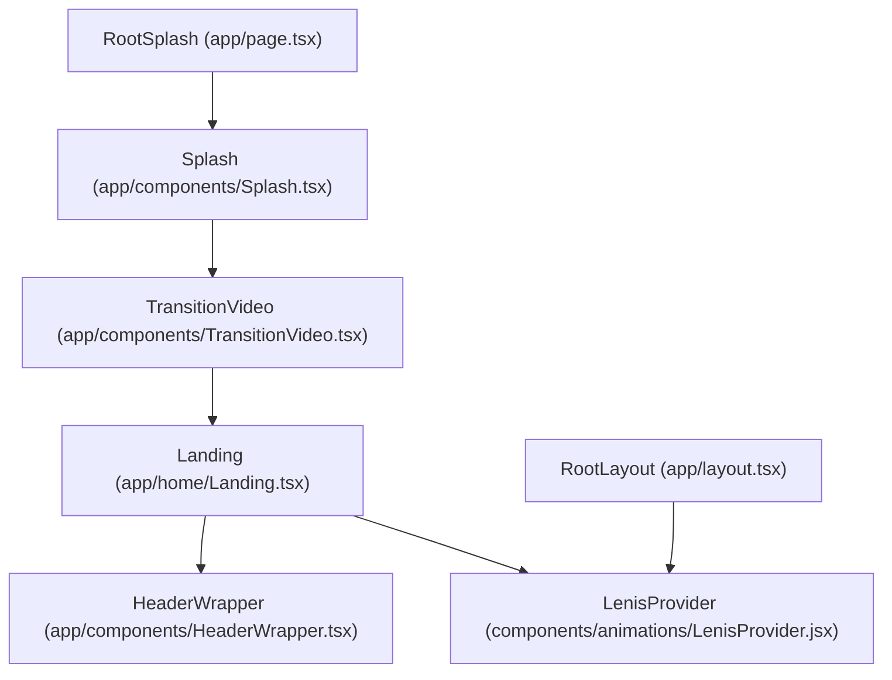
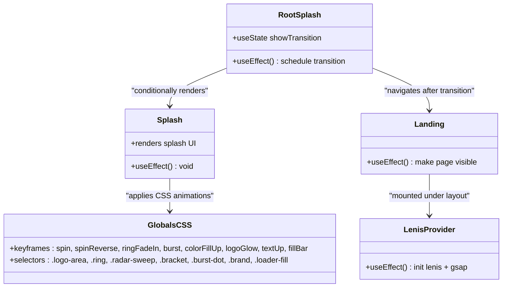
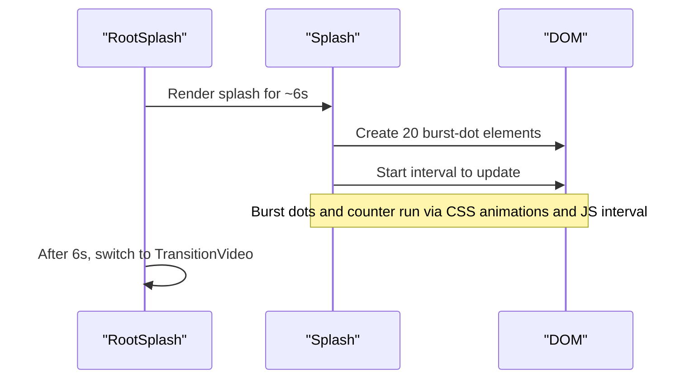
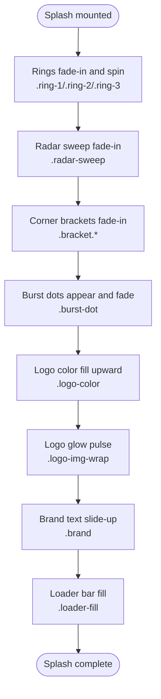
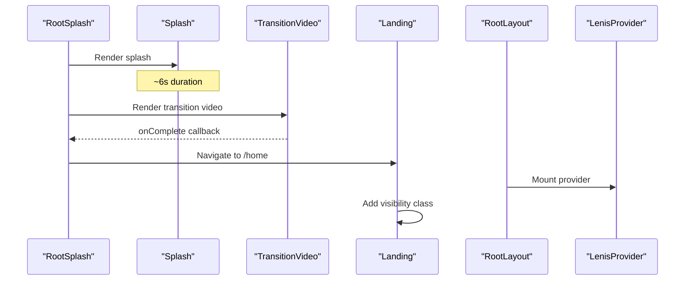
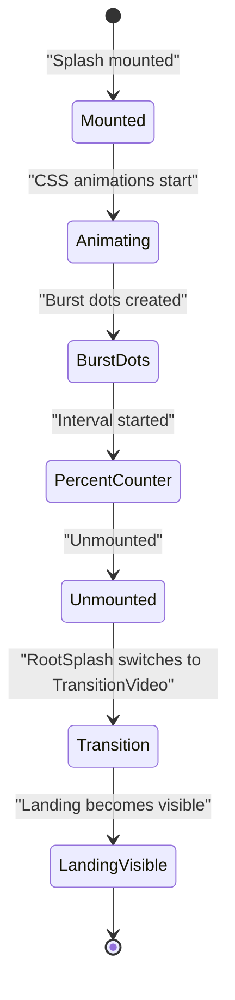
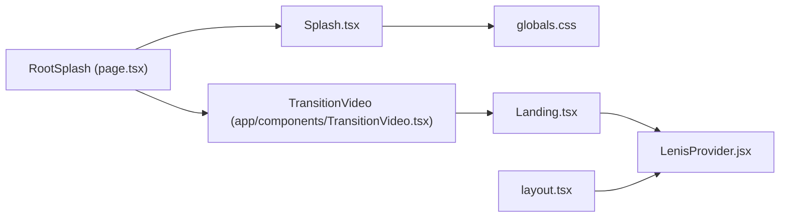

# Splash Component

<cite>
**Referenced Files in This Document**
- [Splash.tsx](file://app/components/Splash.tsx)
- [RootSplash page.tsx](file://app/page.tsx)
- [Landing.tsx](file://app/home/Landing.tsx)
- [layout.tsx](file://app/layout.tsx)
- [LenisProvider.jsx](file://components/animations/LenisProvider.jsx)
- [globals.css](file://app/globals.css)
- [home.css](file://app/home/home.css)
- [component-graph.mmd](file://artifacts/component-graph.mmd)
</cite>

## Table of Contents
1. [Introduction](#introduction)
2. [Project Structure](#project-structure)
3. [Core Components](#core-components)
4. [Architecture Overview](#architecture-overview)
5. [Detailed Component Analysis](#detailed-component-analysis)
6. [Dependency Analysis](#dependency-analysis)
7. [Performance Considerations](#performance-considerations)
8. [Troubleshooting Guide](#troubleshooting-guide)
9. [Conclusion](#conclusion)
10. [Appendices](#appendices)

## Introduction
This document explains the Splash component responsible for entrance animations and initial page load effects on the Zeex AI website. It covers the animation sequence implementation, timing controls, visual transition patterns, integration with the animation system, lifecycle and cleanup, and guidance for customization and accessibility.

## Project Structure
The Splash component participates in a staged entry flow:
- The root page conditionally renders the Splash component for six seconds.
- After the Splash completes, a transition video plays and navigates to the home route.
- The home route mounts the Landing component, which reveals itself and triggers subsequent page animations.

**Diagram sources**
- [RootSplash page.tsx:9-54](file://app/page.tsx#L9-L54)
- [Splash.tsx:5-74](file://app/components/Splash.tsx#L5-L74)
- [Landing.tsx:60-192](file://app/home/Landing.tsx#L60-L192)
- [layout.tsx:13-23](file://app/layout.tsx#L13-L23)
- [LenisProvider.jsx:5-52](file://components/animations/LenisProvider.jsx#L5-L52)

**Section sources**
- [RootSplash page.tsx:9-54](file://app/page.tsx#L9-L54)
- [component-graph.mmd:1-24](file://artifacts/component-graph.mmd#L1-L24)

## Core Components
- Splash: Renders the animated splash UI and orchestrates initial entrance effects.
- RootSplash: Controls the lifecycle of the splash and transition to the home route.
- Landing: Reveals the main landing page and coordinates further animations.
- LenisProvider: Provides scroll-driven motion orchestration for the rest of the site.

Key responsibilities:
- Splash creates burst particles and drives a percentage counter.
- RootSplash manages the six-second splash duration and switches to the transition video.
- Landing makes the page visible and sets up additional motion effects.
- LenisProvider initializes smooth scrolling and integrates with GSAP.

**Section sources**
- [Splash.tsx:5-74](file://app/components/Splash.tsx#L5-L74)
- [RootSplash page.tsx:9-54](file://app/page.tsx#L9-L54)
- [Landing.tsx:60-192](file://app/home/Landing.tsx#L60-L192)
- [LenisProvider.jsx:5-52](file://components/animations/LenisProvider.jsx#L5-L52)

## Architecture Overview
The Splash component’s animations are CSS-driven with a small JavaScript initialization inside a React client component. The component does not accept props; timing and effects are defined in global styles.

**Diagram sources**
- [Splash.tsx:5-74](file://app/components/Splash.tsx#L5-L74)
- [globals.css:142-710](file://app/globals.css#L142-L710)
- [RootSplash page.tsx:9-54](file://app/page.tsx#L9-L54)
- [Landing.tsx:60-192](file://app/home/Landing.tsx#L60-L192)
- [LenisProvider.jsx:5-52](file://components/animations/LenisProvider.jsx#L5-L52)

## Detailed Component Analysis

### Splash Component Implementation
- Client-side rendering: marked as a client component to enable DOM manipulation and timers.
- Initialization:
  - Creates 20 burst-dot elements with randomized positions and animation delays inside the logo area.
  - Starts a percentage counter updating a DOM element with a random increment interval.
- Cleanup:
  - Clears the interval when the component unmounts.

**Diagram sources**
- [RootSplash page.tsx:13-17](file://app/page.tsx#L13-L17)
- [Splash.tsx:6-34](file://app/components/Splash.tsx#L6-L34)

**Section sources**
- [Splash.tsx:5-74](file://app/components/Splash.tsx#L5-L74)

### Animation Sequence and Timing
The splash sequence is composed of layered CSS animations orchestrated by timing delays and durations defined in global styles:

- Logo area:
  - Three concentric rings with alternating spin directions and fade-in timing.
  - Radar sweep with a conic gradient and continuous sweep animation.
  - Corner brackets fade in with a coordinated delay.
  - Burst dots appear with randomized delays and fade out.
  - Logo color fills upward with a clip-path reveal and a pulsing glow.
- Brand text:
  - Appears with a vertical slide and fade-in.
  - Glitch text animations applied to the brand name.
- Loader bar:
  - Percentage counter appears with a fade-in.
  - A gradient loader bar fills with a timed animation.

**Diagram sources**
- [globals.css:168-202](file://app/globals.css#L168-L202)
- [globals.css:221-249](file://app/globals.css#L221-L249)
- [globals.css:252-326](file://app/globals.css#L252-L326)
- [globals.css:377-395](file://app/globals.css#L377-L395)
- [globals.css:350-374](file://app/globals.css#L350-L374)
- [globals.css:400-408](file://app/globals.css#L400-L408)
- [globals.css:642-710](file://app/globals.css#L642-L710)

**Section sources**
- [globals.css:142-710](file://app/globals.css#L142-L710)

### Props Interface and Customization
Current implementation:
- No props interface exists on the Splash component.
- Timing and easing are embedded in CSS keyframes and selectors.

Recommended extension points for future customization:
- Accept props for:
  - Duration multipliers for ring spins and fades.
  - Easing curves for loader and text animations.
  - Number of burst dots and their spread.
  - Percentage counter interval and increments.
- Provide CSS variable overrides for colors and timing hooks.

Note: The current code relies on CSS-defined animations and does not expose runtime parameters. Any customization should be done by overriding the relevant CSS classes and keyframes.

**Section sources**
- [Splash.tsx:5-74](file://app/components/Splash.tsx#L5-L74)
- [globals.css:142-710](file://app/globals.css#L142-L710)

### Integration with Animation System
- RootSplash schedules the transition after six seconds, aligning with the splash duration.
- Landing makes the page visible immediately upon mount, coordinating with CSS transitions.
- LenisProvider initializes smooth scrolling and integrates with GSAP for scroll-triggered animations.

**Diagram sources**
- [RootSplash page.tsx:9-54](file://app/page.tsx#L9-L54)
- [Landing.tsx:65-70](file://app/home/Landing.tsx#L65-L70)
- [layout.tsx:13-23](file://app/layout.tsx#L13-L23)
- [LenisProvider.jsx:5-52](file://components/animations/LenisProvider.jsx#L5-L52)

**Section sources**
- [RootSplash page.tsx:9-54](file://app/page.tsx#L9-L54)
- [Landing.tsx:65-70](file://app/home/Landing.tsx#L65-L70)
- [layout.tsx:13-23](file://app/layout.tsx#L13-L23)
- [LenisProvider.jsx:5-52](file://components/animations/LenisProvider.jsx#L5-L52)

### Animation Lifecycle and Cleanup
- Mount:
  - Splash creates DOM nodes for burst dots and starts a timer to update the percentage indicator.
- Unmount:
  - Splash clears the interval to prevent leaks.
- Coordination:
  - RootSplash unmounts Splash after six seconds and mounts TransitionVideo.
  - Landing adds a visibility class to reveal the page content.

**Diagram sources**
- [Splash.tsx:6-34](file://app/components/Splash.tsx#L6-L34)
- [RootSplash page.tsx:13-17](file://app/page.tsx#L13-L17)
- [Landing.tsx:65-70](file://app/home/Landing.tsx#L65-L70)

**Section sources**
- [Splash.tsx:6-34](file://app/components/Splash.tsx#L6-L34)
- [RootSplash page.tsx:13-17](file://app/page.tsx#L13-L17)
- [Landing.tsx:65-70](file://app/home/Landing.tsx#L65-L70)

### Visual Transition Patterns
- Entrance pattern:
  - Rings and radar sweep establish a scanning, tech-forward feel.
  - Corner brackets frame the logo, reinforcing brand identity.
  - Burst dots add kinetic energy and distract-free loading feedback.
- Text and branding:
  - Brand text slides in with a subtle transform and opacity change.
  - Glitch animations add a digital aesthetic.
- Loader:
  - A scanning loader bar with gradient and periodic ticks signals progress.

**Section sources**
- [globals.css:168-202](file://app/globals.css#L168-L202)
- [globals.css:221-249](file://app/globals.css#L221-L249)
- [globals.css:252-326](file://app/globals.css#L252-L326)
- [globals.css:377-395](file://app/globals.css#L377-L395)
- [globals.css:400-408](file://app/globals.css#L400-L408)
- [globals.css:642-710](file://app/globals.css#L642-L710)

## Dependency Analysis
- Splash depends on:
  - Global CSS for all animations and visual styles.
  - DOM APIs for dynamic DOM creation and interval management.
- RootSplash depends on:
  - Router to navigate after the splash completes.
  - Conditional rendering to switch between splash and transition.
- Landing depends on:
  - CSS transitions to become visible.
  - Additional motion libraries for page-specific animations.
- Layout and LenisProvider depend on:
  - External libraries for smooth scrolling and scroll-triggered animations.

**Diagram sources**
- [Splash.tsx:5-74](file://app/components/Splash.tsx#L5-L74)
- [globals.css:142-710](file://app/globals.css#L142-L710)
- [RootSplash page.tsx:9-54](file://app/page.tsx#L9-L54)
- [Landing.tsx:60-192](file://app/home/Landing.tsx#L60-L192)
- [layout.tsx:13-23](file://app/layout.tsx#L13-L23)
- [LenisProvider.jsx:5-52](file://components/animations/LenisProvider.jsx#L5-L52)

**Section sources**
- [RootSplash page.tsx:9-54](file://app/page.tsx#L9-L54)
- [Landing.tsx:60-192](file://app/home/Landing.tsx#L60-L192)
- [layout.tsx:13-23](file://app/layout.tsx#L13-L23)
- [LenisProvider.jsx:5-52](file://components/animations/LenisProvider.jsx#L5-L52)

## Performance Considerations
- Initial render optimization:
  - Keep the splash lightweight by avoiding heavy computations in the client component.
  - Use CSS animations for motion to leverage GPU acceleration.
- Animation smoothness:
  - Prefer transform and opacity changes for smooth 60fps performance.
  - Avoid layout thrashing by batching DOM reads/writes.
- Memory management:
  - Clear intervals and remove dynamically created nodes on unmount.
  - Ensure long-running providers (e.g., Lenis) are destroyed on unmount.
- Page content loading:
  - Defer non-critical resources until after the splash completes.
  - Use intersection observers and lazy loading for content below the fold.

[No sources needed since this section provides general guidance]

## Troubleshooting Guide
Common issues and resolutions:
- Splash not appearing:
  - Verify the splash container and logo area selectors match the DOM structure.
  - Confirm the client directive is present and the component renders on the client.
- Burst dots not animating:
  - Ensure the burst-dot class and associated keyframe are defined in CSS.
  - Check that the logo area exists before attempting to append child nodes.
- Percentage counter not updating:
  - Confirm the DOM element ID matches the selector used by the component.
  - Verify the interval is cleared on unmount to avoid leaks.
- Transition not starting:
  - Confirm the timeout duration aligns with the splash animation length.
  - Ensure navigation logic executes after the transition is shown.

**Section sources**
- [Splash.tsx:6-34](file://app/components/Splash.tsx#L6-L34)
- [globals.css:142-710](file://app/globals.css#L142-L710)
- [RootSplash page.tsx:13-17](file://app/page.tsx#L13-L17)

## Conclusion
The Splash component delivers a cohesive, tech-forward entrance experience through layered CSS animations and minimal JavaScript orchestration. Its lifecycle is tightly coupled with the root page’s transition logic and the landing page’s reveal. Extending the component should focus on CSS-driven customization and optional prop-based overrides, while ensuring smooth performance and proper cleanup.

[No sources needed since this section summarizes without analyzing specific files]

## Appendices

### Accessibility Considerations
- Motion sensitivity:
  - Provide reduced-motion alternatives by honoring prefers-reduced-motion.
  - Allow users to disable non-essential animations while keeping core transitions.
- Alternative loading states:
  - Offer a static “loading” state or skeleton UI for users who prefer minimal motion.
- Focus and keyboard navigation:
  - Ensure focus order remains logical after the splash completes.
  - Provide skip links to main content for keyboard-only users.

[No sources needed since this section provides general guidance]