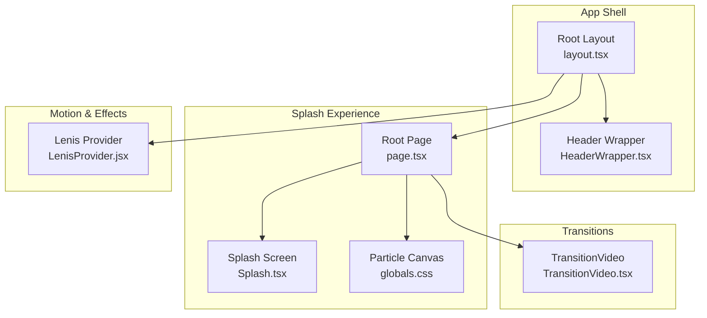
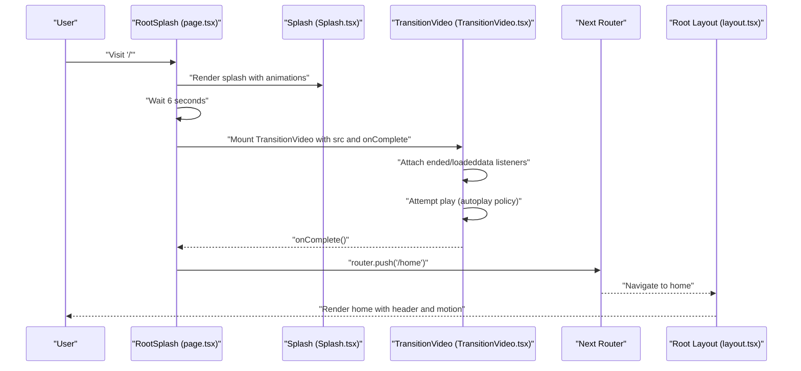
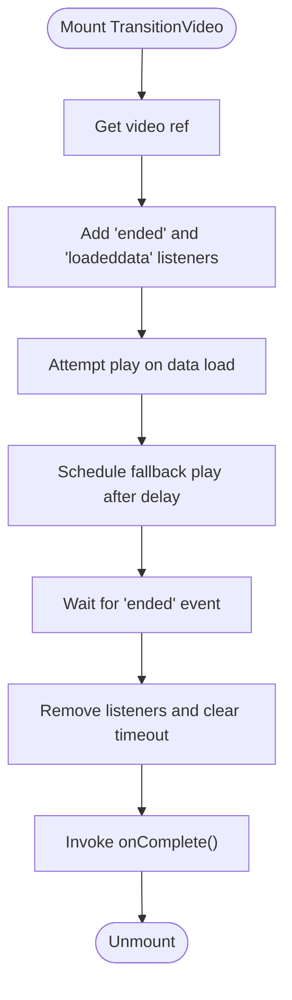
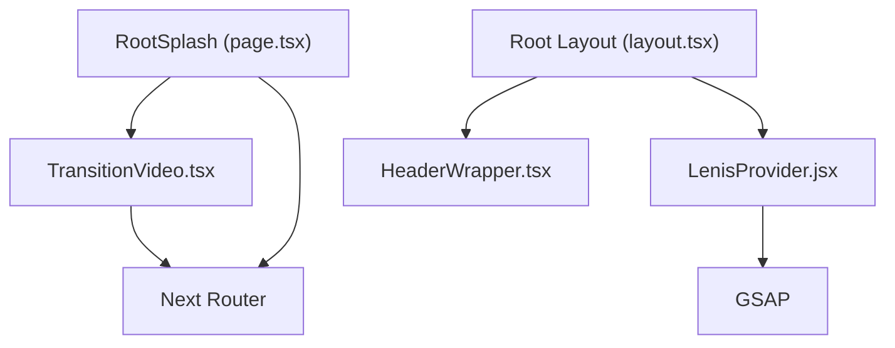

# TransitionVideo Component

<cite>
**Referenced Files in This Document**
- [TransitionVideo.tsx](file://app/components/TransitionVideo.tsx)
- [page.tsx](file://app/page.tsx)
- [layout.tsx](file://app/layout.tsx)
- [HeaderWrapper.tsx](file://app/components/HeaderWrapper.tsx)
- [Splash.tsx](file://app/components/Splash.tsx)
- [LenisProvider.jsx](file://components/animations/LenisProvider.jsx)
- [globals.css](file://app/globals.css)
- [package.json](file://package.json)
- [component-graph.mmd](file://artifacts/component-graph.mmd)
</cite>

## Table of Contents
1. [Introduction](#introduction)
2. [Project Structure](#project-structure)
3. [Core Components](#core-components)
4. [Architecture Overview](#architecture-overview)
5. [Detailed Component Analysis](#detailed-component-analysis)
6. [Dependency Analysis](#dependency-analysis)
7. [Performance Considerations](#performance-considerations)
8. [Troubleshooting Guide](#troubleshooting-guide)
9. [Conclusion](#conclusion)
10. [Appendices](#appendices)

## Introduction
This document provides comprehensive technical and practical documentation for the TransitionVideo component that powers smooth page transitions and navigation effects for the Zeex AI website. It explains the video-based transition system, animation sequencing, and visual effect coordination. It also covers the component’s props interface, integration with navigation state management, route change detection, animation synchronization, video processing pipeline, frame management, and performance optimization techniques. Guidance is included for configuring transition styles, customizing timing and effects, coordinating with other animation systems, ensuring compatibility across browsers and devices, implementing fallbacks, extending the system, adding new video effects, and optimizing for varied network conditions and device capabilities. Accessibility considerations and alternatives for motion-sensitive users are addressed.

## Project Structure
The TransitionVideo component is part of a larger Next.js application that combines animated splash screens, particle canvases, and scroll-driven motion. The transition flow integrates with the root page, layout, and header wrapper to orchestrate seamless navigation from the splash to the home page.

**Diagram sources**
- [layout.tsx:13-23](file://app/layout.tsx#L13-L23)
- [HeaderWrapper.tsx:7-24](file://app/components/HeaderWrapper.tsx#L7-L24)
- [page.tsx:9-54](file://app/page.tsx#L9-L54)
- [Splash.tsx:5-74](file://app/components/Splash.tsx#L5-L74)
- [TransitionVideo.tsx:10-52](file://app/components/TransitionVideo.tsx#L10-L52)
- [LenisProvider.jsx:5-52](file://components/animations/LenisProvider.jsx#L5-L52)

**Section sources**
- [layout.tsx:13-23](file://app/layout.tsx#L13-L23)
- [page.tsx:9-54](file://app/page.tsx#L9-L54)
- [component-graph.mmd:1-24](file://artifacts/component-graph.mmd#L1-L24)

## Core Components
- TransitionVideo: A client-side React component that renders a fullscreen video element to drive page transitions. It manages playback lifecycle, handles autoplay policies, and triggers completion callbacks to advance navigation.
- RootSplash (page.tsx): Orchestrates the initial splash experience and conditionally mounts TransitionVideo after a timed delay. It coordinates navigation via Next.js router upon transition completion.
- Root Layout and Header Wrapper: Provide the application shell and conditional header rendering behavior based on the current route.
- Splash: A client-side splash screen with layered animations and loaders that precede the transition video.
- Lenis Provider: Supplies scroll-driven motion and animation synchronization for the broader experience.

Key responsibilities:
- TransitionVideo: Video playback control, event handling, and completion signaling.
- RootSplash: Timing orchestration, conditional rendering, and route navigation.
- Layout/HeaderWrapper: Route-aware UI presentation and header visibility control.
- Splash: Pre-transition visual storytelling and loader animations.
- Lenis: Scroll-driven motion and animation frame synchronization.

**Section sources**
- [TransitionVideo.tsx:10-52](file://app/components/TransitionVideo.tsx#L10-L52)
- [page.tsx:9-54](file://app/page.tsx#L9-L54)
- [layout.tsx:13-23](file://app/layout.tsx#L13-L23)
- [HeaderWrapper.tsx:7-24](file://app/components/HeaderWrapper.tsx#L7-L24)
- [Splash.tsx:5-74](file://app/components/Splash.tsx#L5-L74)
- [LenisProvider.jsx:5-52](file://components/animations/LenisProvider.jsx#L5-L52)

## Architecture Overview
The transition system follows a staged flow:
- Initial splash screen displays with layered animations.
- After a configured delay, the TransitionVideo component mounts and begins playback.
- On video end, the completion callback triggers navigation to the home route.
- The layout injects Lenis for scroll-driven motion, complementing the transition visuals.

**Diagram sources**
- [page.tsx:13-17](file://app/page.tsx#L13-L17)
- [page.tsx:43-51](file://app/page.tsx#L43-L51)
- [TransitionVideo.tsx:13-37](file://app/components/TransitionVideo.tsx#L13-L37)
- [layout.tsx:13-23](file://app/layout.tsx#L13-L23)

## Detailed Component Analysis

### TransitionVideo Component
Purpose:
- Render a fullscreen video element to drive page transitions.
- Manage playback lifecycle with robust autoplay handling.
- Signal completion to parent components for navigation.

Props interface:
- src: Optional video source path. Defaults to a predefined asset path.
- onComplete: Callback invoked when the video ends.

Behavior:
- Uses a ref to access the HTMLVideoElement.
- Adds event listeners for video end and loadeddata events.
- Attempts playback on loadeddata and after a short timeout to mitigate autoplay restrictions.
- Cleans up listeners and timers on unmount.

**Diagram sources**
- [TransitionVideo.tsx:13-37](file://app/components/TransitionVideo.tsx#L13-L37)

Implementation highlights:
- Event-driven playback control ensures resilience against autoplay policies.
- Fixed-position overlay with black background and cover-fit video ensures immersive coverage.
- Preload and inline playback flags optimize early buffering and mobile compatibility.

Extensibility points:
- Prop-based customization for timing and effects.
- Integration hooks for pre/post transition animations.
- Fallback mechanisms for unsupported formats or autoplay failures.

**Section sources**
- [TransitionVideo.tsx:5-8](file://app/components/TransitionVideo.tsx#L5-L8)
- [TransitionVideo.tsx:10-52](file://app/components/TransitionVideo.tsx#L10-L52)

### RootSplash Orchestration
Role:
- Manages the splash phase and schedules the transition video.
- Navigates to the home route upon transition completion.

Key behaviors:
- Delays mounting TransitionVideo to allow splash animations to conclude.
- Passes the video source and completion handler to TransitionVideo.
- Uses Next.js router to navigate after transition completes.

Integration:
- Coordinates with the layout and header wrapper to control header visibility during splash.
- Leverages global CSS for splash animations and overlays.

**Section sources**
- [page.tsx:9-54](file://app/page.tsx#L9-L54)
- [HeaderWrapper.tsx:7-24](file://app/components/HeaderWrapper.tsx#L7-L24)
- [globals.css:117-140](file://app/globals.css#L117-L140)

### Layout and Header Integration
- Root layout initializes the Lenis provider for scroll-driven motion.
- Header wrapper conditionally renders the header based on the current path, hiding it on the splash route.

**Section sources**
- [layout.tsx:6-6](file://app/layout.tsx#L6-L6)
- [layout.tsx:13-23](file://app/layout.tsx#L13-L23)
- [HeaderWrapper.tsx:7-24](file://app/components/HeaderWrapper.tsx#L7-L24)

### Splash Screen and Visual Storytelling
- Provides layered animations, loaders, and HUD elements preceding the transition video.
- Enhances perceived performance and brand messaging during the transition window.

**Section sources**
- [Splash.tsx:5-74](file://app/components/Splash.tsx#L5-L74)
- [globals.css:43-112](file://app/globals.css#L43-L112)

### Motion Synchronization with Lenis
- Lenis provider sets up smooth scrolling and animation frame synchronization.
- Complements TransitionVideo by maintaining consistent motion timing across the experience.

**Section sources**
- [LenisProvider.jsx:5-52](file://components/animations/LenisProvider.jsx#L5-L52)

## Dependency Analysis
External libraries and integrations:
- GSAP: Used for advanced animations and scroll-triggered effects.
- Lenis: Provides smooth scrolling and animation frame updates.
- Next.js Navigation: Router integration for programmatic navigation after transitions.

**Diagram sources**
- [page.tsx:46-49](file://app/page.tsx#L46-L49)
- [layout.tsx:6-6](file://app/layout.tsx#L6-L6)
- [LenisProvider.jsx:13-26](file://components/animations/LenisProvider.jsx#L13-L26)

**Section sources**
- [package.json:11-21](file://package.json#L11-L21)
- [page.tsx:46-49](file://app/page.tsx#L46-L49)
- [layout.tsx:6-6](file://app/layout.tsx#L6-L6)

## Performance Considerations
- Autoplay policy compliance: Attempt playback on data load and after a brief timeout to accommodate browser restrictions.
- Preloading: Use preload to improve early buffering and reduce perceived latency.
- Rendering: Cover-fit video with black background minimizes FOUC and ensures full-screen coverage.
- Frame pacing: Lenis provides consistent animation frames; ensure TransitionVideo does not block the main thread.
- Asset delivery: Serve optimized video formats and sizes; consider adaptive streaming for varied network conditions.
- Battery life: Avoid excessive GPU usage; prefer hardware-accelerated video decoding when available.
- Memory: Clean up event listeners and timers on unmount to prevent leaks.

[No sources needed since this section provides general guidance]

## Troubleshooting Guide
Common issues and resolutions:
- Autoplay blocked: The component retries playback after data load and a short timeout. If still blocked, prompt user interaction or provide a play button.
- Video not playing: Verify the video source path and format compatibility. Ensure the video is served with appropriate CORS headers if hosted externally.
- Transition not completing: Confirm the completion callback is invoked and navigation proceeds. Check for errors in the callback chain.
- Layout conflicts: Ensure the transition overlay has sufficient z-index and covers the viewport. Validate CSS stacking contexts.
- Scroll jank: Confirm Lenis is initialized and active. Avoid heavy DOM manipulation during transition.

**Section sources**
- [TransitionVideo.tsx:17-24](file://app/components/TransitionVideo.tsx#L17-L24)
- [TransitionVideo.tsx:32-36](file://app/components/TransitionVideo.tsx#L32-L36)

## Conclusion
The TransitionVideo component forms a central piece of the Zeex AI website’s transition system, combining a robust video playback lifecycle with navigation orchestration. Its design emphasizes resilience against autoplay policies, clean resource management, and seamless integration with the broader animation ecosystem. By leveraging Next.js routing, Lenis motion, and layered splash visuals, it delivers a polished, immersive user experience that scales across devices and network conditions.

[No sources needed since this section summarizes without analyzing specific files]

## Appendices

### Props Reference
- src: Optional video source path. Defaults to a predefined asset path.
- onComplete: Callback invoked when the video ends.

Usage pattern:
- Mount TransitionVideo conditionally after splash animations.
- Pass a completion handler that navigates to the next route.

**Section sources**
- [TransitionVideo.tsx:5-8](file://app/components/TransitionVideo.tsx#L5-L8)
- [page.tsx:43-51](file://app/page.tsx#L43-L51)

### Video Format Compatibility and Progressive Loading
- Formats: Prefer widely supported codecs (e.g., MP4/H.264) for broad browser support.
- Progressive loading: Use preload and early buffering strategies; consider adaptive bitrate streaming for variable networks.
- Fallbacks: Provide alternative static visuals or animations if video fails to load or play.

[No sources needed since this section provides general guidance]

### Extending the Transition System
- New transition styles: Add configurable props for timing, blending modes, and overlay effects.
- Animation coordination: Integrate with GSAP timelines and Lenis for synchronized motion.
- Effect variants: Support multiple video assets and transition sequences.
- Accessibility: Offer reduced motion modes and alternative transition methods for motion sensitivity.

[No sources needed since this section provides general guidance]