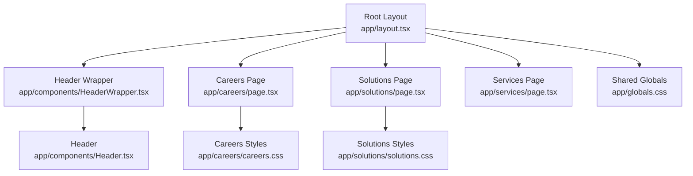
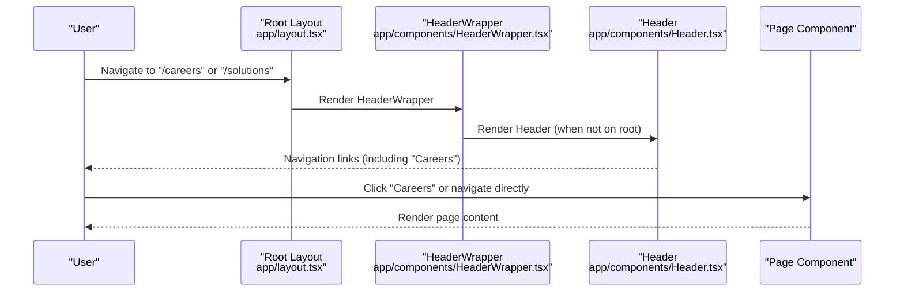
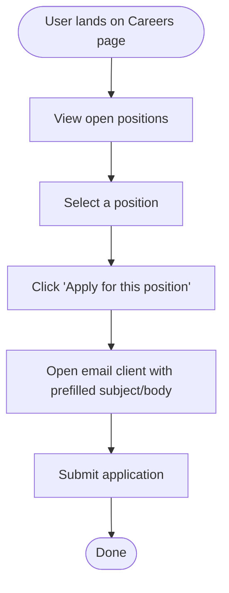
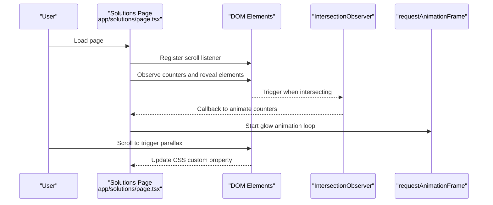
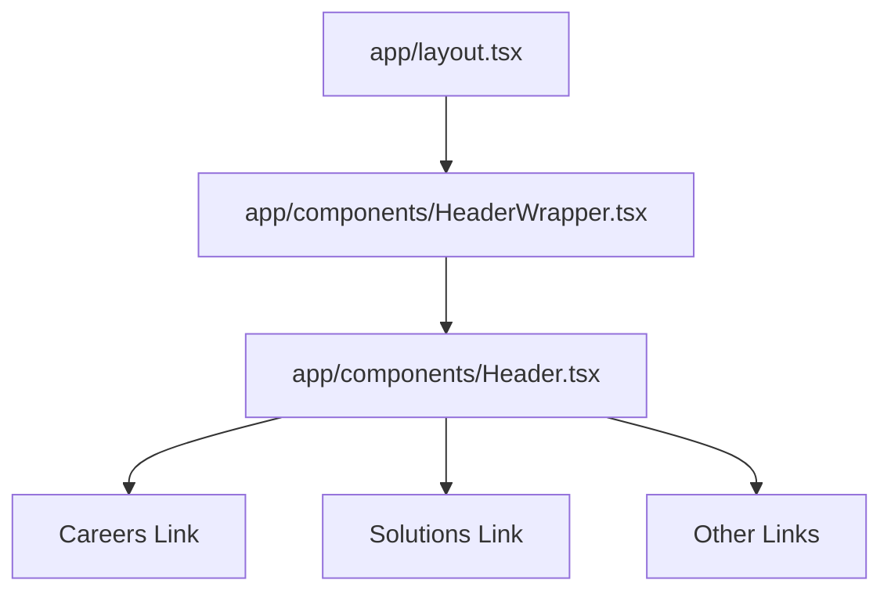

# Business Opportunity Pages

<cite>
**Referenced Files in This Document**
- [README.md](file://README.md)
- [app/layout.tsx](file://app/layout.tsx)
- [app/components/HeaderWrapper.tsx](file://app/components/HeaderWrapper.tsx)
- [app/components/Header.tsx](file://app/components/Header.tsx)
- [app/careers/page.tsx](file://app/careers/page.tsx)
- [app/careers/careers.css](file://app/careers/careers.css)
- [app/solutions/page.tsx](file://app/solutions/page.tsx)
- [app/solutions/solutions.css](file://app/solutions/solutions.css)
- [app/services/page.tsx](file://app/services/page.tsx)
- [app/globals.css](file://app/globals.css)
</cite>

## Table of Contents
1. [Introduction](#introduction)
2. [Project Structure](#project-structure)
3. [Core Components](#core-components)
4. [Architecture Overview](#architecture-overview)
5. [Detailed Component Analysis](#detailed-component-analysis)
6. [Dependency Analysis](#dependency-analysis)
7. [Performance Considerations](#performance-considerations)
8. [Troubleshooting Guide](#troubleshooting-guide)
9. [Conclusion](#conclusion)
10. [Appendices](#appendices)

## Introduction
This document explains the business opportunity pages that serve different stakeholder groups:
- Careers page: targeted at job seekers and interns, highlighting employment opportunities, company culture, benefits, and hiring processes.
- Solutions page: targeted at enterprise buyers and decision-makers, showcasing platform capabilities, integration options, and use cases.

It documents the content structure, presentation approach, implementation patterns, and technical details for form handling, content management, and user engagement. It also provides guidance for updating job postings, managing application workflows, maintaining solution documentation, integrating with the navigation system, and optimizing content for conversions.

## Project Structure
The website is a Next.js application with a shared layout and a header that is conditionally rendered. The business opportunity pages are implemented as dedicated pages under the app directory.

**Diagram sources**
- [app/layout.tsx:13-23](file://app/layout.tsx#L13-L23)
- [app/components/HeaderWrapper.tsx:7-24](file://app/components/HeaderWrapper.tsx#L7-L24)
- [app/components/Header.tsx:10-82](file://app/components/Header.tsx#L10-L82)
- [app/careers/page.tsx:7-183](file://app/careers/page.tsx#L7-L183)
- [app/solutions/page.tsx:7-492](file://app/solutions/page.tsx#L7-L492)
- [app/services/page.tsx:7-378](file://app/services/page.tsx#L7-L378)
- [app/careers/careers.css:1-372](file://app/careers/careers.css#L1-L372)
- [app/solutions/solutions.css:1-117](file://app/solutions/solutions.css#L1-L117)
- [app/globals.css:1-1200](file://app/globals.css#L1-L1200)

**Section sources**
- [app/layout.tsx:13-23](file://app/layout.tsx#L13-L23)
- [app/components/HeaderWrapper.tsx:7-24](file://app/components/HeaderWrapper.tsx#L7-L24)
- [app/components/Header.tsx:10-82](file://app/components/Header.tsx#L10-L82)

## Core Components
- Careers page: Presents company culture, open positions, and benefits. Uses static arrays for content and links to email-based applications.
- Solutions page: Highlights platform capabilities with animated stats, card grids, and interactive elements. Uses IntersectionObserver and requestAnimationFrame for scroll effects.
- Services page: Provides detailed service categories and use cases with a modal for expanded details.
- Navigation: Shared header with links to all major sections, including Careers.

Implementation patterns:
- Static content arrays for repeatable data (positions, benefits, service categories).
- Client-side interactivity for animations and scroll reveals.
- Email-based application flow for job postings.
- Modal-based deep-dive for service use cases.

**Section sources**
- [app/careers/page.tsx:7-183](file://app/careers/page.tsx#L7-L183)
- [app/solutions/page.tsx:7-492](file://app/solutions/page.tsx#L7-L492)
- [app/services/page.tsx:7-378](file://app/services/page.tsx#L7-L378)
- [app/components/Header.tsx:10-82](file://app/components/Header.tsx#L10-L82)

## Architecture Overview
The business opportunity pages are integrated into the Next.js routing system. The layout injects a header wrapper that conditionally renders the header. The header contains navigation links to the Careers page and other sections.

**Diagram sources**
- [app/layout.tsx:13-23](file://app/layout.tsx#L13-L23)
- [app/components/HeaderWrapper.tsx:7-24](file://app/components/HeaderWrapper.tsx#L7-L24)
- [app/components/Header.tsx:10-82](file://app/components/Header.tsx#L10-L82)

## Detailed Component Analysis

### Careers Page
Purpose:
- Showcase open positions, company culture, and benefits to attract candidates.
- Provide a clear application pathway via email.

Content structure:
- Hero section with headline and CTA.
- Why work with us cards.
- Open positions grid with tags (department, location, type, level).
- Benefits and perks grid.
- Footer with site links.

Implementation patterns:
- Static arrays define content for culture, positions, and benefits.
- Each position card includes a link to email the application.
- Uses shared feature-card styles and section classes from global CSS.

Technical details:
- Client-side rendering for interactivity.
- Uses shared button and card styles from global CSS.
- Responsive grid layouts for cards and benefits.

Best practices:
- Keep position arrays maintainable and localized.
- Use consistent tagging for filtering and sorting if needed.
- Ensure email links include subject and body placeholders for easy application.

**Section sources**
- [app/careers/page.tsx:7-183](file://app/careers/page.tsx#L7-L183)
- [app/careers/careers.css:1-372](file://app/careers/careers.css#L1-L372)
- [app/globals.css:244-286](file://app/globals.css#L244-L286)

#### Careers Application Flow

**Diagram sources**
- [app/careers/page.tsx:97-99](file://app/careers/page.tsx#L97-L99)

### Solutions Page
Purpose:
- Demonstrate platform capabilities and enterprise value to decision-makers.
- Present a comprehensive set of security and monitoring features.

Content structure:
- Hero section with headline and CTA.
- Animated statistics counters.
- Feature cards for each solution component.
- Methodology cards explaining the approach.
- Call-to-action panel.

Implementation patterns:
- Client-side effects:
  - Parallax background movement on scroll.
  - Animated counters with IntersectionObserver.
  - Cursor glow effect on desktop.
  - Scroll-reveal animations for sections.
- Uses a dedicated CSS module for visual effects and animations.

Technical details:
- Scroll listener updates CSS custom property for parallax.
- IntersectionObserver triggers counter animations when elements come into view.
- requestAnimationFrame animates a custom cursor glow element.
- Scroll-reveal adds classes to trigger fade-in transitions.

Best practices:
- Keep counter targets and durations configurable.
- Ensure mobile-friendly fallbacks for cursor effects.
- Use semantic section IDs for smooth scrolling navigation.

**Section sources**
- [app/solutions/page.tsx:7-492](file://app/solutions/page.tsx#L7-L492)
- [app/solutions/solutions.css:1-117](file://app/solutions/solutions.css#L1-L117)
- [app/globals.css:900-1200](file://app/globals.css#L900-L1200)

#### Solutions Interaction Sequence

**Diagram sources**
- [app/solutions/page.tsx:11-113](file://app/solutions/page.tsx#L11-L113)
- [app/solutions/solutions.css:8-32](file://app/solutions/solutions.css#L8-L32)

### Services Page
Purpose:
- Provide detailed descriptions of service categories and practical use cases.
- Offer an interactive modal for deeper exploration of use cases.

Content structure:
- Hero section.
- Overview grid of service categories.
- Detailed sections for each category with benefits and use cases.
- Modal for expanded use case details.

Implementation patterns:
- Static mapping of service categories with benefits and use cases.
- State management for modal selection.
- Click handlers to open modal with selected use case.

Best practices:
- Keep service data centralized and typed for maintainability.
- Use consistent modal UX for deep dives.
- Ensure accessibility for modal interactions.

**Section sources**
- [app/services/page.tsx:7-378](file://app/services/page.tsx#L7-L378)

## Dependency Analysis
Navigation and layout dependencies:
- Root layout injects the header wrapper.
- Header wrapper conditionally renders the header based on route.
- Header contains navigation links to all major sections, including Careers.

**Diagram sources**
- [app/layout.tsx:13-23](file://app/layout.tsx#L13-L23)
- [app/components/HeaderWrapper.tsx:7-24](file://app/components/HeaderWrapper.tsx#L7-L24)
- [app/components/Header.tsx:10-82](file://app/components/Header.tsx#L10-L82)

**Section sources**
- [app/layout.tsx:13-23](file://app/layout.tsx#L13-L23)
- [app/components/HeaderWrapper.tsx:7-24](file://app/components/HeaderWrapper.tsx#L7-L24)
- [app/components/Header.tsx:10-82](file://app/components/Header.tsx#L10-L82)

## Performance Considerations
- Careers page: Uses static arrays and minimal client-side logic; performance impact is negligible.
- Solutions page: Animations rely on IntersectionObserver and requestAnimationFrame; ensure thresholds and root margins are tuned for smooth performance on lower-end devices.
- Services page: Modal rendering toggles DOM elements; keep modal content lightweight to avoid layout thrashing.

[No sources needed since this section provides general guidance]

## Troubleshooting Guide
Common issues and resolutions:
- Header not appearing on root: The header wrapper hides the header on the root route. This is expected behavior.
- Careers application links: Ensure email clients handle subject/body parameters correctly. Consider adding a dedicated application form if email links fail.
- Solutions animations: If counters or parallax do not animate, verify IntersectionObserver and scroll listeners are attached and not blocked by ad blockers.
- Services modal: If modal does not open, confirm state updates and click handlers are firing. Ensure the modal overlay covers the viewport and captures clicks.

**Section sources**
- [app/components/HeaderWrapper.tsx:7-24](file://app/components/HeaderWrapper.tsx#L7-L24)
- [app/careers/page.tsx:97-99](file://app/careers/page.tsx#L97-L99)
- [app/solutions/page.tsx:11-113](file://app/solutions/page.tsx#L11-L113)
- [app/services/page.tsx:266-323](file://app/services/page.tsx#L266-L323)

## Conclusion
The business opportunity pages are implemented with clear separation of concerns:
- Careers focuses on candidate acquisition with straightforward application pathways.
- Solutions emphasizes enterprise value with engaging, interactive presentations.
- Services provides detailed use-case coverage with modal-based deep-dives.

The shared layout and header ensure consistent navigation across pages. Content is primarily static, making updates straightforward. For dynamic needs, consider migrating to a CMS-backed approach while preserving the current styling and interaction patterns.

[No sources needed since this section summarizes without analyzing specific files]

## Appendices

### Updating Job Postings (Careers)
- Edit the open positions array to add, modify, or remove roles.
- Maintain consistent keys for each position (title, department, location, type, level, description).
- Keep application links aligned with the intended submission process.

**Section sources**
- [app/careers/page.tsx:14-25](file://app/careers/page.tsx#L14-L25)

### Managing Application Workflows (Careers)
- Current flow uses email links; ensure subject/body parameters are correct.
- For a hosted application system, replace email links with form submissions and integrate with a backend.

**Section sources**
- [app/careers/page.tsx:97-99](file://app/careers/page.tsx#L97-L99)

### Maintaining Solution Documentation (Solutions)
- Update feature cards and statistics in the page component.
- Adjust CSS custom properties for parallax and animations if backgrounds change.
- Verify IntersectionObserver thresholds and animation durations for responsiveness.

**Section sources**
- [app/solutions/page.tsx:7-492](file://app/solutions/page.tsx#L7-L492)
- [app/solutions/solutions.css:1-117](file://app/solutions/solutions.css#L1-L117)

### Navigation Integration
- Ensure navigation links remain consistent across pages.
- The header wrapper conditionally renders the header; verify routes match expectations.

**Section sources**
- [app/components/Header.tsx:10-82](file://app/components/Header.tsx#L10-L82)
- [app/components/HeaderWrapper.tsx:7-24](file://app/components/HeaderWrapper.tsx#L7-L24)

### Content Optimization and Conversion
- Use clear CTAs and benefit-focused messaging.
- Keep content scannable with concise headlines and bullet points.
- Ensure mobile responsiveness for all interactive elements.

[No sources needed since this section provides general guidance]