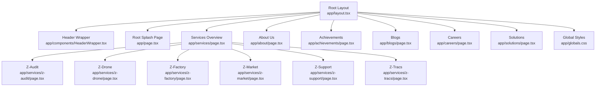
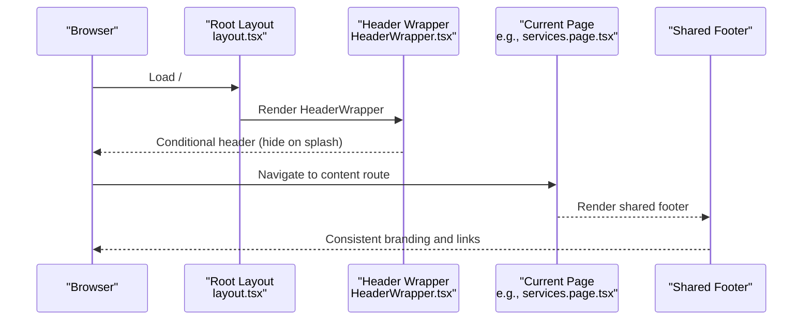
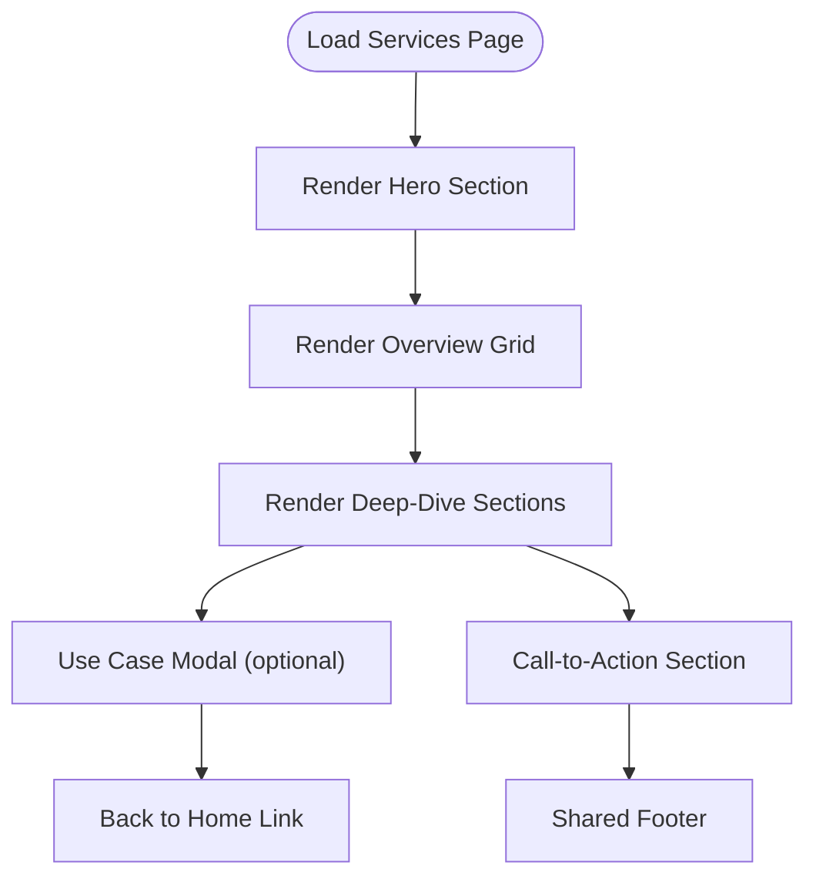
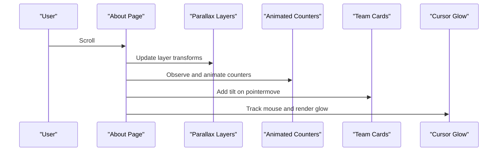
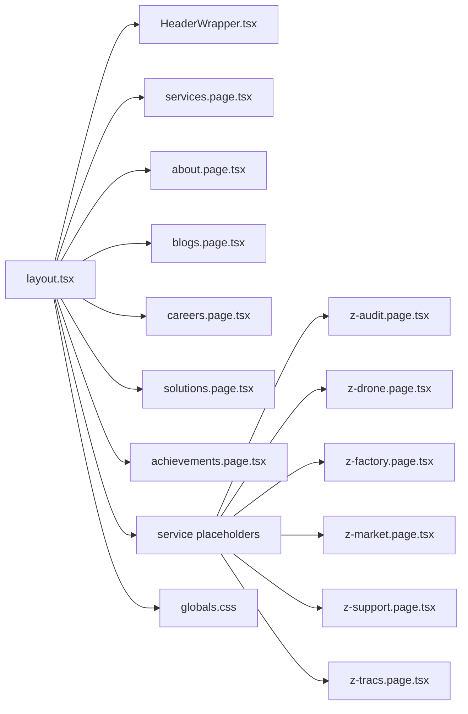

# Content Management

<cite>
**Referenced Files in This Document**
- [layout.tsx](file://app/layout.tsx)
- [page.tsx](file://app/page.tsx)
- [HeaderWrapper.tsx](file://app/components/HeaderWrapper.tsx)
- [services.page.tsx](file://app/services/page.tsx)
- [z-audit.page.tsx](file://app/services/z-audit/page.tsx)
- [z-drone.page.tsx](file://app/services/z-drone/page.tsx)
- [z-factory.page.tsx](file://app/services/z-factory/page.tsx)
- [z-market.page.tsx](file://app/services/z-market/page.tsx)
- [z-support.page.tsx](file://app/services/z-support/page.tsx)
- [z-tracs.page.tsx](file://app/services/z-tracs/page.tsx)
- [about.page.tsx](file://app/about/page.tsx)
- [achievements.page.tsx](file://app/achievements/page.tsx)
- [blogs.page.tsx](file://app/blogs/page.tsx)
- [careers.page.tsx](file://app/careers/page.tsx)
- [solutions.page.tsx](file://app/solutions/page.tsx)
- [globals.css](file://app/globals.css)
</cite>

## Table of Contents
1. [Introduction](#introduction)
2. [Project Structure](#project-structure)
3. [Core Components](#core-components)
4. [Architecture Overview](#architecture-overview)
5. [Detailed Component Analysis](#detailed-component-analysis)
6. [Dependency Analysis](#dependency-analysis)
7. [Performance Considerations](#performance-considerations)
8. [Troubleshooting Guide](#troubleshooting-guide)
9. [Conclusion](#conclusion)
10. [Appendices](#appendices)

## Introduction
This document describes the content management system for the Zeex AI website. It explains how the content pages are structured, rendered, and maintained, and how they integrate with the overall navigation and design system. It covers the service pages (Z-Audit, Z-Drone, Z-Factory, Z-Market, Z-Support, Z-Tracs), About Us, Achievements, Blogs, Careers, and Solutions. It also documents image handling, responsive design patterns, SEO considerations, performance characteristics, and practical guidance for adding new pages, updating content, and maintaining consistency across the site.

## Project Structure
The website is a Next.js application with a client-side routed structure. Pages are grouped by domain purpose under the app directory:
- Home and splash: app/page.tsx and app/home/*
- Navigation and global layout: app/layout.tsx and app/components/HeaderWrapper.tsx
- Services overview and individual service pages: app/services/*
- Company and content: app/about, app/achievements, app/blogs, app/careers, app/solutions
- Global styles: app/globals.css

**Diagram sources**
- [layout.tsx:1-24](file://app/layout.tsx#L1-L24)
- [HeaderWrapper.tsx:1-25](file://app/components/HeaderWrapper.tsx#L1-L25)
- [page.tsx:1-55](file://app/page.tsx#L1-L55)
- [services.page.tsx:1-379](file://app/services/page.tsx#L1-L379)
- [z-audit.page.tsx:1-24](file://app/services/z-audit/page.tsx#L1-L24)
- [z-drone.page.tsx:1-24](file://app/services/z-drone/page.tsx#L1-L24)
- [z-factory.page.tsx:1-24](file://app/services/z-factory/page.tsx#L1-L24)
- [z-market.page.tsx:1-24](file://app/services/z-market/page.tsx#L1-L24)
- [z-support.page.tsx:1-24](file://app/services/z-support/page.tsx#L1-L24)
- [z-tracs.page.tsx:1-24](file://app/services/z-tracs/page.tsx#L1-L24)
- [about.page.tsx:1-298](file://app/about/page.tsx#L1-L298)
- [achievements.page.tsx:1-77](file://app/achievements/page.tsx#L1-L77)
- [blogs.page.tsx:1-225](file://app/blogs/page.tsx#L1-L225)
- [careers.page.tsx:1-185](file://app/careers/page.tsx#L1-L185)
- [solutions.page.tsx:1-494](file://app/solutions/page.tsx#L1-L494)
- [globals.css:1-800](file://app/globals.css#L1-L800)

**Section sources**
- [layout.tsx:1-24](file://app/layout.tsx#L1-L24)
- [HeaderWrapper.tsx:1-25](file://app/components/HeaderWrapper.tsx#L1-L25)
- [page.tsx:1-55](file://app/page.tsx#L1-L55)
- [services.page.tsx:1-379](file://app/services/page.tsx#L1-L379)
- [about.page.tsx:1-298](file://app/about/page.tsx#L1-L298)
- [achievements.page.tsx:1-77](file://app/achievements/page.tsx#L1-L77)
- [blogs.page.tsx:1-225](file://app/blogs/page.tsx#L1-L225)
- [careers.page.tsx:1-185](file://app/careers/page.tsx#L1-L185)
- [solutions.page.tsx:1-494](file://app/solutions/page.tsx#L1-L494)
- [globals.css:1-800](file://app/globals.css#L1-L800)

## Core Components
- Root layout and metadata: Defines the global HTML shell, metadata, and injects shared providers and the header wrapper.
- Header wrapper: Conditionally renders the header based on the current route and toggles body classes for layout spacing.
- Root splash: Implements a branded animated entry experience with particle effects, scan lines, and HUD elements, then transitions to the home route.
- Services overview: Presents a tailored security services grid with animated counters, scroll-triggered reveals, and a modal for detailed use cases.
- Individual service pages: Lightweight placeholders for Z-Audit, Z-Drone, Z-Factory, Z-Market, Z-Support, and Z-Tracs, each with a hero section and back navigation.
- About Us: Richly animated sections with parallax, counters, timeline, team cards with 3D tilt, and a cursor glow effect.
- Achievements: Minimal hero section with a back-to-home action and a standard footer.
- Blogs: Article listing with category filtering, pagination placeholders, and a newsletter signup form.
- Careers: Sections for “Why Work With Us,” open positions, and benefits; includes role metadata and application links.
- Solutions: Comprehensive feature cards, method steps, animated counters, and scroll-triggered reveal animations.

**Section sources**
- [layout.tsx:1-24](file://app/layout.tsx#L1-L24)
- [HeaderWrapper.tsx:1-25](file://app/components/HeaderWrapper.tsx#L1-L25)
- [page.tsx:1-55](file://app/page.tsx#L1-L55)
- [services.page.tsx:1-379](file://app/services/page.tsx#L1-L379)
- [z-audit.page.tsx:1-24](file://app/services/z-audit/page.tsx#L1-L24)
- [z-drone.page.tsx:1-24](file://app/services/z-drone/page.tsx#L1-L24)
- [z-factory.page.tsx:1-24](file://app/services/z-factory/page.tsx#L1-L24)
- [z-market.page.tsx:1-24](file://app/services/z-market/page.tsx#L1-L24)
- [z-support.page.tsx:1-24](file://app/services/z-support/page.tsx#L1-L24)
- [z-tracs.page.tsx:1-24](file://app/services/z-tracs/page.tsx#L1-L24)
- [about.page.tsx:1-298](file://app/about/page.tsx#L1-L298)
- [achievements.page.tsx:1-77](file://app/achievements/page.tsx#L1-L77)
- [blogs.page.tsx:1-225](file://app/blogs/page.tsx#L1-L225)
- [careers.page.tsx:1-185](file://app/careers/page.tsx#L1-L185)
- [solutions.page.tsx:1-494](file://app/solutions/page.tsx#L1-L494)

## Architecture Overview
The content pages share a common layout and styling framework. Navigation is handled via Next.js client-side routing and Link components. Animations and interactive effects are implemented with vanilla JavaScript and CSS, with optional provider wrappers for scroll-driven experiences.

**Diagram sources**
- [layout.tsx:1-24](file://app/layout.tsx#L1-L24)
- [HeaderWrapper.tsx:1-25](file://app/components/HeaderWrapper.tsx#L1-L25)
- [services.page.tsx:1-379](file://app/services/page.tsx#L1-L379)

## Detailed Component Analysis

### Services Overview and Individual Service Pages
- Services overview page:
  - Uses a mapped array of service configurations to render a hero, overview grid, deep-dive sections, and a call-to-action.
  - Includes a modal for detailed use cases with click-to-expand behavior.
  - Leverages CSS grid and responsive typography for content presentation.
- Individual service pages (Z-Audit, Z-Drone, Z-Factory, Z-Market, Z-Support, Z-Tracs):
  - Each page is a minimal placeholder with a hero section and a back-to-home link.
  - Designed to be extended with richer content and imagery.

**Diagram sources**
- [services.page.tsx:1-379](file://app/services/page.tsx#L1-L379)
- [z-audit.page.tsx:1-24](file://app/services/z-audit/page.tsx#L1-L24)
- [z-drone.page.tsx:1-24](file://app/services/z-drone/page.tsx#L1-L24)
- [z-factory.page.tsx:1-24](file://app/services/z-factory/page.tsx#L1-L24)
- [z-market.page.tsx:1-24](file://app/services/z-market/page.tsx#L1-L24)
- [z-support.page.tsx:1-24](file://app/services/z-support/page.tsx#L1-L24)
- [z-tracs.page.tsx:1-24](file://app/services/z-tracs/page.tsx#L1-L24)

**Section sources**
- [services.page.tsx:1-379](file://app/services/page.tsx#L1-L379)
- [z-audit.page.tsx:1-24](file://app/services/z-audit/page.tsx#L1-L24)
- [z-drone.page.tsx:1-24](file://app/services/z-drone/page.tsx#L1-L24)
- [z-factory.page.tsx:1-24](file://app/services/z-factory/page.tsx#L1-L24)
- [z-market.page.tsx:1-24](file://app/services/z-market/page.tsx#L1-L24)
- [z-support.page.tsx:1-24](file://app/services/z-support/page.tsx#L1-L24)
- [z-tracs.page.tsx:1-24](file://app/services/z-tracs/page.tsx#L1-L24)

### About Us Page
- Implements parallax layers, animated counters, a timeline, team cards with 3D tilt, and a cursor glow effect on desktop.
- Uses IntersectionObserver for scroll-triggered animations and requestAnimationFrame for smooth transforms.
- Integrates with a shared footer and navigation helpers.

**Diagram sources**
- [about.page.tsx:1-298](file://app/about/page.tsx#L1-L298)

**Section sources**
- [about.page.tsx:1-298](file://app/about/page.tsx#L1-L298)

### Achievements Page
- Minimal hero section with a back-to-home link and a standard footer.
- Intended for milestone displays and recognition galleries.

**Section sources**
- [achievements.page.tsx:1-77](file://app/achievements/page.tsx#L1-L77)

### Blogs Page
- Provides a categorized article listing with filtering, pagination placeholders, and a newsletter subscription form.
- Responsive grid layout adapts to different screen sizes.

**Section sources**
- [blogs.page.tsx:1-225](file://app/blogs/page.tsx#L1-L225)

### Careers Page
- Sections for “Why Work With Us,” open positions, and benefits.
- Includes metadata for departments, locations, types, and levels.
- Application links use mailto with subject formatting.

**Section sources**
- [careers.page.tsx:1-185](file://app/careers/page.tsx#L1-L185)

### Solutions Page
- Comprehensive feature cards, method steps, animated counters, and scroll-triggered reveal animations.
- Implements parallax and cursor glow effects similar to About Us.

**Section sources**
- [solutions.page.tsx:1-494](file://app/solutions/page.tsx#L1-L494)

## Dependency Analysis
- Shared layout and header:
  - Root layout defines metadata and wraps pages with a header wrapper that hides the header on the splash route.
- Navigation:
  - Pages use Next.js Link components for internal navigation and anchor links for in-page sections.
- Animations and interactivity:
  - Many pages rely on vanilla JS for scroll effects, counters, and hover/tilt behaviors.
- Global styles:
  - Centralized CSS variables and animations define the visual language and motion effects.

**Diagram sources**
- [layout.tsx:1-24](file://app/layout.tsx#L1-L24)
- [HeaderWrapper.tsx:1-25](file://app/components/HeaderWrapper.tsx#L1-L25)
- [services.page.tsx:1-379](file://app/services/page.tsx#L1-L379)
- [about.page.tsx:1-298](file://app/about/page.tsx#L1-L298)
- [blogs.page.tsx:1-225](file://app/blogs/page.tsx#L1-L225)
- [careers.page.tsx:1-185](file://app/careers/page.tsx#L1-L185)
- [solutions.page.tsx:1-494](file://app/solutions/page.tsx#L1-L494)
- [achievements.page.tsx:1-77](file://app/achievements/page.tsx#L1-L77)
- [z-audit.page.tsx:1-24](file://app/services/z-audit/page.tsx#L1-L24)
- [z-drone.page.tsx:1-24](file://app/services/z-drone/page.tsx#L1-L24)
- [z-factory.page.tsx:1-24](file://app/services/z-factory/page.tsx#L1-L24)
- [z-market.page.tsx:1-24](file://app/services/z-market/page.tsx#L1-L24)
- [z-support.page.tsx:1-24](file://app/services/z-support/page.tsx#L1-L24)
- [z-tracs.page.tsx:1-24](file://app/services/z-tracs/page.tsx#L1-L24)
- [globals.css:1-800](file://app/globals.css#L1-L800)

**Section sources**
- [layout.tsx:1-24](file://app/layout.tsx#L1-L24)
- [HeaderWrapper.tsx:1-25](file://app/components/HeaderWrapper.tsx#L1-L25)
- [services.page.tsx:1-379](file://app/services/page.tsx#L1-L379)
- [about.page.tsx:1-298](file://app/about/page.tsx#L1-L298)
- [blogs.page.tsx:1-225](file://app/blogs/page.tsx#L1-L225)
- [careers.page.tsx:1-185](file://app/careers/page.tsx#L1-L185)
- [solutions.page.tsx:1-494](file://app/solutions/page.tsx#L1-L494)
- [achievements.page.tsx:1-77](file://app/achievements/page.tsx#L1-L77)
- [z-audit.page.tsx:1-24](file://app/services/z-audit/page.tsx#L1-L24)
- [z-drone.page.tsx:1-24](file://app/services/z-drone/page.tsx#L1-L24)
- [z-factory.page.tsx:1-24](file://app/services/z-factory/page.tsx#L1-L24)
- [z-market.page.tsx:1-24](file://app/services/z-market/page.tsx#L1-L24)
- [z-support.page.tsx:1-24](file://app/services/z-support/page.tsx#L1-L24)
- [z-tracs.page.tsx:1-24](file://app/services/z-tracs/page.tsx#L1-L24)
- [globals.css:1-800](file://app/globals.css#L1-L800)

## Performance Considerations
- Client-side animations:
  - Pages use requestAnimationFrame and IntersectionObserver. Keep DOM updates minimal and throttle heavy computations.
- Image handling:
  - Current pages reference placeholder assets. For production, use optimized images and consider Next.js Image component for automatic optimization.
- Rendering:
  - Services overview and Solutions pages render many feature cards. Consider virtualization or pagination for very large datasets.
- SEO:
  - Root layout sets metadata. Add page-specific metadata (title, description) per route for improved SEO.
- Accessibility:
  - Ensure focus management for modals and keyboard navigation for interactive grids.

[No sources needed since this section provides general guidance]

## Troubleshooting Guide
- Header not appearing:
  - Verify the header wrapper conditionally renders based on pathname and toggles body classes.
- Scroll animations not triggering:
  - Confirm IntersectionObserver thresholds and root margins match element positions.
- Modal not closing:
  - Ensure click-outside handlers and event propagation are correctly implemented.
- Cursor glow not visible:
  - Check for mobile detection logic and ensure requestAnimationFrame loop is started.

**Section sources**
- [HeaderWrapper.tsx:1-25](file://app/components/HeaderWrapper.tsx#L1-L25)
- [about.page.tsx:1-298](file://app/about/page.tsx#L1-L298)
- [services.page.tsx:1-379](file://app/services/page.tsx#L1-L379)

## Conclusion
The Zeex AI website employs a modular, client-rendered structure with shared layouts and animations. The content pages are organized by domain (services, company, blog, careers, solutions) and use consistent patterns for navigation, responsiveness, and interactivity. Extending the site involves adding new routes under app, following the established patterns for layout, styling, and animations.

[No sources needed since this section summarizes without analyzing specific files]

## Appendices

### Adding New Service Pages
- Create a new route under app/services/<new-service>/page.tsx.
- Use the established hero section pattern and include a back-to-home link.
- Extend the services overview page to include the new service in the overview grid and deep-dive sections if appropriate.

**Section sources**
- [services.page.tsx:1-379](file://app/services/page.tsx#L1-L379)
- [z-audit.page.tsx:1-24](file://app/services/z-audit/page.tsx#L1-L24)
- [z-drone.page.tsx:1-24](file://app/services/z-drone/page.tsx#L1-L24)
- [z-factory.page.tsx:1-24](file://app/services/z-factory/page.tsx#L1-L24)
- [z-market.page.tsx:1-24](file://app/services/z-market/page.tsx#L1-L24)
- [z-support.page.tsx:1-24](file://app/services/z-support/page.tsx#L1-L24)
- [z-tracs.page.tsx:1-24](file://app/services/z-tracs/page.tsx#L1-L24)

### Updating Existing Content
- Services overview: Modify the mapped service array to update descriptions, benefits, and use cases.
- About Us: Adjust counters, timeline, and team cards; ensure cleanup of observers and RAF loops.
- Blogs: Update the articles array and categories; maintain pagination placeholders.
- Careers: Add or modify open positions and benefits; update application links.

**Section sources**
- [services.page.tsx:1-379](file://app/services/page.tsx#L1-L379)
- [about.page.tsx:1-298](file://app/about/page.tsx#L1-L298)
- [blogs.page.tsx:1-225](file://app/blogs/page.tsx#L1-L225)
- [careers.page.tsx:1-185](file://app/careers/page.tsx#L1-L185)

### Maintaining Consistency
- Follow the shared CSS variables and animation patterns defined in globals.css.
- Use consistent section classes (e.g., home-section, feature-card) across pages.
- Ensure all pages include a shared footer with quick links and contact information.

**Section sources**
- [globals.css:1-800](file://app/globals.css#L1-L800)
- [services.page.tsx:1-379](file://app/services/page.tsx#L1-L379)
- [about.page.tsx:1-298](file://app/about/page.tsx#L1-L298)
- [blogs.page.tsx:1-225](file://app/blogs/page.tsx#L1-L225)
- [careers.page.tsx:1-185](file://app/careers/page.tsx#L1-L185)
- [solutions.page.tsx:1-494](file://app/solutions/page.tsx#L1-L494)
- [achievements.page.tsx:1-77](file://app/achievements/page.tsx#L1-L77)

### SEO and Metadata
- Set page-specific metadata (title, description) for each route.
- Use semantic headings and alt attributes for images.
- Ensure canonical URLs and structured data where applicable.

[No sources needed since this section provides general guidance]

### Multilingual Considerations
- No language switching is implemented in the current codebase.
- To support multiple languages, introduce locale-aware routing and separate content files per locale.

[No sources needed since this section provides general guidance]