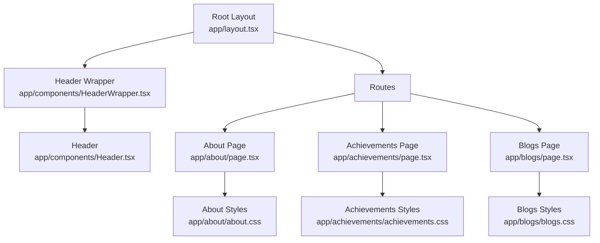
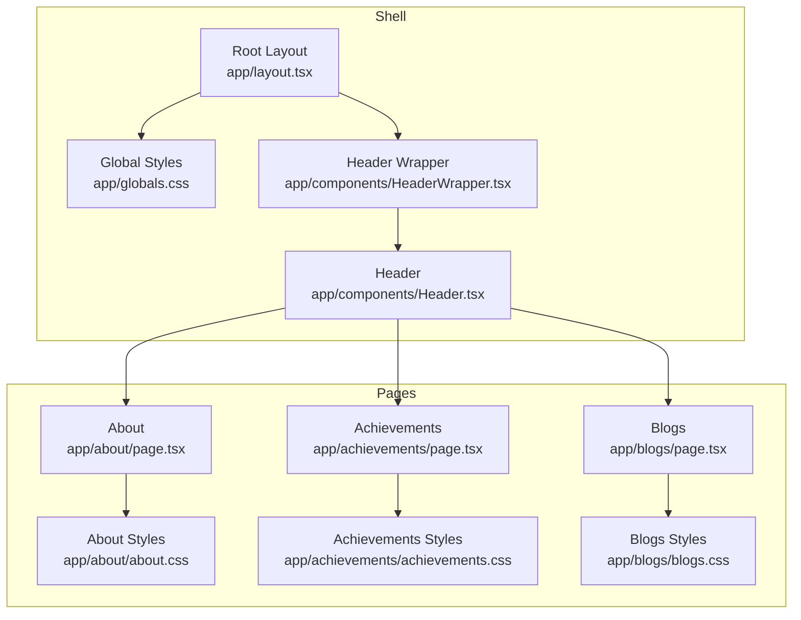
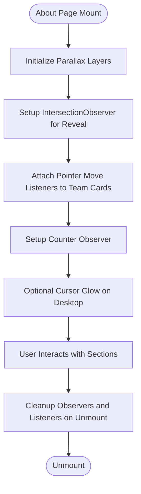
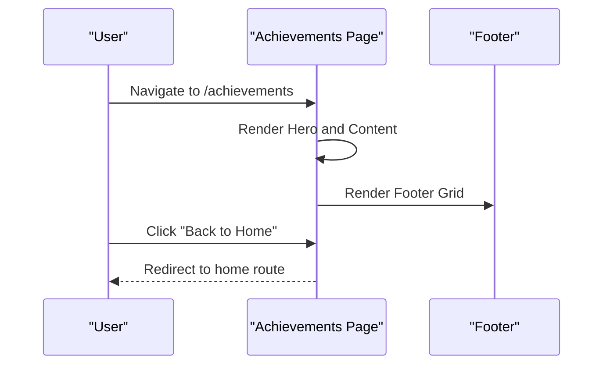
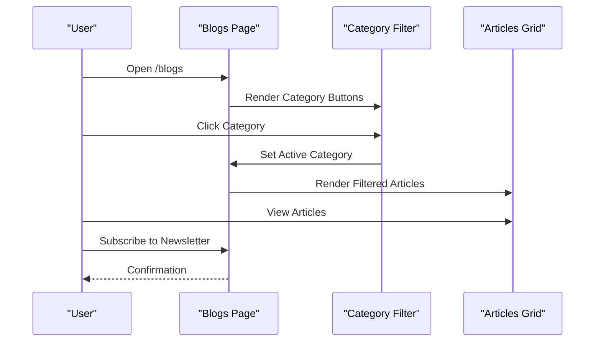
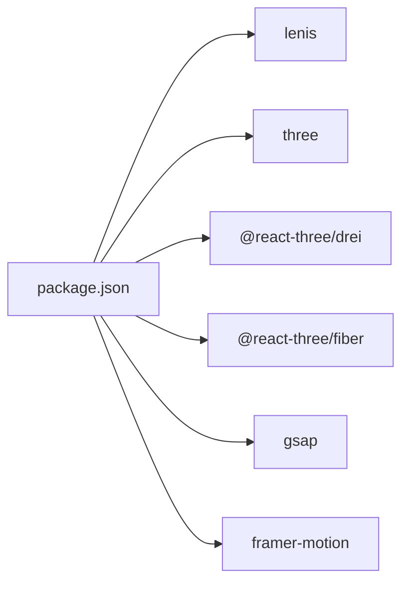

# Informational Pages

<cite>
**Referenced Files in This Document**
- [layout.tsx](file://app/layout.tsx)
- [globals.css](file://app/globals.css)
- [Header.tsx](file://app/components/Header.tsx)
- [HeaderWrapper.tsx](file://app/components/HeaderWrapper.tsx)
- [about/page.tsx](file://app/about/page.tsx)
- [about/about.css](file://app/about/about.css)
- [achievements/page.tsx](file://app/achievements/page.tsx)
- [achievements/achievements.css](file://app/achievements/achievements.css)
- [blogs/page.tsx](file://app/blogs/page.tsx)
- [blogs/blogs.css](file://app/blogs/blogs.css)
- [package.json](file://package.json)
</cite>

## Table of Contents
1. [Introduction](#introduction)
2. [Project Structure](#project-structure)
3. [Core Components](#core-components)
4. [Architecture Overview](#architecture-overview)
5. [Detailed Component Analysis](#detailed-component-analysis)
6. [Dependency Analysis](#dependency-analysis)
7. [Performance Considerations](#performance-considerations)
8. [Troubleshooting Guide](#troubleshooting-guide)
9. [Conclusion](#conclusion)
10. [Appendices](#appendices)

## Introduction
This document describes the informational pages that communicate company identity, achievements, and industry insights. It covers:
- About Us: company history, mission, team, values, and corporate highlights
- Achievements: milestones, awards, and recognition
- Blogs: curated articles, categories, and newsletter signup

It also documents content organization strategies, image handling, responsive design patterns, content rendering, SEO optimization, performance considerations, editorial workflows, and integration with site navigation.

## Project Structure
The informational pages are implemented as Next.js app directory routes with dedicated page components and styles. Navigation is provided via a shared header component integrated into the root layout.

**Diagram sources**
- [layout.tsx:13-23](file://app/layout.tsx#L13-L23)
- [HeaderWrapper.tsx:7-24](file://app/components/HeaderWrapper.tsx#L7-L24)
- [Header.tsx:10-82](file://app/components/Header.tsx#L10-L82)
- [about/page.tsx:10-296](file://app/about/page.tsx#L10-L296)
- [achievements/page.tsx:7-76](file://app/achievements/page.tsx#L7-L76)
- [blogs/page.tsx:7-223](file://app/blogs/page.tsx#L7-L223)
- [about/about.css:1-193](file://app/about/about.css#L1-L193)
- [achievements/achievements.css:1-35](file://app/achievements/achievements.css#L1-L35)
- [blogs/blogs.css:1-280](file://app/blogs/blogs.css#L1-L280)

**Section sources**
- [layout.tsx:13-23](file://app/layout.tsx#L13-L23)
- [HeaderWrapper.tsx:7-24](file://app/components/HeaderWrapper.tsx#L7-L24)
- [Header.tsx:10-82](file://app/components/Header.tsx#L10-L82)

## Core Components
- Root layout injects global styles and wraps pages with a header provider and a scroll-aware provider.
- Global design tokens and reusable styles define typography, spacing, and motion.
- Header integrates navigation links to About, Achievements, Blogs, and other sections.
- Each informational page composes its own sections and styles.

Key implementation references:
- Root layout and providers: [layout.tsx:13-23](file://app/layout.tsx#L13-L23)
- Global design tokens and shared styles: [globals.css:1-9](file://app/globals.css#L1-L9)
- Header navigation: [Header.tsx:10-82](file://app/components/Header.tsx#L10-L82)
- Header wrapper logic: [HeaderWrapper.tsx:7-24](file://app/components/HeaderWrapper.tsx#L7-L24)

**Section sources**
- [layout.tsx:13-23](file://app/layout.tsx#L13-L23)
- [globals.css:1-9](file://app/globals.css#L1-L9)
- [Header.tsx:10-82](file://app/components/Header.tsx#L10-L82)
- [HeaderWrapper.tsx:7-24](file://app/components/HeaderWrapper.tsx#L7-L24)

## Architecture Overview
The informational pages follow a consistent pattern:
- Shared layout and header ensure cohesive navigation and branding
- Each page defines its own sections and styles
- Responsive breakpoints and motion primitives are centralized in global styles

**Diagram sources**
- [layout.tsx:13-23](file://app/layout.tsx#L13-L23)
- [globals.css:1-9](file://app/globals.css#L1-L9)
- [HeaderWrapper.tsx:7-24](file://app/components/HeaderWrapper.tsx#L7-L24)
- [Header.tsx:10-82](file://app/components/Header.tsx#L10-L82)
- [about/page.tsx:10-296](file://app/about/page.tsx#L10-L296)
- [about/about.css:1-193](file://app/about/about.css#L1-L193)
- [achievements/page.tsx:7-76](file://app/achievements/page.tsx#L7-L76)
- [achievements/achievements.css:1-35](file://app/achievements/achievements.css#L1-L35)
- [blogs/page.tsx:7-223](file://app/blogs/page.tsx#L7-L223)
- [blogs/blogs.css:1-280](file://app/blogs/blogs.css#L1-L280)

## Detailed Component Analysis

### About Us Page
Purpose:
- Present company history, mission, stats, timeline, leadership team, and call-to-action.

Rendering and interactivity:
- Uses scroll-driven parallax layers for layered hero movement
- Intersection Observer triggers fade-in reveals for sections
- Animated counters for statistics with easing
- Team cards support pointer-based 3D tilt with requestAnimationFrame smoothing
- Optional cursor glow effect on desktop

Content organization:
- Hero with layered visuals and a concise mission statement
- Stats grid with animated counters
- Timeline of milestones
- Team grid with placeholder images
- Call-to-action panel
- Footer with internal navigation and contact info

Responsive design:
- Grids adapt to narrow screens
- Typography scales with clamp
- Perspective and transforms adjust for mobile

SEO and accessibility:
- Semantic headings and lists
- Alt text placeholders for images
- Focusable navigation via keyboard

Performance considerations:
- Passive event listeners for scroll and pointer events
- Cleanup of observers and listeners on unmount
- requestAnimationFrame for smooth animations

**Diagram sources**
- [about/page.tsx:14-155](file://app/about/page.tsx#L14-L155)

**Section sources**
- [about/page.tsx:10-296](file://app/about/page.tsx#L10-L296)
- [about/about.css:1-193](file://app/about/about.css#L1-L193)

### Achievements Page
Purpose:
- Showcase milestones, awards, and recognition in a focused layout.

Rendering and interactivity:
- Hero section with eyebrow, title, and description
- Back-to-home navigation
- Footer with brand, quick links, services, and contact info

Content organization:
- Hero section centered content
- Footer grid with brand, links, services, and contact details

Responsive design:
- Centered hero with constrained max widths
- Footer grid adapts to available space

SEO and accessibility:
- Semantic headings and links
- Alt text for logo image

Performance considerations:
- Stateless component with minimal DOM nodes
- Static footer content

**Diagram sources**
- [achievements/page.tsx:7-76](file://app/achievements/page.tsx#L7-L76)

**Section sources**
- [achievements/page.tsx:7-76](file://app/achievements/page.tsx#L7-L76)
- [achievements/achievements.css:1-35](file://app/achievements/achievements.css#L1-L35)

### Blogs Page
Purpose:
- Deliver curated articles, categorized content, and newsletter subscription.

Rendering and interactivity:
- Hero headline and description
- Category filter buttons with active state
- Article cards with date, category badge, title, excerpt, and link
- Pagination controls
- Newsletter signup form

Content organization:
- Hero section for context
- Category navigation
- Responsive article grid
- Pagination controls
- Newsletter card with form

Responsive design:
- Grid auto-fill with minmax sizing
- Wrap for category buttons
- Footer grid with flexible layout

SEO and accessibility:
- Semantic headings and lists
- Accessible button states
- Form elements styled consistently

Performance considerations:
- Local state for active category
- Minimal external dependencies
- Styled elements leverage global design tokens

**Diagram sources**
- [blogs/page.tsx:7-223](file://app/blogs/page.tsx#L7-L223)

**Section sources**
- [blogs/page.tsx:7-223](file://app/blogs/page.tsx#L7-L223)
- [blogs/blogs.css:1-280](file://app/blogs/blogs.css#L1-L280)

## Dependency Analysis
External libraries influence motion and UX:
- lenis: scroll behavior enhancement
- three, @react-three/fiber, @react-three/drei: 3D scenes (used elsewhere in the app)
- gsap: animations (used elsewhere in the app)
- framer-motion: animations (used elsewhere in the app)

These libraries are not directly imported in the informational pages but inform the broader motion and animation patterns used across the site.

**Diagram sources**
- [package.json:11-21](file://package.json#L11-L21)

**Section sources**
- [package.json:11-21](file://package.json#L11-L21)

## Performance Considerations
- Event listener management: All pages attach and clean up listeners to avoid leaks.
- Intersection Observer: Used for reveal animations and counters to minimize layout thrash.
- requestAnimationFrame: Used for smooth parallax and cursor glow to reduce jank.
- Passive listeners: Applied to scroll and pointer events for better scrolling performance.
- CSS transforms and perspective: Prefer GPU-accelerated properties for animations.
- Responsive grids: Auto-fill and clamp enable efficient layouts across devices.
- Minimal DOM: Achievements and Blogs pages keep markup lightweight.

[No sources needed since this section provides general guidance]

## Troubleshooting Guide
Common issues and resolutions:
- Animations not triggering
  - Verify IntersectionObserver thresholds and element visibility
  - Confirm CSS classes for reveal states are applied
- Parallax not working
  - Ensure parallax layers exist and have data-depth attributes
  - Check scroll event attachment and cleanup
- Team card tilt not smooth
  - Confirm pointermove handlers and requestAnimationFrame scheduling
  - Validate cancelAnimationFrame on unmount
- Counters not animating
  - Check counter observer intersection and target values
  - Verify easing and duration logic
- Mobile cursor glow appears unexpectedly
  - Ensure mobile detection prevents glow creation
  - Confirm removal on unmount

**Section sources**
- [about/page.tsx:14-155](file://app/about/page.tsx#L14-L155)

## Conclusion
The informational pages are structured for clarity, performance, and maintainability. They share a cohesive design system via global styles and a unified header, while each page tailors content and interactions to its purpose. The approach balances motion with performance and ensures accessible, responsive experiences across devices.

[No sources needed since this section summarizes without analyzing specific files]

## Appendices

### Navigation Integration
- The header exposes links to About, Achievements, and Blogs, enabling seamless access to informational content.
- HeaderWrapper conditionally renders the header outside the splash route.

**Section sources**
- [Header.tsx:10-82](file://app/components/Header.tsx#L10-L82)
- [HeaderWrapper.tsx:7-24](file://app/components/HeaderWrapper.tsx#L7-L24)

### Content Organization Strategies
- Use semantic headings to structure content hierarchy
- Employ grid layouts for statistics, teams, and articles
- Apply category filters for discoverability
- Keep footers consistent across pages for cross-linking

[No sources needed since this section provides general guidance]

### Image Handling
- Placeholder images are used for team members; replace with optimized assets in production
- Ensure alt attributes are descriptive for accessibility and SEO

**Section sources**
- [about/page.tsx:224-243](file://app/about/page.tsx#L224-L243)

### Responsive Design Patterns
- clamp for fluid typography
- CSS Grid with repeat(auto-fill, minmax()) for adaptable card layouts
- Media queries for tablet and mobile adjustments

**Section sources**
- [about/about.css:1-193](file://app/about/about.css#L1-L193)
- [blogs/blogs.css:1-280](file://app/blogs/blogs.css#L1-L280)

### SEO Optimization
- Semantic headings and lists
- Descriptive alt text for images
- Internal linking via header and footer
- Consistent page structure across informational pages

[No sources needed since this section provides general guidance]

### Performance Considerations
- Prefer passive listeners for scroll and pointer events
- Use requestAnimationFrame for smooth animations
- Clean up observers and listeners on unmount
- Minimize heavy DOM nodes in information-heavy pages

**Section sources**
- [about/page.tsx:14-155](file://app/about/page.tsx#L14-L155)
- [blogs/page.tsx:7-223](file://app/blogs/page.tsx#L7-L223)

### Content Creation Workflows
- Define content pillars: history, milestones, team, and insights
- Use category filters for article organization
- Maintain consistent imagery and alt text
- Test responsiveness across breakpoints

[No sources needed since this section provides general guidance]

### Editorial Processes
- Assign ownership for each informational area
- Establish review cycles for accuracy and freshness
- Rotate content periodically to reflect current achievements and insights

[No sources needed since this section provides general guidance]

### Maintenance Procedures
- Audit links and navigation monthly
- Refresh placeholder images with branded assets
- Monitor performance metrics and adjust animations as needed

[No sources needed since this section provides general guidance]