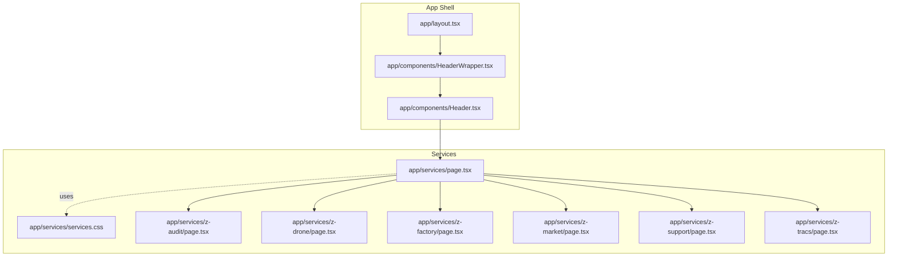
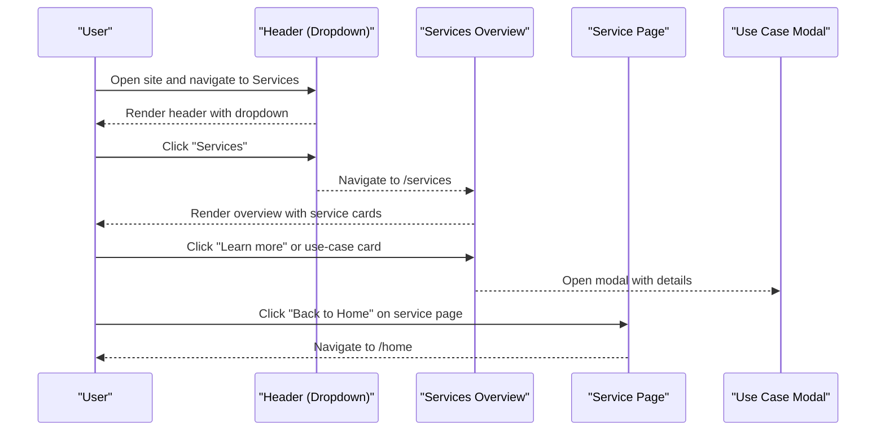
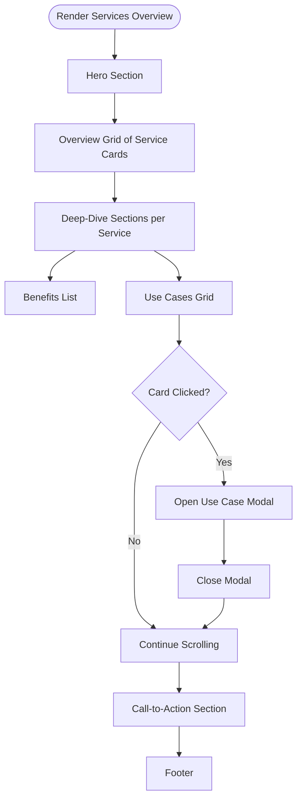
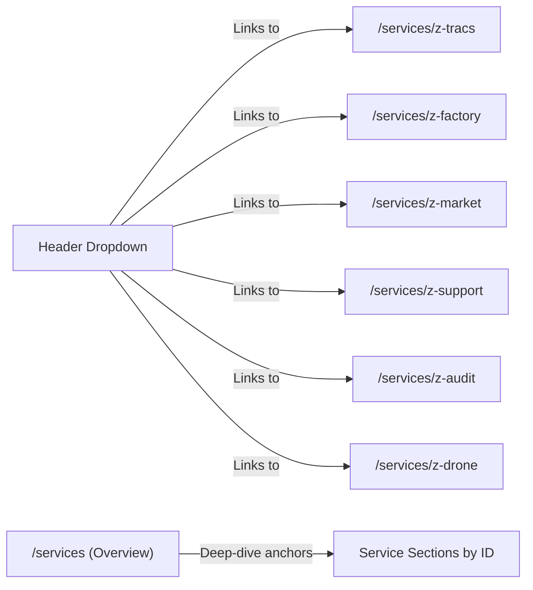
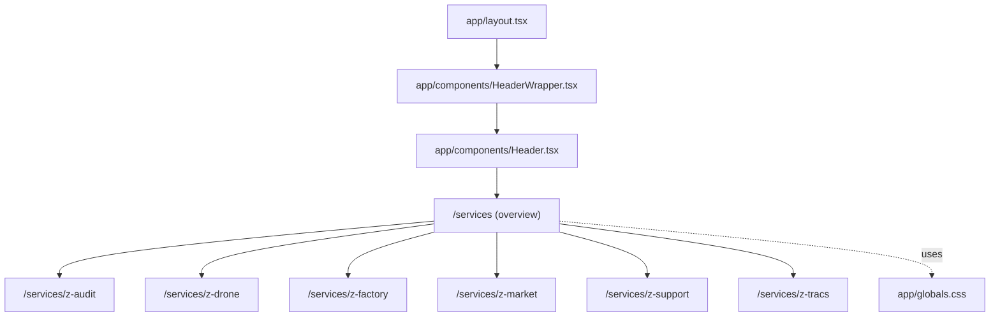

# Service Showcase Pages

<cite>
**Referenced Files in This Document**
- [app/layout.tsx](file://app/layout.tsx)
- [app/components/HeaderWrapper.tsx](file://app/components/HeaderWrapper.tsx)
- [app/components/Header.tsx](file://app/components/Header.tsx)
- [app/services/page.tsx](file://app/services/page.tsx)
- [app/services/services.css](file://app/services/services.css)
- [app/services/z-audit/page.tsx](file://app/services/z-audit/page.tsx)
- [app/services/z-drone/page.tsx](file://app/services/z-drone/page.tsx)
- [app/services/z-factory/page.tsx](file://app/services/z-factory/page.tsx)
- [app/services/z-market/page.tsx](file://app/services/z-market/page.tsx)
- [app/services/z-support/page.tsx](file://app/services/z-support/page.tsx)
- [app/services/z-tracs/page.tsx](file://app/services/z-tracs/page.tsx)
- [app/globals.css](file://app/globals.css)
</cite>

## Table of Contents
1. [Introduction](#introduction)
2. [Project Structure](#project-structure)
3. [Core Components](#core-components)
4. [Architecture Overview](#architecture-overview)
5. [Detailed Component Analysis](#detailed-component-analysis)
6. [Dependency Analysis](#dependency-analysis)
7. [Performance Considerations](#performance-considerations)
8. [Troubleshooting Guide](#troubleshooting-guide)
9. [Conclusion](#conclusion)

## Introduction
This document explains the service showcase pages that highlight Zeex AI’s surveillance platform offerings. It covers the shared services overview page and the six individual service pages (Z-Audit, Z-Drone, Z-Factory, Z-Market, Z-Support, Z-Tracs). It documents content structure, service-specific features, responsive design, interactive elements, performance characteristics, and content management approaches. It also describes how users discover services via navigation and how to maintain consistency and add new offerings.

## Project Structure
The service showcase spans a single overview page and six dedicated service pages under the services route. The overview page dynamically renders multiple service sections, while each service page currently provides a minimal hero-style presentation. Navigation integrates the service catalog into the site header dropdown.

**Diagram sources**
- [app/layout.tsx:13-23](file://app/layout.tsx#L13-L23)
- [app/components/HeaderWrapper.tsx:7-24](file://app/components/HeaderWrapper.tsx#L7-L24)
- [app/components/Header.tsx:10-82](file://app/components/Header.tsx#L10-L82)
- [app/services/page.tsx:7-379](file://app/services/page.tsx#L7-L379)
- [app/services/services.css:1-5](file://app/services/services.css#L1-L5)
- [app/services/z-audit/page.tsx:6-24](file://app/services/z-audit/page.tsx#L6-L24)
- [app/services/z-drone/page.tsx:6-24](file://app/services/z-drone/page.tsx#L6-L24)
- [app/services/z-factory/page.tsx:6-24](file://app/services/z-factory/page.tsx#L6-L24)
- [app/services/z-market/page.tsx:6-24](file://app/services/z-market/page.tsx#L6-L24)
- [app/services/z-support/page.tsx:6-24](file://app/services/z-support/page.tsx#L6-L24)
- [app/services/z-tracs/page.tsx:6-24](file://app/services/z-tracs/page.tsx#L6-L24)

**Section sources**
- [app/layout.tsx:13-23](file://app/layout.tsx#L13-L23)
- [app/components/HeaderWrapper.tsx:7-24](file://app/components/HeaderWrapper.tsx#L7-L24)
- [app/components/Header.tsx:10-82](file://app/components/Header.tsx#L10-L82)
- [app/services/page.tsx:7-379](file://app/services/page.tsx#L7-L379)
- [app/services/services.css:1-5](file://app/services/services.css#L1-L5)

## Core Components
- Services overview page: Renders a hero, a grid of service cards, deep-dive sections per service, a use-case modal, and a call-to-action footer. It uses a central data structure to define service metadata and benefits, and a modal to expand on use cases.
- Individual service pages: Each page is a minimal hero presentation with a back-to-home link. They share a similar structure and rely on the shared layout and header.
- Navigation integration: The header dropdown exposes links to all six service pages, enabling discovery from the main navigation.

Implementation highlights:
- Responsive design: Uses CSS clamp, CSS Grid, and Flexbox to adapt to viewport widths.
- Interactive elements: Hover effects on cards and use-case cards; a modal dialog for expanded use-case details.
- Content management: Service metadata and benefits are centralized in the overview page’s data structure, simplifying updates.

**Section sources**
- [app/services/page.tsx:7-379](file://app/services/page.tsx#L7-L379)
- [app/services/z-audit/page.tsx:6-24](file://app/services/z-audit/page.tsx#L6-L24)
- [app/services/z-drone/page.tsx:6-24](file://app/services/z-drone/page.tsx#L6-L24)
- [app/services/z-factory/page.tsx:6-24](file://app/services/z-factory/page.tsx#L6-L24)
- [app/services/z-market/page.tsx:6-24](file://app/services/z-market/page.tsx#L6-L24)
- [app/services/z-support/page.tsx:6-24](file://app/services/z-support/page.tsx#L6-L24)
- [app/services/z-tracs/page.tsx:6-24](file://app/services/z-tracs/page.tsx#L6-L24)
- [app/components/Header.tsx:23-72](file://app/components/Header.tsx#L23-L72)

## Architecture Overview
The service showcase follows a Next.js app router pattern with a shared layout and header. The services overview page composes multiple sections and a modal dialog. Each service page is a lightweight route handler rendering a hero section.

**Diagram sources**
- [app/components/Header.tsx:23-72](file://app/components/Header.tsx#L23-L72)
- [app/services/page.tsx:159-161](file://app/services/page.tsx#L159-L161)
- [app/services/page.tsx:209-241](file://app/services/page.tsx#L209-L241)
- [app/services/page.tsx:266-323](file://app/services/page.tsx#L266-L323)
- [app/services/z-audit/page.tsx:18](file://app/services/z-audit/page.tsx#L18)
- [app/services/z-drone/page.tsx:18](file://app/services/z-drone/page.tsx#L18)
- [app/services/z-factory/page.tsx:18](file://app/services/z-factory/page.tsx#L18)
- [app/services/z-market/page.tsx:18](file://app/services/z-market/page.tsx#L18)
- [app/services/z-support/page.tsx:18](file://app/services/z-support/page.tsx#L18)
- [app/services/z-tracs/page.tsx:18](file://app/services/z-tracs/page.tsx#L18)

## Detailed Component Analysis

### Services Overview Page
- Purpose: Present a curated set of surveillance services with benefits, use cases, and a modal for deeper exploration.
- Data model: Central array defines service entries with id, title, description, benefits, and use cases.
- Sections:
  - Hero: Onboarding messaging and a “Get Started” anchor link.
  - Services overview grid: Each service card shows title, description, and a link to the deep-dive section.
  - Deep-dive sections: For each service, a two-column layout with description/benefits and a grid of use cases. Use cases are interactive cards that open a modal.
  - CTA section: Encourages consultation and solution exploration.
  - Footer: Site footer with quick links and contact info.
- Interactions:
  - Use-case cards: Click triggers a modal with a placeholder for video content and a close action.
  - Benefit lists: Styled bullet points with accent color.
- Responsive design:
  - Grids use repeat and clamp to adapt to screen sizes.
  - Typography scales with clamp for headings.
  - Modals use max-width and max-height constraints with overflow handling.

**Diagram sources**
- [app/services/page.tsx:127-248](file://app/services/page.tsx#L127-L248)
- [app/services/page.tsx:265-323](file://app/services/page.tsx#L265-L323)

**Section sources**
- [app/services/page.tsx:7-379](file://app/services/page.tsx#L7-L379)

### Z-Audit Service Page
- Structure: Minimal hero with eyebrow, title, description, and a back-to-home link.
- Presentation: Consistent with other service pages; intended to be extended with content and media.

**Section sources**
- [app/services/z-audit/page.tsx:6-24](file://app/services/z-audit/page.tsx#L6-L24)

### Z-Drone Service Page
- Structure: Same minimal hero pattern as Z-Audit.
- Presentation: Ready for expansion with aerial surveillance specifics.

**Section sources**
- [app/services/z-drone/page.tsx:6-24](file://app/services/z-drone/page.tsx#L6-L24)

### Z-Factory Service Page
- Structure: Same minimal hero pattern.
- Presentation: Suitable for industrial safety and compliance content.

**Section sources**
- [app/services/z-factory/page.tsx:6-24](file://app/services/z-factory/page.tsx#L6-L24)

### Z-Market Service Page
- Structure: Same minimal hero pattern.
- Presentation: Designed for retail and wholesale safety content.

**Section sources**
- [app/services/z-market/page.tsx:6-24](file://app/services/z-market/page.tsx#L6-L24)

### Z-Support Service Page
- Structure: Same minimal hero pattern.
- Presentation: Intended for customer assistance and technical support content.

**Section sources**
- [app/services/z-support/page.tsx:6-24](file://app/services/z-support/page.tsx#L6-L24)

### Z-Tracs Service Page
- Structure: Same minimal hero pattern.
- Presentation: Prepared for tracking and monitoring solutions.

**Section sources**
- [app/services/z-tracs/page.tsx:6-24](file://app/services/z-tracs/page.tsx#L6-L24)

### Navigation Integration
- The header dropdown exposes links to all six service routes, enabling users to discover offerings directly from the main navigation.
- The overview page anchors deep-dive sections by service id, allowing smooth scrolling and linking.

**Diagram sources**
- [app/components/Header.tsx:23-72](file://app/components/Header.tsx#L23-L72)
- [app/services/page.tsx:169-170](file://app/services/page.tsx#L169-L170)

**Section sources**
- [app/components/Header.tsx:23-72](file://app/components/Header.tsx#L23-L72)
- [app/services/page.tsx:169-170](file://app/services/page.tsx#L169-L170)

## Dependency Analysis
- Layout and shell:
  - Root layout injects global styles and wraps children with a header wrapper.
  - Header wrapper conditionally renders the header based on the current path.
- Header:
  - Provides navigation and a dropdown menu linking to service pages.
- Services overview:
  - Owns the data structure for services and orchestrates the use-case modal.
  - Imports and applies a minimal services stylesheet.
- Global styles:
  - Provide base design tokens, typography, hover effects, and reusable card styles leveraged by service pages.

**Diagram sources**
- [app/layout.tsx:13-23](file://app/layout.tsx#L13-L23)
- [app/components/HeaderWrapper.tsx:7-24](file://app/components/HeaderWrapper.tsx#L7-L24)
- [app/components/Header.tsx:10-82](file://app/components/Header.tsx#L10-L82)
- [app/services/page.tsx:7-379](file://app/services/page.tsx#L7-L379)
- [app/globals.css:1625-1749](file://app/globals.css#L1625-L1749)

**Section sources**
- [app/layout.tsx:13-23](file://app/layout.tsx#L13-L23)
- [app/components/HeaderWrapper.tsx:7-24](file://app/components/HeaderWrapper.tsx#L7-L24)
- [app/components/Header.tsx:10-82](file://app/components/Header.tsx#L10-L82)
- [app/services/page.tsx:7-379](file://app/services/page.tsx#L7-L379)
- [app/globals.css:1625-1749](file://app/globals.css#L1625-L1749)

## Performance Considerations
- Rendering model:
  - The overview page renders a fixed number of service sections and a modal. Keep the number of rendered sections reasonable to avoid excessive DOM nodes.
- CSS:
  - Reusable card styles and hover effects are defined globally, reducing duplication and improving maintainability.
- Interactions:
  - The modal is conditionally rendered and uses a backdrop click to dismiss, minimizing unnecessary re-renders.
- Responsiveness:
  - CSS Grid and Flexbox with clamp ensure efficient layout adaptation without heavy JavaScript.
- Navigation:
  - Client-side navigation via Next.js Link avoids full page reloads for internal routes.

[No sources needed since this section provides general guidance]

## Troubleshooting Guide
- Service links not appearing in navigation:
  - Verify the header dropdown includes entries for all six services and that the paths match the route structure.
- Use-case modal does not open:
  - Confirm the click handlers are attached to use-case cards and that the selected state toggles correctly.
- Styles not applied:
  - Ensure the services stylesheet is imported in the overview page and that global styles are loaded by the layout.
- Responsive layout issues:
  - Check CSS clamp and grid configurations for appropriate breakpoints and spacing.

**Section sources**
- [app/components/Header.tsx:23-72](file://app/components/Header.tsx#L23-L72)
- [app/services/page.tsx:209-241](file://app/services/page.tsx#L209-L241)
- [app/services/page.tsx:266-323](file://app/services/page.tsx#L266-L323)
- [app/services/services.css:1-5](file://app/services/services.css#L1-L5)
- [app/layout.tsx:13-23](file://app/layout.tsx#L13-L23)

## Conclusion
The service showcase pages adopt a consistent, modular structure: a shared overview page with centralized content and interactivity, and individual service pages with a uniform hero layout. Navigation integrates services directly into the header dropdown, enabling easy discovery. The design system emphasizes responsiveness, subtle animations, and reusable card styles. Extending or updating services involves modifying the overview data structure and ensuring header links remain synchronized.