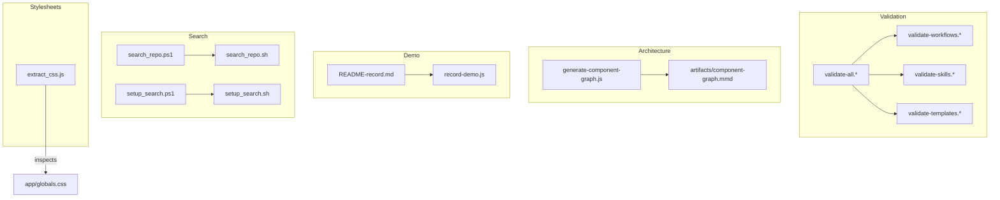
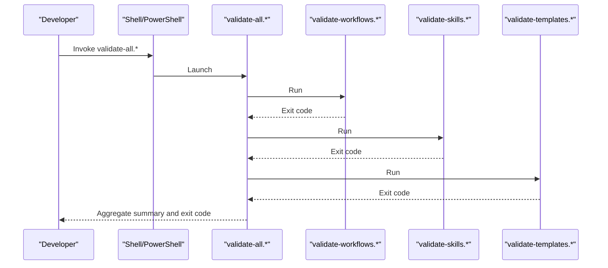
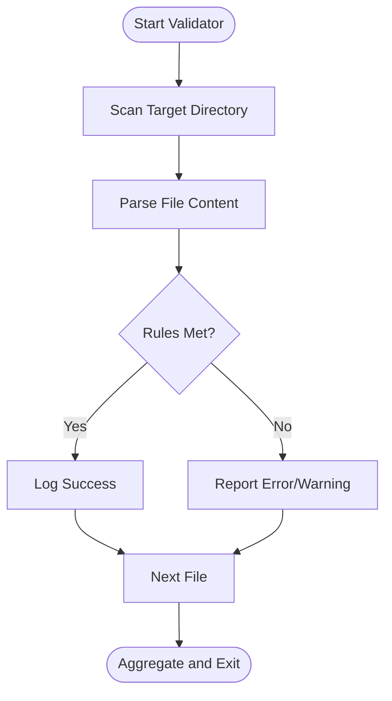
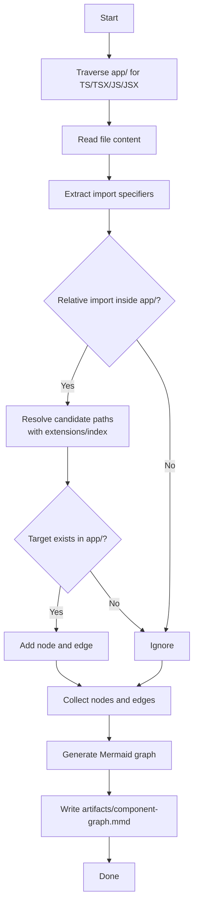
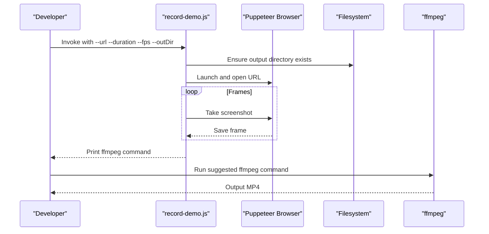
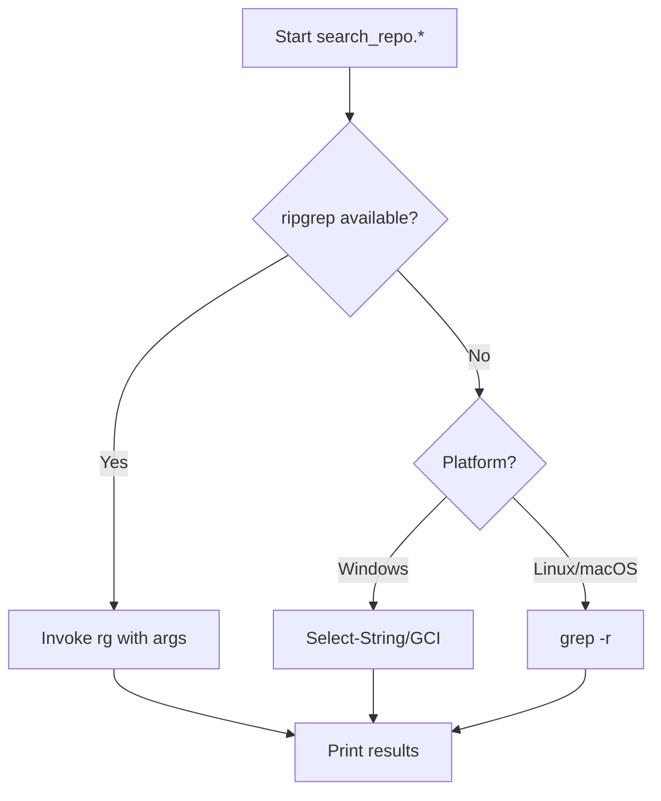
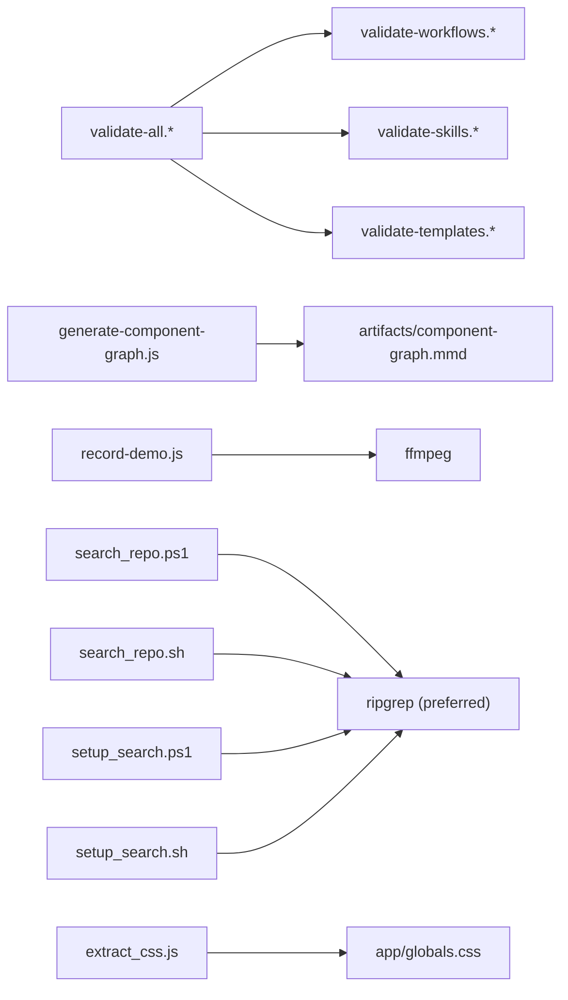

# Development Tools & Scripts

<cite>
**Referenced Files in This Document**
- [validate-all.ps1](file://scripts/validate-all.ps1)
- [validate-all.sh](file://scripts/validate-all.sh)
- [validate-workflows.ps1](file://scripts/validate-workflows.ps1)
- [validate-workflows.sh](file://scripts/validate-workflows.sh)
- [validate-skills.ps1](file://scripts/validate-skills.ps1)
- [validate-skills.sh](file://scripts/validate-skills.sh)
- [validate-templates.ps1](file://scripts/validate-templates.ps1)
- [validate-templates.sh](file://scripts/validate-templates.sh)
- [generate-component-graph.js](file://scripts/generate-component-graph.js)
- [README-record.md](file://scripts/README-record.md)
- [record-demo.js](file://scripts/record-demo.js)
- [search_repo.ps1](file://scripts/search_repo.ps1)
- [search_repo.sh](file://scripts/search_repo.sh)
- [setup_search.ps1](file://scripts/setup_search.ps1)
- [setup_search.sh](file://scripts/setup_search.sh)
- [extract_css.js](file://scripts/extract_css.js)
</cite>

## Table of Contents
1. [Introduction](#introduction)
2. [Project Structure](#project-structure)
3. [Core Components](#core-components)
4. [Architecture Overview](#architecture-overview)
5. [Detailed Component Analysis](#detailed-component-analysis)
6. [Dependency Analysis](#dependency-analysis)
7. [Performance Considerations](#performance-considerations)
8. [Troubleshooting Guide](#troubleshooting-guide)
9. [Conclusion](#conclusion)
10. [Appendices](#appendices)

## Introduction
This document describes the development tools and utility scripts that support the Zeex AI website’s GSD (Guided Structured Development) methodology. It covers:
- Validation scripts ensuring correct GSD workflow and skill structures
- Component graph generation for visual architecture
- Automated demo recording pipeline
- Search utilities for efficient code navigation
- CSS extraction tool for stylesheet optimization
It also explains cross-platform execution, customization, and integration into the development workflow.

## Project Structure
The scripts live under the scripts/ directory and are organized by function:
- Validation suite: validate-all.*, validate-workflows.*, validate-skills.*, validate-templates.*
- Component graph generator: generate-component-graph.js
- Demo recording: README-record.md, record-demo.js
- Search utilities: search_repo.*, setup_search.*
- CSS extraction: extract_css.js

**Diagram sources**
- [validate-all.ps1:1-43](file://scripts/validate-all.ps1#L1-L43)
- [validate-workflows.ps1:1-60](file://scripts/validate-workflows.ps1#L1-L60)
- [validate-skills.ps1:1-69](file://scripts/validate-skills.ps1#L1-L69)
- [validate-templates.ps1:1-59](file://scripts/validate-templates.ps1#L1-L59)
- [generate-component-graph.js:1-93](file://scripts/generate-component-graph.js#L1-L93)
- [README-record.md:1-40](file://scripts/README-record.md#L1-L40)
- [record-demo.js:1-46](file://scripts/record-demo.js#L1-L46)
- [search_repo.ps1:1-96](file://scripts/search_repo.ps1#L1-L96)
- [search_repo.sh:1-59](file://scripts/search_repo.sh#L1-L59)
- [setup_search.ps1:1-98](file://scripts/setup_search.ps1#L1-L98)
- [setup_search.sh:1-104](file://scripts/setup_search.sh#L1-L104)
- [extract_css.js:1-34](file://scripts/extract_css.js#L1-L34)

**Section sources**
- [validate-all.ps1:1-43](file://scripts/validate-all.ps1#L1-L43)
- [validate-all.sh:1-45](file://scripts/validate-all.sh#L1-L45)

## Core Components
- GSD Validation Suite
  - Master validator orchestrates workflow, skill, and template validations.
  - Workflow validator enforces frontmatter presence, description, and optional process tags.
  - Skill validator enforces SKILL.md existence and frontmatter fields (name, description).
  - Template validator enforces title presence, last-updated notice, and minimal length.
- Component Graph Generator
  - Traverses app/ TypeScript/TSX/JS/JSX files, resolves relative imports, and emits a Mermaid diagram to artifacts/component-graph.mmd.
- Demo Recording
  - Puppeteer-based recorder captures frames from a running Next.js dev server and prints ffmpeg conversion instructions.
- Search Utilities
  - Cross-platform search wrapper preferring ripgrep/fd, falling back to native tools.
  - Setup helpers detect and guide installation of performance-enhancing tools.
- CSS Extraction Tool
  - Reads app/globals.css and outlines extraction strategy via prefix-to-section mapping.

**Section sources**
- [validate-workflows.ps1:1-60](file://scripts/validate-workflows.ps1#L1-L60)
- [validate-workflows.sh:1-59](file://scripts/validate-workflows.sh#L1-L59)
- [validate-skills.ps1:1-69](file://scripts/validate-skills.ps1#L1-L69)
- [validate-skills.sh:1-66](file://scripts/validate-skills.sh#L1-L66)
- [validate-templates.ps1:1-59](file://scripts/validate-templates.ps1#L1-L59)
- [validate-templates.sh:1-59](file://scripts/validate-templates.sh#L1-L59)
- [generate-component-graph.js:1-93](file://scripts/generate-component-graph.js#L1-L93)
- [README-record.md:1-40](file://scripts/README-record.md#L1-L40)
- [record-demo.js:1-46](file://scripts/record-demo.js#L1-L46)
- [search_repo.ps1:1-96](file://scripts/search_repo.ps1#L1-L96)
- [search_repo.sh:1-59](file://scripts/search_repo.sh#L1-L59)
- [setup_search.ps1:1-98](file://scripts/setup_search.ps1#L1-L98)
- [setup_search.sh:1-104](file://scripts/setup_search.sh#L1-L104)
- [extract_css.js:1-34](file://scripts/extract_css.js#L1-L34)

## Architecture Overview
The validation suite is modular and cross-platform. The master validator invokes platform-specific shells. The component graph generator focuses on app/ imports to produce a Mermaid diagram. The demo recording system integrates with a local dev server and ffmpeg. Search utilities adapt to available tools. CSS extraction outlines a strategy for splitting globals.css into route-scoped stylesheets.

**Diagram sources**
- [validate-all.ps1:1-43](file://scripts/validate-all.ps1#L1-L43)
- [validate-all.sh:1-45](file://scripts/validate-all.sh#L1-L45)
- [validate-workflows.ps1:1-60](file://scripts/validate-workflows.ps1#L1-L60)
- [validate-workflows.sh:1-59](file://scripts/validate-workflows.sh#L1-L59)
- [validate-skills.ps1:1-69](file://scripts/validate-skills.ps1#L1-L69)
- [validate-skills.sh:1-66](file://scripts/validate-skills.sh#L1-L66)
- [validate-templates.ps1:1-59](file://scripts/validate-templates.ps1#L1-L59)
- [validate-templates.sh:1-59](file://scripts/validate-templates.sh#L1-L59)

## Detailed Component Analysis

### Validation Scripts
- Purpose
  - Enforce GSD structure across workflows, skills, and templates.
- Execution
  - Cross-platform: PowerShell (.ps1) and Bash (.sh) variants.
  - Master validator aggregates errors and exits with non-zero status on failures.
- Workflow Validation
  - Checks for YAML frontmatter delimiters, description field, and optional process tags.
- Skill Validation
  - Ensures SKILL.md exists per skill directory and validates frontmatter fields.
- Template Validation
  - Enforces title header, last-updated notice, and minimum length.

**Diagram sources**
- [validate-workflows.ps1:13-43](file://scripts/validate-workflows.ps1#L13-L43)
- [validate-skills.ps1:15-53](file://scripts/validate-skills.ps1#L15-L53)
- [validate-templates.ps1:15-42](file://scripts/validate-templates.ps1#L15-L42)

**Section sources**
- [validate-all.ps1:12-28](file://scripts/validate-all.ps1#L12-L28)
- [validate-all.sh:14-29](file://scripts/validate-all.sh#L14-L29)
- [validate-workflows.ps1:20-38](file://scripts/validate-workflows.ps1#L20-L38)
- [validate-workflows.sh:19-37](file://scripts/validate-workflows.sh#L19-L37)
- [validate-skills.ps1:20-48](file://scripts/validate-skills.ps1#L20-L48)
- [validate-skills.sh:19-45](file://scripts/validate-skills.sh#L19-L45)
- [validate-templates.ps1:20-37](file://scripts/validate-templates.ps1#L20-L37)
- [validate-templates.sh:19-37](file://scripts/validate-templates.sh#L19-L37)

### Component Graph Generation
- Purpose
  - Produce a Mermaid diagram of component dependencies within app/.
- Behavior
  - Walks app/ for supported file types.
  - Parses import statements and resolves relative paths.
  - Emits a .mmd file to artifacts/ for visualization.
- Outputs
  - artifacts/component-graph.mmd

**Diagram sources**
- [generate-component-graph.js:4-60](file://scripts/generate-component-graph.js#L4-L60)
- [generate-component-graph.js:62-74](file://scripts/generate-component-graph.js#L62-L74)
- [generate-component-graph.js:76-93](file://scripts/generate-component-graph.js#L76-L93)

**Section sources**
- [generate-component-graph.js:1-93](file://scripts/generate-component-graph.js#L1-L93)

### Demo Recording System
- Purpose
  - Capture a sequence of screenshots from a running dev server and prepare an MP4 via ffmpeg.
- Steps
  - Start Next.js dev server on the expected port.
  - Run the recorder with URL, duration, FPS, and output directory parameters.
  - Convert frames to MP4 using ffmpeg with specified framerate and pixel format.
- Notes
  - Puppeteer downloads a compatible Chromium; can use system Chrome via environment variable.
  - Windows may require elevated permissions during npm install.

**Diagram sources**
- [README-record.md:15-33](file://scripts/README-record.md#L15-L33)
- [record-demo.js:5-35](file://scripts/record-demo.js#L5-L35)

**Section sources**
- [README-record.md:1-40](file://scripts/README-record.md#L1-L40)
- [record-demo.js:1-46](file://scripts/record-demo.js#L1-L46)

### Search Utilities
- Purpose
  - Provide fast, cross-platform codebase search with fallbacks.
- Behavior
  - Prefer ripgrep; otherwise fall back to native tools.
  - Accept file-type filters and case sensitivity toggles.
  - Setup scripts detect installed tools and offer installation guidance.
- Cross-platform
  - PowerShell and Bash wrappers mirror the same logic.

**Diagram sources**
- [search_repo.ps1:24-43](file://scripts/search_repo.ps1#L24-L43)
- [search_repo.ps1:45-95](file://scripts/search_repo.ps1#L45-L95)
- [search_repo.sh:28-33](file://scripts/search_repo.sh#L28-L33)
- [search_repo.sh:35-58](file://scripts/search_repo.sh#L35-L58)

**Section sources**
- [search_repo.ps1:1-96](file://scripts/search_repo.ps1#L1-L96)
- [search_repo.sh:1-59](file://scripts/search_repo.sh#L1-L59)
- [setup_search.ps1:1-98](file://scripts/setup_search.ps1#L1-L98)
- [setup_search.sh:1-104](file://scripts/setup_search.sh#L1-L104)

### CSS Extraction Tool
- Purpose
  - Outline a strategy to split app/globals.css into route-scoped stylesheets using a prefix-to-file mapping.
- Behavior
  - Reads app/globals.css.
  - Maintains a prefix-to-section mapping.
  - Prints a concise note on achievable quick extraction heuristics.

**Section sources**
- [extract_css.js:1-34](file://scripts/extract_css.js#L1-L34)

## Dependency Analysis
- Validation orchestration
  - validate-all.* depends on validate-workflows.*, validate-skills.*, validate-templates.*.
- Component graph generation
  - Depends on app/ structure and file extensions; writes to artifacts/.
- Demo recording
  - Depends on a running dev server and ffmpeg availability.
- Search utilities
  - Prefer rg/fd; otherwise rely on platform-native tools.
- CSS extraction
  - Depends on app/globals.css and the established prefix mapping.

**Diagram sources**
- [validate-all.ps1:12-28](file://scripts/validate-all.ps1#L12-L28)
- [validate-all.sh:14-29](file://scripts/validate-all.sh#L14-L29)
- [generate-component-graph.js:76-90](file://scripts/generate-component-graph.js#L76-L90)
- [record-demo.js:37-45](file://scripts/record-demo.js#L37-L45)
- [search_repo.ps1:24-43](file://scripts/search_repo.ps1#L24-L43)
- [search_repo.sh:28-33](file://scripts/search_repo.sh#L28-L33)
- [setup_search.ps1:18-27](file://scripts/setup_search.ps1#L18-L27)
- [setup_search.sh:14-23](file://scripts/setup_search.sh#L14-L23)
- [extract_css.js:4-34](file://scripts/extract_css.js#L4-L34)

**Section sources**
- [validate-all.ps1:12-28](file://scripts/validate-all.ps1#L12-L28)
- [validate-all.sh:14-29](file://scripts/validate-all.sh#L14-L29)
- [generate-component-graph.js:76-90](file://scripts/generate-component-graph.js#L76-L90)
- [record-demo.js:37-45](file://scripts/record-demo.js#L37-L45)
- [search_repo.ps1:24-43](file://scripts/search_repo.ps1#L24-L43)
- [search_repo.sh:28-33](file://scripts/search_repo.sh#L28-L33)
- [setup_search.ps1:18-27](file://scripts/setup_search.ps1#L18-L27)
- [setup_search.sh:14-23](file://scripts/setup_search.sh#L14-L23)
- [extract_css.js:4-34](file://scripts/extract_css.js#L4-L34)

## Performance Considerations
- Prefer ripgrep and fd for large codebases; they are significantly faster than native PowerShell/Unix tools.
- The component graph generator limits traversal to app/ and filters relative imports to reduce noise.
- Demo recording FPS and duration directly impact CPU, disk, and memory usage; adjust conservatively for CI environments.
- CSS extraction is outlined in extract_css.js; consider incremental extraction strategies to avoid large diffs.

[No sources needed since this section provides general guidance]

## Troubleshooting Guide
- Validation fails unexpectedly
  - Run individual validators to isolate failing files and review reported errors/warnings.
  - Ensure frontmatter delimiters and required fields are present in workflows and skills.
- Component graph missing edges/nodes
  - Confirm app/ file extensions and relative import resolution logic.
  - Verify that targets exist within app/ and resolve to supported extensions.
- Demo recording produces blank frames
  - Ensure the dev server is reachable at the expected URL and port.
  - Increase duration/fps cautiously; verify ffmpeg availability and pixel format compatibility.
- Search returns no results
  - Install ripgrep and/or fd for improved performance and coverage.
  - Verify file-type filters and case sensitivity options match intended scope.
- CSS extraction incomplete
  - Review prefix-to-section mapping and confirm target files exist.
  - Consider refining extraction heuristics to handle nested blocks or comments.

**Section sources**
- [validate-workflows.ps1:20-38](file://scripts/validate-workflows.ps1#L20-L38)
- [validate-skills.ps1:20-48](file://scripts/validate-skills.ps1#L20-L48)
- [generate-component-graph.js:42-56](file://scripts/generate-component-graph.js#L42-L56)
- [README-record.md:15-33](file://scripts/README-record.md#L15-L33)
- [search_repo.ps1:24-43](file://scripts/search_repo.ps1#L24-L43)
- [search_repo.sh:28-33](file://scripts/search_repo.sh#L28-L33)
- [extract_css.js:27-34](file://scripts/extract_css.js#L27-L34)

## Conclusion
These tools collectively enforce GSD discipline, visualize architecture, automate demos, accelerate code navigation, and support stylesheet optimization. They are designed to be cross-platform, optionally enhanced by faster tools, and easily extensible for new validation rules or extraction strategies.

[No sources needed since this section summarizes without analyzing specific files]

## Appendices

### Customization and Extension Guidelines
- Adding new validation rules
  - Extend the appropriate validator (workflows, skills, templates) with additional checks and increment error counters accordingly.
  - Keep messages actionable and include file context for quick fixes.
- Extending the component graph generator
  - Adjust file extension filters and import resolution logic to include additional directories or patterns.
  - Introduce grouping or styling directives in the emitted Mermaid output.
- Enhancing the demo recorder
  - Parameterize viewport, delays, and output naming; integrate with CI artifacts.
  - Add optional post-processing steps (e.g., watermarking, trimming).
- Improving search utilities
  - Add support for additional tool-specific flags and normalize option parsing across platforms.
  - Expand setup scripts to cover more package managers and OS distributions.
- Optimizing CSS extraction
  - Implement robust block parsing for nested rules and media queries.
  - Integrate with build tooling to automatically inject extracted styles.

[No sources needed since this section provides general guidance]