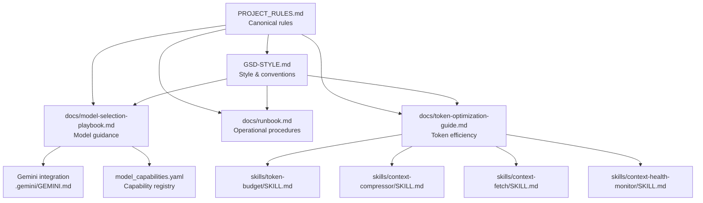
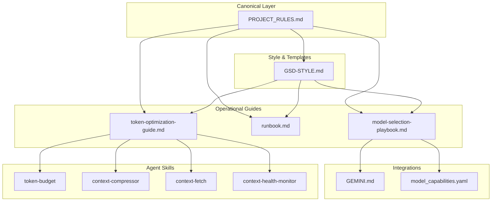
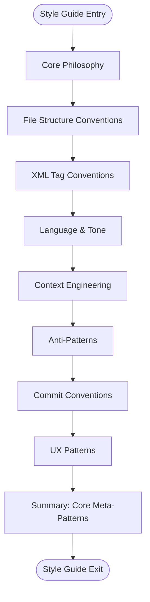
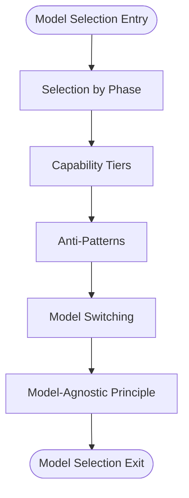
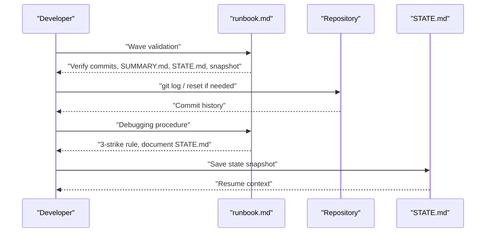
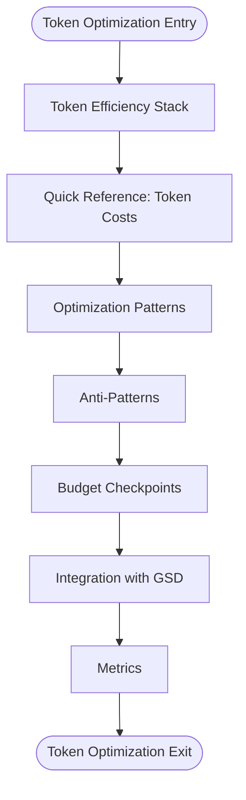
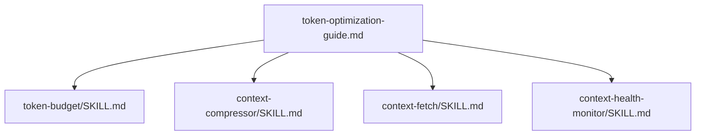
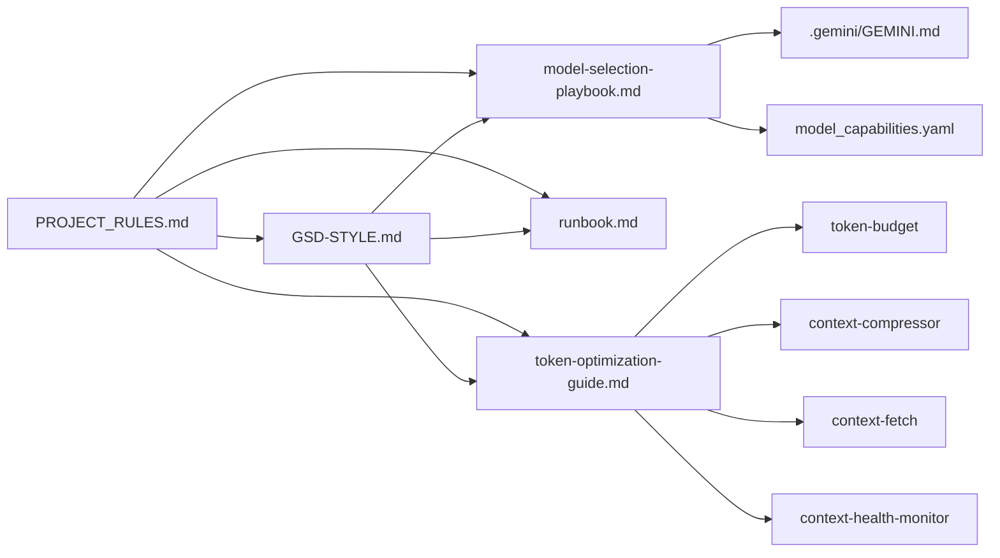

# Documentation & Guidelines

<cite>
**Referenced Files in This Document**
- [GSD-STYLE.md](file://GSD-STYLE.md)
- [PROJECT_RULES.md](file://PROJECT_RULES.md)
- [README.md](file://README.md)
- [docs/model-selection-playbook.md](file://docs/model-selection-playbook.md)
- [docs/runbook.md](file://docs/runbook.md)
- [docs/token-optimization-guide.md](file://docs/token-optimization-guide.md)
- [.gemini/GEMINI.md](file://.gemini/GEMINI.md)
- [model_capabilities.yaml](file://model_capabilities.yaml)
- [.agents/skills/token-budget/SKILL.md](file://.agents/skills/token-budget/SKILL.md)
- [.agents/skills/context-compressor/SKILL.md](file://.agents/skills/context-compressor/SKILL.md)
- [.agents/skills/context-fetch/SKILL.md](file://.agents/skills/context-fetch/SKILL.md)
- [.agents/skills/context-health-monitor/SKILL.md](file://.agents/skills/context-health-monitor/SKILL.md)
</cite>

## Table of Contents
1. [Introduction](#introduction)
2. [Project Structure](#project-structure)
3. [Core Components](#core-components)
4. [Architecture Overview](#architecture-overview)
5. [Detailed Component Analysis](#detailed-component-analysis)
6. [Dependency Analysis](#dependency-analysis)
7. [Performance Considerations](#performance-considerations)
8. [Troubleshooting Guide](#troubleshooting-guide)
9. [Conclusion](#conclusion)
10. [Appendices](#appendices)

## Introduction
This document consolidates the documentation standards and operational guidelines used in the Zeex AI website project. It explains how the GSD-STYLE.md style guide establishes conventions for technical documentation, code comments, and project documentation; how the model-selection-playbook.md provides guidance on selecting AI models by phase and task type; how the runbook.md defines standard operating procedures for maintenance and development workflows; and how the token-optimization-guide.md minimizes AI token consumption while maintaining quality. It also covers documentation structure, writing conventions, review processes, quality assurance, synchronization with code changes, ownership, lifecycle, and best practices for technical writing in AI-assisted development.

## Project Structure
The documentation ecosystem centers on a canonical set of rules and complementary operational guides:
- PROJECT_RULES.md: Canonical, model-agnostic rules for the GSD methodology
- GSD-STYLE.md: Complete style and conventions for writing documentation and prompts
- docs/: Operational documentation (model-selection-playbook.md, runbook.md, token-optimization-guide.md)
- .gemini/GEMINI.md: Gemini-specific integration and tips
- model_capabilities.yaml: Optional capability registry for model selection
- .agents/skills/: Agent skills supporting search-first, budgeting, compression, and health monitoring

**Diagram sources**
- [PROJECT_RULES.md:1-261](file://PROJECT_RULES.md#L1-L261)
- [GSD-STYLE.md:1-273](file://GSD-STYLE.md#L1-L273)
- [docs/model-selection-playbook.md:1-129](file://docs/model-selection-playbook.md#L1-L129)
- [docs/runbook.md:1-297](file://docs/runbook.md#L1-L297)
- [docs/token-optimization-guide.md:1-208](file://docs/token-optimization-guide.md#L1-L208)
- [.gemini/GEMINI.md:1-68](file://.gemini/GEMINI.md#L1-L68)
- [model_capabilities.yaml:1-109](file://model_capabilities.yaml#L1-L109)
- [.agents/skills/token-budget/SKILL.md:1-167](file://.agents/skills/token-budget/SKILL.md#L1-L167)
- [.agents/skills/context-compressor/SKILL.md:1-202](file://.agents/skills/context-compressor/SKILL.md#L1-L202)
- [.agents/skills/context-fetch/SKILL.md:1-185](file://.agents/skills/context-fetch/SKILL.md#L1-L185)
- [.agents/skills/context-health-monitor/SKILL.md:1-106](file://.agents/skills/context-health-monitor/SKILL.md#L1-L106)

**Section sources**
- [README.md:476-518](file://README.md#L476-L518)
- [PROJECT_RULES.md:157-181](file://PROJECT_RULES.md#L157-L181)

## Core Components
- GSD-STYLE.md: Defines meta-prompts, XML conventions, language tone, context engineering, anti-patterns, commit conventions, and UX patterns. It anchors consistency across workflows, skills, and templates.
- model-selection-playbook.md: Provides capability tiers, phase-based recommendations, anti-patterns, model switching guidance, and the model-agnostic principle.
- runbook.md: Documents quick commands, wave validation and rollback, debugging procedures, verification commands, state recovery, search-first workflow, common issues, and checklist templates.
- token-optimization-guide.md: Establishes token efficiency stack, budget checkpoints, optimization patterns, anti-patterns, metrics, and integration with GSD workflows.
- PROJECT_RULES.md: The single source of truth for protocol, proof requirements, search-first discipline, wave execution, state snapshots, model independence, commit conventions, repository structure, and context management.
- .gemini/GEMINI.md: Gemini-specific integration and tips aligned with canonical rules.
- model_capabilities.yaml: Optional capability registry and phase recommendations for model selection.
- Agent skills: token-budget, context-compressor, context-fetch, and context-health-monitor operationalize token efficiency and context hygiene.

**Section sources**
- [GSD-STYLE.md:17-273](file://GSD-STYLE.md#L17-L273)
- [docs/model-selection-playbook.md:1-129](file://docs/model-selection-playbook.md#L1-L129)
- [docs/runbook.md:1-297](file://docs/runbook.md#L1-L297)
- [docs/token-optimization-guide.md:1-208](file://docs/token-optimization-guide.md#L1-L208)
- [PROJECT_RULES.md:1-261](file://PROJECT_RULES.md#L1-L261)
- [.gemini/GEMINI.md:1-68](file://.gemini/GEMINI.md#L1-L68)
- [model_capabilities.yaml:1-109](file://model_capabilities.yaml#L1-L109)
- [.agents/skills/token-budget/SKILL.md:1-167](file://.agents/skills/token-budget/SKILL.md#L1-L167)
- [.agents/skills/context-compressor/SKILL.md:1-202](file://.agents/skills/context-compressor/SKILL.md#L1-L202)
- [.agents/skills/context-fetch/SKILL.md:1-185](file://.agents/skills/context-fetch/SKILL.md#L1-L185)
- [.agents/skills/context-health-monitor/SKILL.md:1-106](file://.agents/skills/context-health-monitor/SKILL.md#L1-L106)

## Architecture Overview
The documentation architecture enforces a layered approach:
- Canonical rules (PROJECT_RULES.md) govern the methodology
- Style guide (GSD-STYLE.md) standardizes form and voice
- Operational docs (model-selection-playbook.md, runbook.md, token-optimization-guide.md) operationalize the methodology
- Integrations (.gemini/GEMINI.md, model_capabilities.yaml) tailor guidance to providers and capabilities
- Agent skills operationalize token efficiency and context hygiene

**Diagram sources**
- [PROJECT_RULES.md:1-261](file://PROJECT_RULES.md#L1-L261)
- [GSD-STYLE.md:1-273](file://GSD-STYLE.md#L1-L273)
- [docs/model-selection-playbook.md:1-129](file://docs/model-selection-playbook.md#L1-L129)
- [docs/runbook.md:1-297](file://docs/runbook.md#L1-L297)
- [docs/token-optimization-guide.md:1-208](file://docs/token-optimization-guide.md#L1-L208)
- [.gemini/GEMINI.md:1-68](file://.gemini/GEMINI.md#L1-L68)
- [model_capabilities.yaml:1-109](file://model_capabilities.yaml#L1-L109)
- [.agents/skills/token-budget/SKILL.md:1-167](file://.agents/skills/token-budget/SKILL.md#L1-L167)
- [.agents/skills/context-compressor/SKILL.md:1-202](file://.agents/skills/context-compressor/SKILL.md#L1-L202)
- [.agents/skills/context-fetch/SKILL.md:1-185](file://.agents/skills/context-fetch/SKILL.md#L1-L185)
- [.agents/skills/context-health-monitor/SKILL.md:1-106](file://.agents/skills/context-health-monitor/SKILL.md#L1-L106)

## Detailed Component Analysis

### GSD-STYLE.md: Style Guide and Conventions
- Core philosophy: meta-prompting system, solo developer + AI workflow, deliberate context engineering, plans as prompts
- File structure conventions: workflows, skills, templates, examples
- XML conventions: semantic containers, task structure with type, effort attributes, checkpoint tasks
- Language and tone: imperative voice, no filler, no sycophancy, brevity with substance
- Context engineering: size constraints, fresh context pattern, state preservation
- Anti-patterns: enterprise patterns, temporal language, generic XML, vague tasks
- Commit conventions: format, types, rules
- UX patterns: banners, “Next Up” format, decision gates
- Summary: six core meta-patterns emphasizing atomicity, verification, and model-agnosticism

**Diagram sources**
- [GSD-STYLE.md:7-273](file://GSD-STYLE.md#L7-L273)

**Section sources**
- [GSD-STYLE.md:7-273](file://GSD-STYLE.md#L7-L273)

### model-selection-playbook.md: Model Selection Guidance
- Selection by phase: planning/architecture, implementation, refactoring, debugging, code review
- Capability tiers: Fast, Standard, Reasoning, Long-context
- Anti-patterns: mismatched models, ignoring context limits, forcing specific models
- Model switching: when context is polluted, task type changes, current model struggles
- Model-agnostic principle: structured plans, explicit verification, state persistence, fresh context

**Diagram sources**
- [docs/model-selection-playbook.md:9-129](file://docs/model-selection-playbook.md#L9-L129)

**Section sources**
- [docs/model-selection-playbook.md:1-129](file://docs/model-selection-playbook.md#L1-L129)
- [model_capabilities.yaml:85-109](file://model_capabilities.yaml#L85-L109)

### runbook.md: Operational Procedures
- Quick commands: status checks for PowerShell and Bash
- Wave validation: completion verification, rollback procedures
- Debugging: 3-strike rule, documentation in STATE.md, fresh session
- Verification: build, test, lint commands per language
- State recovery: from STATE.md, from Git history, context pollution recovery
- Search-first workflow: find in codebase, identify candidates, targeted reading
- Common issues: SPEC.md not finalized, context degrading, commit failures
- Checklists: pre-execution, post-wave, session end

**Diagram sources**
- [docs/runbook.md:37-190](file://docs/runbook.md#L37-L190)

**Section sources**
- [docs/runbook.md:1-297](file://docs/runbook.md#L1-L297)

### token-optimization-guide.md: Token Efficiency Strategies
- Why token optimization matters: reduced costs, prevented quality degradation, avoided re-reading
- Token efficiency stack: search-first, budget tracking, compression, health monitoring
- Quick reference: token costs by content type and file size
- Optimization patterns: search → outline → target; summarize after understanding; progressive disclosure
- Anti-patterns: context dump, just-in-case load, re-read
- Budget checkpoints: before work, during execution, after waves
- Integration with GSD: map, plan, execute, verify, pause
- Metrics: files fully loaded, search:load ratio, re-reads, budget at wave end

**Diagram sources**
- [docs/token-optimization-guide.md:20-208](file://docs/token-optimization-guide.md#L20-L208)

**Section sources**
- [docs/token-optimization-guide.md:1-208](file://docs/token-optimization-guide.md#L1-L208)

### Agent Skills Supporting Documentation Standards
- token-budget: token estimation, budget thresholds, tracking protocol, optimization strategies, alerts, integration, anti-patterns
- context-compressor: summary, outline, diff-only, reference modes, triggers, decompression protocol, templates, integration, anti-patterns
- context-fetch: search-first process, inputs/outputs, anti-patterns, metrics, integration, quick reference
- context-health-monitor: warning signals, 3-strike rule, circular detection, uncertainty logging, state dump format, auto-save protocol, integration

**Diagram sources**
- [.agents/skills/token-budget/SKILL.md:1-167](file://.agents/skills/token-budget/SKILL.md#L1-L167)
- [.agents/skills/context-compressor/SKILL.md:1-202](file://.agents/skills/context-compressor/SKILL.md#L1-L202)
- [.agents/skills/context-fetch/SKILL.md:1-185](file://.agents/skills/context-fetch/SKILL.md#L1-L185)
- [.agents/skills/context-health-monitor/SKILL.md:1-106](file://.agents/skills/context-health-monitor/SKILL.md#L1-L106)
- [docs/token-optimization-guide.md:179-208](file://docs/token-optimization-guide.md#L179-L208)

**Section sources**
- [.agents/skills/token-budget/SKILL.md:1-167](file://.agents/skills/token-budget/SKILL.md#L1-L167)
- [.agents/skills/context-compressor/SKILL.md:1-202](file://.agents/skills/context-compressor/SKILL.md#L1-L202)
- [.agents/skills/context-fetch/SKILL.md:1-185](file://.agents/skills/context-fetch/SKILL.md#L1-L185)
- [.agents/skills/context-health-monitor/SKILL.md:1-106](file://.agents/skills/context-health-monitor/SKILL.md#L1-L106)

## Dependency Analysis
The documentation components depend on each other as follows:
- PROJECT_RULES.md is the canonical source; GSD-STYLE.md, model-selection-playbook.md, runbook.md, and token-optimization-guide.md derive guidance from it
- GSD-STYLE.md references model-selection-playbook.md for model selection guidance
- model-selection-playbook.md references PROJECT_RULES.md and runbook.md
- runbook.md references PROJECT_RULES.md and model-selection-playbook.md
- token-optimization-guide.md references PROJECT_RULES.md and agent skills
- .gemini/GEMINI.md references PROJECT_RULES.md and adapts guidance for Gemini
- model_capabilities.yaml provides optional capability profiles and phase recommendations

**Diagram sources**
- [PROJECT_RULES.md:1-261](file://PROJECT_RULES.md#L1-L261)
- [GSD-STYLE.md:93](file://GSD-STYLE.md#L93)
- [docs/model-selection-playbook.md:127-129](file://docs/model-selection-playbook.md#L127-L129)
- [docs/runbook.md:295-297](file://docs/runbook.md#L295-L297)
- [docs/token-optimization-guide.md:204-208](file://docs/token-optimization-guide.md#L204-L208)
- [.gemini/GEMINI.md:11](file://.gemini/GEMINI.md#L11)
- [model_capabilities.yaml:107-109](file://model_capabilities.yaml#L107-L109)

**Section sources**
- [PROJECT_RULES.md:1-261](file://PROJECT_RULES.md#L1-L261)
- [GSD-STYLE.md:93](file://GSD-STYLE.md#L93)
- [docs/model-selection-playbook.md:127-129](file://docs/model-selection-playbook.md#L127-L129)
- [docs/runbook.md:295-297](file://docs/runbook.md#L295-L297)
- [docs/token-optimization-guide.md:204-208](file://docs/token-optimization-guide.md#L204-L208)
- [.gemini/GEMINI.md:11](file://.gemini/GEMINI.md#L11)
- [model_capabilities.yaml:107-109](file://model_capabilities.yaml#L107-L109)

## Performance Considerations
- Context management: keep plans under 50% context usage; fresh context for execution; preserve STATE.md for continuity
- Token efficiency: search-first, budget tracking, compression, health monitoring
- Model selection: choose models by task needs, not methodology requirements; switch models when context is polluted or task type changes
- Wave-based execution: group tasks by dependencies; complete waves with verification, snapshots, and commits
- Verification: capture empirical evidence (screenshots, command outputs, test results) to avoid rework

[No sources needed since this section provides general guidance]

## Troubleshooting Guide
Common issues and resolutions:
- SPEC.md not finalized: ensure all required sections are completed and status is FINALIZED before implementation
- Context degrading: create state snapshot, commit current work, start fresh session, run /resume
- Commit failed: check git status and staged diffs to resolve conflicts or hook failures
- Debugging stuck: apply the 3-strike rule, document attempts in STATE.md, start fresh session
- State recovery: load STATE.md for current position; if outdated, inspect Git history; if needed, recompress context and resume

**Section sources**
- [docs/runbook.md:235-266](file://docs/runbook.md#L235-L266)
- [PROJECT_RULES.md:195-199](file://PROJECT_RULES.md#L195-L199)

## Conclusion
The Zeex AI website project’s documentation standards and operational guidelines form a cohesive, model-agnostic methodology. GSD-STYLE.md sets the tone and structure; PROJECT_RULES.md provides canonical rules; model-selection-playbook.md, runbook.md, and token-optimization-guide.md operationalize the methodology; .gemini/GEMINI.md tailors guidance to providers; and agent skills operationalize token efficiency and context hygiene. Together, they enable consistent, high-quality development with minimal token consumption and robust recovery procedures.

[No sources needed since this section summarizes without analyzing specific files]

## Appendices

### Documentation Lifecycle
- Creation: define scope in SPEC.md; create ROADMAP.md; draft PLAN.md with XML tasks
- Execution: implement with wave-based atomic commits; verify with empirical evidence
- Review: document wave outcomes; update STATE.md; create state snapshots
- Maintenance: keep documentation synchronized with code changes; update model guidance and runbooks
- Archiving: complete milestones; archive completed documentation; preserve STATE.md for continuity

**Section sources**
- [README.md:147-178](file://README.md#L147-L178)
- [PROJECT_RULES.md:76-103](file://PROJECT_RULES.md#L76-L103)

### Maintaining Documentation Quality
- Use imperative voice and concise language; avoid enterprise jargon and filler
- Apply XML task structure with measurable acceptance criteria and verification commands
- Keep context usage below 50%; refresh context for each plan execution
- Document state snapshots and update STATE.md after each wave and significant milestones
- Integrate verification evidence directly into documentation for traceability

**Section sources**
- [GSD-STYLE.md:108-152](file://GSD-STYLE.md#L108-L152)
- [PROJECT_RULES.md:184-200](file://PROJECT_RULES.md#L184-L200)

### Synchronizing Documentation with Code Changes
- Update STATE.md after each task and wave
- Reference specific files and line ranges in PLAN.md and verification steps
- Use search-first discipline to minimize unnecessary file loads and keep documentation current
- Leverage agent skills for compression and health monitoring to maintain clarity

**Section sources**
- [.agents/skills/context-compressor/SKILL.md:117-147](file://.agents/skills/context-compressor/SKILL.md#L117-L147)
- [.agents/skills/context-fetch/SKILL.md:47-86](file://.agents/skills/context-fetch/SKILL.md#L47-L86)

### Documentation Ownership
- Canonical rules: maintained in PROJECT_RULES.md
- Style and conventions: maintained in GSD-STYLE.md
- Operational procedures: maintained in docs/runbook.md
- Model guidance: maintained in docs/model-selection-playbook.md
- Token optimization: maintained in docs/token-optimization-guide.md
- Provider integrations: maintained in .gemini/GEMINI.md and adapters/*
- Agent skills: maintained in .agents/skills/*/SKILL.md

**Section sources**
- [README.md:550-561](file://README.md#L550-L561)
- [PROJECT_RULES.md:106-130](file://PROJECT_RULES.md#L106-L130)

### Relationship Between Documentation Types
- PROJECT_RULES.md is the single source of truth
- GSD-STYLE.md complements canonical rules with style and conventions
- model-selection-playbook.md provides capability-based guidance aligned with phases
- runbook.md operationalizes the methodology with procedures and checklists
- token-optimization-guide.md operationalizes efficiency with practical patterns
- .gemini/GEMINI.md and model_capabilities.yaml tailor guidance to providers and capabilities
- Agent skills operationalize token efficiency and context hygiene

**Section sources**
- [README.md:550-561](file://README.md#L550-L561)
- [docs/model-selection-playbook.md:114-124](file://docs/model-selection-playbook.md#L114-L124)
- [docs/token-optimization-guide.md:179-188](file://docs/token-optimization-guide.md#L179-L188)

### Best Practices for Technical Writing in AI-Assisted Development
- Use XML task structure with precise actions, verification commands, and acceptance criteria
- Maintain a strict “empirical proof” requirement for all changes
- Apply search-first discipline to reduce context pollution and improve understanding
- Keep documentation concise and actionable; avoid vague or generic statements
- Regularly review and update documentation to reflect current code and model capabilities

**Section sources**
- [GSD-STYLE.md:64-202](file://GSD-STYLE.md#L64-L202)
- [PROJECT_RULES.md:23-38](file://PROJECT_RULES.md#L23-L38)
- [README.md:413-449](file://README.md#L413-L449)