# Agent Skills

<cite>
**Referenced Files in This Document**
- [README.md](file://README.md)
- [PROJECT_RULES.md](file://PROJECT_RULES.md)
- [model_capabilities.yaml](file://model_capabilities.yaml)
- [docs/model-selection-playbook.md](file://docs/model-selection-playbook.md)
- [.GEMINI/GEMINI.md](file://.GEMINI/GEMINI.md)
- [.agents/skills/codebase-mapper/SKILL.md](file://.agents/skills/codebase-mapper/SKILL.md)
- [.agents/skills/context-compressor/SKILL.md](file://.agents/skills/context-compressor/SKILL.md)
- [.agents/skills/context-fetch/SKILL.md](file://.agents/skills/context-fetch/SKILL.md)
- [.agents/skills/context-health-monitor/SKILL.md](file://.agents/skills/context-health-monitor/SKILL.md)
- [.agents/skills/debugger/SKILL.md](file://.agents/skills/debugger/SKILL.md)
- [.agents/skills/empirical-validation/SKILL.md](file://.agents/skills/empirical-validation/SKILL.md)
- [.agents/skills/executor/SKILL.md](file://.agents/skills/executor/SKILL.md)
- [.agents/skills/plan-checker/SKILL.md](file://.agents/skills/plan-checker/SKILL.md)
- [.agents/skills/planner/SKILL.md](file://.agents/skills/planner/SKILL.md)
- [.agents/skills/token-budget/SKILL.md](file://.agents/skills/token-budget/SKILL.md)
- [.agents/skills/verifier/SKILL.md](file://.agents/skills/verifier/SKILL.md)
</cite>

## Table of Contents
1. [Introduction](#introduction)
2. [Project Structure](#project-structure)
3. [Core Components](#core-components)
4. [Architecture Overview](#architecture-overview)
5. [Detailed Component Analysis](#detailed-component-analysis)
6. [Dependency Analysis](#dependency-analysis)
7. [Performance Considerations](#performance-considerations)
8. [Troubleshooting Guide](#troubleshooting-guide)
9. [Conclusion](#conclusion)
10. [Appendices](#appendices)

## Introduction
This document explains the GSD agent skills system that provides specialized AI capabilities for development. Each skill encapsulates a focused responsibility and contributes to a disciplined, spec-driven workflow. The skills operate independently but collaborate to deliver reliable outcomes: codebase mapping, context management, debugging, planning, execution, verification, and empirical validation. The system is model-agnostic and supports multi-model usage by selecting models based on cost, accuracy, and performance needs.

## Project Structure
The skills are organized under .agents/skills/<skill>/SKILL.md. Each skill defines its role, operating principles, process, integration points, and anti-patterns. The broader GSD methodology is governed by PROJECT_RULES.md, with optional adapters and guidance in docs/.

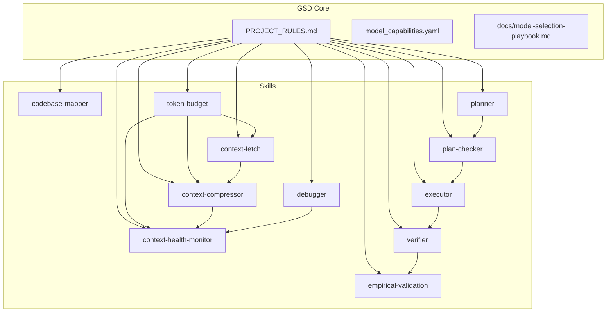

**Diagram sources**
- [PROJECT_RULES.md:1-261](file://PROJECT_RULES.md#L1-L261)
- [.agents/skills/codebase-mapper/SKILL.md:1-227](file://.agents/skills/codebase-mapper/SKILL.md#L1-L227)
- [.agents/skills/context-fetch/SKILL.md:1-185](file://.agents/skills/context-fetch/SKILL.md#L1-L185)
- [.agents/skills/context-compressor/SKILL.md:1-202](file://.agents/skills/context-compressor/SKILL.md#L1-L202)
- [.agents/skills/context-health-monitor/SKILL.md:1-106](file://.agents/skills/context-health-monitor/SKILL.md#L1-L106)
- [.agents/skills/token-budget/SKILL.md:1-167](file://.agents/skills/token-budget/SKILL.md#L1-L167)
- [.agents/skills/planner/SKILL.md:1-486](file://.agents/skills/planner/SKILL.md#L1-L486)
- [.agents/skills/plan-checker/SKILL.md:1-284](file://.agents/skills/plan-checker/SKILL.md#L1-L284)
- [.agents/skills/executor/SKILL.md:1-466](file://.agents/skills/executor/SKILL.md#L1-L466)
- [.agents/skills/debugger/SKILL.md:1-274](file://.agents/skills/debugger/SKILL.md#L1-L274)
- [.agents/skills/verifier/SKILL.md:1-422](file://.agents/skills/verifier/SKILL.md#L1-L422)
- [.agents/skills/empirical-validation/SKILL.md:1-98](file://.agents/skills/empirical-validation/SKILL.md#L1-L98)

**Section sources**
- [README.md:476-518](file://README.md#L476-L518)
- [PROJECT_RULES.md:157-181](file://PROJECT_RULES.md#L157-L181)

## Core Components
- codebase-mapper: Scans and documents project structure, dependencies, patterns, integrations, and technical debt.
- context-fetch: Enforces search-first discipline to minimize file loads.
- context-compressor: Compresses context aggressively and decompresses only when needed.
- context-health-monitor: Prevents context rot and triggers state dumps before quality degrades.
- token-budget: Tracks and manages token usage to prevent context overflow.
- planner: Builds executable plans with task breakdown, must-haves, and wave-based execution.
- plan-checker: Validates plans before execution to catch issues early.
- executor: Executes plans atomically, handles deviations, checkpoints, and state management.
- verifier: Validates implemented work against must-haves with empirical evidence.
- empirical-validation: Requires proof before marking work complete.
- debugger: Systematic debugging with hypothesis testing and persistent state.

**Section sources**
- [.agents/skills/codebase-mapper/SKILL.md:1-227](file://.agents/skills/codebase-mapper/SKILL.md#L1-L227)
- [.agents/skills/context-fetch/SKILL.md:1-185](file://.agents/skills/context-fetch/SKILL.md#L1-L185)
- [.agents/skills/context-compressor/SKILL.md:1-202](file://.agents/skills/context-compressor/SKILL.md#L1-L202)
- [.agents/skills/context-health-monitor/SKILL.md:1-106](file://.agents/skills/context-health-monitor/SKILL.md#L1-L106)
- [.agents/skills/token-budget/SKILL.md:1-167](file://.agents/skills/token-budget/SKILL.md#L1-L167)
- [.agents/skills/planner/SKILL.md:1-486](file://.agents/skills/planner/SKILL.md#L1-L486)
- [.agents/skills/plan-checker/SKILL.md:1-284](file://.agents/skills/plan-checker/SKILL.md#L1-L284)
- [.agents/skills/executor/SKILL.md:1-466](file://.agents/skills/executor/SKILL.md#L1-L466)
- [.agents/skills/verifier/SKILL.md:1-422](file://.agents/skills/verifier/SKILL.md#L1-L422)
- [.agents/skills/empirical-validation/SKILL.md:1-98](file://.agents/skills/empirical-validation/SKILL.md#L1-L98)
- [.agents/skills/debugger/SKILL.md:1-274](file://.agents/skills/debugger/SKILL.md#L1-L274)

## Architecture Overview
The skills collaborate around a shared state and artifacts (.gsd/). The workflow is spec → plan → execute → verify → commit. Token budgeting and context hygiene ensure consistent quality. Multi-model support is achieved by selecting models per phase or task based on capabilities.

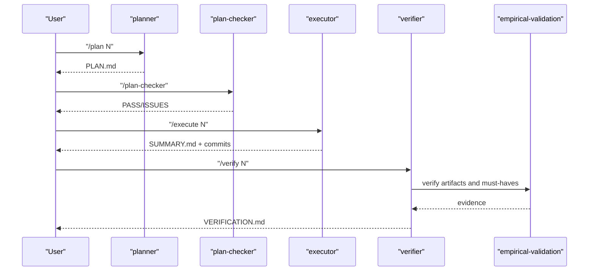

**Diagram sources**
- [README.md:147-178](file://README.md#L147-L178)
- [.agents/skills/planner/SKILL.md:1-486](file://.agents/skills/planner/SKILL.md#L1-L486)
- [.agents/skills/plan-checker/SKILL.md:1-284](file://.agents/skills/plan-checker/SKILL.md#L1-L284)
- [.agents/skills/executor/SKILL.md:1-466](file://.agents/skills/executor/SKILL.md#L1-L466)
- [.agents/skills/verifier/SKILL.md:1-422](file://.agents/skills/verifier/SKILL.md#L1-L422)
- [.agents/skills/empirical-validation/SKILL.md:1-98](file://.agents/skills/empirical-validation/SKILL.md#L1-L98)

## Detailed Component Analysis

### codebase-mapper
- Purpose: Understand project structure, dependencies, patterns, integrations, and technical debt.
- Operating model: Phases include project type detection, structure scan, dependency extraction, pattern discovery, and debt surfacing.
- Outputs: ARCHITECTURE.md and STACK.md.
- Integration: Produces foundational artifacts for planner and other skills.

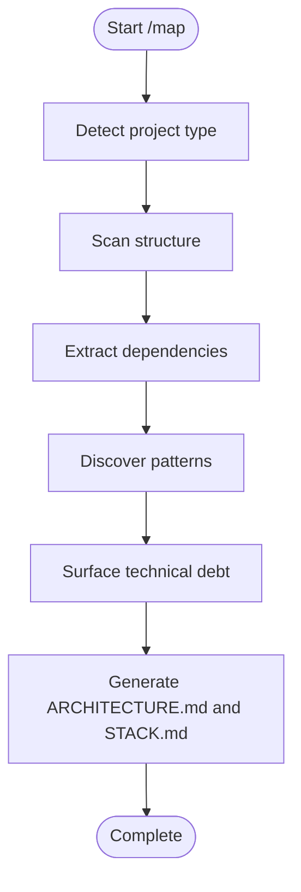

**Diagram sources**
- [.agents/skills/codebase-mapper/SKILL.md:64-134](file://.agents/skills/codebase-mapper/SKILL.md#L64-L134)

**Section sources**
- [.agents/skills/codebase-mapper/SKILL.md:1-227](file://.agents/skills/codebase-mapper/SKILL.md#L1-L227)

### context-fetch
- Purpose: Search-first skill to reduce unnecessary file reads.
- Operating model: Define question → extract keywords → search → evaluate → targeted read → report.
- Integration: Supports wave execution and reduces context pollution.

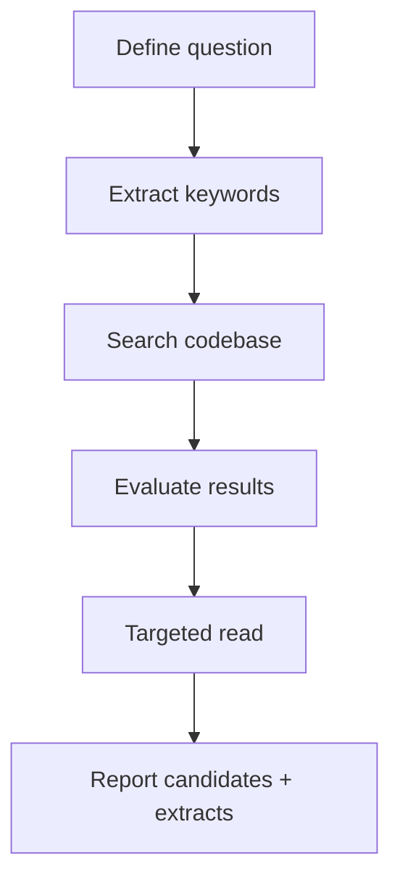

**Diagram sources**
- [.agents/skills/context-fetch/SKILL.md:28-86](file://.agents/skills/context-fetch/SKILL.md#L28-L86)

**Section sources**
- [.agents/skills/context-fetch/SKILL.md:1-185](file://.agents/skills/context-fetch/SKILL.md#L1-L185)

### context-compressor
- Purpose: Maximize token efficiency by compressing context aggressively and decompressing only when needed.
- Operating model: Summary mode, outline mode, diff-only mode, reference mode, and progressive disclosure.
- Integration: Works with token-budget, context-fetch, and context-health-monitor.

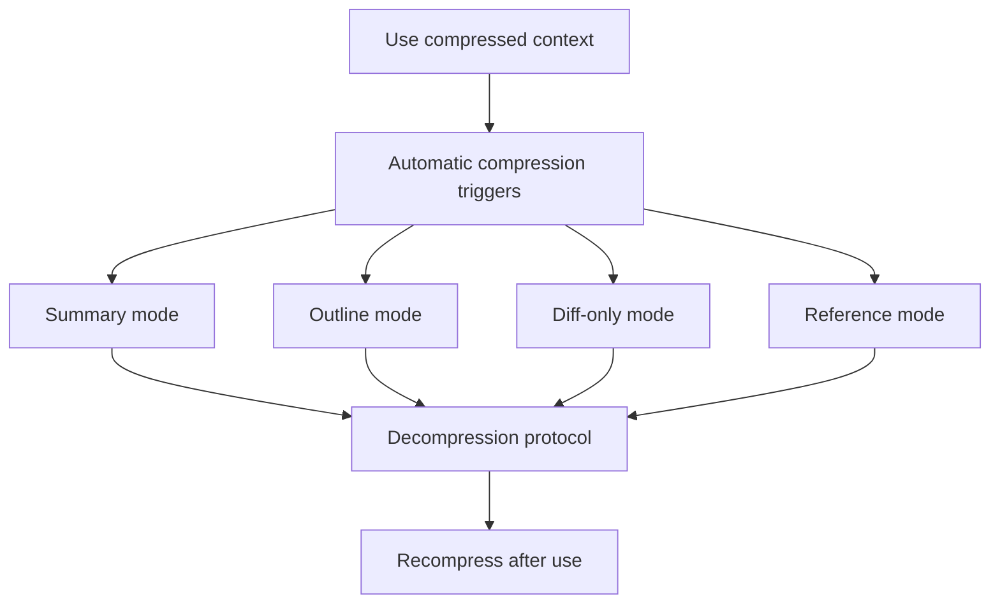

**Diagram sources**
- [.agents/skills/context-compressor/SKILL.md:117-147](file://.agents/skills/context-compressor/SKILL.md#L117-L147)

**Section sources**
- [.agents/skills/context-compressor/SKILL.md:1-202](file://.agents/skills/context-compressor/SKILL.md#L1-L202)

### context-health-monitor
- Purpose: Prevent context rot and trigger state dumps before quality degrades.
- Operating model: 3-strike rule, circular detection, uncertainty logging, and state dump format.
- Integration: Works with /pause, /resume, and enforces context hygiene.

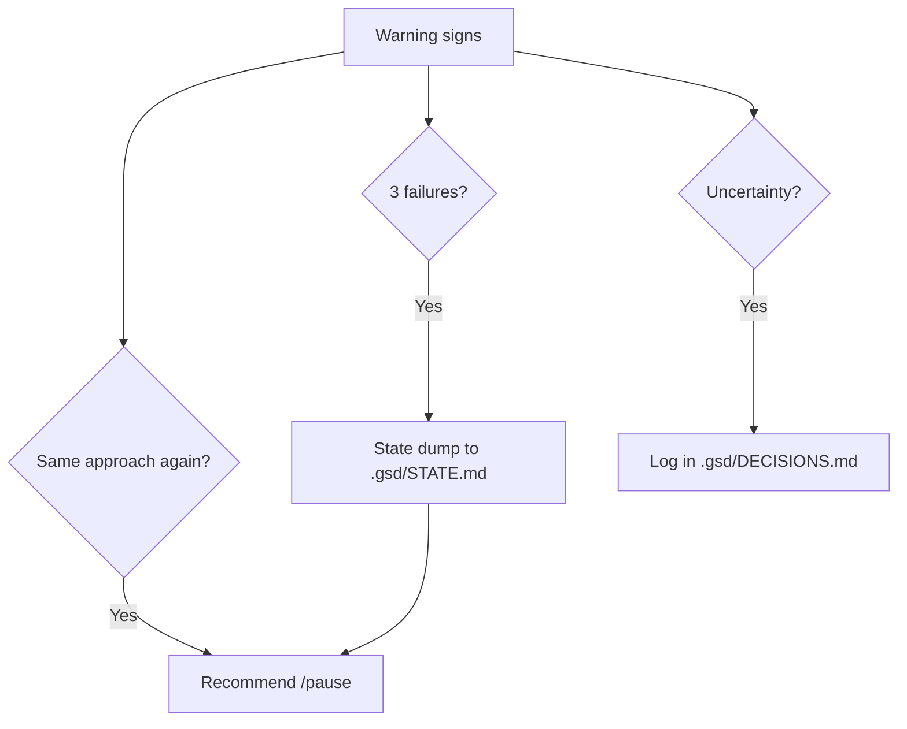

**Diagram sources**
- [.agents/skills/context-health-monitor/SKILL.md:12-98](file://.agents/skills/context-health-monitor/SKILL.md#L12-L98)

**Section sources**
- [.agents/skills/context-health-monitor/SKILL.md:1-106](file://.agents/skills/context-health-monitor/SKILL.md#L1-L106)

### token-budget
- Purpose: Manage token budget estimation and tracking to prevent context overflow.
- Operating model: Quick estimates, budget thresholds, tracking protocol, optimization strategies, and alerts.
- Integration: Integrates with context-fetch, context-health-monitor, and context-compressor.

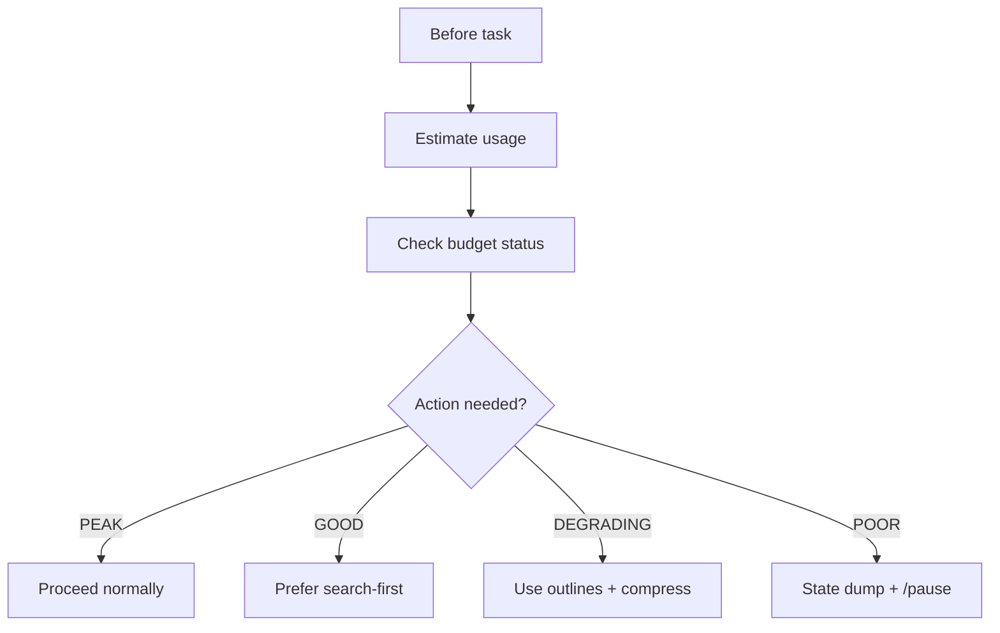

**Diagram sources**
- [.agents/skills/token-budget/SKILL.md:53-143](file://.agents/skills/token-budget/SKILL.md#L53-L143)

**Section sources**
- [.agents/skills/token-budget/SKILL.md:1-167](file://.agents/skills/token-budget/SKILL.md#L1-L167)

### planner
- Purpose: Create executable phase plans with task breakdown, must-haves, and wave-based execution.
- Operating model: Discovery protocol, task anatomy, task types, sizing, dependency graph, and PLAN.md structure.
- Integration: Produces plans for plan-checker and executor.

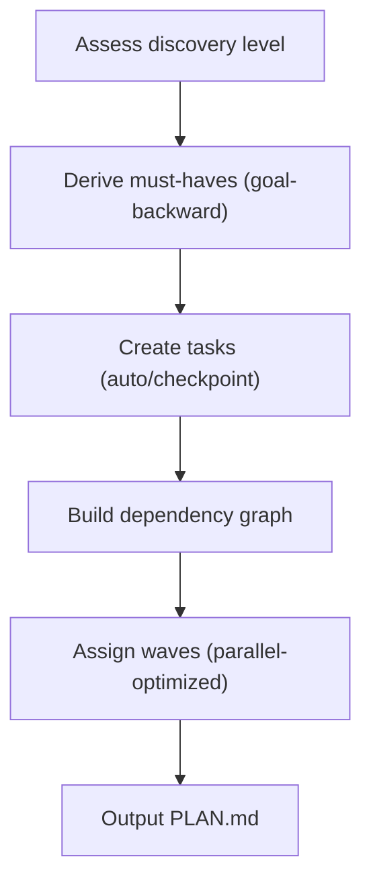

**Diagram sources**
- [.agents/skills/planner/SKILL.md:71-205](file://.agents/skills/planner/SKILL.md#L71-L205)

**Section sources**
- [.agents/skills/planner/SKILL.md:1-486](file://.agents/skills/planner/SKILL.md#L1-L486)

### plan-checker
- Purpose: Validate plans before execution to catch issues early.
- Operating model: Requirement coverage, task completeness, dependency correctness, key links planned, scope sanity, and verification derivation.
- Integration: Gate between planner and executor.

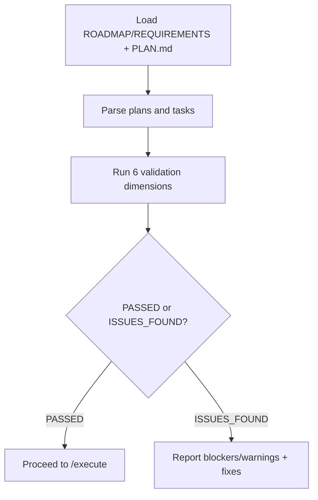

**Diagram sources**
- [.agents/skills/plan-checker/SKILL.md:186-250](file://.agents/skills/plan-checker/SKILL.md#L186-L250)

**Section sources**
- [.agents/skills/plan-checker/SKILL.md:1-284](file://.agents/skills/plan-checker/SKILL.md#L1-L284)

### executor
- Purpose: Execute plans atomically with deviation handling, checkpoint protocols, and state management.
- Operating model: Load project state, parse plan, determine execution pattern, execute tasks, apply deviation rules, handle checkpoints, and produce SUMMARY.md.
- Integration: Consumes PLAN.md and produces SUMMARY.md.

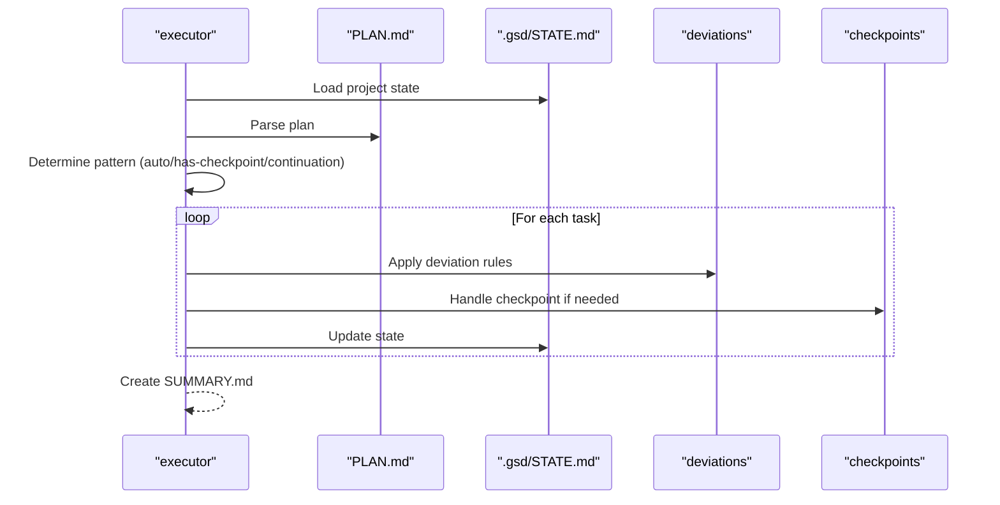

**Diagram sources**
- [.agents/skills/executor/SKILL.md:18-382](file://.agents/skills/executor/SKILL.md#L18-L382)

**Section sources**
- [.agents/skills/executor/SKILL.md:1-466](file://.agents/skills/executor/SKILL.md#L1-L466)

### verifier
- Purpose: Validate implemented work against must-haves with empirical evidence.
- Operating model: Initial vs re-verification mode, establish must-haves, verify truths/artifacts/key links, scan anti-patterns, and produce VERIFICATION.md.
- Integration: Drives /plan --gaps and informs executor corrections.

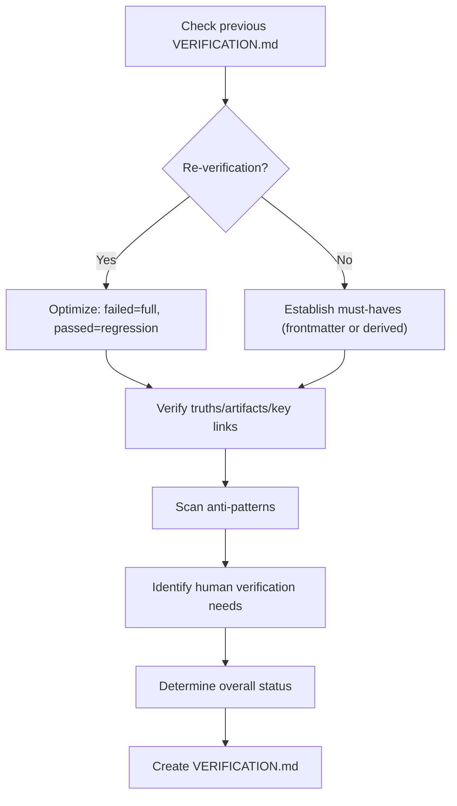

**Diagram sources**
- [.agents/skills/verifier/SKILL.md:27-290](file://.agents/skills/verifier/SKILL.md#L27-L290)

**Section sources**
- [.agents/skills/verifier/SKILL.md:1-422](file://.agents/skills/verifier/SKILL.md#L1-L422)

### empirical-validation
- Purpose: Require proof before marking work complete.
- Operating model: Validation methods by change type, protocol, forbidden phrases, and failure handling.
- Integration: Enforced by /verify and /execute.

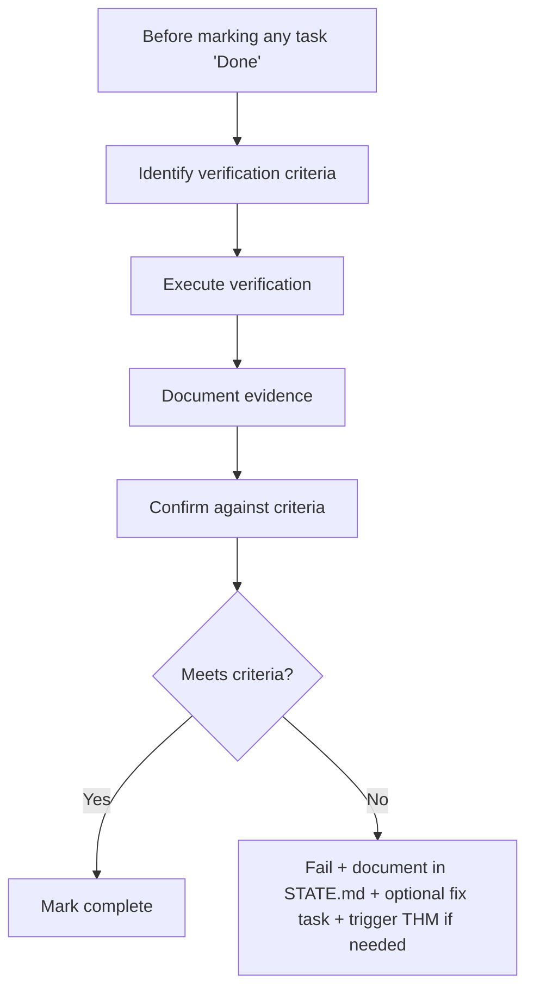

**Diagram sources**
- [.agents/skills/empirical-validation/SKILL.md:24-97](file://.agents/skills/empirical-validation/SKILL.md#L24-L97)

**Section sources**
- [.agents/skills/empirical-validation/SKILL.md:1-98](file://.agents/skills/empirical-validation/SKILL.md#L1-L98)

### debugger
- Purpose: Systematic debugging with persistent state and fresh context advantages.
- Operating model: User-reporter vs AI-investigator dynamic, meta-debugging, cognitive biases, hypothesis testing, debugging techniques, and 3-strike rule.
- Integration: Uses context-health-monitor and writes to .gsd/STATE.md and DEBUG.md.

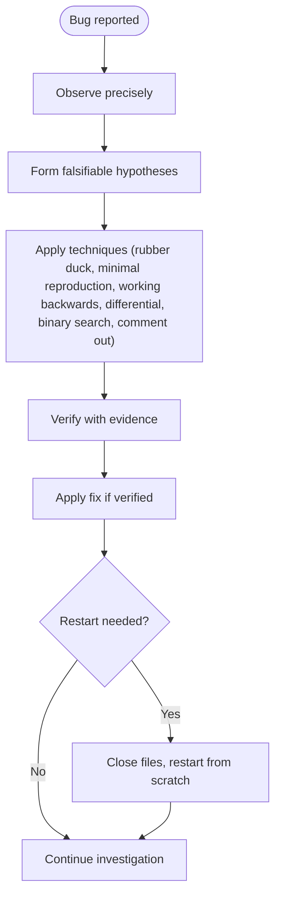

**Diagram sources**
- [.agents/skills/debugger/SKILL.md:58-210](file://.agents/skills/debugger/SKILL.md#L58-L210)

**Section sources**
- [.agents/skills/debugger/SKILL.md:1-274](file://.agents/skills/debugger/SKILL.md#L1-L274)

## Dependency Analysis
The skills form a layered dependency chain aligned with the GSD workflow. Token budgeting and context hygiene underpin all activities. Planning and plan-checking gate execution. Execution and verification close the loop with empirical validation.

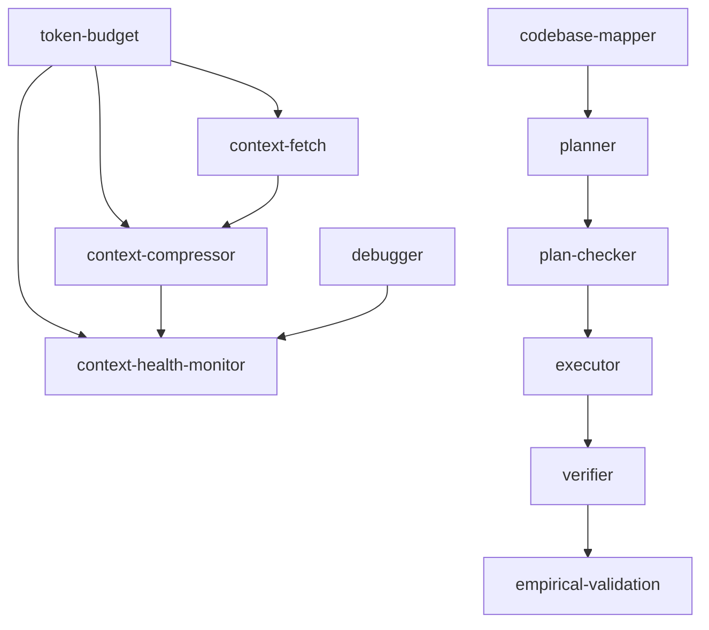

**Diagram sources**
- [.agents/skills/token-budget/SKILL.md:147-153](file://.agents/skills/token-budget/SKILL.md#L147-L153)
- [.agents/skills/context-compressor/SKILL.md:183-188](file://.agents/skills/context-compressor/SKILL.md#L183-L188)
- [.agents/skills/planner/SKILL.md:1-486](file://.agents/skills/planner/SKILL.md#L1-L486)
- [.agents/skills/plan-checker/SKILL.md:1-284](file://.agents/skills/plan-checker/SKILL.md#L1-L284)
- [.agents/skills/executor/SKILL.md:1-466](file://.agents/skills/executor/SKILL.md#L1-L466)
- [.agents/skills/verifier/SKILL.md:1-422](file://.agents/skills/verifier/SKILL.md#L1-L422)
- [.agents/skills/empirical-validation/SKILL.md:1-98](file://.agents/skills/empirical-validation/SKILL.md#L1-L98)
- [.agents/skills/debugger/SKILL.md:1-274](file://.agents/skills/debugger/SKILL.md#L1-L274)
- [.agents/skills/codebase-mapper/SKILL.md:1-227](file://.agents/skills/codebase-mapper/SKILL.md#L1-L227)

**Section sources**
- [README.md:381-410](file://README.md#L381-L410)
- [docs/model-selection-playbook.md:1-129](file://docs/model-selection-playbook.md#L1-L129)
- [model_capabilities.yaml:1-109](file://model_capabilities.yaml#L1-L109)

## Performance Considerations
- Context quality thresholds: Maintain usage below 50% to preserve peak quality; switch to efficiency mode at 50–70% and state dump at 70%+.
- Token efficiency: Search-first, progressive loading, just-in-time loading, and summarization/compression.
- Task sizing: Keep plans small (2–3 tasks) and scoped to avoid context pressure.
- Model selection: Choose models by phase and capability profile to balance cost, speed, and reasoning depth.

**Section sources**
- [PROJECT_RULES.md:184-243](file://PROJECT_RULES.md#L184-L243)
- [README.md:451-472](file://README.md#L451-L472)
- [docs/model-selection-playbook.md:76-123](file://docs/model-selection-playbook.md#L76-L123)
- [model_capabilities.yaml:9-109](file://model_capabilities.yaml#L9-L109)

## Troubleshooting Guide
- Context overflow: Use token-budget to estimate usage and switch to outline mode or compression. Trigger state dump and /pause when approaching 70%.
- Poor quality debugging: Apply debugger’s 3-strike rule and context-health-monitor signals. Save state to .gsd/STATE.md and restart with fresh context.
- Plan issues: Run plan-checker to catch blockers and warnings before execution.
- Verification gaps: Use verifier to identify must-haves, artifacts, and key links. Create gap closure plans with /plan --gaps.
- Empirical validation failures: Document failures in .gsd/STATE.md, create fix tasks, and re-run verification.

**Section sources**
- [.agents/skills/token-budget/SKILL.md:123-143](file://.agents/skills/token-budget/SKILL.md#L123-L143)
- [.agents/skills/context-health-monitor/SKILL.md:25-98](file://.agents/skills/context-health-monitor/SKILL.md#L25-L98)
- [.agents/skills/plan-checker/SKILL.md:277-284](file://.agents/skills/plan-checker/SKILL.md#L277-L284)
- [.agents/skills/verifier/SKILL.md:266-290](file://.agents/skills/verifier/SKILL.md#L266-L290)
- [.agents/skills/empirical-validation/SKILL.md:90-98](file://.agents/skills/empirical-validation/SKILL.md#L90-L98)

## Conclusion
The GSD agent skills system provides a robust, model-agnostic framework for disciplined development. Each skill addresses a distinct aspect of the workflow—mapping, context management, planning, execution, verification, and debugging—while integrating seamlessly through shared state and artifacts. By following the canonical rules and leveraging multi-model guidance, teams can optimize cost, accuracy, and performance across diverse development scenarios.

## Appendices

### Skill Selection Criteria and Optimal Usage Patterns
- codebase-mapper: Use at project onset or when architecture changes; pair with planner for context.
- context-fetch: Use before any coding task, refactor, bug investigation, or unfamiliar code exploration.
- context-compressor: Use continuously alongside context-fetch; enable automatic compression at thresholds.
- context-health-monitor: Use throughout debugging and planning; proactively trigger state dumps.
- token-budget: Use before each task; adjust strategy based on budget status.
- planner: Use after discovery; derive must-haves goal-backward; keep plans small and scoped.
- plan-checker: Use before /execute; validate requirement coverage, task completeness, dependencies, and scope sanity.
- executor: Use to execute plans atomically; handle deviations and checkpoints; produce SUMMARY.md.
- verifier: Use after execution; validate must-haves and artifacts; produce VERIFICATION.md.
- empirical-validation: Use to require proof before marking tasks complete; enforce verification protocol.
- debugger: Use for systematic diagnosis; apply 3-strike rule and restart when needed.

**Section sources**
- [.agents/skills/codebase-mapper/SKILL.md:1-227](file://.agents/skills/codebase-mapper/SKILL.md#L1-L227)
- [.agents/skills/context-fetch/SKILL.md:16-23](file://.agents/skills/context-fetch/SKILL.md#L16-L23)
- [.agents/skills/context-compressor/SKILL.md:16-114](file://.agents/skills/context-compressor/SKILL.md#L16-L114)
- [.agents/skills/context-health-monitor/SKILL.md:8-24](file://.agents/skills/context-health-monitor/SKILL.md#L8-L24)
- [.agents/skills/token-budget/SKILL.md:16-73](file://.agents/skills/token-budget/SKILL.md#L16-L73)
- [.agents/skills/planner/SKILL.md:21-67](file://.agents/skills/planner/SKILL.md#L21-L67)
- [.agents/skills/plan-checker/SKILL.md:16-166](file://.agents/skills/plan-checker/SKILL.md#L16-L166)
- [.agents/skills/executor/SKILL.md:18-88](file://.agents/skills/executor/SKILL.md#L18-L88)
- [.agents/skills/verifier/SKILL.md:27-115](file://.agents/skills/verifier/SKILL.md#L27-L115)
- [.agents/skills/empirical-validation/SKILL.md:8-43](file://.agents/skills/empirical-validation/SKILL.md#L8-L43)
- [.agents/skills/debugger/SKILL.md:16-94](file://.agents/skills/debugger/SKILL.md#L16-L94)

### Multi-Model Support and Selection
- Model-agnostic principle: No hard dependencies on specific providers; adapters offer optional enhancements.
- Capability registry: Use model_capabilities.yaml to categorize models by thinking mode, long context, tools, and speed tiers.
- Phase recommendations: Use docs/model-selection-playbook.md to choose models per phase (planning, implementation, refactoring, debugging, review).
- Gemini-specific guidance: See .GEMINI/GEMINI.md for Flash vs Pro recommendations.

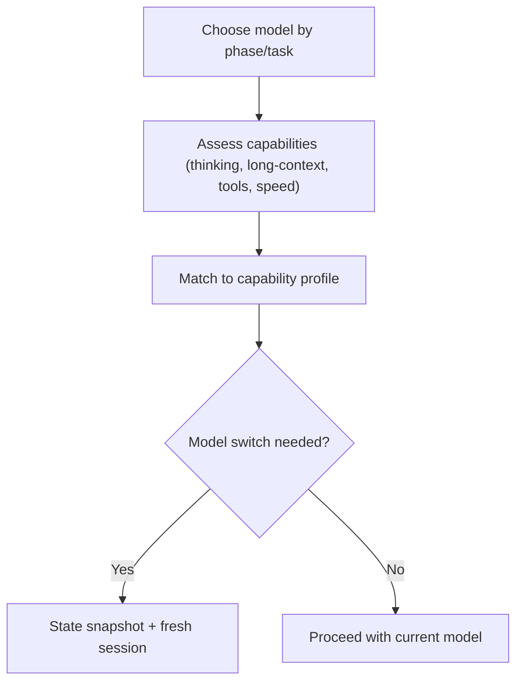

**Diagram sources**
- [README.md:381-410](file://README.md#L381-L410)
- [docs/model-selection-playbook.md:9-123](file://docs/model-selection-playbook.md#L9-L123)
- [model_capabilities.yaml:9-109](file://model_capabilities.yaml#L9-L109)
- [.GEMINI/GEMINI.md:53-61](file://.GEMINI/GEMINI.md#L53-L61)

**Section sources**
- [README.md:381-410](file://README.md#L381-L410)
- [docs/model-selection-playbook.md:1-129](file://docs/model-selection-playbook.md#L1-L129)
- [model_capabilities.yaml:1-109](file://model_capabilities.yaml#L1-L109)
- [.GEMINI/GEMINI.md:1-68](file://.GEMINI/GEMINI.md#L1-L68)

### Example Skill Combinations for Complex Tasks
- Discovery and planning: codebase-mapper → planner (derive must-haves from architecture)
- Execution gating: plan-checker → executor (atomic commits, checkpoints)
- Verification and validation: verifier → empirical-validation (must-haves + proof)
- Context hygiene: token-budget → context-compressor → context-health-monitor
- Debugging loop: debugger → context-health-monitor → fresh session

**Section sources**
- [.agents/skills/codebase-mapper/SKILL.md:1-227](file://.agents/skills/codebase-mapper/SKILL.md#L1-L227)
- [.agents/skills/planner/SKILL.md:1-486](file://.agents/skills/planner/SKILL.md#L1-L486)
- [.agents/skills/plan-checker/SKILL.md:1-284](file://.agents/skills/plan-checker/SKILL.md#L1-L284)
- [.agents/skills/executor/SKILL.md:1-466](file://.agents/skills/executor/SKILL.md#L1-L466)
- [.agents/skills/verifier/SKILL.md:1-422](file://.agents/skills/verifier/SKILL.md#L1-L422)
- [.agents/skills/empirical-validation/SKILL.md:1-98](file://.agents/skills/empirical-validation/SKILL.md#L1-L98)
- [.agents/skills/token-budget/SKILL.md:1-167](file://.agents/skills/token-budget/SKILL.md#L1-L167)
- [.agents/skills/context-compressor/SKILL.md:1-202](file://.agents/skills/context-compressor/SKILL.md#L1-L202)
- [.agents/skills/context-health-monitor/SKILL.md:1-106](file://.agents/skills/context-health-monitor/SKILL.md#L1-L106)
- [.agents/skills/debugger/SKILL.md:1-274](file://.agents/skills/debugger/SKILL.md#L1-L274)