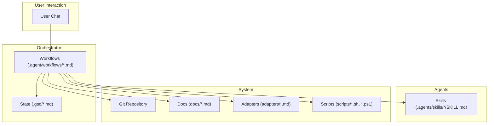
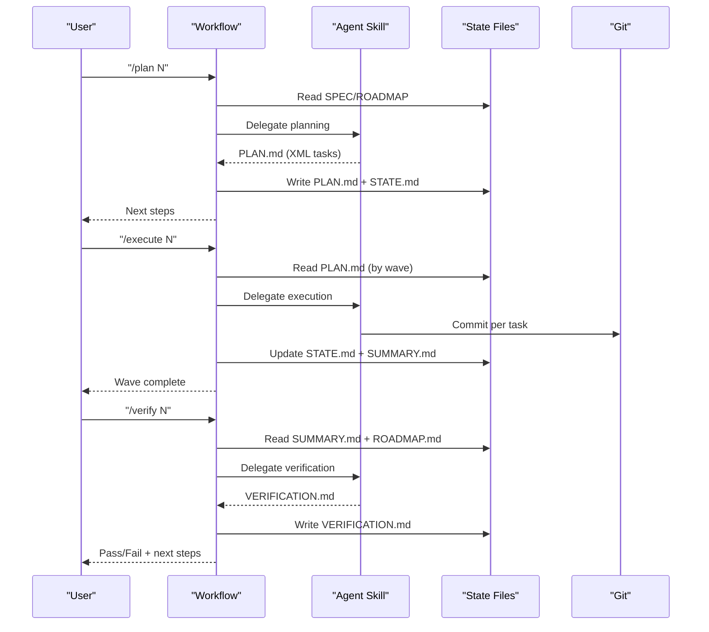
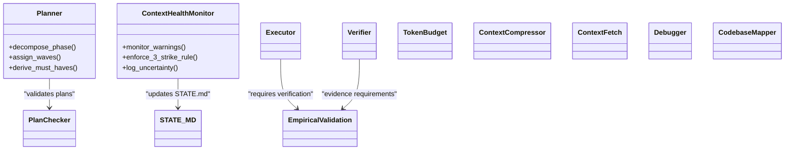
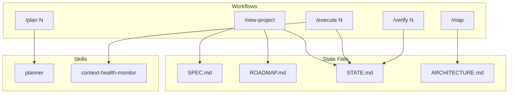
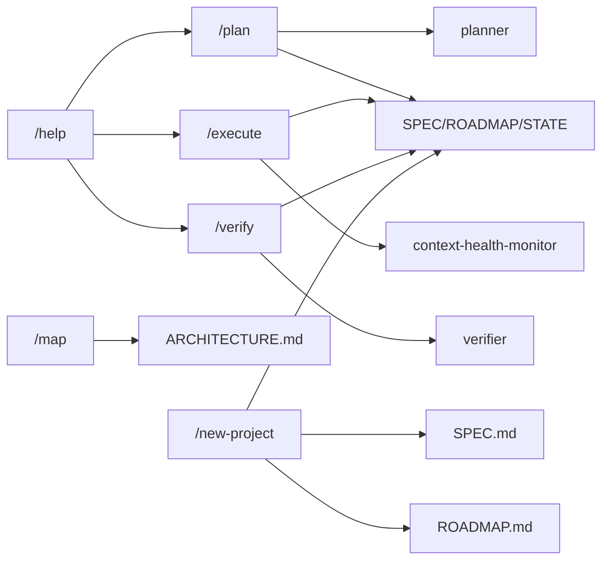

# GSD Methodology Integration

<cite>
**Referenced Files in This Document**
- [README.md](file://README.md)
- [GSD-STYLE.md](file://GSD-STYLE.md)
- [PROJECT_RULES.md](file://PROJECT_RULES.md)
- [model_capabilities.yaml](file://model_capabilities.yaml)
- [.agent/workflows/help.md](file://.agent/workflows/help.md)
- [.agent/workflows/new-project.md](file://.agent/workflows/new-project.md)
- [.agent/workflows/plan.md](file://.agent/workflows/plan.md)
- [.agent/workflows/execute.md](file://.agent/workflows/execute.md)
- [.agent/workflows/verify.md](file://.agent/workflows/verify.md)
- [.agents/skills/planner/SKILL.md](file://.agents/skills/planner/SKILL.md)
- [.agents/skills/context-health-monitor/SKILL.md](file://.agents/skills/context-health-monitor/SKILL.md)
- [scripts/validate-skills.ps1](file://scripts/validate-skills.ps1)
- [scripts/validate-skills.sh](file://scripts/validate-skills.sh)
</cite>

## Table of Contents
1. [Introduction](#introduction)
2. [Project Structure](#project-structure)
3. [Core Components](#core-components)
4. [Architecture Overview](#architecture-overview)
5. [Detailed Component Analysis](#detailed-component-analysis)
6. [Dependency Analysis](#dependency-analysis)
7. [Performance Considerations](#performance-considerations)
8. [Troubleshooting Guide](#troubleshooting-guide)
9. [Conclusion](#conclusion)
10. [Appendices](#appendices)

## Introduction
This document explains how the Get Shit Done (GSD) methodology is integrated into the Zeex AI website project. It documents the 27 slash commands that drive the workflow, the agent skills system, project state management via SPEC.md, ROADMAP.md, STATE.md, and ARCHITECTURE.md, the wave-based execution model, atomic commit strategy, XML task formatting, verification requirements, and empirical validation processes. It also provides guidance for adopting GSD in new projects, customizing it for team size, integrating with existing processes, and measuring outcomes.

## Project Structure
The GSD integration centers around a small set of orchestrator workflows, reusable agent skills, and a disciplined project state system. The key directories and files are:
- .agent/workflows/: 27 slash commands that users invoke as chat messages
- .agents/skills/: 11 specialized agent capabilities (Agent Skills standard)
- .gsd/: persistent project state and artifacts (SPEC.md, ROADMAP.md, STATE.md, ARCHITECTURE.md, etc.)
- adapters/: optional model-specific enhancements
- docs/: operational playbooks and guides
- scripts/: validation and utility scripts

**Diagram sources**
- [README.md:476-518](file://README.md#L476-L518)
- [.agent/workflows/help.md:1-97](file://.agent/workflows/help.md#L1-L97)

**Section sources**
- [README.md:476-518](file://README.md#L476-L518)

## Core Components
- Slash commands (27 total): invoked as chat messages, each implementing a specific phase of the GSD cycle (setup, planning, execution, verification, navigation, utilities).
- Agent skills: modular specializations (e.g., planner, executor, verifier, context-health-monitor) that support workflows.
- Project state: SPEC.md (vision and requirements), ROADMAP.md (phases), STATE.md (session memory), ARCHITECTURE.md (design), and related templates.
- XML task format: structured, executable tasks embedded in plans with precise actions, verification steps, and done criteria.
- Wave-based execution: grouping tasks by dependencies and executing within waves to maintain focus and reduce context pressure.
- Atomic commits: one task equals one commit, enabling reversible changes and clear history.

**Section sources**
- [README.md:274-337](file://README.md#L274-L337)
- [README.md:147-178](file://README.md#L147-L178)
- [README.md:198-217](file://README.md#L198-L217)
- [README.md:218-248](file://README.md#L218-L248)
- [README.md:249-259](file://README.md#L249-L259)
- [README.md:261-271](file://README.md#L261-L271)
- [GSD-STYLE.md:43-104](file://GSD-STYLE.md#L43-L104)
- [PROJECT_RULES.md:58-73](file://PROJECT_RULES.md#L58-L73)
- [PROJECT_RULES.md:133-154](file://PROJECT_RULES.md#L133-L154)

## Architecture Overview
The GSD architecture enforces a strict protocol: SPEC → PLAN → EXECUTE → VERIFY → COMMIT. Workflows orchestrate state transitions, skills provide specialized capabilities, and state files preserve continuity across sessions.

**Diagram sources**
- [README.md:147-178](file://README.md#L147-L178)
- [.agent/workflows/plan.md:19-38](file://.agent/workflows/plan.md#L19-L38)
- [.agent/workflows/execute.md:19-37](file://.agent/workflows/execute.md#L19-L37)
- [.agent/workflows/verify.md:6-34](file://.agent/workflows/verify.md#L6-L34)

## Detailed Component Analysis

### Slash Commands (27)
The 27 slash commands are organized into categories and route users through the GSD cycle. Each workflow:
- Has YAML frontmatter with description
- Uses XML-structured process blocks
- Ends with “Next Steps” routing

Key commands and roles:
- Core workflow: /map, /plan [N], /execute [N], /verify [N], /debug [desc]
- Project setup: /install, /new-project, /new-milestone, /complete-milestone, /audit-milestone
- Phase management: /add-phase, /insert-phase, /remove-phase, /discuss-phase, /research-phase, /list-phase-assumptions, /plan-milestone-gaps
- Sprint: /sprint new, /sprint status, /sprint close
- Navigation & state: /progress, /pause, /resume, /add-todo, /check-todos
- Utilities: /help, /web-search, /whats-new, /update

Help and quick-start are surfaced in the help workflow.

**Section sources**
- [README.md:274-337](file://README.md#L274-L337)
- [.agent/workflows/help.md:26-94](file://.agent/workflows/help.md#L26-L94)

### Agent Skills System
Agent skills encapsulate specialized capabilities referenced by workflows:
- planner: creates executable phase plans with task breakdown, dependency analysis, and goal-backward verification
- context-health-monitor: monitors context complexity and triggers state dumps before quality degrades (3-strike rule)
- executor, verifier, empirical-validation, plan-checker, token-budget, context-compressor, context-fetch, debugger, codebase-mapper, and others

Skills are validated by scripts ensuring each has proper frontmatter and structure.

**Diagram sources**
- [.agents/skills/planner/SKILL.md:1-57](file://.agents/skills/planner/SKILL.md#L1-L57)
- [.agents/skills/context-health-monitor/SKILL.md:1-57](file://.agents/skills/context-health-monitor/SKILL.md#L1-L57)

**Section sources**
- [README.md:485-486](file://README.md#L485-L486)
- [scripts/validate-skills.ps1:13-68](file://scripts/validate-skills.ps1#L13-L68)
- [scripts/validate-skills.sh:13-65](file://scripts/validate-skills.sh#L13-L65)

### Project State Management
GSD relies on four primary state files:
- SPEC.md: project vision and requirements (must be FINALIZED before planning)
- ROADMAP.md: phases and progress
- STATE.md: session memory and position across sessions
- ARCHITECTURE.md: system design (generated by /map)

These files are managed by workflows and preserved across sessions to maintain continuity.

**Section sources**
- [README.md:181-196](file://README.md#L181-L196)
- [README.md:491-496](file://README.md#L491-L496)
- [.agent/workflows/new-project.md:12-20](file://.agent/workflows/new-project.md#L12-L20)

### XML Task Formatting
Every plan uses XML-structured tasks with:
- <task type="auto" effort="medium"> (optional effort)
- <name>, <files>, <action>, <verify>, <done>
- Optional checkpoint tasks for human verification or decisions

Effort hints guide model selection:
- low: simple edits, formatting
- medium: standard implementation
- high: complex logic, refactoring
- max: architecture, security-critical

**Section sources**
- [README.md:198-217](file://README.md#L198-L217)
- [GSD-STYLE.md:64-94](file://GSD-STYLE.md#L64-L94)
- [GSD-STYLE.md:96-104](file://GSD-STYLE.md#L96-L104)

### Wave-Based Execution
Plans are grouped into waves based on dependencies:
- Wave 1: foundation tasks (no dependencies) — run in parallel
- Wave 2: depends on Wave 1 — wait then parallel
- Wave 3: depends on Wave 2 — wait then parallel

Wave completion protocol:
- All tasks verified
- State snapshot created
- Commit all wave work
- Update STATE.md with position

**Section sources**
- [README.md:218-248](file://README.md#L218-L248)
- [PROJECT_RULES.md:58-73](file://PROJECT_RULES.md#L58-L73)

### Atomic Commit Strategy
- One task = one commit
- Commit message format: type(scope): description
- Scope is phase number for phase work
- No commit before verification passes

This ensures reversible changes and clear history for AI in future sessions.

**Section sources**
- [README.md:249-259](file://README.md#L249-L259)
- [PROJECT_RULES.md:133-154](file://PROJECT_RULES.md#L133-L154)
- [GSD-STYLE.md:205-226](file://GSD-STYLE.md#L205-L226)

### Verification Requirements and Empirical Validation
Verification must produce evidence:
- API endpoint: curl/HTTP response
- UI change: screenshot
- Build/compile: command output
- Test: test runner output
- Config: verification command

Forbidden phrases: “It looks correct,” “This should work,” “I’ve done similar before.”

**Section sources**
- [README.md:261-271](file://README.md#L261-L271)
- [PROJECT_RULES.md:23-37](file://PROJECT_RULES.md#L23-L37)
- [.agent/workflows/verify.md:225-246](file://.agent/workflows/verify.md#L225-L246)

### Multi-Model Support
GSD is model-agnostic. Optional adapters provide provider-specific enhancements:
- adapters/CLAUDE.md: extended thinking, effort levels
- adapters/GEMINI.md: Flash vs Pro selection
- adapters/GPT_OSS.md: function calling, context handling

Capabilities registry guides model selection by profile (thinking_mode, long_context, tools, speed_tier) and phase recommendations.

**Section sources**
- [README.md:381-410](file://README.md#L381-L410)
- [model_capabilities.yaml:1-109](file://model_capabilities.yaml#L1-L109)

### Typical GSD Sessions
A typical session follows:
- /resume → load context from last session
- /progress → see current position
- /discuss-phase N → clarify requirements (optional)
- /plan N → create execution plans
- /execute N → implement with atomic commits
- /verify N → prove completion (screenshots, tests)
- /pause → save state for later

**Section sources**
- [README.md:340-350](file://README.md#L340-L350)

## Architecture Overview

**Diagram sources**
- [README.md:476-518](file://README.md#L476-L518)
- [.agent/workflows/new-project.md:12-20](file://.agent/workflows/new-project.md#L12-L20)
- [.agent/workflows/plan.md:8-17](file://.agent/workflows/plan.md#L8-L17)
- [.agent/workflows/execute.md:8-17](file://.agent/workflows/execute.md#L8-L17)
- [.agent/workflows/verify.md:8-19](file://.agent/workflows/verify.md#L8-L19)
- [.agents/skills/planner/SKILL.md:1-57](file://.agents/skills/planner/SKILL.md#L1-L57)
- [.agents/skills/context-health-monitor/SKILL.md:1-57](file://.agents/skills/context-health-monitor/SKILL.md#L1-L57)

## Detailed Component Analysis

### Workflow: /new-project
Purpose: Deep questioning → SPEC.md → ROADMAP.md → initial state.

Key steps:
- Abort if project already initialized
- Initialize git repo if needed
- Brownfield detection and optional mapping
- Deep questioning to distill vision, goals, users, constraints, success criteria
- Optional research phase
- Create ROADMAP.md with 3–5 phases
- Initialize remaining .gsd files and commit

**Section sources**
- [.agent/workflows/new-project.md:1-369](file://.agent/workflows/new-project.md#L1-L369)

### Workflow: /plan
Purpose: Create executable PLAN.md files with XML tasks.

Key steps:
- Planning Lock: SPEC.md must be FINALIZED
- Parse arguments and normalize phase
- Validate phase exists in ROADMAP.md
- Ensure phase directory exists
- Handle research (skip or force)
- Create PLAN.md with XML tasks, verification, and done criteria
- Verify plans with checker logic (up to 3 iterations)
- Update STATE.md and commit plans

**Section sources**
- [.agent/workflows/plan.md:1-397](file://.agent/workflows/plan.md#L1-L397)

### Workflow: /execute
Purpose: Wave-based execution with atomic commits.

Key steps:
- Validate environment and phase existence
- Discover incomplete plans and group by wave
- Execute waves sequentially within waves
- For each plan: load context, execute tasks, verify, commit, create SUMMARY.md
- Verify phase goal against ROADMAP.md must-haves
- Update ROADMAP.md, STATE.md, REQUIREMENTS.md
- Commit phase completion and offer next steps

**Section sources**
- [.agent/workflows/execute.md:1-324](file://.agent/workflows/execute.md#L1-L324)

### Workflow: /verify
Purpose: Empirical validation with documented proof.

Key steps:
- Load phase definition, SPEC.md, and SUMMARY.md files
- Extract must-haves from ROADMAP.md
- Determine verification method per must-have (API/UI/Build/Tests/File)
- Execute verification and record evidence
- Create VERIFICATION.md with PASS/FAIL/PARTIAL verdict
- If FAIL, create gap closure plans and route to /execute --gaps-only
- Commit verification and update STATE.md

**Section sources**
- [.agent/workflows/verify.md:1-264](file://.agent/workflows/verify.md#L1-L264)

### Skill: planner
Responsibilities:
- Decompose phases into 2–3 tasks per plan
- Build dependency graphs and assign waves
- Derive must-haves using goal-backward methodology
- Handle gap closure mode
- Enforce aggressive atomicity and context budgets

**Section sources**
- [.agents/skills/planner/SKILL.md:1-57](file://.agents/skills/planner/SKILL.md#L1-L57)

### Skill: context-health-monitor
Responsibilities:
- Enforce 3-strike rule (stop after 3 debugging failures)
- Detect circular approaches and recommend pause
- Log uncertainty in DECISIONS.md
- Prevent context rot and maintain session hygiene

**Section sources**
- [.agents/skills/context-health-monitor/SKILL.md:1-57](file://.agents/skills/context-health-monitor/SKILL.md#L1-L57)

## Dependency Analysis

**Diagram sources**
- [.agent/workflows/help.md:26-94](file://.agent/workflows/help.md#L26-L94)
- [.agent/workflows/plan.md:381-396](file://.agent/workflows/plan.md#L381-L396)
- [.agent/workflows/execute.md:306-323](file://.agent/workflows/execute.md#L306-L323)
- [.agent/workflows/verify.md:248-263](file://.agent/workflows/verify.md#L248-L263)

**Section sources**
- [.agent/workflows/help.md:26-94](file://.agent/workflows/help.md#L26-L94)
- [.agent/workflows/plan.md:381-396](file://.agent/workflows/plan.md#L381-L396)
- [.agent/workflows/execute.md:306-323](file://.agent/workflows/execute.md#L306-L323)
- [.agent/workflows/verify.md:248-263](file://.agent/workflows/verify.md#L248-L263)

## Performance Considerations
- Context engineering: keep plans under ~50% context usage; enforce fresh context per plan execution
- Token efficiency: search-first discipline, compression, and summarization
- Wave execution: parallel within waves to reduce total time while controlling context pressure
- Atomic commits: frequent, small commits improve bisectability and reduce merge conflicts

**Section sources**
- [GSD-STYLE.md:128-152](file://GSD-STYLE.md#L128-L152)
- [PROJECT_RULES.md:184-200](file://PROJECT_RULES.md#L184-L200)
- [PROJECT_RULES.md:203-243](file://PROJECT_RULES.md#L203-L243)

## Troubleshooting Guide
Common issues and resolutions:
- Planning lock violation: ensure SPEC.md is FINALIZED before /plan
- Missing phase: confirm phase exists in ROADMAP.md before /execute or /verify
- No plans found: run /plan N first; ensure PLAN.md files exist
- Verification failures: create gap closure plans and run /execute N --gaps-only
- Context degradation: after 3 debugging failures, stop, document in STATE.md, and run /pause for a fresh session
- Evidence not accepted: replace subjective statements with captured outputs, screenshots, or test results

**Section sources**
- [.agent/workflows/plan.md:109-131](file://.agent/workflows/plan.md#L109-L131)
- [.agent/workflows/execute.md:41-56](file://.agent/workflows/execute.md#L41-L56)
- [.agent/workflows/verify.md:134-213](file://.agent/workflows/verify.md#L134-L213)
- [.agents/skills/context-health-monitor/SKILL.md:27-47](file://.agents/skills/context-health-monitor/SKILL.md#L27-L47)
- [.agent/workflows/verify.md:225-246](file://.agent/workflows/verify.md#L225-L246)

## Conclusion
The GSD integration in the Zeex AI website project provides a reliable, repeatable system for AI-assisted development. By enforcing planning before building, maintaining fresh context, requiring empirical validation, and using wave-based execution with atomic commits, teams achieve consistent outcomes. The 27 slash commands, 11 agent skills, and disciplined state management collectively form a meta-prompting system that scales across solo developers and small teams.

## Appendices

### Adopting GSD in New Projects
- Start with /install or copy GSD assets into your repository
- Run /new-project to finalize SPEC.md and create ROADMAP.md
- Use /discuss-phase and /research-phase to refine scope
- Plan in small waves with 2–3 tasks per plan
- Execute with atomic commits; verify with documented evidence
- Persist STATE.md across sessions and use /pause for handoffs

**Section sources**
- [README.md:82-144](file://README.md#L82-L144)
- [.agent/workflows/new-project.md:12-20](file://.agent/workflows/new-project.md#L12-L20)

### Customizing for Team Size
- Solo: use /plan, /execute, /verify without ceremony
- Small team: adopt shared STATE.md checkpoints and brief syncs outside the workflow
- Larger teams: keep GSD as the individual contributor’s workflow; coordinate externally

**Section sources**
- [README.md:72-79](file://README.md#L72-L79)

### Integrating with Existing Processes
- Replace ad-hoc planning with /plan and ROADMAP.md
- Replace unverifiable builds with /verify and empirical evidence
- Replace scattered notes with STATE.md and DECISIONS.md
- Retain external CI/CD; GSD focuses on pre-commit verification

**Section sources**
- [README.md:357-365](file://README.md#L357-L365)

### Measuring Effectiveness
- Track task completion rate per wave
- Measure verification pass rate
- Count debugging cycles and state dumps
- Track token usage and context efficiency
- Capture time-to-ship per milestone

**Section sources**
- [PROJECT_RULES.md:246-255](file://PROJECT_RULES.md#L246-L255)
- [GSD-STYLE.md:128-152](file://GSD-STYLE.md#L128-L152)