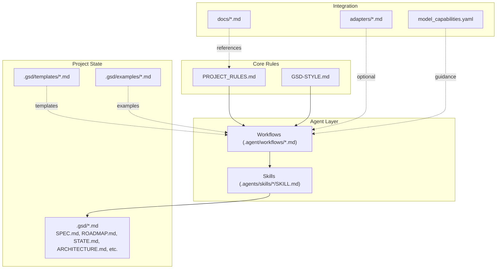
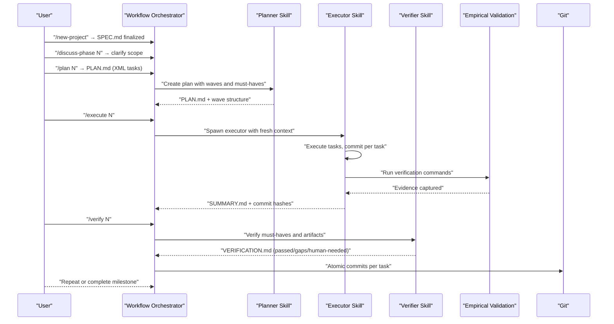
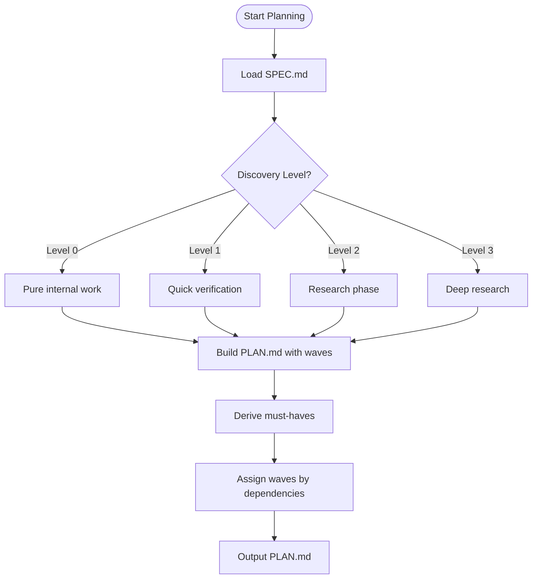
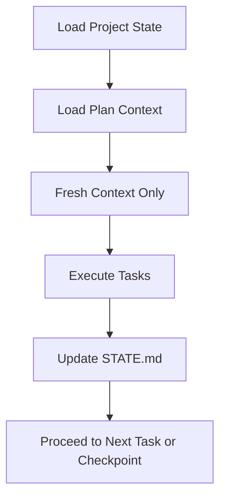
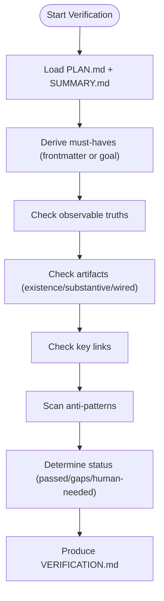
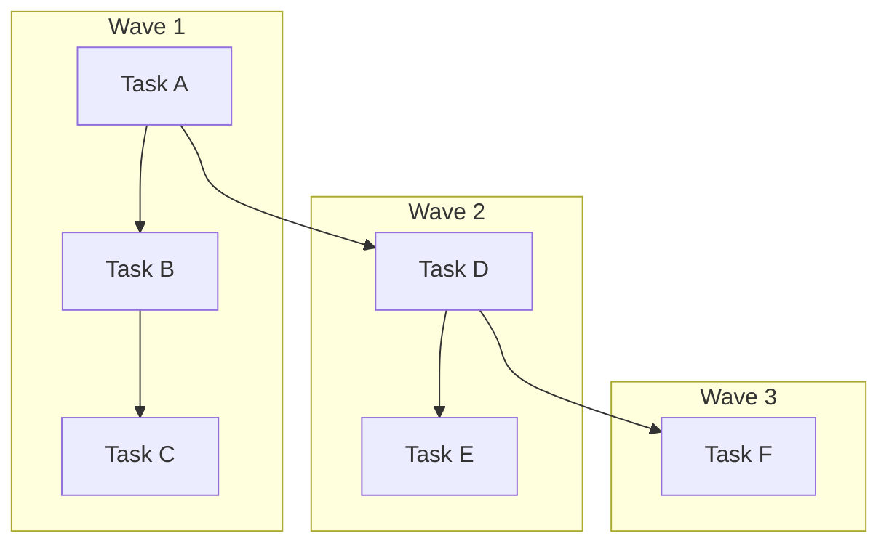
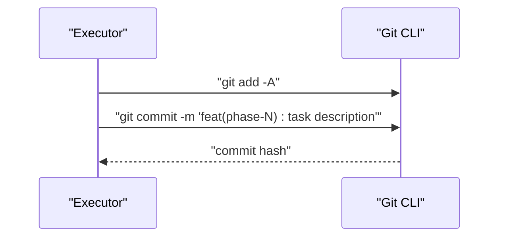
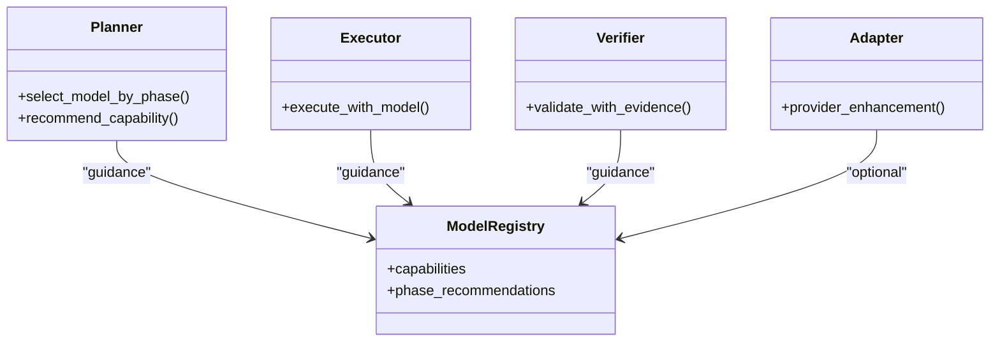
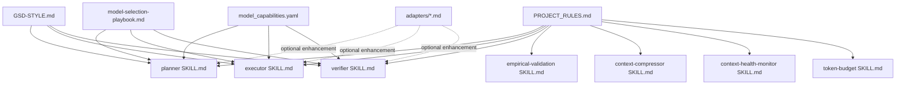

# Methodology Overview

<cite>
**Referenced Files in This Document**
- [README.md](file://README.md)
- [GSD-STYLE.md](file://GSD-STYLE.md)
- [PROJECT_RULES.md](file://PROJECT_RULES.md)
- [model_selection_playbook.md](file://docs/model-selection-playbook.md)
- [model_capabilities.yaml](file://model_capabilities.yaml)
- [.agents/skills/planner/ SKILL.md](file://.agents/skills/planner/ SKILL.md)
- [.agents/skills/executor/ SKILL.md](file://.agents/skills/executor/ SKILL.md)
- [.agents/skills/verifier/ SKILL.md](file://.agents/skills/verifier/ SKILL.md)
- [.agents/skills/empirical-validation/ SKILL.md](file://.agents/skills/empirical-validation/ SKILL.md)
- [.agents/skills/context-compressor/ SKILL.md](file://.agents/skills/context-compressor/ SKILL.md)
- [.agents/skills/context-health-monitor/ SKILL.md](file://.agents/skills/context-health-monitor/ SKILL.md)
- [.agents/skills/token-budget/ SKILL.md](file://.agents/skills/token-budget/ SKILL.md)
</cite>

## Table of Contents
1. [Introduction](#introduction)
2. [Project Structure](#project-structure)
3. [Core Components](#core-components)
4. [Architecture Overview](#architecture-overview)
5. [Detailed Component Analysis](#detailed-component-analysis)
6. [Dependency Analysis](#dependency-analysis)
7. [Performance Considerations](#performance-considerations)
8. [Troubleshooting Guide](#troubleshooting-guide)
9. [Conclusion](#conclusion)
10. [Appendices](#appendices)

## Introduction
This document explains the Get Shit Done (GSD) methodology for transforming AI assistance into reliable, consistent development outcomes. It codifies the philosophy of planning before building, using fresh context over polluted context, and demanding proof over trust. It describes the wave-based execution system that groups tasks by dependencies, the atomic commit strategy that ensures reversible changes, and the empirical validation processes that verify solutions. It also documents multi-model support and how different AI models can be selected for different phases of the development process based on cost, accuracy, and performance requirements. Finally, it provides guidance on adopting the GSD workflow for new projects, customizing the methodology for different team sizes and project types, integrating GSD with existing CI/CD pipelines and version control systems, addressing common misconceptions, and measuring effectiveness.

## Project Structure
GSD organizes itself around a small set of canonical rules and conventions, plus modular agent skills and optional adapters. The core repository exposes:
- Canonical rules and style: PROJECT_RULES.md, GSD-STYLE.md
- Workflow commands: .agent/workflows/*.md
- Agent skills: .agents/skills/*/SKILL.md
- Optional model adapters: adapters/*.md
- Operational docs: docs/*.md
- Capability registry: model_capabilities.yaml
- Project state and templates: .gsd/*.md and .gsd/templates/

**Diagram sources**
- [README.md:476-518](file://README.md#L476-L518)
- [PROJECT_RULES.md:157-181](file://PROJECT_RULES.md#L157-L181)
- [GSD-STYLE.md:17-41](file://GSD-STYLE.md#L17-L41)

**Section sources**
- [README.md:476-518](file://README.md#L476-L518)
- [PROJECT_RULES.md:157-181](file://PROJECT_RULES.md#L157-L181)
- [GSD-STYLE.md:17-41](file://GSD-STYLE.md#L17-L41)

## Core Components
- Canonical rules and style: PROJECT_RULES.md defines the protocol, proof requirements, search-first discipline, wave execution, state snapshots, model independence, commit conventions, and context management. GSD-STYLE.md explains conventions for XML task formatting, language tone, and UX patterns.
- Agent skills: Specialized behaviors that implement the methodology:
  - Planner: Creates executable plans with dependency analysis and must-haves.
  - Executor: Executes plans atomically, handles deviations and checkpoints, and writes summaries.
  - Verifier: Validates must-haves, detects stubs and gaps, and produces structured verification reports.
  - Empirical Validation: Requires proof for every change.
  - Context Compressor: Compresses context to maximize token efficiency.
  - Context Health Monitor: Detects quality degradation and triggers state dumps.
  - Token Budget: Tracks and manages token usage to prevent overflow.
- Optional adapters: adapters/*.md provide model-specific enhancements without violating canonical rules.
- Operational docs: docs/model-selection-playbook.md and docs/token-optimization-guide.md provide practical guidance.

**Section sources**
- [PROJECT_RULES.md:9-21](file://PROJECT_RULES.md#L9-L21)
- [GSD-STYLE.md:7-15](file://GSD-STYLE.md#L7-L15)
- [README.md:381-410](file://README.md#L381-L410)

## Architecture Overview
GSD’s architecture is a loop-driven system centered on a strict protocol: SPEC → PLAN → EXECUTE → VERIFY → COMMIT. Workflows orchestrate skills that enforce context hygiene, wave-based execution, and empirical validation.

**Diagram sources**
- [README.md:147-178](file://README.md#L147-L178)
- [.agents/skills/planner/ SKILL.md:207-266](file://.agents/skills/planner/ SKILL.md#L207-L266)
- [.agents/skills/executor/ SKILL.md:18-89](file://.agents/skills/executor/ SKILL.md#L18-L89)
- [.agents/skills/verifier/ SKILL.md:27-66](file://.agents/skills/verifier/ SKILL.md#L27-L66)
- [.agents/skills/empirical-validation/ SKILL.md:24-43](file://.agents/skills/empirical-validation/ SKILL.md#L24-L43)

## Detailed Component Analysis

### Planning Before Building
- The SPEC.md must reach “FINALIZED” before any implementation code is produced. This enforces planning before building and prevents building the wrong thing.
- The planner skill builds executable plans with:
  - Objective, context, tasks, and success criteria
  - Dependency graphs and wave assignments
  - Must-haves derived via goal-backward methodology
  - XML task structure with precise actions, verification, and done criteria

**Diagram sources**
- [.agents/skills/planner/ SKILL.md:71-104](file://.agents/skills/planner/ SKILL.md#L71-L104)
- [.agents/skills/planner/ SKILL.md:299-326](file://.agents/skills/planner/ SKILL.md#L299-L326)
- [.agents/skills/planner/ SKILL.md:172-205](file://.agents/skills/planner/ SKILL.md#L172-L205)

**Section sources**
- [PROJECT_RULES.md:19](file://PROJECT_RULES.md#L19)
- [.agents/skills/planner/ SKILL.md:30-67](file://.agents/skills/planner/ SKILL.md#L30-L67)
- [.agents/skills/planner/ SKILL.md:207-266](file://.agents/skills/planner/ SKILL.md#L207-L266)

### Fresh Context Over Polluted Context
- Each plan execution receives a fresh context: the specific plan, minimal necessary parent files, and no accumulated orchestrator state.
- State preservation is handled by STATE.md, ensuring continuity across sessions.
- Token budgeting, context compression, and health monitoring prevent context rot and maintain quality.

**Diagram sources**
- [.agents/skills/executor/ SKILL.md:20-36](file://.agents/skills/executor/ SKILL.md#L20-L36)
- [.agents/skills/executor/ SKILL.md:385-403](file://.agents/skills/executor/ SKILL.md#L385-L403)
- [.agents/skills/context-health-monitor/ SKILL.md:12-24](file://.agents/skills/context-health-monitor/ SKILL.md#L12-L24)
- [.agents/skills/context-compressor/ SKILL.md:16-36](file://.agents/skills/context-compressor/ SKILL.md#L16-L36)
- [.agents/skills/token-budget/ SKILL.md:40-50](file://.agents/skills/token-budget/ SKILL.md#L40-L50)

**Section sources**
- [.agents/skills/executor/ SKILL.md:385-403](file://.agents/skills/executor/ SKILL.md#L385-L403)
- [.agents/skills/context-health-monitor/ SKILL.md:59-84](file://.agents/skills/context-health-monitor/ SKILL.md#L59-L84)
- [.agents/skills/context-compressor/ SKILL.md:117-128](file://.agents/skills/context-compressor/ SKILL.md#L117-L128)
- [.agents/skills/token-budget/ SKILL.md:53-73](file://.agents/skills/token-budget/ SKILL.md#L53-L73)

### Proof Over Trust
- Empirical validation requires concrete evidence for every change: screenshots, command outputs, test results, or build logs.
- The verifier skill systematically checks truths, artifacts, and key links, and flags stubs and anti-patterns.

**Diagram sources**
- [.agents/skills/verifier/ SKILL.md:27-66](file://.agents/skills/verifier/ SKILL.md#L27-L66)
- [.agents/skills/verifier/ SKILL.md:118-142](file://.agents/skills/verifier/ SKILL.md#L118-L142)
- [.agents/skills/verifier/ SKILL.md:145-173](file://.agents/skills/verifier/ SKILL.md#L145-L173)
- [.agents/skills/verifier/ SKILL.md:194-217](file://.agents/skills/verifier/ SKILL.md#L194-L217)
- [.agents/skills/empirical-validation/ SKILL.md:24-43](file://.agents/skills/empirical-validation/ SKILL.md#L24-L43)

**Section sources**
- [.agents/skills/verifier/ SKILL.md:16-25](file://.agents/skills/verifier/ SKILL.md#L16-L25)
- [.agents/skills/empirical-validation/ SKILL.md:8-13](file://.agents/skills/empirical-validation/ SKILL.md#L8-L13)
- [PROJECT_RULES.md:23-38](file://PROJECT_RULES.md#L23-L38)

### Wave-Based Execution
- Plans are grouped into waves based on dependencies:
  - Wave 1: Foundation tasks with no dependencies (run in parallel)
  - Wave 2: Depends on Wave 1 (wait, then parallel)
  - Wave 3: Depends on Wave 2 (wait, then parallel)
- Wave completion protocol: verify all tasks, snapshot state, commit wave, update STATE.md.

**Diagram sources**
- [PROJECT_RULES.md:58-73](file://PROJECT_RULES.md#L58-L73)
- [.agents/skills/planner/ SKILL.md:172-205](file://.agents/skills/planner/ SKILL.md#L172-L205)

**Section sources**
- [PROJECT_RULES.md:58-73](file://PROJECT_RULES.md#L58-L73)
- [.agents/skills/planner/ SKILL.md:172-205](file://.agents/skills/planner/ SKILL.md#L172-L205)

### Atomic Commit Strategy
- One task = one commit. Commit messages follow conventional types and include the phase number in scope.
- Commits are immediate after verification, enabling reversible changes and clear history for future sessions.

**Diagram sources**
- [.agents/skills/executor/ SKILL.md:365-382](file://.agents/skills/executor/ SKILL.md#L365-L382)
- [PROJECT_RULES.md:133-154](file://PROJECT_RULES.md#L133-L154)

**Section sources**
- [.agents/skills/executor/ SKILL.md:365-382](file://.agents/skills/executor/ SKILL.md#L365-L382)
- [PROJECT_RULES.md:133-154](file://PROJECT_RULES.md#L133-L154)

### Empirical Validation Processes
- Validation methods vary by change type: API endpoints (curl), UI (screenshots), build/config (command output), tests (results), data (queries).
- The verifier skill performs three levels of artifact verification and checks wiring, anti-patterns, and human verification needs.

**Section sources**
- [.agents/skills/empirical-validation/ SKILL.md:14-23](file://.agents/skills/empirical-validation/ SKILL.md#L14-L23)
- [.agents/skills/verifier/ SKILL.md:118-173](file://.agents/skills/verifier/ SKILL.md#L118-L173)

### Multi-Model Support
- GSD is model-agnostic: no rule, workflow, or skill may require a specific provider.
- Optional adapters enhance integration with specific providers without duplicating canonical rules.
- model_capabilities.yaml provides capability definitions and phase recommendations.
- docs/model-selection-playbook.md offers guidance on selecting models by phase and capability tiers.

**Diagram sources**
- [README.md:381-410](file://README.md#L381-L410)
- [model_selection_playbook.md:9-21](file://docs/model-selection-playbook.md#L9-L21)
- [model_capabilities.yaml:9-109](file://model_capabilities.yaml#L9-L109)

**Section sources**
- [README.md:381-410](file://README.md#L381-L410)
- [model_selection_playbook.md:114-123](file://docs/model-selection-playbook.md#L114-L123)
- [model_capabilities.yaml:9-109](file://model_capabilities.yaml#L9-L109)

### XML Task Formatting Standards
- XML containers carry semantic meaning: role, objective, process, tasks.
- Task structure includes type, name, files, action, verify, done.
- Effort attribute hints complexity for model selection.

**Section sources**
- [GSD-STYLE.md:43-94](file://GSD-STYLE.md#L43-L94)
- [.agents/skills/planner/ SKILL.md:107-131](file://.agents/skills/planner/ SKILL.md#L107-L131)

### Relationship to Existing Methodologies
- GSD replaces enterprise patterns with a lean, solo-dev + AI workflow.
- It emphasizes context engineering, aggressive atomicity, and empirical validation over ceremony and approvals.

**Section sources**
- [README.md:564-591](file://README.md#L564-L591)
- [.agents/skills/planner/ SKILL.md:59-67](file://.agents/skills/planner/ SKILL.md#L59-L67)

### Adopting GSD for New Projects
- Install GSD into a project using the documented commands and copy canonical files and scripts.
- Start with /new-project to finalize SPEC.md, then iterate phases with /discuss-phase, /plan, /execute, and /verify.
- Use templates and examples under .gsd/templates and .gsd/examples.

**Section sources**
- [README.md:82-144](file://README.md#L82-L144)
- [README.md:340-350](file://README.md#L340-L350)

### Customizing for Team Sizes and Project Types
- Solo developers: Use GSD as-is for rapid iteration.
- Small teams: Adapt workflows to include lightweight checkpoints and human-verification steps.
- Enterprise contexts: Use GSD as the “inner loop” while retaining existing governance outside the GSD boundary.

**Section sources**
- [README.md:72-79](file://README.md#L72-L79)
- [README.md:564-591](file://README.md#L564-L591)

### Integrating with CI/CD and Version Control
- Atomic commits integrate naturally with Git; use conventional commit types and phase-scoped scopes.
- CI can trigger verification steps aligned with GSD’s must-haves and verification criteria.

**Section sources**
- [.agents/skills/executor/ SKILL.md:365-382](file://.agents/skills/executor/ SKILL.md#L365-L382)
- [PROJECT_RULES.md:133-154](file://PROJECT_RULES.md#L133-L154)

### Measuring Effectiveness
- Track metrics such as verification pass rates, number of gaps per wave, average time to resolve gaps, and commit frequency.
- Use STATE.md and VERIFICATION.md to quantify progress and regressions.

**Section sources**
- [.agents/skills/verifier/ SKILL.md:241-263](file://.agents/skills/verifier/ SKILL.md#L241-L263)
- [PROJECT_RULES.md:76-103](file://PROJECT_RULES.md#L76-L103)

## Dependency Analysis
GSD’s skills and workflows depend on canonical rules and style, with optional adapters and capability guidance.

**Diagram sources**
- [PROJECT_RULES.md:9-21](file://PROJECT_RULES.md#L9-L21)
- [GSD-STYLE.md:7-15](file://GSD-STYLE.md#L7-L15)
- [model_selection_playbook.md:1-129](file://docs/model-selection-playbook.md#L1-L129)
- [model_capabilities.yaml:1-109](file://model_capabilities.yaml#L1-L109)

**Section sources**
- [PROJECT_RULES.md:9-21](file://PROJECT_RULES.md#L9-L21)
- [GSD-STYLE.md:7-15](file://GSD-STYLE.md#L7-L15)
- [model_selection_playbook.md:1-129](file://docs/model-selection-playbook.md#L1-L129)
- [model_capabilities.yaml:1-109](file://model_capabilities.yaml#L1-L109)

## Performance Considerations
- Keep plans within ~50% context usage to maintain quality.
- Use search-first discipline and context compression to reduce token consumption.
- Prefer fast models for implementation and reasoning models for planning and debugging.
- Monitor context health and trigger state dumps proactively.

**Section sources**
- [.agents/skills/planner/ SKILL.md:40-52](file://.agents/skills/planner/ SKILL.md#L40-L52)
- [.agents/skills/token-budget/ SKILL.md:40-50](file://.agents/skills/token-budget/ SKILL.md#L40-L50)
- [.agents/skills/context-compressor/ SKILL.md:117-128](file://.agents/skills/context-compressor/ SKILL.md#L117-L128)
- [.agents/skills/context-health-monitor/ SKILL.md:27-47](file://.agents/skills/context-health-monitor/ SKILL.md#L27-L47)

## Troubleshooting Guide
- Context hygiene: If debugging fails 3 times, document and recommend a fresh session.
- State dumps: Write a snapshot to STATE.md when thresholds are hit, then recommend /pause.
- Checkpoints: Respect checkpoint types and do not continue past a checkpoint.
- Empirical validation: Do not accept vague justifications; require concrete evidence.

**Section sources**
- [.agents/skills/context-health-monitor/ SKILL.md:27-98](file://.agents/skills/context-health-monitor/ SKILL.md#L27-L98)
- [.agents/skills/executor/ SKILL.md:254-341](file://.agents/skills/executor/ SKILL.md#L254-L341)
- [.agents/skills/empirical-validation/ SKILL.md:74-98](file://.agents/skills/empirical-validation/ SKILL.md#L74-L98)

## Conclusion
GSD transforms AI-assisted development into a reliable, repeatable process by enforcing planning before building, using fresh context over polluted context, and demanding proof over trust. Its wave-based execution, atomic commits, and empirical validation ensure consistent outcomes. The methodology is model-agnostic and supports multi-model workflows through capability guidance and optional adapters. Teams can adopt GSD incrementally, customize it for their needs, and integrate it with existing version control and CI/CD systems.

## Appendices
- Quick reference: Before coding, SPEC.md must be FINALIZED; before file read, search first; after each task, commit and update STATE.md; after each wave, state snapshot; after 3 failures, state dump and fresh session; before “Done,” capture empirical proof.

**Section sources**
- [PROJECT_RULES.md:246-255](file://PROJECT_RULES.md#L246-L255)