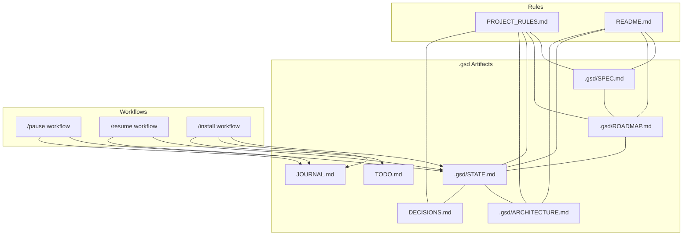
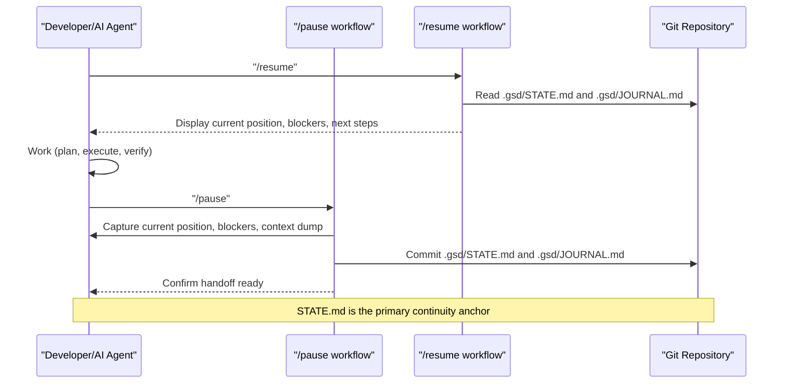
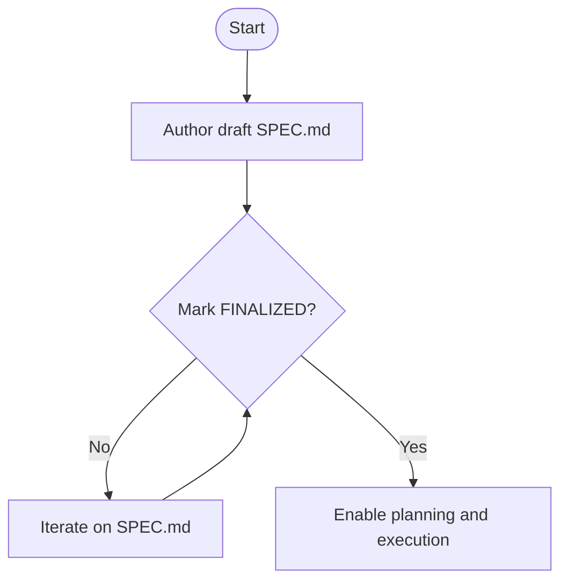
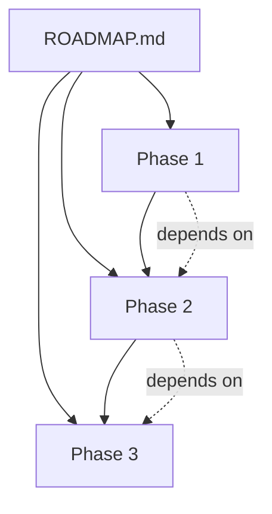
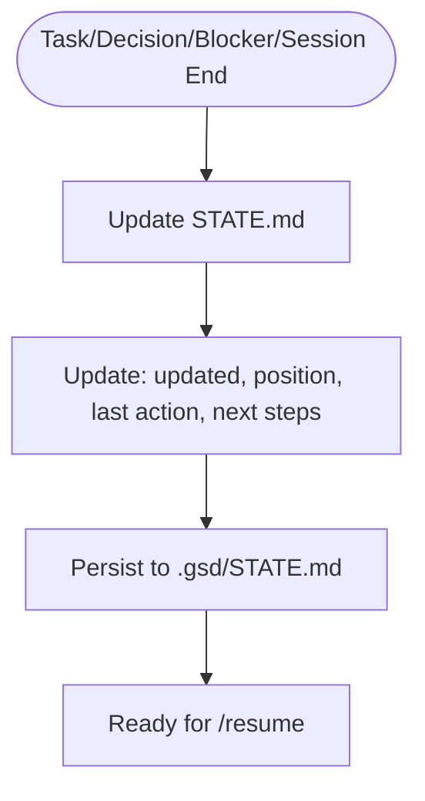
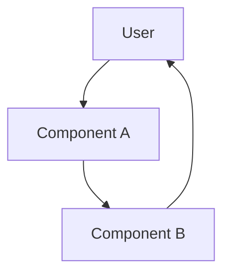
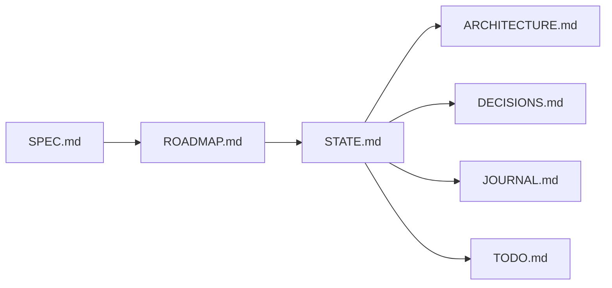

# Project State Management

<cite>
**Referenced Files in This Document**
- [README.md](file://README.md)
- [PROJECT_RULES.md](file://PROJECT_RULES.md)
- [.agent/workflows/pause.md](file://.agent/workflows/pause.md)
- [.agent/workflows/resume.md](file://.agent/workflows/resume.md)
- [.agent/workflows/install.md](file://.agent/workflows/install.md)
- [.gsd/templates/spec.md](file://.gsd/templates/spec.md)
- [.gsd/templates/roadmap.md](file://.gsd/templates/roadmap.md)
- [.gsd/templates/state.md](file://.gsd/templates/state.md)
- [.gsd/templates/architecture.md](file://.gsd/templates/architecture.md)
- [.gsd/templates/decisions.md](file://.gsd/templates/decisions.md)
</cite>

## Table of Contents
1. [Introduction](#introduction)
2. [Project Structure](#project-structure)
3. [Core Components](#core-components)
4. [Architecture Overview](#architecture-overview)
5. [Detailed Component Analysis](#detailed-component-analysis)
6. [Dependency Analysis](#dependency-analysis)
7. [Performance Considerations](#performance-considerations)
8. [Troubleshooting Guide](#troubleshooting-guide)
9. [Conclusion](#conclusion)
10. [Appendices](#appendices)

## Introduction
This document explains the GSD project state management system that preserves and synchronizes context across development sessions. It focuses on four persistent artifacts that form the backbone of continuity:
- SPEC.md: The project specification and requirements
- ROADMAP.md: Long-term planning and milestone structure
- STATE.md: Current session state and handoff memory
- ARCHITECTURE.md: System design and component relationships

These files are designed to enable seamless handoffs between human developers and AI agents, ensuring “fresh context over polluted context” and maintaining reliable, reproducible progress.

## Project Structure
The state management system centers around a small set of markdown artifacts under the .gsd directory and a few workflow helpers that enforce consistent updates and handoff protocols.

**Diagram sources**
- [.gsd/templates/spec.md](file://.gsd/templates/spec.md)
- [.gsd/templates/roadmap.md](file://.gsd/templates/roadmap.md)
- [.gsd/templates/state.md](file://.gsd/templates/state.md)
- [.gsd/templates/architecture.md](file://.gsd/templates/architecture.md)
- [.gsd/templates/decisions.md](file://.gsd/templates/decisions.md)
- [.agent/workflows/pause.md](file://.agent/workflows/pause.md)
- [.agent/workflows/resume.md](file://.agent/workflows/resume.md)
- [.agent/workflows/install.md](file://.agent/workflows/install.md)
- [PROJECT_RULES.md](file://PROJECT_RULES.md)
- [README.md](file://README.md)

**Section sources**
- [README.md:476-520](file://README.md#L476-L520)
- [.agent/workflows/install.md:115-139](file://.agent/workflows/install.md#L115-L139)

## Core Components
- SPEC.md: Defines the project vision, goals, constraints, success criteria, and optionally user stories and technical requirements. It enforces a “planning lock” until finalized, ensuring no implementation begins prematurely.
- ROADMAP.md: Tracks phases, dependencies, must-haves, and progress across milestones. It anchors planning and execution cadence.
- STATE.md: The “save game” for the project—current position, last action, next steps, active decisions, blockers, concerns, and session context. Updated after every task and session.
- ARCHITECTURE.md: Describes system components, data flow, and conventions, generated via /map and kept current as the system evolves.

These components collectively provide persistent context that enables AI agents and humans to pick up exactly where they left off, with clear roles and responsibilities.

**Section sources**
- [.gsd/templates/spec.md:1-52](file://.gsd/templates/spec.md#L1-L52)
- [.gsd/templates/roadmap.md:1-104](file://.gsd/templates/roadmap.md#L1-L104)
- [.gsd/templates/state.md:1-93](file://.gsd/templates/state.md#L1-L93)
- [.gsd/templates/architecture.md:1-68](file://.gsd/templates/architecture.md#L1-L68)
- [README.md:187-196](file://README.md#L187-L196)

## Architecture Overview
The state management architecture is a lightweight, file-based persistence system integrated with GSD workflows. It emphasizes:
- Atomic updates to STATE.md after each task
- Explicit pause/resume handoff protocols
- Minimal context footprint for fast, reliable AI consumption
- Version-controlled synchronization via git

**Diagram sources**
- [.agent/workflows/resume.md:13-118](file://.agent/workflows/resume.md#L13-L118)
- [.agent/workflows/pause.md:23-127](file://.agent/workflows/pause.md#L23-L127)

**Section sources**
- [.agent/workflows/resume.md:13-118](file://.agent/workflows/resume.md#L13-L118)
- [.agent/workflows/pause.md:23-127](file://.agent/workflows/pause.md#L23-L127)
- [README.md:323-327](file://README.md#L323-L327)

## Detailed Component Analysis

### SPEC.md: Project Specification and Requirements
SPEC.md establishes the canonical requirements and constraints. It enforces a “planning lock” until finalized, ensuring that implementation never begins before the specification is stable.

- Structure: Vision, Goals, Non-Goals, Constraints, Success Criteria, optional user stories and technical requirements
- Status: DRAFT or FINALIZED
- Impact: Blocks implementation until FINALIZED

**Diagram sources**
- [.gsd/templates/spec.md:1-52](file://.gsd/templates/spec.md#L1-L52)
- [PROJECT_RULES.md:19](file://PROJECT_RULES.md#L19)

**Section sources**
- [.gsd/templates/spec.md:1-52](file://.gsd/templates/spec.md#L1-L52)
- [PROJECT_RULES.md:19](file://PROJECT_RULES.md#L19)

### ROADMAP.md: Long-Term Planning and Milestones
ROADMAP.md organizes work into milestones and phases with explicit dependencies and progress tracking. It anchors planning and ensures forward-progress.

- Structure: Milestone metadata, must-haves, phases with objectives and statuses, progress summary, timeline
- Status indicators: Not Started, In Progress, Complete, Paused, Blocked
- Guidelines: 3–5 phases per milestone, clear deliverables, forward dependencies

**Diagram sources**
- [.gsd/templates/roadmap.md:31-63](file://.gsd/templates/roadmap.md#L31-L63)

**Section sources**
- [.gsd/templates/roadmap.md:1-104](file://.gsd/templates/roadmap.md#L1-L104)

### STATE.md: Current Project Status and Context
STATE.md is the primary continuity anchor. It captures current position, last action, next steps, active decisions, blockers, concerns, and session context. It is updated after every task and session.

- Template fields: updated timestamp, current position, last action, next steps, active decisions, blockers, concerns, session context
- Update triggers: completed tasks, decisions, blockers, session end/pause
- Lean principle: keep only current context; history belongs in JOURNAL.md

**Diagram sources**
- [.gsd/templates/state.md:62-92](file://.gsd/templates/state.md#L62-L92)

**Section sources**
- [.gsd/templates/state.md:1-93](file://.gsd/templates/state.md#L1-L93)

### ARCHITECTURE.md: System Design and Component Relationships
ARCHITECTURE.md describes the system’s components, data flow, and conventions. It is generated via /map and evolves alongside implementation.

- Structure: Overview, components, data flow, technical debt, conventions
- Purpose: Provide shared mental model for developers and agents

**Diagram sources**
- [.gsd/templates/architecture.md:9-23](file://.gsd/templates/architecture.md#L9-L23)

**Section sources**
- [.gsd/templates/architecture.md:1-68](file://.gsd/templates/architecture.md#L1-L68)

### DECISIONS.md: Architecture Decision Records
DECISIONS.md records significant technical decisions with context, decision, rationale, consequences, and alternatives considered. It complements STATE.md by anchoring architectural choices.

- Template: Decision ID, date, status, context, decision, rationale, consequences, alternatives
- Purpose: Maintain traceability of key design choices

**Section sources**
- [.gsd/templates/decisions.md:1-38](file://.gsd/templates/decisions.md#L1-L38)

### JOURNAL.md and TODO.md: Supporting State Artifacts
- JOURNAL.md: Session logs capturing objectives, accomplishments, verification status, pause reasons, and handoff notes. Keeps history separate from current context.
- TODO.md: Quick capture of ideas and reminders.

**Section sources**
- [.agent/workflows/pause.md:68-91](file://.agent/workflows/pause.md#L68-L91)
- [.agent/workflows/install.md:115-139](file://.agent/workflows/install.md#L115-L139)

## Dependency Analysis
The state artifacts depend on each other in a layered way, with SPEC.md and ROADMAP.md anchoring higher-level direction, STATE.md mediating day-to-day continuity, and ARCHITECTURE.md and DECISIONS.md supporting shared understanding.

**Diagram sources**
- [.gsd/templates/spec.md](file://.gsd/templates/spec.md)
- [.gsd/templates/roadmap.md](file://.gsd/templates/roadmap.md)
- [.gsd/templates/state.md](file://.gsd/templates/state.md)
- [.gsd/templates/architecture.md](file://.gsd/templates/architecture.md)
- [.gsd/templates/decisions.md](file://.gsd/templates/decisions.md)

**Section sources**
- [README.md:187-196](file://README.md#L187-L196)
- [PROJECT_RULES.md:106-130](file://PROJECT_RULES.md#L106-L130)

## Performance Considerations
- Keep STATE.md lean: Only current context, not history. History belongs in JOURNAL.md.
- Update frequency: After every task, decision, blocker identification, and session end/pause.
- Context hygiene: If encountering repeated failures or approaching context usage thresholds, trigger a state dump and start fresh.
- Token efficiency: Follow search-first discipline and compression protocols to minimize context load.

**Section sources**
- [.gsd/templates/state.md:76-80](file://.gsd/templates/state.md#L76-L80)
- [PROJECT_RULES.md:195-200](file://PROJECT_RULES.md#L195-L200)
- [PROJECT_RULES.md:203-243](file://PROJECT_RULES.md#L203-L243)

## Troubleshooting Guide
Common issues and resolutions:

- STATE.md not updating
  - Cause: Missing post-task update
  - Resolution: Manually update STATE.md after each task and commit

- Conflicts on resume
  - Symptom: Uncommitted changes detected
  - Resolution: Review modified files, commit or stash, then /resume

- Polluted context leading to repeated failures
  - Symptom: 3-strike debugging rule triggers
  - Resolution: Perform a state dump via /pause, then /resume for a fresh session

- Session termination before /pause
  - Mitigation: Proactive auto-save protocol writes a lightweight snapshot to STATE.md before hitting usage limits

- Git integration
  - Add .gsd/STATE.md, .gsd/JOURNAL.md, and .gsd/TODO.md to .gitignore if desired, or commit them for continuity across machines

**Section sources**
- [.agent/workflows/resume.md:66-82](file://.agent/workflows/resume.md#L66-L82)
- [.agent/workflows/pause.md:131-141](file://.agent/workflows/pause.md#L131-L141)
- [.agent/workflows/pause.md:144-176](file://.agent/workflows/pause.md#L144-L176)
- [.agent/workflows/install.md:115-139](file://.agent/workflows/install.md#L115-L139)

## Conclusion
The GSD state management system provides a robust, file-based foundation for continuity across sessions. By enforcing disciplined updates to STATE.md, leveraging explicit pause/resume workflows, and integrating with git, it ensures that both human developers and AI agents can reliably hand off context without drift or confusion. Together with SPEC.md, ROADMAP.md, ARCHITECTURE.md, and DECISIONS.md, it embodies the GSD principle of “fresh context over polluted context.”

## Appendices

### State Synchronization and Version Control Integration
- Git commits: Each task is committed atomically; STATE.md and JOURNAL.md are committed during /pause to preserve handoff state.
- Handoff safety: Even if a session ends unexpectedly, STATE.md is already saved, enabling a clean /resume.
- Optional .gitignore: Consider adding session-specific files to avoid committing transient state to repositories.

**Section sources**
- [README.md:249-260](file://README.md#L249-L260)
- [.agent/workflows/pause.md:95-100](file://.agent/workflows/pause.md#L95-L100)
- [.agent/workflows/install.md:115-139](file://.agent/workflows/install.md#L115-L139)

### Data Structures Used to Represent Project State
- SPEC.md: Structured fields for vision, goals, constraints, success criteria, and optional user stories/requirements
- ROADMAP.md: Hierarchical phases with status, dependencies, progress summary, and timeline
- STATE.md: Lightweight, frequently accessed fields for current position, last action, next steps, active decisions, blockers, concerns, and session context
- ARCHITECTURE.md: Component descriptions, data flow, conventions, and technical debt
- DECISIONS.md: Decision records with context, decision, rationale, consequences, and alternatives

**Section sources**
- [.gsd/templates/spec.md:1-52](file://.gsd/templates/spec.md#L1-L52)
- [.gsd/templates/roadmap.md:1-104](file://.gsd/templates/roadmap.md#L1-L104)
- [.gsd/templates/state.md:1-93](file://.gsd/templates/state.md#L1-L93)
- [.gsd/templates/architecture.md:1-68](file://.gsd/templates/architecture.md#L1-L68)
- [.gsd/templates/decisions.md:1-38](file://.gsd/templates/decisions.md#L1-L38)

### Update Mechanisms and Consistency
- Post-task updates: STATE.md updated immediately after each task completion
- Decision logging: Record decisions in STATE.md and DECISIONS.md
- Blocker tracking: Capture blockers and resolution approaches in STATE.md
- Wave summaries: At wave completion, create a snapshot in STATE.md and commit

**Section sources**
- [.gsd/templates/state.md:62-80](file://.gsd/templates/state.md#L62-L80)
- [PROJECT_RULES.md:76-103](file://PROJECT_RULES.md#L76-L103)

### Backup and Recovery Procedures
- Proactive auto-save: Write lightweight STATE.md snapshots before reaching context usage thresholds
- State dump: On third failure or heavy context usage, perform a full /pause to capture a comprehensive handoff
- Recovery: Use /resume to reload STATE.md and JOURNAL.md, then continue from next steps

**Section sources**
- [.agent/workflows/pause.md:144-176](file://.agent/workflows/pause.md#L144-L176)
- [PROJECT_RULES.md:195-199](file://PROJECT_RULES.md#L195-L199)

### Examples of Typical State Transitions During Development
- From SPEC.md FINALIZED to ROADMAP.md creation, then to /discuss-phase and /plan
- From /execute to STATE.md updated with last action and next steps
- From /verify to STATE.md updated with verification outcomes
- From /pause to persisted STATE.md and JOURNAL.md for handoff
- From /resume to immediate continuation guided by STATE.md

**Section sources**
- [README.md:170-178](file://README.md#L170-L178)
- [.agent/workflows/resume.md:13-53](file://.agent/workflows/resume.md#L13-L53)
- [.agent/workflows/pause.md:23-64](file://.agent/workflows/pause.md#L23-L64)

### Best Practices for Maintaining Clean State Files
- Keep STATE.md concise and current; move historical details to JOURNAL.md
- Update after every task, decision, blocker identification, and session end
- Use the 3-strike rule and context hygiene thresholds to avoid polluted context
- Commit STATE.md and JOURNAL.md promptly during /pause
- Use .gitignore selectively for session-specific files

**Section sources**
- [.gsd/templates/state.md:76-80](file://.gsd/templates/state.md#L76-L80)
- [PROJECT_RULES.md:195-200](file://PROJECT_RULES.md#L195-L200)
- [.agent/workflows/install.md:115-139](file://.agent/workflows/install.md#L115-L139)

### Relationship Between State Management and the Broader GSD Workflow
- SPEC.md anchors requirements and enforces planning lock
- ROADMAP.md structures phases and dependencies
- STATE.md mediates continuity across sessions and integrates with /pause and /resume
- ARCHITECTURE.md and DECISIONS.md support shared understanding and traceability
- The system promotes “fresh context over polluted context,” enabling reliable handoffs

**Section sources**
- [README.md:187-196](file://README.md#L187-L196)
- [README.md:357-367](file://README.md#L357-L367)
- [PROJECT_RULES.md:106-130](file://PROJECT_RULES.md#L106-L130)