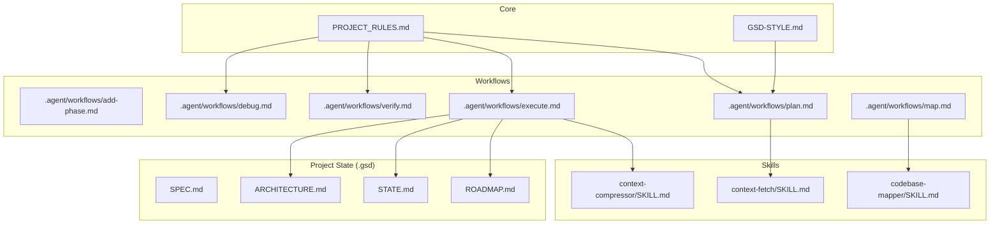
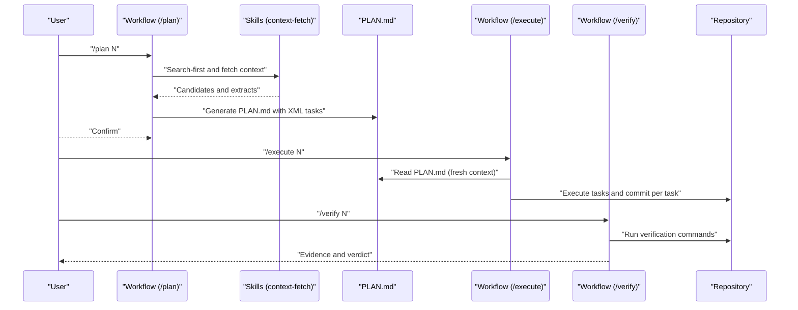
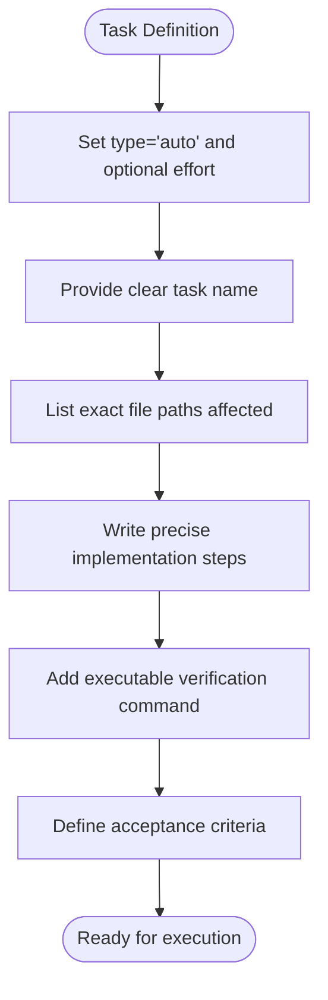
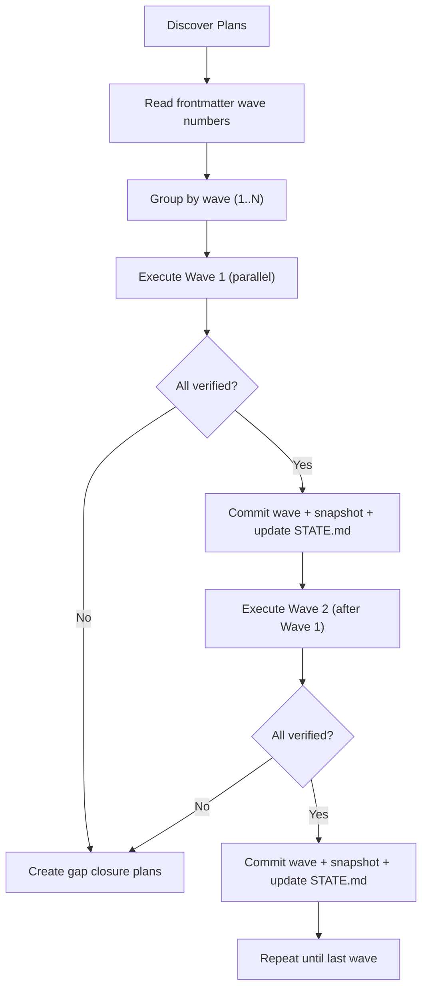
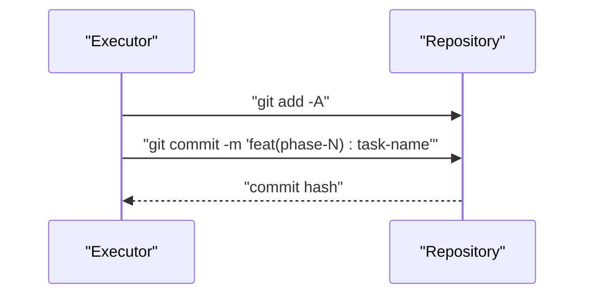
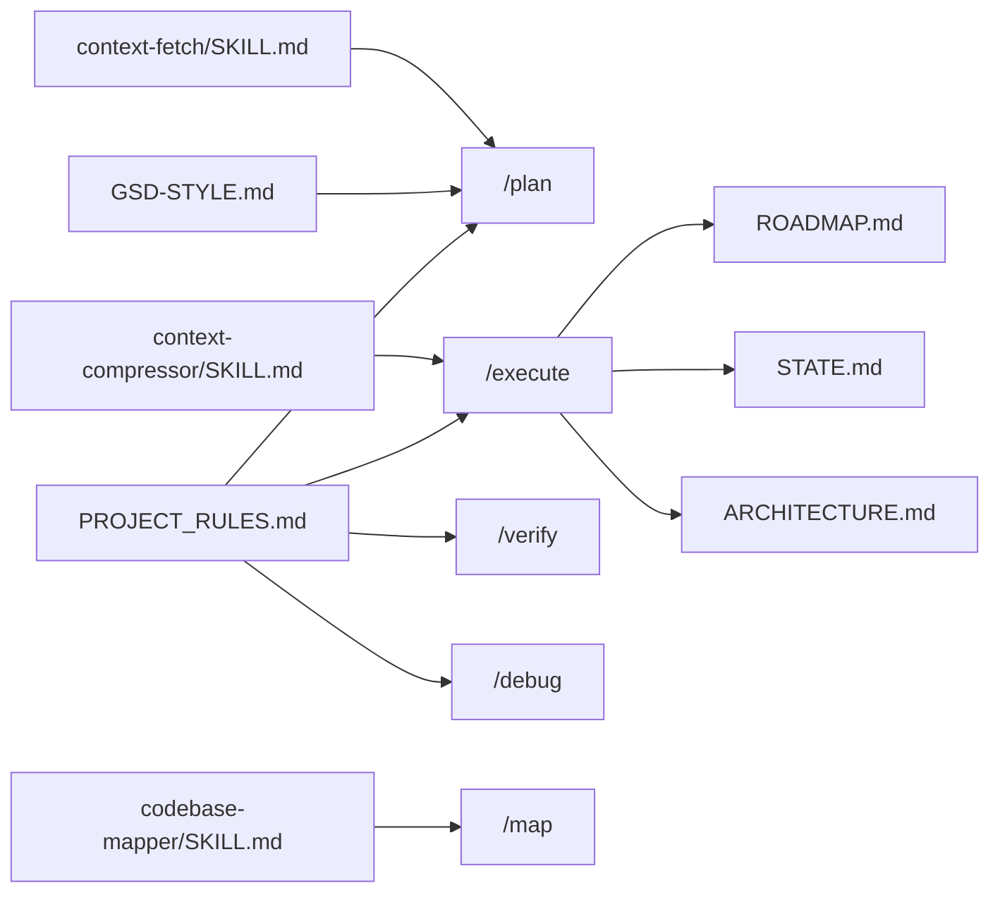

# Workflow System

<cite>
**Referenced Files in This Document**
- [README.md](file://README.md)
- [GSD-STYLE.md](file://GSD-STYLE.md)
- [PROJECT_RULES.md](file://PROJECT_RULES.md)
- [.agent/workflows/add-phase.md](file://.agent/workflows/add-phase.md)
- [.agent/workflows/add-todo.md](file://.agent/workflows/add-todo.md)
- [.agent/workflows/audit-milestone.md](file://.agent/workflows/audit-milestone.md)
- [.agent/workflows/check-todos.md](file://.agent/workflows/check-todos.md)
- [.agent/workflows/complete-milestone.md](file://.agent/workflows/complete-milestone.md)
- [.agent/workflows/debug.md](file://.agent/workflows/debug.md)
- [.agent/workflows/discuss-phase.md](file://.agent/workflows/discuss-phase.md)
- [.agent/workflows/execute.md](file://.agent/workflows/execute.md)
- [.agent/workflows/help.md](file://.agent/workflows/help.md)
- [.agent/workflows/insert-phase.md](file://.agent/workflows/insert-phase.md)
- [.agent/workflows/install.md](file://.agent/workflows/install.md)
- [.agent/workflows/list-phase-assumptions.md](file://.agent/workflows/list-phase-assumptions.md)
- [.agent/workflows/map.md](file://.agent/workflows/map.md)
- [.agent/workflows/new-milestone.md](file://.agent/workflows/new-milestone.md)
- [.agent/workflows/new-project.md](file://.agent/workflows/new-project.md)
- [.agent/workflows/pause.md](file://.agent/workflows/pause.md)
- [.agent/workflows/plan-milestone-gaps.md](file://.agent/workflows/plan-milestone-gaps.md)
- [.agent/workflows/plan.md](file://.agent/workflows/plan.md)
- [.agent/workflows/progress.md](file://.agent/workflows/progress.md)
- [.agent/workflows/remove-phase.md](file://.agent/workflows/remove-phase.md)
- [.agent/workflows/research-phase.md](file://.agent/workflows/research-phase.md)
- [.agent/workflows/resume.md](file://.agent/workflows/resume.md)
- [.agent/workflows/sprint.md](file://.agent/workflows/sprint.md)
- [.agent/workflows/update.md](file://.agent/workflows/update.md)
- [.agent/workflows/verify.md](file://.agent/workflows/verify.md)
- [.agent/workflows/web-search.md](file://.agent/workflows/web-search.md)
- [.agent/workflows/whats-new.md](file://.agent/workflows/whats-new.md)
- [.agents/skills/codebase-mapper/SKILL.md](file://.agents/skills/codebase-mapper/SKILL.md)
- [.agents/skills/context-compressor/SKILL.md](file://.agents/skills/context-compressor/SKILL.md)
- [.agents/skills/context-fetch/SKILL.md](file://.agents/skills/context-fetch/SKILL.md)
</cite>

## Table of Contents
1. [Introduction](#introduction)
2. [Project Structure](#project-structure)
3. [Core Components](#core-components)
4. [Architecture Overview](#architecture-overview)
5. [Detailed Component Analysis](#detailed-component-analysis)
6. [Dependency Analysis](#dependency-analysis)
7. [Performance Considerations](#performance-considerations)
8. [Troubleshooting Guide](#troubleshooting-guide)
9. [Conclusion](#conclusion)
10. [Appendices](#appendices)

## Introduction
This document describes the GSD workflow system that provides 27 slash commands enabling AI-assisted development through structured, reliable processes. It explains how each workflow command operates, the XML task formatting requirements, verification and empirical validation steps, and how workflows transform AI assistance into consistent outcomes. It also details the wave-based execution system and the atomic commit strategy that ensures reversible changes, along with practical examples, customization guidance, and troubleshooting advice.

## Project Structure
The GSD methodology centers around a small set of canonical rules and conventions, with workflows implemented as Markdown files with YAML frontmatter and XML process blocks. The key directories and files are:
- .agent/workflows/: 27 slash commands that orchestrate the GSD process
- .agents/skills/: specialized agent behaviors referenced by workflows
- .gsd/: project state and artifacts (SPEC, ROADMAP, STATE, ARCHITECTURE, etc.)
- docs/: operational documentation and playbooks
- scripts/: validation and search utilities

**Diagram sources**
- [PROJECT_RULES.md:1-261](file://PROJECT_RULES.md#L1-L261)
- [GSD-STYLE.md:1-273](file://GSD-STYLE.md#L1-L273)
- [.agent/workflows/execute.md:1-324](file://.agent/workflows/execute.md#L1-L324)
- [.agent/workflows/plan.md](file://.agent/workflows/plan.md)
- [.agent/workflows/map.md](file://.agent/workflows/map.md)
- [.agents/skills/codebase-mapper/SKILL.md:1-227](file://.agents/skills/codebase-mapper/SKILL.md#L1-L227)
- [.agents/skills/context-fetch/SKILL.md:1-185](file://.agents/skills/context-fetch/SKILL.md#L1-L185)
- [.agents/skills/context-compressor/SKILL.md:1-202](file://.agents/skills/context-compressor/SKILL.md#L1-L202)

**Section sources**
- [README.md:476-520](file://README.md#L476-L520)
- [PROJECT_RULES.md:157-181](file://PROJECT_RULES.md#L157-L181)

## Core Components
- Slash commands: 27 workflows invoked as chat messages (e.g., /plan 1). Each workflow defines a clear objective, process steps, and “Next” routing.
- XML task format: Tasks are defined with semantic XML containers and attributes, including name, files, action, verify, done, and optional effort.
- Wave-based execution: Plans are grouped into waves by dependency; each wave executes sequentially and verifies before proceeding.
- Atomic commits: Each task is committed individually with a concise commit message aligned to the commit convention.
- Empirical verification: Every change must produce verifiable evidence (e.g., screenshots, curl outputs, test results).

**Section sources**
- [README.md:274-338](file://README.md#L274-L338)
- [GSD-STYLE.md:43-105](file://GSD-STYLE.md#L43-L105)
- [PROJECT_RULES.md:58-104](file://PROJECT_RULES.md#L58-L104)
- [PROJECT_RULES.md:133-154](file://PROJECT_RULES.md#L133-L154)
- [PROJECT_RULES.md:23-38](file://PROJECT_RULES.md#L23-L38)

## Architecture Overview
The GSD workflow system follows a strict protocol: SPEC → PLAN → EXECUTE → VERIFY → COMMIT. Workflows coordinate this pipeline, ensuring that planning precedes implementation, verification captures evidence, and commits are atomic and reversible.

**Diagram sources**
- [README.md:147-179](file://README.md#L147-L179)
- [.agent/workflows/plan.md](file://.agent/workflows/plan.md)
- [.agent/workflows/execute.md:19-37](file://.agent/workflows/execute.md#L19-L37)
- [.agent/workflows/verify.md](file://.agent/workflows/verify.md)
- [.agents/skills/context-fetch/SKILL.md:16-109](file://.agents/skills/context-fetch/SKILL.md#L16-L109)

## Detailed Component Analysis

### XML Task Formatting Requirements
- Task container: <task type="auto" effort="medium|high|max|low"> with name, files, action, verify, done.
- Verify and done: verify contains an executable command or assertion; done specifies measurable acceptance criteria.
- Effort attribute: optional hint for model selection; defaults to medium if omitted.
- Checkpoint tasks: <task type="checkpoint:human-verify"> for human review gates.

**Diagram sources**
- [GSD-STYLE.md:64-94](file://GSD-STYLE.md#L64-L94)

**Section sources**
- [GSD-STYLE.md:64-94](file://GSD-STYLE.md#L64-L94)

### Wave-Based Execution System
- Plans are grouped into waves based on dependencies; lower wave numbers execute first.
- Within a wave, plans execute in parallel; the wave completes only when all plans are verified and summarized.
- After each wave, a state snapshot is created, changes are committed, and STATE.md is updated.

**Diagram sources**
- [PROJECT_RULES.md:58-104](file://PROJECT_RULES.md#L58-L104)
- [.agent/workflows/execute.md:127-177](file://.agent/workflows/execute.md#L127-L177)

**Section sources**
- [PROJECT_RULES.md:58-104](file://PROJECT_RULES.md#L58-L104)
- [.agent/workflows/execute.md:127-177](file://.agent/workflows/execute.md#L127-L177)

### Atomic Commit Strategy
- One task = one commit; commit messages follow a conventional format with type and scope.
- Commits are performed immediately after successful verification, ensuring reversibility and traceability.

**Diagram sources**
- [PROJECT_RULES.md:133-154](file://PROJECT_RULES.md#L133-L154)
- [.agent/workflows/execute.md:165-170](file://.agent/workflows/execute.md#L165-L170)

**Section sources**
- [PROJECT_RULES.md:133-154](file://PROJECT_RULES.md#L133-L154)
- [.agent/workflows/execute.md:165-170](file://.agent/workflows/execute.md#L165-L170)

### Command Catalog and Processing Logic

#### add-phase
- Purpose: Add a new phase to the end of the roadmap.
- Steps: Validate roadmap, compute next phase number, gather phase info, append to ROADMAP.md, update STATE.md, commit.
- Output: Next steps route to /plan N.

**Section sources**
- [.agent/workflows/add-phase.md:1-97](file://.agent/workflows/add-phase.md#L1-L97)

#### add-todo
- Purpose: Capture a todo item quickly with optional priority.
- Steps: Parse arguments, ensure TODO.md exists, append item with priority and date, confirm and route to /check-todos.

**Section sources**
- [.agent/workflows/add-todo.md:1-70](file://.agent/workflows/add-todo.md#L1-L70)

#### audit-milestone
- Purpose: Audit a milestone for quality and completeness.
- Steps: Load milestone context, check must-haves verification, review technical debt, analyze phase quality, generate audit report, offer actions.

**Section sources**
- [.agent/workflows/audit-milestone.md:1-108](file://.agent/workflows/audit-milestone.md#L1-L108)

#### check-todos
- Purpose: List pending todo items, optionally filtered by priority or status.
- Steps: Load TODO.md, parse and filter, display lists, route to /add-todo.

**Section sources**
- [.agent/workflows/check-todos.md:1-81](file://.agent/workflows/check-todos.md#L1-L81)

#### complete-milestone
- Purpose: Mark current milestone as complete, archive artifacts, reset for next milestone.
- Steps: Verify all phases complete, run final verification, generate summary, archive current state, reset ROADMAP/DECISIONS/JOURNAL, refresh architecture and requirements, commit and tag.

**Section sources**
- [.agent/workflows/complete-milestone.md:1-193](file://.agent/workflows/complete-milestone.md#L1-L193)

#### debug
- Purpose: Systematic debugging with persistent state and 3-strike rule.
- Steps: Initialize debug session, document symptom, gather evidence, form hypotheses, test, apply fix if root cause found, handle 3-strike rule, commit resolution.

**Section sources**
- [.agent/workflows/debug.md:1-236](file://.agent/workflows/debug.md#L1-L236)

#### discuss-phase
- Purpose: Clarify scope and approach for a phase before planning.
- Steps: Load phase context, analyze requirements, present discussion points, gather user input, document decisions in DECISIONS.md, route to /plan or /research-phase.

**Section sources**
- [.agent/workflows/discuss-phase.md:1-124](file://.agent/workflows/discuss-phase.md#L1-L124)

#### execute
- Purpose: Execute a specific phase with wave-based parallelism and atomic commits.
- Steps: Validate environment and phase, ensure phase directory, discover plans, group by wave, execute within waves, verify wave completion, verify phase goal, update roadmap/state/requirements, commit, route next.

**Section sources**
- [.agent/workflows/execute.md:1-324](file://.agent/workflows/execute.md#L1-L324)

#### help
- Purpose: Show all available commands.
- Steps: Display command categories and descriptions.

**Section sources**
- [.agent/workflows/help.md](file://.agent/workflows/help.md)

#### insert-phase
- Purpose: Insert a phase at a given position (re-numbers subsequent phases).
- Steps: Validate roadmap, determine insertion index, insert phase block, renumber downstream phases, update STATE.md, commit.

**Section sources**
- [.agent/workflows/insert-phase.md](file://.agent/workflows/insert-phase.md)

#### install
- Purpose: Install GSD from GitHub into a project.
- Steps: Clone template, copy directories and files, clean up.

**Section sources**
- [.agent/workflows/install.md](file://.agent/workflows/install.md)

#### list-phase-assumptions
- Purpose: Surface assumptions embedded in a phase’s planning context.
- Steps: Load phase context, extract assumptions, present in a structured list.

**Section sources**
- [.agent/workflows/list-phase-assumptions.md](file://.agent/workflows/list-phase-assumptions.md)

#### map
- Purpose: Analyze codebase and produce ARCHITECTURE.md and STACK.md.
- Steps: Detect project type, scan structure, extract dependencies, discover patterns, surface technical debt, output documents.

**Section sources**
- [.agent/workflows/map.md](file://.agent/workflows/map.md)
- [.agents/skills/codebase-mapper/SKILL.md:1-227](file://.agents/skills/codebase-mapper/SKILL.md#L1-L227)

#### new-milestone
- Purpose: Create a new milestone with initial phases.
- Steps: Initialize milestone metadata, create ROADMAP.md with starter phases, initialize STATE.md, commit.

**Section sources**
- [.agent/workflows/new-milestone.md](file://.agent/workflows/new-milestone.md)

#### new-project
- Purpose: Deep questioning to finalize SPEC.md.
- Steps: Guide user through requirements definition until SPEC.md is marked FINALIZED.

**Section sources**
- [.agent/workflows/new-project.md](file://.agent/workflows/new-project.md)

#### pause
- Purpose: Save state for session handoff.
- Steps: Snapshot current state, preserve context for later resume.

**Section sources**
- [.agent/workflows/pause.md](file://.agent/workflows/pause.md)

#### plan-milestone-gaps
- Purpose: Create gap closure plans for a milestone.
- Steps: Identify failed must-haves, generate gap closure plans with XML tasks, route to /execute --gaps-only.

**Section sources**
- [.agent/workflows/plan-milestone-gaps.md](file://.agent/workflows/plan-milestone-gaps.md)

#### plan
- Purpose: Create PLAN.md for a phase with XML tasks.
- Steps: Use skills to search-first and fetch context, generate tasks with verify/done, enforce XML format.

**Section sources**
- [.agent/workflows/plan.md](file://.agent/workflows/plan.md)
- [.agents/skills/context-fetch/SKILL.md:16-109](file://.agents/skills/context-fetch/SKILL.md#L16-L109)

#### progress
- Purpose: Show current position in the roadmap.
- Steps: Read ROADMAP.md and STATE.md to report status.

**Section sources**
- [.agent/workflows/progress.md](file://.agent/workflows/progress.md)

#### remove-phase
- Purpose: Remove a phase with safety checks.
- Steps: Validate roadmap, confirm removal, shift downstream phases, update STATE.md, commit.

**Section sources**
- [.agent/workflows/remove-phase.md](file://.agent/workflows/remove-phase.md)

#### research-phase
- Purpose: Deep technical research for a phase.
- Steps: Explore alternatives, constraints, and trade-offs, document findings for decision-making.

**Section sources**
- [.agent/workflows/research-phase.md](file://.agent/workflows/research-phase.md)

#### resume
- Purpose: Restore from last session.
- Steps: Load persisted state and continue from last checkpoint.

**Section sources**
- [.agent/workflows/resume.md](file://.agent/workflows/resume.md)

#### sprint
- Purpose: Manage time-boxed sprints.
- Steps: Create new sprint, show status, close sprint with retrospective.

**Section sources**
- [.agent/workflows/sprint.md](file://.agent/workflows/sprint.md)

#### update
- Purpose: Update GSD to the latest version.
- Steps: Pull latest template, merge changes, validate structure.

**Section sources**
- [.agent/workflows/update.md](file://.agent/workflows/update.md)

#### verify
- Purpose: Empirical validation of work with proof capture.
- Steps: Run verification commands, collect evidence, produce VERIFICATION.md, route by verdict.

**Section sources**
- [.agent/workflows/verify.md](file://.agent/workflows/verify.md)
- [PROJECT_RULES.md:23-38](file://PROJECT_RULES.md#L23-L38)

#### web-search
- Purpose: Search the web for decisions.
- Steps: Perform web search, present results for decision support.

**Section sources**
- [.agent/workflows/web-search.md](file://.agent/workflows/web-search.md)

#### whats-new
- Purpose: Show recent GSD changes.
- Steps: Display changelog or recent updates.

**Section sources**
- [.agent/workflows/whats-new.md](file://.agent/workflows/whats-new.md)

### Verification Processes and Empirical Validation
- Verification must produce evidence: curl outputs for API endpoints, screenshots for UI changes, test results for tests, build outputs for compilation.
- Verification is run per task during execution and again at the phase level to ensure must-haves are satisfied.

**Section sources**
- [PROJECT_RULES.md:23-38](file://PROJECT_RULES.md#L23-L38)
- [.agent/workflows/execute.md:180-202](file://.agent/workflows/execute.md#L180-L202)
- [.agent/workflows/verify.md](file://.agent/workflows/verify.md)

### Practical Examples and Patterns
- Typical session: /resume → /progress → /discuss-phase N → /plan N → /execute N → /verify N → /pause.
- Combining workflows: Use /discuss-phase before /plan, then /research-phase to explore alternatives, then /plan and /execute; if verification fails, create gap closure plans and rerun with /execute --gaps-only.

**Section sources**
- [README.md:340-351](file://README.md#L340-L351)
- [.agent/workflows/discuss-phase.md:12-18](file://.agent/workflows/discuss-phase.md#L12-L18)
- [.agent/workflows/plan.md](file://.agent/workflows/plan.md)
- [.agent/workflows/execute.md:121-123](file://.agent/workflows/execute.md#L121-L123)

### Customization Guidance
- Project types: Adjust model selection by phase (reasoning for planning, fast for implementation, reasoning for debugging).
- Team sizes: Solo developers use the core protocol; small teams can adopt the same workflows with shared STATE.md and minimal ceremony.
- Adapters: Optional model-specific enhancements referenced in adapters/; canonical rules remain in PROJECT_RULES.md.

**Section sources**
- [README.md:381-410](file://README.md#L381-L410)
- [PROJECT_RULES.md:106-131](file://PROJECT_RULES.md#L106-L131)

## Dependency Analysis
The workflows depend on:
- Canonical rules in PROJECT_RULES.md
- Style and conventions in GSD-STYLE.md
- Skills for context fetching, compression, and mapping
- Project state files (.gsd/*)

**Diagram sources**
- [PROJECT_RULES.md:1-261](file://PROJECT_RULES.md#L1-L261)
- [GSD-STYLE.md:1-273](file://GSD-STYLE.md#L1-L273)
- [.agent/workflows/plan.md](file://.agent/workflows/plan.md)
- [.agent/workflows/execute.md:19-37](file://.agent/workflows/execute.md#L19-L37)
- [.agents/skills/context-fetch/SKILL.md:16-109](file://.agents/skills/context-fetch/SKILL.md#L16-L109)
- [.agents/skills/context-compressor/SKILL.md:1-202](file://.agents/skills/context-compressor/SKILL.md#L1-L202)
- [.agents/skills/codebase-mapper/SKILL.md:1-227](file://.agents/skills/codebase-mapper/SKILL.md#L1-L227)

**Section sources**
- [PROJECT_RULES.md:1-261](file://PROJECT_RULES.md#L1-L261)
- [GSD-STYLE.md:1-273](file://GSD-STYLE.md#L1-L273)
- [.agent/workflows/execute.md:19-37](file://.agent/workflows/execute.md#L19-L37)

## Performance Considerations
- Context hygiene: Keep plans under 50% context usage; use search-first discipline and compression strategies.
- Fresh context per plan execution; avoid accumulating orchestrator state.
- Token efficiency: Use outline mode, diff-only mode, and progressive disclosure to minimize tokens.

**Section sources**
- [PROJECT_RULES.md:184-200](file://PROJECT_RULES.md#L184-L200)
- [.agents/skills/context-compressor/SKILL.md:17-128](file://.agents/skills/context-compressor/SKILL.md#L17-L128)
- [.agents/skills/context-fetch/SKILL.md:47-86](file://.agents/skills/context-fetch/SKILL.md#L47-L86)

## Troubleshooting Guide
- Debugging failures: Use /debug with the 3-strike rule; if exhausted on the same approach, pause for a fresh session or try a different approach.
- State dumps: After 3 debugging failures, persist state and recommend /pause to reset context.
- Verification failures: Create gap closure plans and rerun with /execute --gaps-only.
- Context overflow: Enforce compression triggers and use context-health monitoring.

**Section sources**
- [.agent/workflows/debug.md:152-181](file://.agent/workflows/debug.md#L152-L181)
- [PROJECT_RULES.md:195-200](file://PROJECT_RULES.md#L195-L200)
- [.agent/workflows/execute.md:199-202](file://.agent/workflows/execute.md#L199-L202)
- [.agents/skills/context-compressor/SKILL.md:117-128](file://.agents/skills/context-compressor/SKILL.md#L117-L128)

## Conclusion
The GSD workflow system transforms AI assistance into reliable outcomes by enforcing a strict protocol, structured XML task definitions, wave-based execution, and atomic commits. The 27 slash commands provide a comprehensive toolkit for planning, executing, verifying, and auditing development work, while skills and canonical rules ensure consistency across diverse projects and teams.

## Appendices

### XML Task Structure Reference
- Container: <task type="auto|checkpoint:human-verify" effort="low|medium|high|max">
- Required fields: name, files, action, verify, done
- Optional: effort attribute for model selection guidance

**Section sources**
- [GSD-STYLE.md:64-94](file://GSD-STYLE.md#L64-L94)

### Commit Convention Reference
- Format: type(scope): description
- Types: feat, fix, docs, refactor, test, chore
- Scope: phase number for phase work

**Section sources**
- [PROJECT_RULES.md:133-154](file://PROJECT_RULES.md#L133-L154)