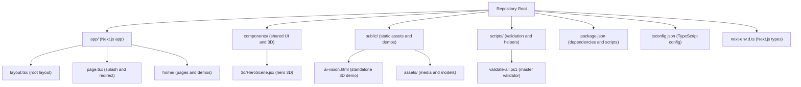
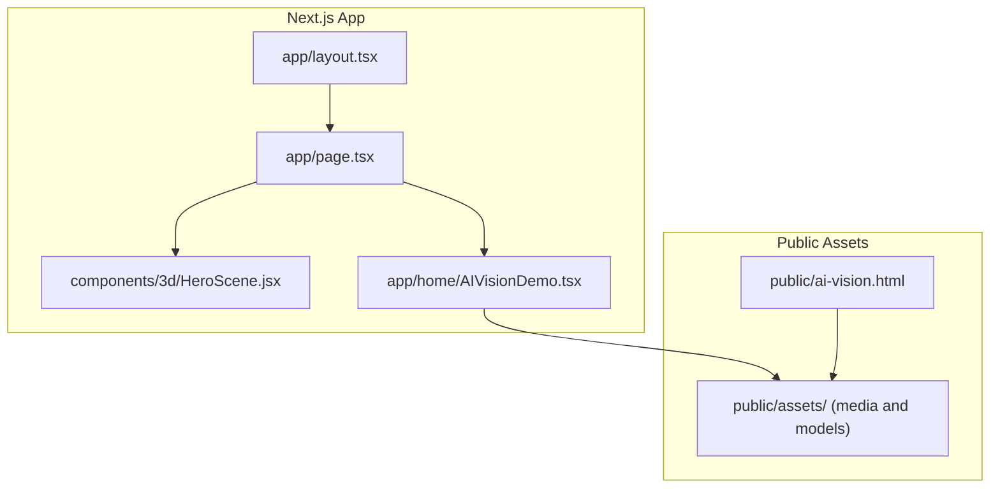
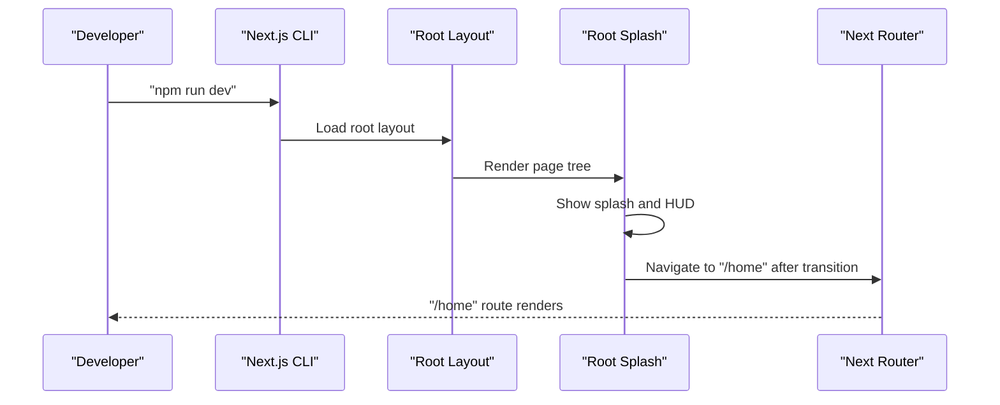
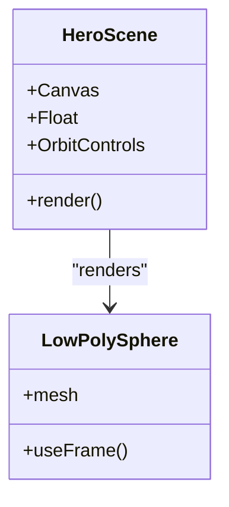
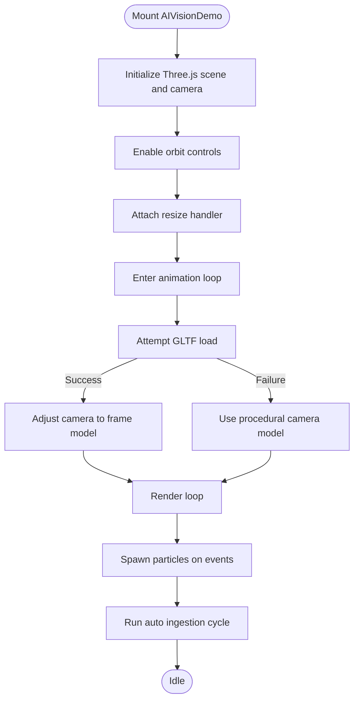
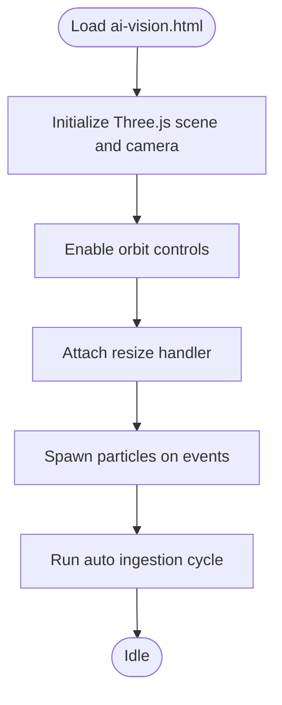

# Getting Started

<cite>
**Referenced Files in This Document**
- [README.md](file://README.md)
- [package.json](file://package.json)
- [tsconfig.json](file://tsconfig.json)
- [next-env.d.ts](file://next-env.d.ts)
- [app/layout.tsx](file://app/layout.tsx)
- [app/page.tsx](file://app/page.tsx)
- [components/3d/HeroScene.jsx](file://components/3d/HeroScene.jsx)
- [app/home/AIVisionDemo.tsx](file://app/home/AIVisionDemo.tsx)
- [public/ai-vision.html](file://public/ai-vision.html)
- [scripts/validate-all.ps1](file://scripts/validate-all.ps1)
- [PROJECT_RULES.md](file://PROJECT_RULES.md)
- [GSD-STYLE.md](file://GSD-STYLE.md)
- [model_capabilities.yaml](file://model_capabilities.yaml)
</cite>

## Table of Contents
1. [Introduction](#introduction)
2. [Project Structure](#project-structure)
3. [Core Components](#core-components)
4. [Architecture Overview](#architecture-overview)
5. [Detailed Component Analysis](#detailed-component-analysis)
6. [Dependency Analysis](#dependency-analysis)
7. [Performance Considerations](#performance-considerations)
8. [Troubleshooting Guide](#troubleshooting-guide)
9. [Conclusion](#conclusion)
10. [Appendices](#appendices)

## Introduction
This guide helps you install and run the Zeex AI Main Website locally, focusing on the Next.js application and its 3D visualization features. You will:
- Prepare your environment and install dependencies
- Start the development server
- Explore the home page, hero 3D scene, and AI vision demo
- Understand key directories and files
- Troubleshoot common setup issues

Note: This project includes both a Next.js frontend and a static HTML-based AI vision demo. The Next.js app runs via the Next.js CLI, while the AI vision demo is served statically from the public folder.

## Project Structure
High-level overview of the most relevant parts of the repository for local setup and development:

**Diagram sources**
- [package.json:1-31](file://package.json#L1-L31)
- [tsconfig.json:1-40](file://tsconfig.json#L1-L40)
- [app/layout.tsx:1-24](file://app/layout.tsx#L1-L24)
- [app/page.tsx:1-55](file://app/page.tsx#L1-L55)
- [components/3d/HeroScene.jsx:1-37](file://components/3d/HeroScene.jsx#L1-L37)
- [public/ai-vision.html:1-616](file://public/ai-vision.html#L1-L616)
- [scripts/validate-all.ps1:1-43](file://scripts/validate-all.ps1#L1-L43)

Key directories and files for setup:
- app/: Next.js application pages and shared UI
- components/3d/: React Three Fiber hero scene
- public/ai-vision.html: standalone 3D AI vision demo
- package.json: dependencies and scripts
- tsconfig.json: TypeScript compiler options
- next-env.d.ts: Next.js type declarations

**Section sources**
- [README.md:476-520](file://README.md#L476-L520)
- [package.json:1-31](file://package.json#L1-L31)
- [tsconfig.json:1-40](file://tsconfig.json#L1-L40)
- [next-env.d.ts:1-6](file://next-env.d.ts#L1-L6)

## Core Components
- Next.js application entry and layout
  - Root layout sets global metadata and wraps children with scroll providers
  - See [app/layout.tsx:1-24](file://app/layout.tsx#L1-L24)
- Home page and splash
  - Root splash page orchestrates particle effects, scan lines, HUD labels, and transitions to the home route
  - See [app/page.tsx:1-55](file://app/page.tsx#L1-L55)
- Hero 3D scene
  - A floating low-poly sphere with orbit controls in a canvas
  - See [components/3d/HeroScene.jsx:1-37](file://components/3d/HeroScene.jsx#L1-L37)
- AI Vision demo (Next.js component)
  - Interactive 3D camera model, particle effects, and dashboard simulation
  - See [app/home/AIVisionDemo.tsx:1-562](file://app/home/AIVisionDemo.tsx#L1-L562)
- Static AI Vision demo
  - Standalone HTML page with Three.js and GSAP for a self-contained demo
  - See [public/ai-vision.html:1-616](file://public/ai-vision.html#L1-L616)

**Section sources**
- [app/layout.tsx:1-24](file://app/layout.tsx#L1-L24)
- [app/page.tsx:1-55](file://app/page.tsx#L1-L55)
- [components/3d/HeroScene.jsx:1-37](file://components/3d/HeroScene.jsx#L1-L37)
- [app/home/AIVisionDemo.tsx:1-562](file://app/home/AIVisionDemo.tsx#L1-L562)
- [public/ai-vision.html:1-616](file://public/ai-vision.html#L1-L616)

## Architecture Overview
The application consists of:
- A Next.js app rendering pages and components
- Shared 3D components using React Three Fiber and Three.js
- A static HTML demo for the AI vision pipeline

**Diagram sources**
- [app/layout.tsx:1-24](file://app/layout.tsx#L1-L24)
- [app/page.tsx:1-55](file://app/page.tsx#L1-L55)
- [components/3d/HeroScene.jsx:1-37](file://components/3d/HeroScene.jsx#L1-L37)
- [app/home/AIVisionDemo.tsx:1-562](file://app/home/AIVisionDemo.tsx#L1-L562)
- [public/ai-vision.html:1-616](file://public/ai-vision.html#L1-L616)

## Detailed Component Analysis

### Next.js Application Startup Flow

**Diagram sources**
- [package.json:5-10](file://package.json#L5-L10)
- [app/layout.tsx:13-23](file://app/layout.tsx#L13-L23)
- [app/page.tsx:13-17](file://app/page.tsx#L13-L17)
- [app/page.tsx:46-50](file://app/page.tsx#L46-L50)

**Section sources**
- [package.json:5-10](file://package.json#L5-L10)
- [app/layout.tsx:13-23](file://app/layout.tsx#L13-L23)
- [app/page.tsx:13-17](file://app/page.tsx#L13-L17)
- [app/page.tsx:46-50](file://app/page.tsx#L46-L50)

### Hero 3D Scene

**Diagram sources**
- [components/3d/HeroScene.jsx:23-36](file://components/3d/HeroScene.jsx#L23-L36)

**Section sources**
- [components/3d/HeroScene.jsx:1-37](file://components/3d/HeroScene.jsx#L1-L37)

### AI Vision Demo (Next.js Component)

**Diagram sources**
- [app/home/AIVisionDemo.tsx:38-213](file://app/home/AIVisionDemo.tsx#L38-L213)
- [app/home/AIVisionDemo.tsx:337-437](file://app/home/AIVisionDemo.tsx#L337-L437)

**Section sources**
- [app/home/AIVisionDemo.tsx:1-562](file://app/home/AIVisionDemo.tsx#L1-L562)

### AI Vision Demo (Static HTML)

**Diagram sources**
- [public/ai-vision.html:197-337](file://public/ai-vision.html#L197-L337)
- [public/ai-vision.html:535-609](file://public/ai-vision.html#L535-L609)

**Section sources**
- [public/ai-vision.html:1-616](file://public/ai-vision.html#L1-L616)

## Dependency Analysis
Runtime dependencies relevant to local development and 3D features:
- next: application runtime and CLI
- react, react-dom: UI framework
- @react-three/fiber, @react-three/drei: React renderer and 3D primitives
- three: 3D engine
- gsap: animations
- lenis: scroll provider

Build and type dependencies:
- typescript, @types/react, @types/node: type checking
- graphify, puppeteer: optional tooling

**Section sources**
- [package.json:11-29](file://package.json#L11-L29)

## Performance Considerations
- Use the Next.js development server for fast refresh during local iteration
- Keep the 3D scene lightweight; avoid heavy geometry and textures during development
- Prefer GLTF assets over procedural geometry when possible for performance
- Monitor browser console for Three.js and GSAP warnings

[No sources needed since this section provides general guidance]

## Troubleshooting Guide
Common setup issues and resolutions:

- Node.js version mismatch
  - Ensure you are using a modern LTS Node.js version compatible with the pinned Next.js version
  - Check the dependency versions in [package.json:11-29](file://package.json#L11-L29)

- Missing dependencies after clone
  - Install dependencies using your package manager
  - Run the development server with the script defined in [package.json:5-10](file://package.json#L5-L10)

- TypeScript errors
  - Confirm TypeScript configuration in [tsconfig.json:1-40](file://tsconfig.json#L1-L40)
  - Ensure Next.js types are declared in [next-env.d.ts:1-6](file://next-env.d.ts#L1-L6)

- 3D scene not rendering
  - Verify React Three Fiber and Three.js imports in [components/3d/HeroScene.jsx:1-37](file://components/3d/HeroScene.jsx#L1-L37)
  - Check that the canvas element exists and controls are enabled

- Static AI vision demo not working
  - Confirm the HTML file loads Three.js and GSAP from CDN in [public/ai-vision.html:188-195](file://public/ai-vision.html#L188-L195)
  - Ensure the GLTF loader is available and the asset path is correct in [public/ai-vision.html:260-285](file://public/ai-vision.html#L260-L285)

- Running validation scripts
  - Use the master validator to check GSD structure in [scripts/validate-all.ps1:1-43](file://scripts/validate-all.ps1#L1-L43)

**Section sources**
- [package.json:5-10](file://package.json#L5-L10)
- [package.json:11-29](file://package.json#L11-L29)
- [tsconfig.json:1-40](file://tsconfig.json#L1-L40)
- [next-env.d.ts:1-6](file://next-env.d.ts#L1-L6)
- [components/3d/HeroScene.jsx:1-37](file://components/3d/HeroScene.jsx#L1-L37)
- [public/ai-vision.html:188-195](file://public/ai-vision.html#L188-L195)
- [public/ai-vision.html:260-285](file://public/ai-vision.html#L260-L285)
- [scripts/validate-all.ps1:1-43](file://scripts/validate-all.ps1#L1-L43)

## Conclusion
You now have the essentials to install, run, and explore the Zeex AI Main Website locally. Start the Next.js development server, navigate to the home route to see the hero 3D scene, and optionally open the static AI vision demo for a fully contained 3D experience. Use the troubleshooting tips to resolve common issues quickly.

[No sources needed since this section summarizes without analyzing specific files]

## Appendices

### Prerequisites
- Node.js and npm installed
- A modern web browser with WebGL support
- Optional: Git for cloning the repository

**Section sources**
- [README.md:82-144](file://README.md#L82-L144)

### Step-by-Step Installation and Setup

- Windows PowerShell
  - Clone the repository and prepare the project structure as described in [README.md:84-140](file://README.md#L84-L140)
  - Install dependencies using your package manager
  - Start the development server with the script in [package.json:5-10](file://package.json#L5-L10)

- Linux / macOS Bash
  - Follow the Bash instructions in [README.md:112-138](file://README.md#L112-L138)
  - Install dependencies and run the development server via [package.json:5-10](file://package.json#L5-L10)

- Initial setup checklist
  - Confirm dependencies in [package.json:11-29](file://package.json#L11-L29)
  - Verify TypeScript configuration in [tsconfig.json:1-40](file://tsconfig.json#L1-L40)
  - Ensure Next.js types in [next-env.d.ts:1-6](file://next-env.d.ts#L1-L6)

**Section sources**
- [README.md:84-140](file://README.md#L84-L140)
- [README.md:112-138](file://README.md#L112-L138)
- [package.json:5-10](file://package.json#L5-L10)
- [package.json:11-29](file://package.json#L11-L29)
- [tsconfig.json:1-40](file://tsconfig.json#L1-L40)
- [next-env.d.ts:1-6](file://next-env.d.ts#L1-L6)

### Quick Start Examples

- Run the application locally
  - Use the development script in [package.json:5-10](file://package.json#L5-L10)
  - Visit the home route to see the hero 3D scene

- Access the AI vision demonstration
  - Option A: Next.js component at the home route
    - See [app/home/AIVisionDemo.tsx:1-562](file://app/home/AIVisionDemo.tsx#L1-L562)
  - Option B: Static HTML demo
    - Open [public/ai-vision.html](file://public/ai-vision.html) in your browser

- Explore the 3D hero scene
  - The hero scene is rendered in [components/3d/HeroScene.jsx:1-37](file://components/3d/HeroScene.jsx#L1-L37)

**Section sources**
- [package.json:5-10](file://package.json#L5-L10)
- [app/home/AIVisionDemo.tsx:1-562](file://app/home/AIVisionDemo.tsx#L1-L562)
- [public/ai-vision.html:1-616](file://public/ai-vision.html#L1-L616)
- [components/3d/HeroScene.jsx:1-37](file://components/3d/HeroScene.jsx#L1-L37)

### Recommended Development Tools
- Editor with TypeScript support
- Browser with WebGL and developer tools
- Optional: Git for version control

**Section sources**
- [README.md:82-144](file://README.md#L82-L144)

### Additional Guidance
- Model selection guidance
  - See [model_capabilities.yaml:1-109](file://model_capabilities.yaml#L1-L109)
- Project rules and style
  - See [PROJECT_RULES.md:1-261](file://PROJECT_RULES.md#L1-L261)
  - See [GSD-STYLE.md:1-273](file://GSD-STYLE.md#L1-L273)

**Section sources**
- [model_capabilities.yaml:1-109](file://model_capabilities.yaml#L1-L109)
- [PROJECT_RULES.md:1-261](file://PROJECT_RULES.md#L1-L261)
- [GSD-STYLE.md:1-273](file://GSD-STYLE.md#L1-L273)