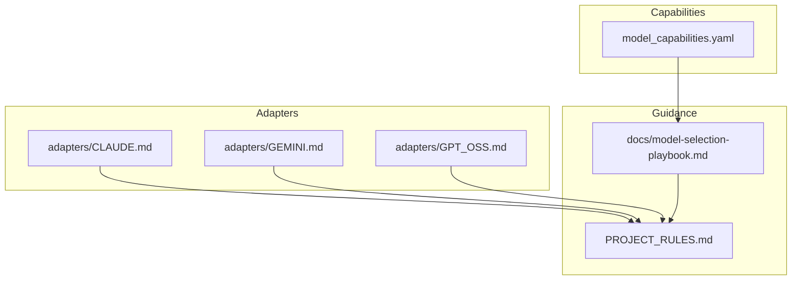
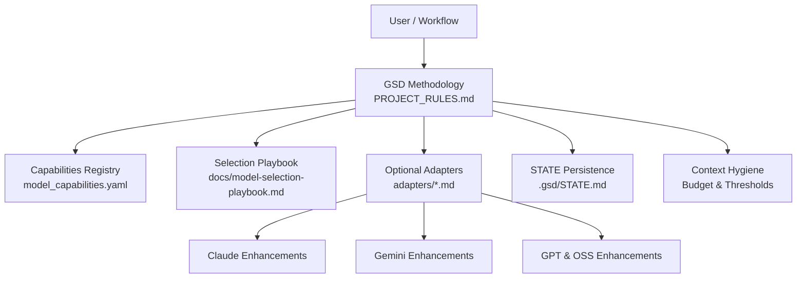
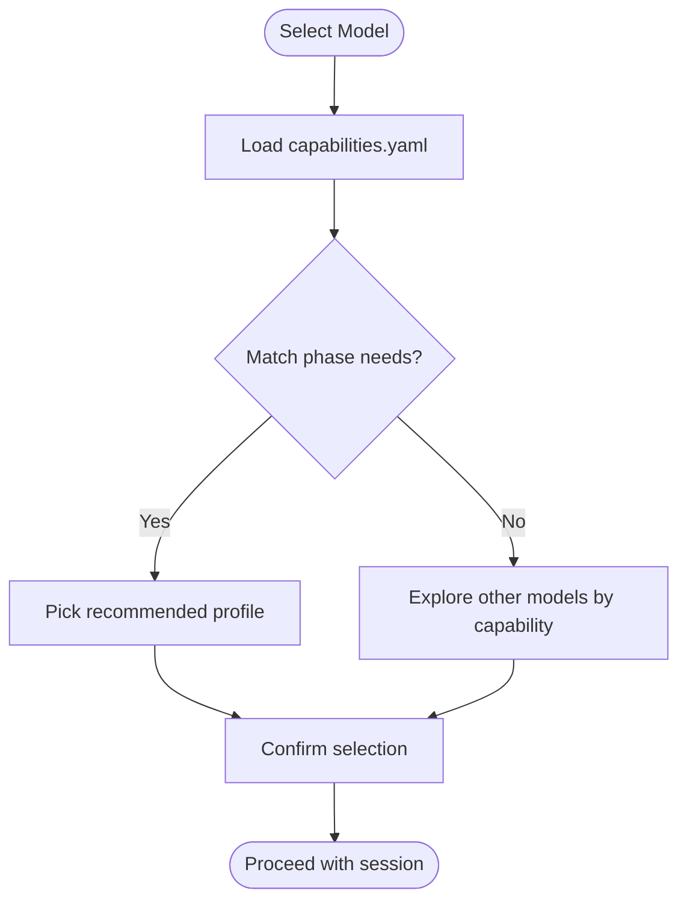
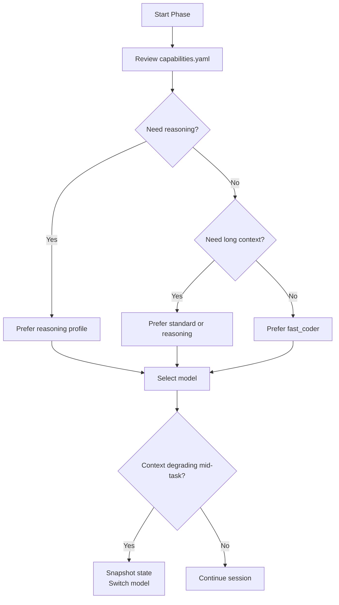
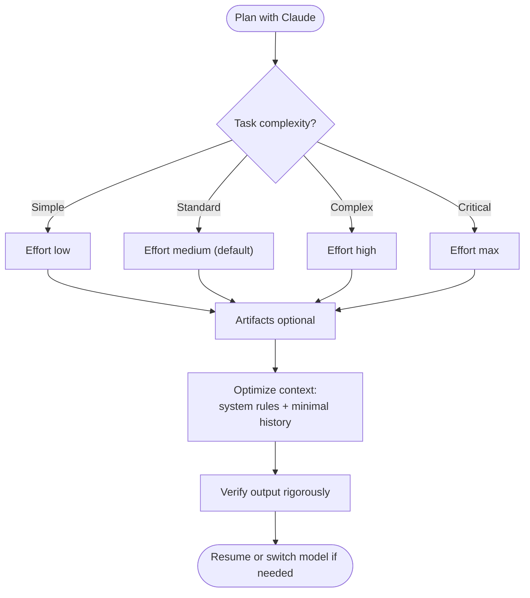
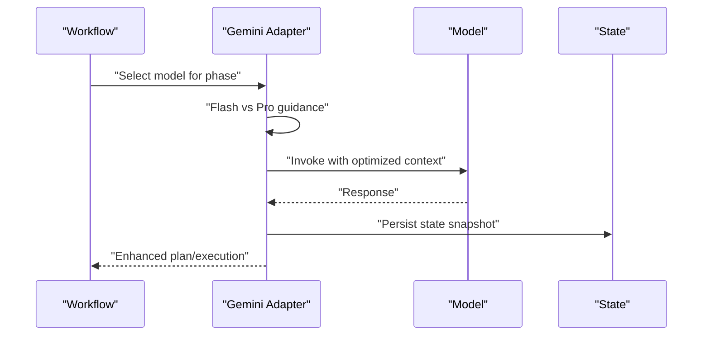
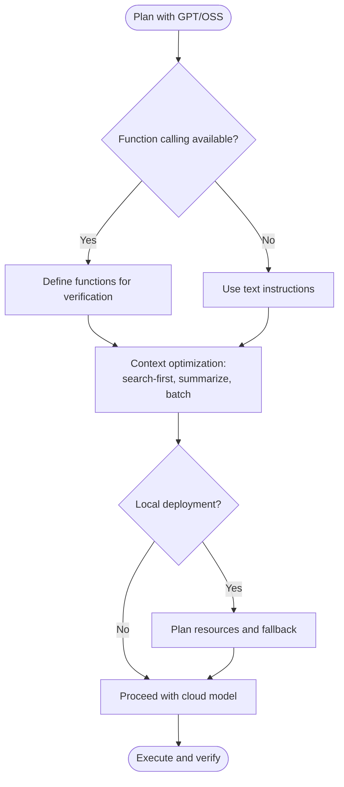
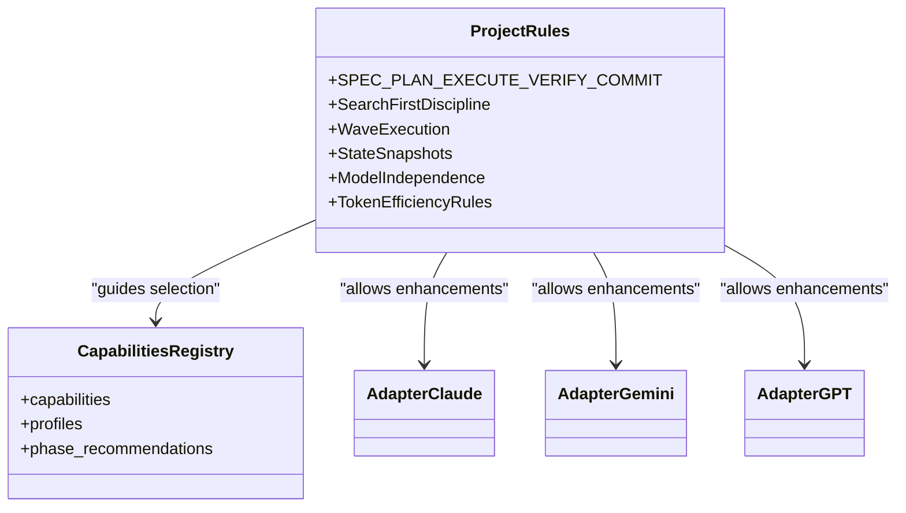
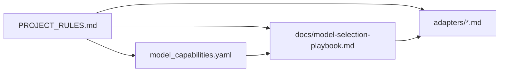

# Model Integration & Configuration

<cite>
**Referenced Files in This Document**
- [model_capabilities.yaml](file://model_capabilities.yaml)
- [model-selection-playbook.md](file://docs/model-selection-playbook.md)
- [PROJECT_RULES.md](file://PROJECT_RULES.md)
- [CLAUDE.md](file://adapters/CLAUDE.md)
- [GEMINI.md](file://adapters/GEMINI.md)
- [GPT_OSS.md](file://adapters/GPT_OSS.md)
- [package.json](file://package.json)
</cite>

## Table of Contents
1. [Introduction](#introduction)
2. [Project Structure](#project-structure)
3. [Core Components](#core-components)
4. [Architecture Overview](#architecture-overview)
5. [Detailed Component Analysis](#detailed-component-analysis)
6. [Dependency Analysis](#dependency-analysis)
7. [Performance Considerations](#performance-considerations)
8. [Troubleshooting Guide](#troubleshooting-guide)
9. [Conclusion](#conclusion)
10. [Appendices](#appendices)

## Introduction
This document explains how the Zeex AI website project integrates and configures AI models using an adapter-based, model-agnostic architecture. It covers:
- How optional adapters enhance base GSD workflows for Claude, Gemini, and GPT/Open-Source models
- The model capabilities registry and how it guides model selection by capability
- The model selection playbook and recommended usage across development phases
- Practical guidance for adding new adapters, configuring model-specific parameters, and handling provider-specific features
- Performance, cost, and reliability strategies, including fallbacks and stateful continuity

The project enforces a model-agnostic methodology so that workflows remain functional regardless of the specific provider or model selected.

## Project Structure
The model integration surface centers around three primary areas:
- Adapters: Provider-specific enhancement guides for Claude, Gemini, and GPT/Open-Source models
- Capabilities registry: A capability taxonomy and phase recommendations
- Operational playbooks: Guidance for selecting models by phase and capability tier

**Diagram sources**
- [CLAUDE.md](file://adapters/CLAUDE.md)
- [GEMINI.md](file://adapters/GEMINI.md)
- [GPT_OSS.md](file://adapters/GPT_OSS.md)
- [model_capabilities.yaml](file://model_capabilities.yaml)
- [model-selection-playbook.md](file://docs/model-selection-playbook.md)
- [PROJECT_RULES.md](file://PROJECT_RULES.md)

**Section sources**
- [PROJECT_RULES.md:106-130](file://PROJECT_RULES.md#L106-L130)
- [model_capabilities.yaml:1-109](file://model_capabilities.yaml#L1-L109)
- [model-selection-playbook.md:1-129](file://docs/model-selection-playbook.md#L1-L129)

## Core Components
- Model capabilities registry: Defines capability categories (e.g., thinking mode, long context, tools) and example profiles (fast coder, standard, reasoning) with phase recommendations.
- Adapter guides: Optional, provider-specific documents that describe how to leverage provider features (e.g., effort levels, artifacts, grounding, function calling) and avoid anti-patterns.
- Selection playbook: Provides capability tiers and phase-based recommendations for choosing models.
- Canonical rules: Enforce model-agnosticism, stateful continuity, and context hygiene.

Key outcomes:
- Workflows remain functional across providers
- Teams can select models by capability and phase
- Provider-specific enhancements are opt-in and documented

**Section sources**
- [model_capabilities.yaml:10-109](file://model_capabilities.yaml#L10-L109)
- [model-selection-playbook.md:76-123](file://docs/model-selection-playbook.md#L76-L123)
- [PROJECT_RULES.md:106-130](file://PROJECT_RULES.md#L106-L130)

## Architecture Overview
The system follows a model-agnostic architecture:
- Base GSD methodology runs independently of provider
- Optional adapters encapsulate provider-specific features
- Capabilities registry and playbook guide selection
- State persistence and context hygiene keep sessions reliable

**Diagram sources**
- [PROJECT_RULES.md](file://PROJECT_RULES.md)
- [model_capabilities.yaml](file://model_capabilities.yaml)
- [model-selection-playbook.md](file://docs/model-selection-playbook.md)
- [CLAUDE.md](file://adapters/CLAUDE.md)
- [GEMINI.md](file://adapters/GEMINI.md)
- [GPT_OSS.md](file://adapters/GPT_OSS.md)

## Detailed Component Analysis

### Model Capabilities Registry
The capabilities registry defines:
- Capability categories: thinking_mode, long_context, tools, speed_tier
- Example profiles: fast_coder, standard, reasoning
- Phase recommendations: mapping preferred profiles to planning, implementation, refactoring, debugging, and review

Usage guidance:
- Use the registry to compare models by capability
- Treat recommendations as guidance; do not hard-depend on presence of the file
- Align profile choices with phase needs described in the playbook

**Diagram sources**
- [model_capabilities.yaml:42-106](file://model_capabilities.yaml#L42-L106)

**Section sources**
- [model_capabilities.yaml:10-109](file://model_capabilities.yaml#L10-L109)

### Model Selection Playbook
The playbook organizes guidance by:
- Phase recommendations: preferred profiles and rationale
- Capability tiers: fast, standard, reasoning, long-context
- Anti-patterns: pitfalls to avoid when selecting models
- Mid-session switching: when and how to pivot models safely

Practical notes:
- Use capability tiers to quickly narrow choices
- Switch models when context becomes polluted or task type changes
- Maintain state continuity via persistent state artifacts

**Diagram sources**
- [model-selection-playbook.md:86-111](file://docs/model-selection-playbook.md#L86-L111)
- [model_capabilities.yaml:86-106](file://model_capabilities.yaml#L86-L106)

**Section sources**
- [model-selection-playbook.md:9-123](file://docs/model-selection-playbook.md#L9-L123)

### Claude Adapter
Highlights:
- Extended thinking mode: Use effort/budget levels (low, medium, high, max) aligned to task complexity
- Artifacts mode: Prefer for previews and formatted documentation; avoid for small inline edits
- Context optimization: Load core rules in system prompt, task details in user message; minimize conversation history; rely on persistent state for continuity
- Anti-patterns: Avoid max effort everywhere, skipping verification, and depending on artifacts universally

Operational tips:
- Default to medium effort when unspecified
- Use XML formatting for structured tasks
- Keep history minimal; persist state externally

**Diagram sources**
- [CLAUDE.md:10-54](file://adapters/CLAUDE.md#L10-L54)

**Section sources**
- [CLAUDE.md:1-78](file://adapters/CLAUDE.md#L1-L78)

### Gemini Adapter
Highlights:
- Model selection: Start with Pro for planning; switch to Flash for implementation
- Context window optimization: Strategic full-file loads, batch related files, and clear separation via XML tags
- Grounding: Use for verifying external documentation and service states
- Code execution: When sandbox is available, use for verification and testing; document outputs
- Anti-patterns: Avoid loading entire codebases, ignoring thresholds, and skipping state persistence

**Diagram sources**
- [GEMINI.md:10-89](file://adapters/GEMINI.md#L10-L89)

**Section sources**
- [GEMINI.md:1-93](file://adapters/GEMINI.md#L1-L93)

### GPT & Open Source Models Adapter
Highlights:
- Model selection: GPT-4o for balance, GPT-4 Turbo for reasoning/context, GPT-3.5 for fast iteration
- Function calling: Use structured function definitions for verification commands and external checks
- Context optimization: Be selective, search-first, summarize large files
- Open source guidance: Consider context length, instruction-following, code quality, and speed; plan resources for local deployments
- Shorter context strategies: Aggressive search-first, incremental loading, frequent state snapshots, split large tasks
- Anti-patterns: Do not assume GPT-4 context, avoid complex nested prompts, and ignore model limits

**Diagram sources**
- [GPT_OSS.md:22-115](file://adapters/GPT_OSS.md#L22-L115)

**Section sources**
- [GPT_OSS.md:1-131](file://adapters/GPT_OSS.md#L1-L131)

### Canonical Rules and Model-Agnosticism
Canonical rules enforce:
- Model independence: No workflow may require a specific provider
- Adapter pattern: Optional enhancements only
- State snapshots and context hygiene: Maintain reliability across sessions and provider switches
- Commit conventions and verification requirements: Ensure reproducible, evidence-backed changes

**Diagram sources**
- [PROJECT_RULES.md](file://PROJECT_RULES.md)
- [model_capabilities.yaml](file://model_capabilities.yaml)
- [CLAUDE.md](file://adapters/CLAUDE.md)
- [GEMINI.md](file://adapters/GEMINI.md)
- [GPT_OSS.md](file://adapters/GPT_OSS.md)

**Section sources**
- [PROJECT_RULES.md:106-243](file://PROJECT_RULES.md#L106-L243)

## Dependency Analysis
The model integration relies on:
- Optional adapters that augment base GSD behavior without enforcing provider-specific constraints
- Capabilities registry and playbook that inform selection decisions
- Canonical rules that govern methodology and state management

**Diagram sources**
- [PROJECT_RULES.md](file://PROJECT_RULES.md)
- [model_capabilities.yaml](file://model_capabilities.yaml)
- [model-selection-playbook.md](file://docs/model-selection-playbook.md)
- [CLAUDE.md](file://adapters/CLAUDE.md)
- [GEMINI.md](file://adapters/GEMINI.md)
- [GPT_OSS.md](file://adapters/GPT_OSS.md)

**Section sources**
- [PROJECT_RULES.md:106-130](file://PROJECT_RULES.md#L106-L130)
- [model_selection_playbook.md](file://docs/model-selection-playbook.md)
- [model_capabilities.yaml](file://model_capabilities.yaml)

## Performance Considerations
- Context hygiene: Keep plans under 50% usage; fresh context per plan; compress/summarize after understanding
- Budget thresholds: Switch to outline mode at 50–70%, state dump at 70%+
- Token efficiency: Search-first discipline, outline mode for large files, minimal file loads
- Latency-aware selection: Prefer fast tier for iteration, reasoning tier for deep analysis
- Cost optimization: Use smaller models for simple edits; reserve larger models for complex tasks; monitor token usage

Best practices:
- Persist state regularly to enable safe model switching
- Avoid loading entire codebases even with large context windows
- Use structured prompts and function calling to reduce retries

**Section sources**
- [PROJECT_RULES.md:184-243](file://PROJECT_RULES.md#L184-L243)
- [model-selection-playbook.md](file://docs/model-selection-playbook.md)
- [GEMINI.md](file://adapters/GEMINI.md)
- [GPT_OSS.md](file://adapters/GPT_OSS.md)

## Troubleshooting Guide
Common issues and resolutions:
- Model unavailable or rate-limited
  - Switch to an alternate provider or model tier
  - Snapshot state and start a fresh session with a different model
- Context pollution
  - Compress context, summarize, and snapshot state
  - Restart with minimal context for the next wave
- Provider-specific feature not available
  - Fall back to text-based instructions or function calling
  - Use canonical rules to maintain workflow integrity
- Misaligned capabilities
  - Re-evaluate selection against the capabilities registry and playbook
  - Adjust task complexity or break into smaller waves

Anti-patterns to avoid:
- Forcing a specific model regardless of task fit
- Ignoring context thresholds and quality degradation
- Skipping verification despite “thinking” features

**Section sources**
- [PROJECT_RULES.md:106-130](file://PROJECT_RULES.md#L106-L130)
- [model-selection-playbook.md:87-111](file://docs/model-selection-playbook.md#L87-L111)
- [CLAUDE.md](file://adapters/CLAUDE.md)
- [GEMINI.md](file://adapters/GEMINI.md)
- [GPT_OSS.md](file://adapters/GPT_OSS.md)

## Conclusion
The Zeex AI website employs a robust, model-agnostic architecture that:
- Enables seamless integration with multiple providers through optional adapters
- Guides selection via a capabilities registry and phase-based playbook
- Maintains reliability with state persistence and strict context hygiene
- Optimizes performance and cost through capability-aware choices and budget controls

By adhering to canonical rules and leveraging provider-specific enhancements, teams can maintain productivity across diverse AI ecosystems while preserving workflow integrity.

## Appendices

### A. Adding a New Model Adapter
Steps:
- Create a new adapter document under adapters/ with a descriptive filename
- Begin with the canonical notice and reference PROJECT_RULES.md
- Document provider-specific features, effort/budget levels, and anti-patterns
- Provide examples of structured prompts and context optimization patterns
- Link to any provider-specific configuration directories if applicable

Reference:
- Adapter pattern and canonical notice requirements

**Section sources**
- [PROJECT_RULES.md:120-130](file://PROJECT_RULES.md#L120-L130)

### B. Configuration Management and Authentication
- Environment variables: Store provider keys and endpoints in environment variables managed by your runtime
- Adapter-specific directories: Use provider-specific folders (e.g., .gemini/, .openai/, .ollama/) to organize settings
- Secrets handling: Never commit secrets; use secure secret stores or CI/CD variable management
- Validation: Verify credentials and permissions before invoking model APIs

Note: The repository’s package configuration focuses on frontend dependencies; provider configuration is handled outside the Next.js app code per adapter guidance.

**Section sources**
- [package.json:1-31](file://package.json#L1-L31)
- [GEMINI.md](file://adapters/GEMINI.md)
- [GPT_OSS.md](file://adapters/GPT_OSS.md)

### C. Model Capability Checking and Selection
- Capability matrix: Use the capabilities registry to map model features to task needs
- Phase alignment: Apply playbook recommendations to choose the right profile for each phase
- Fallback strategy: If preferred model lacks a capability, select an alternate model or adjust task scope

**Section sources**
- [model_capabilities.yaml:10-109](file://model_capabilities.yaml#L10-109)
- [model-selection-playbook.md:76-123](file://docs/model-selection-playbook.md#L76-123)