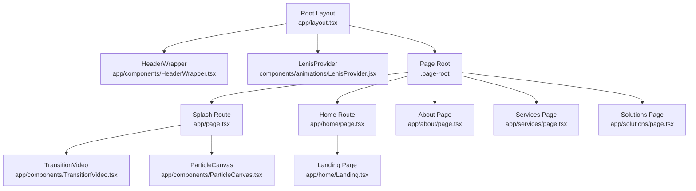
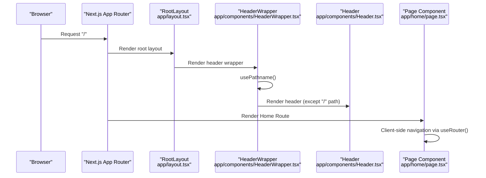
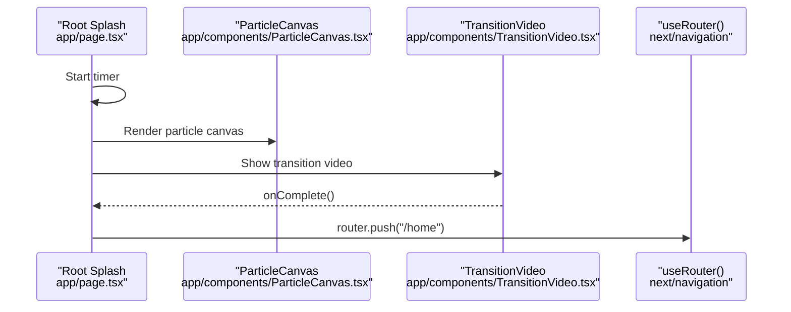
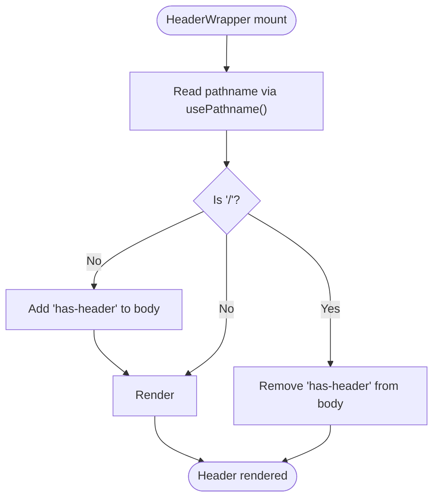
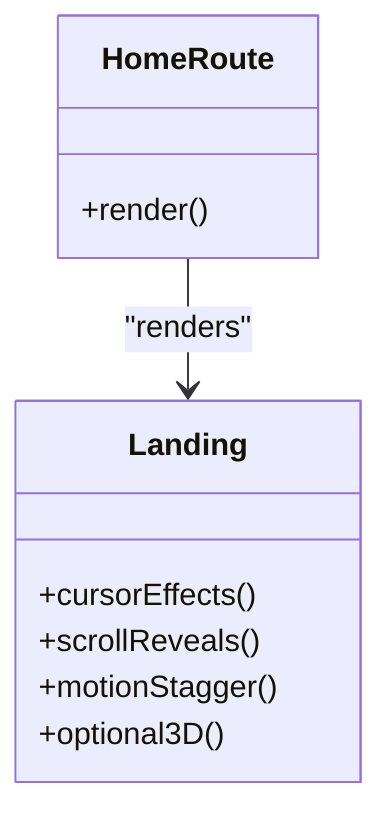
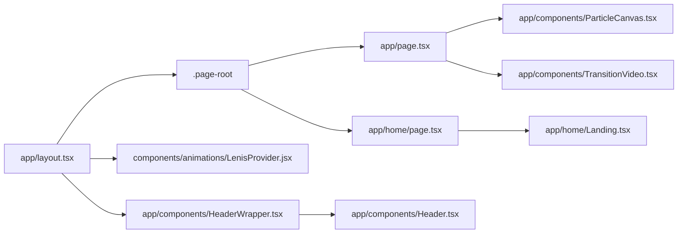

# Navigation & Routing

<cite>
**Referenced Files in This Document**
- [layout.tsx](file://app/layout.tsx)
- [page.tsx](file://app/page.tsx)
- [HeaderWrapper.tsx](file://app/components/HeaderWrapper.tsx)
- [Header.tsx](file://app/components/Header.tsx)
- [LenisProvider.jsx](file://components/animations/LenisProvider.jsx)
- [TransitionVideo.tsx](file://app/components/TransitionVideo.tsx)
- [ParticleCanvas.tsx](file://app/components/ParticleCanvas.tsx)
- [Landing.tsx](file://app/home/Landing.tsx)
- [Home Route page.tsx](file://app/home/page.tsx)
- [Services Page page.tsx](file://app/services/page.tsx)
- [About Page page.tsx](file://app/about/page.tsx)
- [Solutions Page page.tsx](file://app/solutions/page.tsx)
- [globals.css](file://app/globals.css)
</cite>

## Table of Contents
1. [Introduction](#introduction)
2. [Project Structure](#project-structure)
3. [Core Components](#core-components)
4. [Architecture Overview](#architecture-overview)
5. [Detailed Component Analysis](#detailed-component-analysis)
6. [Dependency Analysis](#dependency-analysis)
7. [Performance Considerations](#performance-considerations)
8. [Troubleshooting Guide](#troubleshooting-guide)
9. [Conclusion](#conclusion)
10. [Appendices](#appendices)

## Introduction
This document explains the navigation and routing system of the Zeex AI website built with Next.js App Router. It covers how pages are organized under the app directory, how the dynamic header adapts to the current route, smooth page transitions, layout consistency, and the integration between navigation and the animation system. It also provides guidance for extending navigation, adding new pages, and implementing advanced features such as breadcrumbs, SEO metadata, and progressive enhancement tailored for an immersive surveillance platform showcase.

## Project Structure
The site uses Next.js App Router with a conventional app directory layout:
- app/: Contains routes, layouts, and page components
- app/components/: Shared UI components (navigation, animations)
- app/home/, app/about/, app/services/, app/solutions/, app/contact/, app/careers/, app/blogs/, app/achievements/: Feature pages
- app/layout.tsx and app/page.tsx: Root layout and initial splash page
- components/animations/: Client-side animation providers
- app/globals.css: Global styles and theme

**Diagram sources**
- [layout.tsx:13-23](file://app/layout.tsx#L13-L23)
- [HeaderWrapper.tsx:7-24](file://app/components/HeaderWrapper.tsx#L7-L24)
- [LenisProvider.jsx:5-51](file://components/animations/LenisProvider.jsx#L5-L51)
- [page.tsx:9-54](file://app/page.tsx#L9-L54)
- [TransitionVideo.tsx:10-52](file://app/components/TransitionVideo.tsx#L10-L52)
- [ParticleCanvas.tsx:5-70](file://app/components/ParticleCanvas.tsx#L5-L70)
- [Home Route page.tsx:7-13](file://app/home/page.tsx#L7-L13)
- [Landing.tsx:60-800](file://app/home/Landing.tsx#L60-L800)
- [About Page page.tsx:10-298](file://app/about/page.tsx#L10-L298)
- [Services Page page.tsx:7-379](file://app/services/page.tsx#L7-L379)
- [Solutions Page page.tsx:7-494](file://app/solutions/page.tsx#L7-L494)

**Section sources**
- [layout.tsx:1-24](file://app/layout.tsx#L1-L24)
- [page.tsx:1-55](file://app/page.tsx#L1-L55)

## Core Components
- Root layout injects global styles, the Lenis smooth scrolling provider, and the dynamic header wrapper. It also defines the root metadata.
- The splash route orchestrates a particle canvas and a transition video before navigating to the home route.
- The header wrapper conditionally renders the header based on the current path and toggles a body class for layout spacing.
- The header provides primary navigation links and a services dropdown with deep links to specialized services.
- Smooth transitions and animations are powered by Lenis and Framer Motion, integrated into the landing page and other interactive pages.

**Section sources**
- [layout.tsx:8-23](file://app/layout.tsx#L8-L23)
- [page.tsx:9-54](file://app/page.tsx#L9-L54)
- [HeaderWrapper.tsx:7-24](file://app/components/HeaderWrapper.tsx#L7-L24)
- [Header.tsx:10-82](file://app/components/Header.tsx#L10-L82)
- [LenisProvider.jsx:5-51](file://components/animations/LenisProvider.jsx#L5-L51)
- [Landing.tsx:60-800](file://app/home/Landing.tsx#L60-L800)

## Architecture Overview
The navigation and routing architecture centers on:
- Next.js App Router routes under app/
- Dynamic header controlled by path awareness
- Client-side navigation via Next’s router hooks
- Smooth scroll and motion orchestration via Lenis and Framer Motion
- Consistent layout and styling via global CSS

**Diagram sources**
- [layout.tsx:13-23](file://app/layout.tsx#L13-L23)
- [HeaderWrapper.tsx:7-24](file://app/components/HeaderWrapper.tsx#L7-L24)
- [Header.tsx:10-82](file://app/components/Header.tsx#L10-L82)
- [Home Route page.tsx:7-13](file://app/home/page.tsx#L7-L13)

## Detailed Component Analysis

### Root Layout and Metadata
- Defines global metadata for the site.
- Wraps children with LenisProvider for smooth scrolling and HeaderWrapper for navigation.
- Provides a page-root container for page content.

**Section sources**
- [layout.tsx:8-23](file://app/layout.tsx#L8-L23)

### Splash and Transition System
- The root page component manages a splash experience with a particle canvas and HUD elements.
- After a timer, it triggers a transition video and navigates to the home route using Next’s router.

**Diagram sources**
- [page.tsx:9-54](file://app/page.tsx#L9-L54)
- [TransitionVideo.tsx:10-52](file://app/components/TransitionVideo.tsx#L10-L52)
- [ParticleCanvas.tsx:5-70](file://app/components/ParticleCanvas.tsx#L5-L70)

**Section sources**
- [page.tsx:9-54](file://app/page.tsx#L9-L54)
- [TransitionVideo.tsx:10-52](file://app/components/TransitionVideo.tsx#L10-L52)
- [ParticleCanvas.tsx:5-70](file://app/components/ParticleCanvas.tsx#L5-L70)

### Dynamic Header Management
- HeaderWrapper reads the current path and conditionally renders the header.
- It toggles a body class to adjust layout spacing when the header is visible.
- The header provides navigation links and a services dropdown.

**Diagram sources**
- [HeaderWrapper.tsx:7-24](file://app/components/HeaderWrapper.tsx#L7-L24)
- [Header.tsx:10-82](file://app/components/Header.tsx#L10-L82)

**Section sources**
- [HeaderWrapper.tsx:7-24](file://app/components/HeaderWrapper.tsx#L7-L24)
- [Header.tsx:10-82](file://app/components/Header.tsx#L10-L82)
- [globals.css:33-36](file://app/globals.css#L33-L36)

### Smooth Scrolling and Animation Provider
- LenisProvider initializes Lenis smooth scrolling and integrates with GSAP ScrollTrigger for scroll-driven animations.
- It cleans up on unmount to avoid memory leaks.

**Section sources**
- [LenisProvider.jsx:5-51](file://components/animations/LenisProvider.jsx#L5-L51)

### Home Route and Landing Page
- The Home Route page renders the Landing component.
- The Landing component orchestrates:
  - Cursor effects and magnetic glow
  - Scroll-driven data streams and skew effects
  - Intersection observers for reveal animations
  - Framer Motion staggered reveals
  - Optional 3D scene fallbacks

**Diagram sources**
- [Home Route page.tsx:7-13](file://app/home/page.tsx#L7-L13)
- [Landing.tsx:60-800](file://app/home/Landing.tsx#L60-L800)

**Section sources**
- [Home Route page.tsx:7-13](file://app/home/page.tsx#L7-L13)
- [Landing.tsx:60-800](file://app/home/Landing.tsx#L60-L800)

### Services and Solutions Pages
- Services page organizes content into overview and detailed sections with a use-case modal.
- Solutions page provides a similar structure with statistics and feature cards.

**Section sources**
- [Services Page page.tsx:7-379](file://app/services/page.tsx#L7-L379)
- [Solutions Page page.tsx:7-494](file://app/solutions/page.tsx#L7-L494)

### About Page
- Implements parallax layers, animated counters, and interactive team cards.
- Uses a navigation callback to coordinate with the header wrapper.

**Section sources**
- [About Page page.tsx:10-298](file://app/about/page.tsx#L10-L298)

## Dependency Analysis
- Root layout depends on:
  - HeaderWrapper for navigation
  - LenisProvider for smooth scrolling
  - Global CSS for consistent styling
- HeaderWrapper depends on:
  - usePathname for route-aware rendering
  - Header for navigation UI
- Home route depends on:
  - Landing for immersive content
  - LenisProvider for scroll behavior
- Splash depends on:
  - ParticleCanvas for visuals
  - TransitionVideo for seamless handoff

**Diagram sources**
- [layout.tsx:13-23](file://app/layout.tsx#L13-L23)
- [HeaderWrapper.tsx:7-24](file://app/components/HeaderWrapper.tsx#L7-L24)
- [Header.tsx:10-82](file://app/components/Header.tsx#L10-L82)
- [page.tsx:9-54](file://app/page.tsx#L9-L54)
- [ParticleCanvas.tsx:5-70](file://app/components/ParticleCanvas.tsx#L5-L70)
- [TransitionVideo.tsx:10-52](file://app/components/TransitionVideo.tsx#L10-L52)
- [Home Route page.tsx:7-13](file://app/home/page.tsx#L7-L13)
- [Landing.tsx:60-800](file://app/home/Landing.tsx#L60-L800)

**Section sources**
- [layout.tsx:13-23](file://app/layout.tsx#L13-L23)
- [HeaderWrapper.tsx:7-24](file://app/components/HeaderWrapper.tsx#L7-L24)
- [Header.tsx:10-82](file://app/components/Header.tsx#L10-L82)
- [page.tsx:9-54](file://app/page.tsx#L9-L54)
- [Home Route page.tsx:7-13](file://app/home/page.tsx#L7-L13)

## Performance Considerations
- Client-side-only providers (LenisProvider, HeaderWrapper) are dynamically imported to avoid SSR overhead.
- Intersection Observers and requestAnimationFrame are used to minimize layout thrash and maintain smooth animations.
- Conditional header rendering avoids unnecessary DOM nodes on the splash page.
- Lazy loading of 3D components ensures robust fallbacks when heavy libraries are unavailable.

[No sources needed since this section provides general guidance]

## Troubleshooting Guide
- Header not appearing on splash:
  - Verify the splash route path is "/" and that HeaderWrapper hides the header on this path.
  - Confirm the body class toggle logic does not conflict with global styles.
- Smooth scrolling not working:
  - Ensure LenisProvider is rendered and initialized without errors.
  - Check that GSAP and ScrollTrigger are available or gracefully handled.
- Transition video not playing:
  - Confirm autoplay policies and user interaction requirements.
  - Ensure the video element is present and events are attached.
- Navigation callback not triggering:
  - Verify the onNavigate prop is passed from the header to the page component.
  - Confirm the callback is invoked on header actions.

**Section sources**
- [HeaderWrapper.tsx:7-24](file://app/components/HeaderWrapper.tsx#L7-L24)
- [LenisProvider.jsx:5-51](file://components/animations/LenisProvider.jsx#L5-L51)
- [TransitionVideo.tsx:10-52](file://app/components/TransitionVideo.tsx#L10-L52)
- [Header.tsx:10-82](file://app/components/Header.tsx#L10-L82)

## Conclusion
The navigation and routing system leverages Next.js App Router to deliver a cohesive, immersive experience. The dynamic header adapts to the current route, smooth scrolling enhances user flow, and the layout remains consistent across pages. The integration of Lenis and Framer Motion creates a polished, performance-conscious interface suitable for showcasing advanced surveillance solutions.

[No sources needed since this section summarizes without analyzing specific files]

## Appendices

### Adding New Pages
- Create a new route under app/<new-page>/page.tsx.
- Add a navigation link in the header or a relevant page.
- If the new page requires animations, wrap it with the LenisProvider via the root layout or locally.
- For immersive content, consider integrating with the Landing component patterns.

**Section sources**
- [layout.tsx:13-23](file://app/layout.tsx#L13-L23)
- [Header.tsx:10-82](file://app/components/Header.tsx#L10-L82)

### Customizing Navigation Behavior
- Extend the header dropdown or add new menu items in Header.tsx.
- Use the onNavigate callback to coordinate cross-component actions.
- For route-specific headers, adjust HeaderWrapper logic to show/hide based on conditions.

**Section sources**
- [Header.tsx:10-82](file://app/components/Header.tsx#L10-L82)
- [HeaderWrapper.tsx:7-24](file://app/components/HeaderWrapper.tsx#L7-L24)

### Implementing Breadcrumbs
- Use the current pathname to derive breadcrumb segments.
- Render a breadcrumb bar on pages that benefit from hierarchical navigation.
- Keep breadcrumb labels concise and aligned with route structure.

[No sources needed since this section provides general guidance]

### SEO and Meta Tags
- Define metadata in the root layout for the site-wide title and description.
- For page-specific SEO, add metadata to individual pages using Next’s metadata APIs.
- Ensure canonical URLs and structured data are included where applicable.

**Section sources**
- [layout.tsx:8-11](file://app/layout.tsx#L8-L11)

### Progressive Enhancement Strategies
- Gracefully degrade animations when libraries are unavailable.
- Provide fallbacks for 3D scenes and heavy libraries.
- Ensure core navigation and content remain functional without JavaScript.

**Section sources**
- [LenisProvider.jsx:5-51](file://components/animations/LenisProvider.jsx#L5-L51)
- [Landing.tsx:48-58](file://app/home/Landing.tsx#L48-L58)