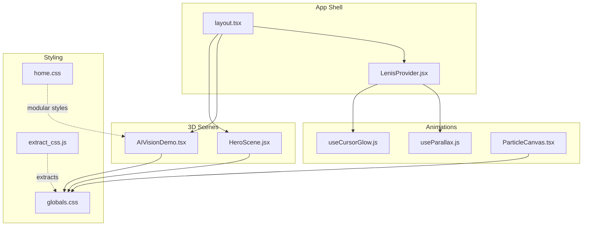
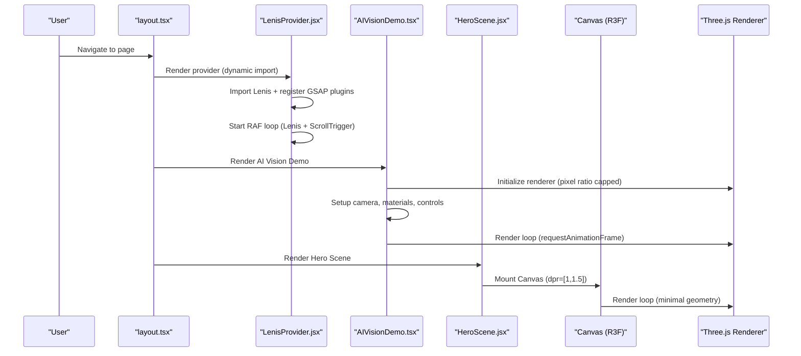
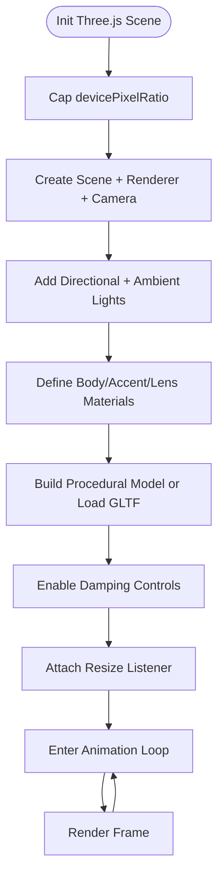
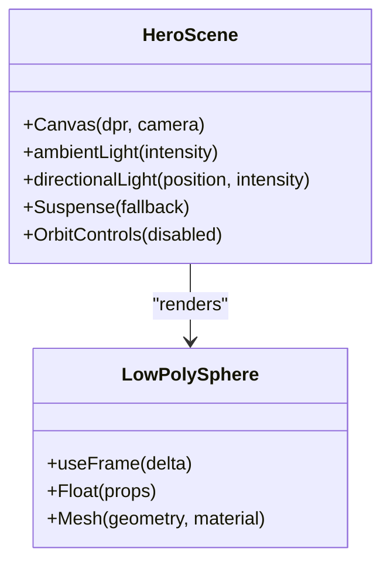
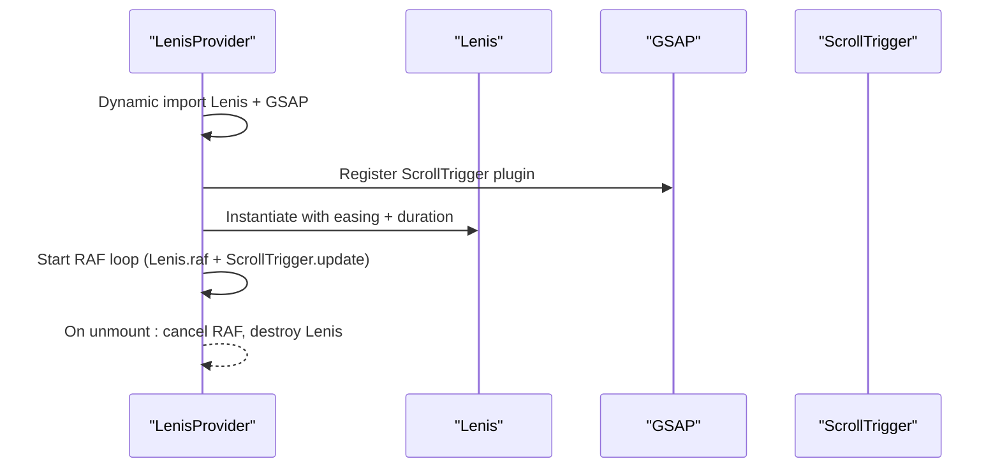
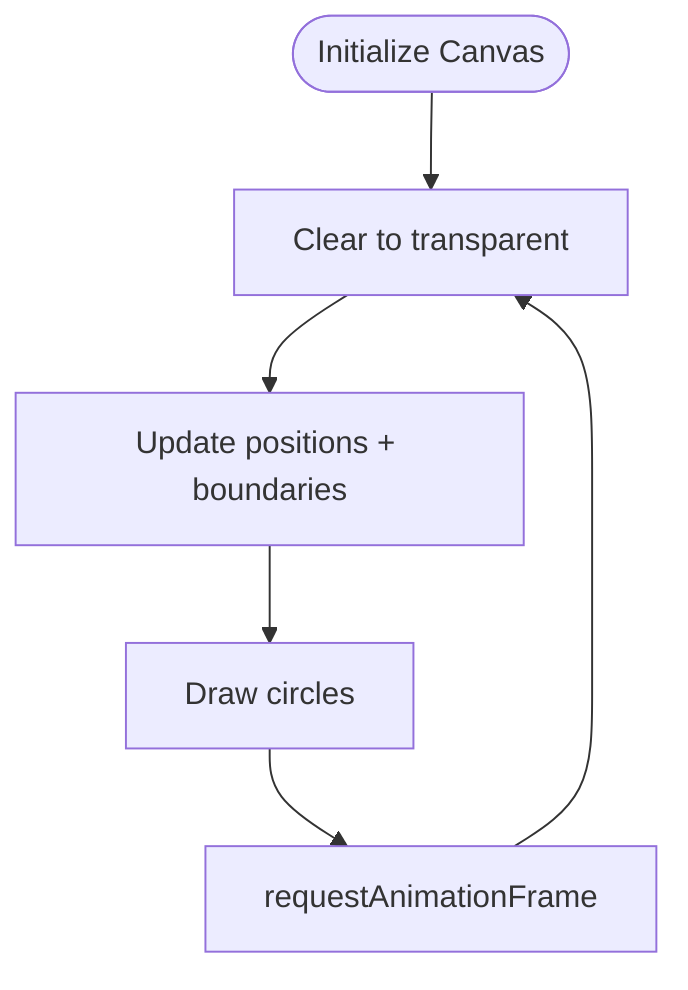
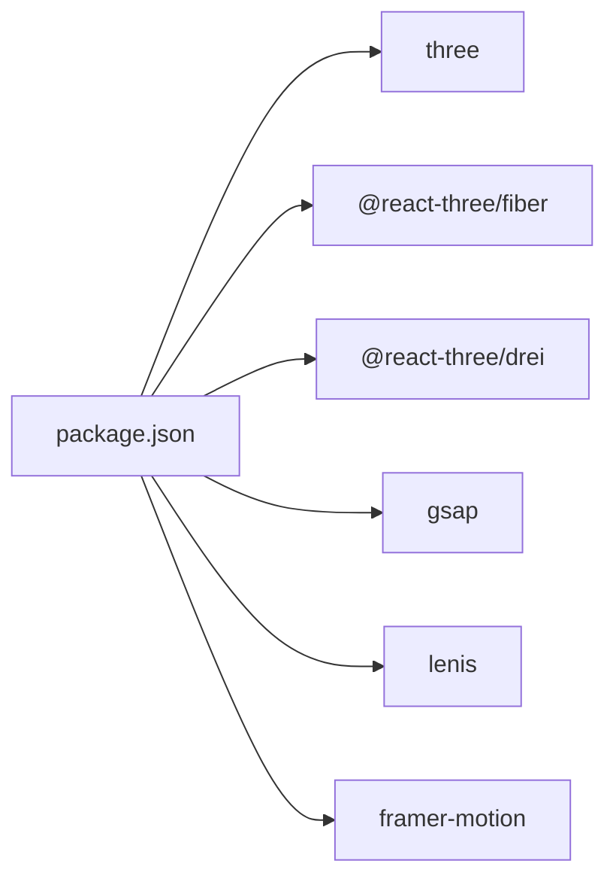

# Performance & Optimization

<cite>
**Referenced Files in This Document**
- [AIVisionDemo.tsx](file://app/home/AIVisionDemo.tsx)
- [HeroScene.jsx](file://components/3d/HeroScene.jsx)
- [LenisProvider.jsx](file://components/animations/LenisProvider.jsx)
- [layout.tsx](file://app/layout.tsx)
- [ParticleCanvas.tsx](file://app/components/ParticleCanvas.tsx)
- [useCursorGlow.js](file://components/animations/useCursorGlow.js)
- [useParallax.js](file://components/animations/useParallax.js)
- [globals.css](file://app/globals.css)
- [home.css](file://app/home/home.css)
- [extract_css.js](file://scripts/extract_css.js)
- [package.json](file://package.json)
</cite>

## Table of Contents
1. [Introduction](#introduction)
2. [Project Structure](#project-structure)
3. [Core Components](#core-components)
4. [Architecture Overview](#architecture-overview)
5. [Detailed Component Analysis](#detailed-component-analysis)
6. [Dependency Analysis](#dependency-analysis)
7. [Performance Considerations](#performance-considerations)
8. [Troubleshooting Guide](#troubleshooting-guide)
9. [Conclusion](#conclusion)
10. [Appendices](#appendices)

## Introduction
This document details the performance optimization strategies implemented in the Zeex AI website, focusing on 3D rendering, animation systems, CSS extraction, and runtime performance across devices and browsers. It explains how Three.js scenes are optimized, how particle systems and real-time video simulations are managed, and how smooth scrolling and animations are tuned for responsiveness. It also covers memory management, garbage collection considerations, and practical guidance for measuring and monitoring performance.

## Project Structure
The performance-critical parts of the application are organized into:
- 3D experiences: a Three.js demo scene and a lightweight React Three Fiber hero scene
- Smooth scrolling: a Lenis-based provider with GSAP integration
- Animations: cursor glow, parallax helpers, and CSS-driven effects
- Rendering pipeline: WebGL renderer with device pixel ratio clamping and controlled lighting
- CSS architecture: global styles and modularized sections for extraction and bundling

**Diagram sources**
- [layout.tsx:13-23](file://app/layout.tsx#L13-L23)
- [LenisProvider.jsx:5-51](file://components/animations/LenisProvider.jsx#L5-L51)
- [AIVisionDemo.tsx:11-213](file://app/home/AIVisionDemo.tsx#L11-L213)
- [HeroScene.jsx:23-36](file://components/3d/HeroScene.jsx#L23-L36)
- [useCursorGlow.js:1-26](file://components/animations/useCursorGlow.js#L1-L26)
- [useParallax.js:1-31](file://components/animations/useParallax.js#L1-L31)
- [ParticleCanvas.tsx:1-71](file://app/components/ParticleCanvas.tsx#L1-L71)
- [globals.css:1-2341](file://app/globals.css#L1-L2341)
- [home.css:1-1730](file://app/home/home.css#L1-L1730)
- [extract_css.js:1-34](file://scripts/extract_css.js#L1-L34)

**Section sources**
- [layout.tsx:13-23](file://app/layout.tsx#L13-L23)
- [package.json:11-30](file://package.json#L11-L30)

## Core Components
- Three.js AI Vision Demo: A self-contained scene with camera controls, materials, and a procedural model with GLTF fallback. Includes responsive resize, damping controls, and a simple animation loop.
- React Three Fiber Hero Scene: A minimal floating sphere with distortion material and orbit controls disabled for a static, low-cost hero.
- Lenis Smooth Scrolling Provider: Dynamically imported provider that integrates Lenis with GSAP and ScrollTrigger, running a single RAF loop.
- Particle Canvas: A lightweight canvas-based particle system with resize handling and per-frame clearing.
- Cursor Glow and Parallax Helpers: Lightweight hooks to add subtle visual enhancements without heavy computations.
- CSS Extraction Script: A utility to split global CSS into modular files based on class prefixes.

**Section sources**
- [AIVisionDemo.tsx:11-213](file://app/home/AIVisionDemo.tsx#L11-L213)
- [HeroScene.jsx:23-36](file://components/3d/HeroScene.jsx#L23-L36)
- [LenisProvider.jsx:5-51](file://components/animations/LenisProvider.jsx#L5-L51)
- [ParticleCanvas.tsx:1-71](file://app/components/ParticleCanvas.tsx#L1-L71)
- [useCursorGlow.js:1-26](file://components/animations/useCursorGlow.js#L1-L26)
- [useParallax.js:1-31](file://components/animations/useParallax.js#L1-L31)
- [extract_css.js:1-34](file://scripts/extract_css.js#L1-L34)

## Architecture Overview
The runtime performance architecture centers on:
- Controlled 3D rendering with device pixel ratio caps and minimal geometry
- Off-DOM animation orchestration via GSAP and requestAnimationFrame
- Modular CSS extraction to reduce initial payload and improve caching
- Dynamic imports for non-critical providers to defer work until needed

**Diagram sources**
- [layout.tsx:13-23](file://app/layout.tsx#L13-L23)
- [LenisProvider.jsx:12-42](file://components/animations/LenisProvider.jsx#L12-L42)
- [AIVisionDemo.tsx:38-177](file://app/home/AIVisionDemo.tsx#L38-L177)
- [HeroScene.jsx:26-32](file://components/3d/HeroScene.jsx#L26-L32)

## Detailed Component Analysis

### Three.js AI Vision Demo
Key performance strategies:
- Device pixel ratio cap: limits render resolution on high-DPR devices to prevent oversized canvases.
- Minimal geometry: procedural shapes and simple materials to reduce draw calls.
- Controlled animation loop: single requestAnimationFrame with damping for smooth, predictable updates.
- GLTF fallback: robust loading with error handling and removal of placeholder geometry upon success.
- Responsive resize: throttled to integer sizes and aspect updates to avoid layout thrashing.

**Diagram sources**
- [AIVisionDemo.tsx:38-177](file://app/home/AIVisionDemo.tsx#L38-L177)

**Section sources**
- [AIVisionDemo.tsx:38-177](file://app/home/AIVisionDemo.tsx#L38-L177)

### React Three Fiber Hero Scene
Key performance strategies:
- Low poly geometry and distortion material to minimize shading cost.
- Fixed dpr range to balance quality and performance.
- Disabled controls to avoid unnecessary updates.
- Suspense boundary to defer rendering until resources are ready.

**Diagram sources**
- [HeroScene.jsx:23-36](file://components/3d/HeroScene.jsx#L23-L36)

**Section sources**
- [HeroScene.jsx:23-36](file://components/3d/HeroScene.jsx#L23-L36)

### Lenis Smooth Scrolling Provider
Key performance strategies:
- Dynamic import of Lenis and GSAP to defer heavy modules until needed.
- Single RAF loop integrating Lenis and ScrollTrigger to avoid redundant frame callbacks.
- Cleanup on unmount to cancel animation frames and destroy instances.

**Diagram sources**
- [LenisProvider.jsx:12-48](file://components/animations/LenisProvider.jsx#L12-L48)

**Section sources**
- [LenisProvider.jsx:12-48](file://components/animations/LenisProvider.jsx#L12-L48)

### Particle Canvas
Key performance strategies:
- Transparent background clearing to avoid residual artifacts.
- Per-frame clearing with globalCompositeOperation set to source-over.
- Minimal particle state with simple bounce physics.
- Single RAF loop and cleanup on unmount.

**Diagram sources**
- [ParticleCanvas.tsx:12-67](file://app/components/ParticleCanvas.tsx#L12-L67)

**Section sources**
- [ParticleCanvas.tsx:12-67](file://app/components/ParticleCanvas.tsx#L12-L67)

### Cursor Glow and Parallax Helpers
- Cursor glow: lightweight DOM element with passive mousemove listener and removal on unmount.
- Parallax: GSAP ScrollTrigger-based with scrubbed tweens and kill on cleanup.

**Section sources**
- [useCursorGlow.js:1-26](file://components/animations/useCursorGlow.js#L1-L26)
- [useParallax.js:1-31](file://components/animations/useParallax.js#L1-L31)

### CSS Extraction and Modular Styles
- Global CSS is split into modular files based on class name prefixes.
- The script prepares extraction mappings and comments for future automation.

**Section sources**
- [extract_css.js:1-34](file://scripts/extract_css.js#L1-L34)
- [globals.css:1-2341](file://app/globals.css#L1-L2341)
- [home.css:1-1730](file://app/home/home.css#L1-L1730)

## Dependency Analysis
External libraries and their roles:
- Three.js and @react-three/*: 3D rendering and fiber bindings
- GSAP: animation orchestration and ScrollTrigger integration
- Lenis: smooth scroll engine synchronized with GSAP
- Framer Motion: motion primitives used in UI

**Diagram sources**
- [package.json:11-30](file://package.json#L11-L30)

**Section sources**
- [package.json:11-30](file://package.json#L11-L30)

## Performance Considerations

### 3D Rendering Optimizations
- Device pixel ratio capping: reduces render target size on high-DPR screens to maintain frame stability.
- Material and geometry simplicity: fewer polygons and physically plausible materials reduce shading overhead.
- Damping controls: smooth camera movement without constant recomputation.
- GLTF fallback: graceful degradation when assets fail to load.
- Responsive resize: avoids excessive layout recalculations by flooring sizes and updating aspect.

**Section sources**
- [AIVisionDemo.tsx:43-166](file://app/home/AIVisionDemo.tsx#L43-L166)

### Particle Systems
- Transparent clearing and minimal draw calls: clears efficiently and draws simple circles.
- Boundary checks with velocity reversals: simple physics to keep particles within bounds.
- Single RAF loop: centralized animation to avoid redundant timers.

**Section sources**
- [ParticleCanvas.tsx:40-67](file://app/components/ParticleCanvas.tsx#L40-L67)

### Real-Time Video Processing Simulations
- Video playback is muted during autoplay to avoid audio stalls and to ensure deterministic timing.
- Preload metadata to reduce startup latency.
- Playback reset on completion to recycle resources.

**Section sources**
- [AIVisionDemo.tsx:382-397](file://app/home/AIVisionDemo.tsx#L382-L397)

### Smooth Scrolling Animations
- Single RAF loop synchronizing Lenis and ScrollTrigger minimizes frame overhead.
- Passive event listeners for cursor glow reduce input handling costs.
- Scrubbed parallax tweens avoid frequent layout reads.

**Section sources**
- [LenisProvider.jsx:34-39](file://components/animations/LenisProvider.jsx#L34-L39)
- [useCursorGlow.js:17-24](file://components/animations/useCursorGlow.js#L17-L24)
- [useParallax.js:16-25](file://components/animations/useParallax.js#L16-L25)

### Memory Management and Garbage Collection
- Explicit cleanup in effect cleanup functions: removes event listeners, cancels animation frames, disposes Three.js resources.
- Dynamic imports defer heavy module loading until needed, reducing peak memory usage.
- Controlled DOM manipulation for particles and UI elements to limit DOM tree growth.

**Section sources**
- [AIVisionDemo.tsx:204-213](file://app/home/AIVisionDemo.tsx#L204-L213)
- [LenisProvider.jsx:44-48](file://components/animations/LenisProvider.jsx#L44-L48)
- [ParticleCanvas.tsx:63-67](file://app/components/ParticleCanvas.tsx#L63-L67)

### Maintaining Smooth Frame Rates Across Devices
- Clamp DPR to limit render size on high-resolution displays.
- Prefer lightweight materials and simple geometry in hero scenes.
- Use requestAnimationFrame consistently and avoid nested timers.
- Defer non-critical features (e.g., dynamic imports) to reduce initial workload.

**Section sources**
- [HeroScene.jsx:26-32](file://components/3d/HeroScene.jsx#L26-L32)
- [AIVisionDemo.tsx:44](file://app/home/AIVisionDemo.tsx#L44)

### CSS Extraction and Bundle Splitting
- Modular CSS extraction script organizes global styles into feature-specific files.
- This supports future bundling strategies to ship only relevant styles per route.

**Section sources**
- [extract_css.js:7-34](file://scripts/extract_css.js#L7-L34)

### Asset Compression Techniques
- Compress and optimize images and videos used in demos and backgrounds.
- Use modern codecs and appropriate resolutions for target devices.

[No sources needed since this section provides general guidance]

### Measuring Performance, Identifying Bottlenecks, and Monitoring
- Use browser DevTools Performance and Memory panels to profile 3D rendering and JS workloads.
- Monitor FPS and frame time using the built-in FPS meter or custom metrics.
- Track long tasks and layout thrashing caused by frequent DOM writes.
- Measure bundle sizes and split points to validate CSS extraction benefits.

[No sources needed since this section provides general guidance]

### Mobile Performance, Battery Usage, and Throttling
- Reduce DPR on mobile devices to lower GPU load.
- Limit particle counts and animation complexity on constrained devices.
- Use passive event listeners and throttle scroll handlers.
- Avoid synchronous layout reads in animation loops.

[No sources needed since this section provides general guidance]

### Balancing Visual Fidelity and Performance
- Use adaptive quality settings: lower geometry detail and shadow quality on demand.
- Apply graceful degradation: fallback to simpler visuals when resources are limited.
- Prefer CSS animations for lightweight effects; reserve JS-driven animations for essential interactions.

[No sources needed since this section provides general guidance]

## Troubleshooting Guide
Common issues and remedies:
- 3D scene not rendering: verify renderer initialization, DPR cap, and resize handler.
- Controls feel sluggish: ensure damping is enabled and animation loop is not blocked by heavy work.
- Particles flicker or leak: confirm transparent clearing and proper RAF cancellation.
- Scroll jank: check for redundant RAF loops and ensure passive listeners are used.
- Memory growth: confirm cleanup of event listeners, animation frames, and Three.js resources.

**Section sources**
- [AIVisionDemo.tsx:204-213](file://app/home/AIVisionDemo.tsx#L204-L213)
- [ParticleCanvas.tsx:63-67](file://app/components/ParticleCanvas.tsx#L63-L67)
- [LenisProvider.jsx:44-48](file://components/animations/LenisProvider.jsx#L44-L48)

## Conclusion
The Zeex AI website employs a pragmatic set of performance strategies: capped DPR, minimal 3D geometry, off-DOM animation orchestration, and modular CSS extraction. These choices collectively maintain smooth frame rates across devices, reduce memory pressure, and support scalable development. By continuing to monitor performance and iterating on quality settings, the site can deliver a visually rich experience without sacrificing responsiveness.

## Appendices

### Example Tools and Techniques
- Profiling: Chrome DevTools Performance panel, Memory panel, FPS meter
- Metrics: Frame time, long task duration, JS heap size
- Optimization: Reduce draw calls, simplify materials, defer non-critical code, leverage passive listeners

[No sources needed since this section provides general guidance]