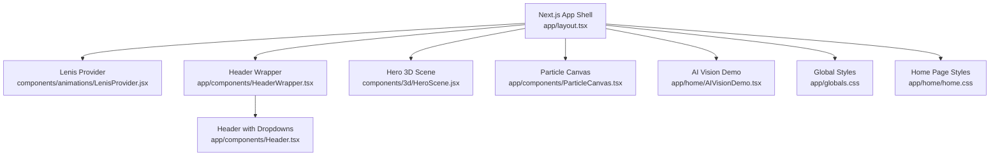
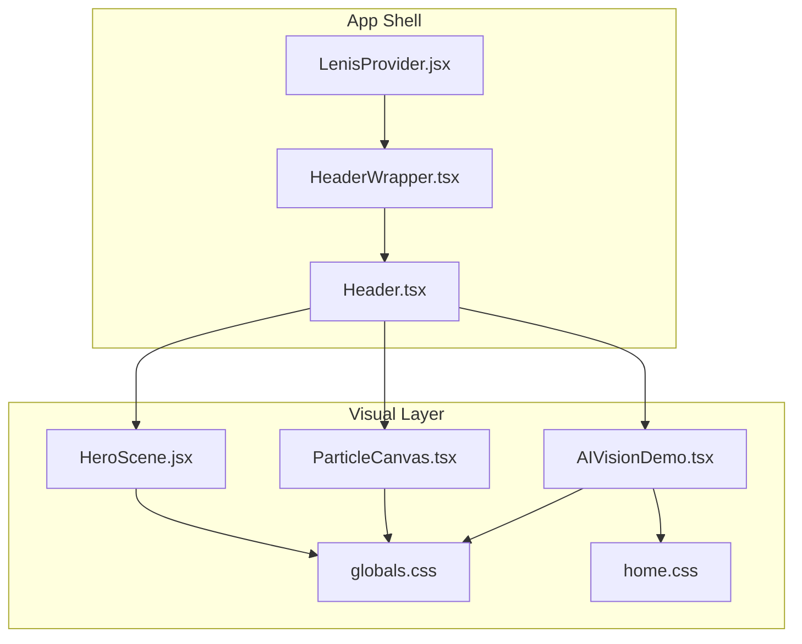
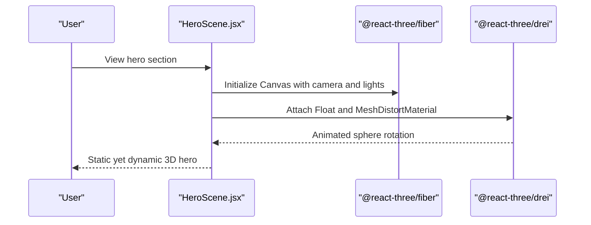
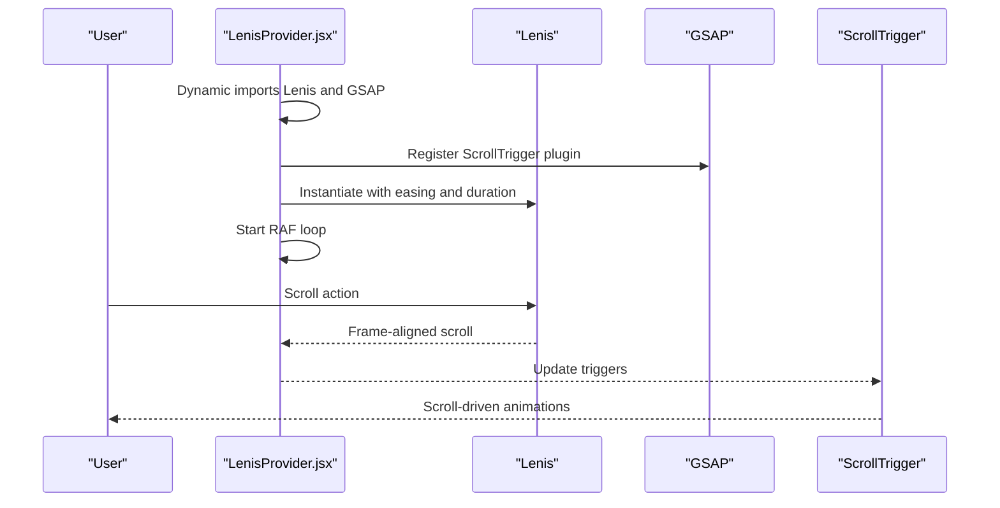
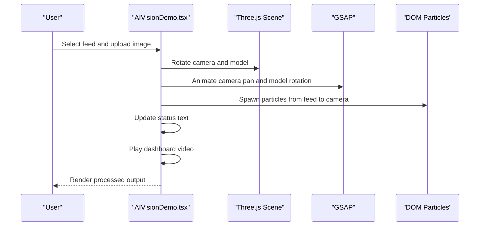
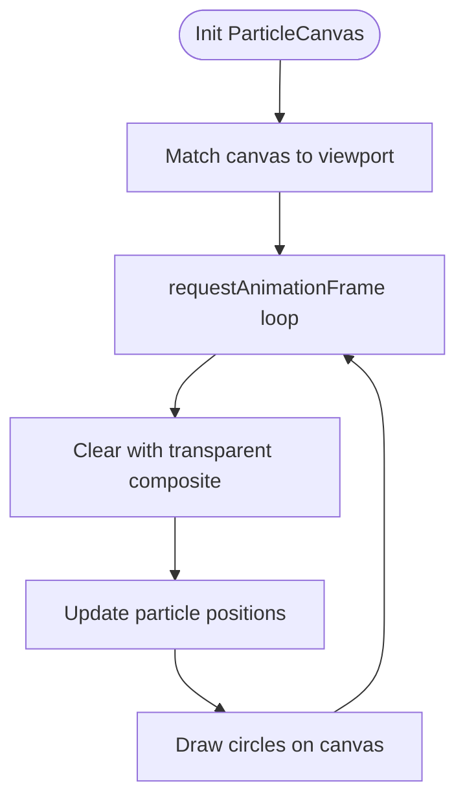
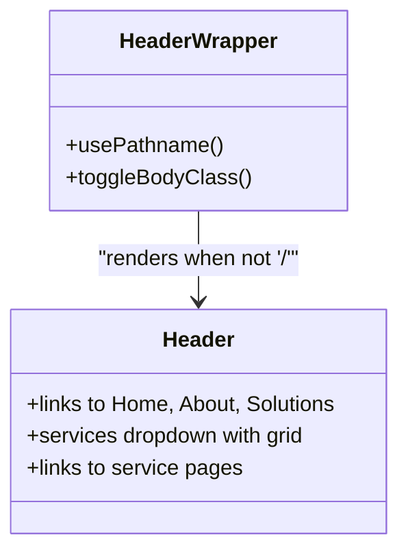
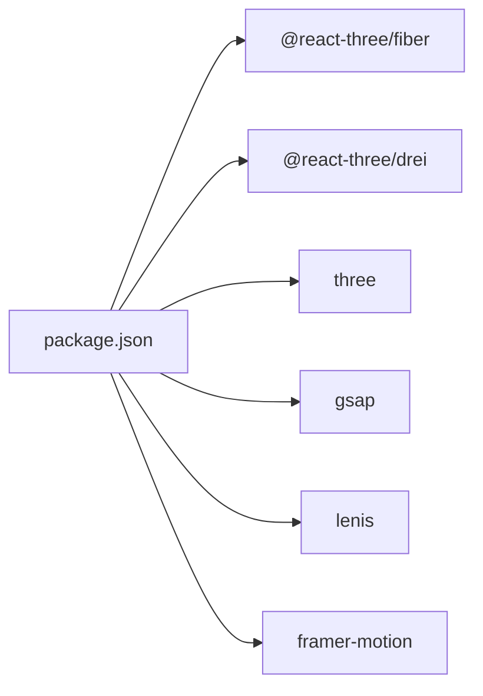

# Core Features & Capabilities

<cite>
**Referenced Files in This Document**
- [package.json](file://package.json)
- [layout.tsx](file://app/layout.tsx)
- [HeaderWrapper.tsx](file://app/components/HeaderWrapper.tsx)
- [Header.tsx](file://app/components/Header.tsx)
- [HeroScene.jsx](file://components/3d/HeroScene.jsx)
- [ParticleCanvas.tsx](file://app/components/ParticleCanvas.tsx)
- [LenisProvider.jsx](file://components/animations/LenisProvider.jsx)
- [useCursorGlow.js](file://components/animations/useCursorGlow.js)
- [useParallax.js](file://components/animations/useParallax.js)
- [AIVisionDemo.tsx](file://app/home/AIVisionDemo.tsx)
- [home.css](file://app/home/home.css)
- [globals.css](file://app/globals.css)
</cite>

## Table of Contents
1. [Introduction](#introduction)
2. [Project Structure](#project-structure)
3. [Core Components](#core-components)
4. [Architecture Overview](#architecture-overview)
5. [Detailed Component Analysis](#detailed-component-analysis)
6. [Dependency Analysis](#dependency-analysis)
7. [Performance Considerations](#performance-considerations)
8. [Troubleshooting Guide](#troubleshooting-guide)
9. [Conclusion](#conclusion)

## Introduction
This document explains the immersive, tech-forward features of the Zeex AI Main Website, focusing on:
- Immersive 3D hero experience with rotating camera visualization and real-time AI processing demonstration
- AI Vision demonstration system simulating video analysis with particle effects and performance metrics
- Smooth scrolling powered by Lenis and GSAP animations
- Interactive particle systems and data flow visualizations representing AI processing workflows
- Responsive navigation and modal detail presentation
- Performance monitoring capabilities for animation efficiency and rendering statistics
- Practical user interaction scenarios and technical implementation details
- Browser compatibility and performance considerations

## Project Structure
The site is a Next.js application with client-side-only features for rich motion and 3D experiences. Key areas:
- 3D hero scene and particle overlays
- Smooth scrolling via Lenis and GSAP
- AI Vision demo with Three.js camera, particle effects, and dashboard simulation
- Navigation and responsive dropdown menus
- Global styles and hero-specific CSS for scanlines, radar, and neon aesthetics

**Diagram sources**
- [layout.tsx:13-22](file://app/layout.tsx#L13-L22)
- [LenisProvider.jsx:5-51](file://components/animations/LenisProvider.jsx#L5-L51)
- [HeaderWrapper.tsx:7-23](file://app/components/HeaderWrapper.tsx#L7-L23)
- [Header.tsx:10-82](file://app/components/Header.tsx#L10-L82)
- [HeroScene.jsx:23-36](file://components/3d/HeroScene.jsx#L23-L36)
- [ParticleCanvas.tsx:5-69](file://app/components/ParticleCanvas.tsx#L5-L69)
- [AIVisionDemo.tsx:11-561](file://app/home/AIVisionDemo.tsx#L11-L561)
- [globals.css:1-800](file://app/globals.css#L1-L800)
- [home.css:1-800](file://app/home/home.css#L1-L800)

**Section sources**
- [layout.tsx:13-22](file://app/layout.tsx#L13-L22)
- [HeaderWrapper.tsx:7-23](file://app/components/HeaderWrapper.tsx#L7-L23)
- [Header.tsx:10-82](file://app/components/Header.tsx#L10-L82)
- [HeroScene.jsx:23-36](file://components/3d/HeroScene.jsx#L23-L36)
- [ParticleCanvas.tsx:5-69](file://app/components/ParticleCanvas.tsx#L5-L69)
- [AIVisionDemo.tsx:11-561](file://app/home/AIVisionDemo.tsx#L11-L561)
- [globals.css:1-800](file://app/globals.css#L1-L800)
- [home.css:1-800](file://app/home/home.css#L1-L800)

## Core Components
- 3D Hero Experience: A low-poly animated sphere inside a Three canvas with OrbitControls disabled for a cinematic feel. The scene is positioned in the hero area and blended for a futuristic look.
- Smooth Scrolling: Lenis orchestrates fluid scroll behavior with GSAP and ScrollTrigger integration, ensuring consistent frame pacing.
- AI Vision Demo: A self-contained component featuring a rotating camera rig (Three.js), particle data flow, dashboard video playback, and status indicators.
- Particle Systems: Two complementary systems—one CSS/HTML-based for subtle ambient motion and another Canvas-based for interactive particle effects.
- Navigation: A responsive header with nested dropdown menu for services, integrated with Next.js routing.
- Performance Monitoring: The AI Vision demo tracks processing metrics and renders a dashboard panel with stats.

**Section sources**
- [HeroScene.jsx:23-36](file://components/3d/HeroScene.jsx#L23-L36)
- [LenisProvider.jsx:5-51](file://components/animations/LenisProvider.jsx#L5-L51)
- [AIVisionDemo.tsx:11-561](file://app/home/AIVisionDemo.tsx#L11-L561)
- [ParticleCanvas.tsx:5-69](file://app/components/ParticleCanvas.tsx#L5-L69)
- [Header.tsx:10-82](file://app/components/Header.tsx#L10-L82)
- [home.css:1-800](file://app/home/home.css#L1-L800)

## Architecture Overview
The runtime architecture centers on client-side libraries and modular providers:
- Next.js app shell initializes Lenis and the header
- Hero scene and particle canvas render independently
- AI Vision demo composes Three.js, GSAP, and DOM interactions
- Styles coordinate scanlines, radar sweeps, and neon aesthetics

**Diagram sources**
- [layout.tsx:13-22](file://app/layout.tsx#L13-L22)
- [LenisProvider.jsx:5-51](file://components/animations/LenisProvider.jsx#L5-L51)
- [HeaderWrapper.tsx:7-23](file://app/components/HeaderWrapper.tsx#L7-L23)
- [Header.tsx:10-82](file://app/components/Header.tsx#L10-L82)
- [HeroScene.jsx:23-36](file://components/3d/HeroScene.jsx#L23-L36)
- [ParticleCanvas.tsx:5-69](file://app/components/ParticleCanvas.tsx#L5-L69)
- [AIVisionDemo.tsx:11-561](file://app/home/AIVisionDemo.tsx#L11-L561)
- [globals.css:1-800](file://app/globals.css#L1-L800)
- [home.css:1-800](file://app/home/home.css#L1-L800)

## Detailed Component Analysis

### 3D Hero Experience
- Purpose: Deliver a visually striking hero with a rotating low-poly sphere and soft lighting.
- Implementation highlights:
  - Uses @react-three/fiber and @react-three/drei for concise Three.js integration
  - Float and MeshDistortMaterial create a subtle, hypnotic motion
  - OrbitControls are disabled to maintain a cinematic camera
  - Positioned absolutely in the hero area with blend modes for a futuristic overlay
- User impact: Establishes brand identity with a modern, tech-forward aesthetic.

**Diagram sources**
- [HeroScene.jsx:23-36](file://components/3d/HeroScene.jsx#L23-L36)

**Section sources**
- [HeroScene.jsx:23-36](file://components/3d/HeroScene.jsx#L23-L36)
- [globals.css:411-427](file://app/globals.css#L411-L427)

### Smooth Scrolling with Lenis and GSAP
- Purpose: Provide silky scroll behavior with precise timing and ScrollTrigger integration.
- Implementation highlights:
  - Dynamically imports Lenis and GSAP
  - Registers ScrollTrigger if available
  - Runs a requestAnimationFrame loop to synchronize Lenis and ScrollTrigger
  - Configured easing and duration for a premium feel
- User impact: Seamless, distraction-free navigation across long pages.

**Diagram sources**
- [LenisProvider.jsx:12-42](file://components/animations/LenisProvider.jsx#L12-L42)

**Section sources**
- [LenisProvider.jsx:5-51](file://components/animations/LenisProvider.jsx#L5-L51)

### AI Vision Demonstration System
- Purpose: Simulate real-time AI video processing with a rotating camera rig, particle data flow, and dashboard metrics.
- Key capabilities:
  - Three.js camera rig with OrbitControls for rotation and damping
  - GLTF model loading with fallback to procedural geometry
  - GSAP-driven camera pan and model rotation
  - Particle system spawning from feed boxes to camera viewport
  - Dashboard video playback and status updates
  - Stats panel with object count, processing time, and accuracy
- User interaction scenarios:
  - Upload images to input feed boxes
  - Observe particle flow into the camera
  - Watch dashboard video simulate detection output
  - See status transitions (INGESTING, SENDING TO OUTPUT, COMPLETE)
  - Re-run the cycle automatically

**Diagram sources**
- [AIVisionDemo.tsx:11-561](file://app/home/AIVisionDemo.tsx#L11-L561)

**Section sources**
- [AIVisionDemo.tsx:11-561](file://app/home/AIVisionDemo.tsx#L11-L561)
- [home.css:440-577](file://app/home/home.css#L440-L577)

### Interactive Particle Systems
- Ambient particle canvas:
  - Dynamically sized canvas matching viewport and CSS
  - Renders 100 small particles bouncing within bounds
  - Clears with transparent composite operation each frame
- CSS/HTML particle overlays:
  - Hero rings, radar sweep, scanlines, and corner brackets
  - Animations for pulsing, spinning, and scanning effects
- User impact: Creates a cohesive, high-tech atmosphere with layered motion.

**Diagram sources**
- [ParticleCanvas.tsx:5-69](file://app/components/ParticleCanvas.tsx#L5-L69)

**Section sources**
- [ParticleCanvas.tsx:5-69](file://app/components/ParticleCanvas.tsx#L5-L69)
- [globals.css:43-48](file://app/globals.css#L43-L48)
- [home.css:425-566](file://app/home/home.css#L425-L566)

### Responsive Navigation and Modal Detail Presentation
- Navigation:
  - Sticky header with brand logo and primary links
  - Services dropdown with grid layout and icons
  - Conditional rendering based on route (hidden on splash)
- Modal detail presentation:
  - Dropdown menu items link to service pages
  - HeaderWrapper toggles body class to adjust layout
- User impact: Clear, accessible navigation with contextual service discovery.

**Diagram sources**
- [HeaderWrapper.tsx:7-23](file://app/components/HeaderWrapper.tsx#L7-L23)
- [Header.tsx:10-82](file://app/components/Header.tsx#L10-L82)

**Section sources**
- [HeaderWrapper.tsx:7-23](file://app/components/HeaderWrapper.tsx#L7-L23)
- [Header.tsx:10-82](file://app/components/Header.tsx#L10-L82)
- [layout.tsx:13-22](file://app/layout.tsx#L13-L22)

### Performance Monitoring and Metrics
- AI Vision demo metrics:
  - Objects detected, processing time, and accuracy displayed in stats bar
  - Dashboard video playback simulates real-time output
- Cursor and parallax helpers:
  - Optional cursor glow for desktop
  - Parallax helper integrates with ScrollTrigger for smooth motion
- User impact: Transparent feedback on system performance during demonstrations.

**Section sources**
- [AIVisionDemo.tsx:463-476](file://app/home/AIVisionDemo.tsx#L463-L476)
- [useCursorGlow.js:1-26](file://components/animations/useCursorGlow.js#L1-L26)
- [useParallax.js:1-31](file://components/animations/useParallax.js#L1-L31)

## Dependency Analysis
External libraries and their roles:
- @react-three/fiber and @react-three/drei: 3D rendering and helpers
- three: WebGL core for camera, materials, and controls
- gsap: Animation orchestration for camera movement and UI
- lenis: Smooth scroll engine synchronized with GSAP
- framer-motion: Optional motion library referenced in global styles

**Diagram sources**
- [package.json:11-20](file://package.json#L11-L20)

**Section sources**
- [package.json:11-20](file://package.json#L11-L20)

## Performance Considerations
- Rendering budget:
  - Three.js pixel ratio capped to protect mobile devices
  - OrbitControls damping reduces jank during interaction
- Animation efficiency:
  - GSAP tweens and ScrollTrigger scrubbing minimize layout thrashing
  - requestAnimationFrame loops coordinated with Lenis for consistent frame pacing
- Canvas performance:
  - Particle canvas clears with transparent composite to avoid residual artifacts
  - Responsive resize listeners ensure optimal scaling
- Recommendations:
  - Prefer GPU-friendly blend modes and minimal overdraw
  - Defer non-critical animations until after initial paint
  - Monitor long animation sequences with ScrollTrigger’s debug features if needed

[No sources needed since this section provides general guidance]

## Troubleshooting Guide
- Three.js model fails to load:
  - Fallback to procedural geometry is handled; verify asset paths and network availability
- Particles not appearing:
  - Ensure canvas sizing matches viewport and CSS; check resize listener registration
- Scroll feels choppy:
  - Confirm Lenis RAF loop is active and ScrollTrigger is registered
- Dropdown menu not opening:
  - Verify header is rendered (not hidden on splash route) and CSS classes applied
- Dashboard video not playing:
  - Check autoplay policies and muted playback; ensure video element is present

**Section sources**
- [AIVisionDemo.tsx:104-137](file://app/home/AIVisionDemo.tsx#L104-L137)
- [ParticleCanvas.tsx:12-23](file://app/components/ParticleCanvas.tsx#L12-L23)
- [LenisProvider.jsx:12-42](file://components/animations/LenisProvider.jsx#L12-L42)
- [HeaderWrapper.tsx:11-19](file://app/components/HeaderWrapper.tsx#L11-L19)

## Conclusion
The Zeex AI Main Website combines a 3D hero experience, smooth scrolling, and an immersive AI Vision demo to showcase surveillance solutions. The modular architecture leverages Three.js, GSAP, and Lenis to deliver a polished, performant user experience. The responsive navigation and particle systems reinforce a high-tech aesthetic, while performance monitoring ensures transparency during demonstrations. These features collectively communicate Zeex AI’s advanced capabilities in a visually compelling and technically robust manner.